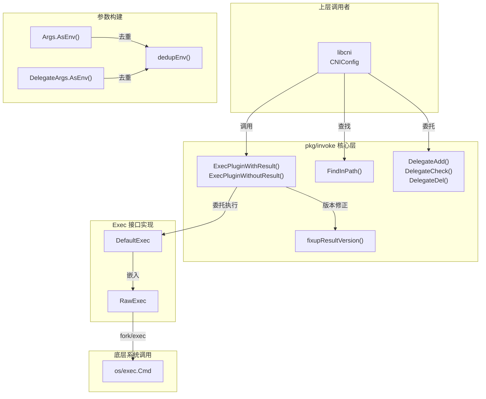
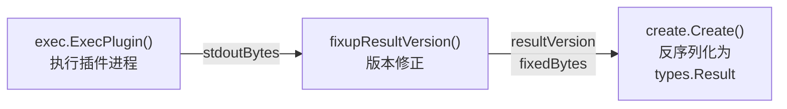
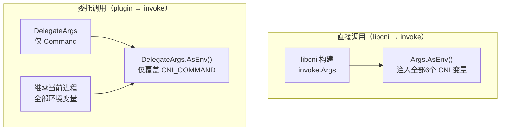

`pkg/invoke` 包是 CNI 项目中连接「配置世界」与「插件世界」的核心桥梁——它负责在文件系统中定位插件二进制文件，构造标准化的执行环境（stdin + env），以子进程方式调用插件，并将插件返回的原始 JSON 字节流反序列化为类型安全的 `types.Result` 对象。本文将从架构总览出发，逐层剖析插件查找、环境构建、进程调用、结果处理与委托调用五大子系统的实现细节，帮助高级开发者深入理解这一执行引擎的设计哲学与工程实践。

Sources: [find.go](pkg/invoke/find.go#L15-L22), [exec.go](pkg/invoke/exec.go#L15-L26), [raw_exec.go](pkg/invoke/raw_exec.go#L15-L28), [args.go](pkg/invoke/args.go#L15-L21), [delegate.go](pkg/invoke/delegate.go#L15-L23)

## 架构总览：分层设计与职责分离

invoke 包采用**三层抽象**的设计模式，将插件执行的不同关注点隔离到独立的类型中，同时通过 `Exec` 接口为上层调用者（如 [libcni 库](10-libcni-ku-yun-xing-shi-ji-cheng-de-wan-zheng-api-jie-kou)）提供统一的可测试契约。



这一分层设计的核心优势在于：**每一层都可以被独立替换和测试**。上层函数（如 `ExecPluginWithResult`）通过 `Exec` 接口与底层执行机制解耦；测试时只需注入 fake 实现，无需在临时目录下创建真实的可执行插件文件。

Sources: [exec.go](pkg/invoke/exec.go#L28-L35), [exec.go](pkg/invoke/exec.go#L175-L187), [raw_exec.go](pkg/invoke/raw_exec.go#L30-L32)

## 插件查找机制：FindInPath

### 查找算法

`FindInPath` 是插件发现的核心函数，它接收插件名称（如 `"bridge"`）和一个搜索路径列表（如 `["/opt/cni/bin", "/usr/libexec/cni"]`），返回插件的完整绝对路径。其查找遵循以下规则：

| 规则 | 说明 | 错误信息 |
|------|------|----------|
| 空插件名 | 拒绝空字符串 | `"no plugin name provided"` |
| 路径分隔符检测 | 禁止 `plugin` 参数包含 `/` 或 `\`，防止路径遍历攻击 | `"invalid plugin name: ..."` |
| 空路径列表 | 拒绝空搜索路径 | `"no paths provided"` |
| 多路径优先级 | 按路径列表顺序搜索，先找到即返回 | — |
| 跨平台扩展名 | Unix 无扩展名；Windows 尝试 `.exe` 后缀 | `"failed to find plugin ..."` |

Sources: [find.go](pkg/invoke/find.go#L25-L48)

### 跨平台扩展名处理

操作系统差异通过构建标签隔离在独立文件中。Unix 系统（包括 darwin、linux、freebsd 等）的可执行文件不要求扩展名，而 Windows 系统需要尝试 `.exe` 后缀：

```go
// os_unix.go — Unix 系统无扩展名
var ExecutableFileExtensions = []string{""}

// os_windows.go — Windows 优先尝试 .exe
var ExecutableFileExtensions = []string{".exe", ""}
```

查找循环对每个路径中的每个合法扩展名逐一尝试 `os.Stat`，只要找到一个**常规文件**（`fi.Mode().IsRegular()`）即返回。这意味着在 Windows 上，如果同时存在 `bridge` 和 `bridge.exe`，优先返回 `bridge.exe`（因为 `.exe` 排在扩展名列表首位）。

Sources: [os_unix.go](pkg/invoke/os_unix.go#L20-L21), [os_windows.go](pkg/invoke/os_windows.go#L17-L18), [find.go](pkg/invoke/find.go#L38-L44)

### 安全设计：路径遍历防护

`FindInPath` 通过 `strings.ContainsRune(plugin, os.PathSeparator)` 检测插件名是否包含路径分隔符。这一设计直接阻止了 `"../../etc/passwd"` 类的路径注入攻击。测试用例明确验证了这一点——当插件名包含 `..` + 路径分隔符时，函数返回 `"invalid plugin name"` 错误。

Sources: [find.go](pkg/invoke/find.go#L30-L32), [find_test.go](pkg/invoke/find_test.go#L103-L109)

## Exec 接口：可测试的执行契约

### 接口定义

`Exec` 接口封装了插件执行的三个核心操作，是整个 invoke 包最重要的抽象边界：

```go
type Exec interface {
    ExecPlugin(ctx context.Context, pluginPath string, stdinData []byte, environ []string) ([]byte, error)
    FindInPath(plugin string, paths []string) (string, error)
    Decode(jsonBytes []byte) (version.PluginInfo, error)
}
```

| 方法 | 职责 | 输入 | 输出 |
|------|------|------|------|
| `ExecPlugin` | 执行插件二进制 | 插件路径、stdin JSON、环境变量 | stdout 原始字节 |
| `FindInPath` | 定位插件文件 | 插件名、搜索路径 | 插件完整路径 |
| `Decode` | 解码版本信息 | 版本查询 JSON | `PluginInfo` |

Sources: [exec.go](pkg/invoke/exec.go#L28-L35)

### DefaultExec：生产环境实现

`DefaultExec` 是 `Exec` 接口的生产级实现，通过组合 `RawExec`（负责进程调用）和 `version.PluginDecoder`（负责版本解码）来满足接口契约：

```go
type DefaultExec struct {
    *RawExec
    version.PluginDecoder
}
```

包级变量 `defaultExec` 提供了一个全局默认实例，其 `Stderr` 输出被绑定到当前进程的标准错误。当上层函数的 `exec` 参数传入 `nil` 时，自动回退到该默认实例——这一设计既保证了便利性，又不失灵活性。

Sources: [exec.go](pkg/invoke/exec.go#L175-L187)

### Fake 实现：测试基础设施

`pkg/invoke/fakes` 包提供了完整的 fake 实现，采用 **"记录接收参数 + 返回预设值"** 的经典 spy 模式。`fakes.RawExec` 记录了 `ExecPlugin` 和 `FindInPath` 的调用输入，并返回预设的结果或错误。这一模式使得 `libcni` 和 `invoke` 自身的测试完全不需要在磁盘上创建真实的可执行文件。

Sources: [fakes/raw_exec.go](pkg/invoke/fakes/raw_exec.go#L19-L54), [fakes/cni_args.go](pkg/invoke/fakes/cni_args.go#L17-L27), [fakes/version_decoder.go](pkg/invoke/fakes/version_decoder.go#L19-L34)

## 环境变量构建：CNIArgs 体系

### 三种 CNIArgs 实现

invoke 包定义了 `CNIArgs` 接口及其三种实现，分别对应不同的使用场景：

| 类型 | 场景 | 行为 |
|------|------|------|
| `Args` | 标准插件调用（ADD/DEL/CHECK/GC/STATUS） | 继承进程环境 + 注入完整 CNI 变量 |
| `DelegateArgs` | 委托调用（仅覆盖 CNI_COMMAND） | 继承进程环境 + 仅覆盖命令字段 |
| `*inherited`（私有） | 从当前环境继承 | 返回 `nil`（os/exec 将继承全部环境） |

Sources: [args.go](pkg/invoke/args.go#L23-L29), [args.go](pkg/invoke/args.go#L31-L41), [args.go](pkg/invoke/args.go#L43-L74), [args.go](pkg/invoke/args.go#L87-L105)

### Args 的环境注入策略

`Args.AsEnv()` 的实现遵循一个关键原则：**自定义值必须追加到环境列表末尾，后出现的值覆盖先出现的同名变量**。具体步骤如下：

1. 获取当前进程全部环境变量 `os.Environ()`
2. 格式化 `PluginArgs`（键值对数组）为 `KEY1=VALUE1;KEY2=VALUE2` 格式的字符串
3. 追加六个标准 CNI 环境变量到列表末尾
4. 调用 `dedupEnv()` 去重，保留每个键的**最后一次出现**

```go
env = append(env,
    "CNI_COMMAND="+args.Command,
    "CNI_CONTAINERID="+args.ContainerID,
    "CNI_NETNS="+args.NetNS,
    "CNI_ARGS="+pluginArgsStr,
    "CNI_IFNAME="+args.IfName,
    "CNI_PATH="+args.Path,
)
return dedupEnv(env)
```

测试用例精确验证了这一行为：当进程环境中已存在 `CNI_COMMAND=DEL`，而 `Args` 设置 `Command: "ADD"` 时，最终环境中只有 `CNI_COMMAND=ADD`，原来的 `DEL` 被覆盖。

Sources: [args.go](pkg/invoke/args.go#L56-L74), [args_test.go](pkg/invoke/args_test.go#L37-L69)

### dedupEnv：去重算法

`dedupEnv` 的实现简洁但精确：遍历环境变量列表，以第一个 `=` 为分隔符拆分键值对，存入 map（天然去重），然后从 map 重建列表。对于不含 `=` 的异常条目，直接保留不变。

Sources: [args.go](pkg/invoke/args.go#L107-L128)

### DelegateArgs：最小化覆盖

委托调用场景下，插件已在执行上下文中（环境变量已包含 CNI 参数），只需覆盖 `CNI_COMMAND` 为目标操作。`DelegateArgs` 仅追加一条 `"CNI_COMMAND=" + d.Command`，再经 `dedupEnv` 去重。这使得 `DelegateAdd` 可以在非 ADD 上下文中正确地将命令强制设为 ADD。

Sources: [args.go](pkg/invoke/args.go#L87-L105), [delegate.go](pkg/invoke/delegate.go#L84-L89)

## 插件调用：RawExec 进程管理

### 进程执行模型

`RawExec.ExecPlugin` 是整个引擎中最接近操作系统的一层。它使用 Go 标准库的 `exec.CommandContext` 创建子进程，将 stdin、stdout、stderr 分别绑定到 `bytes.Buffer`，实现全双工的管道通信：

```go
c := exec.CommandContext(ctx, pluginPath)
c.Env = environ          // 完全替换子进程环境
c.Stdin = bytes.NewBuffer(stdinData)
c.Stdout = stdout
c.Stderr = stderr
```

**关键设计决策**：`c.Env = environ` 意味着子进程**不会继承**父进程的环境变量——环境完全由 `CNIArgs.AsEnv()` 构建的列表决定。这确保了插件执行环境的确定性和隔离性。

Sources: [raw_exec.go](pkg/invoke/raw_exec.go#L34-L41)

### "text file busy" 重试机制

当插件二进制正在被写入（如升级过程中）时，Linux 内核会返回 `ETXTBSY` 错误，Go 的 `os/exec` 将其包装为包含 `"text file busy"` 字符串的错误。`RawExec` 对此实现了指数退避式重试：最多重试 5 次，每次间隔 1 秒。这一机制对 Kubernetes 等滚动升级场景至关重要，避免因短暂的文件写入竞争导致插件调用失败。

Sources: [raw_exec.go](pkg/invoke/raw_exec.go#L43-L61)

### 错误处理与诊断信息

`pluginErr` 方法将插件的原始错误输出转换为结构化的 `types.Error` 对象，处理三种情况：

| 场景 | stdout | stderr | 错误消息 |
|------|--------|--------|----------|
| 无任何输出 | 空 | 空 | `"netplugin failed with no error message: ..."` |
| 仅 stderr | 空 | 非空 | `"netplugin failed: \"<stderr>\": ..."` |
| stdout 有 JSON | 含 CNI Error JSON | — | 解析后的 `types.Error` |

如果 stdout 包含的 JSON 可以被解析为 `types.Error`（即包含 `code`、`msg`、`details` 字段），则直接返回该结构化错误；否则将 stdout 内容作为诊断信息包装在错误消息中。

Sources: [raw_exec.go](pkg/invoke/raw_exec.go#L72-L84)

### Stderr 转发

当 `RawExec.Stderr` 字段被设置（生产环境中默认绑定到 `os.Stderr`）且插件确实输出了 stderr 内容时，这些内容会被转发到调用者提供的 writer 中。这对于调试和日志收集非常有用——插件的诊断性输出不会丢失。

Sources: [raw_exec.go](pkg/invoke/raw_exec.go#L63-L68)

## 结果处理：版本修正与类型创建

### ExecPluginWithResult 的完整流程

`ExecPluginWithResult` 是带返回值的插件调用入口，其处理管线包含三个阶段：



1. **执行**：通过 `Exec` 接口调用插件，获取 stdout 原始字节
2. **版本修正**：`fixupResultVersion` 确保结果 JSON 包含正确的 `cniVersion`
3. **反序列化**：`create.Create` 根据版本号选择对应的类型（020/040/100），将 JSON 解码为强类型 Result

Sources: [exec.go](pkg/invoke/exec.go#L121-L137)

### fixupResultVersion：向后兼容的版本补全

`fixupResultVersion` 解决了一个在 [CNI 规范演进](4-cni-gui-fan-yan-jin-li-shi-yu-ban-ben-chai-yi-lan) 中常见的兼容性问题。根据 CNI 规范，插件应当返回与配置相同版本的结果，但旧版插件可能输出不带 `cniVersion` 字段的结果。该函数的处理逻辑如下：

| 结果中的 cniVersion | 处理方式 | 返回的版本 |
|---------------------|----------|------------|
| 存在且非空 | 直接使用 | 结果中的版本 |
| 存在但为空字符串 | 替换为配置版本 | 配置中的 `cniVersion` |
| 不存在 | 注入配置版本 | 配置中的 `cniVersion` |
| 结果为 `null` | 创建空 map 后注入 | 配置中的 `cniVersion` |

函数首先通过 `version.ConfigDecoder` 解码配置中的 `cniVersion`，然后对结果进行原始 JSON map 解析。如果结果的 `cniVersion` 缺失或为空，则手动注入配置版本并重新序列化。这一设计确保了 `create.Create` 总能拿到一个有效的版本号来选择正确的类型解码器。

Sources: [exec.go](pkg/invoke/exec.go#L41-L78)

### ExecPluginWithoutResult：无返回值调用

对于 `DEL`、`CHECK`、`GC`、`STATUS` 操作，插件不返回结构化结果（或调用者不关心返回值），`ExecPluginWithoutResult` 简化为直接调用 `exec.ExecPlugin` 并忽略 stdout 字节。错误处理仍然完整保留——插件的执行错误会正常传播。

Sources: [exec.go](pkg/invoke/exec.go#L139-L145)

## GetVersionInfo：版本探测

`GetVersionInfo` 通过向插件发送 `VERSION` 命令来探测其支持的 CNI 规范版本。该函数构造一个最小化的调用参数（`Command: "VERSION"`，`NetNS/IfName/Path` 设为 `"dummy"` 以兼容旧版 [skel 骨架包](13-skel-gu-jia-bao-gou-jian-cni-cha-jian-de-qi-dian)），stdin 传入当前库版本的 JSON：

```go
stdin := []byte(fmt.Sprintf(`{"cniVersion":%q}`, version.Current()))
```

对于不支持 `VERSION` 命令的远古插件（返回 `"unknown CNI_COMMAND: VERSION"` 错误），函数优雅降级，报告其仅支持 `"0.1.0"` 版本。这一机制使得 [版本协商与兼容性校验](15-ban-ben-xie-shang-yu-jian-rong-xing-xiao-yan-ji-zhi) 能够覆盖所有插件。

Sources: [exec.go](pkg/invoke/exec.go#L147-L173)

## 委托调用机制

### 设计意图

委托调用（Delegation）允许一个 CNI 插件调用另一个 CNI 插件完成特定任务，最典型的场景是主插件调用 IPAM 插件进行 IP 地址分配。`delegate.go` 封装了这一过程，确保委托调用遵循正确的协议：

- **环境继承**：委托调用继承当前进程的全部 CNI 环境变量
- **命令覆盖**：仅替换 `CNI_COMMAND` 为目标操作
- **路径查找**：从 `CNI_PATH` 环境变量解析搜索路径

Sources: [delegate.go](pkg/invoke/delegate.go#L25-L37)

### 五大委托函数

| 函数 | 命令 | 返回值 | 用途 |
|------|------|--------|------|
| `DelegateAdd` | ADD | `types.Result` | IPAM 分配等 |
| `DelegateCheck` | CHECK | 无 | 检查委托结果 |
| `DelegateDel` | DEL | 无 | IPAM 释放等 |
| `DelegateGC` | GC | 无 | 垃圾回收 |
| `DelegateStatus` | STATUS | 无 | 状态查询 |

`DelegateAdd` 直接调用 `ExecPluginWithResult` 获取结构化结果；其余四个操作通过内部函数 `delegateNoResult` 统一走 `ExecPluginWithoutResult` 路径。所有委托函数共享 `delegateCommon` 进行插件路径查找，并从环境变量 `CNI_PATH` 中解析搜索目录。

Sources: [delegate.go](pkg/invoke/delegate.go#L39-L89)

### 委托 vs 直接调用：环境传递差异



直接调用时，`libcni` 通过 `CNIConfig.args()` 构造完整的 `invoke.Args`，显式设置所有 CNI 环境变量；而委托调用时，插件已在 CNI 执行上下文中运行，`DelegateArgs` 仅覆盖 `CNI_COMMAND`，其余变量（如 `CNI_CONTAINERID`、`CNI_NETNS`）从当前进程环境继承。这一差异使得委托调用可以保留原始调用者的上下文信息。

Sources: [delegate.go](pkg/invoke/delegate.go#L84-L89), [libcni/api.go](libcni/api.go#L891-L900)

## 上层集成：libcni 如何使用 invoke

`libcni` 中的 `CNIConfig` 通过组合 `invoke.Exec` 接口来驱动插件执行。以 `addNetwork` 为例，完整的调用链路如下：

1. **ensureExec**：懒初始化 `Exec` 实例（如未提供，创建 `DefaultExec`）
2. **FindInPath**：根据 `net.Network.Type`（如 `"bridge"`）在 `c.Path` 中查找插件
3. **参数校验**：校验 ContainerID、网络名、接口名的合法性
4. **buildOneConfig**：注入 `name`、`cniVersion`、`prevResult` 和 `runtimeConfig`
5. **ExecPluginWithResult**：以 `ADD` 命令调用插件，获取并反序列化结果

`CNIConfig.args()` 方法将 `RuntimeConf` 转换为 `invoke.Args`，其中 `Path` 字段通过 `strings.Join(c.Path, string(os.PathListSeparator))` 将多个搜索路径合并为单个字符串（如 `"/opt/cni/bin:/usr/libexec/cni"`）。

Sources: [libcni/api.go](libcni/api.go#L490-L512), [libcni/api.go](libcni/api.go#L214-L223), [libcni/api.go](libcni/api.go#L891-L900)

## 文件结构与职责一览

| 文件 | 核心导出类型/函数 | 职责 |
|------|-------------------|------|
| `find.go` | `FindInPath()` | 在路径列表中搜索插件二进制 |
| `exec.go` | `Exec` 接口、`DefaultExec`、`ExecPluginWithResult/WithoutResult`、`GetVersionInfo` | 执行抽象层与结果处理 |
| `raw_exec.go` | `RawExec` | 进程级插件调用（fork/exec） |
| `args.go` | `CNIArgs`、`Args`、`DelegateArgs`、`ArgsFromEnv()` | 环境变量构建 |
| `delegate.go` | `DelegateAdd/Check/Del/GC/Status` | 委托调用入口 |
| `os_unix.go` | `ExecutableFileExtensions` | Unix 平台扩展名 |
| `os_windows.go` | `ExecutableFileExtensions` | Windows 平台扩展名 |
| `fakes/` | `RawExec`、`CNIArgs`、`VersionDecoder` | 测试用 spy 实现 |

Sources: [find.go](pkg/invoke/find.go), [exec.go](pkg/invoke/exec.go), [raw_exec.go](pkg/invoke/raw_exec.go), [args.go](pkg/invoke/args.go), [delegate.go](pkg/invoke/delegate.go)

## 延伸阅读

- 了解 invoke 在 libcni 中的完整调用流程，参阅 [libcni 库：运行时集成的完整 API 接口](10-libcni-ku-yun-xing-shi-ji-cheng-de-wan-zheng-api-jie-kou)
- 理解插件如何接收和处理 invoke 传递的 stdin/env，参阅 [skel 骨架包：构建 CNI 插件的起点](13-skel-gu-jia-bao-gou-jian-cni-cha-jian-de-qi-dian)
- 深入了解 `types.Result` 的多版本类型系统，参阅 [类型系统：多版本类型定义与自动转换](14-lei-xing-xi-tong-duo-ban-ben-lei-xing-ding-yi-yu-zi-dong-zhuan-huan)
- 掌握委托调用的上层协议设计，参阅 [插件委托调用：IPAM 及其他委托插件集成](20-cha-jian-wei-tuo-diao-yong-ipam-ji-qi-ta-wei-tuo-cha-jian-ji-cheng)