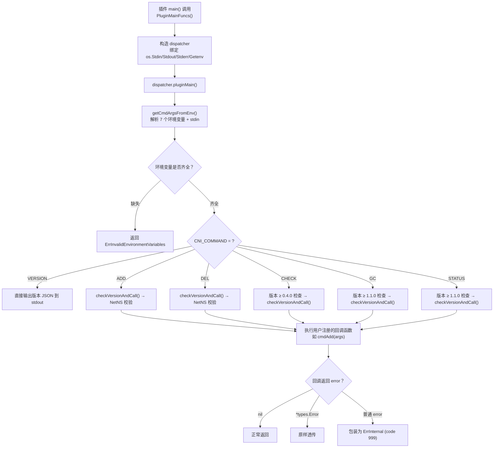
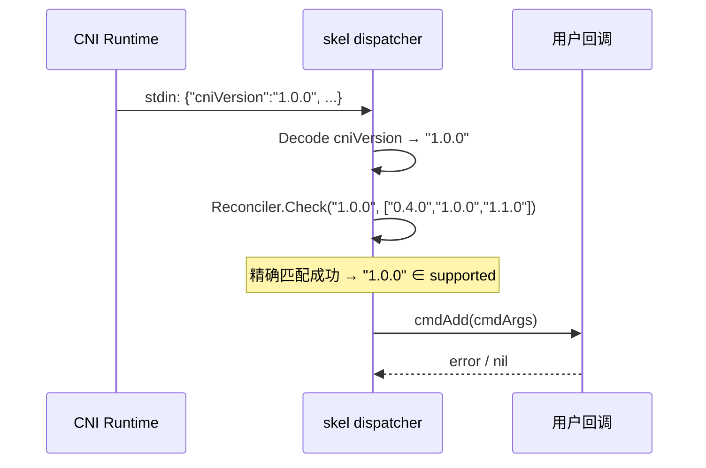
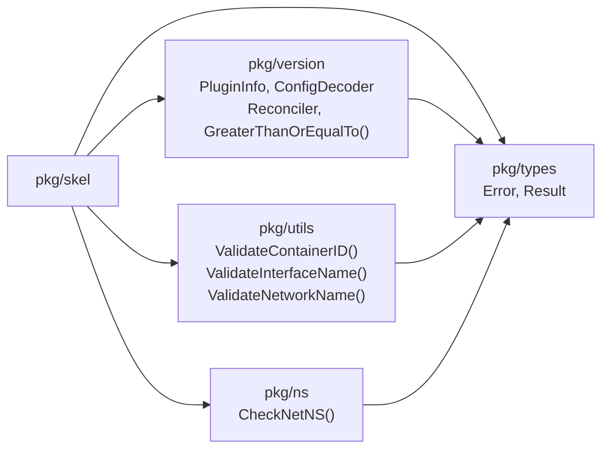

`pkg/skel` 是 CNI 项目中最贴近插件开发者的核心包——它封装了 CNI 协议规定的所有"仪式性"工作：环境变量解析、stdin 配置读取、输入校验、版本协商以及命令分发，让开发者只需关注 `ADD`、`DEL`、`CHECK` 等回调函数的具体业务逻辑。如果你曾好奇为什么一个 CNI 插件的 `main()` 函数可以短到只有一行调用，答案就在 `skel` 中。

Sources: [skel.go](pkg/skel/skel.go#L15-L17)

## 架构总览：从 `main()` 到你的回调

在深入每一层之前，先建立对 `skel` 整体流程的宏观认知。下图展示了一个 CNI 插件从启动到执行用户回调的完整数据流：



整个流程的核心设计理念是**契约前置**：在执行任何用户代码之前，`skel` 已经完成了所有前置条件的验证。这意味着你的回调函数接收到的 `CmdArgs` 是经过完整校验的，你可以安全地直接使用其中字段。

Sources: [skel.go](pkg/skel/skel.go#L232-L346)

## 核心类型：插件与框架之间的数据契约

### CmdArgs —— 传递给回调的唯一参数

`CmdArgs` 是 `skel` 与插件业务逻辑之间的核心数据结构，它将环境变量和 stdin 数据统一打包为一个 Go 结构体：

| 字段 | 来源 | 说明 |
|------|------|------|
| `ContainerID` | `CNI_CONTAINERID` | 容器标识符，经字符校验 |
| `Netns` | `CNI_NETNS` | 网络命名空间路径 |
| `IfName` | `CNI_IFNAME` | 接口名，经长度/字符校验 |
| `Args` | `CNI_ARGS` | 额外键值对参数（可选） |
| `Path` | `CNI_PATH` | CNI 插件搜索路径 |
| `NetnsOverride` | `CNI_NETNS_OVERRIDE` | 命名空间覆盖标志（可选） |
| `StdinData` | stdin | 完整的网络配置 JSON 字节流 |

Sources: [skel.go](pkg/skel/skel.go#L35-L45)

### CNIFuncs —— 回调函数集合

`CNIFuncs` 采用结构体方式组织五个 CNI 命令对应的回调函数，每个回调的签名统一为 `func(*CmdArgs) error`。开发者只需为自己关心的命令注册回调，不需要的命令留 `nil` 即可：

```go
type CNIFuncs struct {
    Add    func(_ *CmdArgs) error
    Del    func(_ *CmdArgs) error
    Check  func(_ *CmdArgs) error
    GC     func(_ *CmdArgs) error
    Status func(_ *CmdArgs) error
}
```

Sources: [skel.go](pkg/skel/skel.go#L366-L374)

### dispatcher —— 内部调度引擎

`dispatcher` 是 `skel` 包的内部核心，不对外导出。它的设计采用了**依赖注入**模式，通过 `Getenv`、`Stdin`、`Stdout`、`Stderr` 四个接口字段解耦了对操作系统的直接依赖。正是这种设计使得测试可以完全在内存中完成，无需真正设置环境变量或启动进程：

```go
type dispatcher struct {
    Getenv func(string) string    // 默认绑定 os.Getenv
    Stdin  io.Reader              // 默认绑定 os.Stdin
    Stdout io.Writer              // 默认绑定 os.Stdout
    Stderr io.Writer              // 默认绑定 os.Stderr

    ConfVersionDecoder version.ConfigDecoder
    VersionReconciler  version.Reconciler
}
```

Sources: [skel.go](pkg/skel/skel.go#L47-L55)

## 入口函数：四种选择，两条演进路径

`skel` 包提供了两代入口函数，推荐使用新一代 `CNIFuncs` 系列API：

| 函数 | 错误处理 | 状态 | 说明 |
|------|---------|------|------|
| `PluginMainFuncs()` | 自动打印 JSON 错误 + `os.Exit(1)` | ✅ 推荐 | 接受 `CNIFuncs` 结构体，支持全部 5 种命令 |
| `PluginMainFuncsWithError()` | 返回 `*types.Error`，由调用者处理 | ✅ 推荐 | 适合需要自定义错误处理的场景 |
| `PluginMain()` | 自动打印 JSON 错误 + `os.Exit(1)` | ⚠️ Deprecated | 旧版 API，仅接受 Add/Check/Del 三个独立函数 |
| `PluginMainWithError()` | 返回 `*types.Error` | ⚠️ Deprecated | 旧版 API 的手动错误处理变体 |

旧版函数内部直接转发到新版实现，例如 `PluginMainWithError` 会将三个独立回调函数包装成 `CNIFuncs` 结构体再调用 `PluginMainFuncsWithError`。两个自动错误处理函数（`PluginMain` 和 `PluginMainFuncs`）的行为一致：当回调返回错误时，将错误以 JSON 格式打印到 stdout，然后调用 `os.Exit(1)`。

Sources: [skel.go](pkg/skel/skel.go#L348-L439)

## 环境变量解析与校验

### 七个环境变量的命令级需求矩阵

`getCmdArgsFromEnv()` 是整个调度流程的第一步，它通过一个声明式的结构体切片定义了每个环境变量在不同命令下的需求状态：

| 环境变量 | ADD | CHECK | DEL | GC | STATUS | VERSION | 校验函数 |
|----------|-----|-------|-----|----|--------|---------|---------|
| `CNI_COMMAND` | ✅ | ✅ | ✅ | ✅ | ✅ | ✅ | — |
| `CNI_CONTAINERID` | ✅ | ✅ | ✅ | ❌ | ❌ | ❌ | `ValidateContainerID` |
| `CNI_NETNS` | ✅ | ✅ | 可选 | ❌ | ❌ | ❌ | — |
| `CNI_IFNAME` | ✅ | ✅ | ✅ | ❌ | ❌ | ❌ | `ValidateInterfaceName` |
| `CNI_ARGS` | 可选 | 可选 | 可选 | ❌ | ❌ | ❌ | — |
| `CNI_PATH` | ✅ | ✅ | ✅ | ✅ | ✅ | ❌ | — |
| `CNI_NETNS_OVERRIDE` | 可选 | 可选 | 可选 | ❌ | ❌ | ❌ | — |

表格中 ✅ 表示该命令**必需**此变量，❌ 表示**不需要**（缺失不报错），"可选"表示该变量存在于 `reqForCmd` 映射中但值为 `false`。一个值得注意的设计细节是：`DEL` 命令的 `CNI_NETNS` 被标记为可选（`false`），这是因为在删除操作时，网络命名空间可能已经被销毁了。

Sources: [skel.go](pkg/skel/skel.go#L59-L161)

### 输入校验的防御层

环境变量校验采用了两层防御策略：

**第一层：字符格式校验**（由 `pkg/utils` 提供）。`ValidateContainerID` 使用正则 `^[a-zA-Z0-9][a-zA-Z0-9_.\-]*$` 确保容器 ID 只含合法字符。`ValidateInterfaceName` 实现了四条 Linux 内核规则——长度不超过 15、不能为 `.` 或 `..`、不能包含 `/`、`:` 或空白字符。这些校验参考了 Linux 内核 `net/core/dev.c` 中的接口名验证逻辑。

**第二层：配置 JSON 校验**。`validateConfig()` 从 stdin 数据中解析出 `name` 字段，确保网络配置必须包含合法的网络名称（同样使用 `cniValidNameChars` 正则校验），缺失时返回 `ErrInvalidNetworkConfig` 错误。

Sources: [utils.go](pkg/utils/utils.go#L26-L82), [skel.go](pkg/skel/skel.go#L216-L230)

## 版本协商机制

### ADD 和 DEL：精确匹配协商

对于 `ADD` 和 `DEL` 命令，`skel` 通过 `checkVersionAndCall()` 执行版本协商。流程是：首先从 stdin 配置中解码 `cniVersion`，然后使用 `Reconciler.Check()` 检查该版本是否在插件声明的支持列表中。这个检查是**精确匹配**——配置的版本字符串必须与插件支持列表中某一个完全一致。



Sources: [skel.go](pkg/skel/skel.go#L190-L214), [reconcile.go](pkg/version/reconcile.go#L32-L49)

### CHECK、GC、STATUS：最低版本门槛 + 版本协商

这三个命令的版本检查逻辑更为严格，分为两道关卡：

1. **配置版本门槛检查**：配置中的 `cniVersion` 必须大于等于该命令引入的最低版本（`CHECK ≥ 0.4.0`，`GC/STATUS ≥ 1.1.0`）。低于此版本直接返回 `ErrIncompatibleCNIVersion`。
2. **插件版本能力检查**：遍历插件声明的支持版本列表，检查是否存在至少一个插件版本 ≥ 配置版本。只有满足条件，才调用 `checkVersionAndCall()` 执行精确匹配协商。

这种双重检查的设计确保了：即使插件声明支持某个高版本，如果配置要求的命令在该配置版本中尚未定义（例如用 `0.3.0` 配置请求 `CHECK`），也会被正确拒绝。

Sources: [skel.go](pkg/skel/skel.go#L258-L336)

## 命名空间安全检查

对于 `ADD` 和 `DEL` 命令，`skel` 在成功执行用户回调之后，还会额外进行一项**命名空间隔离校验**——通过 `ns.CheckNetNS()` 检查 `CNI_NETNS` 指定的命名空间是否恰好是插件自身运行的命名空间。如果是，则返回 `ErrInvalidNetNS` 错误，因为这意味着插件试图操作的"容器网络命名空间"实际上就是自己的命名空间，这在逻辑上是错误的。

此检查可通过 `CNI_NETNS_OVERRIDE` 环境变量设置为 `TRUE` 或 `1` 来跳过，适用于某些特殊场景。需要注意的是，`CheckNetNS` 的实现是平台相关的：在 Linux 上通过 `vishvananda/netns` 库比较命名空间句柄；在 macOS 和 Windows 上，由于不支持 Linux 风格的网络命名空间，该函数始终返回 `(false, nil)`，即不做实际检查。

Sources: [skel.go](pkg/skel/skel.go#L250-L257), [ns_linux.go](pkg/ns/ns_linux.go#L35-L50), [ns_darwin.go](pkg/ns/ns_darwin.go#L19-L21)

## 错误处理策略

`skel` 的错误处理遵循 CNI 规范中关于错误码的约定。当用户回调返回错误时，`checkVersionAndCall()` 会区分两种情况：

- 如果返回的是 `*types.Error` 类型，**原样透传**，不做任何包装。这允许插件开发者使用精确的错误码（如 `ErrTryAgainLater`）向运行时传递语义化信息。
- 如果返回的是普通 `error`，则统一包装为 `types.Error{Code: ErrInternal, Msg: err.Error()}`。这保证了所有输出到 stdout 的错误都具有标准化的 JSON 结构。

Sources: [skel.go](pkg/skel/skel.go#L204-L211)

`skel` 内部各阶段使用的错误码汇总如下：

| 错误码 | 数值 | 触发场景 |
|--------|------|---------|
| `ErrInvalidEnvironmentVariables` | 4 | 环境变量缺失或格式非法 |
| `ErrIOFailure` | 5 | 读取 stdin 失败或 VERSION 输出失败 |
| `ErrDecodingFailure` | 6 | 配置 JSON 解码失败或版本号解析失败 |
| `ErrInvalidNetworkConfig` | 7 | 配置缺少 `name` 字段或网络名非法 |
| `ErrIncompatibleCNIVersion` | 1 | 配置版本与插件支持版本不匹配 |
| `ErrInvalidNetNS` | 8 | 插件命名空间与目标命名空间相同 |
| `ErrInternal` | 999 | 回调返回非 `types.Error` 类型的错误 |

Sources: [types.go](pkg/types/types.go#L233-L247)

## VERSION 命令与 About 字符串

`VERSION` 命令是一个特殊的"元命令"——它不涉及任何用户回调。当 `CNI_COMMAND` 为 `VERSION` 时，`skel` 会将 `Stdin` 替换为空 reader（不读取任何配置），然后直接将版本信息 JSON 编码输出到 stdout。输出格式为：

```json
{
    "cniVersion": "1.1.0",
    "supportedVersions": ["0.1.0", "0.2.0", "0.3.0", "0.3.1", "0.4.0", "1.0.0", "1.1.0"]
}
```

另一个特殊场景是当 `CNI_COMMAND` 环境变量**完全缺失**时。如果调用者提供了非空的 `about` 字符串（如 `"CNI bridge plugin v1.2.0"`），`skel` 会将 about 字符串和支持的版本列表打印到 stderr 然后正常退出；如果 about 为空，则返回环境变量缺失错误。这为插件提供了一种"无参数调用时显示帮助信息"的机制。

Sources: [skel.go](pkg/skel/skel.go#L232-L242), [skel.go](pkg/skel/skel.go#L337-L340)

## 实战：参考插件的 skel 集成模式

### 模式一：旧版 API（Debug 插件）

Debug 插件使用已废弃的 `PluginMain` 三参数形式，这是最简洁的集成方式，仅注册 `Add`、`Check`、`Del` 三个命令：

```go
func main() {
    skel.PluginMain(cmdAdd, cmdCheck, cmdDel, version.All, bv.BuildString("none"))
}
```

Sources: [debug/main.go](plugins/debug/main.go#L41-L43)

### 模式二：新版 API（Noop 测试插件）

Noop 插件使用推荐的 `PluginMainFuncs` + `CNIFuncs` 形式，注册了全部五个命令回调，包括 CNI 1.1.0 新增的 `GC` 和 `STATUS`：

```go
func main() {
    stdinData, _ := saveStdin()
    supportedVersions := debugGetSupportedVersions(stdinData)
    skel.PluginMainFuncs(skel.CNIFuncs{
        Add:    cmdAdd,
        Check:  cmdCheck,
        Del:    cmdDel,
        GC:     cmdGC,
        Status: cmdStatus,
    }, version.PluginSupports(supportedVersions...), "CNI noop plugin v0.7.0")
}
```

注意这里使用 `version.PluginSupports()` 动态构建版本信息，而不是直接使用 `version.All`，因为 Noop 插件在测试中需要根据调试配置动态调整支持的版本列表。

Sources: [noop/main.go](plugins/test/noop/main.go#L248-L263)

## 包依赖关系图

`skel` 包依赖了 CNI 生态中多个子包，下图展示了它们之间的调用关系：



每个外部依赖都有明确的职责边界：`pkg/utils` 负责纯输入校验，`pkg/ns` 负责命名空间操作（平台相关），`pkg/version` 负责版本编解码和协商逻辑，`pkg/types` 提供公共的错误码和数据类型定义。这种分层设计使得 `skel` 本身保持精简——核心调度逻辑不到 350 行代码。

Sources: [skel.go](pkg/skel/skel.go#L19-L33)

## 延伸阅读

`skel` 骨架包解决的是"如何正确启动一个 CNI 插件"的问题。要理解更完整的图景，建议继续阅读：

- [插件执行引擎：查找、调用与结果处理](12-cha-jian-zhi-xing-yin-qing-cha-zhao-diao-yong-yu-jie-guo-chu-li) —— 了解 `libcni` 如何调用基于 `skel` 构建的插件
- [版本协商与兼容性校验机制](15-ban-ben-xie-shang-yu-jian-rong-xing-xiao-yan-ji-zhi) —— 深入理解 `Reconciler` 和 `ConfigDecoder` 的实现细节
- [从零开发一个 CNI 插件](18-cong-ling-kai-fa-ge-cni-cha-jian) —— 基于 `skel` 包的完整插件开发教程
- [Debug 插件源码解析与测试技巧](19-debug-cha-jian-yuan-ma-jie-xi-yu-ce-shi-ji-qiao) —— 分析使用 `skel` 的实际插件实现