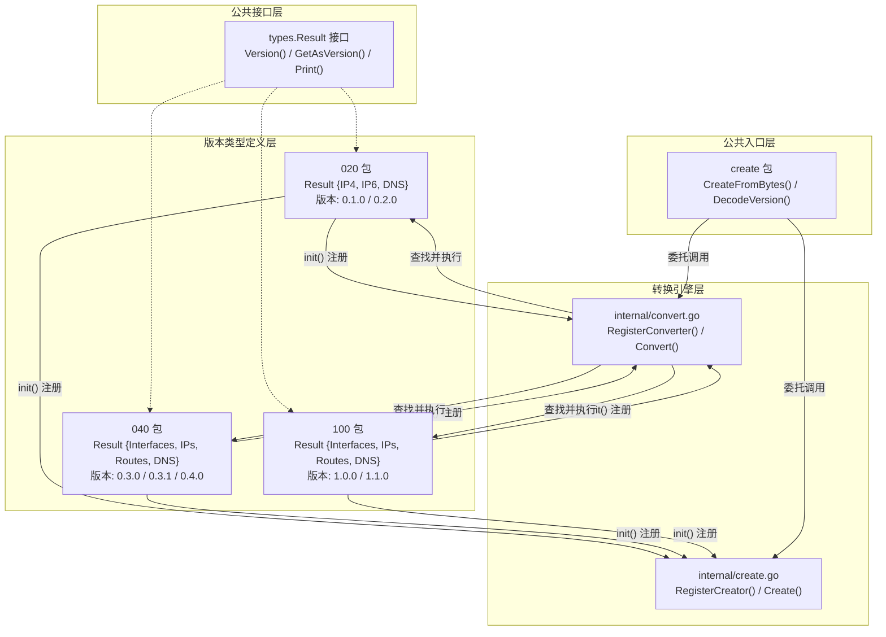
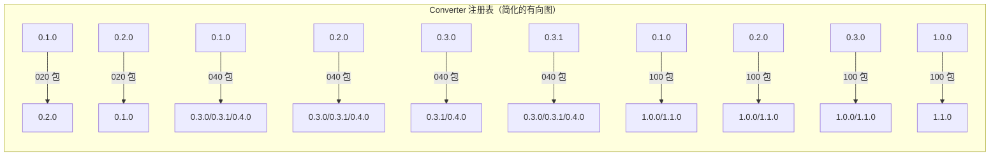
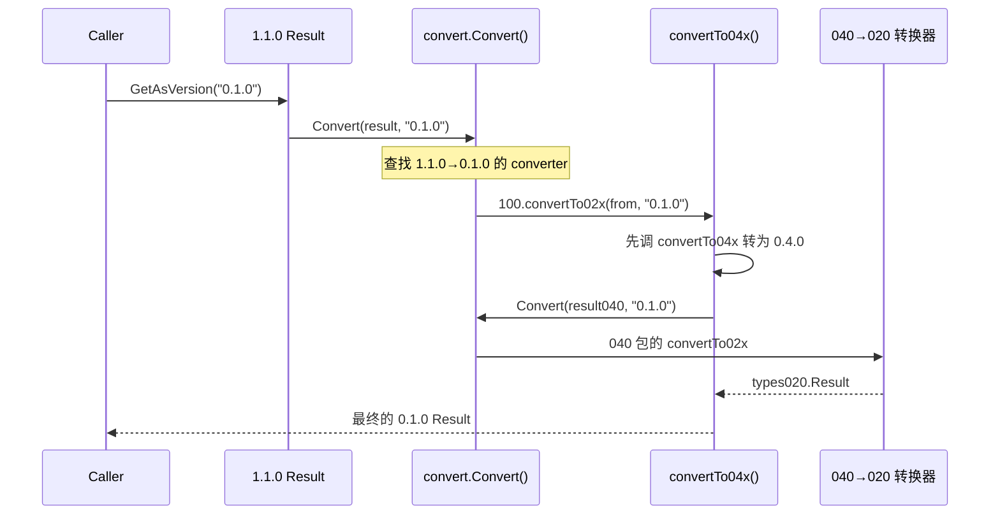

CNI 的类型系统是该库中最精妙的设计之一：它在 `pkg/types` 下构建了一套**三层版本化类型体系**，配合**注册式转换引擎**，实现了从 0.1.0 到 1.1.0 共七个规范版本之间的无缝互操作。本文将深入解析这套类型系统的架构设计、转换注册机制以及降级/升级的实际数据流。

## 全局架构概览

类型系统的核心矛盾在于：不同 CNI 规范版本的 `Result` 结构体字段差异显著——从 0.1.0 的 `ip4`/`ip6` 分离模型，到 0.3.0+ 的统一 `ips` 数组模型，再到 1.0.0+ 新增的 `Interface` 扩展字段。CNI 的解决方案是**每种版本族定义独立类型，通过注册中心驱动的函数表完成转换**。



Sources: [types.go](pkg/types/types.go#L128-L142), [convert.go](pkg/types/internal/convert.go#L28-L36), [create.go](pkg/types/internal/create.go#L23-L29), [create.go](pkg/types/create/create.go#L15-L26)

## 核心接口：types.Result

所有版本的具体 Result 类型都必须实现 `types.Result` 接口。这是类型系统多态性的根基——libcni、skel、invoke 等上层包只依赖这个接口，从不直接引用具体版本类型。

```go
type Result interface {
    Version() string                                    // 该 Result 实例的原生版本
    GetAsVersion(version string) (Result, error)        // 转换为目标版本
    Print() error                                       // JSON 输出到 stdout
    PrintTo(writer io.Writer) error                     // JSON 输出到指定 Writer
}
```

`GetAsVersion` 是整个转换系统的入口。每个具体版本类型的实现逻辑完全一致：先补全可能为空的 `CNIVersion` 字段，然后委托给 `convert.Convert()` 查找注册表中的转换函数并执行。`PrintResult` 辅助函数则将"转换 + 输出"封装为一步操作。

Sources: [types.go](pkg/types/types.go#L128-L150)

## 三个版本族的类型定义

CNI 的七个规范版本被归入三个版本族，每个族由独立的 Go 包承载。下表对比了三个版本族的关键差异：

| 维度 | 020 包 (`types020`) | 040 包 (`types040`) | 100 包 (`types100`) |
|------|---------------------|---------------------|---------------------|
| **覆盖版本** | 0.1.0, 0.2.0 | 0.3.0, 0.3.1, 0.4.0 | 1.0.0, 1.1.0 |
| **IP 组织方式** | `IP4` / `IP6` 分离字段 | 统一 `IPs` 数组 | 统一 `IPs` 数组 |
| **IPConfig 标识** | 无版本字段 | `Version` 字段（"4"/"6"） | 无版本字段，按地址自动推断 |
| **Interface 字段** | 不支持 | `Name`, `Mac`, `Sandbox` | 增加 `Mtu`, `SocketPath`, `PciID` |
| **路由归属** | 嵌入各 IPConfig 内 | Result 级独立 `Routes` | Result 级独立 `Routes` |
| **多 IP 支持** | 每个 IP 版本仅一个 | 支持多个 | 支持多个 |

Sources: [020/types.go](pkg/types/020/types.go#L103-L108), [040/types.go](pkg/types/040/types.go#L86-L92), [100/types.go](pkg/types/100/types.go#L90-L96)

### 0.1.0/0.2.0：分离式 IP 模型

最早期版本的 Result 结构体用 `IP4` 和 `IP6` 两个独立字段来存放 IP 配置，路由直接嵌入各自的 `IPConfig` 内部。这意味着每个 IP 版本只能表达**一个** IP 地址和一组路由。`NewResult` 函数处理了一个重要的兼容性细节：当 JSON 中 `cniVersion` 为空字符串时，自动默认为 `"0.1.0"`。该包在 `init()` 中注册了 0.1.0 ↔ 0.2.0 之间的双向转换器，并将自身注册为空字符串、`"0.1.0"` 和 `"0.2.0"` 三个版本的 Creator。

Sources: [020/types.go](pkg/types/020/types.go#L28-L39), [020/types.go](pkg/types/020/types.go#L103-L141)

### 0.3.0/0.3.1/0.4.0：统一列表模型

这是类型系统的**范式转换**。`IP4`/`IP6` 分离字段被替换为统一的 `IPs []*IPConfig` 列表，`IPConfig` 新增 `Version` 字段（值为 `"4"` 或 `"6"`）用于标识 IP 协议版本。路由从 IPConfig 内部提升到 Result 级别的独立 `Routes` 列表。同时新增了 `Interfaces` 列表来描述网络接口信息。

`init()` 注册了四个方向的转换路径：从 0.1.0/0.2.0 上行转换到 0.3.x/0.4.0、0.3.x 内部互转、从 0.4.0 下行到 0.3.x、从 0.3.x/0.4.0 下行到 0.1.0/0.2.0。`convertFrom02x` 函数将 `IP4`/`IP6` 字段拆解为带 `Version` 标记的 IPConfig 列表条目，并合并路由；`convertTo02x` 则执行反向操作，但仅取每种 IP 版本的**第一个**地址，这意味着降级时会**丢失**多余 IP 信息。

Sources: [040/types.go](pkg/types/040/types.go#L29-L49), [040/types.go](pkg/types/040/types.go#L102-L192)

### 1.0.0/1.1.0：扩展字段模型

1.0.0 和 1.1.0 的类型定义完全相同（注释明确标注 "The types did not change between v1.0 and v1.1"），仅在 `ImplementedSpecVersion` 常量上体现差异。这一版的 `IPConfig` 移除了 `Version` 字段——因为 IP 版本可以从地址本身推断（`To4() != nil` 即为 IPv4）。`Interface` 结构体扩展了 `Mtu`、`SocketPath`、`PciID` 三个新字段。

Sources: [100/types.go](pkg/types/100/types.go#L29-L32), [100/types.go](pkg/types/100/types.go#L269-L303)

## 转换引擎：注册中心与函数表

转换引擎位于 `pkg/types/internal` 包中，由两个独立子系统构成：**Converter 注册表**和**Creator 注册表**。

### Converter 注册表

`ConvertFn` 定义了转换函数的签名——接收一个源 `types.Result` 和目标版本字符串，返回转换后的 `types.Result`。每个版本包在 `init()` 中通过 `RegisterConverter(fromVersion, toVersions, convertFn)` 注册自己的转换能力。注册时会有**防重复检查**：如果同一对 fromVersion → toVersion 已经注册，会直接 `panic`。



`Convert()` 函数的执行逻辑极其简洁：若源版本与目标版本相同则直接返回原对象；否则在注册表中线性查找匹配的 converter 并执行其转换函数。若未找到则返回错误。

Sources: [convert.go](pkg/types/internal/convert.go#L28-L93)

### Creator 注册表

Creator 子系统解决的是**从 JSON 字节流反序列化为具体 Result 类型**的问题。每个版本包通过 `RegisterCreator(versions, createFn)` 声明自己能解析哪些版本的 JSON 数据。`Create(version, bytes)` 函数根据目标版本查找对应的 Creator 并调用其工厂函数。

Sources: [create.go](pkg/types/internal/create.go#L23-L67)

### 公共入口：create 包

`pkg/types/create` 是面向外部使用者的公共入口。它通过 `_` 导入三个版本包来触发 `init()` 注册，然后提供两个关键函数：`CreateFromBytes(bytes)` 自动从 JSON 中提取 `cniVersion` 并创建对应类型的 Result；`DecodeVersion(bytes)` 独立提取版本号（空版本默认为 `"0.1.0"`）。

Sources: [create.go](pkg/types/create/create.go#L22-L59)

## 转换链：跨版本族的多跳路径

当需要跨越多个版本族进行转换时（例如 1.1.0 → 0.1.0），系统采用**链式转换**策略，即先转换到中间版本再继续。以 `100` 包的 `convertTo02x` 为例：



100 包的 `convertFrom02x` 同样是两步链：先调用 `convert.Convert(from, "0.4.0")` 将 0.2.0 格式转为 0.4.0，再用 `convertFrom04x` 转到 1.x.0。这种设计让每个版本包**只需关注与自己直接相邻的版本族**，复杂的多跳路径自然组合而成。

Sources: [100/types.go](pkg/types/100/types.go#L135-L145), [100/types.go](pkg/types/100/types.go#L230-L241)

## 数据模型演进的关键差异

理解各版本之间的数据模型差异，是正确使用转换 API 的前提。以下展示同一网络配置在不同版本中的 JSON 结构差异：

### 0.1.0/0.2.0 格式

```json
{
    "cniVersion": "0.2.0",
    "ip4": {
        "ip": "1.2.3.30/24",
        "gateway": "1.2.3.1",
        "routes": [{"dst": "15.5.6.0/24", "gw": "15.5.6.8"}]
    },
    "ip6": {
        "ip": "abcd:1234:ffff::cdde/64",
        "gateway": "abcd:1234:ffff::1"
    },
    "dns": {"nameservers": ["1.2.3.4"]}
}
```

### 0.3.x/0.4.0 格式

```json
{
    "cniVersion": "0.4.0",
    "interfaces": [{"name": "eth0", "mac": "00:11:22:33:44:55", "sandbox": "/proc/3553/ns/net"}],
    "ips": [
        {"version": "4", "interface": 0, "address": "1.2.3.30/24", "gateway": "1.2.3.1"},
        {"version": "6", "interface": 0, "address": "abcd:1234:ffff::cdde/64", "gateway": "abcd:1234:ffff::1"}
    ],
    "routes": [{"dst": "15.5.6.0/24", "gw": "15.5.6.8"}],
    "dns": {"nameservers": ["1.2.3.4"]}
}
```

### 1.0.0/1.1.0 格式

```json
{
    "cniVersion": "1.1.0",
    "interfaces": [{"name": "eth0", "mac": "00:11:22:33:44:55", "mtu": 1500, "sandbox": "/proc/3553/ns/net", "pciID": "8086:9a01", "socketPath": "/path/to/vhost/fd"}],
    "ips": [
        {"interface": 0, "address": "1.2.3.30/24", "gateway": "1.2.3.1"},
        {"interface": 0, "address": "abcd:1234:ffff::cdde/64", "gateway": "abcd:1234:ffff::1"}
    ],
    "routes": [{"dst": "15.5.6.0/24", "gw": "15.5.6.8"}],
    "dns": {"nameservers": ["1.2.3.4"]}
}
```

注意 1.0.0+ 的 IPConfig 中没有 `version` 字段，Interface 增加了 `mtu`、`pciID`、`socketPath` 字段。

Sources: [020/types_test.go](pkg/types/020/types_test.go#L74-L111), [040/types_test.go](pkg/types/040/types_test.go#L106-L154), [100/types_test.go](pkg/types/100/types_test.go#L105-L154)

## 降级转换的信息损失

降级（高版本→低版本）并非无损操作。理解这些损失对调试版本兼容性问题至关重要：

| 降级路径 | 信息损失 |
|----------|---------|
| 0.4.0 → 0.2.0 | 多余 IP 地址被丢弃（每个 IP 版本仅保留第一个）；Interface 列表完全丢失 |
| 1.1.0 → 0.4.0 | Interface 的 `Mtu`、`SocketPath`、`PciID` 字段丢失 |
| 1.1.0 → 0.2.0 | 综合上述两种损失 |
| 1.1.0 → 1.0.0 | 无损失（类型结构完全相同） |

特别值得注意的是 0.4.0/0.3.x → 0.2.0 的降级：如果源 Result 中没有任何 IP 地址（即 `IPs` 列表为空），转换函数会返回 `"cannot convert: no valid IP addresses"` 错误，因为 0.2.0 及更早版本**要求 Result 中至少包含一个 IP 地址**。

Sources: [040/types.go](pkg/types/040/types.go#L145-L192), [100/types.go](pkg/types/100/types.go#L186-L241)

## 在 libcni 中的集成使用

libcni 是类型系统的最大消费者。在插件链式执行（`AddNetworkList`）中，前一个插件的 `types.Result` 会作为 `prevResult` 传递给下一个插件的配置注入。在缓存读取场景中，`create.CreateFromBytes()` 先将磁盘上的 JSON 反序列化为正确版本的 Result，再调用 `GetAsVersion(cniVersion)` 转为当前配置要求的版本——确保即使容器运行期间配置被修改，插件也能获得版本一致的 prevResult。

Sources: [api.go](libcni/api.go#L338-L363), [api.go](libcni/api.go#L366-L400), [api.go](libcni/api.go#L514-L530)

## JSON 序列化的特殊处理

Go 标准库的 `net.IPNet` 和 `net.IP` 类型不直接支持 JSON 序列化，因此 CNI 在 `types` 包中定义了 `IPNet` 类型和自定义的 `Route` Marshal/Unmarshal 方法来桥接这一缺口。每个版本包的 `IPConfig` 也都实现了自定义的 `MarshalJSON`/`UnmarshalJSON`，使用内部辅助结构体完成 Go 原生网络类型与 JSON 字符串格式之间的转换。100 包的 `Result` 额外实现了 `MarshalJSON` 来处理空 `DNS` 结构体的省略逻辑——标准 JSON 序列化会输出空对象 `{}`，而 CNI 规范要求完全省略。

Sources: [types.go](pkg/types/types.go#L26-L57), [types.go](pkg/types/types.go#L279-L318), [100/types.go](pkg/types/100/types.go#L100-L119)

## 延伸阅读

- 了解 Result 类型在执行协议中的具体角色，参见 [结果类型（Result Types）与版本兼容转换](8-jie-guo-lei-xing-result-types-yu-ban-ben-jian-rong-zhuan-huan)
- 深入版本校验的完整流程，参见 [版本协商与兼容性校验机制](15-ban-ben-xie-shang-yu-jian-rong-xing-xiao-yan-ji-zhi)
- 了解类型系统在插件骨架中的集成方式，参见 [skel 骨架包：构建 CNI 插件的起点](13-skel-gu-jia-bao-gou-jian-cni-cha-jian-de-qi-dian)