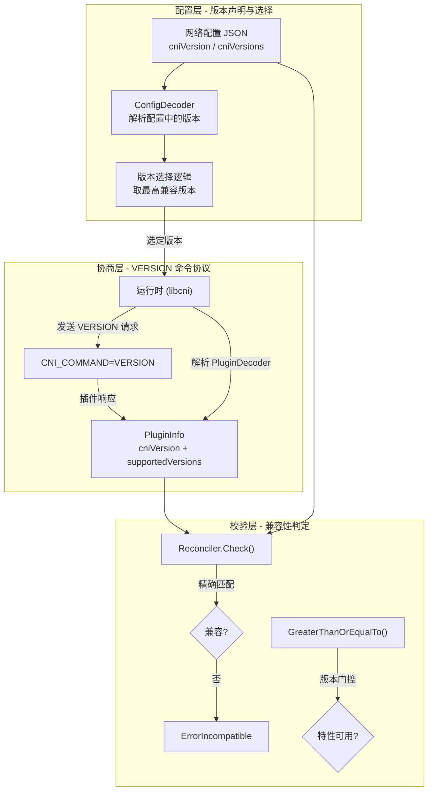
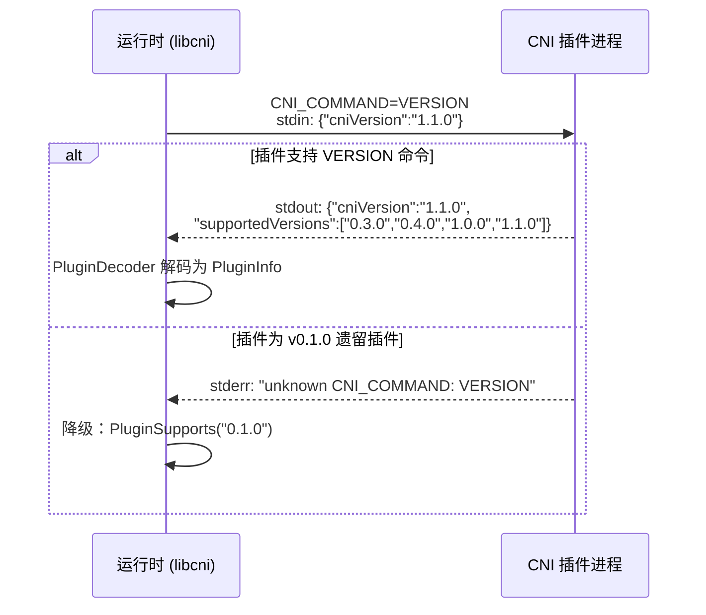
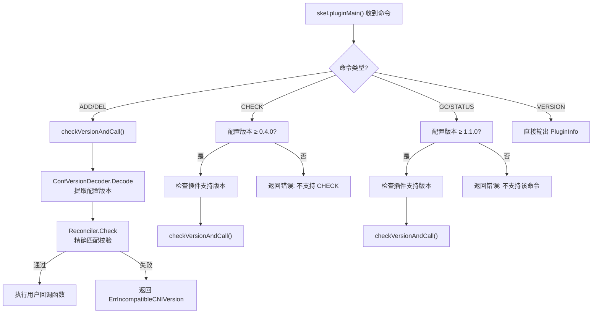
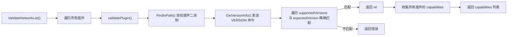
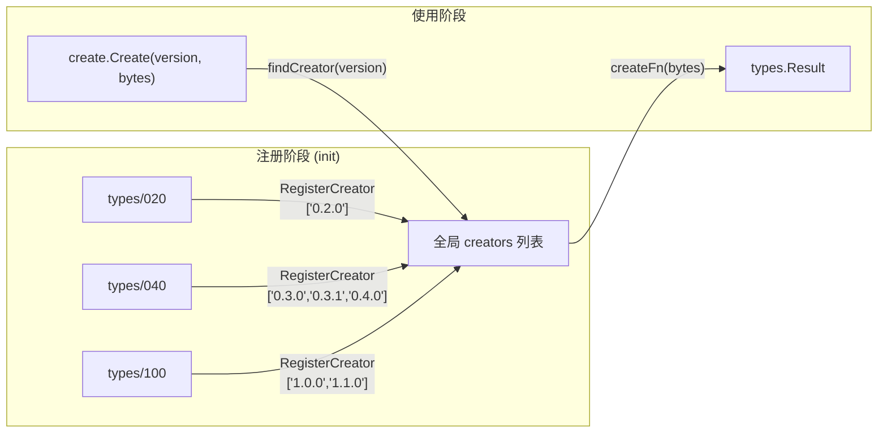

CNI 生态中存在三类独立演进的角色——**运行时（Runtime）**、**插件（Plugin）** 和 **网络配置（Network Configuration）**，它们各自可能支持不同版本的 CNI 规范。版本协商与兼容性校验机制的核心职责是：在运行时与插件之间建立一条可靠的版本协议通道，确保双方在共同认可的规范版本下通信，并在版本不兼容时提供清晰的错误诊断信息。这一机制分布在 `pkg/version/`、`pkg/invoke/`、`pkg/skel/` 和 `libcni/` 四个包中，形成了一个从协议定义到运行时集成、再到插件侧校验的完整链路。

Sources: [SPEC.md](SPEC.md#L195-L202), [version.go](pkg/version/version.go#L25-L39)

## 架构总览：版本协商的三层模型

版本协商并非一个单一函数调用，而是嵌入在 CNI 生命周期的多个关键节点中。从架构层面看，它可以被划分为三个职责清晰的层次：



**配置层**负责从 JSON 网络配置中提取版本信息并在多个候选版本中选出最高可用版本；**协商层**通过 `VERSION` 命令向插件探测其支持的规范版本列表；**校验层**则将配置版本与插件支持版本进行交叉比对，并基于版本比较实现特性门控。三层协同工作，构成了 CNI 版本安全的完整防线。

Sources: [conf.go](libcni/conf.go#L107-L160), [exec.go](pkg/invoke/exec.go#L147-L173), [reconcile.go](pkg/version/reconcile.go#L32-L49)

## VERSION 命令：插件能力探测协议

`VERSION` 是 CNI 规范中专门用于版本协商的操作命令。它从规范 v0.2.0 开始引入，是运行时在执行任何实质操作之前探测插件能力的标准化手段。

### 协议交互流程

运行时向插件发送 `VERSION` 命令时，遵循以下流程：



运行时侧的 `GetVersionInfo` 函数实现了这一完整流程。它构造一个包含当前库版本号的 JSON 对象作为 stdin 数据，设置 `CNI_COMMAND=VERSION`，同时为兼容旧版 skel 框架填充了 dummy 值的 `NetNS`、`IfName` 和 `Path` 环境变量。若插件返回错误且错误信息为 `"unknown CNI_COMMAND: VERSION"`，则推断该插件为仅支持 v0.1.0 的遗留插件，直接返回 `PluginSupports("0.1.0")`。

Sources: [exec.go](pkg/invoke/exec.go#L147-L173), [SPEC.md](SPEC.md#L362-L368)

### PluginInfo 接口与编解码

插件对 `VERSION` 命令的响应被抽象为 `PluginInfo` 接口，它是版本协商中的核心数据模型：

| 方法 | 说明 |
|------|------|
| `SupportedVersions() []string` | 返回插件支持的一个或多个 CNI 规范版本 |
| `Encode(io.Writer) error` | 将版本信息序列化为 JSON 写入给定的 Writer |

其具体实现 `pluginInfo` 结构体包含两个字段：`cniVersion`（插件使用的库版本）和 `supportedVersions`（插件支持的规范版本列表）。工厂函数 `PluginSupports` 用于快速创建 `PluginInfo` 实例，它会自动将当前库版本填入 `cniVersion` 字段。

Sources: [plugin.go](pkg/version/plugin.go#L26-L62)

`PluginDecoder` 负责将插件进程输出的 JSON 字节流解码为 `PluginInfo` 对象。它处理三种情况：正常解码含 `supportedVersions` 的响应；对 v0.2.0 版本插件（`cniVersion` 为 `"0.2.0"` 且无 `supportedVersions` 字段）做向后兼容，默认返回 `["0.1.0", "0.2.0"]`；以及对于缺失必要字段的其他情况返回明确的错误信息。

Sources: [plugin.go](pkg/version/plugin.go#L65-L83)

## 版本选择：从配置中确定协商版本

网络配置 JSON 中通过两个可选字段声明所支持的 CNI 版本：

| 字段 | 类型 | 说明 |
|------|------|------|
| `cniVersion` | string | 主版本声明，单一版本号 |
| `cniVersions` | string list | 扩展版本列表，声明所有兼容版本 |

当配置中同时存在这两个字段时，`libcni` 的配置加载逻辑会将它们合并后排序，**选取不超过当前库实现版本（`version.Current()`）的最高版本**作为最终协商版本。这一机制确保运行时不会尝试使用自身尚不支持的规范特性。

Sources: [conf.go](libcni/conf.go#L107-L160), [SPEC.md](SPEC.md#L110-L111)

具体的选择算法在 `NetworkConfFromBytes` 中实现：遍历 `cniVersions` 列表，过滤掉大于当前库版本的所有条目，然后按版本号降序排序取最大值。如果 `cniVersion` 也在兼容范围内，它会被追加到候选列表中参与排序。

Sources: [conf.go](libcni/conf.go#L116-L159)

## Reconciler：兼容性校验器

`Reconciler` 是版本兼容性校验的核心组件，负责判定网络配置的版本是否在插件声明的支持列表中。

### 校验策略：精确匹配

Reconciler 采用**精确字符串匹配**策略——配置版本必须与插件支持的版本列表中的某个条目完全相等，而非语义化版本范围匹配。这一设计选择意味着，即使插件支持 `"1.0.0"` 且配置请求 `"1.0.1"`，校验也会失败。

```go
// Reconciler.Check 的核心逻辑
func (*Reconciler) CheckRaw(configVersion string, supportedVersions []string) *ErrorIncompatible {
    for _, supportedVersion := range supportedVersions {
        if configVersion == supportedVersion {
            return nil  // 匹配成功
        }
    }
    return &ErrorIncompatible{
        Config:    configVersion,
        Supported: supportedVersions,
    }
}
```

当校验失败时，返回的 `ErrorIncompatible` 结构体携带了丰富的诊断信息——包括配置中请求的版本和插件实际支持的所有版本列表——帮助运维人员快速定位版本不匹配的根因。

Sources: [reconcile.go](pkg/version/reconcile.go#L19-L49)

### skel 侧的版本校验：插件入口的第一道防线

在插件进程中，`skel` 包的 `dispatcher` 在分发任何命令之前，首先通过 `checkVersionAndCall` 执行版本校验。`dispatcher` 结构体内置了 `ConfVersionDecoder`（用于从 stdin 配置中提取版本）和 `VersionReconciler`（用于执行兼容性校验），形成了插件侧的防御机制：



对于 `ADD` 和 `DEL` 命令，插件仅执行基本的精确匹配校验。但对于 `CHECK`（v0.4.0 引入）、`GC` 和 `STATUS`（均为 v1.1.0 引入）这些后加入的命令，`skel` 会先检查配置版本是否满足最低要求，然后再遍历插件声明的支持版本列表，确认插件是否有能力处理该版本——这是一道双重校验。

Sources: [skel.go](pkg/skel/skel.go#L190-L346)

## 版本比较工具：特性门控的数学基础

`ParseVersion`、`GreaterThanOrEqualTo` 和 `GreaterThan` 三个函数构成了版本比较的基础设施，它们将语义化版本字符串（如 `"1.1.0"`）解析为 `(major, minor, micro)` 三元组并按字典序比较。这些函数并不直接参与运行时与插件之间的协商，而是被广泛用于**特性门控**——根据版本号决定某个 CNI 命令或行为是否应该启用。

Sources: [plugin.go](pkg/version/plugin.go#L87-L168)

### 特性门控矩阵

CNI 规范中不同命令和功能特性对版本有最低要求。下表总结了代码库中所有使用版本比较进行特性门控的位置：

| 特性 | 最低版本 | 门控位置 | 说明 |
|------|----------|----------|------|
| `CHECK` 命令 | 0.4.0 | `libcni/api.go` + `skel.go` | 检查容器网络状态是否与预期一致 |
| `DEL` 携带缓存结果 | 0.4.0 | `libcni/api.go` | 在删除时向插件传递之前的 ADD 结果 |
| `GC` 命令 | 1.1.0 | `libcni/api.go` + `skel.go` | 清理孤立的网络资源 |
| `STATUS` 命令 | 1.1.0 | `libcni/api.go` + `skel.go` | 查询插件是否可用 |

以 `CheckNetworkList` 为例，其实现首先通过 `version.GreaterThanOrEqualTo(list.CNIVersion, "0.4.0")` 判断配置版本是否支持 CHECK，若不满足则直接返回 `"does not support the CHECK command"` 错误：

Sources: [api.go](libcni/api.go#L548-L572), [api.go](libcni/api.go#L818-L819), [api.go](libcni/api.go#L857-L858)

## 运行时侧的完整协商流程：ValidateNetwork

`libcni` 提供了 `ValidateNetworkList` 和 `ValidateNetwork` 方法作为运行时侧版本协商的统一入口。它们在执行任何实质网络操作之前，完成两件事：**确认插件二进制文件存在**，以及**确认插件支持配置要求的版本**。



`validatePlugin` 方法的实现逻辑简洁而明确：若配置未指定版本，默认为 `"0.1.0"`；然后通过 `invoke.GetVersionInfo` 向插件发送 `VERSION` 命令获取其支持版本列表；最后遍历该列表检查是否包含期望版本。这种设计让运行时可以在容器启动之前就发现版本不兼容问题，避免了运行时中途失败的尴尬局面。

Sources: [api.go](libcni/api.go#L679-L753)

## 结果版本修复：fixupResultVersion

版本协商不仅发生在操作执行之前，还延伸到结果解析阶段。根据 CNI 规范，插件必须以与配置相同的 `cniVersion` 返回结果，但在实践中——尤其是遗留插件——可能返回空版本或缺失 `cniVersion` 字段的结果。`fixupResultVersion` 函数正是为了处理这种不一致而存在：

它的处理策略是：先从原始网络配置中提取 `confVersion`，然后检查插件输出中是否存在非空的 `cniVersion`。若存在，保留插件声明的版本；若不存在或为空，则**强制将配置版本注入到结果 JSON 中**。这一"修复"操作确保了下游的结果解析流程始终能获得有效的版本信息。

Sources: [exec.go](pkg/invoke/exec.go#L41-L78)

## 遗留插件兼容性策略

CNI 项目对遗留插件保持了高度向后兼容。整个兼容性策略体现在以下几个层面：

| 场景 | 处理策略 | 代码位置 |
|------|----------|----------|
| 配置无 `cniVersion` 字段 | 默认为 `"0.1.0"` | `create.DecodeVersion` |
| 插件不认识 VERSION 命令 | 降级为仅支持 `"0.1.0"` | `invoke.GetVersionInfo` |
| v0.2.0 插件无 `supportedVersions` | 默认返回 `["0.1.0", "0.2.0"]` | `PluginDecoder.Decode` |
| 结果中 `cniVersion` 为空 | 注入配置版本 | `fixupResultVersion` |
| `prevResult` 缺少 `CNIVersion` | 注入配置版本 | `ParsePrevResult` |

`version` 包还预定义了两个常用的 `PluginInfo` 常量：`Legacy` 表示仅兼容 v0.1.0 的遗留插件（`PluginSupports("0.1.0", "0.2.0")`），`All` 则表示支持所有已发布规范版本的插件。`VersionsStartingFrom` 辅助函数可以快速生成从某个最低版本开始的所有已知版本列表，供插件开发者声明自己的支持范围。

Sources: [version.go](pkg/version/version.go#L37-L56), [plugin.go](pkg/version/plugin.go#L73-L81), [exec.go](pkg/invoke/exec.go#L165-L168), [version.go](pkg/version/version.go#L66-L89)

## 版本注册机制：类型系统的可扩展性

版本协商的最后一环是结果类型的版本化创建。`pkg/types/internal` 包通过 `RegisterCreator` 和 `RegisterConverter` 两个注册函数，建立了一个全局的、按版本号索引的结果工厂注册表。每个版本的类型包（如 `types/020`、`types/040`、`types/100`）在 `init()` 阶段通过 `import _` 触发注册，将自己支持的版本号和对应的工厂函数绑定到注册表中。



当 `version.NewResult` 或 `create.Create` 被调用时，系统通过版本号在注册表中查找对应的工厂函数，将 JSON 字节流反序列化为正确版本的结果对象。若找不到匹配的创建器，则返回 `"unsupported CNI result version"` 错误。这种注册机制使得新增规范版本时无需修改核心代码，只需添加新的类型包并注册即可。

Sources: [create.go](pkg/types/internal/create.go#L25-L66), [convert.go](pkg/types/internal/convert.go#L28-L93), [create.go](pkg/types/create/create.go#L22-L26)

## 实践建议

理解版本协商机制后，以下是一些实用的开发与运维建议：

**插件开发者**：始终使用 `version.PluginSupports(...)` 显式声明插件支持的版本列表，而非使用 `version.All`。这确保了当新版本规范引入不兼容变更时，插件不会被错误地匹配到不支持的新版本。在 `skel.PluginMainFuncs` 中传入准确的 `versionInfo` 参数是完成这一声明的标准方式。

**运行时集成者**：在调用 `AddNetworkList` 之前先调用 `ValidateNetworkList` 进行预检查。这可以提前发现插件缺失或版本不兼容的问题，避免容器创建流程中途失败。

**配置管理者**：在 `.conflist` 文件中同时设置 `cniVersion` 和 `cniVersions` 字段，可以让运行时自动选择最佳的协议版本。确保 `cniVersions` 列表中包含所有实际兼容的版本，以最大化插件匹配的成功率。

Sources: [api.go](libcni/api.go#L679-L714), [version.go](pkg/version/version.go#L37-L39)

---

**相关阅读**：
- [类型系统：多版本类型定义与自动转换](14-lei-xing-xi-tong-duo-ban-ben-lei-xing-ding-yi-yu-zi-dong-zhuan-huan) — 深入了解结果类型的版本化注册与跨版本转换机制
- [CNI 规范全景：网络配置格式详解](5-cni-gui-fan-quan-jing-wang-luo-pei-zhi-ge-shi-xiang-jie) — 理解 `cniVersion` 和 `cniVersions` 在配置格式中的完整语义
- [插件执行引擎：查找、调用与结果处理](12-cha-jian-zhi-xing-yin-qing-cha-zhao-diao-yong-yu-jie-guo-chu-li) — 了解 `GetVersionInfo` 和 `fixupResultVersion` 在插件执行管线中的位置
- [skel 骨架包：构建 CNI 插件的起点](13-skel-gu-jia-bao-gou-jian-cni-cha-jian-de-qi-dian) — 了解 `dispatcher` 如何在插件侧完成版本校验与命令分发