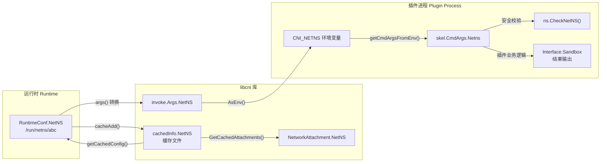
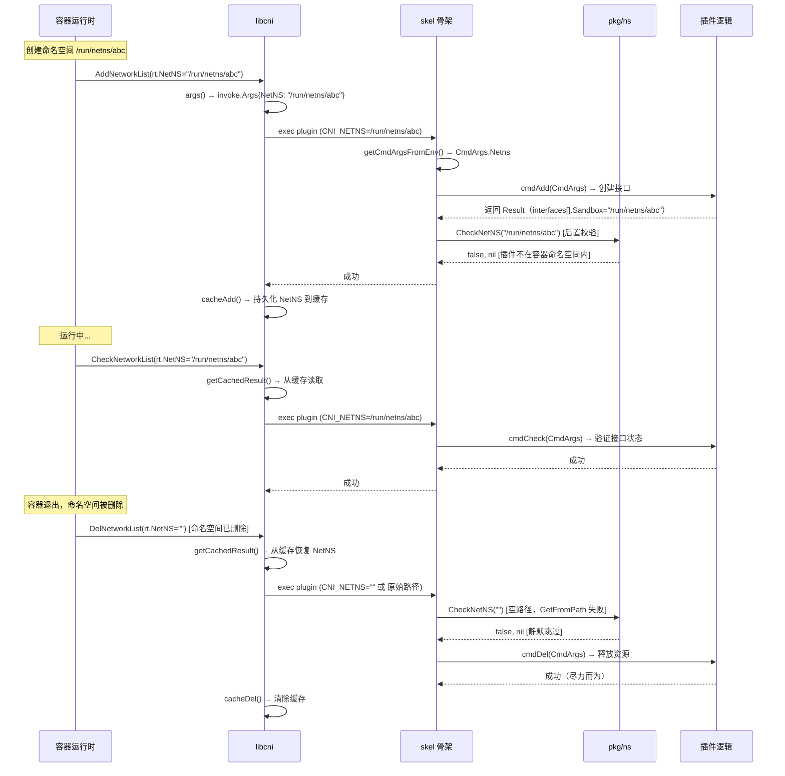

在 CNI（Container Network Interface）的架构中，**网络命名空间**是容器网络隔离的核心基石。CNI 规范将其抽象为"隔离域"（Isolation Domain）——一个逻辑边界，使每个容器拥有独立的网络栈（包括接口、路由表、iptables 规则等）。本文将深入剖析 CNI 项目中网络命名空间从**协议定义**到**运行时传递**再到**安全校验**的完整生命周期，涵盖 `pkg/ns` 包的平台特定实现、`skel` 骨架包的内置防护机制，以及 `libcni` 库中命名空间信息在缓存和结果类型中的流转路径。

Sources: [SPEC.md](SPEC.md#L427-L428), [ns_linux.go](pkg/ns/ns_linux.go#L15-L23)

---

## 概念架构：命名空间在 CNI 中的三层角色

网络命名空间在 CNI 体系中并非以单一形态存在，而是贯穿了三个不同的层次：

| 层次 | 角色 | 数据载体 | 传递方式 |
|------|------|----------|----------|
| **协议层** | 隔离域标识 | `CNI_NETNS` 环境变量 | 运行时 → 插件进程 |
| **结果层** | 接口归属标记 | `Interface.Sandbox` 字段 | 插件 → 运行时（JSON 输出） |
| **缓存层** | Attachment 追踪 | `cachedInfo.NetNS` 字段 | libcni 内部持久化 |

在协议层，运行时通过 `CNI_NETNS` 环境变量将容器的网络命名空间路径传递给插件（例如 `/run/netns/my-container`）。插件在 `ADD` 操作成功后，需要在返回结果的 `interfaces` 数组中通过 `sandbox` 字段回填该路径，表明该接口属于哪个隔离域。在缓存层，libcni 将 `NetNS` 持久化到缓存文件中，以便在后续的 `DEL` 和 `CHECK` 操作中恢复上下文。

Sources: [SPEC.md](SPEC.md#L575-L578), [api.go](libcni/api.go#L225-L236), [args.go](pkg/invoke/args.go#L66-L72)

下面是命名空间信息在 CNI 各组件间的流转关系图：



Sources: [api.go](libcni/api.go#L891-L900), [skel.go](pkg/skel/skel.go#L59-L187), [ns_linux.go](pkg/ns/ns_linux.go#L35-L50)

---

## CNI_NETNS：协议层的命名空间传递机制

### 环境变量定义与操作要求

`CNI_NETNS` 是 CNI 协议中用于传递容器网络命名空间引用的核心环境变量。其值通常是一个网络命名空间的文件系统路径（如 `/run/netns/<nsname>`），但规范将其更通用地定义为"隔离域引用"，以支持非 Linux 平台上的其他隔离机制。

不同 CNI 操作对 `CNI_NETNS` 的要求各不相同：

| 操作 | `CNI_NETNS` 要求 | 说明 |
|------|------------------|------|
| **ADD** | 必需 | 插件需要在指定命名空间中创建接口 |
| **CHECK** | 必需 | 插件需要检查指定命名空间中的接口状态 |
| **DEL** | 可选 | 命名空间可能已被删除；插件应尽力完成清理 |
| **GC** | 不需要 | GC 不针对特定 attachment，无需命名空间 |
| **STATUS** | 不需要 | 仅检查插件自身就绪状态 |

`DEL` 操作中 `CNI_NETNS` 被标记为可选是一个关键设计决策。容器运行时可能需要清理已经退出的容器资源，而此时容器的网络命名空间已经被销毁。CNI 规范要求 `DEL` 操作始终以"尽力而为"方式执行——即使命名空间不存在，插件也应释放所有可清理的资源（如 IPAM 地址分配）。

Sources: [SPEC.md](SPEC.md#L227-L228), [SPEC.md](SPEC.md#L265-L290), [skel.go](pkg/skel/skel.go#L90-L99)

### 从 RuntimeConf 到 CNI_NETNS 的传递链路

当容器运行时调用 libcni 时，命名空间信息首先被封装在 `RuntimeConf` 结构体中：

```go
rt := &libcni.RuntimeConf{
    ContainerID:    containerID,
    NetNS:          "/run/netns/my-container",  // 命名空间路径
    IfName:         "eth0",
    Args:           cniArgs,
    CapabilityArgs: capabilityArgs,
}
```

libcni 的 `CNIConfig.args()` 方法将 `RuntimeConf.NetNS` 转换为 `invoke.Args` 结构体，后者通过 `AsEnv()` 方法生成包含 `CNI_NETNS=<path>` 的环境变量列表。这些环境变量随后被传递给插件子进程。

Sources: [api.go](libcni/api.go#L891-L900), [args.go](pkg/invoke/args.go#L56-L74), [root.go](cnitool/cmd/root.go#L141-L147)

### cnitool 中的命名空间路径处理

cnitool 作为官方参考工具，展示了命名空间路径的标准化处理方式。在 `setupRuntimeConfig` 函数中，用户传入的命名空间路径会被 `filepath.Abs()` 转换为绝对路径，确保 `CNI_NETNS` 的值始终是规范的绝对路径：

```go
netNS, err = filepath.Abs(netNS)  // 确保为绝对路径
containerID := fmt.Sprintf("cnitool-%x", s[:10])  // 基于路径哈希生成 ID
```

这意味着 `cnitool add mynet ./my-ns` 与 `cnitool add mynet /var/run/netns/my-ns` 最终会产生相同的绝对路径。注意，cnitool 还基于命名空间路径的 SHA-512 哈希生成 `ContainerID`，这保证了同一命名空间在多次操作中获得一致的标识。

Sources: [root.go](cnitool/cmd/root.go#L130-L149)

---

## pkg/ns 包：平台特定的命名空间校验

### 包结构与构建标签策略

`pkg/ns` 包采用 Go 的**构建标签**（build tags）机制，通过不同平台的源文件实现跨平台适配：

```
pkg/ns/
├── ns_linux.go    # Linux：完整实现，依赖 vishvananda/netns
├── ns_darwin.go   # macOS：桩实现，始终返回 false
└── ns_windows.go  # Windows：桩实现，始终返回 false
```

这种设计体现了 CNI 的务实态度：Linux 内核原生支持 network namespace，因此仅 Linux 提供完整的功能实现；而 macOS 和 Windows 平台的桩实现确保代码可编译且不会产生运行时错误。

Sources: [ns_linux.go](pkg/ns/ns_linux.go#L15-L23), [ns_darwin.go](pkg/ns/ns_darwin.go#L15-L21), [ns_windows.go](pkg/ns/ns_windows.go#L15-L21)

### Linux 实现：CheckNetNS 的内部逻辑

Linux 实现导出了唯一的公开函数 `CheckNetNS(nsPath string) (bool, *types.Error)`，其职责是判断传入的命名空间路径是否与**插件当前所在的命名空间**相同。核心逻辑如下：

```go
func CheckNetNS(nsPath string) (bool, *types.Error) {
    // 1. 从路径获取目标命名空间句柄
    ns, err := netns.GetFromPath(nsPath)
    if err != nil {
        return false, nil  // 路径无效（如已删除），返回 false 不报错
    }
    defer ns.Close()

    // 2. 获取插件当前线程所在的命名空间
    pluginNS, err := getCurrentNS()
    if err != nil {
        return false, types.NewError(types.ErrInvalidNetNS, ...)
    }
    defer pluginNS.Close()

    // 3. 比较两者是否相同
    return pluginNS.Equal(ns), nil
}
```

辅助函数 `getCurrentNS()` 尤其值得关注。它首先调用 `runtime.LockOSThread()` 锁定当前 goroutine 到操作系统线程上，然后通过 `netns.Get()` 获取该线程的网络命名空间句柄，最后通过 `defer runtime.UnlockOSThread()` 解锁。这个锁定操作是必要的，因为 Go 的 runtime 会在 goroutine 之间复用操作系统线程——如果不锁定，另一个 goroutine 可能在此期间切换了当前线程的命名空间，导致获取到错误的值。

Sources: [ns_linux.go](pkg/ns/ns_linux.go#L26-L50)

### 非 Linux 平台的桩实现

Darwin 和 Windows 的 `CheckNetNS` 实现完全相同，始终返回 `(false, nil)`：

```go
func CheckNetNS(nsPath string) (bool, *types.Error) {
    return false, nil
}
```

这意味着在非 Linux 平台上，命名空间安全校验会被静默跳过——`CheckNetNS` 永远报告"不相同"，后续逻辑不会触发 `ErrInvalidNetNS` 错误。这是一个合理的降级策略，因为容器运行时在 macOS（如 Docker Desktop）和 Windows 上通常使用虚拟机而非原生命名空间来实现隔离。

Sources: [ns_darwin.go](pkg/ns/ns_darwin.go#L19-L21), [ns_windows.go](pkg/ns/ns_windows.go#L19-L21)

---

## skel 骨架包中的命名空间安全防护

### ADD 和 DEL 操作的后置校验

`skel` 包是 CNI 插件的入口骨架，它在 `pluginMain` 函数中为 `ADD` 和 `DEL` 操作内置了命名空间安全校验。这段校验逻辑位于**插件回调执行之后**（即 `checkVersionAndCall` 成功返回之后），采用的是"先执行，后验证"的模式：

```go
case "ADD":
    err = t.checkVersionAndCall(cmdArgs, versionInfo, funcs.Add)
    if err != nil {
        return err
    }
    // 后置校验：插件不应运行在目标命名空间内
    if strings.ToUpper(cmdArgs.NetnsOverride) != "TRUE" && cmdArgs.NetnsOverride != "1" {
        isPluginNetNS, checkErr := ns.CheckNetNS(cmdArgs.Netns)
        if checkErr != nil {
            return checkErr
        } else if isPluginNetNS {
            return types.NewError(types.ErrInvalidNetNS,
                "plugin's netns and netns from CNI_NETNS should not be the same", "")
        }
    }
```

这段防护机制的意图是：**CNI 插件绝不应该与目标容器运行在同一个网络命名空间中**。如果两者相同，意味着插件本身运行在容器的隔离域内——这通常是配置错误的信号。比如，有人错误地在一个容器内部运行 CNI 插件并将该容器自身的命名空间路径传递给了 `CNI_NETNS`。

Sources: [skel.go](pkg/skel/skel.go#L245-L292)

### CNI_NETNS_OVERRIDE：绕过安全校验的显式声明

`CNI_NETNS_OVERRIDE` 环境变量是一个**逃生舱口**（escape hatch），允许运行时显式声明"我知道插件和目标在同一命名空间，这是故意的"。当该变量被设置为 `"TRUE"` 或 `"1"`（不区分大小写）时，skel 跳过 `CheckNetNS` 校验：

```go
if strings.ToUpper(cmdArgs.NetnsOverride) != "TRUE" && cmdArgs.NetnsOverride != "1" {
    // 仅在未覆盖时执行校验
    isPluginNetNS, checkErr := ns.CheckNetNS(cmdArgs.Netns)
    ...
}
```

这个变量在 `getCmdArgsFromEnv()` 中从 `CNI_NETNS_OVERRIDE` 环境变量解析并存入 `CmdArgs.NetnsOverride` 字段。对 `ADD`、`CHECK`、`DEL` 三种操作均为可选参数。在实际场景中，`CNI_NETNS_OVERRIDE` 主要用于特殊测试环境或 host-network 模式下的 CNI 插件调用。

Sources: [skel.go](pkg/skel/skel.go#L132-L141), [skel.go](pkg/skel.go#L43)

### 错误码 ErrInvalidNetNS

当命名空间校验失败时，skel 返回错误码 `ErrInvalidNetNS`（数值 `8`）。在 `pkg/ns/ns_linux.go` 中，`getCurrentNS()` 如果自身无法获取当前命名空间，也会返回同一错误码：

| 触发场景 | 错误消息 | 来源 |
|----------|----------|------|
| 插件与目标在同一命名空间 | `"plugin's netns and netns from CNI_NETNS should not be the same"` | skel.go |
| 无法获取插件当前命名空间 | `"get plugin's netns failed"` | ns_linux.go |
| 命名空间路径无效 | 无错误，返回 `(false, nil)` | ns_linux.go |

值得注意的设计细节是：当 `netns.GetFromPath(nsPath)` 返回错误时（即目标命名空间路径不存在或无法访问），`CheckNetNS` 并不报错，而是返回 `(false, nil)`。这一行为在 `DEL` 操作中尤为重要——容器可能已被销毁，命名空间路径自然无效，此时跳过校验是正确的行为。

Sources: [types.go](pkg/types/types.go#L242), [skel.go](pkg/skel/skel.go#L254-L256), [ns_linux.go](pkg/ns/ns_linux.go#L36-L49)

---

## 缓存与结果类型中的命名空间信息

### cachedInfo 中的 NetNS 持久化

libcni 在执行 `ADD` 操作成功后，会将 `RuntimeConf.NetNS` 写入缓存文件。`cachedInfo` 结构体的定义如下：

```go
type cachedInfo struct {
    Kind           string                 `json:"kind"`
    ContainerID    string                 `json:"containerId"`
    Config         []byte                 `json:"config"`
    IfName         string                 `json:"ifName"`
    NetworkName    string                 `json:"networkName"`
    NetNS          string                 `json:"netns,omitempty"`      // 命名空间路径
    CniArgs        [][2]string            `json:"cniArgs,omitempty"`
    CapabilityArgs map[string]interface{} `json:"capabilityArgs,omitempty"`
    RawResult      map[string]interface{} `json:"result,omitempty"`
    Result         types.Result           `json:"-"`
}
```

`NetNS` 字段使用 `omitempty` 标签，意味着空字符串不会被序列化。在 `cacheAdd` 函数中，`rt.NetNS` 被直接写入缓存。当 `DelNetworkList` 或 `CheckNetworkList` 被调用时，libcni 通过 `getCachedConfig` 读取缓存并恢复 `RuntimeConf`，确保后续操作可以使用与 `ADD` 时相同的命名空间信息——即使运行时传入的 `rt.NetNS` 为空（这在容器已被销毁的 `DEL` 场景中很常见）。

Sources: [api.go](libcni/api.go#L225-L236), [api.go](libcni/api.go#L259-L297)

### NetworkAttachment 中的 NetNS

`NetworkAttachment` 结构体用于 `GetCachedAttachments` API，它将缓存的 attachment 信息暴露给外部调用者：

```go
type NetworkAttachment struct {
    ContainerID    string
    Network        string
    IfName         string
    Config         []byte
    NetNS          string               // 命名空间路径
    CniArgs        [][2]string
    CapabilityArgs map[string]interface{}
}
```

该结构体使得容器运行时可以查询某个容器当前持有哪些网络 attachment，以及每个 attachment 对应的命名空间。这对于 `GC` 操作中确定有效的 attachment 列表至关重要。

Sources: [api.go](libcni/api.go#L89-L97)

### Interface.Sandbox：结果类型中的命名空间映射

在 CNI 的 Result 类型系统中（以 v1.0.0 为例），`Interface` 结构体通过 `Sandbox` 字段标记该接口所属的隔离域：

```go
type Interface struct {
    Name       string `json:"name"`
    Mac        string `json:"mac,omitempty"`
    Mtu        int    `json:"mtu,omitempty"`
    Sandbox    string `json:"sandbox,omitempty"`    // 隔离域引用
    SocketPath string `json:"socketPath,omitempty"`
    PciID      string `json:"pciID,omitempty"`
}
```

CNI 规范明确规定：对于容器内部的接口，`Sandbox` 字段的值**必须与 `CNI_NETNS` 环境变量传入的值一致**。对于主机侧的接口（如 veth pair 的另一端），`Sandbox` 应为空字符串。这个约定使得运行时和其他链式插件能够明确区分哪些接口属于容器，哪些属于主机。

Sources: [types.go](pkg/types/100/types.go#L269-L277), [SPEC.md](SPEC.md#L575-L578)

---

## 端到端流程：命名空间的完整生命周期

以下流程图展示了网络命名空间信息在一次完整的 ADD → CHECK → DEL 生命周期中的流转：



Sources: [api.go](libcni/api.go#L515-L613), [skel.go](pkg/skel/skel.go#L232-L346), [ns_linux.go](pkg/ns/ns_linux.go#L35-L50)

---

## priv-net-run.sh：命名空间管理的参考实现

项目根目录的 `scripts/priv-net-run.sh` 提供了一个极简但完整的命名空间管理示例，展示了 CNI 与 Linux 网络命名空间的交互模式：

```bash
contid=$(printf '%x%x%x%x' $RANDOM $RANDOM $RANDOM $RANDOM)
netnspath=/var/run/netns/$contid

ip netns add $contid                          # 1. 创建命名空间
./exec-plugins.sh add $contid $netnspath       # 2. 调用 CNI 插件（ADD）

function cleanup() {
    ./exec-plugins.sh del $contid $netnspath   # 3. 调用 CNI 插件（DEL）
    ip netns delete $contid                    # 4. 删除命名空间
}
trap cleanup EXIT

ip netns exec $contid "$@"                     # 5. 在命名空间中执行命令
```

这段脚本的关键设计点在于：命名空间的生命周期由**运行时管理**，CNI 插件仅负责在给定命名空间内配置网络接口。`cleanup` 函数通过 `trap EXIT` 注册，确保即使命令异常退出也能执行 `DEL` 操作清理资源——这与 CNI 规范中"ADD 最终必须被 DEL 跟进"的要求完全一致。

Sources: [priv-net-run.sh](scripts/priv-net-run.sh#L1-L21), [exec-plugins.sh](scripts/exec-plugins.sh#L36-L64)

---

## 平台差异总结

| 特性 | Linux | macOS | Windows |
|------|-------|-------|---------|
| `CheckNetNS` 实现 | 完整（基于 netns 句柄比较） | 桩实现（返回 `false`） | 桩实现（返回 `false`） |
| 依赖库 | `vishvananda/netns` | 无 | 无 |
| 命名空间路径示例 | `/run/netns/nsname` | N/A | N/A |
| OS 线程锁定 | `runtime.LockOSThread()` | 不需要 | 不需要 |
| 命名空间安全校验 | 有效 | 静默跳过 | 静默跳过 |

Linux 是 CNI 的首要目标平台，也是唯一提供完整命名空间校验能力的平台。对于 macOS（常用于开发环境）和 Windows（如 Windows Containers），`pkg/ns` 包的桩实现确保了代码的跨平台可编译性，同时不会干扰正常运行。

Sources: [ns_linux.go](pkg/ns/ns_linux.go#L17-L23), [ns_darwin.go](pkg/ns/ns_darwin.go#L17-L18), [ns_windows.go](pkg/ns/ns_windows.go#L17-L18)

---

## 关键设计决策与思考

**为什么 `CheckNetNS` 在插件回调之后执行而非之前？** 这是一个"先信任，后审计"的策略。如果在前置阶段检测到命名空间冲突就直接拒绝，插件就无法执行任何清理工作。而在后置阶段执行，即使检测到冲突，插件的核心逻辑已经完成——错误仅作为一种信号告知运行时"配置可能有误"。

**为什么 `DEL` 操作中 `CNI_NETNS` 是可选的？** 容器运行时的生命周期管理决定了命名空间的销毁通常先于网络清理。当容器异常退出时，运行时可能已经删除了命名空间，此时才调用 CNI `DEL` 来释放 IP 地址等资源。如果要求 `CNI_NETNS` 必须存在，这种常见的清理场景将无法工作。

**为什么 `CNI_NETNS_OVERRIDE` 没有出现在 CNI SPEC 中？** 这是 `skel` 包层面的实现细节，而非协议规范的一部分。规范定义的是运行时与插件之间的接口契约，而命名空间校验是 skel 提供的辅助安全功能。运行时可以选择直接使用 skel（获得该防护），也可以选择不使用 skel（自行处理命名空间安全）。

Sources: [skel.go](pkg/skel/skel.go#L245-L292), [SPEC.md](SPEC.md#L282-L290)

---

## 延伸阅读

理解命名空间管理后，建议继续阅读以下相关主题：

- [缓存机制：Result 持久化与 Attachment 追踪](17-huan-cun-ji-zhi-result-chi-jiu-hua-yu-attachment-zhui-zong) — 深入了解 `cachedInfo.NetNS` 在缓存文件中的完整生命周期
- [skel 骨架包：构建 CNI 插件的起点](13-skel-gu-jia-bao-gou-jian-cni-cha-jian-de-qi-dian) — 全面了解 skel 包的参数解析和错误处理机制
- [执行协议：ADD、DEL、CHECK、GC、STATUS 五大操作](6-zhi-xing-xie-yi-add-del-check-gc-status-wu-da-cao-zuo) — 各操作对 `CNI_NETNS` 的详细语义定义