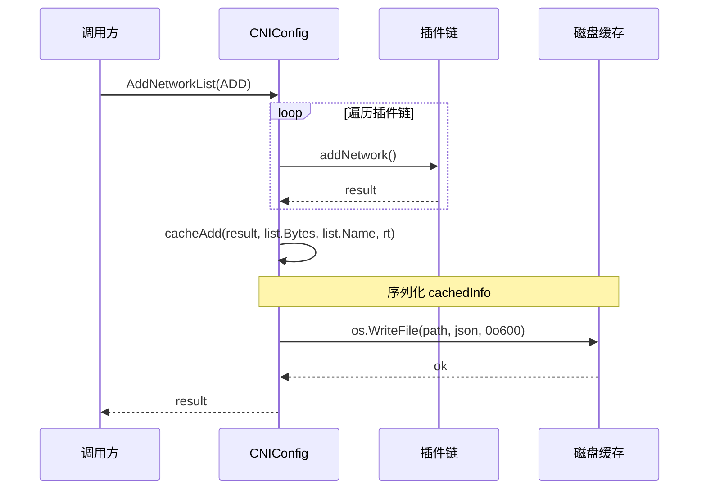
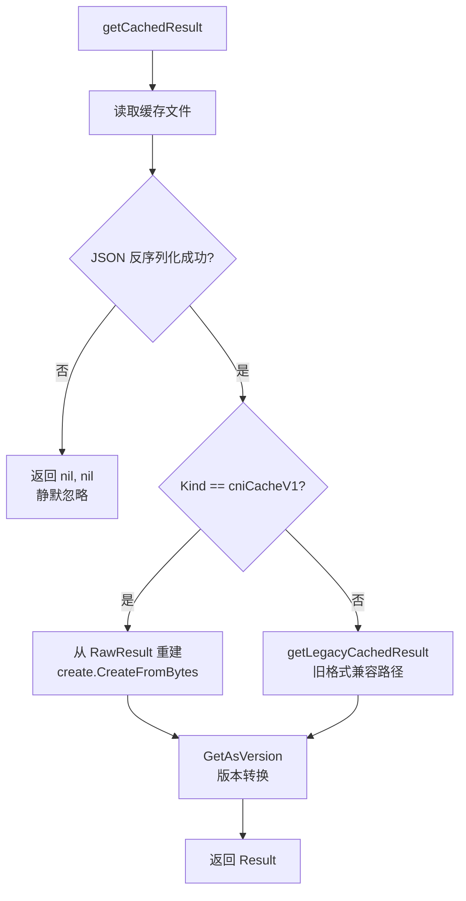
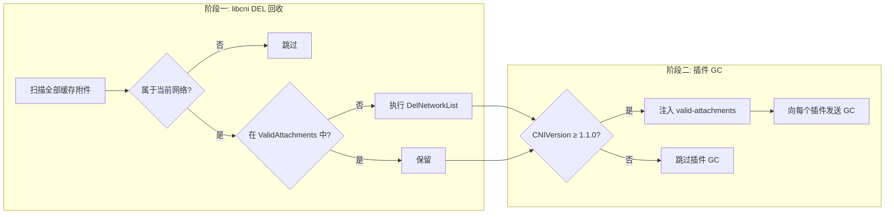

CNI 规范要求容器运行时在 ADD 操作后 **持久化存储** 插件返回的 Result，因为后续的 CHECK 和 DEL 操作必须引用这一结果。libcni 库将这一规范要求实现为基于文件系统的缓存层——它以 `{networkName}-{containerID}-{ifName}` 三元组为键，将完整的 Result、Config 和运行时参数序列化写入磁盘，并在此基础上构建了 Attachment 追踪和 GC 垃圾回收能力。本文深入解析这套缓存机制的数据模型、文件布局、读写流程以及向后兼容策略。

Sources: [api.go](libcni/api.go#L40-L48), [SPEC.md](SPEC.md#L444-L445)

## 核心数据结构：cachedInfo 与 NetworkAttachment

缓存机制的基石是 `cachedInfo` 结构体，它是写入磁盘的 JSON 文档的 Go 映射。该结构以 `Kind: "cniCacheV1"` 作为格式标识，将一次 ADD 操作的全部上下文打包为原子单元。

| 字段 | 类型 | 用途 |
|---|---|---|
| `Kind` | `string` | 格式版本标识，固定为 `"cniCacheV1"` |
| `ContainerID` | `string` | 容器 ID |
| `Config` | `[]byte` | 原始网络配置 JSON |
| `IfName` | `string` | 容器内接口名 |
| `NetworkName` | `string` | 网络配置名称 |
| `NetNS` | `string` | 网络命名空间路径（可为空） |
| `CniArgs` | `[][2]string` | 通用参数键值对 |
| `CapabilityArgs` | `map[string]interface{}` | 能力参数 |
| `RawResult` | `map[string]interface{}` | 插件返回结果的 JSON 原始映射 |

与之配套的 `NetworkAttachment` 结构体是面向调用方的只读视图，从缓存文件中提取 `ContainerID`、`Network`、`IfName`、`Config`、`NetNS`、`CniArgs`、`CapabilityArgs` 七个字段，供 GC 操作使用。`cachedInfo` 包含了 `RawResult`（用于恢复 Result 对象），而 `NetworkAttachment` 不包含——它是纯粹的"附件元数据"视角。

Sources: [api.go](libcni/api.go#L225-L236), [api.go](libcni/api.go#L89-L97)

## 文件系统布局与命名规则

缓存目录通过三级优先级策略确定：`CNIConfig.cacheDir` → `RuntimeConf.CacheDir`（已废弃） → 全局默认值 `/var/lib/cni`。实际的缓存文件存储在该目录下的 `results/` 子目录中，文件名格式为：

```
{networkName}-{containerID}-{ifName}
```

例如：`/var/lib/cni/results/mynet-abc123-eth0`

这个三元组（网络名、容器 ID、接口名）构成了缓存的**唯一键**。这意味着同一个容器在同一网络上挂载多个接口时，会生成多个独立的缓存文件——每个 `(containerID, ifName)` 对对应一个。`getCacheFilePath` 方法在三个参数任一为空时直接返回错误，确保缓存键的完整性。

Sources: [api.go](libcni/api.go#L238-L257), [api.go](libcni/api.go#L40-L41)

## Result 持久化：写入流程

`cacheAdd` 是 Result 持久化的核心写入方法，其调用时机严格限定在 ADD 操作成功之后：



写入过程分为四步：第一步，构建 `cachedInfo` 结构体，填入 Kind、ContainerID、Config、IfName、NetworkName、NetNS、CniArgs、CapabilityArgs；第二步，将 Result 对象通过 `json.Marshal` → `json.Unmarshal` 双重转换存入 `RawResult` 字段（`map[string]interface{}` 类型），这一步确保了 Result 的版本无关序列化；第三步，计算目标文件路径，使用 `os.MkdirAll` 创建必要的目录结构（权限 `0o700`）；第四步，以权限 `0o600` 写入文件。权限设计确保了只有 root 用户可读写缓存内容，防止网络配置信息泄露。

值得注意的是，无论是 `AddNetworkList`（插件链）还是 `AddNetwork`（单插件），写入的 `Config` 都是**完整的网络配置**（`list.Bytes` 或 `net.Bytes`），而非单个插件的配置。这确保了 DEL 操作能获取到完整的原始配置用于重建 RuntimeConf。

Sources: [api.go](libcni/api.go#L259-L297), [api.go](libcni/api.go#L514-L530), [api.go](libcni/api.go#L628-L640)

## Result 读取：版本兼容与向后兼容策略

Result 的读取路径比写入复杂得多，因为它需要处理两种缓存格式并完成版本转换：



**新格式（cniCacheV1）**：从 `RawResult` 字段重新序列化为 JSON，再通过 `create.CreateFromBytes` 自动检测版本并反序列化为对应版本的 `types.Result` 对象。**旧格式（legacy）**：当文件内容不是有效的 `cniCacheV1` 格式时，`getLegacyCachedResult` 直接将整个文件内容作为 Result JSON 解析——这兼容了早期 libcni 版本直接将 Result JSON 写入缓存的行为。

无论哪种格式，最终都会调用 `result.GetAsVersion(cniVersion)` 将缓存结果转换为**当前配置要求的版本**。这一步至关重要：如果容器运行期间网络配置被更新（版本变更），缓存的 Result 版本可能与配置版本不一致，`GetAsVersion` 确保了插件始终收到与自己版本匹配的 `prevResult`。

Sources: [api.go](libcni/api.go#L338-L401)

## Config 读取：重建 RuntimeConf

`getCachedConfig` 提供了从缓存重建运行时配置的能力。它读取缓存文件后，将缓存中的 `CniArgs` 和 `CapabilityArgs` 合并回一个新的 `RuntimeConf` 副本（不会修改传入的原始 `rt`）。这一机制的典型使用场景是：运行时进程重启后，需要恢复之前 ADD 操作时的完整运行时上下文以执行 CHECK 或 DEL。

Sources: [api.go](libcni/api.go#L308-L336)

## 缓存删除与生命周期

`cacheDel` 的实现极其简洁——直接调用 `os.Remove` 删除缓存文件，即使文件不存在也不会返回错误。它被调用在两个关键时机：DEL 操作成功完成后（`DelNetworkList` 末尾），以及 DEL 操作中获取缓存结果失败时的错误恢复路径（先删缓存再继续 DEL）。

```mermaid
stateDiagram-v2
    [*] --> Cached: ADD 成功 (cacheAdd)
    Cached --> Cached: getCachedResult / getCachedConfig
    Cached --> Deleted: DEL 完成 (cacheDel)
    Cached --> Deleted: DEL 读取缓存失败<br/>(cacheDel 错误恢复)
    Deleted --> [*]: 状态终结
    note right of Cached: 文件存在: results/net-cid-if
    note right of Deleted: 文件已删除
```

这个生命周期设计遵循了一个重要原则：**DEL 操作必须是幂等的**。即使缓存已被删除，第二次 DEL 仍然会执行（只是 `prevResult` 为 `nil`），这符合 CNI 规范中"DEL 可能被调用多次"的要求。

Sources: [api.go](libcni/api.go#L299-L306), [api.go](libcni/api.go#L589-L613)

## Attachment 追踪：GetCachedAttachments

`GetCachedAttachments` 是缓存机制的高层抽象接口，它将底层文件系统扫描封装为语义清晰的 Attachment 列表查询：

1. 读取 `results/` 目录下所有文件，按文件名排序确保确定性
2. 若提供了 `containerID` 参数，先用文件名字符串匹配（`-{containerID}-`）做快速过滤
3. 读取并反序列化每个文件，校验 `Kind == "cniCacheV1"`，校验 `IfName` 和 `NetworkName` 非空
4. 若提供了 `containerID`，对反序列化后的 `ContainerID` 做精确匹配（防止文件名匹配的误报）
5. 构建 `NetworkAttachment` 列表返回

两阶段过滤的设计很有深意：第一阶段通过字符串匹配快速跳过不相关的文件，避免不必要的磁盘 I/O；第二阶段通过精确字段匹配确保正确性。在大型集群中，`results/` 目录可能包含数千个缓存文件，这种优化能显著减少延迟。

Sources: [api.go](libcni/api.go#L428-L488)

## GC 垃圾回收：基于 Attachment 追踪的清理

`GCNetworkList` 是缓存机制的终极消费者——它将 Attachment 追踪与网络清理紧密结合。其核心逻辑分为两个阶段：

**阶段一：libcni 层面的 DEL 回收。** 调用 `GetCachedAttachments("")` 获取所有缓存附件，筛选出属于当前网络（`cachedAttachment.Network == list.Name`）但不在 `args.ValidAttachments` 列表中的过期附件，对这些附件逐个执行 `DelNetworkList`。

**阶段二：插件层面的 GC。** 如果 CNI 版本 ≥ 1.1.0，将 `ValidAttachments` 注入配置 JSON 的 `cni.dev/valid-attachments` 字段，向每个插件发送 GC 命令，让插件自行清理其内部的残留资源（如 IPAM 预留）。



注意 `GCNetworkList` 同时注入了 `cni.dev/valid-attachments` 和 `cni.dev/attachments`（后者是规范曾使用的旧变量名），这是为了兼容不同版本的插件实现。另外，`DisableGC` 标志可以完全跳过 GC 操作。

Sources: [api.go](libcni/api.go#L767-L842), [SPEC.md](SPEC.md#L375-L405)

## 版本条件与缓存行为差异

缓存机制在不同 CNI 规范版本下表现出不同的行为：

| 操作 | < 0.4.0 | ≥ 0.4.0 | ≥ 1.1.0 |
|---|---|---|---|
| ADD 后写入缓存 | ✅ | ✅ | ✅ |
| CHECK 读取缓存 | ❌（返回 ErrorCheckNotSupp） | ✅ | ✅ |
| DEL 读取并传递 prevResult | ❌ | ✅ | ✅ |
| GC 插件级清理 | ❌ | ❌ | ✅ |
| STATUS 操作 | ❌ | ❌ | ✅ |

在 `< 0.4.0` 的配置下，DEL 操作**不读取缓存**，直接以 `prevResult = nil` 调用插件。这是一个关键的向后兼容设计：旧版本插件不期望在 DEL 时收到 `prevResult`，强制传入可能导致插件行为异常。

Sources: [api.go](libcni/api.go#L547-L572), [api.go](libcni/api.go#L589-L613)

## 完整缓存操作 API 总览

`CNI` 接口暴露了以下与缓存直接相关的公共方法：

| 方法 | 输入 | 输出 | 说明 |
|---|---|---|---|
| `GetNetworkListCachedResult` | `NetworkConfigList`, `RuntimeConf` | `types.Result`, `error` | 获取插件链的缓存结果 |
| `GetNetworkCachedResult` | `PluginConfig`, `RuntimeConf` | `types.Result`, `error` | 获取单插件的缓存结果 |
| `GetNetworkListCachedConfig` | `NetworkConfigList`, `RuntimeConf` | `[]byte`, `*RuntimeConf`, `error` | 获取插件链的缓存配置与重建的 RuntimeConf |
| `GetNetworkCachedConfig` | `PluginConfig`, `RuntimeConf` | `[]byte`, `*RuntimeConf`, `error` | 获取单插件的缓存配置与重建的 RuntimeConf |
| `GetCachedAttachments` | `containerID` | `[]*NetworkAttachment`, `error` | 按容器 ID 过滤获取所有缓存附件 |

`GetCachedResult` 和 `GetCachedConfig` 在缓存文件不存在时静默返回 `(nil, nil, nil)` 而非错误——这是刻意的设计选择，因为缓存不存在在许多场景下是正常的（如首次 ADD、缓存被手动清理）。

Sources: [api.go](libcni/api.go#L103-L125), [api.go](libcni/api.go#L404-L426)

## 设计哲学与工程考量

**原子性保证缺失**：缓存写入使用的是 `os.WriteFile`，这在极端情况下（如进程在写入中途被 kill）可能留下部分写入的损坏文件。但 libcni 对此有容忍策略——读取损坏文件时，旧格式路径会返回 `nil`，新格式路径会因 `Kind` 校验失败而 fallback 到旧格式路径，最终返回 `nil`，不会导致崩溃。

**文件权限的安全考量**：目录权限 `0o700` 和文件权限 `0o600` 确保了只有 root 可以访问缓存内容。缓存中包含网络配置和 IP 地址等敏感信息，严格的权限控制是必要的。

**缓存键的唯一性**：三元组键设计自然支持了多网络、多接口的场景。同一个容器可以在不同网络上挂载（不同 networkName），同一网络上可以挂载多个接口（不同 ifName），每种组合都有独立的缓存文件。

**错误传播策略**：`cacheAdd` 的错误会向上传播并使 ADD 操作失败（因为丢失缓存意味着 CHECK 和 DEL 无法正常工作），而 `cacheDel` 和 `getCachedResult` 的错误被静默处理——这是因为 DEL 的幂等性要求即使缓存丢失也应继续执行。

Sources: [api.go](libcni/api.go#L288-L306), [api.go](libcni/api.go#L525-L527)

## 延伸阅读

- 缓存机制的写入由 [插件链式执行与委托（Delegation）机制](7-cha-jian-lian-shi-zhi-xing-yu-wei-tuo-delegation-ji-zhi) 中的 ADD 流程触发，建议结合阅读以理解完整的 ADD→缓存写入链路。
- 缓存的 Result 类型系统在 [结果类型（Result Types）与版本兼容转换](8-jie-guo-lei-xing-result-types-yu-ban-ben-jian-rong-zhuan-huan) 中有详细说明，`GetAsVersion` 的转换机制依赖该类型系统。
- GC 操作的规范语义请参考 [执行协议：ADD、DEL、CHECK、GC、STATUS 五大操作](6-zhi-xing-xie-yi-add-del-check-gc-status-wu-da-cao-zuo)。
- 完整的 libcni API 上下文参见 [libcni 库：运行时集成的完整 API 接口](10-libcni-ku-yun-xing-shi-ji-cheng-de-wan-zheng-api-jie-kou)。