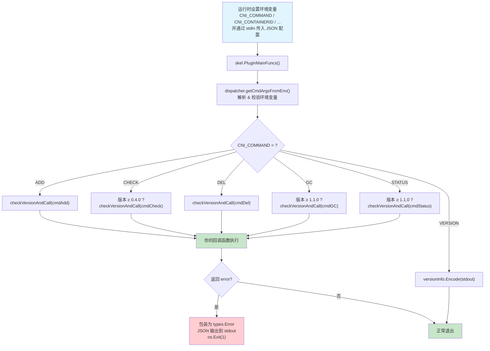
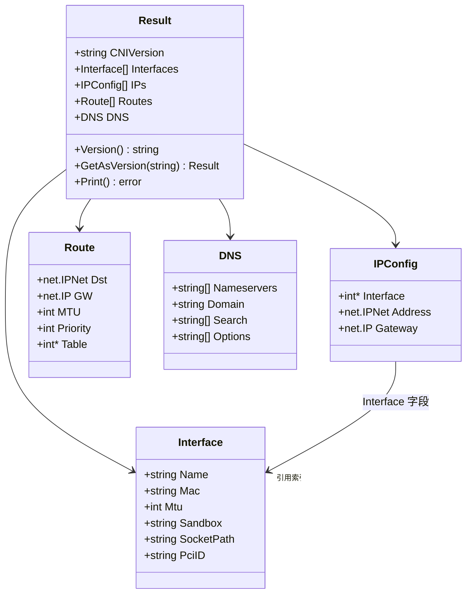

本文是一篇**手把手教程**，带领你从零开始构建一个符合 CNI 规范的插件。我们将基于仓库中的 `skel` 骨架包、`types` 类型系统和 `debug` 参考实现，逐步拆解一个 CNI 插件的核心骨架、配置解析、操作分发与结果返回机制，最终产出一个可直接运行的**最小可工作插件（MVP）**。

Sources: [skel.go](pkg/skel/skel.go#L1-L33), [main.go](plugins/debug/main.go#L1-L43)

## 理解插件开发模型：一个插件的职责边界

CNI 插件本质上是一个**可执行二进制文件**，容器运行时（runtime）通过环境变量 + stdin JSON 的方式与其通信，插件则通过 stdout 返回 JSON 结果。这意味着插件开发者不需要关心 HTTP 服务、长连接、守护进程等复杂模型——你只需要处理命令行级别的输入输出。

在架构层面，CNI 仓库为你提供了三层抽象来降低开发复杂度：

| 层级 | 包路径 | 职责 |
|------|--------|------|
| **骨架层** | `pkg/skel` | 环境变量解析、命令分发、版本校验、错误格式化 |
| **类型层** | `pkg/types` 及子包 | 网络配置结构体、结果类型、错误码定义 |
| **版本层** | `pkg/version` | 版本声明、版本协商、PrevResult 解析 |

作为插件开发者，你的核心工作是**填写回调函数**——为 ADD、CHECK、DEL 等操作编写具体逻辑——而框架层面的样板代码全部由 `skel` 包处理。

Sources: [skel.go](pkg/skel/skel.go#L346-L395), [types.go](pkg/types/types.go#L59-L78), [version.go](pkg/version/version.go#L25-L40)

## 插件执行流程全景

在动手写代码之前，先理解当一个 CNI 插件被运行时调用时，`skel` 框架内部发生了什么：



**关键观察**：你编写的回调函数签名统一为 `func(*skel.CmdArgs) error`，框架会自动处理版本兼容性检查、环境变量校验（ContainerID 格式、接口名长度等）、以及错误到 JSON 的格式化输出。

Sources: [skel.go](pkg/skel/skel.go#L232-L346), [skel.go](pkg/skel/skel.go#L59-L188)

## CmdArgs：插件获取输入的唯一入口

`skel.CmdArgs` 是框架传递给你回调函数的**完整参数集合**，它汇总了环境变量和 stdin 的所有信息：

```go
type CmdArgs struct {
    ContainerID   string  // 来自 CNI_CONTAINERID
    Netns         string  // 来自 CNI_NETNS，容器网络命名空间路径
    IfName        string  // 来自 CNI_IFNAME，要创建的接口名
    Args          string  // 来自 CNI_ARGS，额外的 key=value 对
    Path          string  // 来自 CNI_PATH，插件搜索路径
    NetnsOverride string  // 来自 CNI_NETNS_OVERRIDE
    StdinData     []byte  // 从 stdin 读取的原始 JSON 配置
}
```

框架在校验阶段已经完成了以下工作（你无需重复）：

- **ContainerID** 非空且只包含合法字符 `[a-zA-Z0-9_.\-]`
- **IfName** 长度不超过 15 个字符，不包含 `/`、`:` 或空白字符，且不能是 `.` 或 `..`
- **stdin JSON** 包含有效的 `name` 字段，且名称通过合法性校验
- **cniVersion** 与插件声明的支持版本列表兼容

Sources: [skel.go](pkg/skel/skel.go#L36-L45), [utils.go](pkg/utils/utils.go#L26-L82)

## 第一步：创建项目结构与模块初始化

让我们开始构建一个名为 `mynet` 的最小 CNI 插件。参照 `plugins/debug` 的模块结构，推荐的项目布局如下：

```
mynet/
├── go.mod
├── go.sum
└── main.go
```

初始化 Go 模块并添加 CNI 库依赖：

```bash
mkdir mynet && cd mynet
go mod init example.com/mynet
go get github.com/containernetworking/cni@latest
```

> **注意**：`plugins/debug` 使用了 `replace` 指令将 CNI 库指向本地路径（`replace github.com/containernetworking/cni => ../..`），这是开发模式下的做法。对外发布的插件应直接引用正式版本。参考 [go.mod](plugins/debug/go.mod#L15-L16)。

Sources: [go.mod](plugins/debug/go.mod#L1-L16)

## 第二步：定义网络配置结构体

每个 CNI 插件都需要一个配置结构体，它必须**嵌入 `types.NetConf`（即 `types.PluginConf`）** 作为基础字段，然后声明插件特有的配置项。以 `debug` 插件为例：

```go
type NetConf struct {
    types.NetConf                    // 嵌入基础配置：cniVersion, name, type, ipam, dns 等
    CNIOutput  string     `json:"cniOutput,omitempty"`   // 插件特有：调试输出文件路径
    AddHooks   [][]string `json:"addHooks,omitempty"`    // 插件特有：ADD 时执行的钩子命令
    DelHooks   [][]string `json:"delHooks,omitempty"`    // 插件特有：DEL 时执行的钩子命令
    CheckHooks [][]string `json:"checkHooks,omitempty"`  // 插件特有：CHECK 时执行的钩子命令
}
```

**基础配置 `types.PluginConf` 提供的字段**：

| 字段 | JSON 键 | 用途 |
|------|---------|------|
| `CNIVersion` | `cniVersion` | 配置声明的 CNI 规范版本 |
| `Name` | `name` | 网络名称，全局唯一标识 |
| `Type` | `type` | 插件二进制文件名（运行时用此名查找可执行文件） |
| `Capabilities` | `capabilities` | 声明插件支持的能力 |
| `IPAM` | `ipam` | IP 地址管理配置，包含 `type` 子字段指向 IPAM 插件 |
| `DNS` | `dns` | DNS 配置 |
| `RawPrevResult` | `prevResult` | 上一个插件的原始执行结果 |
| `PrevResult` | -（内部使用） | 解析后的 `types.Result` 接口 |
| `ValidAttachments` | `cni.dev/valid-attachments` | GC 操作的有效附件列表 |

Sources: [main.go](plugins/debug/main.go#L33-L39), [types.go](pkg/types/types.go#L61-L78)

## 第三步：编写配置解析函数

配置通过 stdin 以 JSON 格式传入，你的回调函数从 `args.StdinData` 获取原始字节。解析模式非常直接——反序列化到你定义的 `NetConf` 结构体：

```go
func parseConf(data []byte) (*NetConf, error) {
    conf := &NetConf{}
    if err := json.Unmarshal(data, conf); err != nil {
        return nil, fmt.Errorf("failed to parse network configuration: %w", err)
    }
    // 如果需要处理 prevResult，可调用 version.ParsePrevResult
    return conf, nil
}
```

如果你的插件在**插件链**中使用（参见[插件链式执行与委托机制](7-cha-jian-lian-shi-zhi-xing-yu-wei-tuo-delegation-ji-zhi)），则需要处理 `prevResult`。`noop` 测试插件展示了标准做法：

```go
func loadConf(bytes []byte) (*NetConf, error) {
    n := &NetConf{}
    if err := json.Unmarshal(bytes, n); err != nil {
        return nil, fmt.Errorf("failed to load netconf: %w", err)
    }
    // 解析 prevResult 字段，填充 NetConf.PrevResult
    if err := version.ParsePrevResult(&n.PluginConf); err != nil {
        return nil, err
    }
    return n, nil
}
```

`version.ParsePrevResult` 会将 `RawPrevResult`（`map[string]interface{}`）转换为类型安全的 `types.Result` 接口对象，并将 `RawPrevResult` 置为 `nil` 以防止重复解析。

Sources: [main.go](plugins/debug/main.go#L62-L69), [main.go](plugins/test/noop/main.go#L44-L53), [version.go](pkg/version/version.go#L66-L90)

## 第四步：编写 ADD 回调函数

ADD 是 CNI 插件最核心的操作——它负责创建网络接口或将容器加入网络。你的 `cmdAdd` 函数需要完成配置解析、网络操作、然后返回结果。

以下是一个最小 ADD 实现，参考了 `debug` 插件的模式：

```go
func cmdAdd(args *skel.CmdArgs) error {
    // 1. 解析配置
    netConf, err := parseConf(args.StdinData)
    if err != nil {
        return err
    }

    // 2. 在这里执行你的网络操作
    //    例如：创建 veth pair、配置 bridge、设置路由等
    //    netConf 中的插件特有字段可用于参数化操作

    // 3. 构建并返回结果
    result := &type100.Result{
        CNIVersion: netConf.CNIVersion,
        Interfaces: []*type100.Interface{
            {
                Name:    args.IfName,
                Sandbox: args.Netns,
            },
        },
        IPs: []*type100.IPConfig{
            {
                Address: net.IPNet{
                    IP:   net.ParseIP("10.1.2.3"),
                    Mask: net.CIDRMask(24, 32),
                },
                Gateway:   net.ParseIP("10.1.2.1"),
                Interface: type100.Int(0),  // 指向 interfaces[0]
            },
        },
        Routes: []*types.Route{
            {
                Dst: net.IPNet{
                    IP:   net.ParseIP("0.0.0.0"),
                    Mask: net.CIDRMask(0, 32),
                },
                GW: net.ParseIP("10.1.2.1"),
            },
        },
        DNS: types.DNS{
            Nameservers: []string{"10.1.2.1"},
        },
    }

    // types.PrintResult 会自动进行版本转换并输出到 stdout
    return types.PrintResult(result, netConf.CNIVersion)
}
```

**关键细节**：`types.PrintResult` 内部调用 `result.GetAsVersion(version)` 将结果转换到配置要求的 CNI 版本格式，然后调用 `Print()` 输出 JSON 到 stdout。这确保了版本兼容性——即使你用 `type100.Result` 构建结果，如果配置声明了 `cniVersion: "0.4.0"`，输出会自动下转换。

Sources: [main.go](plugins/debug/main.go#L102-L116), [types.go](pkg/types/100/types.go#L89-L96), [types.go](pkg/types/types.go#L144-L150)

## 第五步：编写 CHECK 和 DEL 回调函数

### CHECK 操作

CHECK 用于运行时验证容器网络是否处于预期状态。它在 CNI spec ≥ 0.4.0 版本中引入。你的实现应该检查之前 ADD 创建的资源是否仍然存在且有效：

```go
func cmdCheck(args *skel.CmdArgs) error {
    netConf, err := parseConf(args.StdinData)
    if err != nil {
        return err
    }

    // 检查接口是否存在、IP 是否配置、路由是否正确等
    // 如果一切正常，返回 nil（无需输出结果）
    // 如果发现异常，返回 types.Error

    _ = netConf // 使用 netConf.PrevResult 进行校验
    return nil  // CHECK 成功时不输出任何内容
}
```

### DEL 操作

DEL 负责清理 ADD 创建的所有资源。**关键原则**：DEL 必须是**幂等的**——即使资源不存在也必须返回成功：

```go
func cmdDel(args *skel.CmdArgs) error {
    netConf, err := parseConf(args.StdinData)
    if err != nil {
        return err
    }

    // 清理 ADD 创建的接口、路由、IP 分配等
    // 如果资源已不存在，仍返回 nil（幂等性）

    _ = netConf
    return types.PrintResult(&type100.Result{}, netConf.CNIVersion)
}
```

Sources: [main.go](plugins/debug/main.go#L118-L148), [SPEC.md](SPEC.md#L265-L334)

## 第六步：（可选）编写 GC 和 STATUS 回调函数

如果你希望插件支持 CNI spec 1.1.0 引入的新操作，可以实现 GC 和 STATUS：

```go
func cmdGC(args *skel.CmdArgs) error {
    netConf, err := parseConf(args.StdinData)
    if err != nil {
        return err
    }

    // netConf.ValidAttachments 包含仍然有效的 (containerID, ifname) 对
    // 清理不在列表中的所有残留资源
    for _, att := range netConf.ValidAttachments {
        _ = att // 跳过有效的附件
    }
    return nil
}

func cmdStatus(args *skel.CmdArgs) error {
    // 检查插件是否准备好处理 ADD 请求
    // 如果不可用，返回 types.Error{Code: 50} 或 {Code: 51}
    return nil
}
```

Sources: [skel.go](pkg/skel/skel.go#L293-L336), [SPEC.md](SPEC.md#L337-L399)

## 第七步：编写 main 函数——组装一切

`main` 函数是你插件的总入口。它通过 `skel.PluginMainFuncs()`（推荐）或已废弃的 `skel.PluginMain()` 将回调函数注册到框架：

```go
package main

import (
    "github.com/containernetworking/cni/pkg/skel"
    "github.com/containernetworking/cni/pkg/version"
)

func main() {
    skel.PluginMainFuncs(
        skel.CNIFuncs{
            Add:    cmdAdd,
            Check:  cmdCheck,
            Del:    cmdDel,
            GC:     cmdGC,      // 可选，传 nil 则框架自动返回不兼容错误
            Status: cmdStatus,  // 可选，传 nil 则框架自动返回不兼容错误
        },
        version.All,              // 声明支持所有 CNI 版本
        "CNI mynet plugin v1.0.0", // 无 CNI_COMMAND 时输出到 stderr 的说明文字
    )
}
```

`skel.PluginMainFuncs` 和 `skel.PluginMain` 的**核心区别**在于接口风格和 GC/STATUS 支持：

| API | 状态 | 支持的操作 | 错误处理 |
|-----|------|-----------|---------|
| `PluginMainFuncs()` | ✅ 推荐 | ADD / CHECK / DEL / GC / STATUS | 自动 JSON + Exit(1) |
| `PluginMain()` | ⚠️ 已废弃 | ADD / CHECK / DEL | 自动 JSON + Exit(1) |
| `PluginMainFuncsWithError()` | ✅ 推荐 | ADD / CHECK / DEL / GC / STATUS | 返回 error，由调用者处理 |
| `PluginMainWithError()` | ⚠️ 已废弃 | ADD / CHECK / DEL | 返回 error，由调用者处理 |

`version.All` 声明你的插件支持从 `0.1.0` 到 `1.1.0` 的全部 CNI 规范版本。如果你只需要支持较新版本，可以使用 `version.PluginSupports("1.0.0", "1.1.0")` 或 `version.VersionsStartingFrom("1.0.0")`。

Sources: [skel.go](pkg/skel/skel.go#L410-L440), [skel.go](pkg/skel/skel.go#L366-L395), [version.go](pkg/version/version.go#L37-L56)

## 完整的最小可工作插件

将以上所有步骤整合，这是一个完整的 `main.go`：

```go
package main

import (
    "encoding/json"
    "fmt"
    "net"

    "github.com/containernetworking/cni/pkg/skel"
    "github.com/containernetworking/cni/pkg/types"
    type100 "github.com/containernetworking/cni/pkg/types/100"
    "github.com/containernetworking/cni/pkg/version"
)

// NetConf 嵌入基础配置，声明插件特有字段
type NetConf struct {
    types.NetConf
    // 在此添加你的插件配置字段
}

func parseConf(data []byte) (*NetConf, error) {
    conf := &NetConf{}
    if err := json.Unmarshal(data, conf); err != nil {
        return nil, fmt.Errorf("failed to parse netconf: %w", err)
    }
    return conf, nil
}

func cmdAdd(args *skel.CmdArgs) error {
    netConf, err := parseConf(args.StdinData)
    if err != nil {
        return err
    }

    // TODO: 在此执行实际的网络配置操作
    // 例如创建 veth pair、连接 bridge、分配 IP 等

    result := &type100.Result{
        CNIVersion: netConf.CNIVersion,
        Interfaces: []*type100.Interface{
            {Name: args.IfName, Sandbox: args.Netns},
        },
        IPs: []*type100.IPConfig{
            {
                Address:   net.IPNet{IP: net.ParseIP("10.1.0.2"), Mask: net.CIDRMask(24, 32)},
                Gateway:   net.ParseIP("10.1.0.1"),
                Interface: type100.Int(0),
            },
        },
    }
    return types.PrintResult(result, netConf.CNIVersion)
}

func cmdCheck(args *skel.CmdArgs) error {
    // TODO: 校验网络状态是否与 prevResult 一致
    return nil
}

func cmdDel(args *skel.CmdArgs) error {
    // TODO: 清理网络资源（幂等操作）
    return nil
}

func main() {
    skel.PluginMainFuncs(skel.CNIFuncs{
        Add:   cmdAdd,
        Check: cmdCheck,
        Del:   cmdDel,
    }, version.All, "CNI mynet plugin v1.0.0")
}
```

编译并放置到 CNI 插件目录后即可使用：

```bash
go build -o mynet .
sudo cp mynet /opt/cni/bin/
```

Sources: [main.go](plugins/debug/main.go#L41-L43), [main.go](plugins/test/noop/main.go#L248-L263)

## 结果类型的构建与返回

CNI 插件在 ADD 操作成功时必须通过 stdout 输出一个 JSON 格式的 Result 对象。`type100.Result`（对应 CNI spec 1.0.0/1.1.0）包含四个核心部分：



构建 Result 时需要注意：

- **IPConfig.Interface** 是一个 `*int` 指针，值为 `Interfaces` 数组的索引。使用 `type100.Int(0)` 辅助函数创建。如果 IP 不关联到任何接口，设为 `nil`。
- **Interface.Sandbox** 对于容器内的接口，应设置为 `CNI_NETNS` 的值（即 `args.Netns`）；宿主机上的接口留空。
- **DNS** 如果为空结构体，`Result.MarshalJSON()` 会自动删除该字段以符合规范要求。

Sources: [types.go](pkg/types/100/types.go#L89-L267), [types.go](pkg/types/100/types.go#L269-L353)

## 错误处理：使用 types.Error

当你的插件遇到错误时，应返回 `types.Error` 结构体。`skel` 框架会自动将其序列化为 JSON 输出到 stdout 并调用 `os.Exit(1)`：

```go
import "github.com/containernetworking/cni/pkg/types"

// 返回规范错误码
return types.NewError(types.ErrInvalidNetworkConfig, "subnet too small", "192.168.0.0/31")

// 返回自定义错误码（≥100）
return types.NewError(100, "my custom error", "details here")
```

**规范定义的错误码速查**：

| 错误码 | 常量 | 含义 | 典型场景 |
|--------|------|------|---------|
| 1 | `ErrIncompatibleCNIVersion` | CNI 版本不兼容 | 配置版本超出插件支持范围 |
| 3 | `ErrUnknownContainer` | 容器不存在 | DEL 时容器已被删除 |
| 4 | `ErrInvalidEnvironmentVariables` | 环境变量无效 | ContainerID 格式错误 |
| 7 | `ErrInvalidNetworkConfig` | 网络配置无效 | 子网太小、缺少必要字段 |
| 11 | `ErrTryAgainLater` | 稍后重试 | 瞬时故障，如 IPAM 临时不可用 |
| 50 | `ErrPluginNotAvailable` | 插件不可用 | STATUS 返回，无法处理新 ADD |
| 51 | `ErrLimitedConnectivity` | 连接受限 | STATUS 返回，已有容器可能受影响 |
| 999 | `ErrInternal` | 内部错误 | 未分类的运行时错误 |

如果你返回的是普通的 Go `error`（非 `*types.Error`），`skel` 框架会自动将其包装为 `types.Error{Code: 999, Msg: err.Error()}`。因此，在需要精确控制错误码时应使用 `types.NewError`。

Sources: [types.go](pkg/types/types.go#L231-L269), [skel.go](pkg/skel/skel.go#L190-L214)

## 编写网络配置文件并测试

创建一个网络配置 JSON 文件来测试你的插件：

```json
{
    "cniVersion": "1.0.0",
    "name": "mynet",
    "type": "mynet",
    "dns": {
        "nameservers": ["10.1.0.1"]
    }
}
```

使用 `cnitool` 或直接设置环境变量来调用插件：

```bash
# 使用 cnitool（推荐）
sudo cnitool add mynet /run/netns/testns

# 或手动调用（理解底层机制）
CNI_COMMAND=ADD \
CNI_CONTAINERID=test-container \
CNI_NETNS=/run/netns/testns \
CNI_IFNAME=eth0 \
CNI_PATH=/opt/cni/bin \
./mynet < config.json
```

关于 `cnitool` 的详细使用方法，参见 [使用 cnitool 命令行工具管理容器网络](3-shi-yong-cnitool-ming-ling-xing-gong-ju-guan-li-rong-qi-wang-luo)。

Sources: [SPEC.md](SPEC.md#L151-L193), [SPEC.md](SPEC.md#L675-L699)

## 版本声明策略

版本声明直接影响你的插件能与哪些运行时配置协同工作。`pkg/version` 包提供了灵活的声明方式：

| API | 声明的版本范围 | 适用场景 |
|-----|--------------|---------|
| `version.All` | 0.1.0, 0.2.0, 0.3.0, 0.3.1, 0.4.0, 1.0.0, 1.1.0 | 通用插件，最大兼容性 |
| `version.Legacy` | 0.1.0, 0.2.0 | 仅兼容旧版规范 |
| `version.PluginSupports("1.0.0", "1.1.0")` | 1.0.0, 1.1.0 | 仅支持新版规范 |
| `version.VersionsStartingFrom("0.4.0")` | 0.4.0, 1.0.0, 1.1.0 | 从某个版本起的所有版本 |

`skel` 框架在执行回调前会自动进行版本协商：它读取配置中的 `cniVersion`，检查是否在你声明的支持列表中，然后调用 `checkVersionAndCall`。如果版本不兼容，框架会直接返回 `ErrIncompatibleCNIVersion` 错误，你的回调函数不会被调用。

Sources: [version.go](pkg/version/version.go#L25-L56), [skel.go](pkg/skel/skel.go#L190-L214)

## 进阶：集成 IPAM 委托

大多数实际 CNI 插件需要 IP 地址管理（IPAM）功能。与其自己实现 IP 分配逻辑，不如通过**委托（Delegation）** 机制调用专门的 IPAM 插件（如 `host-local`）。`pkg/invoke` 包提供了标准化的委托调用函数：

```go
import "github.com/containernetworking/cni/pkg/invoke"

// 在 cmdAdd 中调用 IPAM 插件
func cmdAdd(args *skel.CmdArgs) error {
    netConf, _ := parseConf(args.StdinData)

    // 委托 IPAM 插件执行 ADD
    ipamResult, err := invoke.DelegateAdd(
        context.Background(),
        netConf.IPAM.Type,     // IPAM 插件名，如 "host-local"
        args.StdinData,        // 传递完整网络配置
        nil,                   // 使用默认的 Exec 实现
    )
    if err != nil {
        return err
    }

    // 从 IPAM 结果中获取 IP 配置
    ipamResult100, _ := type100.NewResultFromResult(ipamResult)
    // ... 将 IPAM 结果整合到你的最终 Result 中 ...

    // 在 cmdDel 中调用 IPAM 插件清理
    // invoke.DelegateDel(ctx, netConf.IPAM.Type, args.StdinData, nil)
}
```

委托机制的核心要求是：**将你收到的完整配置和环境变量原样传递给被委托插件**。`invoke.DelegateArgs` 会确保 `CNI_COMMAND` 被正确覆盖为对应操作。

Sources: [delegate.go](pkg/invoke/delegate.go#L25-L89), [SPEC.md](SPEC.md#L535-L563)

## 插件开发检查清单

在完成插件开发后，对照以下清单验证你的实现是否符合 CNI 规范：

| 检查项 | 对应规范 | 验证方法 |
|--------|---------|---------|
| ADD 成功时输出 Result JSON 到 stdout | Spec §2 ADD | 检查 stdout 输出格式 |
| ADD 返回的 `cniVersion` 与输入一致 | Spec §5 | 对比输入输出 |
| DEL 是幂等的（重复调用不报错） | Spec §2 DEL | 多次调用 DEL 验证 |
| CHECK 正确处理 `prevResult` | Spec §2 CHECK | 检查 prevResult 校验逻辑 |
| 错误以 JSON 格式输出到 stdout | Spec §5 Error | 触发错误检查输出 |
| 插件二进制文件名与配置 `type` 字段匹配 | Spec §1 | 检查文件名 |
| 支持 VERSION 命令 | Spec §2 VERSION | 无 CNI_COMMAND 时检查 stderr |
| 正确处理 prevResult（链式场景） | Spec §3 | 在插件链中测试 |
| 委托 IPAM 的 ADD 失败时执行 DEL 清理 | Spec §4 | 模拟 IPAM 失败场景 |

## 延伸阅读

- [Debug 插件源码解析与测试技巧](19-debug-cha-jian-yuan-ma-jie-xi-yu-ce-shi-ji-qiao) — 深入分析仓库中的参考插件实现
- [插件委托调用：IPAM 及其他委托插件集成](20-cha-jian-wei-tuo-diao-yong-ipam-ji-qi-ta-wei-tuo-cha-jian-ji-cheng) — 完整的委托机制详解
- [skel 骨架包：构建 CNI 插件的起点](13-skel-gu-jia-bao-gou-jian-cni-cha-jian-de-qi-dian) — 框架内部的详细工作原理
- [执行协议：ADD、DEL、CHECK、GC、STATUS 五大操作](6-zhi-xing-xie-yi-add-del-check-gc-status-wu-da-cao-zuo) — 各操作的规范语义与边界条件