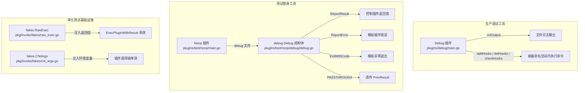
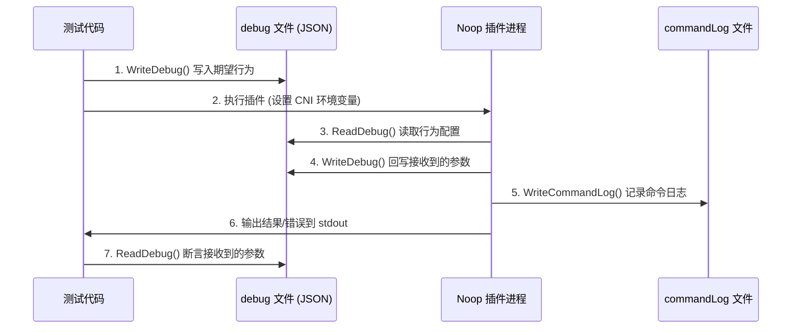
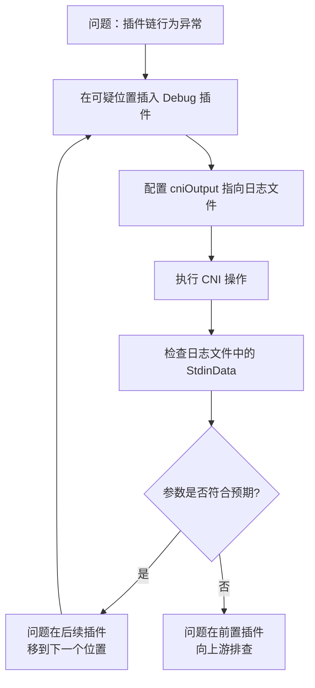

CNI 项目提供了两类测试辅助工具：**Debug 插件**（`plugins/debug`）用于在生产环境中调试插件链式调用，**Noop/Sleep 测试插件**（`plugins/test`）则配合 `debug` 辅助库构建可编程的测试替身（Test Double）。本章将从源码层面拆解这两套工具的架构设计、实现细节与测试模式，帮助你在插件开发和问题排查中高效运用它们。

Sources: [main.go](plugins/debug/main.go#L1-L149), [main.go](plugins/test/noop/main.go#L1-L264)

## 整体架构：双轨调试体系

在深入代码之前，需要厘清 CNI 项目中"Debug"一词的两层含义——它们分属不同的目录，服务于不同场景：



| 工具 | 位置 | 用途 | 使用场景 |
|------|------|------|----------|
| **Debug 插件** | `plugins/debug/` | 插入插件链，记录所有 CNI 参数并执行自定义钩子 | 生产环境排查、插件链调试 |
| **Noop 插件** | `plugins/test/noop/` | 通过 debug 文件控制行为的可编程插件 | 集成测试、libcni API 测试 |
| **debug 库** | `plugins/test/noop/debug/` | 读写 Debug 结构体的 JSON 持久化层 | Noop 插件的配置与断言基础 |
| **Sleep 插件** | `plugins/test/sleep/` | 阻塞 60 秒后退出 | 超时行为测试 |
| **fakes 包** | `pkg/invoke/fakes/` | 接口级别的 Mock 实现 | 单元测试中替代真实插件执行 |

Sources: [main.go](plugins/debug/main.go#L1-L42), [main.go](plugins/test/noop/main.go#L1-L36), [debug.go](plugins/test/noop/debug/debug.go#L28-L42)

## Debug 插件源码深度解析

### 入口与配置结构

Debug 插件是一个独立的 Go Module，通过 `go.mod` 中的 `replace` 指令引用本地 CNI 库：

```
module github.com/containernetworking/cni/plugins/debug
go 1.21
require (
    github.com/containernetworking/cni v1.1.2
    github.com/containernetworking/plugins v1.4.0
)
replace github.com/containernetworking/cni => ../..
```

这种 `replace` 策略使得 Debug 插件既是一个独立可编译的二进制，又能直接使用父目录的最新 CNI 库代码，避免了发布-引用的循环依赖。

Sources: [go.mod](plugins/debug/go.mod#L1-L16)

插件的入口函数极其简洁——调用 `skel.PluginMain` 注册三个操作处理器：

```go
func main() {
    skel.PluginMain(cmdAdd, cmdCheck, cmdDel, version.All, bv.BuildString("none"))
}
```

`version.All` 声明该插件支持所有 CNI 版本，`bv.BuildString("none")` 则生成一个不携带具体构建信息的 about 字符串。当无 `CNI_COMMAND` 环境变量时，skel 框架会将该 about 字符串输出到 stderr，例如：`CNI plugin none v0.0.0-<commit>`。

Sources: [main.go](plugins/debug/main.go#L41-L43), [skel.go](pkg/skel/skel.go#L432-L439)

### NetConf：扩展配置模型

Debug 插件在标准 `types.NetConf` 基础上扩展了三个专属字段：

```go
type NetConf struct {
    types.NetConf
    CNIOutput  string     `json:"cniOutput,omitempty"`
    AddHooks   [][]string `json:"addHooks,omitempty"`
    DelHooks   [][]string `json:"delHooks,omitempty"`
    CheckHooks [][]string `json:"checkHooks,omitempty"`
}
```

**`CNIOutput`** 指定一个文件路径，Debug 插件会将每次 CNI 操作的完整参数追加写入该文件。这是一个 **追加写**（`O_APPEND`）模式，意味着多次 ADD → CHECK → DEL 操作的记录会顺序保留在同一文件中，形成完整的操作时序日志。

**`AddHooks` / `DelHooks` / `CheckHooks`** 各自是一个二维字符串切片 `[][]string`，每个元素是一个命令及其参数列表（类似 `exec.Command` 的调用约定），会在对应的 CNI 操作阶段于容器的网络命名空间内执行。

Sources: [main.go](plugins/debug/main.go#L33-L39)

### 核心操作处理函数

三个操作处理函数 `cmdAdd`、`cmdDel`、`cmdCheck` 遵循完全一致的执行模式：

```go
func cmdAdd(args *skel.CmdArgs) error {
    netConf, _ := parseConf(args.StdinData)
    // 1. 条件性日志输出
    if netConf.CNIOutput != "" {
        fp, _ := os.OpenFile(netConf.CNIOutput, os.O_WRONLY|os.O_CREATE|os.O_APPEND, 0o644)
        defer fp.Close()
        fmt.Fprintf(fp, "CmdAdd\n")
        outputCmdArgs(fp, args)
    }
    // 2. 条件性钩子执行
    if netConf.AddHooks != nil {
        executeHooks(args.Netns, netConf.AddHooks)
    }
    // 3. 返回 Result
    return types.PrintResult(getResult(netConf), netConf.CNIVersion)
}
```

每个处理函数按三步走策略执行：**日志记录 → 钩子执行 → 结果返回**。值得注意的是 `parseConf` 的错误被静默忽略（`netConf, _ := parseConf(...)`），这意味着即使配置解析失败，插件也不会中断——这是一种**容错优先**的设计哲学，确保 Debug 插件本身永远不会成为插件链的故障点。

Sources: [main.go](plugins/debug/main.go#L102-L148)

### 结果构造：PrevResult 透传机制

`getResult` 函数体现了 Debug 插件在插件链中的"透明代理"角色：

```go
func getResult(netConf *NetConf) *type100.Result {
    if netConf.RawPrevResult == nil {
        return &type100.Result{}
    }
    version.ParsePrevResult(&netConf.NetConf)
    result, _ := type100.NewResultFromResult(netConf.PrevResult)
    return result
}
```

如果配置中存在 `prevResult`（由前置插件产生），Debug 插件会将其解析并原样返回；否则返回一个空的 `type100.Result`。这确保了 Debug 插件在插件链中插入或移除时不会影响最终的网络配置结果。

Sources: [main.go](plugins/debug/main.go#L71-L79)

### 钩子执行：命名空间内的命令注入

`executeHooks` 是 Debug 插件最强大的功能——它能在容器网络命名空间内执行任意命令：

```go
func executeHooks(netnsName string, hooks [][]string) {
    netns, err := ns.GetNS(netnsName)
    if err != nil {
        return  // 静默失败，不中断插件链
    }
    defer netns.Close()

    netns.Do(func(_ ns.NetNS) error {
        for _, hookStrs := range hooks {
            hookCmd := hookStrs[0]
            hookArgs := hookStrs[1:]
            output, err := exec.Command(hookCmd, hookArgs...).Output()
            if err != nil {
                fmt.Fprintf(os.Stderr, "OUTPUT: %v", output)
                fmt.Fprintf(os.Stderr, "ERR: %v", err)
            }
        }
        return nil
    })
}
```

该函数通过 `ns.GetNS` 获取目标网络命名空间句柄，然后调用 `netns.Do` 在该命名空间内闭包执行所有钩子命令。关键设计决策：**所有错误都只输出到 stderr 而不返回**——这再次体现了容错优先的理念，钩子命令失败不会导致 CNI 操作失败。

Sources: [main.go](plugins/debug/main.go#L81-L100)

### 日志输出格式

`outputCmdArgs` 将 `skel.CmdArgs` 的所有字段格式化输出到指定文件，形成结构化的调试记录：

```
CmdAdd
ContainerID: cnitool-20c433bb2b1d6ede56d6
Netns: /var/run/netns/cnitest
IfName: eth0
Args: 
Path: /opt/cni/bin
StdinData: {"cniOutput":"/tmp/cni_output.txt","cniVersion":"0.3.1",...}
----------------------
```

这六项信息完整捕获了 CNI 运行时传递给插件的所有上下文，是排查"插件收到的参数是否符合预期"的一手证据。

Sources: [main.go](plugins/debug/main.go#L45-L60), [README.md](plugins/debug/README.md#L53-L72)

### 实战配置示例

以下是 Debug 插件在真实 ptp + portmap 插件链中的典型配置：

```json
{
    "cniVersion": "0.3.1",
    "name": "mynet",
    "plugins": [
        {
            "type": "ptp",
            "ipMasq": true,
            "ipam": { "type": "host-local", "subnet": "172.16.30.0/24" }
        },
        {
            "type": "debug",
            "cniOutput": "/tmp/cni_output.txt",
            "addHooks": [
                ["sh", "-c", "ip link set $CNI_IFNAME promisc on"]
            ]
        },
        {
            "type": "portmap",
            "capabilities": {"portMappings": true}
        }
    ]
}
```

| 字段 | 类型 | 说明 |
|------|------|------|
| `cniOutput` | `string`（可选） | 输出文件的绝对路径，追加写入 |
| `addHooks` | `[][]string`（可选） | ADD 操作时在容器 netns 中执行的命令列表 |
| `delHooks` | `[][]string`（可选） | DEL 操作时在容器 netns 中执行的命令列表 |
| `checkHooks` | `[][]string`（可选） | CHECK 操作时在容器 netns 中执行的命令列表 |

**设计注意**：所有 Hooks 字段仅执行命令并忽略失败，适用于调试场景（如开启混杂模式、添加临时路由），不适用于关键网络配置操作。

Sources: [README.md](plugins/debug/README.md#L9-L51)

## Noop 测试插件：可编程的测试替身

如果说 Debug 插件是生产环境的"监视器"，那么 Noop 插件就是测试环境的"演员"——它的所有行为都由外部 debug 文件控制，可以精确模拟各种插件响应。

### 架构设计：文件驱动的状态机



Noop 插件的核心是 `debug.Debug` 结构体——一个通过 JSON 文件与测试代码双向通信的控制面板：

```go
type Debug struct {
    // 控制 Noop 插件行为的字段
    ReportResult         string   // 插件要输出的 JSON 结果
    ReportError          string   // 要返回的错误消息
    ReportErrorCode      uint     // 错误码
    ReportStderr         string   // 要输出到 stderr 的内容
    ReportVersionSupport []string // 声明支持的版本列表
    ExitWithCode         int      // 以指定退出码退出

    // 记录 Noop 插件接收到的信息
    Command string       // 收到的 CNI 命令 (ADD/DEL/CHECK/GC/STATUS)
    CmdArgs skel.CmdArgs // 收到的完整 CNI 参数
}
```

Sources: [debug.go](plugins/test/noop/debug/debug.go#L28-L42)

### 行为控制机制详解

Noop 插件的 `debugBehavior` 函数实现了一个基于 debug 文件的多分支行为控制器：

| `ReportResult` 值 | 行为 | 用途 |
|---|---|---|
| JSON 字符串 | 直接输出到 stdout | 模拟特定 Result |
| `"PASSTHROUGH"` | 透传 `prevResult` | 测试插件链中 Result 传递 |
| `"INJECT-DNS"` | 透传 prevResult 并注入 DNS | 测试 DNS 修改行为 |
| `""`（空） | 不输出任何结果 | 测试无 Result 场景 |

当 `ReportError` 非空时，插件返回一个 `types.Error`，错误码默认为 `types.ErrInternal`（可通过 `ReportErrorCode` 自定义）。`ExitWithCode > 0` 则直接调用 `os.Exit`，用于测试运行时处理非标准退出的能力。

Sources: [main.go](plugins/test/noop/main.go#L92-L181)

### debug 文件路径解析优先级

Noop 插件通过 `getConfig` 函数解析 debug 文件路径，采用两级回退策略：

1. **首选**：`CNI_ARGS` 环境变量中的 `DEBUG=<path>` 键值对
2. **回退**：配置 JSON 中的 `"debugFile"` 字段

```go
func getConfig(stdinData []byte, args string) (string, *NetConf, error) {
    netConf, err := loadConf(stdinData)
    // ...
    extraArgs, err := parseExtraArgs(args)
    // ...
    debugFilePath, ok := extraArgs["DEBUG"]
    if !ok {
        debugFilePath = netConf.DebugFile
    }
    return debugFilePath, netConf, nil
}
```

这种设计使得测试既可以通过环境变量灵活控制（无需修改配置文件），也可以通过配置文件固定路径（适用于 `libcni` 级别的集成测试）。

Sources: [main.go](plugins/test/noop/main.go#L73-L90)

### CommandLog：多插件调用时序追踪

`debug.CmdLogEntry` 和 `WriteCommandLog` 提供了比单个 `Debug` 文件更宏观的调用追踪能力：

```go
type CmdLogEntry struct {
    Command string
    CmdArgs skel.CmdArgs
}
type CmdLog []CmdLogEntry
```

`WriteCommandLog` 以追加方式将每次调用记录写入日志文件，形成一个完整的调用序列。在 libcni 的集成测试中，这使得测试代码能够验证多插件链中每个插件的调用顺序和参数传递是否正确。

Sources: [debug.go](plugins/test/noop/debug/debug.go#L44-L101)

### Stdin 保护机制

Noop 插件的 `main` 函数有一个容易被忽视但至关重要的设计——在 `skel.PluginMainFuncs` 之前抢先读取 stdin：

```go
func main() {
    stdinData, err := saveStdin()
    // ...
    supportedVersions := debugGetSupportedVersions(stdinData)
    skel.PluginMainFuncs(skel.CNIFuncs{...}, ...)
}
```

`saveStdin` 读取原始 stdin 数据后创建一个新的 pipe 回写，确保 `skel` 框架能正常消费 stdin。这是因为 `debugGetSupportedVersions` 需要提前读取配置来决定版本支持列表——而 skel 框架在内部也会读取 stdin。这种"先读再回放"的模式是处理单次读取 io.Reader 的经典 Go 惯用法。

Sources: [main.go](plugins/test/noop/main.go#L225-L263)

## 测试技巧与模式精要

### 模式一：Noop 插件的黑盒集成测试

Noop 插件自身的测试展示了如何用 `gexec` 框架对编译后的二进制进行端到端验证：

```go
// 编译 noop 插件（在 SynchronizedBeforeSuite 中完成）
pathToPlugin, err = gexec.Build("github.com/containernetworking/cni/plugins/test/noop")

// 准备 debug 文件
debug := &noop_debug.Debug{
    ReportResult:         `{ "ips": [{ "version": "4", "address": "10.1.2.3/24" }] }`,
    ReportVersionSupport: []string{"0.1.0", "0.2.0", "0.3.0", "0.3.1", "0.4.0"},
}
debug.WriteDebug(debugFileName)

// 通过环境变量驱动插件执行
cmd.Env = []string{
    "CNI_COMMAND=ADD",
    "CNI_CONTAINERID=some-container-id",
    "CNI_NETNS=/some/netns/path",
    "CNI_IFNAME=some-eth0",
    "CNI_PATH=/some/bin/path",
    "CNI_ARGS=DEBUG=" + debugFileName + ";FOO=BAR",
}
cmd.Stdin = strings.NewReader(`{"name": "noop-test", "cniVersion": "0.3.1"}`)

// 启动并验证
session, _ := gexec.Start(cmd, GinkgoWriter, GinkgoWriter)
Eventually(session).Should(gexec.Exit(0))
Expect(session.Out.Contents()).To(MatchJSON(reportResult))
```

**关键技巧**：
- `gexec.Build` 在测试编译阶段生成二进制，`SynchronizedBeforeSuite` 确保并行测试只编译一次
- `Eventually(session).Should(gexec.Exit(0))` 提供异步等待，避免时序竞争
- `MatchJSON` 进行语义等价的 JSON 比较，忽略空白和字段顺序

Sources: [noop_test.go](plugins/test/noop/noop_test.go#L33-L99), [noop_suite_test.go](plugins/test/noop/noop_suite_test.go#L34-L45)

### 模式二：libcni API 测试中的插件编排

`libcni/api_test.go` 展示了更高级的用法——用 Noop 插件模拟完整的插件链：

```go
func makePluginList(cniVersion, ipResult string, ...) (*libcni.NetworkConfigList, []pluginInfo) {
    plugins := make([]pluginInfo, 3)
    // 插件 0：返回 IP 结果
    plugins[0] = newPluginInfo(cniVersion, "some-value", "", true, ipResult, ...)
    // 插件 1：透传前一个插件的结果
    plugins[1] = newPluginInfo(cniVersion, "some-other-value", ipResult, true, "PASSTHROUGH", ...)
    // 插件 2：透传并注入 DNS
    plugins[2] = newPluginInfo(cniVersion, "yet-another-value", ipResult, true, "INJECT-DNS", ...)
    // ...
}
```

这个三插件链精确模拟了真实场景：第一个插件产生 IP 配置，第二个插件透传不变，第三个插件附加 DNS 信息。每个 `pluginInfo` 都有自己的 debug 文件和 commandLog 文件，使测试能够独立验证每个插件的输入和输出。

Sources: [api_test.go](libcni/api_test.go#L64-L151)

### 模式三：接口级 Mock 与 fakes 包

对于不需要真实插件进程的单元测试，`pkg/invoke/fakes` 提供了 `invoke.Exec` 接口的纯内存 Mock：

```go
// 组合多个 fake 接口
pluginExec = &struct {
    *fakes.RawExec
    *fakes.VersionDecoder
}{
    RawExec:        rawExec,
    VersionDecoder: versionDecoder,
}

// 配置返回值
rawExec.ExecPluginCall.Returns.ResultBytes = []byte(`{
    "cniVersion": "0.3.1",
    "ips": [{ "version": "4", "address": "1.2.3.4/24" }]
}`)

// 执行并验证
result, err := invoke.ExecPluginWithResult(ctx, pluginPath, netconf, cniargs, pluginExec)
```

fakes 包的设计遵循"手动 Mock"模式——每个 fake 结构体内嵌 `Received`（记录接收到的调用参数）和 `Returns`（指定返回值），不依赖代码生成工具。这种模式在接口方法较少时比 mockgen 更直观。

| Fake 类型 | 实现接口 | 核心用途 |
|-----------|---------|---------|
| `fakes.RawExec` | `ExecPlugin` + `FindInPath` | 控制插件执行返回值 |
| `fakes.CNIArgs` | `AsEnv()` | 注入自定义环境变量列表 |
| `fakes.VersionDecoder` | `Decode()` | 控制版本解码结果 |

Sources: [raw_exec.go](pkg/invoke/fakes/raw_exec.go#L1-L55), [cni_args.go](pkg/invoke/fakes/cni_args.go#L1-L28), [exec_test.go](pkg/invoke/exec_test.go#L31-L62)

### 模式四：Sleep 插件测试超时行为

Sleep 插件是整个项目中最简单的插件——仅包含一行有效代码：

```go
func main() {
    time.Sleep(60 * time.Second)
}
```

它的唯一用途是测试 CNI 运行时对超时插件的容忍度。当使用带 context 超时的 `ExecPlugin` 调用 Sleep 插件时，运行时应当能在超时后正确取消执行并返回错误，而非无限等待。

Sources: [main.go](plugins/test/sleep/main.go#L1-L28)

### 测试技巧速查表

| 技巧 | 适用场景 | 关键 API |
|------|---------|---------|
| **配置注入 debugFile** | libcni 集成测试 | `newPluginInfo(..., injectDebugFilePath: true, ...)` |
| **环境变量注入 DEBUG** | 直接执行插件二进制 | `CNI_ARGS=DEBUG=/tmp/debug.json` |
| **PASSTHROUGH 验证传递** | 测试插件链 Result 透传 | `debug.ReportResult = "PASSTHROUGH"` |
| **ReportError 模拟失败** | 测试错误处理路径 | `debug.ReportError = "something failed"` |
| **ExitWithCode 测试退出码** | 测试非标准退出 | `debug.ExitWithCode = 3` |
| **CommandLog 追踪顺序** | 验证多插件调用时序 | `noop_debug.ReadCommandLog(path)` |
| **fakes 内存 Mock** | 纯单元测试无文件 I/O | `fakes.RawExec{...Returns: struct{...}}` |
| **gexec 异步等待** | 编译+执行真实二进制 | `Eventually(session).Should(gexec.Exit(0))` |

## 调试流程实战指南

### 使用 Debug 插件排查插件链问题



**操作步骤**：

1. 在插件链配置中的目标位置前插入 Debug 插件配置块
2. 设置 `"cniOutput": "/tmp/cni_debug.log"`
3. 触发 CNI ADD/DEL 操作
4. 读取 `/tmp/cni_debug.log`，重点检查 `StdinData` 中的 `prevResult` 是否正确
5. 如需在容器 netns 中执行诊断命令，配置 `addHooks` 或 `checkHooks`

### Debug 与 Noop 的选用决策

| 维度 | Debug 插件 | Noop 插件 |
|------|-----------|-----------|
| **运行环境** | 生产 / 准生产 | 仅测试环境 |
| **行为** | 透传 prevResult，附加日志 | 完全由外部文件控制 |
| **副作用** | 写日志文件、执行钩子命令 | 写 debug 文件、commandLog |
| **可编程性** | 配置驱动，行为固定 | 完全可编程 |
| **典型用途** | 排查参数传递问题 | 模拟各种插件响应 |

Sources: [main.go](plugins/debug/main.go#L102-L116), [main.go](plugins/test/noop/main.go#L92-L181)

## 下一步学习

掌握了调试与测试工具后，你可以继续深入以下主题：

- [插件委托调用：IPAM 及其他委托插件集成](20-cha-jian-wei-tuo-diao-yong-ipam-ji-qi-ta-wei-tuo-cha-jian-ji-cheng)——理解插件如何通过 Delegation 调用 IPAM 等委托插件，以及如何在调试场景中追踪委托链路
- [skel 骨架包：构建 CNI 插件的起点](13-skel-gu-jia-bao-gou-jian-cni-cha-jian-de-qi-dian)——深入了解 Debug 插件所依赖的 `skel.PluginMain` 框架如何解析环境变量、校验版本并分发命令
- [插件执行引擎：查找、调用与结果处理](12-cha-jian-zhi-xing-yin-qing-cha-zhao-diao-yong-yu-jie-guo-chu-li)——理解 `invoke.Exec` 接口和 fakes 包在整个插件调用链中的位置