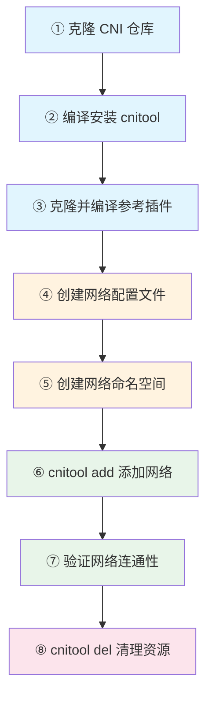
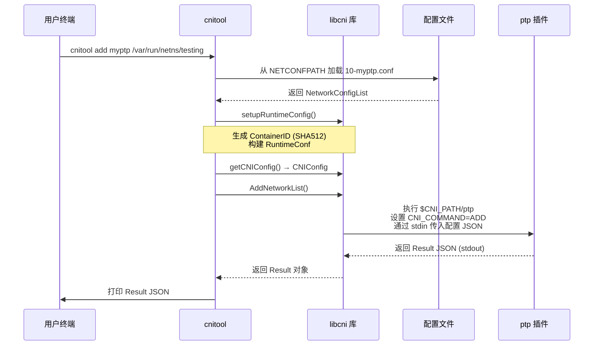

本文是一份面向初学者的**实操教程**，目标是在你的本地机器上从零搭建 CNI 开发环境，并成功运行第一个 CNI 网络配置。你将完成：克隆仓库 → 编译安装 → 编写网络配置 → 使用 `cnitool` 添加网络接口 → 验证连通性 → 清理资源——这一完整闭环。阅读本文前，建议先了解 [项目概述：CNI 是什么及其核心价值](1-xiang-mu-gai-shu-cni-shi-shi-yao-ji-qi-he-xin-jie-zhi)；完成本文后，可继续深入 [使用 cnitool 命令行工具管理容器网络](3-shi-yong-cnitool-ming-ling-xing-gong-ju-guan-li-rong-qi-wang-luo) 和 [CNI 规范全景：网络配置格式详解](5-cni-gui-fan-quan-jing-wang-luo-pei-zhi-ge-shi-xiang-jie)。

## 前置条件

CNI 的核心库和工具使用 Go 语言编写，而网络插件的执行依赖 Linux 内核的网络命名空间（network namespace）能力。以下是搭建环境所需的硬性条件：

| 依赖项 | 最低版本要求 | 用途 | 验证命令 |
|--------|-------------|------|---------|
| **Go** | ≥ 1.21 | 编译 CNI 库、cnitool 及测试插件 | `go version` |
| **Linux 操作系统** | 任意现代发行版 | 提供网络命名空间、veth pair 等内核特性 | `uname -r` |
| **jq** | 任意版本 | Shell 脚本解析 JSON 配置（`priv-net-run.sh` 依赖） | `jq --version` |
| **iproute2** | 任意现代版本 | 管理网络命名空间和接口（`ip netns` 命令） | `ip -V` |
| **sudo 权限** | — | 创建/删除网络命名空间需要 root 权限 | — |

> **macOS / Windows 用户注意**：CNI 插件的执行需要 Linux 内核支持。如果你在 macOS 上开发，需要使用 Linux 虚拟机（如 Lima、Multipass）或 Docker 容器作为运行环境。代码编译本身可以跨平台完成，但插件的实际执行必须在 Linux 上进行。

项目的 Go 模块声明了最低版本要求为 Go 1.21，CI 流水线使用 Go 1.22 进行构建和测试。

Sources: [go.mod](go.mod#L3), [.github/workflows/test.yaml](.github/workflows/test.yaml#L7-L8)

## 整体流程概览

在正式动手之前，先理解我们要完成的全流程。下图展示了从环境准备到运行验证的完整步骤链：



**蓝色步骤**（①②③）是只需执行一次的环境搭建；**橙色步骤**（④⑤）是配置网络定义；**绿色步骤**（⑥⑦）是实际使用；**红色步骤**（⑧）是资源清理。

## 第一步：获取并编译 CNI 仓库

CNI 仓库包含**规范文档**、**Go 库**（libcni、pkg 下的各个包）以及 **cnitool** 命令行工具。参考插件则维护在 [独立的 plugins 仓库](https://github.com/containernetworking/plugins) 中。

```bash
# 克隆 CNI 主仓库
git clone https://github.com/containernetworking/cni.git
cd cni
```

仓库的核心目录结构如下，在后续操作中你会频繁接触标注了 ★ 的部分：

| 目录/文件 | 用途 | 你需要关注 |
|-----------|------|-----------|
| `cnitool/` | 命令行工具，用于手动执行 CNI 配置 | ★ 本教程核心工具 |
| `libcni/` | 供容器运行时集成的 Go 库 | 后续深入学习 |
| `pkg/` | 底层支撑包（skel、invoke、types、version 等） | 后续深入学习 |
| `plugins/debug/` | 调试用 CNI 插件 | ★ 调试排错利器 |
| `plugins/test/` | 测试用的 noop 和 sleep 插件 | 单元测试依赖 |
| `scripts/` | 辅助脚本（priv-net-run.sh 等） | ★ 另一种运行方式 |
| `SPEC.md` | CNI 规范正文 | 规范参考 |
| `go.mod` | Go 模块定义（Go 1.21+） | 编译基础 |

编译并安装 `cnitool`：

```bash
# 在 cni 仓库根目录下执行
go install ./cnitool
```

安装成功后，`cnitool` 二进制文件会被放入 `$GOPATH/bin`（或 `$HOME/go/bin`）。验证安装：

```bash
cnitool --help
```

你应该看到类似如下的输出，列出 `add`、`check`、`del`、`gc`、`status` 五个子命令：

```
CNI Tool is a simple program that executes a CNI configuration.
It will add, check, remove, gc, or get status of an interface
in an already-created network namespace.

Usage:
  cnitool [command]

Available Commands:
  add         Add network interface to a network namespace
  check       Check network interface in a network namespace
  del         Delete network interface from a network namespace
  gc          Garbage collect network interfaces
  status      Get status of network interfaces
```

Sources: [cnitool/main.go](cnitool/main.go#L17-L29), [cnitool/cmd/root.go](cnitool/cmd/root.go#L47-L53), [cnitool/README.md](cnitool/README.md#L49-L56)

## 第二步：获取并编译参考插件

CNI 规范定义了插件接口，而实际的网络功能（如 bridge、ptp、host-local IPAM）由**参考插件**提供。这些插件维护在独立仓库中，需要单独编译：

```bash
# 在 cni 仓库同级目录下克隆插件仓库
cd ..
git clone https://github.com/containernetworking/plugins.git
cd plugins

# 编译所有 Linux 插件
./build_linux.sh
```

编译完成后，所有插件的二进制文件位于 `plugins/bin/` 目录下。这些二进制文件就是 CNI 插件——它们是**可执行文件**，CNI 运行时通过文件名（即配置中的 `type` 字段）来查找并调用它们。

关键的参考插件列表：

| 插件名 | 功能 | 本教程使用 |
|--------|------|-----------|
| `bridge` | 创建网桥并将容器接口连接到网桥 | ★ |
| `ptp` | 创建点对点 veth 链路 | ★ |
| `host-local` | 本地 IP 地址管理（IPAM） | ★ |
| `loopback` | 配置 loopback 接口 | ★ |
| `portmap` | 端口映射（iptables） | — |

Sources: [README.md](README.md#L87-L95), [cnitool/README.md](cnitool/README.md#L58-L66)

## 第三步：创建网络配置文件

CNI 通过 JSON 配置文件描述网络。`cnitool` 默认在 `/etc/cni/net.d` 目录下搜索配置文件，搜索优先级为：先找 `*.conflist`（插件链配置），如果没有则找 `*.conf` 或 `*.json`（单插件配置）。

我们创建一个使用 **ptp（点对点）** 插件的简单网络配置。这个配置将创建一个 veth pair，为容器端分配 `172.16.29.0/24` 子网内的 IP 地址，并设置默认路由：

```bash
# 创建配置目录
sudo mkdir -p /etc/cni/net.d

# 创建 ptp 网络配置
echo '{
  "cniVersion": "0.4.0",
  "name": "myptp",
  "type": "ptp",
  "ipMasq": true,
  "ipam": {
    "type": "host-local",
    "subnet": "172.16.29.0/24",
    "routes": [
      { "dst": "0.0.0.0/0" }
    ]
  }
}' | sudo tee /etc/cni/net.d/10-myptp.conf
```

逐字段解读这个配置文件：

| 字段 | 值 | 含义 |
|------|---|------|
| `cniVersion` | `"0.4.0"` | 遵循的 CNI 规范版本（支持 CHECK 操作） |
| `name` | `"myptp"` | 网络名称，`cnitool` 通过此名称查找配置 |
| `type` | `"ptp"` | 要调用的插件二进制文件名 |
| `ipMasq` | `true` | 在主机端配置 IP 伪装（SNAT） |
| `ipam.type` | `"host-local"` | IPAM 插件类型，使用 host-local 管理子网分配 |
| `ipam.subnet` | `"172.16.29.0/24"` | 分配给容器的 IP 子网 |
| `ipam.routes` | `[{"dst":"0.0.0.0/0"}]` | 注入默认路由到容器网络命名空间 |

同时创建一个 loopback 配置（这是 CNI 的最佳实践，确保容器的回环接口正常工作）：

```bash
echo '{
  "cniVersion": "0.4.0",
  "name": "lo",
  "type": "loopback"
}' | sudo tee /etc/cni/net.d/99-loopback.conf
```

Sources: [cnitool/README.md](cnitool/README.md#L68-L72), [libcni/conf.go](libcni/conf.go#L356-L389), [README.md](README.md#L98-L126)

## 第四步：运行第一个 CNI 配置

现在万事俱备——**cnitool** 已编译、**参考插件** 已构建、**网络配置** 已就位。接下来创建一个网络命名空间，并用 `cnitool` 将其加入网络。

### 4.1 创建网络命名空间

网络命名空间（netns）是 Linux 内核提供的隔离机制，CNI 在此空间内配置网络接口。`cnitool` 要求命名空间已经存在：

```bash
sudo ip netns add testing
```

### 4.2 添加网络接口（ADD 操作）

使用 `cnitool add` 命令将 `myptp` 网络配置应用到 `testing` 命名空间。`CNI_PATH` 环境变量告诉 `cnitool` 到哪里查找插件二进制文件：

```bash
# 设置插件路径（指向你编译参考插件的 bin 目录）
export CNI_PATH=/path/to/plugins/bin

# 执行 ADD 操作
sudo CNI_PATH=$CNI_PATH cnitool add myptp /var/run/netns/testing
```

如果一切正常，你将看到类似如下的 JSON 输出——这就是 CNI 的 **Result 对象**，描述了已配置的网络接口和 IP 地址：

```json
{
    "cniVersion": "0.4.0",
    "interfaces": [
        {"name": "veth0f2d5e4d", "mac": "a6:e8:3b:de:1f:5c"},
        {"name": "eth0", "mac": "56:8b:6e:1c:3d:a9", "sandbox": "/var/run/netns/testing"}
    ],
    "ips": [
        {
            "version": "4",
            "interface": 1,
            "address": "172.16.29.2/24",
            "gateway": "172.16.29.1"
        }
    ],
    "routes": [
        {"dst": "0.0.0.0/0", "gw": "172.16.29.1"}
    ]
}
```

### 4.3 验证配置结果

执行 `cnitool add` 后，让我们验证容器网络命名空间内的网络状态：

```bash
# 查看命名空间内的网络接口
sudo ip -n testing addr

# 预期输出包含：
# 1: lo: <LOOPBACK> ...
# 2: eth0: ... inet 172.16.29.2/24 ...

# 查看路由表
sudo ip -n testing route
# 预期输出包含：
# default via 172.16.29.1 dev eth0
# 172.16.29.0/24 dev eth0 proto kernel scope link src 172.16.29.2
```

### 4.4 检查网络状态（CHECK 操作）

CNI 规范 0.4.0 及以上版本支持 **CHECK** 操作，用于验证已配置的网络是否仍然符合预期：

```bash
sudo CNI_PATH=$CNI_PATH cnitool check myptp /var/run/netns/testing
# 无输出表示检查通过
```

Sources: [cnitool/README.md](cnitool/README.md#L76-L97), [cnitool/cmd/add.go](cnitool/cmd/add.go#L30-L46), [cnitool/cmd/check.go](cnitool/cmd/check.go#L30-L37)

## 第五步：理解执行过程的内部机制

当你执行 `cnitool add myptp /var/run/netns/testing` 时，内部发生了什么？理解这个流程有助于后续排错和深入学习。



关键的环境变量和参数传递链如下表所示：

| 环节 | 传递方式 | 内容 |
|------|---------|------|
| 配置文件路径 | `NETCONFPATH` 环境变量，默认 `/etc/cni/net.d` | `cnitool` 从中查找匹配 `name` 的配置 |
| 插件查找路径 | `CNI_PATH` 环境变量 | `libcni` 从中查找与 `type` 同名的可执行文件 |
| 操作类型 | `CNI_COMMAND` 环境变量 | `ADD`、`DEL`、`CHECK`、`GC`、`STATUS` |
| 容器标识 | `CNI_CONTAINERID` 环境变量 | `cnitool` 通过 SHA512 哈希 netns 路径生成 |
| 网络命名空间 | `CNI_NETNS` 环境变量 | 指向 netns 的绝对路径 |
| 接口名称 | `CNI_IFNAME` 环境变量或 `-i` 参数 | 默认 `eth0` |
| 网络配置 | stdin 管道 | JSON 格式的完整插件配置 |

`cnitool` 在 `setupRuntimeConfig` 函数中将用户的命令行参数和环境变量统一组装为 `libcni.RuntimeConf` 结构体，然后调用 `libcni.CNIConfig.AddNetworkList` 完成实际的网络配置。

Sources: [cnitool/cmd/root.go](cnitool/cmd/root.go#L83-L155), [libcni/api.go](libcni/api.go#L50-L68)

## 第六步：清理资源

实验完成后，务必清理创建的资源，防止网络命名空间和 IP 地址泄漏：

```bash
# 删除网络接口（DEL 操作）
sudo CNI_PATH=$CNI_PATH cnitool del myptp /var/run/netns/testing

# 删除网络命名空间
sudo ip netns del testing
```

`cnitool del` 会调用 `libcni.CNIConfig.DelNetworkList`，依次执行配置中的所有插件的 DEL 操作，释放 IP 地址、删除 veth 接口、清理 iptables 规则等。

Sources: [cnitool/README.md](cnitool/README.md#L99-L104), [cnitool/cmd/del.go](cnitool/cmd/del.go#L30-L37)

## 替代方案：使用 Shell 脚本快速体验

除了 `cnitool`，CNI 仓库还提供了两个 Shell 脚本，可以在不编译 Go 工具的情况下快速体验 CNI。这些脚本直接调用 `exec-plugins.sh`，通过环境变量传递参数并执行插件二进制。

**`priv-net-run.sh`** 创建一个临时的网络命名空间，配置网络后在其中执行指定命令，退出时自动清理：

```bash
cd /path/to/cni/scripts
sudo CNI_PATH=/path/to/plugins/bin ./priv-net-run.sh ifconfig
```

**`docker-run.sh`** 将 Docker 容器（以 `--net=none` 启动）的网络命名空间交给 CNI 插件配置：

```bash
cd /path/to/cni/scripts
sudo CNI_PATH=/path/to/plugins/bin ./docker-run.sh --rm busybox:latest ifconfig
```

`priv-net-run.sh` 的执行逻辑非常直观——创建 netns → 调用 `exec-plugins.sh add` → 在 netns 中执行用户命令 → 退出时调用 `exec-plugins.sh del` → 删除 netns。`exec-plugins.sh` 则遍历 `NETCONFPATH` 中的所有 `.conf` 文件，对每个配置调用对应的插件二进制，并通过环境变量注入 `CNI_COMMAND`、`CNI_CONTAINERID`、`CNI_NETNS` 等参数。

> **注意**：`priv-net-run.sh` 依赖 `jq` 工具来解析 JSON 配置文件。如果执行报错，请先确认 `jq` 已安装。

Sources: [scripts/priv-net-run.sh](scripts/priv-net-run.sh#L1-L21), [scripts/docker-run.sh](scripts/docker-run.sh#L1-L22), [scripts/exec-plugins.sh](scripts/exec-plugins.sh#L1-L74), [README.md](README.md#L92-L162)

## 常见问题排查

| 问题现象 | 可能原因 | 解决方案 |
|---------|---------|---------|
| `cnitool: command not found` | `$GOPATH/bin` 不在 `PATH` 中 | `export PATH=$PATH:$(go env GOPATH)/bin` |
| `no net configuration with name "myptp"` | 配置文件未创建或路径错误 | 确认 `/etc/cni/net.d/10-myptp.conf` 存在且 `name` 字段正确 |
| `failed to find plugin "ptp"` | `CNI_PATH` 未设置或路径不对 | `export CNI_PATH=/path/to/plugins/bin`，确认 `ptp` 二进制在该目录下 |
| `ip netns add: Operation not permitted` | 需要 root 权限 | 使用 `sudo` 执行 |
| `ADD` 返回错误码和 JSON | 插件执行失败 | 检查 JSON 输出中的 `msg` 和 `code` 字段 |
| CHECK 操作报错 | 配置使用了低于 0.4.0 的 `cniVersion` | 将 `cniVersion` 升级为 `"0.4.0"` 或更高 |
| `jq: command not found`（使用脚本时） | 缺少 `jq` 工具 | `sudo apt install jq` 或 `sudo yum install jq` |

Sources: [libcni/conf.go](libcni/conf.go#L31-L46), [cnitool/cmd/root.go](cnitool/cmd/root.go#L31-L38)

## 运行单元测试

验证你的开发环境是否完整搭建，最直接的方式是运行项目的单元测试。项目提供了 `test.sh` 脚本，它会执行所有 Go 包的测试并检查许可证头：

```bash
cd /path/to/cni
./test.sh
```

测试脚本的核心逻辑是：获取所有 Go 包列表 → 对每个包运行 `go test` → 检查所有 `.go` 文件的许可证头是否包含 "Copyright" 字样。CI 流水线在 Ubuntu（amd64）和 Windows 上都执行这些测试。

Sources: [test.sh](test.sh#L1-L35), [.github/workflows/test.yaml](.github/workflows/test.yaml#L55-L82)

## 下一步学习方向

完成本教程后，你已掌握了 CNI 环境搭建和基本操作流程。以下是推荐的进阶路线：

1. **深入 cnitool**：了解 `cnitool` 的所有子命令和环境变量配置 → [使用 cnitool 命令行工具管理容器网络](3-shi-yong-cnitool-ming-ling-xing-gong-ju-guan-li-rong-qi-wang-luo)
2. **理解配置格式**：学习网络配置的完整字段定义和插件链（Network Configuration List）→ [CNI 规范全景：网络配置格式详解](5-cni-gui-fan-quan-jing-wang-luo-pei-zhi-ge-shi-xiang-jie)
3. **掌握执行协议**：理解 ADD、DEL、CHECK、GC、STATUS 五大操作的具体语义 → [执行协议：ADD、DEL、CHECK、GC、STATUS 五大操作](6-zhi-xing-xie-yi-add-del-check-gc-status-wu-da-cao-zuo)
4. **开发自己的插件**：从零构建一个符合 CNI 规范的插件 → [从零开发一个 CNI 插件](18-cong-ling-kai-fa-ge-cni-cha-jian)