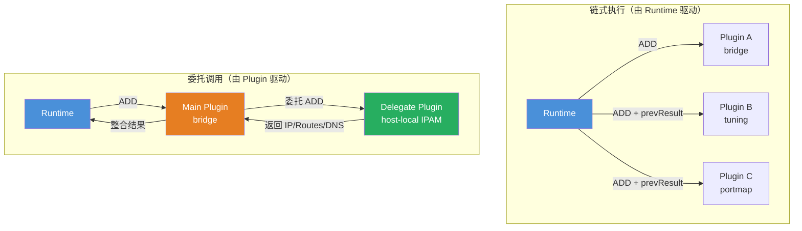
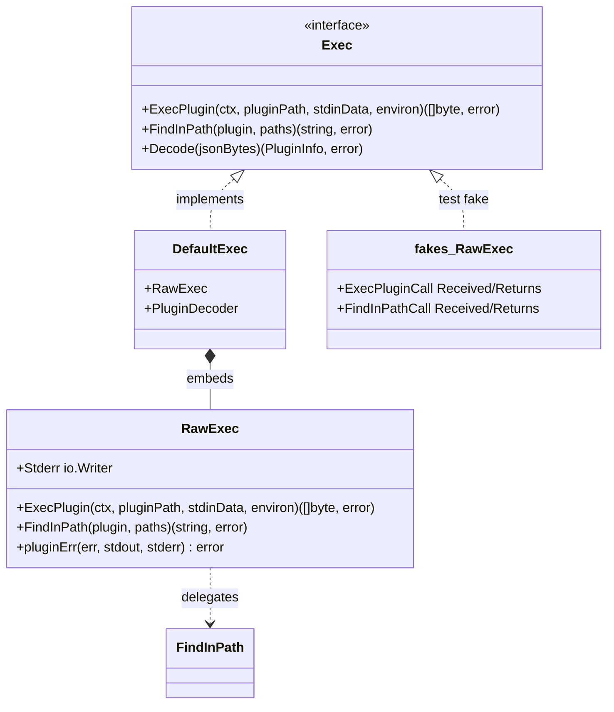
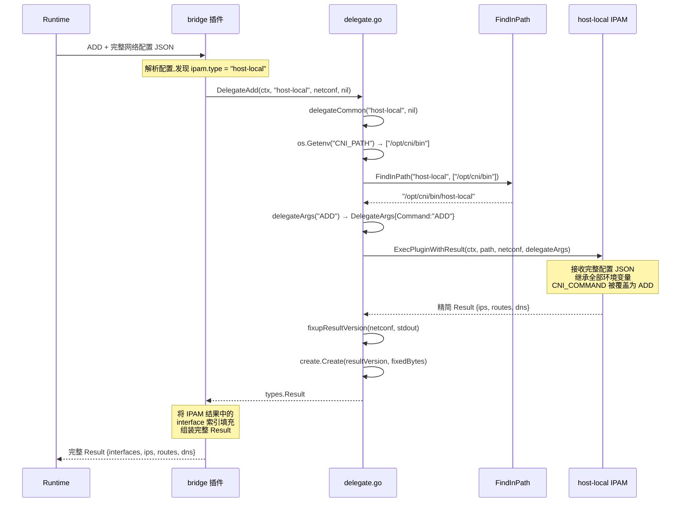

在 CNI 的插件生态中，存在一类无法通过链式执行（Plugin Chaining）实现的协作模式——**委托调用（Delegation）**。链式插件由运行时（Runtime）依次调度，每个插件独立处理并传递 `prevResult`；而委托调用则由插件自身在执行过程中主动调用另一个插件，最典型的场景便是 IP 地址管理（IPAM）。本文将从规范定义出发，深入剖析 `pkg/invoke` 包中委托调用的完整实现机制，包括环境变量继承、插件发现、结果处理以及可测试性设计，为高级开发者在自定义插件中集成委托功能提供精确的技术指导。

Sources: [SPEC.md](SPEC.md#L535-L564), [delegate.go](pkg/invoke/delegate.go#L1-L90)

## 委托调用与链式执行的架构差异

在理解委托调用之前，必须明确它与链式执行的本质区别。链式执行由容器运行时驱动——运行时按照 `plugins` 列表顺序依次调用每个插件，每次调用时将上一个插件的输出作为 `prevResult` 注入 stdin。这种模式适用于**顺序无关耦合**的场景，例如 bridge → tuning → portmap 的组合。

然而，某些操作在语义上要求由主插件在**自身执行流程的特定阶段**调用另一个插件，而非由运行时编排。IPAM 就是这一模式的最佳示例：bridge 插件在配置网络接口之前必须先获取 IP 地址，而获取 IP 的策略（host-local、DHCP 等）又应与插件类型正交解耦。CNI 规范将这种模式定义为 **Section 4: Plugin Delegation**。



关键的设计差异在于：链式执行中每个插件接收的 stdin 配置由运行时组装（包含 `prevResult`），而委托调用中被委托插件接收的是**主插件收到的完整网络配置**——在 IPAM 场景下，并非只传递 `ipam` 字段，而是整个 JSON 配置对象。

Sources: [SPEC.md](SPEC.md#L535-L564)

## 委托调用的五项操作函数

`pkg/invoke/delegate.go` 提供了与 CNI 五大操作（ADD、CHECK、DEL、STATUS、GC）一一对应的委托函数。每个函数的核心职责是：定位被委托插件二进制文件 → 覆盖 `CNI_COMMAND` 环境变量 → 执行插件并处理结果。

### 公共基础设施：delegateCommon

所有委托操作共享同一个预处理逻辑 `delegateCommon`，它完成两个关键步骤：

1. **Exec 接口回退**：若调用方未提供自定义 `Exec` 实现，则使用包级默认实例 `defaultExec`（即 `DefaultExec`，内含 `RawExec` 和 `PluginDecoder`）。
2. **插件路径查找**：通过 `CNI_PATH` 环境变量解析搜索路径列表，调用 `exec.FindInPath` 定位被委托插件的二进制文件。

```go
func delegateCommon(delegatePlugin string, exec Exec) (string, Exec, error) {
    if exec == nil {
        exec = defaultExec
    }
    paths := filepath.SplitList(os.Getenv("CNI_PATH"))
    pluginPath, err := exec.FindInPath(delegatePlugin, paths)
    if err != nil {
        return "", nil, err
    }
    return pluginPath, exec, nil
}
```

`CNI_PATH` 遵循操作系统标准的路径分隔符（Unix 为 `:`，Windows 为 `;`），由 `filepath.SplitList` 正确拆分。插件二进制文件通过 `FindInPath` 在每个路径目录中搜索匹配的可执行文件。

Sources: [delegate.go](pkg/invoke/delegate.go#L25-L37), [find.go](pkg/invoke/find.go#L25-L48)

### 五项委托操作 API 一览

| 函数 | CNI 操作 | 返回值 | 使用场景 |
|------|---------|--------|---------|
| `DelegateAdd` | ADD | `(types.Result, error)` | 主插件获取 IPAM 分配结果 |
| `DelegateCheck` | CHECK | `error` | 验证委托插件状态一致性 |
| `DelegateDel` | DEL | `error` | 释放 IPAM 资源 |
| `DelegateStatus` | STATUS | `error` | 检查委托插件可用性 |
| `DelegateGC` | GC | `error` | 清理孤立委托资源 |

其中 `DelegateAdd` 直接调用 `ExecPluginWithResult`（因为 ADD 必须返回结果），而其余四个操作通过内部函数 `delegateNoResult` 调用 `ExecPluginWithoutResult`（因为 CHECK/DEL/STATUS/GC 不需要结构化返回值）。

```go
func DelegateAdd(ctx context.Context, delegatePlugin string, netconf []byte, exec Exec) (types.Result, error) {
    pluginPath, realExec, err := delegateCommon(delegatePlugin, exec)
    if err != nil {
        return nil, err
    }
    return ExecPluginWithResult(ctx, pluginPath, netconf, delegateArgs("ADD"), realExec)
}

func delegateNoResult(ctx context.Context, delegatePlugin string, netconf []byte, exec Exec, verb string) error {
    pluginPath, realExec, err := delegateCommon(delegatePlugin, exec)
    if err != nil {
        return err
    }
    return ExecPluginWithoutResult(ctx, pluginPath, netconf, delegateArgs(verb), realExec)
}
```

Sources: [delegate.go](pkg/invoke/delegate.go#L39-L89), [exec.go](pkg/invoke/exec.go#L121-L145)

## 环境变量继承机制：DelegateArgs 的设计哲学

委托调用的环境变量处理是整个机制中最精妙的部分。在 `pkg/invoke/args.go` 中定义了三种 `CNIArgs` 实现，分别服务于不同场景：

| 类型 | 用途 | 环境变量策略 |
|------|------|-------------|
| `inherited` | 标准插件执行（由 libcni 调用） | 返回 `nil`，继承进程全部环境 |
| `Args` | 非委托场景的显式构造 | 从 `os.Environ()` 开始，追加全部六个 CNI 变量 |
| `DelegateArgs` | **委托调用** | 从 `os.Environ()` 开始，**仅覆盖 `CNI_COMMAND`** |

`DelegateArgs` 的设计哲学源于 CNI 规范的要求：被委托插件必须接收与主插件**完全相同的环境变量**，唯一需要改变的是 `CNI_COMMAND`（因为主插件可能在 CHECK 操作中委托 ADD，或反之）。

```go
type DelegateArgs struct {
    Command string
}

func (d *DelegateArgs) AsEnv() []string {
    env := os.Environ()
    env = append(env,
        "CNI_COMMAND="+d.Command,
    )
    return dedupEnv(env)
}
```

关键实现在于 `dedupEnv` 函数——它以 **后出现者优先** 的策略去重。由于自定义的 `CNI_COMMAND` 被追加到 `os.Environ()` 的末尾，`dedupEnv` 会保留新值而非原始值。这意味着即使主插件因 `CNI_COMMAND=CHECK` 而启动，它委托的 IPAM 插件依然能正确接收到 `CNI_COMMAND=ADD`。

测试用例明确验证了这一行为：当主插件环境为 `CNI_COMMAND=NOPE` 时，`DelegateAdd` 成功将被委托插件的命令覆盖为 `ADD`，且主插件自身的环境变量不受影响。

Sources: [args.go](pkg/invoke/args.go#L87-L128)

## 插件发现与路径查找

委托插件的二进制文件查找遵循严格的规则，实现在 `FindInPath` 函数中：

1. **空名称拒绝**：插件名不可为空字符串。
2. **路径分隔符拒绝**：插件名不可包含 `/` 或 `\`，防止路径遍历攻击。
3. **空路径拒绝**：搜索路径列表不可为空。
4. **按序搜索**：依次在每个 `CNI_PATH` 目录中查找匹配的可执行文件，找到即返回。
5. **平台适配**：通过 `ExecutableFileExtensions` 变量处理平台差异——Unix 系统直接查找文件名，Windows 系统额外尝试 `.exe` 后缀。

```go
var ExecutableFileExtensions = []string{""}        // Unix (os_unix.go)
var ExecutableFileExtensions = []string{".exe", ""} // Windows (os_windows.go)
```

在委托场景中，`delegateCommon` 从 `os.Getenv("CNI_PATH")` 获取路径列表，使用 `filepath.SplitList` 拆分后传给 `FindInPath`。若被委托插件不存在，返回的错误信息为 `"failed to find plugin %q in path %s"`，测试用例通过 `MatchError(HavePrefix("failed to find plugin"))` 验证此行为。

Sources: [find.go](pkg/invoke/find.go#L25-L48), [os_unix.go](pkg/invoke/os_unix.go#L20-L21), [os_windows.go](pkg/invoke/os_windows.go#L17-L18)

## Exec 接口与可测试性架构

委托调用的所有外部依赖（执行插件、查找路径、解码版本）都被抽象到 `Exec` 接口中，这是整个 `pkg/invoke` 包实现高可测试性的核心设计：

```go
type Exec interface {
    ExecPlugin(ctx context.Context, pluginPath string, stdinData []byte, environ []string) ([]byte, error)
    FindInPath(plugin string, paths []string) (string, error)
    Decode(jsonBytes []byte) (version.PluginInfo, error)
}
```



**生产路径**：`DefaultExec` 组合了 `RawExec`（负责实际的进程执行）和 `PluginDecoder`（负责版本信息解码）。`RawExec.ExecPlugin` 通过 `os/exec.CommandContext` 启动子进程，将 stdin/stdout/stderr 重定向为 `bytes.Buffer`，并包含对 "text file busy" 错误的重试机制（最多 5 次，每次等待 1 秒）。

**测试路径**：`pkg/invoke/fakes` 包提供了可记录调用参数的测试替身。`fakes.RawExec` 在每次调用时将接收到的参数存入 `Received` 结构体，并返回 `Returns` 中预设的值，使得单元测试可以在不依赖真实插件二进制的情况下验证委托逻辑。

Sources: [exec.go](pkg/invoke/exec.go#L31-L35), [exec.go](pkg/invoke/exec.go#L175-L187), [raw_exec.go](pkg/invoke/raw_exec.go#L30-L88), [fakes/raw_exec.go](pkg/invoke/fakes/raw_exec.go#L19-L54)

## IPAM 委托的完整执行流程

以规范中的 bridge → host-local IPAM 场景为例，完整的委托 ADD 流程如下：



### 配置传递的完整性

CNI 规范明确要求：**被委托插件接收主插件收到的完整网络配置**。以下述 bridge 配置为例：

```json
{
    "cniVersion": "1.1.0",
    "name": "dbnet",
    "type": "bridge",
    "bridge": "cni0",
    "ipam": {
        "type": "host-local",
        "subnet": "10.1.0.0/16",
        "gateway": "10.1.0.1"
    },
    "dns": {
        "nameservers": ["10.1.0.1"]
    }
}
```

当 bridge 插件调用 `DelegateAdd(ctx, "host-local", netconf, nil)` 时，传递给 `host-local` 的 stdin 数据是**上述完整 JSON**（而非仅 `ipam` 子对象）。`host-local` 插件自行从中提取 `ipam` 部分进行 IP 分配，并返回精简结果：

```json
{
    "ips": [
        { "address": "10.1.0.5/16", "gateway": "10.1.0.1" }
    ],
    "routes": [
        { "dst": "0.0.0.0/0" }
    ],
    "dns": {
        "nameservers": ["10.1.0.1"]
    }
}
```

注意 IPAM 结果中没有 `interfaces` 数组，`ips` 条目也没有 `interface` 索引——这是规范对 **Delegated IPAM 插件**的特定要求：返回的精简 Success 对象省略了与接口相关的字段，由主插件在组装最终结果时补充。

Sources: [SPEC.md](SPEC.md#L601-L604), [SPEC.md](SPEC.md#L684-L760)

### Result 版本修复：fixupResultVersion

`DelegateAdd` 通过 `ExecPluginWithResult` 执行被委托插件后，后者内部调用 `fixupResultVersion` 处理版本兼容性问题。该函数解决了一个历史遗留问题（[issue #895](https://github.com/containernetworking/cni/issues/895)）：当插件返回的 Result 中 `cniVersion` 为空时，应使用网络配置的版本而非技术上正确的 `0.1.0`。实现逻辑为：

1. 从网络配置 JSON 中解码 `cniVersion` 作为配置版本。
2. 从插件输出的 Result JSON 中检查 `cniVersion` 字段。
3. 若存在且非空，保留 Result 自身版本；否则将配置版本写入 Result 的 `cniVersion`。
4. 通过 `create.Create(resultVersion, fixedBytes)` 创建对应版本的 `types.Result` 实例。

Sources: [exec.go](pkg/invoke/exec.go#L41-L78), [create.go](pkg/types/create/create.go#L46-L48)

## 委托调用中的错误处理与回滚

CNI 规范对委托调用的错误处理提出了严格的要求，这些要求在规范层面定义，由插件开发者在业务逻辑中实现。

### ADD 失败的回滚要求

> If, on `ADD`, a delegated plugin fails, the "upper" plugin should execute again with `DEL` before returning failure.

这意味着当 IPAM 插件在 ADD 操作中成功分配了 IP 地址但主插件后续步骤失败时，主插件**必须**调用 `DelegateDel` 释放已分配的 IP，避免资源泄漏。典型的实现模式如下：

```go
func cmdAdd(args *skel.CmdArgs) error {
    // ... 解析配置 ...
    
    // 步骤 1：委托 IPAM 分配 IP
    r, err := invoke.DelegateAdd(ctx, "host-local", netconf, nil)
    if err != nil {
        return err  // IPAM 本身失败，无需回滚
    }
    
    // 步骤 2：配置网络接口
    err = configureInterface(args, r)
    if err != nil {
        // 接口配置失败，必须回滚 IPAM 分配
        _ = invoke.DelegateDel(ctx, "host-local", netconf, nil)
        return err
    }
    
    return types.PrintResult(r, conf.CNIVersion)
}
```

### CHECK/DEL/GC 的错误传播

规范要求：若主插件收到 `CHECK`、`DEL` 或 `GC` 命令，它必须也将这些命令传递给被委托插件，且**任何被委托插件的错误都应被返回给调用方**。

对 STATUS 操作则有额外要求：若主插件依赖被委托插件（如 IPAM）来服务 ADD 请求，当主插件收到 STATUS 时，必须也向被委托插件发送 STATUS 请求，并将后者的错误结果向上传播。

Sources: [SPEC.md](SPEC.md#L554-L563), [SPEC.md](SPEC.md#L349-L352), [SPEC.md](SPEC.md#L386-L387)

## 在自定义插件中集成委托：实践指南

### 基本集成模式

在自定义 CNI 插件中集成委托调用，需要遵循以下步骤：

**第一步：解析配置，提取委托插件名称。** 从 `PluginConf` 的 `IPAM` 字段获取被委托插件类型名：

```go
type NetConf struct {
    types.PluginConf
    IPAM struct {
        Type string `json:"type"`
        // 其他 IPAM 特定参数...
    } `json:"ipam"`
}

func parseConf(data []byte) (*NetConf, error) {
    conf := &NetConf{}
    if err := json.Unmarshal(data, conf); err != nil {
        return nil, err
    }
    return conf, nil
}
```

**第二步：在 cmdAdd 中调用 DelegateAdd。** 注意传递完整的 stdin 配置（`args.StdinData`），而非仅 IPAM 子对象：

```go
func cmdAdd(args *skel.CmdArgs) error {
    conf, err := parseConf(args.StdinData)
    if err != nil {
        return err
    }
    
    if conf.IPAM.Type != "" {
        ipamResult, err := invoke.DelegateAdd(context.TODO(), 
            conf.IPAM.Type, args.StdinData, nil)
        if err != nil {
            return err
        }
        // 使用 ipamResult 配置接口...
    }
    return types.PrintResult(finalResult, conf.CNIVersion)
}
```

**第三步：在 cmdDel 中调用 DelegateDel。** 确保资源释放顺序正确——先清理自身资源，再释放委托资源（或根据规范，DEL 应尽可能完成所有清理）：

```go
func cmdDel(args *skel.CmdArgs) error {
    conf, _ := parseConf(args.StdinData)
    
    // 清理自身资源...
    
    if conf.IPAM.Type != "" {
        return invoke.DelegateDel(context.TODO(), 
            conf.IPAM.Type, args.StdinData, nil)
    }
    return nil
}
```

Sources: [delegate.go](pkg/invoke/delegate.go#L39-L69), [types.go](pkg/types/types.go#L64-L78)

### Exec 接口的依赖注入

所有委托函数的最后一个参数都是 `exec invoke.Exec`，传入 `nil` 即使用默认实现。但在测试中，可以注入自定义的 `Exec` 实现来模拟各种场景：

```go
import "github.com/containernetworking/cni/pkg/invoke/fakes"

func TestDelegation(t *testing.T) {
    fakeExec := &fakes.RawExec{}
    // 预设委托插件的返回值
    fakeExec.ExecPluginCall.Returns.ResultBytes = []byte(`{
        "cniVersion": "1.0.0",
        "ips": [{"address": "10.1.0.5/16", "gateway": "10.1.0.1"}]
    }`)
    fakeExec.FindInPathCall.Returns.Path = "/fake/path/host-local"
    
    // 使用匿名组合满足 Exec 接口
    exec := &struct {
        *fakes.RawExec
        *fakes.VersionDecoder
    }{
        RawExec: fakeExec,
        VersionDecoder: &fakes.VersionDecoder{},
    }
    
    result, err := invoke.DelegateAdd(context.TODO(), 
        "host-local", netconf, exec)
    
    // 验证接收到的参数
    assert.Equal(t, "ADD", extractCommand(fakeExec.ExecPluginCall.Received.Environ))
}
```

Sources: [fakes/raw_exec.go](pkg/invoke/fakes/raw_exec.go#L19-L54), [exec_test.go](pkg/invoke/exec_test.go#L43-L62)

## 委托操作的完整测试验证矩阵

`delegate_test.go` 使用 noop 测试插件对所有五项委托操作进行了系统化验证。测试矩阵如下：

| 委托操作 | 验证项 | 预期行为 |
|----------|--------|---------|
| **DelegateAdd** | 正常调用 | 返回 IPAM Result，被委托插件收到 `CNI_COMMAND=ADD` |
| DelegateAdd | 非 ADD 环境覆盖 | 即使主插件环境为 `CNI_COMMAND=NOPE`，被委托插件仍收到 `ADD` |
| DelegateAdd | 插件不存在 | 返回 `"failed to find plugin"` 错误 |
| **DelegateCheck** | 正常调用 | 无错误，被委托插件收到 `CNI_COMMAND=CHECK` |
| DelegateCheck | 命令覆盖 | `NOPE` → `CHECK` 正确覆盖 |
| DelegateCheck | 插件不存在 | 返回查找失败错误 |
| **DelegateDel** | 正常调用 | 无错误，被委托插件收到 `CNI_COMMAND=DEL` |
| DelegateDel | 命令覆盖 | `NOPE` → `DEL` 正确覆盖 |
| DelegateDel | 插件不存在 | 返回查找失败错误 |
| **DelegateStatus** | 正常调用 | 无错误，被委托插件收到 `CNI_COMMAND=STATUS` |
| DelegateStatus | 命令覆盖 | `NOPE` → `STATUS` 正确覆盖 |
| DelegateStatus | 插件不存在 | 返回查找失败错误 |

每项测试都验证了三个维度的正确性：(1) 环境变量继承完整性（通过检查 `IfName` 等参数是否从主进程环境传递到被委托插件）；(2) `CNI_COMMAND` 的正确覆盖；(3) 主进程环境变量在委托调用后保持不变。

Sources: [delegate_test.go](pkg/invoke/delegate_test.go#L33-L269)

## RawExec 底层：进程执行与错误处理

委托调用的最终执行层是 `RawExec.ExecPlugin`，它通过 `os/exec.CommandContext` 启动被委托插件进程。该实现包含几个值得注意的工程细节：

1. **Context 传播**：支持通过 `context.Context` 取消正在执行的委托插件调用。
2. **"text file busy" 重试**：当插件二进制正在被更新时，Linux 会返回此错误。`RawExec` 最多重试 5 次，每次间隔 1 秒，以容忍并发部署场景。
3. **结构化错误提取**：若插件执行失败，`pluginErr` 方法尝试从 stdout 解析 CNI 标准错误格式（`{code, msg, details}`），若无结构化输出则从 stderr 提取错误信息。
4. **Stderr 转发**：将插件 stderr 输出复制到调用方的 stderr，符合规范要求"被委托插件的 stderr 应输出到调用插件的 stderr"。

Sources: [raw_exec.go](pkg/invoke/raw_exec.go#L34-L84), [SPEC.md](SPEC.md#L554-L559)

## 跨平台适配与插件发现

委托插件的可执行文件查找在不同操作系统上有细微差异。`ExecutableFileExtensions` 变量通过构建标签（build tags）实现平台适配：

- **Unix 系统**（`darwin`, `linux`, `freebsd` 等）：扩展名列表为 `[""]`，即直接按插件名查找。
- **Windows 系统**：扩展名列表为 `[".exe", ""]`，先尝试 `plugin.exe`，再尝试 `plugin`。

`FindInPath` 对每个路径目录和每个允许的扩展名做笛卡尔积搜索，通过 `os.Stat` 验证文件存在且为常规文件（非目录、非符号链接等）。此外，插件名称中不允许包含路径分隔符，这是一种安全防御措施——防止通过 `../../malicious` 等路径逃出 `CNI_PATH` 的搜索范围。

Sources: [find.go](pkg/invoke/find.go#L25-L48), [os_unix.go](pkg/invoke/os_unix.go#L15-L21), [os_windows.go](pkg/invoke/os_windows.go#L15-L18)

## 延伸阅读

- 若需理解委托调用在链式执行中的位置关系，参阅 [插件链式执行与委托（Delegation）机制](7-cha-jian-lian-shi-zhi-xing-yu-wei-tuo-delegation-ji-zhi)。
- 若需了解 `skel` 骨架如何解析环境变量并驱动插件入口函数，参阅 [skel 骨架包：构建 CNI 插件的起点](13-skel-gu-jia-bao-gou-jian-cni-cha-jian-de-qi-dian)。
- 若需深入理解委托结果中的类型版本转换机制，参阅 [结果类型（Result Types）与版本兼容转换](8-jie-guo-lei-xing-result-types-yu-ban-ben-jian-rong-zhuan-huan)。
- 若需从零开始构建一个包含委托功能的完整插件，参阅 [从零开发一个 CNI 插件](18-cong-ling-kai-fa-ge-cni-cha-jian)。