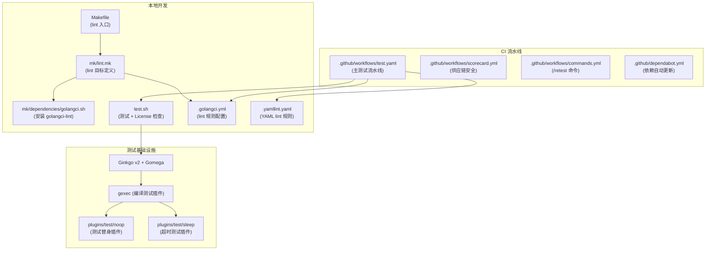
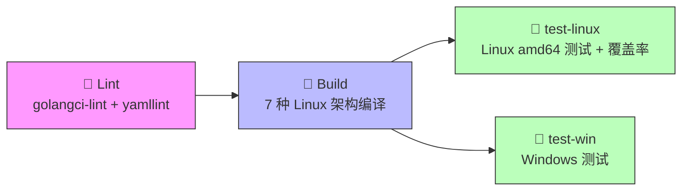

本文将带你全面了解 CNI 项目的工程化基础设施：如何构建代码、运行测试、本地 lint 检查，以及 GitHub Actions CI 流水线如何在每一次提交中自动保障代码质量。理解这些流程是从"阅读代码"迈向"参与贡献"的关键一步。

Sources: [Makefile](Makefile), [test.sh](test.sh), [.github/workflows/test.yaml](.github/workflows/test.yaml)

## 项目工程结构概览

CNI 项目采用 **Go Modules** 管理依赖，主模块声明为 `github.com/containernetworking/cni`，Go 版本要求为 1.21。项目没有复杂的构建系统，核心构建逻辑仅依赖 Go 工具链本身配合一个极简的 Makefile。测试框架则采用 Ginkgo v2 + Gomega 这对 Go 生态中广泛使用的 BDD 风格测试组合。

Sources: [go.mod](go.mod#L1-L9)

下面的 Mermaid 图展示了项目工程化的关键文件及其职责关系：



## 构建系统

CNI 的构建系统极其简洁。主 [Makefile](Makefile) 只有一行 `include mk/lint.mk`，即整个 Makefile 的唯一作用是提供 lint 目标。项目的核心构建完全依赖 Go 标准工具链。

### 编译主库与 cnitool

由于 CNI 本质上是一个 Go 库（library），没有独立的二进制产物需要构建。你可以直接使用 `go build ./...` 编译所有包来验证编译正确性：

```bash
# 编译所有包（包含 libcni、pkg/*、cnitool 等）
go build ./...

# 仅编译 cnitool 工具
go build -o cnitool ./cnitool
```

在 CI 中，构建步骤会遍历 **7 种 Linux 架构**（amd64、386、arm、arm64、s390x、mips64le、ppc64le）逐一执行 `GOARCH=$arch go build ./...`，确保跨平台编译通过。这是 CI 流水线 `build` 阶段的核心职责。

Sources: [.github/workflows/test.yaml](.github/workflows/test.yaml#L35-L53)

### cnitool 的构建特点

[cnitool](cnitool/main.go) 是项目中唯一的可执行程序，基于 [spf13/cobra](go.mod#L17) 构建 CLI，通过 `go build ./cnitool` 即可生成二进制文件。它直接引用 `libcni` 包，不需要额外的构建步骤。

Sources: [cnitool/main.go](cnitool/main.go#L15-L29), [cnitool/cmd/root.go](cnitool/cmd/root.go#L15-L38)

### debug 插件的模块隔离

值得注意的是，[plugins/debug](plugins/debug) 目录拥有**独立的 go.mod**，通过 `replace` 指令将主模块指向本地父目录。这种设计让 debug 插件可以独立发布和版本管理，同时开发时仍引用本地最新的 CNI 库代码。

Sources: [plugins/debug/go.mod](plugins/debug/go.mod#L1-L16)

## 测试体系

### 测试框架：Ginkgo + Gomega

整个项目使用 **Ginkgo v2** 作为测试框架、**Gomega** 作为断言库。每个包都有一个 `*_suite_test.go` 文件来注册 Ginkgo 测试套件，遵循统一的初始化模式：

```go
// 以 pkg/skel 为例
func TestSkel(t *testing.T) {
    RegisterFailHandler(Fail)
    RunSpecs(t, "Skel Suite")
}
```

这种 BDD（Behavior-Driven Development）风格让测试用例以 `Describe`、`Context`、`It` 语义化地组织，可读性远超传统 `t.Run()` 风格。

Sources: [pkg/skel/skel_suite_test.go](pkg/skel/skel_suite_test.go#L24-L27)

### 测试替身插件（Test Doubles）

CNI 测试架构中一个精妙的设计是使用了**测试替身插件**。由于 CNI 库的核心逻辑涉及调用外部插件二进制文件，测试时需要模拟真实的插件行为。项目在 [plugins/test](plugins/test) 下提供了两个专用测试插件：

| 插件 | 路径 | 用途 |
|------|------|------|
| **noop** | `plugins/test/noop` | 可编程的测试替身，通过 debug 文件控制返回结果、模拟错误等 |
| **sleep** | `plugins/test/sleep` | 休眠 60 秒，用于测试插件执行超时场景 |

noop 插件是测试体系的核心。它通过读取一个 JSON debug 文件来决定自身行为——可以返回预设的结果、报告特定错误、甚至以指定退出码退出。这种设计让测试可以精确控制插件行为，而不需要为每个测试场景编写新的 mock。

Sources: [plugins/test/noop/main.go](plugins/test/noop/main.go#L15-L36), [plugins/test/sleep/main.go](plugins/test/sleep/main.go#L25-L27)

### gexec 编译机制

测试中编译和调用测试插件的机制依赖 Gomega 的 **gexec** 包。在 `SynchronizedBeforeSuite` 钩子中，测试套件会自动编译 noop/sleep 插件为可执行文件，并在所有测试节点间共享路径：

```go
// libcni 测试套件中的编译逻辑
var _ = SynchronizedBeforeSuite(func() []byte {
    paths := map[string]string{}
    for name, packagePath := range pluginPackages {
        execPath, err := gexec.Build(packagePath)  // 编译插件
        Expect(err).NotTo(HaveOccurred())
        paths[name] = execPath
    }
    crossNodeData, _ := json.Marshal(paths)
    return crossNodeData
}, func(crossNodeData []byte) {
    json.Unmarshal(crossNodeData, &pluginPaths)
})
```

`SynchronizedAfterSuite` 则负责清理编译产物。这确保了测试的隔离性和可重复性。

Sources: [libcni/libcni_suite_test.go](libcni/libcni_suite_test.go#L42-L62), [pkg/invoke/invoke_suite_test.go](pkg/invoke/invoke_suite_test.go#L34-L45)

### 版本兼容性集成测试

项目还包含一类独特的**历史版本集成测试**。以 [get_version_integration_test.go](pkg/invoke/get_version_integration_test.go) 为代表，这类测试通过 `testhelpers.BuildAt()` 在特定的 git commit 上编译旧版本的插件，然后使用当前版本的 CNI 库调用它们，验证跨版本兼容性。这是保证 CNI 生态向后兼容的关键防线。

Sources: [pkg/invoke/get_version_integration_test.go](pkg/invoke/get_version_integration_test.go#L31-L86)

### 测试覆盖的包一览

项目中的测试文件分布在以下包中：

| 包 | 测试文件 | 测试重点 |
|----|---------|---------|
| `libcni` | api_test, conf_test, backwards_compatibility_test | 运行时 API、配置加载、版本兼容 |
| `pkg/skel` | skel_test | 插件骨架框架 |
| `pkg/invoke` | exec_test, find_test, raw_exec_test, delegate_test, args_test | 插件查找与执行 |
| `pkg/types` | types_test, args_test | 类型定义与参数解析 |
| `pkg/types/020` | types_test | 0.2.0 版本类型 |
| `pkg/types/040` | types_test | 0.4.0 版本类型 |
| `pkg/types/100` | types_test | 1.0.0 版本类型 |
| `pkg/version` | version_test, conf_test, reconcile_test, plugin_test | 版本协商 |
| `pkg/utils` | utils_test | 工具函数 |
| `plugins/test/noop` | noop_test | noop 插件自身 |

Sources: [libcni/api_test.go](libcni/api_test.go), [pkg/skel/skel_test.go](pkg/skel/skel_test.go)

## test.sh 测试脚本

[test.sh](test.sh) 是本地运行测试的统一入口，它执行两个阶段：

**阶段一：运行 Go 测试**

脚本自动通过 `go list ./...` 发现所有包，然后根据是否设置了 `COVERALLS` 环境变量选择不同模式：
- 普通模式：`go test ${PKGS}` — 直接运行所有测试
- 覆盖率模式：逐包执行 `go test -covermode set -coverprofile ${i}.coverprofile` — 生成每个包的覆盖率文件，用于 CI 上传到 Coveralls

**阶段二：License 头检查**

脚本遍历所有 `.go` 文件，检查首行是否包含 `Copyright` 或 `generated` 关键字。缺少 license 头的文件将导致检查失败。这意味着**每个新增的 Go 文件都必须包含 Apache 2.0 的版权声明**。

Sources: [test.sh](test.sh#L1-L35)

```bash
# 日常开发：运行所有测试
./test.sh

# CI 模式：生成覆盖率报告
COVERALLS=1 ./test.sh

# 运行单个包的测试
cd libcni && go test
```

## 代码质量检查（Lint）

### golangci-lint 配置

项目使用 [golangci-lint](https://golangci-lint.run/) v1.57.1 作为代码质量守门员，配置文件为 [.golangci.yml](.golangci.yml)。启用的 linter 包括：

| Linter | 作用 |
|--------|------|
| **contextcheck** | 检查 context 传递是否正确 |
| **errorlint** | 确保错误处理使用 `%w` 包装 |
| **ginkgolinter** | Ginkgo 测试最佳实践检查 |
| **gocritic** | 综合代码风格与性能建议 |
| **misspell** | 拼写检查 |
| **nolintlint** | 确保 `//nolint` 注释有正当理由 |
| **nonamedreturns** | 禁止命名返回值（提高可读性） |
| **predeclared** | 避免遮蔽 Go 预声明标识符 |
| **unconvert** | 消除不必要的类型转换 |
| **whitespace** | 多余空行检查 |

格式化方面启用了 **gci**（import 分组排序：标准库 → 第三方 → 项目内）和 **gofumpt**（比 gofmt 更严格的格式化），确保代码风格完全一致。

Sources: [.golangci.yml](.golangci.yml#L1-L43)

### 本地运行 lint

```bash
# 安装并运行 lint（通过 Makefile）
make lint

# 自动修复可修复的问题
make golangci/fix
```

[Makefile](Makefile) 引用 [mk/lint.mk](mk/lint.mk) 定义了 `lint`、`golangci/install`、`golangci/lint`、`golangci/fix` 四个目标。安装脚本 [mk/dependencies/golangci.sh](mk/dependencies/golangci.sh) 使用固定版本 `v1.57.1`。

Sources: [mk/lint.mk](mk/lint.mk#L1-L14), [mk/dependencies/golangci.sh](mk/dependencies/golangci.sh#L1-L7)

### YAML lint

项目还使用 **yamllint** 检查 YAML 文件，配置在 [.yamllint.yaml](.yamllint.yaml)。值得注意的是，`truthy` 规则排除了 `.github/workflows/` 目录下的文件，因为 GitHub Actions 工作流中 `on:` 语法会触发 yamllint 误报。

Sources: [.yamllint.yaml](.yamllint.yaml#L1-L11)

## CI 流水线详解

CI 基于 **GitHub Actions**，核心流水线定义在 [.github/workflows/test.yaml](.github/workflows/test.yaml)，在每次 push 和 pull_request 时触发。流水线环境使用 Go 1.22，分为四个顺序执行的 Job：



### Job 1：Lint

运行 golangci-lint 和 yamllint，在所有后续步骤之前拦截代码风格问题。这是最快速的检查，也是流水线的"第一道门"。

Sources: [.github/workflows/test.yaml](.github/workflows/test.yaml#L11-L33)

### Job 2：Build all linux architectures

在 Lint 通过后执行，遍历 `amd64 386 arm arm64 s390x mips64le ppc64le` 七种架构执行 `GOARCH=$arch go build ./...`，验证交叉编译正确性。这一步确保 CNI 库可以在从 x86 服务器到 ARM 嵌入式设备的各种环境中使用。

Sources: [.github/workflows/test.yaml](.github/workflows/test.yaml#L35-L53)

### Job 3：test-linux

在 Linux amd64 上执行完整的测试流程：
1. 安装 `goveralls` 和 `gover` 工具
2. 以 `COVERALLS=1` 模式运行 `./test.sh`，生成逐包覆盖率文件
3. 使用 `gover` 合并覆盖率文件，通过 `goveralls` 上传到 Coveralls 服务

Sources: [.github/workflows/test.yaml](.github/workflows/test.yaml#L55-L81)

### Job 4：test-win

在 Windows 上构建并运行测试，确保跨平台兼容性。由于 Windows 不支持 Linux 网络命名空间，部分测试（如 namespace 相关）在 Darwin/Windows 上通过条件编译提供空实现。

Sources: [.github/workflows/test.yaml](.github/workflows/test.yaml#L83-L97), [pkg/ns/ns_windows.go](pkg/ns/ns_windows.go), [pkg/ns/ns_darwin.go](pkg/ns/ns_darwin.go)

### 安全扫描：Scorecard

[scorecard.yml](.github/workflows/scorecard.yml) 配置了 OpenSSF Scorecard 供应链安全扫描，每周日定时运行，并在 push 到 main 分支时触发。它会检查分支保护、依赖管理、代码审查等安全最佳实践，结果上传到 GitHub Code Scanning。

Sources: [.github/workflows/scorecard.yml](.github/workflows/scorecard.yml#L1-L41)

### `/retest` 命令

[commands.yml](.github/workflows/commands.yml) 实现了一个便捷的交互功能：当维护者在 PR 评论中输入 `/retest` 时，会触发重新运行最近的 CI workflow。这个自定义 Action 通过 Docker 容器（基于 Alpine，包含 curl 和 jq）调用 GitHub API 完成重试操作。

Sources: [.github/workflows/commands.yml](.github/workflows/commands.yml#L1-L18), [.github/actions/retest-action/entrypoint.sh](.github/actions/retest-action/entrypoint.sh#L1-L45)

## 依赖管理

项目使用 **Dependabot** 自动管理依赖更新，配置在 [.github/dependabot.yml](.github/dependabot.yml)。它每周检查以下四个生态系统的更新：

| 生态系统 | 目录 | 说明 |
|---------|------|------|
| GitHub Actions | `/` | CI 工作流中的 Action 版本 |
| Go Modules | `/` | 主模块依赖 |
| Go Modules | `/plugins/debug` | debug 插件依赖 |
| Docker | `.github/actions/retest-action` | retest Action 的基础镜像 |

Go Modules 的更新被归入 `golang` 分组，所有 Go 依赖的更新会合并为一个 PR，减少噪音。

Sources: [.github/dependabot.yml](.github/dependabot.yml#L1-L28)

## 常用开发命令速查

| 操作 | 命令 | 说明 |
|------|------|------|
| 编译所有包 | `go build ./...` | 验证编译通过 |
| 编译 cnitool | `go build -o cnitool ./cnitool` | 生成 CLI 工具 |
| 运行所有测试 | `./test.sh` | 含 License 检查 |
| 运行单个包测试 | `cd libcni && go test` | 快速迭代 |
| 运行 lint | `make lint` | 代码质量检查 |
| 自动修复 lint | `make golangci/fix` | 修复可自动修复的问题 |
| 更新依赖 | `go mod tidy` | 清理 go.mod/go.sum |

Sources: [Makefile](Makefile), [test.sh](test.sh), [go.mod](go.mod)

## 下一步阅读

理解了构建、测试和 CI 流程后，你可以继续了解如何正式参与代码贡献：

- **[为 CNI 项目贡献代码的流程与规范](22-wei-cni-xiang-mu-gong-xian-dai-ma-de-liu-cheng-yu-gui-fan)** — 详细的贡献流程、提交信息格式与 PR 规范
- **[从零开发一个 CNI 插件](18-cong-ling-kai-fa-ge-cni-cha-jian)** — 利用本文介绍的 skel 包和测试体系亲手构建一个插件
- **[Debug 插件源码解析与测试技巧](19-debug-cha-jian-yuan-ma-jie-xi-yu-ce-shi-ji-qiao)** — 深入了解本文提到的测试替身插件机制