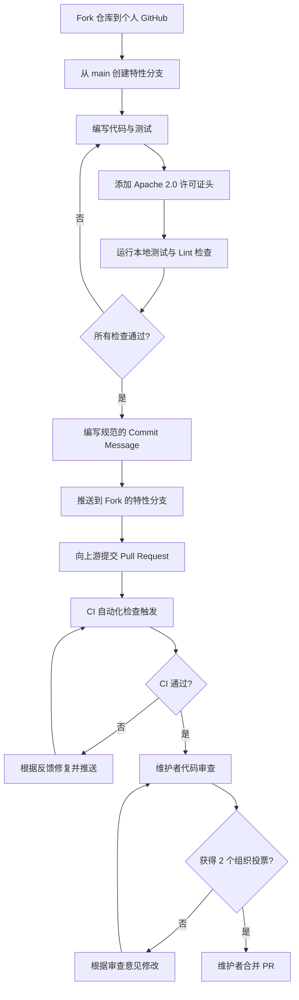
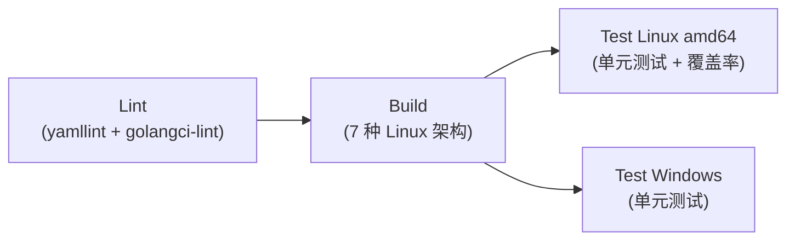

CNI 项目采用 Apache 2.0 许可证，通过 GitHub Pull Request 接受社区贡献。本文将系统性地梳理从环境准备、代码编写、质量检查到 PR 提审的完整贡献链路，帮助开发者高效地将改动合入上游仓库。CNI 项目对代码质量、提交规范和协作流程均有明确的约定，理解并遵循这些规范不仅能显著提升 PR 被接受的概率，也能让维护者更快地理解和审核你的变更。

Sources: [CONTRIBUTING.md](CONTRIBUTING.md#L1-L8), [LICENSE](LICENSE)

## 贡献流程全景

下面的流程图展示了一个典型贡献从构思到合并的完整生命周期，覆盖了 Fork 仓库、开发分支、本地验证、提交 PR、CI 检查、代码审查到最终合并的全过程：



Sources: [CONTRIBUTING.md](CONTRIBUTING.md#L33-L47)

## 法律前提：开发者来源证书（DCO）

在向 CNI 项目提交任何贡献之前，你必须同意 **开发者来源证书（Developer Certificate of Origin, DCO）**。DCO 由 Linux 内核社区创建，是一份简洁的法律声明，确认你作为贡献者拥有提交该代码的合法权利。DCO 要求贡献者确认以下四项条件之一：(a) 该贡献由你全部或部分创建，且你有权以项目所示的开源许可证提交；(b) 该贡献基于之前的工作，据你所知该工作在适当的开源许可证覆盖下；(c) 该贡献由其他已认证 (a)、 或 的人直接提供给你且你未做修改；(d) 你理解并同意该贡献是公开的，包括你的签名在内的所有个人信息将被无限期保留。

实际操作中，DCO 通过 Git 提交中的 `Signed-off-by:` 行来满足。使用 `git commit -s` 命令可以自动在提交消息末尾添加此行。这是 CNI 项目对每一个 PR 的硬性要求。

Sources: [DCO](DCO#L1-L37), [CONTRIBUTING.md](CONTRIBUTING.md#L10-L15)

## 沟通渠道与社区参与

CNI 项目提供了多种沟通方式，贡献者在提交 PR 之前可以先通过社区讨论方案可行性、获取设计反馈：

| 渠道 | 地址 | 适用场景 |
|------|------|----------|
| 邮件列表 | [cni-dev](https://groups.google.com/forum/#!forum/cni-dev) | 设计提案、重大变更讨论 |
| CNCF Slack | #cni 频道 ([slack.cncf.io](https://slack.cncf.io/)) | 日常交流、快速问答 |
| 双周会议 | [Google Calendar](https://calendar.google.com/calendar/event?action=TEMPLATE&tmeid=Yzg1NDlibnA5Y2c0Nm5scDI4ZG5udWpmY2JfMjAyNTEwMTNUMTQwMDAwWiAyMmM0NjU1ZjFjMjkzZTg0NDRhNTU2OTVmNDIxODg3MDgwYzc1OWU0YTQ1MjVhYmQ2NTFmYmI2MGVlYTc2YzE5QGc) | 维护者会议、版本规划 |
| GitHub Issues | [containernetworking/cni/issues](https://github.com/containernetworking/cni/issues) | Bug 报告、功能请求 |

**重要提示**：请避免直接邮件联系 [MAINTAINERS](MAINTAINERS) 文件中列出的维护者——他们通过邮件列表和 Slack 处理社区问题，直接联系不会获得更快的响应。

Sources: [CONTRIBUTING.md](CONTRIBUTING.md#L18-L25), [README.md](README.md#L27-L32), [MAINTAINERS](MAINTAINERS#L1-L14)

## 开发工作流详解

### 第一步：Fork 与分支管理

贡献的第一步是在 GitHub 上 Fork `containernetworking/cni` 仓库到你的个人账户。然后从 `main` 分支创建一个描述性的特性分支（topic branch）。分支命名应简洁明了地反映变更内容，例如 `fix/ipam-result-parse-error` 或 `feat/add-gc-timeout-support`。

```bash
# 克隆你 Fork 的仓库
git clone https://github.com/<your-username>/cni.git
cd cni

# 从 main 创建特性分支
git checkout -b fix/ipam-result-parse-error main
```

Sources: [CONTRIBUTING.md](CONTRIBUTING.md#L37-L39)

### 第二步：编码与测试

所有代码变更必须伴随相应的测试覆盖。CNI 项目使用 **Ginkgo**（BDD 测试框架）和 **Gomega**（断言库）作为测试工具链。项目的每个包都有独立的 test suite 文件（如 `*_suite_test.go`），其中通过 `RegisterFailHandler(Fail)` 和 `RunSpecs(t, "Suite Name")` 初始化测试环境。

一个典型的 test suite 文件结构如下：

```go
// Copyright 2016 CNI authors
//
// Licensed under the Apache License, Version 2.0 (the "License");
// ...
package types_test

import (
    "testing"
    . "github.com/onsi/ginkgo/v2"
    . "github.com/onsi/gomega"
)

func TestTypes(t *testing.T) {
    RegisterFailHandler(Fail)
    RunSpecs(t, "Types Suite")
}
```

如果你新增了一个此前没有任何测试的包，还需要将其添加到 `test.sh` 脚本的 `TESTABLE` 包列表中（如果该变量存在），确保 CI 流水线会执行该包的测试。

Sources: [CONTRIBUTING.md](CONTRIBUTING.md#L41-L46), [pkg/types/types_suite_test.go](pkg/types/types_suite_test.go#L15-L27), [test.sh](test.sh#L1-L35)

### 第三步：许可证头检查

CNI 项目强制要求所有 Go 源文件的第一行包含 Apache 2.0 许可证头。`test.sh` 脚本内嵌了自动检查逻辑：遍历所有 `.go` 文件，检查首行是否包含 `Copyright` 或 `generated` 关键字。缺少许可证头的文件将导致测试脚本以退出码 255 失败。

以下是许可证头的标准格式：

```go
// Copyright 2016 CNI authors
//
// Licensed under the Apache License, Version 2.0 (the "License");
// you may not use this file except in compliance with the License.
// You may obtain a copy of the License at
//
//     http://www.apache.org/licenses/LICENSE-2.0
//
// Unless required by applicable law or agreed to in writing, software
// distributed under the License is distributed on an "AS IS" BASIS,
// WITHOUT WARRANTIES OR CONDITIONS OF ANY KIND, either express or implied.
// See the License for the specific language governing permissions and
// limitations under the License.
```

Sources: [test.sh](test.sh#L23-L32), [libcni/api.go](libcni/api.go#L1-L14)

### 第四步：本地质量验证

提交前，务必在本地完成完整的质量验证。CNI 项目配置了以下多层检查机制：

| 检查类型 | 运行命令 | 配置文件 | 说明 |
|----------|----------|----------|------|
| 单元测试 + 许可证检查 | `./test.sh` | [test.sh](test.sh) | 运行所有包测试并验证许可证头 |
| 单包测试 | `cd libcni && go test` | — | 专注于特定包的测试 |
| Go Lint | `make lint` | [.golangci.yml](.golangci.yml), [mk/lint.mk](mk/lint.mk) | 运行 golangci-lint v1.57.1 |
| YAML Lint | 自动（CI 中） | [.yamllint.yaml](.yamllint.yaml) | 检查 YAML 文件格式 |

**golangci-lint 启用的检查器**包括 `contextcheck`、`errorlint`、`ginkgolinter`、`gocritic`、`misspell`、`nolintlint`、`nonamedreturns`、`predeclared`、`unconvert` 和 `whitespace`。格式化工具启用了 `gci`（import 分组排序，按 `standard → default → github.com/containernetworking` 分段）和 `gofumpt`（严格格式化）。

Sources: [.golangci.yml](.golangci.yml#L1-L43), [mk/lint.mk](mk/lint.mk#L1-L14), [mk/dependencies/golangci.sh](mk/dependencies/golangci.sh#L1-L7), [.yamllint.yaml](.yamllint.yaml#L1-L11)

## Commit Message 规范

CNI 项目对提交消息有明确的格式要求，核心原则是回答两个问题：**改了什么**（what）和 **为什么改**（why）。格式规范如下：

```
<子系统>: <改了什么>

<为什么需要这个变更>

<页脚（如关联 Issue）>
```

具体规则：首行（subject）不超过 **70 个字符**，描述变更涉及的子系统和具体内容；第二行必须为空行；正文说明变更动机，每行不超过 **80 个字符**；页脚可关联 GitHub Issue。

一个规范的示例如下：

```
scripts: add the test-cluster command

this uses tmux to setup a test cluster that you can easily kill and
start for debugging.

Fixes #38
```

同时别忘了使用 `git commit -s` 添加 `Signed-off-by:` 行以满足 DCO 要求。

Sources: [CONTRIBUTING.md](CONTRIBUTING.md#L85-L113)

## CI 流水线详解

当你提交 PR 后，GitHub Actions 会自动触发完整的 CI 流水线。该流水线设计为 **四级串行** 结构，每一级依赖前一级通过：



| 阶段 | 任务 | 环境 | 关键操作 |
|------|------|------|----------|
| **Lint** | YAML + Go 静态分析 | ubuntu-latest | yamllint 检查所有 YAML 文件；golangci-lint 以 `--verbose` 模式运行 |
| **Build** | 多架构编译 | ubuntu-latest | Go 1.22 编译 `amd64`、`386`、`arm`、`arm64`、`s390x`、`mips64le`、`ppc64le` 共 7 种架构 |
| **Test Linux** | Linux 单元测试 + 覆盖率 | ubuntu-latest | 以 `COVERALLS=1` 运行 `test.sh`，覆盖率报告上传至 Coveralls |
| **Test Windows** | Windows 单元测试 | windows-latest | 运行 `bash ./test.sh` |

此外，项目还配置了以下辅助工作流：

- **commands.yml**：支持在 PR 评论中触发重新测试（retest），仅在 `containernetworking/cni` 主仓库生效
- **scorecard.yml**：OpenSSF 供应链安全评分，每周日定期运行，同时监控 `main` 分支的推送和分支保护规则变更
- **dependabot**：每周自动检查 GitHub Actions、Go modules（根目录及 `plugins/debug`）、Docker 依赖的更新

Sources: [.github/workflows/test.yaml](.github/workflows/test.yaml#L1-L97), [.github/workflows/commands.yml](.github/workflows/commands.yml#L1-L18), [.github/workflows/scorecard.yml](.github/workflows/scorecard.yml#L1-L41), [.github/dependabot.yml](.github/dependabot.yml#L1-L28)

## PR 审查与合并策略

### 审查接受标准

以下因素将显著提高 PR 被接受的概率：

- **清晰的需求描述**——说明变更解决什么问题
- **新代码有测试覆盖**——使用 Ginkgo/Gomega 风格
- **旧代码也欢迎新增测试**——提升项目整体覆盖率
- **遵循现有代码风格和约定**——保持一致性
- **规范的 Commit Message**——方便历史追溯

Sources: [CONTRIBUTING.md](CONTRIBUTING.md#L71-L83)

### 投票与合并规则

CNI 项目采用 **组织投票（Organization Voting）** 机制来防止单一公司主导项目。核心规则如下：

| 变更类型 | 投票要求 | 说明 |
|----------|----------|------|
| 非 Spec 的代码变更 | ≥ 2 个组织投票 | 来自不同公司的两位维护者认可即可合并 |
| Spec 变更 | ≥ 2 个组织投票（默认） | 任何维护者可要求提升至 2/3 多数投票 |
| 新增/移除维护者 | 2/3 多数组织投票 | 确保社区共识 |
| 治理规则变更 | 2/3 多数组织投票 | 涉及项目根本运作方式 |

每个公司或组织（无论有多少位维护者隶属于该公司）获得 **一个组织投票权**；无组织关联的个人也获得一票。这意味着如果来自公司 X 的两位维护者、公司 Y 的两位、公司 Z 的两位以及一位独立个人共七位维护者，总共只有 **四个组织投票权**。

Sources: [GOVERNANCE.md](GOVERNANCE.md#L1-L45), [CONTRIBUTING.md](CONTRIBUTING.md#L81-L83)

## 代码风格与工具链一览

CNI 项目的工具链配置体现了对代码一致性的严格要求。以下是关键配置的汇总：

| 工具 | 版本/配置 | 作用 |
|------|-----------|------|
| **Go** | 1.22（CI）/ 最低 1.21（go.mod） | 编译与测试 |
| **golangci-lint** | v1.57.1 | 10 个检查器 + 2 个格式化器 |
| **ginkgo/gomega** | v2.20.1 / v1.34.1 | BDD 风格测试框架 |
| **yamllint** | 自定义配置 | YAML 文件格式检查 |
| **Dependabot** | weekly | 依赖自动更新 |

Sources: [go.mod](go.mod#L1-L26), [.golangci.yml](.golangci.yml#L1-L43), [.github/workflows/test.yaml](.github/workflows/test.yaml#L7-L8)

## 常见问题与避坑指南

**Q: 我开发了一个新的 CNI 插件，应该提交到这个仓库吗？**

通常不建议。CNI 架构的优势之一是插件可以完全独立于本仓库构建、分发和使用。如果你想分享插件，更合适的做法是将其托管在自己的仓库中，然后请求在本仓库 README 的[第三方插件列表](README.md#L51-L77)中添加链接。只有在非常充分的理由下（如维护者同意接管），才考虑将插件合入本仓库。

**Q: CI 检查失败了，我可以在 PR 中触发重新测试吗？**

可以。项目配置了 retest-action，在 PR 评论中发出相应指令即可重新触发测试工作流。但请注意，如果测试失败是由于代码本身的问题，重新测试不会修复根因。

**Q: 我应该提交单独的 PR 还是拆分为多个？**

对于逻辑独立的变更，建议拆分为多个独立的 PR，每个 PR 聚焦于一个完整的逻辑单元。这样做有助于加速审查——维护者可以分别审核和合并。对于相互依赖的大型变更，可以在一个 PR 中完成，但需在描述中清楚说明各 commit 之间的关系。

Sources: [CONTRIBUTING.md](CONTRIBUTING.md#L115-L128), [CONTRIBUTING.md](CONTRIBUTING.md#L37-L39)

## 相关阅读

- 了解项目的完整构建与 CI 配置，参见 [项目构建、测试与 CI 流程](21-xiang-mu-gou-jian-ce-shi-yu-ci-liu-cheng)
- 深入理解 CNI 规范的扩展约定，参见 [扩展约定：Capabilities、args 与 CNI_ARGS 的最佳实践](9-kuo-zhan-yue-ding-capabilities-args-yu-cni_args-de-zui-jia-shi-jian)
- 从零开始开发一个符合规范的 CNI 插件，参见 [从零开发一个 CNI 插件](18-cong-ling-kai-fa-ge-cni-cha-jian)