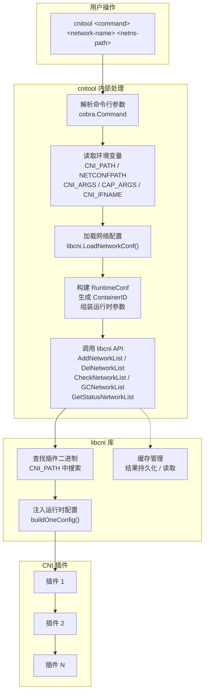
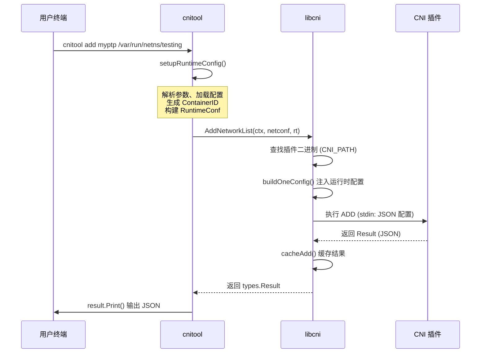

在阅读完 [快速上手：环境搭建与运行第一个 CNI 配置](2-kuai-su-shang-shou-huan-jing-da-jian-yu-yun-xing-di-ge-cni-pei-zhi) 之后，你已经知道了 CNI 的基本概念和项目结构。本页将聚焦于 **cnitool** —— 一个轻量级的命令行工具，它让你无需容器运行时（如 containerd、CRI-O）即可直接与 CNI 插件交互，完成网络的添加、检查、删除、垃圾回收和状态查询。对于初学者而言，cnitool 是理解 CNI 工作原理、调试插件行为的最佳入口。

## cnitool 是什么

cnitool 是 CNI 项目自带的命令行工具，它封装了 [libcni 库](libcni/api.go) 的核心 API，将容器运行时通常需要处理的网络配置加载、插件查找、参数组装等复杂逻辑，简化为一条条直观的终端命令。你可以把它理解为 CNI 世界的"瑞士军刀"——当容器运行时不在场时，cnitool 直接扮演运行时的角色，按 CNI 规范调用插件。

从架构上看，cnitool 是一个基于 **Cobra** 框架构建的 CLI 应用，入口位于 [main.go](cnitool/main.go#L24-L29)，它通过调用 `cmd.Execute()` 启动命令树。整个工具的命令结构如下：

```
cnitool
├── add        # 将网络接口添加到网络命名空间
├── del        # 从网络命名空间删除网络接口
├── check      # 检查网络接口状态（需要 CNI spec v0.4.0+）
├── gc         # 垃圾回收未使用的网络接口（需要 CNI spec v1.1.0+）
└── status     # 获取网络接口状态（需要 CNI spec v1.1.0+）
```

下面的流程图展示了 cnitool 的整体工作流程——从用户输入到最终调用 CNI 插件的完整链路：



Sources: [main.go](cnitool/main.go#L24-L29), [root.go](cnitool/cmd/root.go#L47-L52)

## 安装 cnitool

安装 cnitool 只需要一个已配置好的 Go 环境。由于 cnitool 是 CNI 仓库的一部分，你可以直接通过 `go install` 编译并安装：

```bash
# 方式一：直接从 GitHub 安装
go install github.com/containernetworking/cni/cnitool@latest

# 方式二：克隆仓库后本地安装
git clone https://github.com/containernetworking/cni.git
cd cni
go install ./cnitool
```

安装完成后，确认 `$GOPATH/bin`（或 `$HOME/go/bin`）在你的 `PATH` 中，然后运行：

```bash
cnitool --help
```

如果看到帮助信息输出，说明安装成功。

Sources: [cnitool README](cnitool/README.md#L51-L56)

## 环境变量详解

cnitool 的行为由五个环境变量控制。理解它们是正确使用 cnitool 的前提，因为这些变量决定了 cnitool 在哪里找配置、去哪里找插件，以及如何向插件传递额外参数。

| 环境变量 | 是否必填 | 默认值 | 说明 |
|---|---|---|---|
| `NETCONFPATH` | 否 | `/etc/cni/net.d` | 网络配置文件的搜索目录。cnitool 依次查找 `*.conflist`（插件链配置）和 `*.conf`/`*.json`（单插件配置） |
| `CNI_PATH` | **是** | 无 | CNI 插件二进制文件的搜索路径（多个路径用 `:` 分隔） |
| `CNI_ARGS` | 否 | 空 | 传递给插件的额外键值对参数，格式为 `KEY1=VALUE1;KEY2=VALUE2` |
| `CAP_ARGS` | 否 | 空 | 传递给插件的能力参数，JSON 格式（如 `{"portMappings": true}`） |
| `CNI_IFNAME` | 否 | `eth0` | 容器内的网络接口名称。也可通过 `-i` / `--ifname` 命令行标志指定，命令行优先级高于环境变量 |

关于配置文件搜索逻辑，`NETCONFPATH` 目录下的文件按以下优先级处理：

1. **优先查找 `*.conflist` 文件**：这些文件包含插件链配置（`plugins` 数组），适合多插件串联场景
2. **降级查找 `*.conf` / `*.json` 文件**：如果没有找到 `.conflist` 文件，则搜索单插件配置文件，并自动将其升级为 `NetworkConfigList` 格式

这一查找逻辑由 [libcni.LoadNetworkConf()](libcni/conf.go#L356-L389) 实现——先遍历所有 `.conflist` 文件按名称匹配，找不到时再回退到单配置文件加载。

Sources: [root.go 环境变量常量](cnitool/cmd/root.go#L31-L38), [cnitool README](cnitool/README.md#L7-L23), [LoadNetworkConf](libcni/conf.go#L356-L389)

## 命令详解

### 通用调用格式

所有 cnitool 命令都遵循统一格式：

```bash
cnitool <command> <network-name> <netns-path> [flags]
```

- **`<command>`**：要执行的操作（add / del / check / gc / status）
- **`<network-name>`**：网络名称，必须与配置文件中的 `name` 字段匹配
- **`<netns-path>`**：网络命名空间的路径（如 `/var/run/netns/testing`），cnitool 会自动将其转为绝对路径
- **`-i, --ifname`**：全局标志，指定容器内接口名（默认 `eth0`）

所有命令的参数解析和运行时配置组装都由 [setupRuntimeConfig()](cnitool/cmd/root.go#L83-L150) 函数统一处理。该函数执行以下关键步骤：从环境变量和命令行参数收集配置 → 加载网络配置 → 解析 `CAP_ARGS` 和 `CNI_ARGS` → 生成基于 SHA-512 哈希的 `ContainerID` → 构造 `RuntimeConf` 结构体。

Sources: [root.go setupRuntimeConfig](cnitool/cmd/root.go#L83-L150)

### add — 添加网络

```bash
cnitool add <network-name> <netns-path>
```

`add` 命令将指定的网络配置应用到目标网络命名空间。它调用 `libcni.AddNetworkList()`，按配置中定义的插件顺序依次执行每个插件的 `ADD` 操作，并将最后一个插件的结果打印到标准输出。整个过程链式执行：前一个插件的输出会作为 `prevResult` 注入到下一个插件的配置中。

执行成功后，标准输出会显示类似如下 JSON 结果：

```json
{
  "cniVersion": "1.0.0",
  "interfaces": [
    {
      "name": "eth0",
      "sandbox": "/var/run/netns/testing"
    }
  ],
  "ips": [
    {
      "version": "4",
      "address": "172.16.29.2/24",
      "interface": 0
    }
  ],
  "routes": [
    {
      "dst": "0.0.0.0/0"
    }
  ]
}
```

Sources: [add.go](cnitool/cmd/add.go#L24-L51)

### del — 删除网络

```bash
cnitool del <network-name> <netns-path>
```

`del` 命令执行网络清理，它以 **逆序** 遍历插件链（先执行最后一个插件，再执行第一个），逐一调用每个插件的 `DEL` 操作。逆序是 CNI 规范的关键设计——这确保了资源的正确释放顺序，避免依赖冲突。

对于 CNI spec v0.4.0+ 的配置，`del` 还会从缓存中读取之前的 `prevResult` 传递给插件，帮助插件识别需要清理的具体资源。

Sources: [del.go](cnitool/cmd/del.go#L24-L39), [DelNetworkList 逆序逻辑](libcni/api.go#L590-L613)

### check — 检查网络

```bash
cnitool check <network-name> <netns-path>
```

`check` 命令用于验证网络接口是否处于预期状态。它会从缓存中读取 `ADD` 操作的结果，然后将该 `prevResult` 传递给每个插件的 `CHECK` 操作，让插件自行比对当前状态与预期状态。

**注意**：`check` 命令仅支持 **CNI spec v0.4.0 及以上** 的配置。如果配置版本低于 0.4.0，将返回 `"does not support the CHECK command"` 错误。此外，如果网络配置中设置了 `disableCheck: true`，`check` 命令会直接跳过并返回成功。

Sources: [check.go](cnitool/cmd/check.go#L24-L39), [CheckNetworkList 版本校验](libcni/api.go#L548-L572)

### gc — 垃圾回收

```bash
cnitool gc <network-name> <netns-path>
```

`gc`（Garbage Collect）命令负责清理残留的网络资源。它执行两个层次的清理：

1. **缓存级清理**：遍历所有缓存的 attachment（网络附着记录），对不在有效列表中的残留 attachment 执行 `DEL` 操作
2. **插件级清理**：如果配置版本 ≥ v1.1.0，还会向每个插件发送 `GC` 命令，让插件自行清理其内部的孤立资源

**注意**：当前 cnitool 的 gc 实现调用 `GCNetworkList()` 时传入 `nil` 作为 `GCArgs`，这意味着没有声明任何有效 attachment，所有缓存中的网络附着都将被视为残留并被清理。如果网络配置设置了 `disableGC: true`，则 gc 命令会直接跳过。

Sources: [gc.go](cnitool/cmd/gc.go#L24-L39), [GCNetworkList 实现](libcni/api.go#L770-L842)

### status — 获取状态

```bash
cnitool status <network-name> <netns-path>
```

`status` 命令向配置中的每个插件发送 `STATUS` 操作，查询插件的运行状态。与 `gc` 类似，该命令仅支持 **CNI spec v1.1.0 及以上** 的配置。对于低版本配置，命令会静默返回（不报错）。

Sources: [status.go](cnitool/cmd/status.go#L24-L39), [GetStatusNetworkList 实现](libcni/api.go#L855-L877)

### 命令速查对照表

| 命令 | 最低 CNI 版本 | libcni API | 功能概述 | 是否输出结果 |
|---|---|---|---|---|
| `add` | 0.1.0 | `AddNetworkList()` | 按序执行插件链，创建网络接口 | ✅ 输出 JSON |
| `del` | 0.1.0 | `DelNetworkList()` | 逆序执行插件链，删除网络接口 | ❌ |
| `check` | 0.4.0 | `CheckNetworkList()` | 验证网络接口是否符合预期 | ❌ |
| `gc` | 1.1.0（插件级 GC） | `GCNetworkList()` | 清理残留网络附着和孤立资源 | ❌ |
| `status` | 1.1.0 | `GetStatusNetworkList()` | 查询插件运行状态 | ❌ |

Sources: [add.go](cnitool/cmd/add.go#L24-L51), [del.go](cnitool/cmd/del.go#L24-L39), [check.go](cnitool/cmd/check.go#L24-L39), [gc.go](cnitool/cmd/gc.go#L24-L39), [status.go](cnitool/cmd/status.go#L24-L39)

## 完整实战演练

下面通过一个端到端的实操示例，演示如何用 cnitool 管理一个完整的容器网络生命周期。整个流程用 Mermaid 图表示如下：


### 步骤 ①：安装 CNI 插件

cnitool 本身不包含网络插件，你需要单独安装。最常见的方式是从官方 plugins 仓库编译：

```bash
git clone https://github.com/containernetworking/plugins.git
cd plugins
./build_linux.sh
```

编译完成后，插件二进制文件位于 `./bin/` 目录下（如 `ptp`、`bridge`、`host-local` 等）。这个路径稍后将赋值给 `CNI_PATH` 环境变量。

Sources: [cnitool README](cnitool/README.md#L58-L65)

### 步骤 ②：创建网络配置

在 `/etc/cni/net.d/` 目录下创建一个网络配置文件。以下配置定义了一个名为 `myptp` 的点对点网络，使用 `host-local` IPAM 插件从 `172.16.29.0/24` 子网分配 IP：

```bash
sudo mkdir -p /etc/cni/net.d
echo '{
  "cniVersion": "1.0.0",
  "name": "myptp",
  "type": "ptp",
  "ipMasq": true,
  "ipam": {
    "type": "host-local",
    "subnet": "172.16.29.0/24",
    "routes": [{"dst": "0.0.0.0/0"}]
  }
}' | sudo tee /etc/cni/net.d/10-myptp.conf
```

配置中的关键字段含义：

| 字段 | 值 | 作用 |
|---|---|---|
| `cniVersion` | `"1.0.0"` | CNI 规范版本，决定支持哪些操作 |
| `name` | `"myptp"` | 网络名称，cnitool 命令的第一个参数需与之匹配 |
| `type` | `"ptp"` | 插件类型，cnitool 在 `CNI_PATH` 中查找名为 `ptp` 的二进制文件 |
| `ipam.type` | `"host-local"` | IP 地址管理插件类型 |

Sources: [cnitool README](cnitool/README.md#L68-L72)

### 步骤 ③：创建网络命名空间

```bash
sudo ip netns add testing
```

这会在 `/var/run/netns/testing` 创建一个新的网络命名空间。cnitool 将在这个命名空间中创建和配置网络接口。

### 步骤 ④：添加网络

```bash
sudo CNI_PATH=./bin cnitool add myptp /var/run/netns/testing
```

这条命令执行后，cnitool 会：加载 `myptp` 配置 → 在 `CNI_PATH` 中找到 `ptp` 和 `host-local` 插件 → 执行 `ADD` 操作 → 打印分配结果。你应该能看到类似前文示例的 JSON 输出，其中包含分配到的 IP 地址和路由信息。

Sources: [cnitool README](cnitool/README.md#L80-L84)

### 步骤 ⑤：检查网络状态

```bash
sudo CNI_PATH=./bin cnitool check myptp /var/run/netns/testing
```

如果一切正常，该命令无输出且返回码为 0。如果网络接口状态异常，插件会返回错误信息。

### 步骤 ⑥：验证连通性

虽然这不是 cnitool 的操作，但你可以用系统命令确认网络确实已正确配置：

```bash
# 查看命名空间内的网络接口和 IP 地址
sudo ip -n testing addr

# 测试网络连通性
sudo ip netns exec testing ping -c 1 4.2.2.2
```

Sources: [cnitool README](cnitool/README.md#L94-L97)

### 步骤 ⑦：删除网络

```bash
sudo CNI_PATH=./bin cnitool del myptp /var/run/netns/testing
```

删除操作会释放之前分配的 IP 地址并清理网络接口。之后，命名空间内的网络配置将被还原到初始状态。

### 步骤 ⑧：清理命名空间

```bash
sudo ip netns del testing
```

Sources: [cnitool README](cnitool/README.md#L100-L104)

## 内部工作机制

理解 cnitool 的内部处理流程，有助于你在遇到问题时快速定位原因。所有命令共享同一个初始化逻辑 [setupRuntimeConfig()](cnitool/cmd/root.go#L83-L150)，其核心处理步骤如下：

**第一步：参数收集**。从命令行获取 `network-name` 和 `netns-path`，从环境变量获取 `NETCONFPATH`（默认 `/etc/cni/net.d`）、`CNI_PATH`、`CNI_ARGS`、`CAP_ARGS` 和 `CNI_IFNAME`。接口名称的优先级为：`--ifname` 命令行标志 > `CNI_IFNAME` 环境变量 > 默认值 `eth0`。

**第二步：配置加载**。调用 `libcni.LoadNetworkConf(netdir, netName)` 在配置目录中搜索匹配的网络配置。该函数先查找 `.conflist` 文件，找不到时回退到 `.conf` / `.json` 文件并自动升级格式。

**第三步：ContainerID 生成**。cnitool 通过 SHA-512 哈希网络命名空间路径来生成一个确定性的 `ContainerID`（格式 `cnitool-<hex>`）。这保证了相同的命名空间路径始终映射到相同的 ContainerID，使缓存机制能正确工作。

**第四步：RuntimeConf 构建**。将所有收集到的参数组装为 `libcni.RuntimeConf` 结构体，包含 `ContainerID`、`NetNS`、`IfName`、`Args` 和 `CapabilityArgs`。

**第五步：插件调用**。通过 `getCNIConfig()` 创建 `libcni.CNIConfig` 实例（使用 `CNI_PATH` 作为插件搜索路径），然后调用对应的 libcni API。



Sources: [setupRuntimeConfig](cnitool/cmd/root.go#L83-L150), [getCNIConfig](cnitool/cmd/root.go#L153-L155), [AddNetworkList](libcni/api.go#L514-L530)

## 常见问题与排错

| 问题现象 | 可能原因 | 解决方案 |
|---|---|---|
| `no net configuration with name "xxx"` | 配置文件中的 `name` 字段与命令参数不匹配 | 检查 `/etc/cni/net.d/` 下配置文件的 `name` 字段 |
| `failed to find plugin "ptp"` | `CNI_PATH` 未设置或路径错误 | 确认 `CNI_PATH` 指向包含插件二进制的目录 |
| `does not support the CHECK command` | 配置的 `cniVersion` 低于 0.4.0 | 将配置中的 `cniVersion` 升级到 `"0.4.0"` 或更高 |
| `permission denied` | 网络命名空间操作需要 root 权限 | 使用 `sudo` 运行 cnitool |
| add 成功但 ping 不通 | 插件配置有误或物理网络限制 | 用 `ip -n <ns> addr` 检查 IP 是否分配；检查路由配置 |
| `invalid CNI_ARGS pair` | `CNI_ARGS` 格式错误 | 确保格式为 `KEY=VALUE;KEY=VALUE`，不含空格和多余分号 |

Sources: [parseArgs 校验逻辑](cnitool/cmd/root.go#L66-L80), [NotFoundError](libcni/conf.go#L31-L38), [ErrorCheckNotSupp](libcni/api.go#L43)

## 下一步

掌握了 cnitool 的使用后，你已经具备了直接操作 CNI 网络的能力。以下是推荐的学习路径：

- 深入了解 CNI 配置文件的格式细节：[CNI 规范全景：网络配置格式详解](5-cni-gui-fan-quan-jing-wang-luo-pei-zhi-ge-shi-xiang-jie)
- 理解 add、del、check 等操作背后的协议规范：[执行协议：ADD、DEL、CHECK、GC、STATUS 五大操作](6-zhi-xing-xie-yi-add-del-check-gc-status-wu-da-cao-zuo)
- 探索 cnitool 底层调用的 libcni 库的完整 API：[libcni 库：运行时集成的完整 API 接口](10-libcni-ku-yun-xing-shi-ji-cheng-de-wan-zheng-api-jie-kou)
- 了解 CNI 规范的版本差异，特别是各操作对不同版本的支持：[CNI 规范演进历史与版本差异一览](4-cni-gui-fan-yan-jin-li-shi-yu-ban-ben-chai-yi-lan)