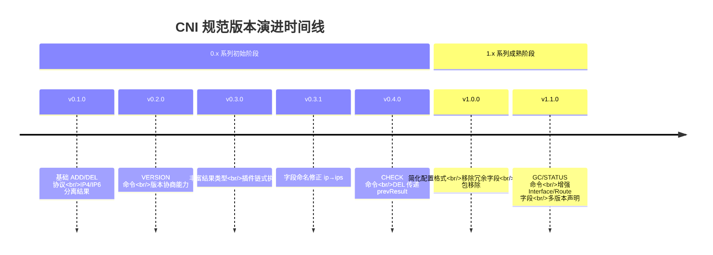
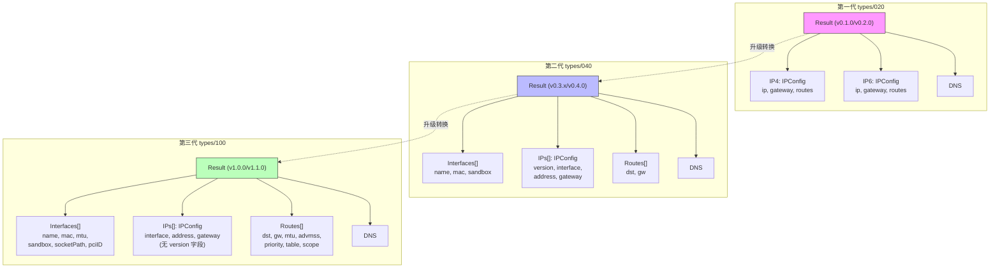
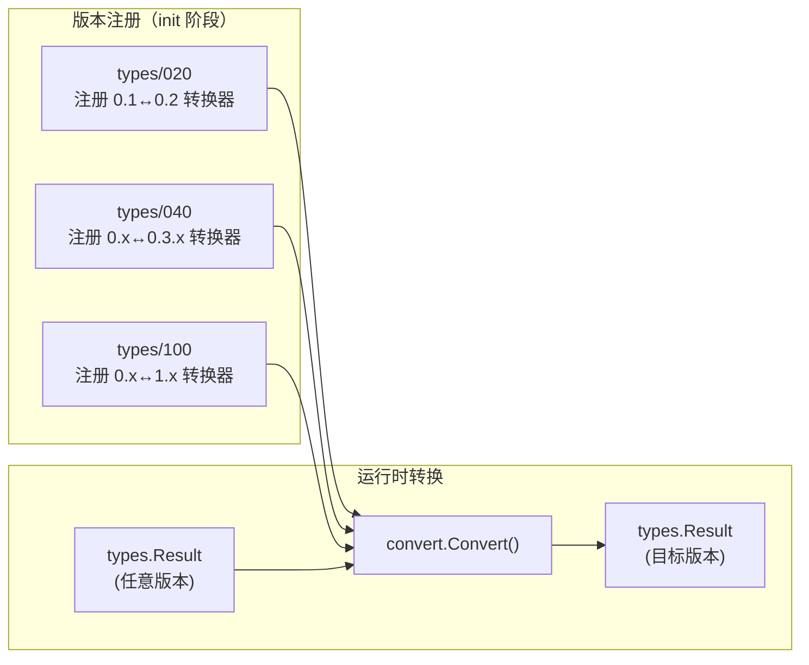

CNI（Container Network Interface）规范自诞生以来经历了从 v0.1.0 到 v1.1.0 共 **七个版本**的迭代，每一次演进都在配置格式、执行协议和结果类型上引入了关键变化。本文将从**规范版本与库版本的独立性**出发，系统梳理各版本的核心变更、Result 类型结构的演进脉络，以及版本间的兼容转换机制，帮助你在面对多版本并存的 CNI 生态时做出正确的版本选择。如果你尚未阅读前置内容，建议先从 [项目概述：CNI 是什么及其核心价值](1-xiang-mu-gai-shu-cni-shi-shi-yao-ji-qi-he-xin-jie-zhi) 和 [快速上手：环境搭建与运行第一个 CNI 配置](2-kuai-su-shang-shou-huan-jing-da-jian-yu-yun-xing-di-ge-cni-pei-zhi) 开始建立基础认知。

Sources: [SPEC.md](SPEC.md#L46-L65), [Documentation/spec-upgrades.md](Documentation/spec-upgrades.md#L1-L8)

## 规范版本与库版本：两个独立的版本号体系

在深入各版本差异之前，必须先建立一个关键认知：**CNI 规范版本（Spec Version）与本仓库的库/插件发布版本（Release Version）是独立演进的两个版本号体系**。例如，Release v0.4.0 支持的是 Spec v0.2.0，而 Release v0.5.0 则支持 Spec v0.3.0。当前本仓库实现的规范版本为 **1.1.0**，由 `version.Current()` 函数直接返回。

Sources: [SPEC.md](SPEC.md#L46-L51), [pkg/version/version.go](pkg/version/version.go#L26-L28)

这个独立性意味着：当你看到一个 CNI 插件的 Go 库版本为 v1.0.0 时，它可能同时支持多个规范版本（0.1.0 ~ 1.1.0）。仓库中的 `version.All` 变量定义了当前库所支持的**完整规范版本集合**：

```go
var All = PluginSupports("0.1.0", "0.2.0", "0.3.0", "0.3.1", "0.4.0", "1.0.0", "1.1.0")
```

Sources: [pkg/version/version.go](pkg/version/version.go#L37-L40)

## 规范演进时间线与核心变更概览

以下表格汇总了从 v0.1.0 到 v1.1.0 每个规范版本引入的**核心变更**：

| 规范版本 | 核心变更 | 影响范围 |
|---------|---------|---------|
| **v0.1.0** | 初始版本，定义基本的 ADD/DEL 协议与 IP4/IP6 分离的 Result 结构 | 执行协议、结果类型 |
| **v0.2.0** | 引入 **VERSION 命令**，插件可通过该命令报告其支持的规范版本 | 执行协议 |
| **v0.3.0** | 引入**丰富结果类型**（Rich Result），支持多 IP 地址、接口列表；引入**插件链式执行**（Plugin Chaining） | 配置格式、结果类型、执行协议 |
| **v0.3.1** | 修正 v0.3.0 中的字段命名错误：`ip` → `ips`，使其与 IPAM Result 定义一致 | 结果类型 |
| **v0.4.0** | 引入 **CHECK 命令**，运行时可探测容器网络状态；引入在 **DEL 时传递 prevResult**；引入 `disableCheck` 配置标志 | 执行协议、配置格式 |
| **v1.0.0** | **移除非 List 配置格式**（只保留 plugins 列表形式）；移除 `interfaces` 数组中的冗余 `version` 字段；`/pkg/types/current` 子包不再存在 | 配置格式、结果类型、库 API |
| **v1.1.0** | 引入 **GC 命令**（垃圾回收陈旧资源）与 **STATUS 命令**（探测插件就绪状态）；新增 `cniVersions` 字段支持多版本声明；新增 `disableGC` 与 `loadOnlyInlinedPlugins` 配置标志；Interface 新增 `mtu`、`socketPath`、`pciID` 字段；Route 新增 `mtu`、`advmss`、`priority`、`table`、`scope` 字段 | 执行协议、配置格式、结果类型 |

Sources: [SPEC.md](SPEC.md#L52-L65), [Documentation/spec-upgrades.md](Documentation/spec-upgrades.md#L26-L34)



Sources: [SPEC.md](SPEC.md#L52-L65)

## 各版本核心变更详解

### v0.1.0 — 一切的起点

v0.1.0 定义了 CNI 的基础协议：通过环境变量传递参数（`CNI_COMMAND`、`CNI_CONTAINERID` 等），通过 stdin 传入 JSON 配置，通过 stdout 返回 JSON 结果。此时的 Result 结构极为简单——只有 `IP4` 和 `IP6` 两个独立的 IP 配置对象，每个对象包含 `ip`（地址）、`gateway`（网关）和 `routes`（路由）。没有接口信息、没有链式执行、没有版本协商。

Sources: [SPEC.md](SPEC.md#L57-L63), [pkg/types/020/types.go](pkg/types/020/types.go#L103-L108)

### v0.2.0 — VERSION 命令引入版本协商

v0.2.0 新增了 **VERSION 命令**，插件可以响应此命令报告自身支持的规范版本列表。这一机制为后续版本的兼容性检测奠定了基础。v0.1.0 时代的插件不知道版本概念，因此当 VERSION 命令失败时，运行时应**假定插件仅支持 v0.1.0**。

Sources: [Documentation/spec-upgrades.md](Documentation/spec-upgrades.md#L227-L231), [SPEC.md](SPEC.md#L362-L369)

### v0.3.0 / v0.3.1 — 丰富结果类型与插件链式执行

这是 CNI 规范演进中**变化最大的一次升级**。v0.3.0 引入了三个重大特性：

1. **丰富结果类型（Rich Result）**：Result 结构从 `ip4`/`ip6` 二元组转变为 `interfaces`（接口列表）+ `ips`（IP 地址列表）+ `routes`（路由列表）的三维结构，支持一个容器拥有多个 IP 地址和多个网络接口。
2. **插件链式执行**：网络配置从单个插件扩展为插件列表（`plugins` 数组），前一个插件的 Result 作为 `prevResult` 传递给下一个插件。
3. **版本兼容转换**：Go 库中 `types.Result` 从具体结构体重构为接口（`interface`），各版本的具体类型被拆分到 `types/020`、`types/040` 等子包中。

v0.3.1 仅修正了一个字段命名错误：v0.3.0 中 Result 的 `ip` 字段本应命名为 `ips` 以与 IPAM Result 保持一致，此版本完成了该修正。

Sources: [Documentation/spec-upgrades.md](Documentation/spec-upgrades.md#L36-L48), [pkg/types/040/types.go](pkg/types/040/types.go#L85-L92)

### v0.4.0 — CHECK 命令与 DEL 传递 prevResult

v0.4.0 引入了两个重要的协议增强：

- **CHECK 命令**：允许运行时在不执行 ADD 或 DEL 的情况下探测容器网络状态。插件需要根据 `prevResult` 验证接口、地址和路由是否仍然存在且处于正确状态。配套的 `disableCheck` 配置标志允许管理员在特定插件组合已知会产生误报时禁用 CHECK。
- **DEL 传递 prevResult**：在执行 DEL 操作时，运行时现在需要将之前 ADD 操作的最终结果作为 `prevResult` 传递给插件链。这使得插件在清理时可以准确知道之前创建的资源。

Sources: [Documentation/spec-upgrades.md](Documentation/spec-upgrades.md#L26-L33), [SPEC.md](SPEC.md#L293-L334)

### v1.0.0 — 规范成熟化

v1.0.0 是规范迈向稳定的里程碑版本，主要做了**减法**：

1. **移除非 List 配置格式**：早期规范允许单个插件配置（非 `plugins` 列表形式），v1.0.0 统一要求使用 `plugins` 数组格式，简化了运行时的解析逻辑。
2. **移除 `interfaces` 数组中的 `version` 字段**：该字段是冗余的——接口的 IP 版本信息已由 `ips` 数组中的 `address` 字段隐含表达。
3. **`/pkg/types/current` 子包不再存在**：这是一个**破坏性的库 API 变更**。此前插件通常导入 `types/current` 来获取最新类型，v1.0.0 后必须显式选择一个版本化的子包（如 `types/100`），将版本选择权交还给插件作者。

Sources: [Documentation/spec-upgrades.md](Documentation/spec-upgrades.md#L1-L24), [pkg/types/100/types.go](pkg/types/100/types.go#L89-L96)

### v1.1.0 — 运维能力增强（当前版本）

v1.1.0 是当前最新规范版本，聚焦于**运维可观测性和资源管理**：

- **GC 命令**：运行时可以向插件传递一个"有效附件列表"（`cni.dev/valid-attachments`），插件据此清理不在列表中的陈旧资源（如 IPAM 预留、防火墙规则）。这解决了节点重启后孤儿资源的清理问题。配套的 `disableGC` 标志允许按网络配置禁用此功能。
- **STATUS 命令**：运行时可以探测插件是否就绪。定义了两个专用错误码：50（插件不可用）和 51（插件不可用且现有容器可能受限）。
- **多版本声明**：网络配置新增 `cniVersions` 字段（字符串列表），与 `cniVersion` 并存，允许一份配置声明支持多个规范版本。运行时必须从中选择**最高的共同支持版本**。
- **Interface 扩展字段**：新增 `mtu`、`socketPath`、`pciID`，提供更丰富的接口描述能力。
- **Route 扩展字段**：新增 `mtu`、`advmss`、`priority`、`table`、`scope`，使路由配置更加精细。

Sources: [SPEC.md](SPEC.md#L46-L51), [SPEC.md](SPEC.md#L337-L403), [SPEC.md](SPEC.md#L574-L597), [pkg/types/100/types.go](pkg/types/100/types.go#L269-L277)

## Result 类型结构的三代演进

Result 类型是理解各版本差异的核心线索。本仓库通过三个版本化子包实现了三代 Result 类型，每一代在结构上都有显著差异。



Sources: [pkg/types/020/types.go](pkg/types/020/types.go#L103-L108), [pkg/types/040/types.go](pkg/types/040/types.go#L85-L92), [pkg/types/100/types.go](pkg/types/100/types.go#L89-L96)

### 第一代：v0.1.0 / v0.2.0 — IP4/IP6 二元组

第一代 Result 将 IPv4 和 IPv6 配置完全分离，每个协议版本有独立的 `IPConfig` 结构。这意味着**每个协议只能返回一个 IP 地址**，无法表达多 IP 场景。

```go
// types/020 中的 Result 结构
type Result struct {
    CNIVersion string    `json:"cniVersion,omitempty"`
    IP4        *IPConfig `json:"ip4,omitempty"`    // 最多一个 IPv4
    IP6        *IPConfig `json:"ip6,omitempty"`    // 最多一个 IPv6
    DNS        types.DNS `json:"dns,omitempty"`
}

type IPConfig struct {
    IP      net.IPNet
    Gateway net.IP
    Routes  []types.Route
}
```

Sources: [pkg/types/020/types.go](pkg/types/020/types.go#L103-L141)

### 第二代：v0.3.x / v0.4.0 — 多 IP 与接口索引

第二代 Result 引入了 `interfaces`、`ips`、`routes` 三个独立的数组，每个 `IPConfig` 通过 `interface` 索引指向对应的接口。关键变化是 `IPConfig` 新增了 `Version` 字段（字符串 "4" 或 "6"）用于标识 IP 协议版本，而路由从 IP 配置中提升为 Result 的顶层字段。

```go
// types/040 中的 Result 结构
type Result struct {
    CNIVersion string         `json:"cniVersion,omitempty"`
    Interfaces []*Interface   `json:"interfaces,omitempty"`
    IPs        []*IPConfig    `json:"ips,omitempty"`
    Routes     []*types.Route `json:"routes,omitempty"`
    DNS        types.DNS      `json:"dns,omitempty"`
}

type IPConfig struct {
    Version   string   // "4" 或 "6"
    Interface *int     // 指向 interfaces 数组的索引
    Address   net.IPNet
    Gateway   net.IP
}

type Interface struct {
    Name    string `json:"name"`
    Mac     string `json:"mac,omitempty"`
    Sandbox string `json:"sandbox,omitempty"`
}
```

Sources: [pkg/types/040/types.go](pkg/types/040/types.go#L85-L92), [pkg/types/040/types.go](pkg/types/040/types.go#L220-L253)

### 第三代：v1.0.0 / v1.1.0 — 精简与扩展并存

第三代 Result 在结构布局上与第二代相同（`interfaces` + `ips` + `routes` + `dns`），但有两个关键差异：**移除了 `IPConfig.Version` 字段**（IP 版本由地址本身隐含表达），以及**大幅扩展了 `Interface` 和 `Route` 的字段**。

```go
// types/100 中的 Interface（对比 040 新增了三个字段）
type Interface struct {
    Name       string `json:"name"`
    Mac        string `json:"mac,omitempty"`
    Mtu        int    `json:"mtu,omitempty"`        // v1.1.0 新增
    Sandbox    string `json:"sandbox,omitempty"`
    SocketPath string `json:"socketPath,omitempty"` // v1.1.0 新增
    PciID      string `json:"pciID,omitempty"`      // v1.1.0 新增
}

// types/100 中的 IPConfig（移除了 Version 字段）
type IPConfig struct {
    Interface *int       // 指向 interfaces 数组的索引
    Address   net.IPNet  // 地址本身隐含了 IPv4/IPv6
    Gateway   net.IP
}
```

值得注意的是，v1.0.0 和 v1.1.0 的 Result 类型结构完全相同（`types/100` 子包同时覆盖两者），区别仅体现在执行协议层面（v1.1.0 新增了 GC 和 STATUS 命令）。

Sources: [pkg/types/100/types.go](pkg/types/100/types.go#L89-L96), [pkg/types/100/types.go](pkg/types/100/types.go#L269-L303), [pkg/types/100/types.go](pkg/types/100/types.go#L29-L32)

## 版本转换矩阵与兼容性机制

当运行时、插件和配置文件分别支持不同的规范版本时，CNI 库提供了自动化的版本转换机制。以下是官方提供的**版本转换兼容性矩阵**：

| 源版本 ↓ / 目标版本 → | 0.1 | 0.2 | 0.3 | 0.4 | 1.0 |
|---|---|---|---|---|---|
| **To 0.1** | ✔ | ✔ | ✗ | ✗ | ✗ |
| **To 0.2** | ✔ | ✔ | ✗ | ✗ | ✗ |
| **To 0.3** | ✴ | ✴ | ✔ | ✔ | ✔ |
| **To 0.4** | ✴ | ✴ | ✔ | ✔ | ✔ |
| **To 1.0** | ✴ | ✴ | ✔ | ✔ | ✔ |

**图例说明**：✔ = 无损转换；✴ = 高版本输出可能包含空字段（如从 0.2 升级到 0.4 时 `interfaces` 可能为空）；✗ = 低版本输出会丢失数据（如从 0.4 降级到 0.2 时只能保留每个协议的第一个 IP 地址）

Sources: [Documentation/spec-upgrades.md](Documentation/spec-upgrades.md#L265-L276)

### 转换引擎的工作原理

版本转换的核心引擎位于 `pkg/types/internal/convert.go`。它采用**注册制**设计：每个版本化子包在 `init()` 函数中通过 `RegisterConverter` 注册自己的转换函数。转换函数签名统一为 `func(from types.Result, toVersion string) (types.Result, error)`。



Sources: [pkg/types/internal/convert.go](pkg/types/internal/convert.go#L53-L74)

一个关键设计是**级联转换**：当直接转换器不存在时，转换引擎通过中间版本进行两步转换。例如，`types/100` 中从 0.2.0 到 1.0.0 的转换是先转换为 0.4.0，再从 0.4.0 转换为 1.0.0：

```go
func convertFrom02x(from types.Result, toVersion string) (types.Result, error) {
    result040, err := convert.Convert(from, "0.4.0")   // 第一步：0.2 → 0.4
    result100, err := convertFrom04x(result040, toVersion) // 第二步：0.4 → 1.0
    return result100, nil
}
```

Sources: [pkg/types/100/types.go](pkg/types/100/types.go#L135-L145)

### 降级转换中的数据丢失

当高版本 Result 降级到低版本时，不可避免地会丢失信息。以 0.4.0 → 0.2.0 的降级为例：由于 0.2.0 的 Result 只支持每个协议一个 IP 地址，转换器只会保留每个协议版本的**第一个 IP**，其余全部丢弃：

```go
for _, fromIP := range fromResult.IPs {
    if fromIP.Version == "4" && toResult.IP4 == nil {
        toResult.IP4 = &types020.IPConfig{IP: fromIP.Address, Gateway: fromIP.Gateway}
    } else if fromIP.Version == "6" && toResult.IP6 == nil {
        toResult.IP6 = &types020.IPConfig{IP: fromIP.Address, Gateway: fromIP.Gateway}
    }
}
```

同时，`interfaces` 数组在降级到 0.2.0 时会被完全丢弃——因为第一代 Result 结构中根本没有接口信息的存放位置。如果降级后没有任何 IP 地址（`IP4` 和 `IP6` 都为 `nil`），转换将返回错误。

Sources: [pkg/types/040/types.go](pkg/types/040/types.go#L145-L192)

## 版本协商与选择策略

理解版本差异后，正确地进行版本协商是实际开发中的关键问题。CNI 规范定义了一套清晰的版本选择机制。

### 插件如何声明支持的版本

插件通过 VERSION 命令的响应来声明其支持的规范版本列表。在 Go 库中，这通过 `skel.PluginMain()` 的第三个参数实现：

```go
func main() {
    // version.All 表示支持所有已知规范版本
    skel.PluginMain(cmdAdd, cmdDel, version.All)
}
```

VERSION 命令的响应格式如下：

```json
{
    "cniVersion": "1.1.0",
    "supportedVersions": ["0.1.0", "0.2.0", "0.3.0", "0.3.1", "0.4.0", "1.0.0", "1.1.0"]
}
```

Sources: [SPEC.md](SPEC.md#L607-L620), [pkg/version/plugin.go](pkg/version/plugin.go#L54-L62)

### 运行时如何选择版本

运行时的版本选择遵循**最高共同版本**原则：

1. 从网络配置中读取 `cniVersion` 和 `cniVersions` 字段，确定配置支持的版本集合。
2.（可选）通过 VERSION 命令探测插件支持的版本集合。
3. 选择**两者交集中的最高版本**作为实际使用版本。
4. 将选定的 `cniVersion` 注入到传递给插件的请求配置中。

如果配置中没有 `cniVersion` 字段，应**假定为 v0.2.0**。如果插件不支持请求的版本，必须返回错误码 1（Incompatible CNI version）。

Sources: [SPEC.md](SPEC.md#L196-L202), [Documentation/spec-upgrades.md](Documentation/spec-upgrades.md#L95-L107)

### 版本兼容性校验器

CNI 库提供了 `Reconciler` 类型用于校验配置版本与插件版本的兼容性。它的逻辑简单直接——逐一比对配置版本是否在插件的支持版本列表中：

```go
func (*Reconciler) CheckRaw(configVersion string, supportedVersions []string) *ErrorIncompatible {
    for _, supportedVersion := range supportedVersions {
        if configVersion == supportedVersion {
            return nil  // 匹配成功
        }
    }
    return &ErrorIncompatible{Config: configVersion, Supported: supportedVersions}
}
```

Sources: [pkg/version/reconcile.go](pkg/version/reconcile.go#L32-L49)

## 各版本操作命令对照

下表清晰展示了每个规范版本支持的操作命令及其引入版本：

| 操作命令 | v0.1.0 | v0.2.0 | v0.3.0 | v0.3.1 | v0.4.0 | v1.0.0 | v1.1.0 | 说明 |
|---------|--------|--------|--------|--------|--------|--------|--------|------|
| **ADD** | ✅ | ✅ | ✅ | ✅ | ✅ | ✅ | ✅ | 添加容器到网络 |
| **DEL** | ✅ | ✅ | ✅ | ✅ | ✅ | ✅ | ✅ | 从网络移除容器 |
| **VERSION** | — | ✅ | ✅ | ✅ | ✅ | ✅ | ✅ | 查询插件支持的版本 |
| **CHECK** | — | — | — | — | ✅ | ✅ | ✅ | 检查容器网络状态 |
| **GC** | — | — | — | — | — | — | ✅ | 清理陈旧资源 |
| **STATUS** | — | — | — | — | — | — | ✅ | 检查插件就绪状态 |

Sources: [SPEC.md](SPEC.md#L236-L238), [SPEC.md](SPEC.md#L293-L403)

## 升级实践建议

### 对于插件开发者

如果你的插件有**已部署的用户基础**，务必同时支持多个规范版本。最佳实践是内部使用最新版本类型（`types/100`）进行计算，仅在最终输出时通过 `types.PrintResult()` 转换为配置请求的版本格式。这样可以用最少的代码实现全版本兼容。

Sources: [Documentation/spec-upgrades.md](Documentation/spec-upgrades.md#L138-L173)

### 对于运行时开发者

运行时需要支持**处理来自不同版本插件的结果**。Go 库中 `types.Result` 接口屏蔽了版本差异，你可以通过 `current.NewResultFromResult()` 将任意版本的 Result 上转为最新版本后统一处理。需要注意的是，从旧版本上转时新字段可能为空。

Sources: [Documentation/spec-upgrades.md](Documentation/spec-upgrades.md#L280-L294)

### 对于配置文件维护者

确保每份网络配置文件都指定了 `cniVersion` 字段。配置版本应选择你的运行时和所有插件共同支持的**最低版本**——这是保证最大兼容性的安全策略。同时可以利用 v1.1.0 新增的 `cniVersions` 字段声明多个支持的版本，让运行时自动选择最优版本。

Sources: [Documentation/spec-upgrades.md](Documentation/spec-upgrades.md#L61-L74)

## 下一步阅读

掌握了规范版本的演进脉络后，你可以按以下路径深入探索：

- 要深入理解当前规范中**网络配置格式的每个字段**，请阅读 [CNI 规范全景：网络配置格式详解](5-cni-gui-fan-quan-jing-wang-luo-pei-zhi-ge-shi-xiang-jie)。
- 要了解 ADD、DEL、CHECK、GC、STATUS **五大操作的具体协议细节**，请阅读 [执行协议：ADD、DEL、CHECK、GC、STATUS 五大操作](6-zhi-xing-xie-yi-add-del-check-gc-status-wu-da-cao-zuo)。
- 要理解 Result 类型在各版本间的**自动转换实现细节**，请阅读 [结果类型（Result Types）与版本兼容转换](8-jie-guo-lei-xing-result-types-yu-ban-ben-jian-rong-zhuan-huan) 和 [类型系统：多版本类型定义与自动转换](14-lei-xing-xi-tong-duo-ban-ben-lei-xing-ding-yi-yu-zi-dong-zhuan-huan)。