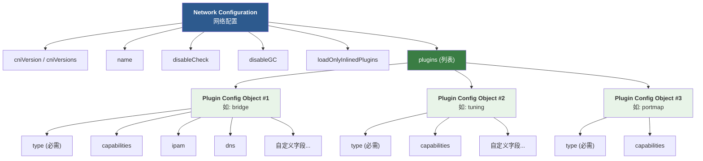
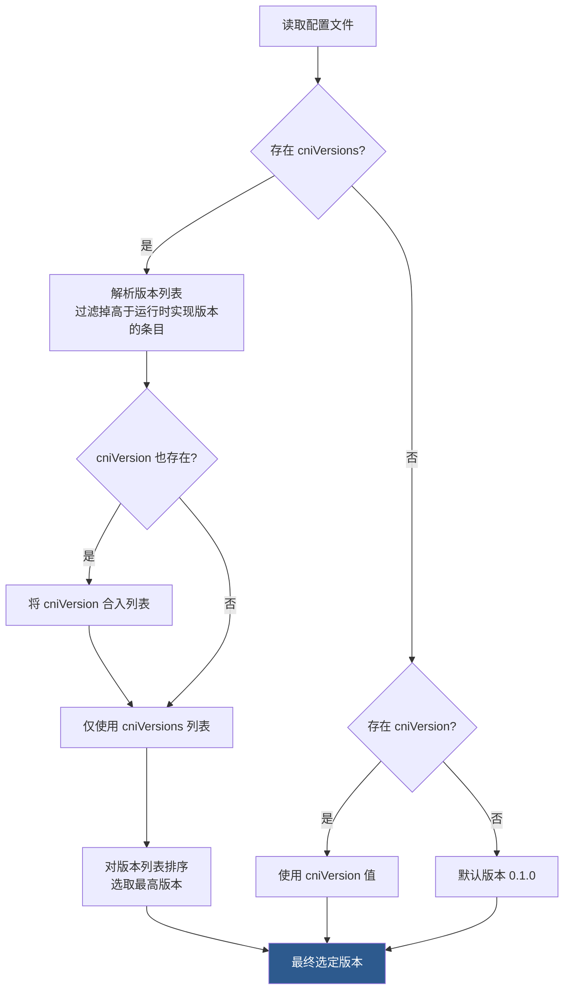
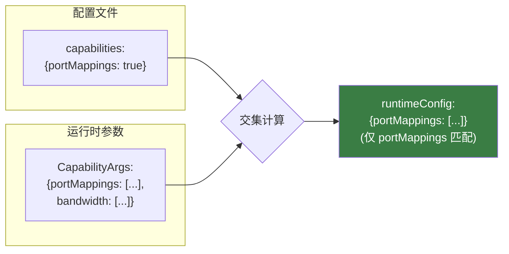
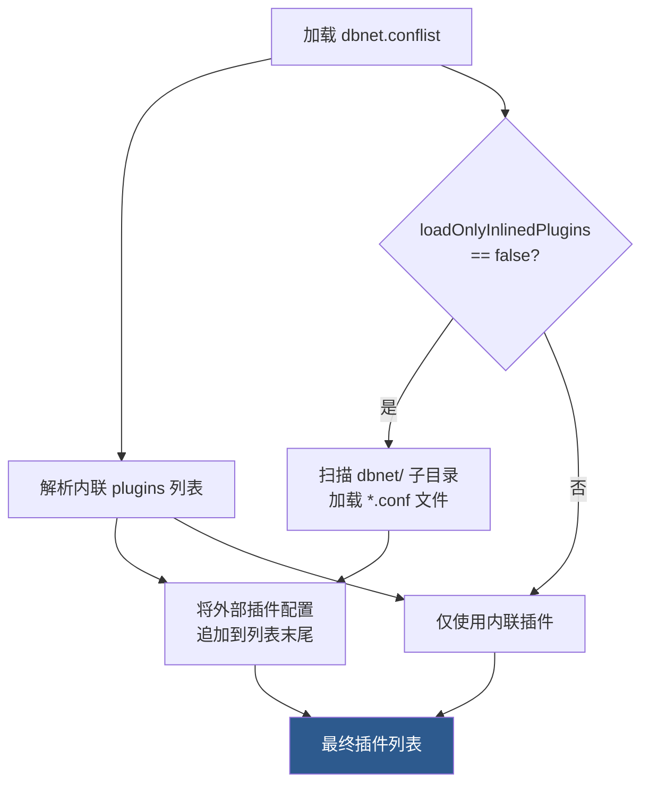

CNI（Container Network Interface）规范的核心定义之一是**网络配置格式**——一份由管理员编写的、面向容器运行时和插件双重消费的 JSON 文档。它不仅是运行时如何调用插件的蓝图，也是插件链式协作的数据载体。本文将深入拆解这份配置的每一层结构、每个字段的语义，以及从磁盘文件到插件 stdin 的完整变换过程，帮助你建立对 CNI 配置格式的精确认知。

Sources: [SPEC.md](SPEC.md#L95-L200)

## 配置架构全景：两层结构模型

CNI 网络配置采用**双层嵌套结构**：外层是**网络配置**（Network Configuration），描述网络整体的元信息和行为策略；内层是**插件配置对象列表**（Plugin Configuration Objects），定义参与该网络的各个插件的执行参数。



这种设计的关键洞察在于：**配置是静态的**，它在概念上"存储在磁盘上"，但其消费方式是动态的——容器运行时在执行时会对其进行解释和变换，生成传递给每个插件的**请求配置**（Request Configuration）。换言之，管理员写的配置并不直接到达插件的 stdin，而是经过运行时的派生处理。

Sources: [SPEC.md](SPEC.md#L95-L105), [pkg/types/types.go](pkg/types/types.go#L59-L125)

## 网络配置顶层字段详解

网络配置的顶层 JSON 对象包含以下字段，每个字段都有明确的语义边界：

| 字段 | 类型 | 必需性 | 用途 |
|------|------|--------|------|
| `cniVersion` | string | 可选 | 单一 CNI 规范版本声明（如 `"1.1.0"`） |
| `cniVersions` | string[] | 可选 | 多版本兼容声明列表 |
| `name` | string | 必需 | 网络名称，主机范围内唯一标识 |
| `disableCheck` | boolean | 可选 | 为 `true` 时运行时跳过 CHECK 操作 |
| `disableGC` | boolean | 可选 | 为 `true` 时运行时跳过 GC 操作 |
| `loadOnlyInlinedPlugins` | boolean | 可选 | 为 `true` 时仅使用内联插件配置 |
| `plugins` | array | 可选 | 内联插件配置对象列表 |

**版本声明的双字段机制**值得特别关注。`cniVersion` 是传统单一版本声明，`cniVersions` 则允许配置文件声明它兼容多个 CNI 规范版本。当两者同时出现时，运行时会将两者合并后选取**最高的、运行时实现所支持的版本**。这种设计让一份配置文件可以在不同版本的 CNI 运行时环境中无缝迁移。

Sources: [SPEC.md](SPEC.md#L106-L117), [libcni/conf.go](libcni/conf.go#L107-L160)

### name 字段的命名约束

`name` 字段遵循严格的命名规则：必须以字母或数字开头，后续可包含字母、数字、下划线（`_`）、点号（`.`）或连字符（`-`）。这一约束在网络名称被用作文件系统路径（如插件配置子目录查找）时尤为重要，确保跨平台兼容性。

Sources: [SPEC.md](SPEC.md#L110-L113)

### 行为控制字段：disableCheck 与 disableGC

这两个布尔字段为管理员提供了**精细的操作级控制**：

- **`disableCheck`**：某些插件组合在 CHECK 操作中可能产生虚假错误。管理员可以将此字段设为 `true` 来阻止运行时对此网络配置执行 CHECK，避免已知的误报问题。
- **`disableGC`**：垃圾回收操作可能在共享配置的多容器场景中产生副作用。设为 `true` 可防止运行时对网络执行 GC，保护跨容器共享的网络资源。

Sources: [SPEC.md](SPEC.md#L113-L114), [libcni/api.go](libcni/api.go#L548-L572)

### loadOnlyInlinedPlugins 与插件聚合

`loadOnlyInlinedPlugins` 默认为 `false`，这意味着运行时可以从**多个来源聚合**插件配置对象——除了 `plugins` 列表中的内联插件外，还可以从磁盘上的插件配置子目录加载额外的 `.conf` 文件。当设为 `true` 时，运行时将**仅使用** `plugins` 列表中显式声明的插件，不再扫描外部配置文件。

Sources: [SPEC.md](SPEC.md#L115-L116), [libcni/conf.go](libcni/conf.go#L247-L271)

## 插件配置对象（Plugin Configuration Objects）

插件配置对象是 `plugins` 数组中的每个元素，代表一个将被运行时调用的 CNI 插件及其参数。每个对象具有四个层次的字段分类：

### 必需字段

| 字段 | 类型 | 约束 |
|------|------|------|
| `type` | string | 匹配磁盘上的插件二进制文件名；不得包含路径分隔符（`/`、`\`） |

`type` 是插件配置对象的**唯一必需字段**。运行时根据此字段的值在 `CNI_PATH` 指定的目录列表中查找对应的可执行文件。如果找不到匹配的二进制文件，运行时必须返回错误。

Sources: [SPEC.md](SPEC.md#L118-L124)

### 协议层字段

| 字段 | 类型 | 用途 |
|------|------|------|
| `capabilities` | dictionary | 声明插件支持的扩展能力，用于触发 `runtimeConfig` 的生成 |

`capabilities` 是一个字典，键为能力名称，值为布尔值。当值设为 `true` 时，表示该插件期望运行时在执行时提供对应的动态配置数据。例如 `"capabilities": {"portMappings": true}` 表示插件期望接收端口映射信息。

Sources: [SPEC.md](SPEC.md#L126-L127)

### 保留字段（由运行时在执行时注入）

以下字段**不应在配置文件中出现**，它们由运行时在派生请求配置时自动生成：

| 字段 | 用途 |
|------|------|
| `runtimeConfig` | 由运行时根据 `capabilities` 和运行时参数动态生成 |
| `args` | 由运行时注入的附加参数 |
| `cni.dev/*` 前缀字段 | 协议级的动态数据（如 GC 操作的 `valid-attachments`） |

Sources: [SPEC.md](SPEC.md#L129-L133)

### 知名可选字段

这些字段不由协议使用，但具有**标准语义**，插件在使用时应遵循其约定含义：

| 字段 | 类型 | 语义 |
|------|------|------|
| `ipMasq` | boolean | 在宿主机上为此网络设置 IP 伪装，用于宿主机作为网关的场景 |
| `ipam` | object | IP 地址管理（IPAM）配置，内含 `type`（IPAM 插件名）及其他参数 |
| `dns` | object | DNS 配置 |

**`ipam` 字段**是 CNI 委托机制的核心入口。其内部的 `type` 字段指向一个独立的 IPAM 插件二进制文件（如 `host-local`），主插件将在执行时自行调用该 IPAM 插件获取 IP 地址分配结果。

**`dns` 字段**支持以下子键：

| 子键 | 类型 | 说明 |
|------|------|------|
| `nameservers` | string[] | 按优先级排列的 DNS 服务器列表（IPv4/IPv6 地址） |
| `domain` | string | 短主机名查找使用的本地域名 |
| `search` | string[] | 按优先级排列的搜索域列表（大多数解析器优先于 `domain`） |
| `options` | string[] | 传递给解析器的选项列表 |

Sources: [SPEC.md](SPEC.md#L135-L149), [pkg/types/types.go](pkg/types/types.go#L64-L78)

### 插件自定义字段

除了上述规范定义的字段外，插件可以定义**任意额外字段**来接收自己的配置参数。运行时**必须原样传递**这些字段，不做任何修改。插件有权对无法识别的字段返回错误。例如，`bridge` 插件可能定义 `"bridge": "cni0"` 来指定网桥名称，这完全是插件私有的配置语义。

Sources: [SPEC.md](SPEC.md#L148-L149)

## 完整配置示例与逐层解读

以下是一个名为 `dbnet` 的三插件链式配置，展示了所有关键字段的实际用法：

```json
{
  "cniVersion": "1.1.0",
  "cniVersions": ["0.3.1", "0.4.0", "1.0.0", "1.1.0"],
  "name": "dbnet",
  "plugins": [
    {
      "type": "bridge",
      "bridge": "cni0",
      "keyA": ["some more", "plugin specific", "configuration"],
      "ipam": {
        "type": "host-local",
        "subnet": "10.1.0.0/16",
        "gateway": "10.1.0.1",
        "routes": [{"dst": "0.0.0.0/0"}]
      },
      "dns": {
        "nameservers": ["10.1.0.1"]
      }
    },
    {
      "type": "tuning",
      "capabilities": {"mac": true},
      "sysctl": {
        "net.core.somaxconn": "500"
      }
    },
    {
      "type": "portmap",
      "capabilities": {"portMappings": true}
    }
  ]
}
```

**逐层解读**：

1. **`bridge` 插件**：作为链中的第一个"接口插件"，负责创建容器的网络接口。它声明了自定义的 `bridge` 和 `keyA` 字段，同时通过 `ipam` 委托 IP 地址管理给 `host-local` 插件，通过 `dns` 配置 DNS 服务器。

2. **`tuning` 插件**：一个"链式插件"，不创建接口而是调整已有接口的配置。它通过 `capabilities: {"mac": true}` 声明需要运行时提供 MAC 地址数据，同时通过 `sysctl` 字段配置内核参数。

3. **`portmap` 插件**：另一个链式插件，负责设置端口映射规则。它通过 `capabilities: {"portMappings": true}` 声明需要端口映射的详细信息。

Sources: [SPEC.md](SPEC.md#L152-L193)

## 版本选择机制

CNI 配置的版本选择遵循一个精确的算法。运行时需要从配置文件声明的版本集合中选出**最高的、运行时自身能够支持的版本**：



在 `libcni` 的实现中，这一逻辑通过 `NetworkConfFromBytes` 函数实现。它先解析 `cniVersion`，再解析 `cniVersions`，过滤掉高于当前库实现版本（`version.Current()` 返回 `"1.1.0"`）的条目，然后将所有有效版本排序后取最高值。

Sources: [SPEC.md](SPEC.md#L195-L202), [libcni/conf.go](libcni/conf.go#L92-L160), [pkg/version/version.go](pkg/version/version.go#L26-L28)

## 从静态配置到动态请求配置的派生过程

这是理解 CNI 配置格式最关键的环节：**管理员编写的网络配置 ≠ 传递给插件的请求配置**。运行时在执行每个插件时，会对插件配置对象进行**派生变换**，生成最终的请求配置。这个过程在 `libcni` 中由 `buildOneConfig` 和 `injectRuntimeConfig` 两个函数协同完成。

### 派生变换规则

| 变换项 | ADD/DEL/CHECK 操作 | GC 操作 |
|--------|--------------------|---------|--------|
| `cniVersion` | 始终注入运行时选定的版本 | 始终注入运行时选定的版本 |
| `name` | 始终注入网络名称 | 始终注入网络名称 |
| `runtimeConfig` | 根据 capabilities 交集生成 | 不注入 |
| `prevResult` | 注入前一个插件的结果（首个插件除外） | 不注入 |
| `capabilities` | **移除**（不传递给插件） | 不传递 |
| `cni.dev/valid-attachments` | 不注入 | 注入有效附件列表 |
| 其他字段 | **原样传递** | 原样传递 |

Sources: [SPEC.md](SPEC.md#L487-L506), [libcni/api.go](libcni/api.go#L155-L177)

### runtimeConfig 的生成算法

`runtimeConfig` 的生成是派生过程中最精巧的部分。它的值来源于两个集合的**交集**：

1. **插件声明的 capabilities**：配置文件中 `capabilities` 字段列出的、值为 `true` 的能力
2. **运行时提供的 CapabilityArgs**：运行时在 `RuntimeConf.CapabilityArgs` 中提供的动态数据

只有同时满足这两个条件的能力项才会出现在 `runtimeConfig` 中。这意味着即使运行时提供了某个能力的数据，如果插件没有声明支持该能力，数据也不会被传递；反之，如果插件声明了某个能力但运行时没有提供数据，`runtimeConfig` 中也不会出现该项。



这一机制在 `injectRuntimeConfig` 函数中实现，它遍历 `orig.Network.Capabilities` 中所有值为 `true` 的键，检查 `rt.CapabilityArgs` 中是否存在对应的数据，将匹配的项写入 `runtimeConfig` 字典。

Sources: [SPEC.md](SPEC.md#L507-L533), [libcni/api.go](libcni/api.go#L179-L211)

## 配置文件的加载与聚合机制

`libcni` 库提供了完整的配置文件加载链路，支持多种来源的插件配置聚合：

### 文件格式与加载优先级

| 文件扩展名 | 格式 | 加载函数 |
|------------|------|----------|
| `.conflist` | 网络配置列表（推荐格式） | `NetworkConfFromFile` |
| `.conf` | 单一插件配置（旧格式，自动升级） | `LoadConf`（已弃用） |
| `.json` | 同 `.conf`（旧格式） | `LoadConf`（已弃用） |

`LoadNetworkConf` 函数首先扫描指定目录中的 `.conflist` 文件，按文件名排序后匹配网络名称。如果未找到匹配的 `.conflist` 文件，它会回退到旧格式的 `.conf`/`.json` 文件，并通过 `ConfListFromConf` 将单一配置**自动升级**为列表格式。

Sources: [libcni/conf.go](libcni/conf.go#L349-L389)

### 插件配置的目录聚合

当 `loadOnlyInlinedPlugins` 为 `false`（默认值）时，运行时会从**与网络同名的子目录**中加载额外的插件配置文件。例如，对于网络 `dbnet`，如果配置文件位于 `/etc/cni/net.d/dbnet.conflist`，运行时会额外扫描 `/etc/cni/net.d/dbnet/*.conf` 目录下的所有文件，将其中的插件配置**追加到**内联插件列表之后。



Sources: [libcni/conf.go](libcni/conf.go#L247-L271), [libcni/conf.go](libcni/conf.go#L68-L90)

## Go 类型系统映射

CNI 配置格式在 Go 代码中有精确的类型映射，位于 `pkg/types` 和 `libcni` 包中：

### 核心类型对照表

| JSON 结构 | Go 类型 | 文件位置 |
|-----------|---------|----------|
| 网络配置顶层对象 | `NetConfList` | [pkg/types/types.go](pkg/types/types.go#L118-L125) |
| 插件配置对象 | `PluginConf` | [pkg/types/types.go](pkg/types/types.go#L64-L78) |
| IPAM 配置 | `IPAM` | [pkg/types/types.go](pkg/types/types.go#L108-L110) |
| DNS 配置 | `DNS` | [pkg/types/types.go](pkg/types/types.go#L153-L158) |
| 运行时参数 | `RuntimeConf` | [libcni/api.go](libcni/api.go#L54-L68) |
| 网络配置列表（含字节缓存） | `NetworkConfigList` | [libcni/api.go](libcni/api.go#L79-L87) |
| 插件配置（含字节缓存） | `PluginConfig` | [libcni/api.go](libcni/api.go#L74-L77) |

`PluginConf` 结构体中有一个特别值得注意的设计：`RawPrevResult` 使用 `map[string]interface{}` 存储原始 JSON，而 `PrevResult` 则存储解析后的 `Result` 接口对象。这种**双字段设计**允许库在解析配置时先保留原始数据，在需要时再进行延迟解析和版本转换。

Sources: [pkg/types/types.go](pkg/types/types.go#L64-L78), [libcni/api.go](libcni/api.go#L54-L87)

### 向后兼容别名

代码中保留了向后兼容的类型别名，以平滑过渡：

```go
type NetConf = PluginConf          // 插件配置（旧名称 NetConf）
type NetworkConfig = PluginConfig  // libcni 中的配置包装（旧名称 NetworkConfig）
```

这些别名标记为已弃用，将在未来版本中移除。

Sources: [pkg/types/types.go](pkg/types/types.go#L59-L61), [libcni/api.go](libcni/api.go#L70-L72)

## 配置注入与变换实现

`InjectConf` 函数是配置变换的基础设施。它接收一个已有的 `PluginConfig` 和一组键值对，将键值对注入到原始配置的 JSON 中，然后重新序列化并解析：

```go
func InjectConf(original *PluginConfig, newValues map[string]interface{}) (*PluginConfig, error)
```

这个函数被 `buildOneConfig` 调用来注入 `name`、`cniVersion`、`prevResult` 等运行时字段，也被 GC 和 STATUS 操作用来注入 `cni.dev/valid-attachments` 等协议字段。其实现逻辑是先将原始字节反序列化为通用 `map[string]interface{}`，合并新值后重新序列化，再通过 `NetworkPluginConfFromBytes` 重建结构化对象。

Sources: [libcni/conf.go](libcni/conf.go#L391-L417), [libcni/api.go](libcni/api.go#L155-L177)

## 配置验证与版本兼容性检查

在执行插件前，`libcni` 提供了配置验证机制 `ValidateNetworkList`，它执行两项检查：

1. **插件存在性检查**：验证 `type` 字段指定的插件二进制文件在 `CNI_PATH` 中确实存在
2. **版本兼容性检查**：查询插件支持的版本列表（通过 VERSION 命令），确认插件支持配置文件声明的 CNI 版本

验证成功后，该函数还会收集所有插件声明的 `capabilities`，返回去重后的能力列表，供运行时了解该网络配置支持哪些扩展能力。

Sources: [libcni/api.go](libcni/api.go#L679-L753)

## 关键设计原则总结

| 设计原则 | 体现方式 |
|----------|----------|
| **关注点分离** | 网络配置（管理员视角）vs 请求配置（插件视角），由运行时负责变换 |
| **静态配置、动态执行** | 配置文件是静态的，动态参数通过 `runtimeConfig` 在执行时注入 |
| **能力协商** | `capabilities` 机制让插件声明需求、运行时按需供给，避免不必要的数据传递 |
| **可扩展性** | 插件可定义任意自定义字段，运行时保证原样传递 |
| **多版本兼容** | `cniVersion`/`cniVersions` 双字段机制支持配置文件跨版本迁移 |
| **渐进式聚合** | `loadOnlyInlinedPlugins` 支持从文件系统和内联列表两个来源聚合插件配置 |

理解这些原则，能够帮助你在编写或调试 CNI 配置时做出正确的设计决策。当你需要声明一个新的自定义字段时，考虑它属于哪一层：如果是插件特定的行为参数，放在插件配置对象中；如果是运行时需要传递的动态数据，使用 `capabilities` 机制触发 `runtimeConfig` 注入。

Sources: [SPEC.md](SPEC.md#L95-L200), [CONVENTIONS.md](CONVENTIONS.md#L1-L10)

---

**下一步阅读建议**：

- 了解配置如何在运行时被插件消费，请阅读 [执行协议：ADD、DEL、CHECK、GC、STATUS 五大操作](6-zhi-xing-xie-yi-add-del-check-gc-status-wu-da-cao-zuo)
- 深入插件链式协作的完整机制，请阅读 [插件链式执行与委托（Delegation）机制](7-cha-jian-lian-shi-zhi-xing-yu-wei-tuo-delegation-ji-zhi)
- 了解配置加载的完整 API，请阅读 [网络配置加载与解析（conf.go）](11-wang-luo-pei-zhi-jia-zai-yu-jie-xi-conf-go)
- 掌握 capabilities 和 args 的实战用法，请阅读 [扩展约定：Capabilities、args 与 CNI_ARGS 的最佳实践](9-kuo-zhan-yue-ding-capabilities-args-yu-cni_args-de-zui-jia-shi-jian)