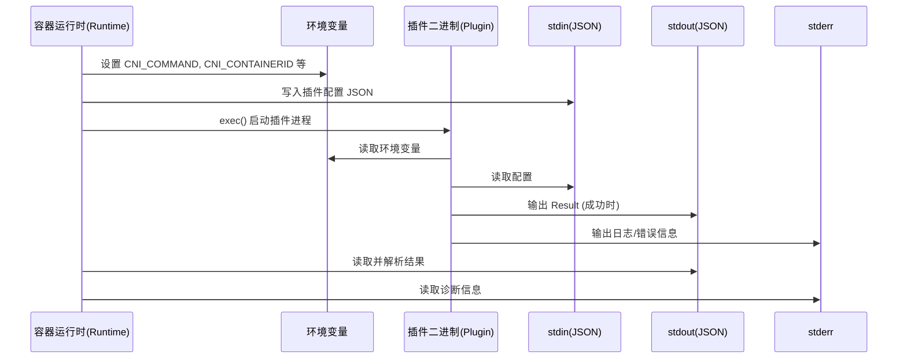
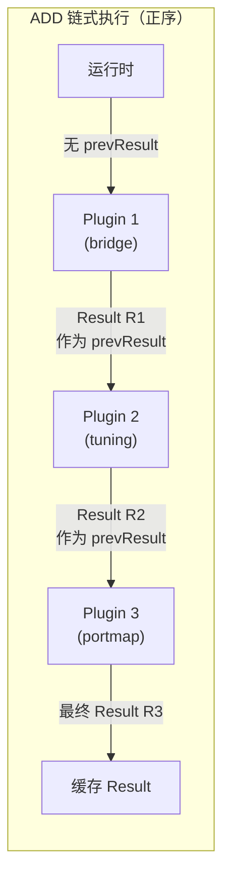
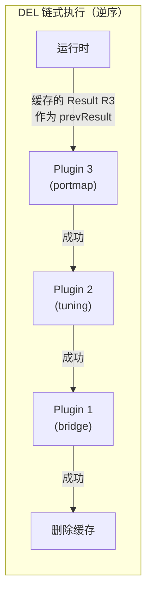
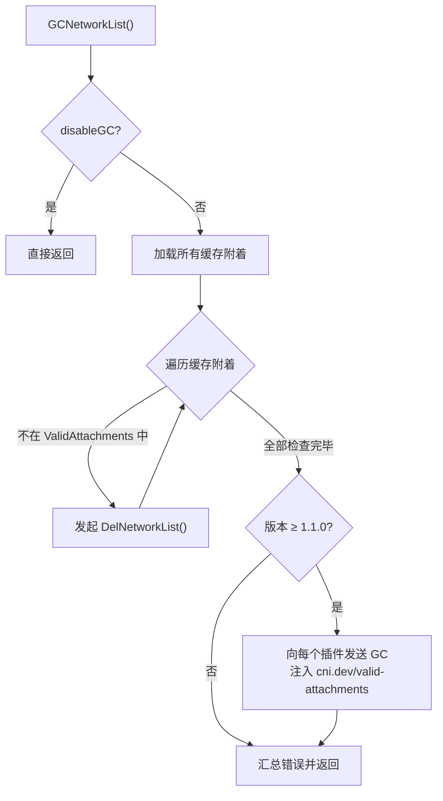
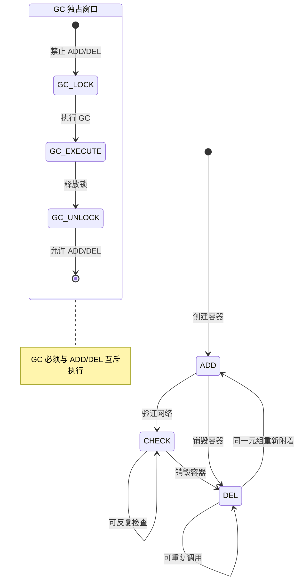

CNI 的执行协议定义了容器运行时与网络插件之间的二进制通信契约。运行时通过**环境变量传递操作参数**、**stdin 注入 JSON 配置**、**stdout/stderr 接收结果或错误**的方式，向插件发出五种核心操作指令：**ADD**（创建网络附着）、**DEL**（移除网络附着）、**CHECK**（检查网络状态）、**GC**（垃圾回收陈旧资源）、**STATUS**（探测插件就绪性）。本文将深入剖析每种操作的规范语义、参数要求、执行时序及其在 `libcni` 库中的具体实现。

Sources: [SPEC.md](SPEC.md#L204-L237)

## 协议通信模型：环境变量 + stdin/stdout 二进制调用

CNI 协议的核心通信模型极为简洁——**进程间通信**而非 RPC 调用。运行时直接以 `exec` 方式启动插件二进制文件，通过以下通道完成一次完整的请求-响应周期：



**环境变量参数**是操作调用的核心元数据载体。每个操作所需的必需和可选参数各有差异，这直接决定了 `skel` 骨架包中的参数校验逻辑。以下是完整的参数矩阵：

| 环境变量 | 用途 | ADD | DEL | CHECK | GC | STATUS |
|---------|------|-----|-----|-------|----|--------|
| `CNI_COMMAND` | 操作类型 | ✅ 必需 | ✅ 必需 | ✅ 必需 | ✅ 必需 | ✅ 必需 |
| `CNI_CONTAINERID` | 容器标识 | ✅ 必需 | ✅ 必需 | ✅ 必需 | ❌ 不需要 | ❌ 不需要 |
| `CNI_NETNS` | 网络命名空间 | ✅ 必需 | ◯ 可选 | ✅ 必需 | ❌ 不需要 | ❌ 不需要 |
| `CNI_IFNAME` | 接口名称 | ✅ 必需 | ✅ 必需 | ✅ 必需 | ❌ 不需要 | ❌ 不需要 |
| `CNI_ARGS` | 额外参数 | ◯ 可选 | ◯ 可选 | ◯ 可选 | ❌ 不需要 | ❌ 不需要 |
| `CNI_PATH` | 插件搜索路径 | ◯ 可选 | ◯ 可选 | ◯ 可选 | ◯ 可选 | ◯ 可选 |

值得注意的是，**GC 和 STATUS 操作不需要容器级别的参数**（`CNI_CONTAINERID`、`CNI_NETNS`、`CNI_IFNAME`），因为它们作用于网络级别而非单个附着（attachment）级别。在 `skel` 包的 `getCmdArgsFromEnv()` 方法中，这一点通过 `reqForCmdEntry` 映射表精确控制——当某个命令不要求特定变量时，即使该变量为空也不会报错。

Sources: [SPEC.md](SPEC.md#L221-L231), [skel.go](pkg/skel/skel.go#L59-L142), [args.go](pkg/invoke/args.go#L43-L74)

## ADD：创建网络附着

ADD 是 CNI 协议中最核心的操作，负责将容器加入网络或对已有接口应用修改。当插件接收到 `CNI_COMMAND=ADD` 时，它必须完成两件事之一：**在网络命名空间 `CNI_NETNS` 内创建由 `CNI_IFNAME` 指定的网络接口**，或**调整该接口的配置**。

### 执行流程与链式传递

当网络配置包含多个插件时，ADD 操作按**正序**依次执行每个插件，前一个插件的输出结果作为 `prevResult` 传递给下一个插件：



在 `libcni` 的实现中，`AddNetworkList()` 方法正是这个流程的直接体现。它遍历 `list.Plugins` 列表，将前一个插件的返回结果作为 `prevResult` 传给下一个插件，并在所有插件成功后**将最终结果写入缓存**：

```go
// AddNetworkList executes a sequence of plugins with the ADD command
func (c *CNIConfig) AddNetworkList(ctx context.Context, list *NetworkConfigList, rt *RuntimeConf) (types.Result, error) {
    var result types.Result
    for _, net := range list.Plugins {
        result, err = c.addNetwork(ctx, list.Name, list.CNIVersion, net, result, rt)
        if err != nil {
            return nil, fmt.Errorf("plugin %s failed (add): %w", pluginDescription(net.Network), err)
        }
    }
    if err = c.cacheAdd(result, list.Bytes, list.Name, rt); err != nil {
        return nil, fmt.Errorf("failed to set network %q cached result: %w", list.Name, err)
    }
    return result, nil
}
```

### 关键语义约束

ADD 操作有几个重要的语义规则。首先，**同一个 `(CNI_CONTAINERID, CNI_IFNAME)` 元组不允许连续执行两次 ADD**（中间必须有一次 DEL）。如果容器中已经存在同名接口，插件必须返回错误。其次，每个成功的 ADD 必须在 stdout 输出一个 **Result 结构体**（包含 `interfaces`、`ips`、`routes`、`dns` 等字段），因为后续的 CHECK 和 DEL 操作依赖这个被缓存的 Result。

在底层实现中，`addNetwork()` 方法会先执行参数校验（ContainerID、网络名称、接口名称），然后调用 `buildOneConfig()` 构建注入了 `name`、`cniVersion`、`prevResult` 的配置，最终通过 `invoke.ExecPluginWithResult()` 执行插件并解析返回的 Result。

Sources: [SPEC.md](SPEC.md#L239-L264), [api.go](libcni/api.go#L490-L530), [api.go](libcni/api.go#L155-L177)

## DEL：移除网络附着

DEL 是 ADD 的逆操作，负责将容器从网络中移除或撤销 ADD 所做的修改。DEL 的设计哲学是**尽力而为（best-effort）**——即使部分资源或状态已经丢失，插件仍应尽可能完成清理并返回成功。

### 逆向执行与 prevResult 注入

与 ADD 的正序执行不同，DEL 操作按**逆序**执行插件链。这是因为在链式配置中，后续插件通常修改了前面插件创建的资源，因此需要先撤销后面的修改再撤销前面的：



在 `libcni` 的 `DelNetworkList()` 实现中，逆序逻辑通过 `for i := len(list.Plugins) - 1; i >= 0; i--` 实现。所有 DEL 调用共享同一个 `prevResult`——即最初 ADD 操作的最终 Result（从缓存中读取）。这与 ADD 链中 prevResult 逐层传递的行为不同：

```go
func (c *CNIConfig) DelNetworkList(ctx context.Context, list *NetworkConfigList, rt *RuntimeConf) error {
    var cachedResult types.Result
    // 从 CNI 0.4.0 开始，DEL 操作支持传入缓存的 prevResult
    if gtet, err := version.GreaterThanOrEqualTo(list.CNIVersion, "0.4.0"); err != nil {
        return err
    } else if gtet {
        cachedResult, err = c.getCachedResult(list.Name, list.CNIVersion, rt)
        // ...
    }
    // 逆序执行
    for i := len(list.Plugins) - 1; i >= 0; i-- {
        net := list.Plugins[i]
        if err := c.delNetwork(ctx, list.Name, list.CNIVersion, net, cachedResult, rt); err != nil {
            return fmt.Errorf("plugin %s failed (delete): %w", ...)
        }
    }
    _ = c.cacheDel(list.Name, rt)  // 清除缓存
    return nil
}
```

### 容错与幂等性

DEL 操作有两个关键的容错设计。其一，**插件必须接受对同一 `(CNI_CONTAINERID, CNI_IFNAME)` 的多次 DEL 调用**，即使资源已经不存在也要返回成功。其二，`CNI_NETNS` 对于 DEL 是**可选参数**——因为容器可能在 DEL 调用时已经被销毁，其命名空间已不存在。这两个设计确保了即使运行时在异常恢复场景下也能安全地执行清理。

Sources: [SPEC.md](SPEC.md#L265-L291), [api.go](libcni/api.go#L589-L613)

## CHECK：检查网络状态

CHECK 操作允许运行时探查已有容器附着的网络健康状况。它是在 CNI spec **0.4.0** 版本中引入的，专门用于检测 ADD 操作之后的网络配置是否仍然有效。

### 执行语义与版本要求

CHECK 的参数必须与对应 ADD 操作的参数完全一致（`CNI_PATH` 除外）。运行时必须在配置中包含 `prevResult`——即该容器最后一次 ADD 的 Result，通常从缓存中获取。在 `libcni` 的 `CheckNetworkList()` 方法中，首先检查版本兼容性，然后获取缓存的 Result，最后以该 Result 作为 prevResult 正序执行所有插件：

```go
func (c *CNIConfig) CheckNetworkList(ctx context.Context, list *NetworkConfigList, rt *RuntimeConf) error {
    // CHECK 要求 CNI 版本 >= 0.4.0
    if gtet, err := version.GreaterThanOrEqualTo(list.CNIVersion, "0.4.0"); err != nil {
        return err
    } else if !gtet {
        return fmt.Errorf("configuration version %q %w", list.CNIVersion, ErrorCheckNotSupp)
    }
    // 如果配置中 disableCheck=true，直接返回成功
    if list.DisableCheck {
        return nil
    }
    // 获取缓存的 Result 作为 prevResult
    cachedResult, err := c.getCachedResult(list.Name, list.CNIVersion, rt)
    // ...
    for _, net := range list.Plugins {
        if err := c.checkNetwork(ctx, list.Name, list.CNIVersion, net, cachedResult, rt); err != nil {
            return err
        }
    }
    return nil
}
```

### 插件侧的检查职责

从插件视角看，CHECK 操作需要验证两类资源。**Result 类型追踪的资源**（接口、IP 地址、路由）如果缺失或状态异常，必须返回错误。**Result 类型未追踪的资源**（如防火墙规则、流量整形、IP 预留、外部守护进程依赖）如果缺失或异常，也应该返回错误。此外，插件必须考虑到 CHECK 可能在 ADD 之后立即被调用，因此需要为异步资源预留合理的收敛时间。

管理员可以通过在网络配置中设置 `disableCheck: true` 来全局禁用 CHECK，这在某些插件组合已知会产生误报时非常有用。

Sources: [SPEC.md](SPEC.md#L293-L335), [api.go](libcni/api.go#L547-L572)

## GC：垃圾回收陈旧资源

GC 操作是在 CNI spec **1.1.0** 版本中引入的网络级别清理机制。与 DEL 作用于单个附着不同，GC 作用于**整个网络**，允许运行时声明"哪些附着仍然有效"，然后由插件自行清理所有不在有效列表中的陈旧资源。

### 两阶段清理策略

`libcni` 的 `GCNetworkList()` 实现了一个**两阶段清理**策略。第一阶段，它扫描所有缓存的附着记录，对于不在 `ValidAttachments` 列表中的缓存附着，直接调用 `DelNetworkList()` 发起标准的 DEL 操作。第二阶段，如果 CNI 版本支持（≥ 1.1.0），它向每个插件发送 GC 命令，并在配置中注入 `cni.dev/valid-attachments` 字段：



这个两阶段设计的关键在于：**GC 不能替代 DEL**。某些资源（如需要访问网络命名空间的清理操作）只能通过 DEL 完成，因为 GC 执行时命名空间可能已被删除。运行时必须在执行 GC 之前确保没有正在进行的 ADD 或 DEL 操作，且在 GC 完成前不能发起新的 ADD 或 DEL。

Sources: [SPEC.md](SPEC.md#L373-L404), [api.go](libcni/api.go#L767-L842)

## STATUS：探测插件就绪性

STATUS 操作同样是 CNI spec **1.1.0** 版本新增的操作，用于运行时在执行 ADD 之前判断插件是否就绪。与 CHECK 检查容器网络状态不同，STATUS 检查的是**插件本身的服务能力**。

### 语义与错误码

STATUS 的设计遵循"**纯信息性**"原则。即使 STATUS 返回错误，运行时仍然可以发起 ADD、DEL 等操作——STATUS 不阻止任何后续行为。但 STATUS 的返回值为运行时提供了重要的决策依据：

| 错误码 | 含义 | 指导作用 |
|--------|------|----------|
| 0（成功） | 插件已就绪，可以正常处理 ADD | 运行时可安全调度新容器 |
| 50 | 插件不可用（无法处理 ADD） | 运行时应延迟调度新容器 |
| 51 | 插件不可用，且已有容器可能受限 | 运行时应发出告警并延迟调度 |

在 `libcni` 的 `GetStatusNetworkList()` 实现中，如果版本不支持 STATUS（< 1.1.0），方法直接返回 `nil`（成功），确保向后兼容。对于支持的版本，它逐个向插件发送 STATUS 命令——与 GC 的"继续执行并收集错误"不同，STATUS 采用**遇错即停**策略，第一个插件返回错误就立即返回：

```go
func (c *CNIConfig) GetStatusNetworkList(ctx context.Context, list *NetworkConfigList) error {
    if gt, _ := version.GreaterThanOrEqualTo(list.CNIVersion, "1.1.0"); !gt {
        return nil  // 版本不支持，静默返回成功
    }
    for _, plugin := range list.Plugins {
        pluginConfig, err := InjectConf(plugin, inject)
        if err != nil { return err }
        if err := c.getStatusNetwork(ctx, pluginConfig); err != nil {
            return err  // 遇错即停，不收集错误
        }
    }
    return nil
}
```

插件如果依赖委托插件（如 IPAM），必须在收到 STATUS 时也向委托插件发送 STATUS 请求，并将委托插件的错误向上传播。

Sources: [SPEC.md](SPEC.md#L337-L360), [api.go](libcni/api.go#L855-L888)

## 错误处理协议

所有 CNI 操作共享统一的错误输出格式。当插件执行失败时，必须在 stdout 输出 JSON 格式的错误结构体（非 stderr），并以非零退出码结束进程。错误结构体包含四个字段：`cniVersion`、`code`（数值错误码）、`msg`（简短描述）和 `details`（详细描述）。

以下是与五大操作密切相关的保留错误码：

| 错误码 | 常量名 | 含义 | 相关操作 |
|--------|--------|------|----------|
| 1 | `ErrIncompatibleCNIVersion` | CNI 版本不兼容 | 全部 |
| 3 | `ErrUnknownContainer` | 容器未知或不存在 | DEL |
| 4 | `ErrInvalidEnvironmentVariables` | 环境变量无效 | 全部 |
| 7 | `ErrInvalidNetworkConfig` | 网络配置无效 | 全部 |
| 11 | `ErrTryAgainLater` | 稍后重试 | ADD, CHECK |
| 50 | `ErrPluginNotAvailable` | 插件不可用 | STATUS |
| 51 | `ErrLimitedConnectivity` | 插件不可用且已有容器可能受限 | STATUS |

其中，错误码 100 及以上可由插件自由使用。值得注意的是错误码 `3`（`ErrUnknownContainer`）的特殊语义——当 DEL 操作返回此错误码时，规范明确指出运行时不需要为该容器执行任何进一步的网络清理操作。

在 `skel` 骨架包的 `pluginMain()` 方法中，`checkVersionAndCall()` 负责在调用插件回调前进行版本协商校验。如果版本不兼容，会直接返回包含 `ErrIncompatibleCNIVersion` 错误码的结构体，而不会进入插件的业务逻辑。

Sources: [SPEC.md](SPEC.md#L622-L656), [types.go](pkg/types/types.go#L231-L247), [skel.go](pkg/skel/skel.go#L190-L214)

## 操作生命周期与并发约束

CNI 规范对五大操作的执行时序和并发关系定义了严格的约束。理解这些约束对于正确使用 `libcni` 集成 CNI 至关重要：



**核心约束规则**：

1. **ADD 最终必须跟随 DEL**——唯一的例外是灾难性故障（如节点丢失）。即使 ADD 失败，也必须执行 DEL。
2. **同一容器不可并行操作**——但不同容器的操作可以并行。这个约束跨越所有附着（attachment）。
3. **GC 必须独占执行**——运行时必须确保没有 ADD 或 DEL 正在进行时才能发起 GC，且在 GC 完成前不能发起新的 ADD 或 DEL。
4. **网络配置在 ADD 到 DEL 之间不应改变**——配置在附着之间也应保持稳定。
5. **命名空间由运行时管理**——运行时负责创建和清理容器的网络命名空间，插件不负责此职责。

Sources: [SPEC.md](SPEC.md#L412-L423)

## skel 骨架包中的命令分发

从插件开发者的视角看，`skel` 包的 `dispatcher.pluginMain()` 方法是所有操作的入口点。它首先通过 `getCmdArgsFromEnv()` 从环境变量和 stdin 解析出命令类型和参数，然后根据 `CNI_COMMAND` 的值进行**版本门控 + 回调分发**：

```go
switch cmd {
case "ADD":
    err = t.checkVersionAndCall(cmdArgs, versionInfo, funcs.Add)
    // 额外校验：确保插件的 netns 与 CNI_NETNS 不同
case "CHECK":
    // 版本要求 ≥ 0.4.0，双重版本校验（配置版本 + 插件版本）
case "DEL":
    err = t.checkVersionAndCall(cmdArgs, versionInfo, funcs.Del)
case "GC":
    // 版本要求 ≥ 1.1.0，双重版本校验
case "STATUS":
    // 版本要求 ≥ 1.1.0，双重版本校验
case "VERSION":
    versionInfo.Encode(t.Stdout)  // 直接输出版本信息
}
```

这里有一个值得注意的设计差异：**ADD 和 DEL 只做单次版本校验**（配置版本是否在插件支持范围内），而 **CHECK、GC、STATUS 做双重版本校验**——先检查配置版本是否满足最低要求（CHECK ≥ 0.4.0，GC/STATUS ≥ 1.1.0），再检查插件是否支持该配置版本。这反映了后期引入的操作对版本兼容性的更严格要求。

Sources: [skel.go](pkg/skel/skel.go#L232-L346)

## libcni API 全景：运行时集成接口

`libcni` 库通过 `CNI` 接口向运行时暴露所有五大操作。以下是接口方法的完整映射：

| 接口方法 | 对应操作 | 返回值 | 备注 |
|----------|---------|--------|------|
| `AddNetworkList()` | ADD | `(Result, error)` | 链式正序执行，缓存结果 |
| `DelNetworkList()` | DEL | `error` | 链式逆序执行，删除缓存 |
| `CheckNetworkList()` | CHECK | `error` | 正序执行，使用缓存 prevResult |
| `GCNetworkList()` | GC | `error` | 两阶段清理（DEL + GC），汇总所有错误 |
| `GetStatusNetworkList()` | STATUS | `error` | 正序执行，遇错即停 |
| `ValidateNetworkList()` | — | `([]string, error)` | 预校验插件存在性和版本兼容性 |
| `GetVersionInfo()` | VERSION | `(PluginInfo, error)` | 探查单个插件的版本支持 |

每个 `*List` 方法都有对应的单插件版本（如 `AddNetwork()`、`DelNetwork()` 等），用于非链式配置场景。`GCNetworkList()` 是最复杂的方法——它是唯一同时触发 DEL 和 GC 两个操作的方法，也是唯一使用 `errors.Join()` 汇总多个错误的方法。

Sources: [api.go](libcni/api.go#L103-L125)

---

**延伸阅读**：了解插件链式执行中 prevResult 的传递细节与委托调用机制，请参阅 [插件链式执行与委托（Delegation）机制](7-cha-jian-lian-shi-zhi-xing-yu-wei-tuo-delegation-ji-zhi)。了解 Result 的具体类型定义与版本间转换，请参阅 [结果类型（Result Types）与版本兼容转换](8-jie-guo-lei-xing-result-types-yu-ban-ben-jian-rong-zhuan-huan)。如需从零构建一个响应五大操作的插件，请参阅 [skel 骨架包：构建 CNI 插件的起点](13-skel-gu-jia-bao-gou-jian-cni-cha-jian-de-qi-dian)。