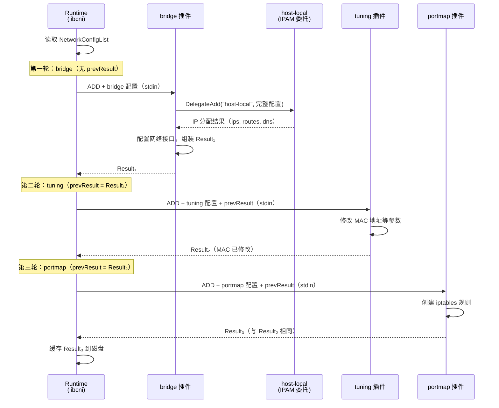

CNI 的核心设计哲学是"小而专"——每个插件只负责一件事情（bridge 创建网桥、portmap 配置端口映射、host-local 管理地址分配）。要让多个独立插件协同完成一次完整的容器网络配置，就需要两套关键的编排机制：**链式执行**（Plugin Chaining）由运行时（runtime）驱动，按序调用多个插件并传递中间结果；**委托**（Delegation）由插件自身发起，将特定子任务（如 IPAM）转交给另一个专用插件完成。本文将深入解析这两套机制在规范层面的定义与 libcni 中的具体实现。

Sources: [SPEC.md](SPEC.md#L86-L94), [libcni/api.go](libcni/api.go#L15-L38)

## 两种编排机制的定位

在进入细节之前，先明确链式执行与委托的边界——它们发生在不同的层级、由不同的角色触发：

| 维度 | 链式执行（Plugin Chaining） | 委托（Delegation） |
|---|---|---|
| **发起方** | 容器运行时（如 containerd） | 插件自身（如 bridge 插件） |
| **触发层** | libcni 的 `CNIConfig` | `pkg/invoke/delegate.go` |
| **执行关系** | 串行，插件之间通过 `prevResult` 传递状态 | 嵌套，父插件在执行过程中调用子插件 |
| **配置粒度** | 每个链式插件有独立的 plugin configuration | 被委托插件接收**完整的**网络配置 |
| **典型场景** | bridge → tuning → portmap | bridge 委托 host-local 进行 IP 分配 |
| **错误策略** | ADD 时失败则中止；GC 时收集所有错误继续 | ADD 失败时父插件应执行 DEL 回滚 |

这两种机制可以组合使用：在链式执行的过程中，某个链式插件内部可能再通过委托机制调用 IPAM 插件。例如规范附录中的示例——`bridge` 插件在链式 ADD 的第一步被调用时，内部委托 `host-local` 分配 IP 地址，然后将分配结果组装到自己的返回值中，传递给链中的下一个插件 `tuning`。

Sources: [SPEC.md](SPEC.md#L406-L410), [SPEC.md](SPEC.md#L535-L563)

## 链式执行：从配置列表到有序调用

### 配置结构：NetworkConfigList

链式执行的起点是 `NetworkConfigList`，它将一个网络名称下所有需要执行的插件编排为一个有序列表。在 libcni 中，这个结构定义如下：

```go
type NetworkConfigList struct {
    Name                   string
    CNIVersion             string
    DisableCheck           bool
    DisableGC              bool
    LoadOnlyInlinedPlugins bool
    Plugins                []*PluginConfig
    Bytes                  []byte
}
```

其中 `Plugins` 切片保存了按配置文件中声明顺序排列的所有插件配置。`DisableCheck` 和 `DisableGC` 允许管理员在特定网络上跳过 CHECK 和 GC 操作。`Bytes` 保存了原始 JSON 字节，用于缓存持久化。当配置文件被加载时（通过 `NetworkConfFromBytes`），每个 `plugins` 数组中的 JSON 对象被独立反序列化为 `PluginConfig`，并追加到列表中。如果 `LoadOnlyInlinedPlugins` 为 `false`（默认），libcni 还会从配置文件所在目录的 `networkName/*.conf` 路径加载额外的插件配置并追加到列表末尾。

Sources: [libcni/api.go](libcni/api.go#L79-L87), [libcni/conf.go](libcni/conf.go#L200-L272)

### prevResult 的传递机制

链式执行的核心纽带是 **prevResult**——前一个插件的执行结果被注入到下一个插件的输入配置中。这个机制通过 `buildOneConfig` 函数实现：

```go
func buildOneConfig(name, cniVersion string, orig *PluginConfig,
    prevResult types.Result, rt *RuntimeConf) (*PluginConfig, error) {
    inject := map[string]interface{}{
        "name":       name,
        "cniVersion": cniVersion,
    }
    if prevResult != nil {
        inject["prevResult"] = prevResult
    }
    orig, err := InjectConf(orig, inject)
    // ... 注入 runtimeConfig（capability args）
}
```

`InjectConf` 的实现策略是：将原始配置 JSON 反序列化为 `map[string]interface{}`，然后用新的键值覆盖（包括 `name`、`cniVersion` 和 `prevResult`），最后重新序列化。这确保了每个插件收到的配置都包含统一的网络名称、CNI 版本，以及前一个插件的完整执行结果。值得注意的是，对于第一个插件，`prevResult` 为 `nil`，不会被注入。

Sources: [libcni/api.go](libcni/api.go#L155-L177), [libcni/conf.go](libcni/conf.go#L391-L417)

### ADD 操作：顺序执行，逐级传递

ADD 操作是链式执行最典型的流程。`AddNetworkList` 遍历 `Plugins` 列表，依次调用每个插件，并将前一个插件的返回值作为下一个插件的 `prevResult`：

```go
func (c *CNIConfig) AddNetworkList(ctx context.Context, list *NetworkConfigList,
    rt *RuntimeConf) (types.Result, error) {
    var result types.Result
    for _, net := range list.Plugins {
        result, err = c.addNetwork(ctx, list.Name, list.CNIVersion, net, result, rt)
        if err != nil {
            return nil, fmt.Errorf("plugin %s failed (add): %w", pluginDescription(net.Network), err)
        }
    }
    // 缓存最终结果
    c.cacheAdd(result, list.Bytes, list.Name, rt)
    return result, nil
}
```

关键行为：**正向遍历**（第一个到最后一个）、**任一失败即中止**、最终结果被持久化到缓存文件。在每次 `addNetwork` 调用内部，会先通过 `exec.FindInPath` 查找插件二进制文件，然后通过 `buildOneConfig` 构建包含 `prevResult` 的输入配置，最后调用 `invoke.ExecPluginWithResult` 执行插件并解析其 stdout 输出为 `types.Result`。

Sources: [libcni/api.go](libcni/api.go#L514-L530), [libcni/api.go](libcni/api.go#L490-L512)

### DEL 操作：逆序执行，共享缓存结果

删除操作遵循与 ADD 相反的遍历顺序，这是设计上的必然——最后添加的"层"应该最先被清理：

```go
for i := len(list.Plugins) - 1; i >= 0; i-- {
    net := list.Plugins[i]
    c.delNetwork(ctx, list.Name, list.CNIVersion, net, cachedResult, rt)
}
```

与 ADD 的一个关键差异：DEL 操作中所有插件共享**同一个** `cachedResult`——即 ADD 操作最终缓存的完整结果。这确保了每个插件在清理时都能看到完整的网络状态，而非仅仅前一个 DEL 的中间状态。如果 CNI 版本 ≥ 0.4.0，`cachedResult` 从缓存文件中读取；否则为 `nil`。DEL 完成后，缓存文件被删除。

Sources: [libcni/api.go](libcni/api.go#L589-L613)

### CHECK 操作：顺序校验，共享缓存结果

CHECK 操作用于验证当前容器网络状态是否与预期一致。它同样正向遍历所有插件，但与 ADD 不同的是，所有插件都接收**缓存的最终 ADD 结果**作为 `prevResult`：

```go
for _, net := range list.Plugins {
    c.checkNetwork(ctx, list.Name, list.CNIVersion, net, cachedResult, rt)
}
```

CHECK 仅在 CNI 版本 ≥ 0.4.0 时可用，且如果 `DisableCheck` 为 `true`，则直接返回成功。每个插件需要对照 `prevResult` 检查自己创建的资源（接口、地址、路由）是否仍然存在且状态正确。

Sources: [libcni/api.go](libcni/api.go#L547-L572)

### GC 操作：顺序执行，收集所有错误

垃圾回收与上述操作的不同之处在于：它不绑定到特定容器附件，因此不使用 `prevResult`；且即使某个插件返回错误，也**继续执行后续插件**，最终通过 `errors.Join` 汇总所有错误：

```go
for _, plugin := range list.Plugins {
    if err := c.gcNetwork(ctx, pluginConfig); err != nil {
        errs = append(errs, ...)
    }
}
return errors.Join(errs...)
```

GC 操作需要 CNI 版本 ≥ 1.1.0，且会注入 `cni.dev/valid-attachments` 字段，告诉插件哪些附件仍然有效。

Sources: [libcni/api.go](libcni/api.go#L767-L842)

### 链式执行生命周期总览

下面的流程图展示了 ADD、CHECK、DEL 三种操作中 prevResult 的传递路径：

```mermaid
flowchart TB
    subgraph Legend
        direction LR
        L1["🟦 正向遍历<br/>（ADD / CHECK）"]
        L2["🟥 逆向遍历<br/>（DEL）"]
    end

    subgraph ADD["ADD 操作 — 正向遍历"]
        A1["bridge 插件<br/>无 prevResult"] -->|Result₁| A2["tuning 插件<br/>prevResult = Result₁"]
        A2 -->|Result₂| A3["portmap 插件<br/>prevResult = Result₂"]
        A3 -->|Result₃| AC["缓存 Result₃"]
    end

    subgraph CHECK["CHECK 操作 — 正向遍历"]
        C0["读取缓存 Result₃"]
        C0 --> C1["bridge 插件<br/>prevResult = Result₃"]
        C1 --> C2["tuning 插件<br/>prevResult = Result₃"]
        C2 --> C3["portmap 插件<br/>prevResult = Result₃"]
    end

    subgraph DEL["DEL 操作 — 逆向遍历"]
        D0["读取缓存 Result₃"]
        D0 --> D1["portmap 插件<br/>prevResult = Result₃"]
        D1 --> D2["tuning 插件<br/>prevResult = Result₃"]
        D2 --> D3["bridge 插件<br/>prevResult = Result₃"]
        D3 --> DC["删除缓存"]
    end
```



Sources: [SPEC.md](SPEC.md#L435-L457), [libcni/api.go](libcni/api.go#L514-L613)

## 委托机制：插件间的子任务转交

### 为什么需要委托

链式执行解决了"多个插件按序编排"的问题，但某些操作天然不能作为独立的链式插件存在。最典型的场景就是 **IPAM（IP 地址管理）**——bridge 插件在创建网络接口后需要分配 IP 地址，这个操作必须在 bridge 插件的执行上下文中完成，而不是作为一个独立的链式步骤。委托机制允许插件在自身执行过程中调用另一个插件来完成特定子任务。

Sources: [SPEC.md](SPEC.md#L535-L544)

### DelegateArgs：环境变量继承与覆盖

委托调用的一个核心设计原则是**环境变量继承**。`DelegateArgs` 结构体实现了 `CNIArgs` 接口，它的 `AsEnv()` 方法继承当前进程的所有环境变量，然后覆盖 `CNI_COMMAND`：

```go
type DelegateArgs struct {
    Command string
}

func (d *DelegateArgs) AsEnv() []string {
    env := os.Environ()
    env = append(env, "CNI_COMMAND="+d.Command)
    return dedupEnv(env)
}
```

这意味着 `CNI_CONTAINERID`、`CNI_NETNS`、`CNI_IFNAME`、`CNI_PATH` 等关键环境变量会自动从父插件进程继承。而 `CNI_COMMAND` 被强制覆盖为委托指定的操作（如 `"ADD"`、`"DEL"`），即使父插件当前正在执行其他操作——例如，当运行时调用 `CNI_COMMAND=CHECK` 时，插件内部的委托调用仍然会使用 `DelegateCheck` 传递 `"CHECK"` 给被委托插件。测试用例也验证了这一点：当进程环境中的 `CNI_COMMAND` 为 `"NOPE"` 时，`DelegateAdd` 仍然能正确地以 `"ADD"` 命令调用被委托插件，且不会修改原始进程环境。

Sources: [pkg/invoke/args.go](pkg/invoke/args.go#L87-L105), [pkg/invoke/delegate_test.go](pkg/invoke/delegate_test.go#L103-L121)

### 委托的五个操作

`delegate.go` 为每个 CNI 操作提供了对应的委托函数：

| 函数 | 操作 | 是否返回 Result | 使用场景 |
|---|---|---|---|
| `DelegateAdd` | ADD | ✅ | IPAM 分配 IP 地址 |
| `DelegateCheck` | CHECK | ❌ | 验证 IPAM 分配状态 |
| `DelegateDel` | DEL | ❌ | 释放 IPAM 分配的地址 |
| `DelegateStatus` | STATUS | ❌ | 检查 IPAM 插件可用性 |
| `DelegateGC` | GC | ❌ | 清理 IPAM 中的过期分配 |

所有委托函数都遵循相同的模式：先通过 `delegateCommon` 在 `CNI_PATH` 中查找被委托插件的二进制文件，然后调用对应的执行函数。以 `DelegateAdd` 为例：

```go
func DelegateAdd(ctx context.Context, delegatePlugin string, netconf []byte, exec Exec) (types.Result, error) {
    pluginPath, realExec, err := delegateCommon(delegatePlugin, exec)
    if err != nil {
        return nil, err
    }
    return ExecPluginWithResult(ctx, pluginPath, netconf, delegateArgs("ADD"), realExec)
}
```

`delegateCommon` 从 `CNI_PATH` 环境变量解析搜索路径列表，然后调用 `exec.FindInPath` 在这些路径中查找匹配的可执行文件。

Sources: [pkg/invoke/delegate.go](pkg/invoke/delegate.go#L25-L89)

### 委托插件接收完整配置

一个容易忽略但至关重要的规范要求：**被委托插件接收的是完整的网络配置 JSON，而非其所属的子段**。例如，当 bridge 插件委托 `host-local` IPAM 插件时，传递给 `host-local` 的 stdin 数据是 bridge 插件收到的完整配置（包含 `type: "bridge"`、`bridge: "cni0"` 等字段），而不是仅传递 `ipam` 段。这允许 IPAM 插件根据整体网络上下文做出更智能的决策。

Sources: [SPEC.md](SPEC.md#L546-L553)

### 委托的错误处理：ADD 失败时的回滚

规范对委托的 ADD 操作有严格的错误处理要求：如果一个插件在 ADD 时委托了另一个插件且委托失败，父插件**必须**在被委托插件上执行 DEL 操作后再返回错误。这防止了 IP 地址等资源的泄漏。对于 CHECK、DEL、GC 操作，如果任何被委托插件返回错误，父插件也应返回错误。

Sources: [SPEC.md](SPEC.md#L554-L563)

## 插件查找：连接配置与二进制

无论是链式执行还是委托，都需要将配置中的 `type` 字段映射到磁盘上的可执行文件。这个查找逻辑在 `FindInPath` 中实现：

```go
func FindInPath(plugin string, paths []string) (string, error) {
    if plugin == "" {
        return "", fmt.Errorf("no plugin name provided")
    }
    for _, path := range paths {
        for _, fe := range ExecutableFileExtensions {
            fullpath := filepath.Join(path, plugin) + fe
            if fi, err := os.Stat(fullpath); err == nil && fi.Mode().IsRegular() {
                return fullpath, nil
            }
        }
    }
    return "", fmt.Errorf("failed to find plugin %q in path %s", plugin, paths)
}
```

查找过程遍历 `CNI_PATH` 中的每个目录，对每个目录尝试附加平台特定的可执行文件扩展名（如 Windows 上的 `.exe`），返回第一个找到的匹配项。这个函数被两个路径共同使用：链式执行中 `CNIConfig.addNetwork` 通过 `c.exec.FindInPath` 调用，委托中 `delegateCommon` 通过 `exec.FindInPath` 调用。

Sources: [pkg/invoke/find.go](pkg/invoke/find.go#L25-L48)

## 执行引擎：RawExec 与 DefaultExec

插件的最终执行由 `RawExec` 完成——它通过 `os/exec` 启动子进程，将配置 JSON 通过 stdin 传递，从 stdout 收集结果：

```go
func (e *RawExec) ExecPlugin(ctx context.Context, pluginPath string,
    stdinData []byte, environ []string) ([]byte, error) {
    c := exec.CommandContext(ctx, pluginPath)
    c.Env = environ
    c.Stdin = bytes.NewBuffer(stdinData)
    // ... 执行并收集 stdout/stderr
}
```

一个值得注意的容错机制：如果插件返回 `"text file busy"` 错误（通常发生在插件二进制正在被更新时），`RawExec` 会重试最多 5 次，每次间隔 1 秒。`DefaultExec` 在 `RawExec` 的基础上增加了版本解码能力，用于处理 VERSION 命令的响应。

Sources: [pkg/invoke/raw_exec.go](pkg/invoke/raw_exec.go#L34-L70), [pkg/invoke/exec.go](pkg/invoke/exec.go#L175-L187)

## 两种机制的协作全景

下面的序列图展示了一个完整的 ADD 操作中链式执行与委托如何协同工作。以 bridge → tuning → portmap 三插件链为例，其中 bridge 内部委托 host-local 进行 IP 分配：



这个全景清晰地展示了两种机制的分界线：**运行时驱动链式遍历，插件内部驱动委托调用**。从 Runtime 的视角看，它只看到了三次串行的插件调用；从 bridge 插件的视角看，它内部有一次对 host-local 的委托调用，这个调用对 Runtime 完全透明。

Sources: [SPEC.md](SPEC.md#L679-L896), [libcni/api.go](libcni/api.go#L514-L530), [pkg/invoke/delegate.go](pkg/invoke/delegate.go#L39-L49)

## 延伸阅读

- 链式执行中的 `prevResult` 涉及 Result 类型的多版本兼容转换，详见 [结果类型（Result Types）与版本兼容转换](8-jie-guo-lei-xing-result-types-yu-ban-ben-jian-rong-zhuan-huan)。
- 完整的插件执行引擎（查找、调用、结果处理）在 [插件执行引擎：查找、调用与结果处理](12-cha-jian-zhi-xing-yin-qing-cha-zhao-diao-yong-yu-jie-guo-chu-li) 中有更深入的分析。
- 如果你想在自己的插件中集成 IPAM 委托，请参考 [插件委托调用：IPAM 及其他委托插件集成](20-cha-jian-wei-tuo-diao-yong-ipam-ji-qi-ta-wei-tuo-cha-jian-ji-cheng)。
- 五种操作的协议细节在 [执行协议：ADD、DEL、CHECK、GC、STATUS 五大操作](6-zhi-xing-xie-yi-add-del-check-gc-status-wu-da-cao-zuo) 中有完整说明。