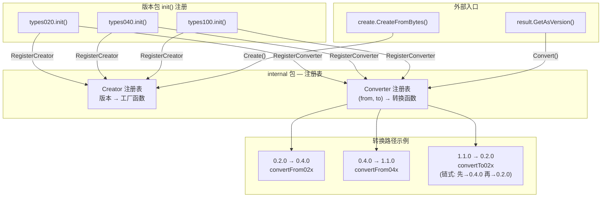
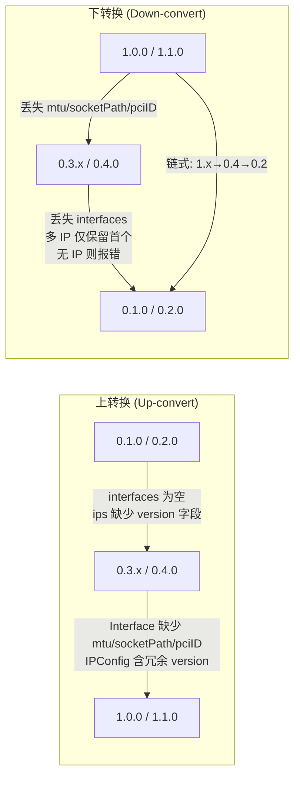
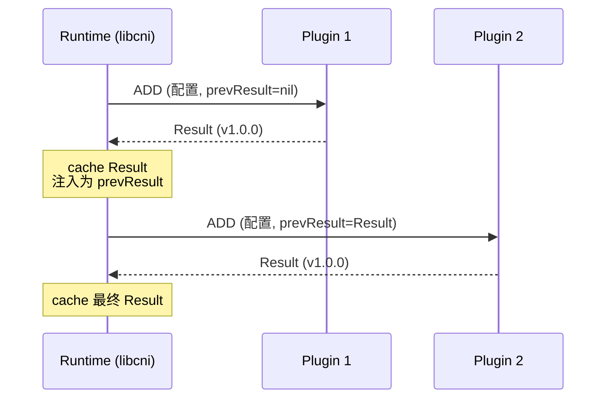

CNI 插件执行 ADD 操作后，必须通过标准 JSON 格式向运行时返回网络配置结果。这个"结果"并非一成不变——随着 CNI 规范从 0.1.0 演进到 1.1.0，Result 的数据结构经历了三次重大重构。CNI 代码库为此构建了一套**多版本类型系统**与**自动转换注册机制**，使不同版本的插件和运行时能够无缝协作。本文将深入剖析 Result 接口的设计哲学、各版本具体类型的结构差异，以及转换引擎的内部实现。

Sources: [types.go](pkg/types/types.go#L128-L142), [types.go](pkg/types/100/types.go#L29-L53)

## Result 接口：版本无关的抽象契约

CNI 的类型系统核心是 `types.Result` 接口。它不绑定任何特定版本的数据结构，而是定义了四个版本无关的行为约束：获取自身版本号（`Version`）、转换到指定版本（`GetAsVersion`）、输出到标准输出（`Print`）和输出到指定 Writer（`PrintTo`）。任何版本的 Result 具体类型都必须实现此接口。

```go
type Result interface {
    Version() string
    GetAsVersion(version string) (Result, error)
    Print() error
    PrintTo(writer io.Writer) error
}
```

`PrintResult(result Result, version string)` 是一个便捷的顶层函数：先将 Result 转换为请求版本，再调用 `Print()` 输出。这是插件在 `cmdAdd` 中最常用的输出路径——插件内部始终使用最高版本的数据结构，仅在最终输出时一次性转换为配置要求的版本。

Sources: [types.go](pkg/types/types.go#L128-L150)

## 三代 Result 类型：结构演进对比

CNI 规范定义了三代 Result 数据结构，分别位于 `pkg/types/020`、`pkg/types/040`、`pkg/types/100` 三个子包中。每一代都围绕 IP 地址信息的组织方式进行了根本性重构。

| 维度 | 0.1.0 / 0.2.0 | 0.3.0 / 0.3.1 / 0.4.0 | 1.0.0 / 1.1.0 |
|------|---------------|----------------------|----------------|
| **包路径** | `types020` | `types040` | `types100` |
| **IP 组织** | 按 IP 版本分组（`ip4`/`ip6`） | 扁平列表（`ips[]`） | 扁平列表（`ips[]`） |
| **接口信息** | ❌ 无 | ✅ `interfaces[]` | ✅ `interfaces[]`（扩展字段） |
| **路由信息** | 嵌入 IPConfig 内 | Result 顶层 `routes[]` | Result 顶层 `routes[]` |
| **IP 版本标记** | 隐含（ip4 / ip6 字段） | 显式 `version: "4"/"6"` | 隐含（从地址自动推断） |
| **Interface 关联** | ❌ 无 | `IPConfig.Interface *int` | `IPConfig.Interface *int` |

### 第一代：0.1.0 / 0.2.0 — 按协议栈分组

最早期结构将 IPv4 和 IPv6 配置分离为 `ip4` 和 `ip6` 两个独立字段，路由直接嵌入各自的 `IPConfig` 中。每个 IP 版本只能包含**一个** IP 地址，不支持接口描述。

```json
{
    "cniVersion": "0.2.0",
    "ip4": {
        "ip": "10.1.2.3/24",
        "gateway": "10.1.2.1",
        "routes": [{"dst": "0.0.0.0/0"}]
    },
    "ip6": { ... },
    "dns": { "nameservers": ["8.8.8.8"] }
}
```

Sources: [020/types.go](pkg/types/020/types.go#L102-L141)

### 第二代：0.3.0 — 0.4.0 — 扁平化与接口描述

从 0.3.0 开始，结构发生根本性重构：`ip4`/`ip6` 合并为统一的 `ips[]` 列表，通过 `version` 字段标记 IP 版本；路由提升到 Result 顶层；新增 `interfaces[]` 数组描述网络接口，IPConfig 通过 `interface` 索引关联到具体网卡。

```json
{
    "cniVersion": "0.4.0",
    "interfaces": [{"name": "eth0", "mac": "00:11:22:33:44:55", "sandbox": "/proc/123/ns/net"}],
    "ips": [{"version": "4", "address": "10.1.2.3/24", "gateway": "10.1.2.1", "interface": 0}],
    "routes": [{"dst": "0.0.0.0/0"}],
    "dns": {}
}
```

Sources: [040/types.go](pkg/types/040/types.go#L86-L92), [040/types.go](pkg/types/040/types.go#L220-L253)

### 第三代：1.0.0 / 1.1.0 — 简化与扩展

1.0.0 移除了 `IPConfig` 中冗余的 `version` 字段（IP 版本可从地址本身推断），同时大幅扩展了 `Interface` 结构，新增 `mtu`、`socketPath`、`pciID` 等运维关键字段。1.0.0 和 1.1.0 之间 Result 类型完全相同，仅通过 `CNIVersion` 区分。

```go
// 1.x Interface 结构（相比 0.4.x 新增了 3 个字段）
type Interface struct {
    Name       string `json:"name"`
    Mac        string `json:"mac,omitempty"`
    Mtu        int    `json:"mtu,omitempty"`         // 新增
    Sandbox    string `json:"sandbox,omitempty"`
    SocketPath string `json:"socketPath,omitempty"`  // 新增
    PciID      string `json:"pciID,omitempty"`       // 新增
}
```

Sources: [100/types.go](pkg/types/100/types.go#L89-L96), [100/types.go](pkg/types/100/types.go#L269-L277), [100/types.go](pkg/types/100/types.go#L297-L303)

## 转换引擎：注册与路由机制

CNI 的版本转换不是硬编码的 if-else 链，而是一套精巧的**函数注册表 + 路由查找**机制，实现在 `pkg/types/internal` 包中。这个包导出了两个核心能力：**Creator**（从 JSON 字节流创建 Result）和 **Converter**（在版本间转换 Result）。

### 架构全景



Sources: [internal/convert.go](pkg/types/internal/convert.go#L28-L93), [internal/create.go](pkg/types/internal/create.go#L23-L66), [create/create.go](pkg/types/create/create.go#L28-L59)

### Creator：从 JSON 到 Result 对象

每个版本包在 `init()` 中通过 `RegisterCreator` 注册自己的工厂函数。当收到 JSON 数据和版本号时，`Create()` 函数在注册表中查找匹配的 Creator 并调用对应的工厂函数反序列化。`create.CreateFromBytes()` 更进一步，先从 JSON 中提取 `cniVersion` 字段自动检测版本，再调用对应的 Creator。

```go
// 每个版本包的注册模式
func init() {
    // 注册创建器：指定哪些版本由本包的 NewResult 处理
    convert.RegisterCreator(supportedVersions, NewResult)
}
```

值得注意的是，空版本号（即 CNI 0.1.0 时代的特征）在 `DecodeVersion` 中被默认映射为 `"0.1.0"`，确保无版本声明的旧配置也能正确处理。

Sources: [create/create.go](pkg/types/create/create.go#L30-L59), [020/types.go](pkg/types/020/types.go#L33-L39), [040/types.go](pkg/types/040/types.go#L34-L49), [100/types.go](pkg/types/100/types.go#L35-L53)

### Converter：版本间的双向转换

`RegisterConverter` 接收三个参数：源版本、目标版本列表、转换函数。转换引擎维护一个 `(fromVersion, toVersion)` 到 `ConvertFn` 的映射表。调用 `Convert()` 时，如果源版本和目标版本相同则直接返回；否则查找注册表执行对应的转换函数。

整个转换注册表形成一个完整的**有向图**，覆盖了所有版本对之间的转换路径：

| 源版本 | 目标版本 | 转换函数 | 关键数据变换 |
|--------|---------|---------|------------|
| 0.1.0 | 0.2.0 | `convertFrom010` | 仅更新 CNIVersion 字段 |
| 0.1.0 / 0.2.0 | 0.3.x / 0.4.0 | `convertFrom02x` (040) | `ip4`/`ip6` 拆解为 `ips[]` 列表，路由提取到顶层 |
| 0.3.x / 0.4.0 | 0.1.0 / 0.2.0 | `convertTo02x` (040) | `ips[]` 合并回 `ip4`/`ip6`，仅保留首个 IP，无 IP 则报错 |
| 0.3.x / 0.4.0 | 1.0.0 / 1.1.0 | `convertFrom04x` (100) | 移除 IPConfig 的 `version` 字段，Interface 原样映射 |
| 1.0.0 / 1.1.0 | 0.3.x / 0.4.0 | `convertTo04x` (100) | 从地址推断 IP 版本并填入 `version` 字段 |
| 1.0.0 / 1.1.0 | 0.1.0 / 0.2.0 | `convertTo02x` (100) | **链式转换**：先→0.4.0 再→0.2.0 |
| 1.0.0 / 1.1.0 | 0.1.0 / 0.2.0 | `convertFrom02x` (100) | **链式转换**：先→0.4.0 再→1.x |

Sources: [internal/convert.go](pkg/types/internal/convert.go#L53-L74), [040/types.go](pkg/types/040/types.go#L102-L192), [100/types.go](pkg/types/100/types.go#L121-L241)

## 转换中的数据损益分析

版本转换并非无损操作。从低版本向高版本转换时，新版本特有的字段会为空；从高版本向低版本转换时，新版本独有数据会**被丢弃**。这是 CNI 版本兼容模型的核心设计决策。



最关键的**数据丢失**发生在降级到 0.2.0 及以下时：

- **多 IP 丢失**：0.2.0 每个 IP 版本只支持一个地址，`convertTo02x` 仅取每个版本的第一个 IP
- **接口信息丢失**：`interfaces[]` 在 0.2.0 中不存在，所有接口描述被丢弃
- **无 IP 则失败**：如果 0.4.0+ 的结果中没有任何 IP 地址，降级到 0.2.0 会返回 `"cannot convert: no valid IP addresses"` 错误
- **Interface 扩展字段丢失**：1.x 的 `mtu`、`socketPath`、`pciID` 在降级到 0.4.0 时被忽略

Sources: [040/types.go](pkg/types/040/types.go#L145-L192), [100/types.go](pkg/types/100/types.go#L186-L228), [spec-upgrades.md](Documentation/spec-upgrades.md#L265-L276)

## 运行时集成：插件链中的 Result 流转

在 CNI 的插件链执行模型中，Result 类型承担着**插件间传递状态**的核心角色。`libcni` 的 `AddNetworkList` 方法依次调用链中每个插件，前一个插件的 Result 作为后一个插件的 `prevResult` 注入到配置中。



关键实现细节在于 `buildOneConfig` 函数：它将前一个插件的 `types.Result` 接口直接序列化为 JSON 的 `prevResult` 字段。由于 `types.Result` 的 `MarshalJSON` 会按照其内部 `CNIVersion` 对应的格式输出，后续插件接收到的 `prevResult` 版本始终与配置的 `cniVersion` 一致——这得益于 `getCachedResult` 中的显式版本转换 `result.GetAsVersion(cniVersion)`。

Sources: [api.go](libcni/api.go#L155-L170), [api.go](libcni/api.go#L514-L530), [api.go](libcni/api.go#L354-L363)

## 版本修复：fixupResultVersion

插件输出的 Result 理论上应与配置版本一致，但实践中存在旧插件不输出 `cniVersion` 字段的情况。`invoke` 包的 `fixupResultVersion` 函数专门处理这一边界情况：如果插件返回的 JSON 中 `cniVersion` 缺失或为空，则自动用配置的版本号填充。这确保了后续 `create.Create()` 能正确路由到对应的 Creator。

Sources: [exec.go](pkg/invoke/exec.go#L37-L78), [exec.go](pkg/invoke/exec.go#L121-L137)

## 实战指南：插件开发者的 Result 使用模式

对于 CNI 插件开发者，推荐的使用模式非常明确——**内部始终使用最高版本类型，仅在输出时转换**：

```go
import (
    current "github.com/containernetworking/cni/pkg/types/100"
    "github.com/containernetworking/cni/pkg/types"
)

func cmdAdd(args *skel.CmdArgs) error {
    // ... 执行网络配置逻辑 ...

    // 内部始终构建最新版本 Result
    result := &current.Result{
        CNIVersion: "1.1.0",
        Interfaces: []*current.Interface{...},
        IPs:        []*current.IPConfig{...},
        Routes:     []*types.Route{...},
        DNS:        types.DNS{...},
    }

    // 自动转换到配置要求的版本并输出
    return types.PrintResult(result, cniVersion)
}
```

对于需要处理 `prevResult` 的插件，使用 `current.NewResultFromResult()` 将任意版本的 Result 上转换为最新版本后统一处理。

Sources: [spec-upgrades.md](Documentation/spec-upgrades.md#L140-L174), [100/types.go](pkg/types/100/types.go#L81-L87)

## 延伸阅读

- 要了解 Result 类型在整个类型系统中的位置和完整定义，参阅 [类型系统：多版本类型定义与自动转换](14-lei-xing-xi-tong-duo-ban-ben-lei-xing-ding-yi-yu-zi-dong-zhuan-huan)
- 要理解版本协商如何决定使用哪个 Result 版本，参阅 [版本协商与兼容性校验机制](15-ban-ben-xie-shang-yu-jian-rong-xing-xiao-yan-ji-zhi)
- 要了解 Result 在插件链中的完整流转过程，参阅 [插件链式执行与委托（Delegation）机制](7-cha-jian-lian-shi-zhi-xing-yu-wei-tuo-delegation-ji-zhi)
- 要了解 Result 如何通过缓存持久化，参阅 [缓存机制：Result 持久化与 Attachment 追踪](17-huan-cun-ji-zhi-result-chi-jiu-hua-yu-attachment-zhui-zong)