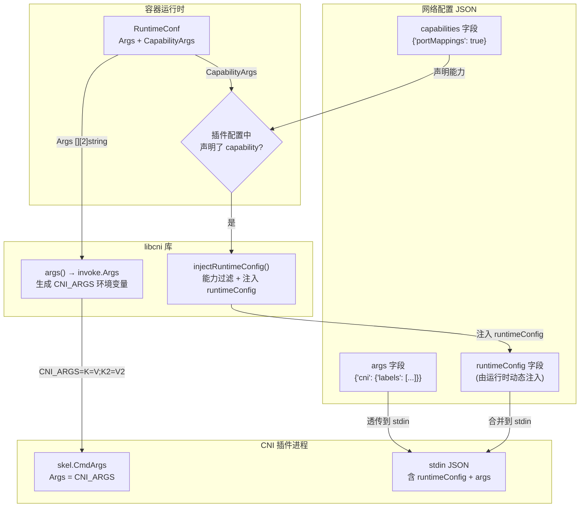
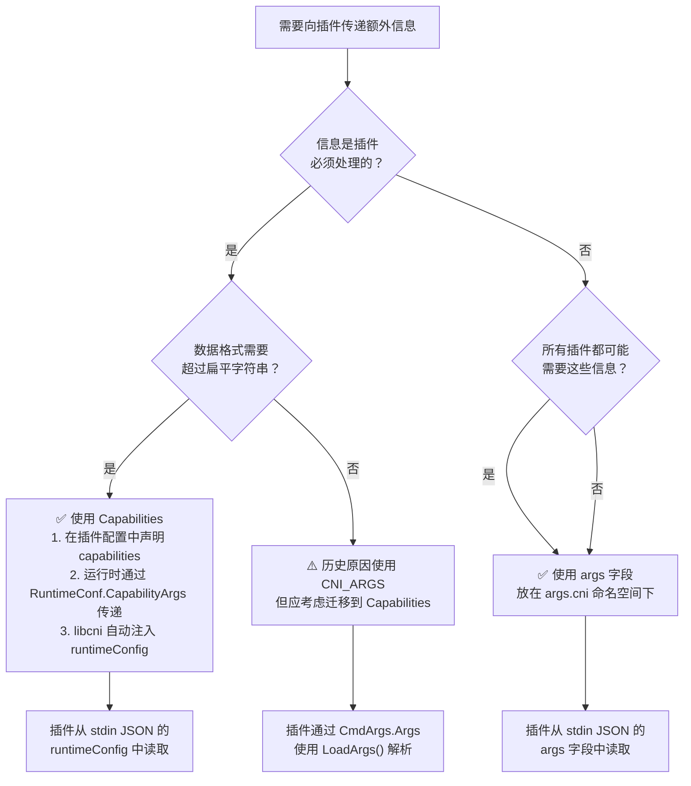

CNI 规范定义了三种向插件传递额外信息的扩展机制——**Capabilities（能力声明）**、**args（配置参数）** 和 **CNI_ARGS（环境变量参数）**。它们分别服务于不同的使用场景：Capabilities 实现结构化的、类型安全的动态参数注入；`args` 承载可选的结构化元数据；而 `CNI_ARGS` 则是早期规范遗留下来的扁平键值对机制，目前已被标记为**弃用**。理解这三者的设计意图与适用边界，是编写健壮的 CNI 插件和正确集成 CNI 运行时的关键前提。

Sources: [CONVENTIONS.md](CONVENTIONS.md#L1-L8), [SPEC.md](SPEC.md#L424-L431)

## 三种扩展机制的全景定位

在深入每一项机制之前，先从整体架构视角理解这三种信息传递通道在 CNI 执行流程中的位置与职责分工。下图展示了运行时（Runtime）如何通过不同路径将扩展信息传递到插件（Plugin）。



这张架构图揭示了三条独立的信息通道：**Capabilities 通道**经过 libcni 的能力过滤后注入到 JSON 配置的 `runtimeConfig` 字段中；**args 通道**作为网络配置的一部分直接透传到 stdin；**CNI_ARGS 通道**则作为环境变量传递给插件。接下来逐一剖析每条通道的内部机制。

Sources: [libcni/api.go](libcni/api.go#L155-L212), [pkg/invoke/args.go](pkg/invoke/args.go#L43-L74), [SPEC.md](SPEC.md#L487-L533)

## Capabilities：结构化的动态参数注入

**Capabilities（能力声明）** 是 CNI 扩展机制中最精密、也是推荐优先使用的方式。其核心设计思想是**声明-注入分离**：插件在静态配置中声明自己支持哪些能力，运行时在执行时根据匹配结果动态注入对应的运行时配置。这种模式确保了类型安全和语义明确——插件不会收到它无法处理的参数，运行时也不会盲目广播所有数据。

### 声明阶段：插件配置中的 capabilities

在网络配置的插件配置对象中，`capabilities` 是一个字典类型的可选字段，键为能力名称，值为布尔值表示该能力是否启用。这个字段的消费者不是插件本身，而是 **libcni 运行时库**——它通过这个字段判断哪些动态参数应该被注入到该插件的配置中。例如下面的 `portmap` 插件声明支持 `portMappings` 能力，`tuning` 插件声明支持 `mac` 能力：

```json
{
  "type": "portmap",
  "capabilities": {"portMappings": true}
}
```

```json
{
  "type": "tuning",
  "capabilities": {"mac": true}
}
```

在代码层面，`capabilities` 被解析为 `types.PluginConf` 结构体的 `Capabilities` 字段（`map[string]bool` 类型），并在 `ValidateNetworkList` 中被收集为该网络配置所支持的能力列表。

Sources: [SPEC.md](SPEC.md#L126-L127), [SPEC.md](SPEC.md#L507-L533), [pkg/types/types.go](pkg/types/types.go#L64-L69), [libcni/api.go](libcni/api.go#L684-L713)

### 注入阶段：injectRuntimeConfig 的能力过滤机制

当运行时调用 `AddNetworkList`、`CheckNetworkList` 或 `DelNetworkList` 时，libcni 内部的 `buildOneConfig` 函数会触发 `injectRuntimeConfig`，这是 Capabilities 机制的核心枢纽。其过滤逻辑如下：

1. 遍历插件配置中声明的每一个 capability（`orig.Network.Capabilities`）
2. 检查该 capability 是否被启用（布尔值为 `true`）
3. 在运行时的 `rt.CapabilityArgs` 映射表中查找对应的能力名
4. 匹配成功时，将 `CapabilityArgs` 中该键对应的值写入 `runtimeConfig` 字典
5. 通过 `InjectConf` 将组装好的 `runtimeConfig` 合并到最终传给插件的 JSON 中

```go
// injectRuntimeConfig 核心过滤逻辑
rc := make(map[string]interface{})
for capability, supported := range orig.Network.Capabilities {
    if !supported {
        continue
    }
    if data, ok := rt.CapabilityArgs[capability]; ok {
        rc[capability] = data
    }
}
```

这意味着**只有同时满足两个条件——插件声明了能力且运行时提供了对应数据——参数才会被注入**。这种双重门控机制既保护了插件（不会意外收到无法处理的配置），也保护了运行时（不需要关心特定插件的能力集）。

Sources: [libcni/api.go](libcni/api.go#L179-L212)

### 传递阶段：插件接收 runtimeConfig

经过 `injectRuntimeConfig` 过滤后，插件通过 stdin 接收到的 JSON 配置中会包含 `runtimeConfig` 字段。以规范附录中的 `tuning` 插件为例，当运行时提供了 `mac` 能力参数时，插件收到的配置如下：

```json
{
  "cniVersion": "1.1.0",
  "name": "dbnet",
  "type": "tuning",
  "sysctl": {
    "net.core.somaxconn": "500"
  },
  "runtimeConfig": {
    "mac": "00:11:22:33:44:66"
  },
  "prevResult": { ... }
}
```

注意规范规定，在执行时 `capabilities` 字段必须从请求配置中移除，替换为 `runtimeConfig`——这避免了信息冗余，同时明确了"声明"与"数据"的职责边界。

Sources: [SPEC.md](SPEC.md#L497-L500), [SPEC.md](SPEC.md#L764-L810)

### 已注册的 Well-known Capabilities

CNI 社区在 [CONVENTIONS.md](CONVENTIONS.md) 中维护了一系列标准化的能力约定。这些约定让不同运行时和插件之间的互操作成为可能。下表汇总了当前所有已注册的 well-known capabilities：

| 能力名称 | 用途 | 数据格式 | 典型消费者 |
|---|---|---|---|
| `portMappings` | 主机端口到容器端口的映射 | `[{hostPort, containerPort, protocol}]` | portmap 插件 |
| `ipRanges` | 动态配置 IP 地址分配范围 | 与 host-local 的 `ranges` 格式一致 | IPAM 插件 |
| `bandwidth` | 接口带宽限制 | `{ingressRate, ingressBurst, egressRate, egressBurst}`（单位：bits/s、bits） | bandwidth 插件 |
| `dns` | 运行时动态 DNS 配置 | `{searches, servers, options}` | DNS 相关插件 |
| `ips` | 运行时直接分配 IP 地址 | `["192.168.0.1", "10.10.0.1/24"]` | 网络插件 |
| `mac` | 动态分配 MAC 地址 | `"c2:11:22:33:44:55"` | tuning 插件 |
| `infinibandGUID` | InfiniBand GUID 分配 | `"c2:11:22:33:44:55:66:77"` | ib-sriov-cni |
| `deviceID` | 设备标识符，用于设备相关配置 | `"0000:04:00.5"` | host-device 插件 |
| `aliases` | IP 地址的名称别名映射 | `["my-container", "primary-db"]` | alias 插件 |
| `cgroupPath` | Pod 的 cgroup 路径 | `"/kubelet.slice/..."` | host-device 等插件 |

这些约定并非由规范强制，而是由社区共识驱动。如果你正在开发具有共享功能的插件，应优先考虑遵循这些约定并提交 PR 扩展此文档，以确保跨运行时兼容性。

Sources: [CONVENTIONS.md](CONVENTIONS.md#L57-L69)

## args：可选的结构化元数据

**`args`** 是网络配置 JSON 中的一个保留字段，用于向插件传递**可选的、结构化的元数据**。与 Capabilities 不同，`args` 不需要插件预先声明——运行时会将 `args` 原样放入配置 JSON，所有在链中的插件都能看到这些数据，但**不理解这些数据的插件应当忽略它们**。

### 设计定位与使用原则

`args` 在配置中的定位是"可选元数据"。运行时放置数据时不应期望插件必须理解或消费这些数据，也不应期望因插件未消费而收到错误。这一设计使得 `args` 特别适合以下场景：

- **信息是可选的**——插件可以安全地忽略不理解的数据
- **数据是广播给所有插件的**——不针对特定插件
- **数据具有结构化格式**——超越了 `CNI_ARGS` 的扁平字符串限制

社区约定所有 `args` 下的键都使用 `cni` 命名空间，以避免与现有键冲突：

```json
{
  "cniVersion": "1.1.0",
  "name": "net",
  "args": {
    "cni": {
      "labels": [{"key": "app", "value": "myapp"}]
    }
  }
}
```

在代码层面，`args` 字段是规范中的**保留键**（Reserved keys），由运行时在执行时生成。它不属于 `types.PluginConf` 结构体的强类型字段，而是作为 JSON 原始字节的一部分被传递——`InjectConf` 函数在构建最终配置时会保留这些未知字段。

Sources: [CONVENTIONS.md](CONVENTIONS.md#L71-L103), [SPEC.md](SPEC.md#L129-L133), [libcni/conf.go](libcni/conf.go#L391-L417)

### 已注册的 args 约定

| 区域 | 用途 | 数据格式 |
|---|---|---|
| `labels` | 传递 key=value 标签到插件 | `[{key, value}]` |
| `ips` | 请求特定 IP 地址 | `["10.2.2.42/24", "2001:db8::5"]` |

值得注意的是，`ips` 约定同时存在于 `args` 和 `CNI_ARGS` 两种通道中。按照规范要求，如果运行时通过 `args` 传递了 `ips`，并且插件理解 `args` 格式，插件**必须忽略 `CNI_ARGS` 中的 `IP` 字段**——这是从旧通道向新通道迁移的过渡策略。

Sources: [CONVENTIONS.md](CONVENTIONS.md#L100-L103)

## CNI_ARGS：扁平键值对环境变量（已弃用）

**`CNI_ARGS`** 是 CNI 规范最早期引入的扩展机制，通过环境变量向插件传递额外的键值对参数。其格式为分号分隔的字母数字键值对，例如 `FOO=BAR;ABC=123`。

### 传递路径与代码实现

CNI_ARGS 的传递路径贯穿整个调用栈：

1. **运行时侧**：`RuntimeConf.Args`（类型为 `[][2]string`）被 libcni 的 `args()` 方法封装为 `invoke.Args.PluginArgs`
2. **序列化**：`stringify()` 函数将键值对数组拼接为 `K=V;K2=V2` 格式的字符串
3. **环境注入**：`AsEnv()` 方法将序列化后的字符串作为 `CNI_ARGS` 环境变量注入到插件进程
4. **插件侧**：`skel.CmdArgs.Args` 字段接收该字符串，插件可使用 `LoadArgs()` 将其解析回结构化数据

```go
// args() 构建 invoke.Args
func (c *CNIConfig) args(action string, rt *RuntimeConf) *invoke.Args {
    return &invoke.Args{
        Command:     action,
        ContainerID: rt.ContainerID,
        NetNS:       rt.NetNS,
        PluginArgs:  rt.Args,          // ← [][2]string
        IfName:      rt.IfName,
        Path:        strings.Join(c.Path, string(os.PathListSeparator)),
    }
}
```

Sources: [libcni/api.go](libcni/api.go#L891-L900), [pkg/invoke/args.go](pkg/invoke/args.go#L56-L74), [pkg/skel/skel.go](pkg/skel/skel.go#L37-L45)

### LoadArgs 解析机制与 CommonArgs

插件端通过 `types.LoadArgs()` 函数解析 CNI_ARGS。该函数接受一个形如 `"K=V;K2=V2"` 的字符串和一个实现了 `encoding.TextUnmarshaler` 接口的结构体指针。其工作原理是通过 Go 的反射机制，将每个键映射到结构体对应名称的字段，然后调用该字段的 `UnmarshalText` 方法进行类型转换。

`CommonArgs` 是所有 args 结构体必须嵌入的基础类型，其中包含 `IgnoreUnknown` 布尔字段。当 `IgnoreUnknown` 为 `true` 时，`LoadArgs` 会静默忽略无法映射到结构体字段的未知参数；否则，遇到未知参数将返回错误。这为插件提供了一种向前兼容的机制——当运行时传入了新版本规范中新增的参数时，旧版本插件可以通过设置 `IgnoreUnknown=true` 来避免解析失败。

```go
type CommonArgs struct {
    IgnoreUnknown UnmarshallableBool `json:"ignoreunknown,omitempty"`
}
```

Sources: [pkg/types/args.go](pkg/types/args.go#L54-L122)

### 弃用声明与迁移路径

CONVENTIONS.md 明确声明 **`CNI_ARGS` 已被弃用**，应使用 `args` 字段替代。其理由包括：

- **格式限制**：仅支持扁平字符串，无法表达嵌套或复杂数据结构
- **类型安全缺失**：所有值都是字符串，需要手动类型转换
- **全局广播**：所有插件都能收到所有参数，无法做到像 Capabilities 那样的精准投递

迁移策略是渐进式的：对于已同时支持 `args` 和 `CNI_ARGS` 的参数（如 `ips` / `IP`），插件必须优先使用 `args` 中的数据并忽略 `CNI_ARGS` 中的对应字段。

Sources: [CONVENTIONS.md](CONVENTIONS.md#L105-L113)

## 三种机制的对比与选择指南

下表从多个维度对比三种扩展机制，帮助你在实际开发中做出正确选择。

| 维度 | Capabilities / runtimeConfig | args | CNI_ARGS |
|---|---|---|---|
| **传递通道** | stdin JSON → `runtimeConfig` 字段 | stdin JSON → `args` 字段 | 环境变量 `CNI_ARGS` |
| **数据格式** | 任意 JSON 可序列化类型 | 任意 JSON 可序列化类型 | 扁平字符串 `K=V;K2=V2` |
| **是否需要插件声明** | ✅ 需要在配置中声明 `capabilities` | ❌ 不需要 | ❌ 不需要 |
| **投递精准度** | 精准——仅投递给声明了对应能力的插件 | 广播——所有插件都能看到 | 广播——所有插件都能看到 |
| **插件处理策略** | 必须处理或返回错误 | 应忽略不理解的数据 | 应使用 `IgnoreUnknown` |
| **数据类型安全性** | 高——JSON 原生类型 | 高——JSON 原生类型 | 低——均为字符串，需手动转换 |
| **规范状态** | 当前推荐 | 当前推荐 | **已弃用** |
| **适用场景** | 插件必须处理的动态配置 | 可选的结构化元数据 | 仅用于向后兼容 |

### 决策流程图

当你需要向 CNI 插件传递额外信息时，遵循以下决策路径：



Sources: [CONVENTIONS.md](CONVENTIONS.md#L23-L33), [CONVENTIONS.md](CONVENTIONS.md#L71-L79)

## 最佳实践总结

基于对规范文本和代码实现的系统分析，以下是从三个视角给出的实践建议。

### 对插件开发者的建议

**第一，优先支持 well-known capabilities。** 如果你开发的插件实现了与现有约定相同的基础功能（如端口映射、带宽限制），应当遵循 [CONVENTIONS.md](CONVENTIONS.md) 中定义的能力名称和数据格式。这样做可以让你的插件"开箱即用"地与更多运行时集成。如果你发现需要新的共享功能约定，应向 CNI 项目提交 PR 扩展约定文档。

**第二，正确处理 stdin 中的扩展字段。** 在解析 stdin JSON 时，使用 `json.Unmarshal` 配合自定义结构体，嵌入 `types.NetConf`（或 `PluginConf`）作为基础类型来获取 `Capabilities`、`IPAM`、`DNS` 等标准字段，同时保留 `RawPrevResult` 等动态字段。参考 debug 插件的 `NetConf` 结构体设计模式。

**第三，如果必须使用 CNI_ARGS，务必嵌入 `CommonArgs`。** 将 `CommonArgs` 作为你的 args 结构体的匿名字段，并在解析前设置 `IgnoreUnknown=true`（通过在 CNI_ARGS 中传递 `IgnoreUnknown=1`），以避免因运行时传入新参数而导致解析失败。

Sources: [CONVENTIONS.md](CONVENTIONS.md#L11-L13), [plugins/debug/main.go](plugins/debug/main.go#L33-L39), [pkg/types/args.go](pkg/types/args.go#L54-L58)

### 对运行时开发者的建议

**第一，使用 `RuntimeConf` 的两个扩展字段。** 通过 `Args` 字段（`[][2]string`）传递 CNI_ARGS，通过 `CapabilityArgs` 字段（`map[string]interface{}`）传递能力参数。libcni 会自动处理两者的序列化和注入——`Args` 被序列化为 `CNI_ARGS` 环境变量，`CapabilityArgs` 经能力过滤后注入到 `runtimeConfig` JSON 字段。

**第二，尊重能力声明的过滤语义。** 不要在 `CapabilityArgs` 中放入插件未声明的能力——`injectRuntimeConfig` 会自动过滤掉未匹配的项，但依赖这个隐式过滤不是好的实践。应该通过 `ValidateNetworkList` 返回的能力列表来确定当前配置支持哪些能力。

**第三，缓存完整的扩展信息。** `cachedInfo` 结构体会持久化 `CniArgs` 和 `CapabilityArgs`，确保在 `DEL`、`CHECK` 和 `GC` 操作时能够恢复完整的运行时上下文。这对于正确清理资源至关重要。

Sources: [libcni/api.go](libcni/api.go#L50-L68), [libcni/api.go](libcni/api.go#L259-L297), [libcni/api.go](libcni/api.go#L684-L713)

### 对配置管理者的建议

**第一，准确声明插件能力。** 在网络配置的 `capabilities` 字段中，仅为确实支持对应功能的插件设置 `true`。声明了能力但运行时未提供对应数据不会导致错误，但声明了运行时无法提供的能力则可能导致插件因缺少必要参数而出错。

**第二，利用 `args` 传递跨插件元数据。** 如果你需要在所有链中插件间共享信息（如标签、注解），使用 `args.cni` 命名空间。这比 `CNI_ARGS` 更具表达力，且不会与现有的字符串解析逻辑冲突。

**第三，避免使用 `CNI_ARGS` 编写新配置。** 所有新的参数传递需求都应通过 `capabilities` 或 `args` 实现。仅在需要兼容仅支持 `CNI_ARGS` 的旧插件时才使用此通道。

Sources: [CONVENTIONS.md](CONVENTIONS.md#L15-L17), [SPEC.md](SPEC.md#L226-L230)

---

**延伸阅读**：本文聚焦于扩展信息的传递机制。要理解这些机制在完整插件链中的执行时序，请参阅 [执行协议：ADD、DEL、CHECK、GC、STATUS 五大操作](6-zhi-xing-xie-yi-add-del-check-gc-status-wu-da-cao-zuo)。要了解 `runtimeConfig` 注入背后的配置构建流程，请参阅 [libcni 库：运行时集成的完整 API 接口](10-libcni-ku-yun-xing-shi-ji-cheng-de-wan-zheng-api-jie-kou)。要学习如何在自定义插件中解析这些参数，请参阅 [从零开发一个 CNI 插件](18-cong-ling-kai-fa-ge-cni-cha-jian)。