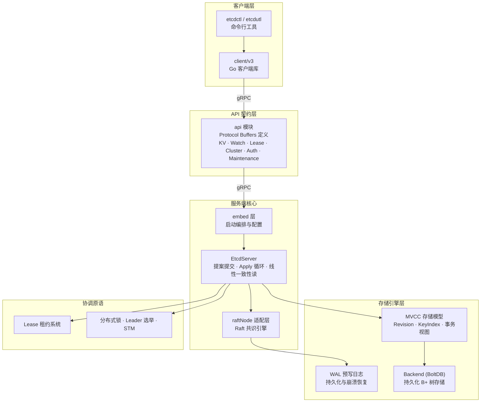

本文档从第一性原理出发，系统性地回答两个核心问题：**etcd 是什么**，以及 **为什么它在现代分布式系统中不可替代**。我们将从 etcd 的本质定位、设计哲学、核心能力、生产实践和生态定位五个维度展开，帮助你建立对 etcd 的全局认知框架。本文是整个知识库的入口，后续章节将逐步深入到源码级别的架构剖析。

Sources: [README.md](README.md#L1-L55), [ADOPTERS.md](ADOPTERS.md#L1-L15)

## etcd 的本质：分布式一致性键值存储

**etcd**（名字源自 "/etc" 目录 + "distributed"）是一个**分布式、可靠的键值存储系统**，专门用于存储分布式系统中最关键的数据。它用 Go 语言编写，基于 **Raft 共识算法** 管理一个高可用的复制日志。etcd 的定位不是一个通用的数据库，而是一个**元数据基础设施**——它存储的是集群配置、服务发现信息、Leader 选举状态、分布式锁等"小而精"的关键数据。

在分布式系统中，存在一类根本性的问题：多个节点如何就某个值达成一致？这就是所谓的**共识问题**。etcd 通过内置 Raft 共识算法，为上层应用提供了一个简单、安全、快速且可靠的答案。当前代码库版本为 `3.7.0-alpha.0`（开发分支），最低兼容集群版本为 `3.0.0`，使用 Go 1.26.2 构建。

Sources: [README.md](README.md#L21-L28), [api/version/version.go](api/version/version.go#L26-L34), [.go-version](.go-version#L1)

## 四大设计哲学

etcd 的设计围绕四个核心原则展开，这四个原则贯穿了整个代码库的每一层设计决策：

| 设计原则 | 含义 | 代码体现 |
|---------|------|---------|
| **Simple（简洁）** | 面向用户的 API 清晰定义，基于 gRPC | 通过 Protocol Buffers 定义 6 大 gRPC 服务（KV、Watch、Lease、Cluster、Maintenance、Auth） |
| **Secure（安全）** | 自动 TLS，可选客户端证书认证 | 内置完整的 TLS/mTLS 支持、JWT/Simple Token 认证体系 |
| **Fast（快速）** | 基准测试 10,000+ 写入/秒 | MVCC 存储引擎 + BoltDB 后端 + gRPC 高性能通信 |
| **Reliable（可靠）** | 基于 Raft 实现真正的分布式一致性 | 内置 `go.etcd.io/raft/v3` 共识库，多数派写入确认 |

这四个原则并非空洞的口号，而是直接影响代码组织的约束。例如，"简洁"原则意味着所有客户端交互都通过一个统一的 gRPC 契约（定义在 [api/etcdserverpb/rpc.proto](api/etcdserverpb/rpc.proto) 中），而不是散落在各处的 REST 端点；"可靠"原则意味着每一次写入操作都必须经过 Raft 日志复制，在多数节点确认后才返回成功。

Sources: [README.md](README.md#L21-L27), [api/etcdserverpb/rpc.proto](api/etcdserverpb/rpc.proto#L33-L96)

## 核心架构概览

在深入各模块细节之前，先建立 etcd 的全局架构心智模型。下图展示了 etcd 从客户端请求到数据持久化的完整分层路径：

**架构分层的核心洞察**：etcd 的代码库严格遵循依赖分离原则。`api` 模块只包含 Protocol Buffers 定义，不依赖任何服务端实现；`client/v3` 只依赖 `api` 模块，保持客户端库的轻量性；`server` 模块作为完整的服务端实现，协调 Raft 共识、MVCC 存储和各种协调原语。这种分层使得客户端可以独立于服务端演进。

Sources: [Documentation/contributor-guide/modules.md](Documentation/contributor-guide/modules.md#L1-L39), [server/embed/etcd.go](server/embed/etcd.go#L69-L99), [server/etcdserver/server.go](server/etcdserver/server.go#L207-L290)

## 六大 gRPC 服务

etcd 的全部客户端能力通过六个 gRPC 服务暴露，这些服务的定义是理解 etcd 功能边界的最佳入口：

| 服务 | 职责 | 典型操作 |
|------|------|---------|
| **KV** | 键值存储的核心读写 | `Range`（范围查询）、`Put`（写入）、`DeleteRange`（范围删除）、`Txn`（事务）、`Compact`（压缩历史） |
| **Watch** | 事件变更推送 | `Watch`（流式监听键或范围的变化事件） |
| **Lease** | 租约生命周期管理 | `LeaseGrant`（创建租约）、`LeaseRevoke`（撤销）、`LeaseKeepAlive`（续约心跳） |
| **Cluster** | 集群成员管理 | `MemberAdd`、`MemberRemove`、`MemberUpdate`、`MemberList`、`MemberPromote` |
| **Maintenance** | 运维管理 | `Alarm`、`Status`、`Defragment`、`Snapshot`、`MoveLeader`、`Downgrade` |
| **Auth** | 认证与权限控制 | `Authenticate`、`UserAdd/Delete`、`RoleAdd/Delete`、`RoleGrantPermission` |

值得注意的是，`KV.Txn` 是 etcd 提供的**原子事务**能力——你可以在一个事务中包含多个比较条件和操作，etcd 保证它们要么全部执行，要么全部不执行。这为构建更高级的协调原语（如分布式锁、Leader 选举）奠定了基础。

Sources: [api/etcdserverpb/rpc.proto](api/etcdserverpb/rpc.proto#L33-L269)

## 多模块工程结构

etcd 自 v3.5 起采用**多 Go 模块**（Multi-Module）仓库结构，通过 `go.work` 管理。这种设计让各模块可以独立版本化、独立引用，同时保持在一个仓库中协同开发。根目录的 `go.mod` 通过 `replace` 指令将所有子模块映射到本地路径：

| 模块路径 | 本地目录 | 职责 |
|---------|---------|------|
| `go.etcd.io/etcd/api/v3` | `./api` | gRPC/Protobuf 契约定义 |
| `go.etcd.io/etcd/client/v3` | `./client/v3` | 官方 Go 客户端库 |
| `go.etcd.io/etcd/client/pkg/v3` | `./client/pkg` | 客户端公共工具包 |
| `go.etcd.io/etcd/server/v3` | `./server` | 服务端完整实现 |
| `go.etcd.io/etcd/pkg/v3` | `./pkg` | 通用工具包（可未来独立） |
| `go.etcd.io/etcd/etcdctl/v3` | `./etcdctl` | 命令行客户端 |
| `go.etcd.io/etcd/etcdutl/v3` | `./etcdutl` | 运维工具 |
| `go.etcd.io/etcd/cache/v3` | `./cache` | Watch 缓存层 |
| `go.etcd.io/raft/v3` | 外部仓库 | Raft 共识库 |
| `go.etcd.io/bbolt` | 外部仓库 | 持久化 B+ 树存储引擎 |

**关键约束**：`pkg` 模块中的代码必须不包含 etcd 特定逻辑，因为这些包会自动成为客户端库的依赖，而客户端库需要保持轻量。`server` 模块是 etcd 的内部实现，外部项目不应直接依赖它，其包布局和 API 可在小版本间随时变更。

Sources: [go.mod](go.mod#L1-L41), [Documentation/contributor-guide/modules.md](Documentation/contributor-guide/modules.md#L1-L39)

## EtcdServer：服务端的核心枢纽

`EtcdServer` 是 etcd 服务端的心脏，它将 Raft 共识、MVCC 存储、Lease 管理、认证鉴权等子系统编排在一起。从其结构体定义可以清晰地看到 etcd 服务端的核心组件：

- **`r raftNode`**：Raft 状态机适配层，处理共识协议的消息流转
- **`kv mvcc.WatchableKV`**：支持 Watch 的 MVCC 键值存储
- **`lessor lease.Lessor`**：租约管理器，负责 TTL 过期和自动回收
- **`authStore auth.AuthStore`**：认证与权限存储
- **`be backend.Backend`**：底层持久化存储引擎（BoltDB）
- **`cluster *membership.RaftCluster`**：集群成员关系管理
- **`read *read.Read`**：线性一致性读取控制器

`EtcdServer` 的创建入口是 `NewServer()`，它先通过 `bootstrap()` 函数初始化存储（WAL、Snapshot、Backend）和集群成员关系，然后将所有子系统连接起来。最终由 `embed.StartEtcd()` 将 `EtcdServer` 包装为可运行的服务，绑定 gRPC 和 HTTP 监听器。

Sources: [server/etcdserver/server.go](server/etcdserver/server.go#L207-L310), [server/embed/etcd.go](server/embed/etcd.go#L107-L116)

## 为什么 etcd 如此重要：生产级验证

etcd 的重要性不在于理论上的优雅，而在于**大规模生产环境的残酷验证**。以下是来自 [ADOPTERS.md](ADOPTERS.md) 的真实使用案例：

| 用户 | 场景 | 数据规模 |
|------|------|---------|
| **所有 Kubernetes 集群** | etcd 是 Kubernetes 的**唯一主数据存储**，所有集群状态、Pod 配置、Secrets 都存储在 etcd 中 | 数百 MB 至数 GB |
| **PingCAP TiDB** | PD（Placement Driver）嵌入 etcd 提供高可用的集群调度和分布式事务时间戳分配 | MB 级 |
| **Tencent Games** | 游戏服务元数据、服务发现、Kubernetes 后端 | 数十 MB，数十个集群 |
| **DaoCloud** | 容器管理平台，1000+ 部署，每个部署一个 3 节点集群 | 数百 MB |
| **Yandex** | 系统配置、服务发现 | 数 GB |

**Kubernetes 与 etcd 的共生关系**是理解 etcd 重要性的关键。Kubernetes 的每个 API 对象（Pod、Service、Deployment、ConfigMap 等）最终都序列化为一个键值对存入 etcd。这意味着 etcd 的**数据一致性直接决定了 Kubernetes 集群的一致性**——如果 etcd 数据损坏，整个 Kubernetes 集群将面临不可恢复的灾难。这正是 etcd 在设计上对可靠性极致追求的根本原因。

Sources: [ADOPTERS.md](ADOPTERS.md#L1-L15), [README.md](README.md#L30-L34)

## 通信端口与网络模型

etcd 使用两个标准端口，这一设计从 v2 时代延续至今：

| 端口 | 用途 | 协议 |
|------|------|------|
| **2379** | 客户端通信 | gRPC（含 HTTP/2 网关） |
| **2380** | 节点间通信（Peer） | Raft 消息传输 |

这两个端口已由 IANA 正式注册为 etcd 的官方端口。在本地开发中，[Procfile](Procfile) 定义了一个三节点集群，分别在 `2379/12380`、`22379/22380`、`32379/32380` 上提供服务——客户端端口各不相同，每个节点独立接受客户端请求。

Sources: [README.md](README.md#L102-L106), [Procfile](Procfile#L1-L7)

## 开源治理与社区

etcd 是 **CNCF（云原生计算基金会）** 的毕业项目（Graduated Project），采用 Apache 2.0 许可证。项目治理遵循以下原则：

- **开放**：所有代码变更和 CNCF 相关活动都在公开环境中进行
- **透明**：维护者通过公开共识进行决策
- **技术优绩**：贡献按技术价值被接受
- **社区驱动**：每周四举行社区会议和 Issue 分诊会议，会议记录公开可查

项目维护者（Maintainers）角色和责任在 [GOVERNANCE.md](GOVERNANCE.md) 和 [community-membership.md](Documentation/contributor-guide/community-membership.md) 中有明确定义。当前版本路线图涵盖了 v3.6.0（支持降级、StoreV2 废弃、gRPC 升级）和 v3.7.0（完成 StoreV2 废弃、范围流支持、Raft 异步写集成）等里程碑。

Sources: [GOVERNANCE.md](GOVERNANCE.md#L1-L48), [Documentation/contributor-guide/roadmap.md](Documentation/contributor-guide/roadmap.md#L1-L52), [LICENSE](LICENSE#L1-L6)

## 下一步阅读

现在你对 etcd 的"是什么"和"为什么"有了全局认知。按照知识库的递进结构，建议按以下顺序继续深入：

1. **[快速上手：构建、运行与本地集群搭建](2-kuai-su-shang-shou-gou-jian-yun-xing-yu-ben-di-ji-qun-da-jian)** — 从零开始构建 etcd、运行单节点和多节点集群，亲手体验 gRPC API
2. **[多模块工程结构与 Go Workspace 详解](3-duo-mo-kuai-gong-cheng-jie-gou-yu-go-workspace-xiang-jie)** — 深入理解多模块仓库的组织方式、模块间依赖关系和开发工作流
3. **[命令行工具 etcdctl 与 etcdutl 使用指南](5-ming-ling-xing-gong-ju-etcdctl-yu-etcdutl-shi-yong-zhi-nan)** — 掌握日常运维和调试的命令行工具

如果你更关注内部架构原理，可以直接跳转到：

- **[整体架构：从嵌入层到存储层的分层设计](6-zheng-ti-jia-gou-cong-qian-ru-ceng-dao-cun-chu-ceng-de-fen-ceng-she-ji)** — 理解 etcd 的分层架构设计
- **[EtcdServer 核心实现：提案提交、Apply 循环与线性一致性读](8-etcdserver-he-xin-shi-xian-ti-an-ti-jiao-apply-xun-huan-yu-xian-xing-zhi-xing-du)** — 深入服务端最核心的代码路径