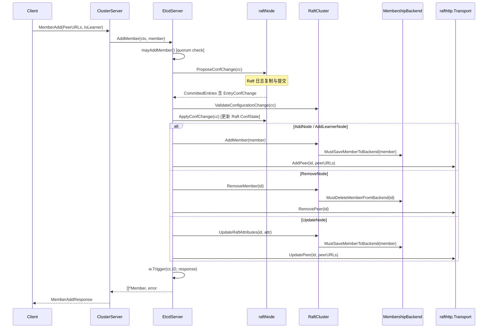
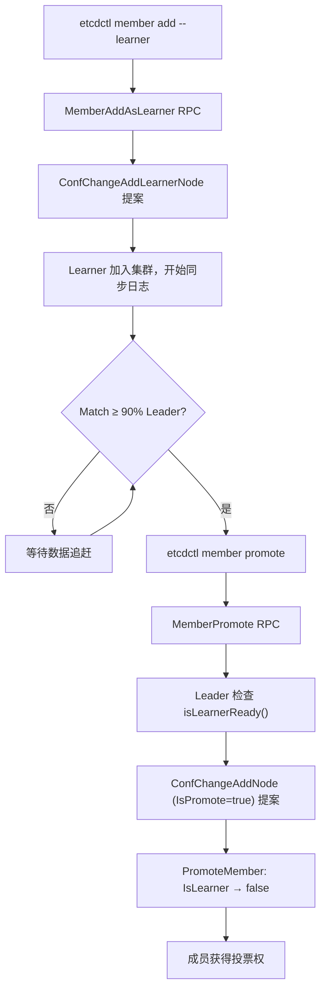

etcd 的集群成员管理是其分布式协调能力的基石。一个 etcd 集群在运行时可以动态地添加、移除、更新成员，甚至将非投票的 Learner 节点提升为正式投票成员——所有这些操作都无需停机。本文将从数据模型出发，逐层剖析 etcd 如何将成员变更提案穿透 Raft 共识、应用到内存状态、持久化到 BoltDB 后端，并在传输层同步对端连接，最终实现一致的动态重配置。

## 核心数据模型：Member 的双重属性

etcd 将一个成员的信息拆分为两正交维度：**Raft 属性**（`RaftAttributes`）和**业务属性**（`Attributes`）。Raft 属性包含该成员在 Raft 协议层的身份信息——`PeerURLs`（集群内部通信地址）和 `IsLearner`（是否为只读学习者节点）；业务属性则记录 `Name`（人类可读名称）和 `ClientURLs`（对外服务地址）。这种分离确保了共识层与应用层的关注点隔离。

```protobuf
// RaftAttributes 表示 etcd 成员的 Raft 相关属性
message RaftAttributes {
  repeated string peer_urls = 1;
  bool is_learner = 2;
}

// Attributes 表示 etcd 成员的所有非 Raft 相关属性
message Attributes {
  string name = 1;
  repeated string client_urls = 2;
}

message Member {
  uint64 ID = 1;
  RaftAttributes raft_attributes = 2;
  Attributes member_attributes = 3;
}
```

每个 `Member` 在 Go 内存中由 `membership.Member` 结构体表示，其 ID 类型为 `types.ID`（本质是 `uint64`）。成员 ID 的生成采用确定性算法：对排序后的 PeerURLs、集群名称和时间戳进行 SHA-1 哈希，取前 8 字节作为 ID。这意味着相同的 PeerURLs + 集群名称 + 时间戳总是产生相同的 ID，保证了引导阶段的可重复性。

Sources: [membership.proto](api/membershippb/membership.proto#L1-L52), [member.go](server/etcdserver/api/membership/member.go#L37-L133)

## RaftCluster：成员状态的内存权威

`membership.RaftCluster` 是集群成员信息在内存中的权威持有者。它维护三个核心数据结构：`members`（活跃成员映射 `map[types.ID]*Member`）、`removed`（已移除成员集合 `map[types.ID]bool`）以及 `version`（集群版本）。所有对这三个字段的读写都受 `sync.Mutex` 保护，确保并发安全。

```go
type RaftCluster struct {
    lg *zap.Logger
    localID types.ID
    cid     types.ID          // 集群 ID
    be      MembershipBackend // BoltDB 持久化后端

    sync.Mutex
    version    *semver.Version
    members    map[types.ID]*Member
    removed    map[types.ID]bool
    downgradeInfo *serverversion.DowngradeInfo
    maxLearners   int
}
```

集群 ID（`cid`）同样是确定性生成的：对所有成员 ID 排序后拼接，取 SHA-1 哈希前 8 字节。这种设计保证了相同成员集合总是产生相同集群 ID，在引导和恢复场景下具有关键意义。`RaftCluster` 同时实现了 `api.Cluster` 接口（提供 `ID()`、`Members()`、`Member(id)`、`ClientURLs()`、`Version()` 等只读查询方法），是上层 EtcdServer 访问成员信息的统一入口。

Sources: [cluster.go](server/etcdserver/api/membership/cluster.go#L38-L70), [cluster.go](server/etcdserver/api/membership/cluster.go#L169-L198), [cluster.go](server/etcdserver/api/membership/cluster.go#L87-L106), [cluster.go](server/etcdserver/api/membership/cluster.go#L165-L168), [cluster.go](server/etcdserver/api/cluster.go#L27-L39)

## gRPC API 层：成员操作的对外契约

etcd 通过 `Cluster` gRPC 服务暴露五个成员管理 RPC，每个操作都有明确的语义边界：

| RPC 方法 | 对应 Raft ConfChange 类型 | 语义 |
|---|---|---|
| `MemberAdd` | `ConfChangeAddNode` / `ConfChangeAddLearnerNode` | 添加投票成员或 Learner |
| `MemberRemove` | `ConfChangeRemoveNode` | 移除成员 |
| `MemberUpdate` | `ConfChangeUpdateNode` | 更新成员的 PeerURLs |
| `MemberList` | （无 Raft 提案） | 查询当前成员列表 |
| `MemberPromote` | `ConfChangeAddNode`（带 `IsPromote` 标记） | 将 Learner 提升为投票成员 |

`v3rpc.ClusterServer` 是 gRPC 层的处理入口。以 `MemberAdd` 为例：它先将请求中的 PeerURLs 解析为 `types.URLs`，根据 `IsLearner` 标记创建对应的 `Member` 对象，然后调用 `EtcdServer.AddMember()`。值得注意的是，`MemberList` 是唯一不经过 Raft 提案的操作——它支持 `linearizable` 参数，若为 true 则通过 `LinearizableReadNotify` 确保读到最新一致状态，否则直接从内存读取。

Sources: [rpc.proto](api/etcdserverpb/rpc.proto#L155-L195), [rpc.proto](api/etcdserverpb/rpc.proto#L972-L1063), [member.go](server/etcdserver/api/v3rpc/member.go#L48-L127)

## 配置变更的完整生命周期

成员变更的核心流程是一条从 gRPC 请求到 Raft 提案再到 Apply 的完整链路。下面的时序图展示了这一过程的全貌：



**第一步：提案提交**。`EtcdServer.configure()` 是所有成员变更的统一入口。它生成唯一请求 ID，注册到 `wait` 等待器，然后调用 `raftNode.ProposeConfChange()` 将 `raftpb.ConfChange` 提交给 Raft。`ConfChange` 的 `Context` 字段携带 JSON 序列化的 `ConfigChangeContext`（包含成员信息和 `IsPromote` 标记）或 `Member` 对象。

**第二步：Raft 共识**。配置变更作为 `EntryConfChange` 类型的日志条目被复制到多数派。值得注意的是，在 `raftNode` 的 `start` goroutine 中，当检测到 `CommittedEntries` 包含 `EntryConfChange` 时，非 Leader 节点会额外等待 Apply 层处理完毕后再发送消息——这是为了防止已移除成员的投票被错误计入。

**第三步：Apply 阶段**。在 `EtcdServer.apply()` 方法中，`EntryConfChange` 被分派到 `applyConfChange()`。该方法先调用 `ValidateConfigurationChange()` 进行防御性校验，然后调用 `raftNode.ApplyConfChange()` 更新 Raft 内部的 `ConfState`，最后根据变更类型执行对应的集群状态更新。

**第四步：等待 Raft Advance**。`configure()` 在收到 Apply 结果后，还会阻塞等待 `<-resp.raftAdvanceC`，确保 Raft 已完成 `Advance()` 调用。这是为了防止连续配置变更请求因 Raft 未完成内部状态调整而被拒绝。

Sources: [server.go](server/etcdserver/server.go#L1751-L1788), [server.go](server/etcdserver/server.go#L1886-L1939), [server.go](server/etcdserver/server.go#L2004-L2077), [raft.go](server/etcdserver/raft.go#L287-L334)

## 安全守卫：严格重配置检查

etcd 的成员变更不是"提交就执行"——在提案进入 Raft 之前，有一套严格的前置检查机制（`StrictReconfigCheck`，默认开启）。

**添加成员时的检查**（`mayAddMember`）：对于投票成员，调用 `IsReadyToAddVotingMember()` 验证已启动的成员数是否足够维持新 quorum；同时通过 `isConnectedFullySince()` 检查本地节点是否与所有 Peer 保持了最近 `HealthInterval` 内的活跃连接。对于 Learner 成员，由于不影响 quorum，跳过 quorum 检查但仍受 `maxLearners` 限制。

**移除成员时的检查**（`mayRemoveMember`）：Learner 的移除不受 quorum 限制；投票成员的移除则需通过 `IsReadyToRemoveVotingMember()` 验证移除后剩余启动成员数 ≥ 新 quorum。此外，如果被移除成员已宕机（`ActiveSince` 返回零值），则安全放行；否则还需验证活跃连接数 ≥ quorum。

**提升 Learner 时的检查**（`mayPromoteMember`）：除了 quorum 就绪检查外，还通过 `isLearnerReady()` 验证 Learner 的 `Match` 索引是否达到 Leader 的 90%（`readyPercentThreshold = 0.9`）。这一机制确保 Learner 已基本追上数据，提升后不会拖慢集群写入性能。

| 操作 | Quorum 检查 | 连接健康检查 | 其他 |
|---|---|---|---|
| 添加投票成员 | ✅ 新 quorum | ✅ 全连接 | — |
| 添加 Learner | — | — | maxLearners 限制 |
| 移除投票成员 | ✅ 剩余 quorum | ✅ 活跃连接 | 宕机成员安全放行 |
| 移除 Learner | — | — | — |
| 提升 Learner | ✅ 未来 quorum | — | Match ≥ 90% Leader |

Sources: [server.go](server/etcdserver/server.go#L1406-L1434), [server.go](server/etcdserver/server.go#L1604-L1646), [server.go](server/etcdserver/server.go#L1532-L1601), [server.go](server/etcdserver/server.go#L1557-L1601), [cluster.go](server/etcdserver/api/membership/cluster.go#L622-L695)

## ValidateConfigurationChange：Apply 阶段的二次防线

即使在提案提交前通过了所有前置检查，`ValidateConfigurationChange` 在 Apply 阶段仍会从后端重新读取成员数据进行二次校验。这是防御性编程的体现——在提案从提交到 Apply 之间，集群状态可能已被其他变更修改。

校验逻辑根据 `ConfChange` 类型分四路：
- **AddNode / AddLearnerNode**：若 `IsPromote` 为 true，验证目标 ID 存在且当前为 Learner；否则验证 ID 不存在、PeerURLs 不冲突、Learner 数量不超限。
- **RemoveNode**：验证 ID 存在于成员列表中。
- **UpdateNode**：验证 ID 存在且新 PeerURLs 不与其他成员冲突。
- 若 ID 在 `removed` 集合中，直接拒绝（`ErrIDRemoved`）。

校验失败时，会调用 `raftNode.ApplyConfChange()` 但将 `NodeID` 设为 `raft.None`，通知 Raft 撤销该变更，并返回错误通过 `w.Trigger()` 传回给等待的 `configure()` 调用。

Sources: [cluster.go](server/etcdserver/api/membership/cluster.go#L307-L398), [server.go](server/etcdserver/server.go#L2004-L2018)

## Learner 成员的完整生命周期

Learner 是 etcd v3.4 引入的节点角色，它参与 Raft 日志复制但不参与投票，适用于集群扩容时先同步数据再上线的场景。其生命周期如下：



关键设计决策：
1. **默认最大 Learner 数为 1**（`DefaultMaxLearners = 1`），可通过 `WithMaxLearners` 选项调整。
2. **Promote 操作需要 Leader 执行**：因为只有 Leader 持有所有节点的 `Progress` 信息来判断 Learner 是否就绪。如果请求到达非 Leader 节点，会通过 HTTP 转发到 Leader 的 `/members/promote/{id}` 端点。
3. **提升复用 `ConfChangeAddNode` 类型**：通过 `ConfigChangeContext.IsPromote` 标记区分"添加新成员"和"提升 Learner"，避免引入新的 ConfChange 类型。

Sources: [cluster_opts.go](server/etcdserver/api/membership/cluster_opts.go#L5-L44), [server.go](server/etcdserver/server.go#L1454-L1530), [cluster.go](server/etcdserver/api/membership/cluster.go#L49-L64), [cluster_util.go](server/etcdserver/cluster_util.go#L296-L340)

## 持久化架构：双层存储与 MembershipBackend

etcd 的成员信息采用 BoltDB 后端作为持久化权威源。`schema.MembershipBackend` 接口定义了三个核心存储能力：

```go
type MembershipBackend interface {
    ClusterVersionBackend
    MemberBackend
    DowngradeInfoBackend
    MustCreateBackendBuckets()
}
```

成员数据分布在三个 BoltDB Bucket 中：

| Bucket 名称 | 用途 | Key 格式 |
|---|---|---|
| `members` | 活跃成员信息 | 成员 ID 字符串 |
| `members_removed` | 已移除成员标记 | 成员 ID 字符串 |
| `cluster` | 集群版本、降级信息 | 固定 key |

每个成员以 JSON 序列化后存入 `members` Bucket。当成员被移除时，从 `members` 删除并同时向 `members_removed` 写入标记——这一设计确保被移除的 ID 永远不会被复用。`RaftCluster.Recover()` 在节点重启时调用 `UnsafeLoad()` 从后端读取完整的成员状态，恢复内存中的 `members` 和 `removed` 映射。

此外，成员变更还通过 `InternalRaftRequest` 的三个特殊字段间接持久化：
- `ClusterVersionSet`（field 1300）：集群版本变更
- `ClusterMemberAttrSet`（field 1301）：成员属性（Name、ClientURLs）更新
- `DowngradeInfoSet`（field 1302）：降级信息更新

这三个操作走的是 `EntryNormal` 路径（而非 `EntryConfChange`），通过 `uberApplier` 分派到 `applierV3backend` 的对应方法执行。

Sources: [store.go](server/etcdserver/api/membership/store.go#L1-L58), [membership.go](server/storage/schema/membership.go#L50-L175), [bucket.go](server/storage/schema/bucket.go#L49-L50), [raft_internal.proto](api/etcdserverpb/raft_internal.proto#L65-L67), [uber_applier.go](server/etcdserver/apply/uber_applier.go#L106-L116), [backend.go](server/etcdserver/apply/backend.go#L270-L304)

## 传输层同步：Transport 的对端管理

成员变更不仅需要更新内存和持久化状态，还必须同步更新 Raft 传输层的对端连接。`rafthttp.Transport` 在 `applyConfChange` 中被同步调用：

- **AddPeer**：创建新的 `peer` 实例，启动 pipeline 和 stream 连接，并注册到健康探测器。
- **RemovePeer**：停止对端的 pipeline/stream 连接，从 `peers` 映射和探测器中移除。
- **UpdatePeer**：更新对端的 URL 列表并重建探测器。

Transport 的操作受独立互斥锁 `t.mu` 保护，与 `RaftCluster` 的锁互不干扰。在移除自身成员的场景下（`cc.NodeID == s.MemberID()`），`applyConfChange` 返回 `shouldStop = true`，触发节点优雅关闭。

Sources: [transport.go](server/etcdserver/api/rafthttp/transport.go#L295-L397), [server.go](server/etcdserver/server.go#L2028-L2077)

## 成员属性发布：publishV3 机制

当一个 etcd 节点启动后，它需要向集群注册自己的 Name 和 ClientURLs——这就是 `publishV3` 的工作。它构造一个 `ClusterMemberAttrSetRequest`，通过标准的 `raftRequest` 路径提交为 `EntryNormal` 类型的普通提案，经过 Raft 共识后在 Apply 阶段调用 `Cluster.UpdateAttributes()` 更新内存和后端。

```go
func (s *EtcdServer) publishV3(timeout time.Duration) {
    req := &membershippb.ClusterMemberAttrSetRequest{
        Member_ID: uint64(s.MemberID()),
        MemberAttributes: &membershippb.Attributes{
            Name:       s.attributes.Name,
            ClientUrls: s.attributes.ClientURLs,
        },
    }
    // 循环重试直到成功或 server 停止
    for { /* ... */ }
}
```

`publishV3` 在循环中持续重试，直到成功注册或服务器停止。这确保了即使暂时性的网络分区或 Leader 不可用，节点最终都能完成属性注册。在 Apply 侧，`ClusterMemberAttrSet` 直接调用 `Cluster.UpdateAttributes()`，将 Name 和 ClientURLs 写入后端。

Sources: [server.go](server/etcdserver/server.go#L1790-L1820), [backend.go](server/etcdserver/apply/backend.go#L287-L296)

## 集群引导：三种启动场景

etcd 的集群引导逻辑在 `bootstrapCluster()` 中根据数据目录状态分三条路径：

| 场景 | WAL 状态 | `NewCluster` 标志 | 引导函数 |
|---|---|---|---|
| 全新集群 | 无 WAL | `true` | `bootstrapNewClusterNoWAL` |
| 加入已有集群 | 无 WAL | `false` | `bootstrapExistingClusterNoWAL` |
| 数据恢复 | 有 WAL | 忽略 | `bootstrapClusterWithWAL` |

**全新集群引导**：通过 `NewClusterFromURLsMap` 从配置的 `InitialPeerURLsMap` 生成成员列表，可选地通过 Discovery Service 获取成员列表。它还会调用 `isMemberBootstrapped` 检查目标成员是否已被引导过，防止重复初始化。

**加入已有集群**：同样从本地配置生成初始成员列表，然后通过 `GetClusterFromRemotePeers` 从远端 Peer 的 `/members` HTTP 端点获取实际集群状态。接着调用 `ValidateClusterAndAssignIDs` 将远端集群的 ID 映射回本地，并验证版本兼容性。

**数据恢复**：从 WAL 快照的元数据中恢复 `nodeID` 和 `clusterID`，成员信息从 BoltDB 后端的 `UnsafeLoad()` 中恢复。

Sources: [bootstrap.go](server/etcdserver/bootstrap.go#L301-L410), [cluster_util.go](server/etcdserver/cluster_util.go#L50-L100), [cluster_util.go](server/etcdserver/cluster_util.go#L109-L148)

## 错误体系

成员管理操作有明确的错误码映射：

| 错误 | 含义 | 触发场景 |
|---|---|---|
| `ErrIDRemoved` | ID 已被移除 | 复用已移除成员的 ID |
| `ErrIDExists` | ID 已存在 | 重复添加成员 |
| `ErrIDNotFound` | ID 不存在 | 移除/更新/提升不存在的成员 |
| `ErrPeerURLexists` | PeerURL 冲突 | 新成员的 PeerURL 与已有成员重复 |
| `ErrMemberNotLearner` | 目标非 Learner | 提升一个已经是投票成员的节点 |
| `ErrTooManyLearners` | Learner 超限 | 超过 `maxLearners` 限制 |
| `ErrNotEnoughStartedMembers` | 活跃成员不足 | quorum 安全检查失败 |
| `ErrUnhealthy` | 集群不健康 | 连接健康检查失败 |
| `ErrLearnerNotReady` | Learner 未就绪 | Match < 90% Leader |

Sources: [errors.go](server/etcdserver/api/membership/errors.go#L1-L36)

## CLI 操作与客户端 API

`etcdctl` 提供了完整的成员管理子命令集：

```bash
# 列出成员（支持 --consistency l/s）
etcdctl member list

# 添加投票成员
etcdctl member add node4 --peer-urls=http://10.0.0.4:2380

# 添加 Learner 成员
etcdctl member add node5 --peer-urls=http://10.0.0.5:2380 --learner

# 移除成员（参数为十六进制成员 ID）
etcdctl member remove abcdef1234567890

# 更新成员的 PeerURL
etcdctl member update abcdef1234567890 --peer-urls=http://10.0.0.1:2380

# 将 Learner 提升为投票成员
etcdctl member promote abcdef1234567890
```

Go 客户端通过 `clientv3.Cluster` 接口提供等价的方法。`MemberAdd` 和 `MemberAddAsLearner` 分别对应添加投票成员和 Learner；`MemberPromote` 将 Learner 提升为投票成员。客户端在发送请求前会先调用 `types.NewURLs()` 进行 URL 格式的快速校验，实现 fail-fast。

Sources: [member_command.go](etcdctl/ctlv3/command/member_command.go#L1-L267), [cluster.go](client/v3/cluster.go#L1-L142)

## 与其他子系统的关联

集群成员管理与 etcd 的多个核心子系统紧密协作：配置变更作为 `EntryConfChange` 穿透 [Raft 共识算法集成](9-raft-gong-shi-suan-fa-ji-cheng-raftnode-gua-pei-ceng-yu-xiao-xi-liu-zhuan) 中的 `raftNode` 适配层；成员数据通过 [Backend 抽象与 BoltDB 集成](13-backend-chou-xiang-yu-boltdb-ji-cheng) 持久化；快照机制在 [WAL（预写日志）](12-wal-yu-xie-ri-zhi-chi-jiu-hua-yu-beng-kui-hui-fu) 中存储 `ConfState`，确保重启后能正确恢复 Raft 配置；而 [gRPC API 定义](15-grpc-api-ding-yi-yu-protocol-buffers-qi-yue-api-mo-kuai) 中的 `Cluster` 服务则是外部访问成员管理的唯一入口。