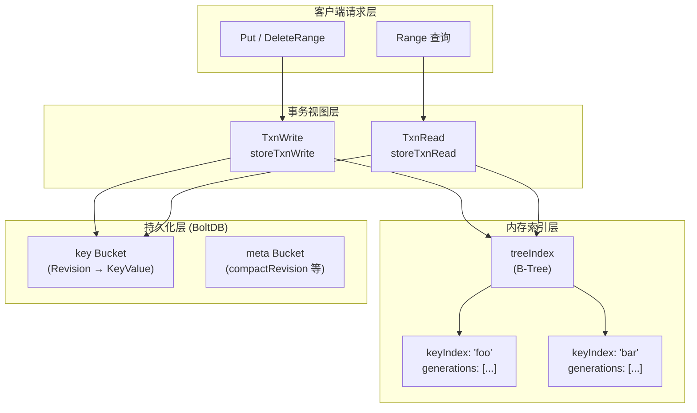
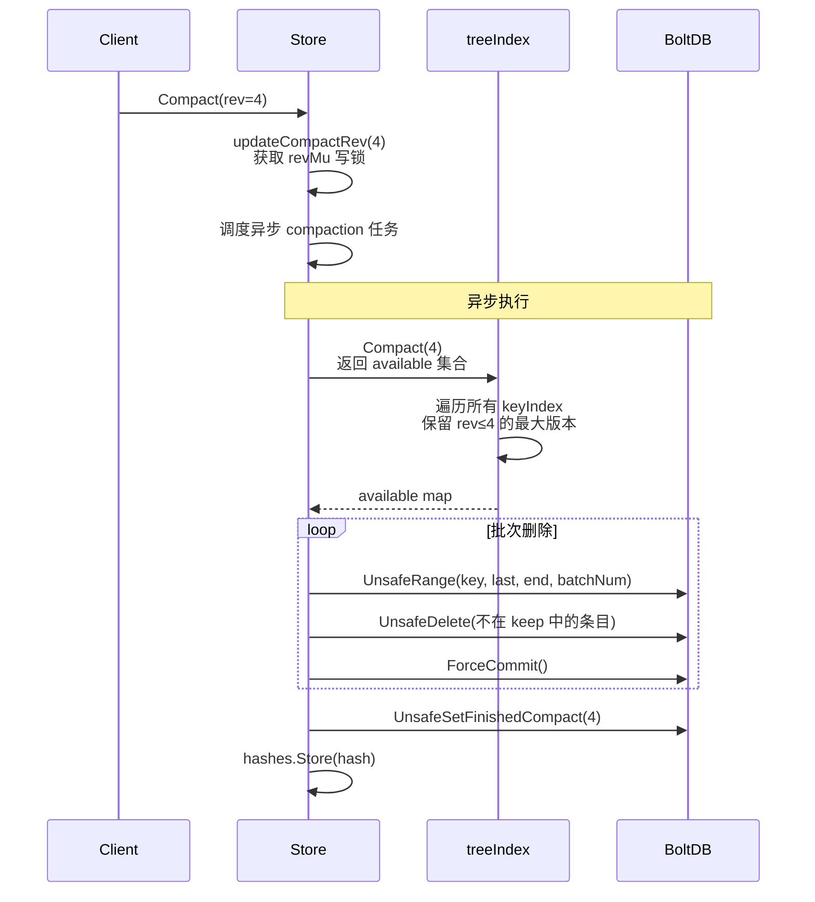

etcd 的 MVCC（Multi-Version Concurrency Control，多版本并发控制）存储模型是其作为分布式配置中心与协调服务的核心基石。该模型使得 etcd 能够在不加锁的情况下实现读写并发、支持历史版本查询、提供 Watch 事务一致性语义。本文将从底层数据结构到上层事务抽象逐层展开，深入剖析 Revision 的时间线语义、KeyIndex 的代际模型、B-Tree 索引的并发查询机制，以及事务视图（TxnRead / TxnWrite）的隔离保证。

Sources: [doc.go](server/storage/mvcc/doc.go#L15-L16)

## 全局架构：双层存储设计

etcd 的 MVCC 存储采用了**内存索引 + 持久化后端**的双层架构。内存层维护一棵 B-Tree 索引（`treeIndex`），用于将逻辑键映射到物理 Revision；持久化层（BoltDB）以 Revision 为物理键存储序列化的 `KeyValue` 数据。这种分离设计使得读取操作只需在内存索引中完成键到 Revision 的映射，再通过 Revision 到 BoltDB 中完成一次精确查找，避免了全表扫描。



核心结构体 `store` 持有关键状态：`currentRev`（当前已完成的最大事务 Revision）、`compactMainRev`（最近一次 Compaction 的 Revision），以及通过 `revMu`（读写锁）保护这两个字段的并发访问。`store` 同时嵌入 `ReadView` 和 `WriteView` 接口，为上层提供便捷的非事务式读写入口。

Sources: [kvstore.go](server/storage/mvcc/kvstore.go#L52-L81), [kv_view.go](server/storage/mvcc/kv_view.go#L24-L56)

## Revision：时间线的原子刻度

**Revision** 是 etcd MVCC 模型中最基础的版本标识，由两个 int64 字段组成：

| 字段 | 类型 | 含义 |
|------|------|------|
| `Main` | int64 | 主版本号，全局单调递增，每次**事务提交**时 +1 |
| `Sub` | int64 | 子版本号，同一事务内多次修改时递增，区分同一事务内的不同操作 |

Revision 的比较逻辑遵循字典序：先比较 `Main`，再比较 `Sub`。这意味着 `(3, 0) > (2, 5) > (2, 1)`。在物理存储层面，Revision 被序列化为 17 字节的大端序字节流：`[8字节 Main][1字节 '_'][8字节 Sub]`。当表示删除操作（Tombstone）时，还会追加 1 字节的标记 `'t'`，扩展为 18 字节的 `markedRevision`。

`BucketKey` 结构在 `Revision` 基础上增加了 `tombstone` 布尔标记，用于在存储层区分普通写入与删除标记。这种设计使得 BoltDB 中的删除记录可以与正常记录共存于同一个 `key` Bucket 中，通过物理键的字节长度即可判断操作类型。

Sources: [revision.go](server/storage/mvcc/revision.go#L22-L127)

## KeyIndex 与 Generation：键的生命周期管理

如果说 Revision 是全局时间线上的刻度，那么 **keyIndex** 就是单个键在这些刻度上的足迹记录。每个 keyIndex 维护一个键的全部修改历史，结构如下：

| 字段 | 类型 | 含义 |
|------|------|------|
| `key` | []byte | 逻辑键名 |
| `modified` | Revision | 最后一次修改的 Revision |
| `generations` | []generation | 代际列表，按时间从旧到新排列 |

**Generation（代）** 是理解 KeyIndex 的关键概念。一个 Generation 代表键从创建到删除的一个完整生命周期：

- 键第一次 `Put` 时创建一个新 Generation，记录 `created` Revision
- 后续对同一键的 `Put` 操作追加到当前 Generation 的 `revs` 列表
- 键被删除（Tombstone）时，在当前 Generation 末尾追加一条 Tombstone 记录，然后创建一个**空的**新 Generation
- 新 Generation 的第一个 `Put` 标志着键的重新创建

源码中的注释给出了一个经典示例——对键 `"foo"` 执行 `put(1.0) → put(2.0) → tombstone(3.0) → put(4.0) → tombstone(5.0)` 后，生成的 keyIndex 结构为：

```
key:      "foo"
modified: {Main:5, Sub:0}
generations:
  {empty}          ← 当前（空）代，等待下一次 Put
  {4.0, 5.0(t)}    ← 第二代：从 put 到 tombstone
  {1.0, 2.0, 3.0(t)} ← 第一代：从 put 到 tombstone
```

注意 Generations 列表的存储顺序是从新到旧（索引 0 是最新的），而每个 Generation 内的 `revs` 是按时间从旧到新排列的。`get` 方法在查询指定 Revision 时，先通过 `findGeneration` 定位目标 Revision 所属的 Generation，再在该 Generation 内通过 `walk` 反向遍历找到不超过 `atRev` 的最大版本。

Sources: [key_index.go](server/storage/mvcc/key_index.go#L27-L77), [key_index.go](server/storage/mvcc/key_index.go#L147-L167), [key_index.go](server/storage/mvcc/key_index.go#L345-L368)

### Generation 查询的边界语义

`findGeneration` 方法的实现揭示了 MVCC 查询中一个微妙的边界条件：当请求的 Revision 恰好落在两个 Generation 之间的"空隙"时，方法返回 `nil`，表示该键在指定 Revision 时不存在。具体判断逻辑为：对于非最后一个 Generation，如果其最后一条记录（Tombstone）的主版本号小于等于请求的 Revision，说明该键在请求时刻已被删除且尚未重新创建，返回空。

Sources: [key_index.go](server/storage/mvcc/key_index.go#L291-L312)

## treeIndex：B-Tree 并发索引

`treeIndex` 是 `index` 接口的具体实现，基于 Kubernetes fork 的 B-Tree 数据结构，以逻辑键的字节序作为排序依据。它通过 `sync.RWMutex` 保护并发访问：读操作获取读锁，写操作（Put、Tombstone、Compact）获取写锁。

| 方法 | 锁类型 | 功能 |
|------|--------|------|
| `Get(key, atRev)` | RLock | 查找指定键在指定 Revision 时的版本信息 |
| `Range(key, end, atRev)` | RLock | 范围查询，返回键列表和对应 Revision |
| `Revisions(key, end, atRev, limit)` | RLock | 范围查询 Revision 列表，支持分页 |
| `Put(key, rev)` | Lock | 向 B-Tree 插入或更新 keyIndex |
| `Tombstone(key, rev)` | Lock | 标记键删除，创建新 Generation |
| `Compact(rev)` | Lock | 压缩索引，返回可删除的 Revision 集合 |

`Put` 操作的流程体现了"懒初始化"模式：先构造一个仅包含 `key` 字段的临时 `keyIndex` 去树中查询；如果树中已存在该键，直接在已有 keyIndex 上追加新 Revision；如果不存在，创建新的 keyIndex 并插入树中。这种设计避免了每次写入都需要先查询再更新的两次树操作。

Sources: [index.go](server/storage/mvcc/index.go#L39-L66), [index.go](server/storage/mvcc/index.go#L163-L195)

## 事务视图：读写分离的隔离保证

etcd MVCC 的事务模型通过 `TxnRead` 和 `TxnWrite` 两个接口实现读写分离。所有对 store 的操作都必须通过开启事务来完成，事务在创建时"快照"当前的 Revision 状态，在整个事务生命周期内看到一致的视图。

### 读事务（storeTxnRead）

读事务在创建时捕获 `compactMainRev`（`firstRev`）和 `currentRev`（`rev`），作为该事务可见的版本范围。`Range` 查询的核心流程为：

1. **参数校验**：如果请求的 Revision 超过当前 Revision 返回 `ErrFutureRev`；如果低于 Compaction Revision 返回 `ErrCompacted`
2. **索引查找**：通过 `kvindex.Revisions()` 在内存 B-Tree 中找到满足条件的 Revision 列表
3. **数据读取**：将 Revision 序列化为字节键，通过 `UnsafeRange` 从 BoltDB 的 `key` Bucket 中读取对应的序列化 `KeyValue` 数据
4. **反序列化**：将 BoltDB 返回的 protobuf 字节流反序列化为 `mvccpb.KeyValue` 结构

读事务支持两种模式：`ConcurrentReadTxMode`（使用 `ConcurrentReadTx`，复制读缓冲区以避免写事务阻塞）和 `SharedBufReadTxMode`（共享缓冲区，性能更高但可能与写事务争用）。通过 `readView.Range` 调用时默认使用 `ConcurrentReadTxMode`，确保读操作不会被写事务阻塞。

Sources: [kvstore_txn.go](server/storage/mvcc/kvstore_txn.go#L30-L132), [kv.go](server/storage/mvcc/kv.go#L39-L65), [kv.go](server/storage/mvcc/kv.go#L104-L111)

### 写事务（storeTxnWrite）

写事务的核心职责是将逻辑操作（Put / Delete）转化为物理存储写入。`storeTxnWrite` 在创建时记录 `beginRev`（事务开始时的当前 Revision），事务内所有写操作的目标 Revision 为 `beginRev + 1`。

**Put 操作**的完整流程：

1. 计算目标 Revision：`rev = beginRev + 1`，Sub 版本号使用 `len(changes)`（同一事务内多次 Put 时递增）
2. 查询索引获取该键的 `created` Revision 和 `version`（如果键已存在），`version + 1` 作为新版本号
3. 构造 `mvccpb.KeyValue` protobuf 消息，包含 `Key`、`Value`、`CreateRevision`、`ModRevision`、`Version`、`Lease`
4. 序列化后通过 `UnsafeSeqPut` 追加写入 BoltDB 的 `key` Bucket（物理键为序列化的 Revision）
5. 更新内存索引 `kvindex.Put`
6. 将变更记录到 `changes` 列表
7. 处理 Lease 的 Attach / Detach

**Delete 操作**通过写入一条 Tombstone 记录实现——序列化一个仅包含 `Key` 字段的 `KeyValue`，物理键中带有 Tombstone 标记字节。随后调用 `kvindex.Tombstone` 在 keyIndex 中追加 Tombstone Revision 并创建新的空 Generation。

**事务提交**在 `End()` 方法中完成：如果 `changes` 非空，获取 `revMu` 写锁，将 `currentRev++`，然后释放 BoltDB 的 BatchTx 锁，最后释放 `revMu`。这个顺序确保了新开启的读事务在 `currentRev` 递增后才能看到写入的 Revision，实现了严格的事务可见性。

Sources: [kvstore_txn.go](server/storage/mvcc/kvstore_txn.go#L139-L322)

### KeyValue 数据模型

每条持久化记录是一个 protobuf `KeyValue` 消息，包含以下关键字段：

| 字段 | 类型 | 含义 |
|------|------|------|
| `key` | bytes | 逻辑键 |
| `create_revision` | int64 | 该键当前 Generation 的创建 Revision |
| `mod_revision` | int64 | 最后一次修改的 Revision |
| `version` | int64 | 当前 Generation 内的修改次数（删除后重置为 0） |
| `value` | bytes | 值内容 |
| `lease` | int64 | 关联的 Lease ID（0 表示无关联） |

Sources: [kv.proto](api/mvccpb/kv.proto#L6-L23)

## 并发控制：锁的层次与顺序

MVCC 存储使用了三层锁来保护并发安全，锁的获取顺序严格遵循以下层次以避免死锁：

| 层级 | 锁 | 保护对象 | 持有者 |
|------|-----|---------|--------|
| 1（最外层） | `store.mu` (RWMutex) | 事务开启/结束的串行化 | 读写事务均获取 |
| 2 | `store.revMu` (RWMutex) | `currentRev` 和 `compactMainRev` | 写事务 End() 时写锁；读事务创建时读锁 |
| 3（最内层） | `treeIndex` 内部锁 | B-Tree 索引结构 | 索引读写操作 |

写事务 `End()` 方法的锁释放顺序尤为关键：先获取 `revMu` 写锁递增 `currentRev`，然后释放 BoltDB 事务锁（`tx.Unlock()`），最后释放 `revMu`。这确保了 BoltDB 中数据已持久化之后，`currentRev` 的递增才对外可见，读事务不会看到一个"数据尚未写入"的 Revision。

Sources: [kvstore_txn.go](server/storage/mvcc/kvstore_txn.go#L182-L194), [kvstore.go](server/storage/mvcc/kvstore.go#L59-L73)

## Compaction：历史版本回收

随着持续写入，BoltDB 中会积累大量历史版本数据。**Compaction** 机制负责回收不再需要的旧版本，其工作分为两个阶段：

### 索引压缩（内存层）

`treeIndex.Compact(rev)` 遍历 B-Tree 中的所有 keyIndex，对每个 keyIndex 调用 `compact(atRev, available)`。压缩规则为：在每个 Generation 中，保留不超过 `atRev` 的**最大** Revision，删除更小的 Revision。如果一个 Generation 在压缩后变空（其所有 Revision 都被移除），则整个 Generation 被移除。如果所有 Generation 都被移除，该 keyIndex 从 B-Tree 中删除。

该方法返回一个 `available` 集合，包含所有被标记为可删除的 Revision，供后端存储层使用。

### 数据删除（持久化层）

`scheduleCompaction` 方法以批次方式删除 BoltDB 中的数据。它按 Revision 范围分批扫描 `key` Bucket，对于不在 `keep` 集合中的 Revision 条目调用 `UnsafeDelete` 删除。每批处理完成后调用 `ForceCommit` 确保删除已持久化，然后短暂休眠（默认 10ms）以避免一次性占用过多 I/O 资源。全部完成后，将 `finishedCompactRev` 写入 `meta` Bucket 作为检查点。



Sources: [kvstore.go](server/storage/mvcc/kvstore.go#L233-L283), [kvstore_compaction.go](server/storage/mvcc/kvstore_compaction.go#L28-L100), [key_index.go](server/storage/mvcc/key_index.go#L215-L235)

## 数据恢复：从 BoltDB 重建内存索引

etcd 启动时通过 `restore()` 方法从 BoltDB 重建完整的内存索引状态。恢复过程以流式方式分块读取 `key` Bucket 中的所有条目（默认每块 10000 条），通过 channel 将解码任务传递给后台 goroutine `restoreIntoIndex`。该 goroutine 维护一个 LRU 缓存（`kiCache`）来减少 B-Tree 查找次数，对每条记录：

- 如果是普通 Put：通过 `ki.put()` 追加到已有 keyIndex，或创建新 keyIndex 并插入树中
- 如果是 Tombstone：调用 `ki.tombstone()` 追加删除标记并创建新 Generation
- 如果是已压缩的孤立 Tombstone：调用 `ki.restoreTombstone()` 恢复

恢复完成后，从 `meta` Bucket 读取 `finishedCompactRev` 和 `scheduledCompactRev`。如果存在未完成的 Compaction（scheduled > finished），会自动恢复执行。

Sources: [kvstore.go](server/storage/mvcc/kvstore.go#L316-L425), [kvstore.go](server/storage/mvcc/kvstore.go#L433-L490)

## WatchableStore：事务变更的事件推送

`watchableStore` 在 `store` 基础上增加了 Watch 能力。它通过组合模式嵌入 `store`，并重写了 `Write()` 方法，返回 `watchableStoreTxnWrite` 而非普通的 `storeTxnWrite`。关键区别在 `End()` 方法中：写事务提交时，将 `changes` 列表转化为 `mvccpb.Event` 数组（通过 `CreateRevision == 0` 区分 DELETE 和 PUT），然后调用 `notify()` 将事件推送到匹配的 Watcher。

Watcher 分为两组管理：**synced**（已同步，跟随最新 Revision）和 **unsynced**（滞后，需要从 BoltDB 回放历史事件）。两个后台 goroutine `syncWatchersLoop`（100ms 周期）和 `syncVictimsLoop`（10ms 周期）分别负责同步滞后的 Watcher 和重试被阻塞的事件推送。

Sources: [watchable_store.go](server/storage/mvcc/watchable_store.go#L55-L109), [watchable_store_txn.go](server/storage/mvcc/watchable_store_txn.go#L22-L57)

## 数据完整性校验：Hash 机制

MVCC 存储通过 CRC32（Castagnoli 多项式）哈希来验证数据完整性。`kvHasher` 在遍历 `key` Bucket 中所有条目时，跳过超出查询 Revision 范围的条目和已被 Compaction 标记删除的条目，对剩余条目的键和值分别写入哈希计算器。`HashStorage` 缓存最近 10 次 Compaction 的哈希值，用于跨节点的数据一致性检查。

Sources: [hash.go](server/storage/mvcc/hash.go#L33-L100), [hash.go](server/storage/mvcc/hash.go#L96-L119)

## BoltDB 中的物理存储布局

MVCC 数据在 BoltDB 中分布于两个核心 Bucket：

| Bucket 名称 | 用途 | 物理键 | 物理值 |
|-------------|------|--------|--------|
| `key` | KV 数据 | 序列化的 Revision (17/18字节) | 序列化的 `mvccpb.KeyValue` |
| `meta` | 元数据 | `scheduledCompactRev` / `finishedCompactRev` | 序列化的 Revision |

`key` Bucket 被标记为 `safeRangeBucket`，意味着对其的范围查询可以安全地与写操作并发执行。Revision 的字节序设计（大端序）保证了 BoltDB 中的物理排序与逻辑 Revision 顺序一致，使得按 Revision 范围扫描可以高效利用 BoltDB 的 B+Tree 索引。

Sources: [bucket.go](server/storage/schema/bucket.go#L24-L58), [bucket.go](server/storage/schema/bucket.go#L72-L87)

## 核心接口与类型速查

| 类型/接口 | 文件 | 职责 |
|-----------|------|------|
| `Revision` | revision.go | 版本标识 (Main, Sub) |
| `BucketKey` | revision.go | 扩展 Revision，含 Tombstone 标记 |
| `keyIndex` | key_index.go | 单键的版本历史（Generation 列表） |
| `generation` | key_index.go | 键的代际（创建到删除） |
| `treeIndex` | index.go | B-Tree 内存索引 |
| `store` | kvstore.go | 核心存储引擎 |
| `storeTxnRead` | kvstore_txn.go | 读事务实现 |
| `storeTxnWrite` | kvstore_txn.go | 写事务实现 |
| `watchableStore` | watchable_store.go | 支持 Watch 的存储引擎 |
| `KV` | kv.go | 存储引擎顶层接口 |
| `TxnRead` / `TxnWrite` | kv.go | 事务读写接口 |
| `ReadView` / `WriteView` | kv.go | 非事务式读写视图 |

Sources: [kv.go](server/storage/mvcc/kv.go#L39-L135), [kv.go](server/storage/mvcc/kv.go#L104-L111)

## 延伸阅读

本文聚焦 MVCC 存储模型的内存索引与事务语义。要理解完整的数据持久化路径，建议继续阅读：

- [Backend 抽象与 BoltDB 集成](13-backend-chou-xiang-yu-boltdb-ji-cheng)——深入 BoltDB 的事务模型、缓冲区管理与批量写入机制
- [Compaction 与 Schema 版本迁移](14-compaction-yu-schema-ban-ben-qian-yi)——Compaction 的完整生命周期与存储格式演进
- [Watch 机制：事件推送、缓存层与一致性保证](17-watch-ji-zhi-shi-jian-tui-song-huan-cun-ceng-cache-mo-kuai-yu-zhi-xing-bao-zheng)——Watch 事件的生成、过滤与推送的完整链路