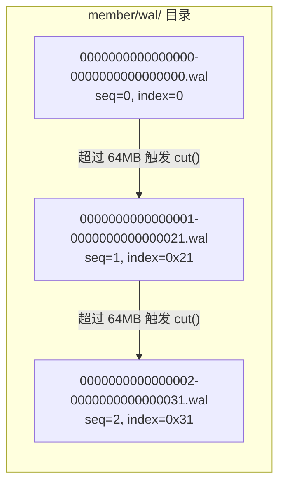
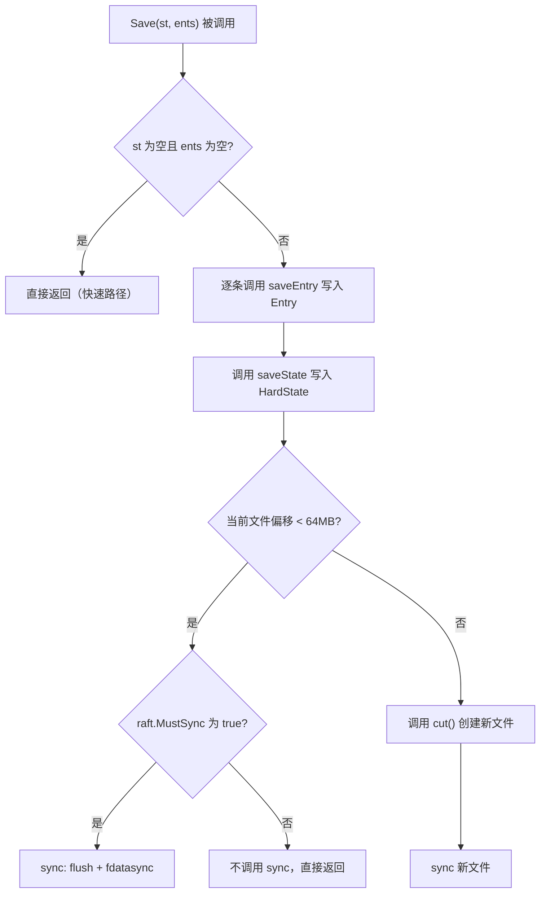
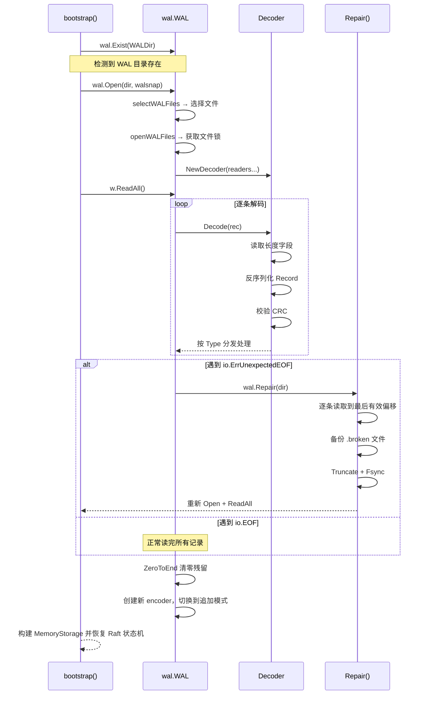

WAL（Write-Ahead Log）是 etcd 实现数据持久化与崩溃恢复的核心组件。在 Raft 共识协议的运作框架下，每一条待提交的提案（Proposal）在被应用到状态机之前，必须首先以日志记录的形式稳定地写入磁盘——这正是 WAL 所承担的职责。它以**分段文件（Segmented Files）** 的方式组织存储，通过 **CRC32 校验链** 保证数据完整性，并借助 **预分配（Preallocation）** 和 **后台文件管道（filePipeline）** 等机制将写入延迟降至最低。本文将从物理布局、记录格式、写入/读取路径、崩溃恢复流程以及与 Raft 层的集成五个维度，系统性地拆解 WAL 的实现。

Sources: [doc.go](server/storage/wal/doc.go#L15-L77), [wal.go](server/storage/wal/wal.go#L38-L65)

## 物理布局：分段文件与命名规则

WAL 的数据以多个**分段文件**的形式存放在磁盘上。每个文件的命名遵循 `{seq}-{index}.wal` 的格式，其中 `seq` 是单调递增的文件序号，`index` 是该文件中第一条 Raft Entry 的索引值。第一个 WAL 文件总是命名为 `0000000000000000-0000000000000000.wal`，表示起始序号为 0、起始 Raft 索引为 0。当当前文件的大小超过 **64 MB**（`SegmentSizeBytes`）时，WAL 会触发 `cut()` 操作：关闭旧文件、创建新文件，文件序号递增，新的 index 为上一条 Entry 的 index 加 1。例如，如果第一个文件中最后一条 Entry 的 index 为 `0x20`，则第二个文件将被命名为 `0000000000000001-0000000000000021.wal`。

在 etcd 的数据目录中，WAL 文件位于 `{data-dir}/member/wal/` 路径下。文件命名解析由 `parseWALName` 函数实现，而文件查找则通过 `searchIndex` 在排好序的文件列表中从后向前扫描，找到包含目标 index 的文件。



Sources: [wal.go](server/storage/wal/wal.go#L51-L55), [util.go](server/storage/wal/util.go#L102-L112), [datadir.go](server/storage/datadir/datadir.go#L19-L45)

## 记录格式：五类 Record 与 CRC 校验链

WAL 文件的内部结构是一个连续的**记录流**。每条记录由一个 8 字节的长度字段（Length Field）加上一个 Protobuf 编码的 `walpb.Record` 组成。长度字段采用紧凑的位打包设计：低 56 位存储实际数据长度，最高字节的低 3 位存储填充字节数（用于 8 字节对齐），确保长度字段本身不会被**撕裂写入（Torn Write）** 破坏。

`walpb.Record` 的 Protobuf 定义包含三个字段：`type`（记录类型）、`crc`（校验和）和 `data`（负载数据）。WAL 定义了**五种记录类型**：

| 类型常量 | 值 | 含义 | data 内容 |
|---------|---|------|----------|
| `MetadataType` | 1 | 元数据 | 节点 ID 和集群 ID（`etcdserverpb.Metadata`） |
| `EntryType` | 2 | Raft 日志条目 | `raftpb.Entry`（含 Term、Index、Type、Data） |
| `StateType` | 3 | Raft HardState | `raftpb.HardState`（含 Term、Vote、Commit） |
| `CrcType` | 4 | CRC 校验锚点 | 空（校验值存储在 Record 的 `crc` 字段中） |
| `SnapshotType` | 5 | 快照标记 | `walpb.Snapshot`（含 Index、Term、ConfState） |

**CRC 校验链** 是 WAL 数据完整性的核心保障机制。编码器（`encoder`）维护一个运行中的 CRC32（Castagnoli 多项式）哈希，每写入一条记录的 `data` 字段后，将当前哈希值写入该记录的 `crc` 字段。这意味着每条记录的 CRC 覆盖了**从文件开头到当前记录的所有 data**，形成一条不可断裂的校验链。当 WAL 因崩溃而出现不完整写入时，解码器通过比较计算 CRC 与存储 CRC 即可精确定位损坏位置。

Sources: [wal.go](server/storage/wal/wal.go#L38-L48), [walpb/record.proto](server/storage/wal/walpb/record.proto#L1-L21), [encoder.go](server/storage/wal/encoder.go#L36-L96), [walpb/record.go](server/storage/wal/walpb/record.go#L22-L29)

## WAL 核心数据结构

`WAL` 结构体是整个模块的逻辑中心，它持有编码器、解码器、文件锁列表、文件管道等关键组件：

```go
type WAL struct {
    lg       *zap.Logger
    dir      string               // WAL 文件所在目录
    dirFile  *os.File             // 目录 fd，用于 sync on Rename
    metadata []byte               // 每个文件头部的元数据
    state    raftpb.HardState     // 当前 HardState
    start    walpb.Snapshot       // 读取起始的快照点
    decoder  Decoder              // 读取模式的解码器
    encoder  *encoder             // 写入模式的编码器
    mu       sync.Mutex           // 互斥锁保护并发写入
    enti     uint64               // 最后一条 Entry 的 index
    locks    []*fileutil.LockedFile  // 已锁定的 WAL 文件列表
    fp       *filePipeline        // 后台文件分配管道
}
```

WAL 存在**两种工作模式**：**读取模式**和**追加模式**，二者互斥。新创建的 WAL 直接进入追加模式；而通过 `Open()` 打开的 WAL 首先处于读取模式，必须先调用 `ReadAll()` 读出所有历史记录后，才会切换到追加模式，准备接受新写入。这一设计确保了恢复期间不会遗漏任何已持久化的数据。

Sources: [wal.go](server/storage/wal/wal.go#L72-L95), [wal.go](server/storage/wal/wal.go#L67-L71)

## 写入路径：Save、SaveSnapshot 与文件切割

写入路径是 WAL 性能表现的关键环节。`Save` 方法是外部调用的主入口，它接受一个 `raftpb.HardState` 和一组 `raftpb.Entry`，将其序列化后写入当前 WAL 文件。整个流程如下：



`mustSync` 标志由 `raft.MustSync` 函数决定——只有当 HardState 发生了实质性变更（如 Commit Index 前进）或写入了新的 Entry 时，才需要触发昂贵的 `fdatasync` 操作。这一优化避免了对"空写"的 fsync 开销。

**`cut()` 操作**是 WAL 分段管理的核心。它依次执行：截断当前文件到实际写入位置、sync 刷盘、通过 `filePipeline` 获取预分配的新文件、写入 CRC 锚点 + Metadata + HardState 头部、将临时文件原子性地 `Rename` 为正式的 `.wal` 文件名、`fsync` 目录以确保 rename 持久化，最后重新锁定文件并创建新的编码器。

`SaveSnapshot` 方法用于在 Raft 快照持久化后写入一条 `SnapshotType` 记录。这条记录标记了 WAL 中一个有效的快照边界，告诉恢复逻辑可以从哪个位置安全地截断历史数据。

Sources: [wal.go](server/storage/wal/wal.go#L956-L992), [wal.go](server/storage/wal/wal.go#L746-L828), [wal.go](server/storage/wal/wal.go#L994-L1013), [wal.go](server/storage/wal/wal.go#L830-L855)

## 读取路径：Open 与 ReadAll

WAL 的读取路径服务于**崩溃恢复**场景。`Open()` 函数以一个 `walpb.Snapshot` 为锚点，打开包含该快照 index 的 WAL 文件及其后续所有文件。内部流程为：

1. **`selectWALFiles`**：列出目录中所有 `.wal` 文件，通过 `searchIndex` 找到包含目标 snapshot index 的文件位置。
2. **`openWALFiles`**：以写模式（`O_RDWR`）打开这些文件并获取文件锁（`TryLockFile`），或以只读模式打开（`O_RDONLY`）。
3. **创建 Decoder**：将文件 readers 注入解码器，准备逐条读取记录。

`ReadAll()` 是恢复的核心。它循环调用 `decoder.Decode()` 逐条解析记录，按类型分发处理：`EntryType` 记录被收集到 `ents` 切片中（支持 Raft 论文 Figure 7 描述的 Entry 覆盖场景），`StateType` 更新 `state`，`SnapshotType` 用于匹配期望的快照。当遇到 `io.EOF`（读到预分配空间中的零值）或 `io.ErrUnexpectedEOF`（末尾记录不完整）时，读取终止。对于写模式打开的 WAL，如果尾文件中存在未完整 sync 的残留数据，`ReadAll` 会通过 `ZeroToEnd` 将其清零，避免后续新写入触发 CRC 不匹配错误。

读取完成后，WAL 从读取模式切换到追加模式：解码器被置为 `nil`，基于解码器的最终 CRC 值创建新的编码器，使写入链无缝衔接。

Sources: [wal.go](server/storage/wal/wal.go#L345-L398), [wal.go](server/storage/wal/wal.go#L470-L592)

## 崩溃恢复：Repair 与撕裂写入检测

当 etcd 进程在写入 WAL 的过程中崩溃时，最后一个 WAL 文件可能包含**不完整的记录**——这就是所谓的撕裂写入（Torn Write）。WAL 通过多层次的防御机制来应对这一问题。

### Repair 流程

`Repair()` 函数在 `bootstrap` 阶段被调用。它的策略简洁而可靠：打开最后一个 WAL 文件，用解码器逐条读取记录直到失败。如果错误类型是 `io.ErrUnexpectedEOF`，则将文件截断到最后一条有效记录的偏移处，并 `fsync` 确保持久化。截断前，原始文件会被复制为 `.broken` 后缀的备份文件，以防误修复。

```
openWALFromSnapshot:
    loop {
        w = wal.Open(dir, snap)
        metadata, state, ents, err = w.ReadAll()
        if err == ErrUnexpectedEOF && !repaired {
            wal.Repair(dir)     // 截断最后一个文件到有效位置
            repaired = true
            continue             // 重新打开并读取
        }
        if err != nil {
            log.Fatal(...)       // 无法修复，进程退出
        }
        break                    // 成功恢复
    }
```

注意恢复只尝试一次（`repaired` 标志确保不会无限重试），且只处理 `ErrUnexpectedEOF` 错误。其他类型的错误（如 `ErrCRCMismatch`、`ErrSnapshotMismatch`）意味着更深层的损坏，不在自动修复范围内。

### 撕裂写入检测

解码器的 `isTornEntry` 方法实现了精细的撕裂写入检测。它将数据按 512 字节（`minSectorSize`）的扇区边界切分为多个 chunk，如果任何一个 chunk 的所有字节都是零，则判定为撕裂写入。这一判断的直觉是：崩溃时操作系统可能只完成了部分扇区的写入，未写入的预分配空间保持全零状态。撕裂写入的记录会被静默丢弃，不会上报为 CRC 错误。

Sources: [repair.go](server/storage/wal/repair.go#L32-L106), [decoder.go](server/storage/wal/decoder.go#L166-L200), [bootstrap.go](server/etcdserver/bootstrap.go#L627-L663)

## 性能优化：filePipeline 与 PageWriter

WAL 的写入性能直接影响 etcd 的提案延迟。为此，设计中引入了两项关键的优化手段。

### filePipeline：后台文件预分配

`filePipeline` 在一个独立的 goroutine 中**提前分配**下一个 WAL 文件。它预创建临时文件（`0.tmp` 或 `1.tmp`，交替使用）、执行 `Preallocate` 分配 64 MB 空间，然后通过 channel 将就绪的文件传递给主流程。当 `cut()` 需要新文件时，调用 `fp.Open()` 即可无等待地获取。这种**生产者-消费者**模式将文件分配与 I/O 写入并行化，有效隐藏了 `Preallocate` 带来的延迟。

### PageWriter：页对齐批量写入

编码器使用 `ioutil.PageWriter` 作为底层写入器，页大小为 `walPageBytes = 8 × 512 = 4096` 字节。PageWriter 在内部缓冲数据，只在积累到页边界或显式 `flush` 时才发起系统调用，减少了 `write` 系统调用的次数。同时，页对齐写入与解码器的扇区级撕裂写入检测配合，确保数据边界与磁盘扇区边界对齐，使得崩溃恢复时能够准确区分"撕裂写入"与"普通数据损坏"。

Sources: [file_pipeline.go](server/storage/wal/file_pipeline.go#L28-L106), [encoder.go](server/storage/wal/encoder.go#L31-L62)

## 与 Raft 的集成：Storage 适配层

WAL 并不直接被 Raft 库调用，而是通过 `storage.Storage` 接口进行适配。`server/storage/storage.go` 中定义的 `storage` 结构体封装了 `wal.WAL` 和 `snap.Snapshotter`，为上层提供统一的 `Save`、`SaveSnap`、`Release` 和 `Sync` 方法。

在 `raftNode` 的主循环中（[raft.go](server/etcdserver/raft.go#L220-L283)），每当 Raft 库通过 `Ready` 通道交付新数据时，处理顺序严格遵循以下协议：

1. **先保存快照**：`storage.SaveSnap(rd.Snapshot)`——先写快照文件，再写 WAL 中的 Snapshot 记录。
2. **再保存 Entries 和 HardState**：`storage.Save(rd.HardState, rd.Entries)`。
3. **如果有快照，强制 sync 后释放旧 WAL 文件**：`storage.Sync()` → `storage.Release()`。
4. **追加到内存 Raft 存储**：`raftStorage.Append(rd.Entries)`。

这一顺序保证：在任意时刻崩溃后，磁盘上不会出现"快照文件存在但 WAL 中没有对应 Snapshot 记录"的不一致状态——因为快照文件总是先于 WAL Snapshot 记录写入。相反的情况（WAL 记录存在但快照文件丢失）虽然可能发生，但只会留下一个孤儿快照文件，不会影响正确性。

`ReleaseLockTo` 方法在快照持久化后释放旧文件的文件锁，允许操作系统回收磁盘空间。它保留目标 index 之前的最后一个文件（因为正在使用中），仅释放更早的文件。

Sources: [storage.go](server/storage/storage.go#L30-L135), [raft.go](server/etcdserver/raft.go#L243-L283)

## 启动恢复全流程



整个恢复流程由 `openWALFromSnapshot` 函数编排。它在一个循环中反复尝试 `Open → ReadAll → Repair`，直到成功读出所有历史记录。恢复出的 `HardState` 和 `Entry` 列表被注入到 `raft.MemoryStorage` 中，使 Raft 状态机能够从崩溃前的精确位置继续运行。

Sources: [bootstrap.go](server/etcdserver/bootstrap.go#L575-L663), [bootstrap.go](server/etcdserver/bootstrap.go#L700-L712)

## 可观测性：Prometheus 指标

WAL 模块通过 Prometheus 暴露三个关键指标，帮助运维人员监控写入性能和潜在瓶颈：

| 指标名称 | 类型 | 含义 |
|---------|------|------|
| `etcd_disk_wal_fsync_duration_seconds` | Histogram | `fdatasync` 调用耗时（桶边界：1ms ~ 8.192s） |
| `etcd_disk_wal_write_duration_seconds` | Histogram | `write` 系统调用耗时 |
| `etcd_disk_wal_write_bytes_total` | Gauge | WAL 写入的总字节数 |

当 `fdatasync` 耗时超过 **1 秒**（`warnSyncDuration`）时，WAL 会输出 `slow fdatasync` 警告日志。如果这一指标持续偏高，通常意味着磁盘 I/O 成为瓶颈，可能需要更换更快的存储设备或检查是否存在其他进程争用 I/O。

Sources: [metrics.go](server/storage/wal/metrics.go#L19-L52), [wal.go](server/storage/wal/wal.go#L841-L852)

---

**下一步阅读**：WAL 写入的数据最终会通过 Backend 持久化到 BoltDB 中。理解了日志层的机制后，建议继续阅读 [Backend 抽象与 BoltDB 集成](13-backend-chou-xiang-yu-boltdb-ji-cheng) 以了解 etcd 的完整存储链路。如果对 WAL 所服务的共识协议感兴趣，可以回顾 [Raft 共识算法集成：raftNode 适配层与消息流转](9-raft-gong-shi-suan-fa-ji-cheng-raftnode-gua-pei-ceng-yu-xiao-xi-liu-zhuan)。