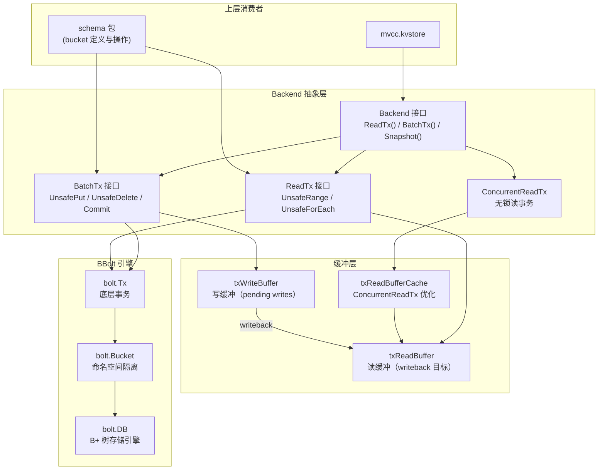
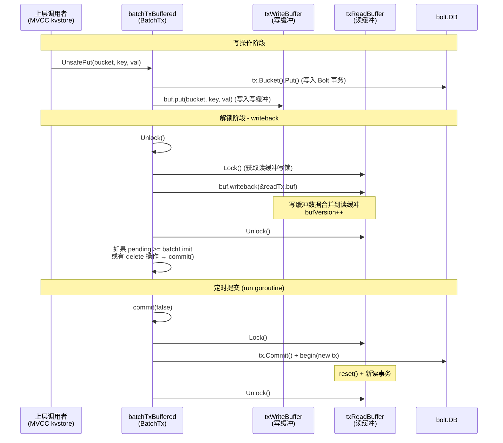
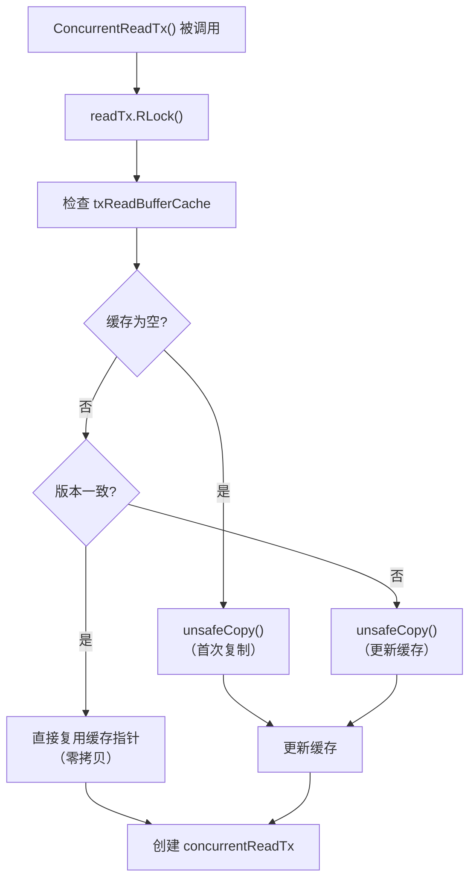
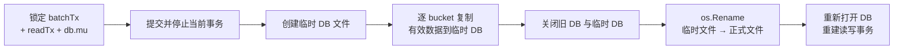

etcd 的持久化存储层并不直接操作底层键值数据库，而是通过一组精心设计的**接口抽象**将存储引擎的实现细节隔离在 `server/storage/backend` 包中。这一抽象层的核心实现基于 **BBolt**（原名 BoltDB）——一个纯 Go 编写、支持 ACID 事务的嵌入式 B+ 树引擎。理解 Backend 层的设计，是掌握 etcd 如何在高并发读写场景下兼顾性能与一致性的关键前提。

Sources: [doc.go](server/storage/backend/doc.go#L15-L16), [backend.go](server/storage/backend/backend.go#L30-L31)

## 架构总览：从接口到实现的三层分离

Backend 包的设计遵循**接口隔离**原则，将存储访问拆分为三个核心角色：`Backend`（生命周期管理者）、`BatchTx`（批量写事务）和 `ReadTx`（读事务）。上层模块（如 MVCC 的 `kvstore`）只依赖这些接口，完全不需要感知 BBolt 的存在。

**设计意图**：接口方法全部以 `Unsafe` 前缀命名（如 `UnsafePut`、`UnsafeRange`），这并非安全缺陷，而是明确的约定——调用者必须在持有适当锁的前提下才能调用这些方法。这种设计避免了不必要的锁复制，将并发控制的职责交给上层统一管理。

Sources: [backend.go](server/storage/backend/backend.go#L49-L75), [batch_tx.go](server/storage/backend/batch_tx.go#L48-L71), [read_tx.go](server/storage/backend/read_tx.go#L28-L37)

## Backend 接口：生命周期与事务工厂

`Backend` 接口是整个存储层的门面（Facade），它不仅管理底层 `bolt.DB` 的打开与关闭，更充当**事务工厂**的角色——通过 `ReadTx()`、`BatchTx()` 和 `ConcurrentReadTx()` 三个方法向上层分发不同语义的事务对象。

| 方法 | 返回类型 | 核心职责 |
|------|---------|---------|
| `ReadTx()` | `ReadTx` | 返回当前批处理周期内的同步读事务，需显式加读锁 |
| `BatchTx()` | `BatchTx` | 返回批量写事务，支持 Put/Delete/Commit 操作 |
| `ConcurrentReadTx()` | `ReadTx` | 返回无锁并发读事务，基于缓冲快照实现非阻塞读取 |
| `Snapshot()` | `Snapshot` | 创建数据库快照，用于 Raft 状态传输 |
| `Hash()` | `uint32` | 计算所有 bucket 数据的 CRC32 校验和 |
| `Defrag()` | `error` | 碎片整理，将数据重写到干净的临时文件 |
| `Size()` / `SizeInUse()` | `int64` | 物理分配大小 vs 逻辑使用大小 |
| `Close()` | `error` | 停止批处理循环、提交残余事务并关闭数据库 |

Sources: [backend.go](server/storage/backend/backend.go#L49-L84)

## 配置体系：BackendConfig 与平台差异

Backend 的行为通过 `BackendConfig` 结构体控制，该配置在 `newBackend()` 函数中被转化为 BBolt 的 `bolt.Options`。etcd 对不同操作系统采用了**构建标签（build tag）** 分发的策略来处理平台差异。

| 配置项 | 默认值 | 说明 |
|-------|--------|------|
| `BatchInterval` | 100ms | 批处理定时提交间隔 |
| `BatchLimit` | 10000 | 触发提交的最大 pending 操作数 |
| `MmapSize` | 10 GB（非 Windows） / 0（Windows） | 内存映射区域预分配大小 |
| `BackendFreelistType` | 由平台决定 | BBolt 空闲列表类型 |
| `UnsafeNoFsync` | false | 禁用 fsync（仅用于测试） |
| `Mlock` | false | 防止数据库文件被交换到磁盘 |
| `Timeout` | 0（无限等待） | 获取文件锁的超时时间 |

**Linux 优化**：在 Linux 平台上，etcd 启用了 `syscall.MAP_POPULATE` 标志进行预读，加速全库恢复过程；同时设置 `NoFreelistSync: true` 避免空闲页同步带来的写入延迟。**Windows 限制**：由于 Windows 的 mmap 语义不同——设置非零 `MmapSize` 会导致文件立即分配全部空间——因此 Windows 构建强制将 `mmapSize()` 返回 0。

Sources: [backend.go](server/storage/backend/backend.go#L133-L167), [config_linux.go](server/storage/backend/config_linux.go#L23-L34), [config_windows.go](server/storage/backend/config_windows.go#L21-L26), [config_default.go](server/storage/backend/config_default.go#L21-L23)

## 事务模型：双层缓冲的批量提交机制

etcd 的 Backend 层没有采用"每次写操作都提交事务"的朴素策略，而是引入了**双层缓冲**机制来批量聚合写操作，显著降低 BBolt 事务提交的频率。这一机制涉及三个关键数据结构的协作。

### 核心数据流

**batchTxBuffered** 是 `BatchTx` 的实际实现，它内嵌了 `batchTx`（直接操作 BBolt 事务）并额外维护一个 `txWriteBuffer`。每次写操作（如 `UnsafePut`）会同时写入两个目标：BBolt 事务和写缓冲。当 `Unlock()` 被调用时，写缓冲的内容被 **writeback**（回写）到读事务的 `txReadBuffer` 中，使得后续的读操作能够立即看到尚未提交的数据。

Sources: [batch_tx.go](server/storage/backend/batch_tx.go#L290-L406), [tx_buffer.go](server/storage/backend/tx_buffer.go#L42-L116)

### 写缓冲（txWriteBuffer）与读缓冲（txReadBuffer）

`txWriteBuffer` 在 `bucket2seq` 映射中跟踪每个 bucket 是否为**顺序写入模式**。顺序写入（`putSeq`）对应 Key bucket 中单调递增的 revision 键，它允许 BBolt 将 `FillPercent` 设为 0.9 以延迟页面分裂，提升空间利用率。非顺序写入（`put`）在 writeback 时需要对缓冲中的数据进行排序和去重（`dedupe`），确保键的有序性。

`txReadBuffer` 通过 `bufVersion` 字段实现版本跟踪。每次 writeback 递增版本号，`ConcurrentReadTx` 利用此版本号判断缓存是否过期，从而决定是否需要复制缓冲。`bucketBuffer` 是底层数据结构，初始容量为 512 个键值对，采用 1.5 倍扩容策略。

Sources: [tx_buffer.go](server/storage/backend/tx_buffer.go#L25-L260)

### 何时触发提交

提交动作由两个条件驱动，取先到达者：**时间驱动**——后台 `run` goroutine 以 `BatchInterval`（默认 100ms）为周期检查 pending 数量；**数量驱动**——在 `batchTx.Unlock()` 时检查 `pending >= batchLimit`（默认 10000）。此外，**存在删除操作时立即提交**——因为与 Put 不同，Delete 操作没有对应的缓冲机制，如果不立即提交，后续读取可能看到已删除的旧数据，破坏线性一致性。

Sources: [backend.go](server/storage/backend/backend.go#L441-L457), [batch_tx.go](server/storage/backend/batch_tx.go#L308-L340)

## 读事务：同步读与并发读

Backend 提供两种读事务语义，对应不同的并发场景。

### readTx（同步读事务）

`readTx` 内嵌 `baseReadTx`，需要调用者显式 `RLock()/RUnlock()`。它的 `UnsafeRange` 方法首先在 `txReadBuffer`（已 writeback 的未提交数据）中查找，如果在缓冲中已满足 limit 则直接返回；否则回退到 BBolt 的 `bolt.Tx` 中继续查找，并将两部分结果合并。这种**缓冲优先**的策略避免了对 BBolt 事务的频繁访问。

`baseReadTx` 的 `UnsafeForEach` 方法采用了**去重遍历**策略：先从缓冲中收集所有键建立去重集合，然后遍历 BBolt 数据时跳过已存在于缓冲中的键，最后再遍历缓冲中的数据调用 visitor 回调。这保证了每个键只被访问一次，且总是返回最新版本。

Sources: [read_tx.go](server/storage/backend/read_tx.go#L40-L122)

### concurrentReadTx（无锁并发读事务）

`concurrentReadTx` 是 etcd 在 PR #10523 中引入的优化，它的 `RLock()` 和 `Unlock()` 都是空操作——不需要任何锁。它通过在创建时**快照**当前 `readTx` 的 `txReadBuffer` 来实现无锁读取。关键在于 `txReadBufferCache` 的缓存优化：如果缓存的 `bufVersion` 与当前读缓冲一致，直接复用缓存指针，避免了代价高昂的 `unsafeCopy()` 操作。

Sources: [backend.go](server/storage/backend/backend.go#L279-L352), [read_tx.go](server/storage/backend/read_tx.go#L140-L151)

## Bucket 体系：Schema 层的命名空间管理

etcd 并不直接使用 BBolt 的原始 bucket API，而是在 `server/storage/schema` 包中定义了一套**类型安全的 bucket 常量**。每个 bucket 都实现了 `backend.Bucket` 接口，包含唯一 ID、字节切片名称和 `IsSafeRangeBucket` 标记。

| Bucket 常量 | BBolt 名称 | ID | SafeRange | 用途 |
|-------------|-----------|-----|-----------|------|
| `Key` | `"key"` | 1 | ✅ | MVCC 键值数据（revision → KeyValue） |
| `Meta` | `"meta"` | 2 | ❌ | 元数据（consistent_index, term, storageVersion 等） |
| `Lease` | `"lease"` | 3 | ❌ | 租约信息 |
| `Alarm` | `"alarm"` | 4 | ❌ | 告警状态 |
| `Cluster` | `"cluster"` | 5 | ❌ | 集群级配置（版本、降级信息） |
| `Members` | `"members"` | 10 | ❌ | 活跃成员信息 |
| `MembersRemoved` | `"members_removed"` | 11 | ❌ | 已移除成员信息 |
| `Auth` | `"auth"` | 20 | ❌ | 认证开关与修订版本 |
| `AuthUsers` | `"authUsers"` | 21 | ❌ | 用户凭证 |
| `AuthRoles` | `"authRoles"` | 22 | ❌ | 角色定义 |

**SafeRangeBucket** 是一个重要的安全标记：只有标记为 `SafeRange` 的 bucket（目前仅 `Key`）才允许使用 `UnsafeRange` 进行多键范围查询。对于非 SafeRange 的 bucket，范围查询被限制为单键查找（`limit=1`），因为这些 bucket 中同一键可能被多次覆写，范围查询可能返回重复键。

Sources: [bucket.go](server/storage/schema/bucket.go#L24-L70), [batch_tx.go](server/storage/backend/batch_tx.go#L31-L46), [read_tx.go](server/storage/backend/read_tx.go#L78-L88)

## Hooks 机制：事务生命周期的扩展点

Backend 的 Hooks 接口提供了在事务提交前注入自定义逻辑的能力。当前唯一的 Hook 点是 `OnPreCommitUnsafe`，它在每次 `batchTxBuffered.commit()` 中、BBolt 事务实际提交之前被调用。

etcdserver 层通过 `BackendHooks` 结构体实现了这一接口，在 `OnPreCommitUnsafe` 中执行两个关键操作：**持久化 ConsistentIndex**（确保已应用的 Raft 日志索引被写入 Meta bucket）和**条件性保存 ConfState**（当集群配置状态发生变更时写入）。这保证了即使在批处理提交的间隔内发生崩溃，已确认的状态变更也不会丢失。

Sources: [hooks.go](server/storage/backend/hooks.go#L17-L36), [hooks.go](server/storage/backend/hooks.go#L1-L37), [hooks.go](server/storage/hooks.go#L28-L53), [batch_tx.go](server/storage/backend/batch_tx.go#L361-L366)

## 碎片整理（Defrag）：在线重建数据库文件

随着大量键值对的写入和删除，BBolt 的数据库文件会产生内部碎片——已删除数据占用的页面被标记为空闲但不会自动归还给操作系统。`Defrag()` 方法通过**重建策略**解决这一问题：创建一个临时数据库文件，逐 bucket 逐键地将有效数据复制到新文件中，然后原子性地替换原文件。

复制过程中采用分批提交策略（每 `defragLimit` = 10000 条记录提交一次），避免单个大事务占用过多内存。`FillPercent` 设为 0.9 以优化顺序写入场景下的页面填充率。

Sources: [backend.go](server/storage/backend/backend.go#L476-L614), [backend.go](server/storage/backend/backend.go#L616-L676)

## 启动集成：从 ServerConfig 到 Backend 实例

Backend 的生命周期从 `etcdserver.bootstrap()` 函数开始。`bootstrapBackend()` 调用 `serverstorage.OpenBackend()`，后者在一个独立 goroutine 中执行 `newBackend()` 以避免阻塞主启动流程（BBolt 的 `bolt.Open()` 可能需要等待文件锁）。启动流程中还会创建 `BackendHooks`、初始化 ConsistentIndexer、创建 Meta bucket，并在存在 WAL 时尝试从快照恢复。

数据库文件的默认路径为 `<dataDir>/member/snap/db`，由 `datadir.ToBackendFileName()` 工具函数生成。

Sources: [bootstrap.go](server/etcdserver/bootstrap.go#L230-L280), [backend.go](server/storage/backend.go#L31-L96), [datadir.go](server/storage/datadir/datadir.go#L26-L28)

## 可观测性：Prometheus 指标

Backend 包通过 Prometheus 暴露了详尽的性能指标，涵盖事务提交的各个阶段：

| 指标名称 | 类型 | 含义 |
|---------|------|------|
| `etcd_disk_backend_commit_duration_seconds` | Histogram | Backend 提交总延迟 |
| `etcd_debugging_disk_backend_commit_rebalance_duration_seconds` | Histogram | BBolt rebalance 阶段延迟 |
| `etcd_debugging_disk_backend_commit_spill_duration_seconds` | Histogram | BBolt spill 阶段延迟 |
| `etcd_debugging_disk_backend_commit_write_duration_seconds` | Histogram | BBolt 写入阶段延迟 |
| `etcd_disk_backend_defrag_duration_seconds` | Histogram | 碎片整理耗时 |
| `etcd_disk_backend_snapshot_duration_seconds` | Histogram | 快照传输耗时 |
| `etcd_disk_defrag_inflight` | Gauge | 是否正在进行碎片整理 |

Sources: [metrics.go](server/storage/backend/metrics.go#L19-L103)

## 一致性验证：Verify 机制

Backend 包内建了运行时一致性验证工具。`VerifyBackendConsistency()` 函数比较 `BatchTx`（写事务视图）和 `ReadTx`（读事务视图）中同一 bucket 的数据，通过 `cmp.Diff` 检测任何不一致。`ValidateCalledInsideApply` 和 `ValidateCalledOutSideApply` 则通过分析调用栈确保锁操作在正确的上下文中被调用（例如，Apply 循环内 vs 外），帮助开发者遵守 etcd 的并发协议。这些验证默认关闭，需通过环境变量 `ETCD_VERIFY=lock` 启用。

Sources: [verify.go](server/storage/backend/verify.go#L27-L117)

---

至此，我们已经完整剖析了 Backend 抽象层如何将 BBolt 的原始事务能力封装为 etcd 所需的批量提交、双层缓冲读写模型。这一层是连接上层 MVCC 存储模型与底层持久化引擎的桥梁。接下来，建议阅读 [Compaction 与 Schema 版本迁移](14-compaction-yu-schema-ban-ben-qian-yi) 了解 etcd 如何管理存储版本的演进，或回顾 [MVCC 存储模型：Revision、KeyIndex 与事务视图](11-mvcc-cun-chu-mo-xing-revision-keyindex-yu-shi-wu-shi-tu) 理解上层如何利用 Backend 接口实现多版本并发控制。