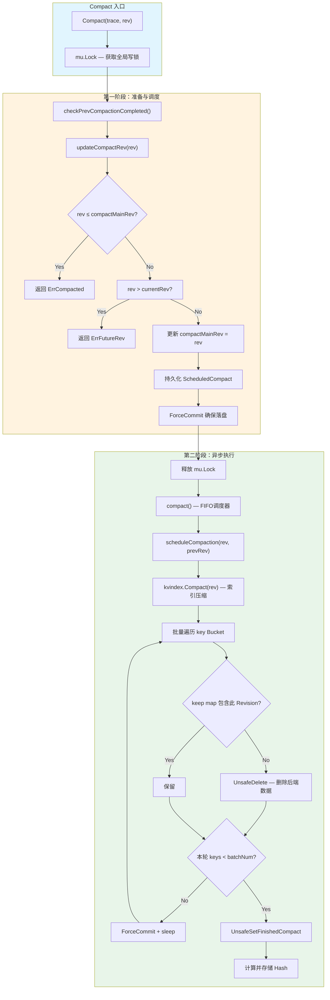
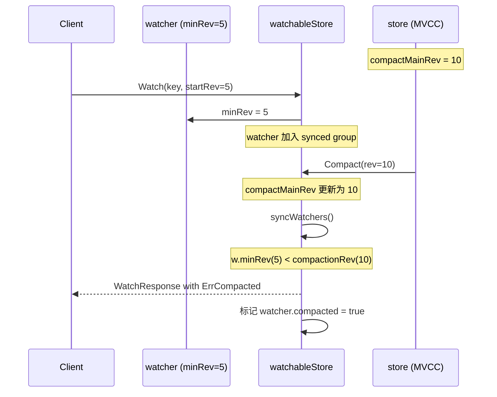
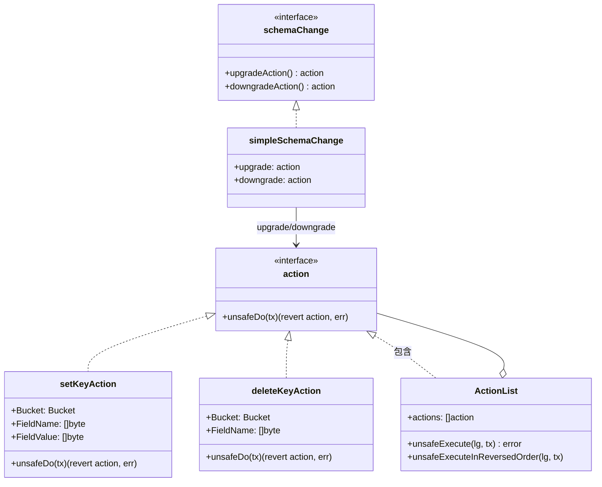

etcd 的 MVCC 存储模型以追加写入（append-only）方式维护键值对的全部历史修订版本。若无清理机制，数据文件将无限增长。**Compaction** 便是 etcd 提供的历史版本裁剪机制——它将指定修订版本之前的冗余数据从内存索引和持久化后端中移除，从而回收空间并加速启动恢复。与之紧密相关的 **Schema 版本迁移** 则是 etcd 自 v3.6 引入的存储格式版本管理框架，确保集群在升级或降级时后端数据结构能安全、可逆地完成转换。两者共同构成了 etcd 存储生命周期的核心治理能力。

Sources: [kv.go](server/storage/mvcc/kv.go#L113-L135), [kvstore.go](server/storage/mvcc/kvstore.go#L36-L45)

---

## Compaction 机制全景

### 核心问题：为什么需要 Compaction

在 etcd 的 MVCC 模型中，每次 `Put`、`Delete` 或事务操作都会生成新的 **Revision**（修订版本）。键值对在 BoltDB 后端的 `key` Bucket 中以 Revision 的字节序作为存储键，这意味着所有历史版本并存于同一存储空间。随着业务运行，旧版本数据不断堆积，导致三个核心问题：

1. **磁盘空间持续膨胀**——即使 key 已被删除，其历史版本仍占空间
2. **启动恢复耗时增长**——`restore` 过程需要遍历全量 key Bucket 重建内存 B-tree 索引
3. **Watch 历史回放效率下降**——unsynced watcher 需要从 minRev 扫描到 currentRev

Compaction 通过裁剪 `compactMainRev` 之前的冗余修订版本来解决这些问题。调用方通过 `KV.Compact(trace, rev)` 接口发起压缩，`rev` 指定了保留的截止修订版本号——所有小于 `rev` 的旧版本数据将被清除。

Sources: [kvstore.go](server/storage/mvcc/kvstore.go#L271-L283), [kv.go](server/storage/mvcc/kv.go#L126-L127)

### 两阶段执行模型

Compaction 的执行被设计为**两个清晰的阶段**：索引压缩（Index Compaction）和后端数据清除（Backend Compaction）。这种分离确保了内存状态与持久化状态的一致性。



**第一阶段**（同步，持有 `mu` 写锁）执行校验与状态更新。`updateCompactRev` 方法首先检查请求的 `rev` 是否合法——若 `rev ≤ compactMainRev` 则返回 `ErrCompacted`（已被压缩），若 `rev > currentRev` 则返回 `ErrFutureRev`（未来版本）。通过校验后，新的 `compactMainRev` 被写入 Meta Bucket 的 `scheduledCompactRev` 键并立即 `ForceCommit` 持久化。这一设计确保了即使压缩过程中进程崩溃，重启后也能通过 `scheduledCompact` 与 `finishedCompact` 的差异检测到未完成的压缩。

**第二阶段**（异步，由 FIFO 调度器驱动）执行实际的数据清理。释放 `mu` 写锁后，压缩任务被提交到 `fifoSched` 调度器异步执行，不阻塞后续的读写请求。

Sources: [kvstore.go](server/storage/mvcc/kvstore.go#L196-L283), [kvstore.go](server/storage/mvcc/kvstore.go#L136-L153)

### 索引压缩：B-tree 的 Generation 裁剪

索引压缩是 `scheduleCompaction` 的第一步，调用 `s.kvindex.Compact(compactMainRev)` 完成。`treeIndex` 内部维护了一棵以 `keyIndex` 为节点的 B-tree，每个 `keyIndex` 包含一个或多个 **generation**（代），代表该 key 从创建到删除的生命周期。

```mermaid
flowchart LR
    subgraph Before["压缩前：key 'foo' 的 keyIndex"]
        G1["generation 0<br/>revs: {1.0, 2.0, 3.0}"]
        G2["generation 1<br/>revs: {5.0, 7.0(tomb)}"]
        G3["generation 2<br/>revs: {9.0, 10.0}"]
    end

    subgraph CompactAt["Compact(rev=7)"]
        direction TB
        S1["定位 generation: genIdx=1"]
        S2["walk 找到 ≤7 的最大 rev: 7.0"]
        S3["将 rev 7.0 加入 keep map"]
        S4["裁剪 gen 0: 整代删除"]
        S5["裁剪 gen 1: 保留 rev 7.0"]
    end

    subgraph After["压缩后"]
        G5["generation 0 (原gen 1)<br/>revs: {7.0(tomb)}"]
        G6["generation 1 (原gen 2)<br/>revs: {9.0, 10.0}"]
    end

    Before --> CompactAt --> After
```



`keyIndex.compact(lg, atRev, available)` 的核心逻辑在 `doCompact` 方法中实现：它首先遍历 generations 找到第一个包含 `atRev` 或在 `atRev` 之后创建的 generation，然后在该 generation 内从最新 revision 向前 **walk**，直到遇到 `rev.Main ≤ atRev` 的 revision，将其加入 `available` 集合（即需要保留的 revision）。压缩后，较早的 generation 被整体移除，当前 generation 中 `revIndex` 之前的 revisions 被截断。

这个 `available` map（即 `keep` map）随后传入后端数据清除阶段，用于区分哪些 BoltDB 中的 revision 记录应当保留、哪些应当删除。

Sources: [index.go](server/storage/mvcc/index.go#L197-L231), [key_index.go](server/storage/mvcc/key_index.go#L215-L282)

### 后端数据清除：分批删除与一致性保证

后端数据清除在 `scheduleCompaction` 中以**分批循环**方式执行。其核心设计参数如下：

| 参数 | 默认值 | 作用 |
|------|--------|------|
| `CompactionBatchLimit` | 1000 | 每批从 key Bucket 读取的最大 key 数量 |
| `CompactionSleepInterval` | 10ms | 每批处理后的休眠间隔 |

每轮循环通过 `tx.UnsafeRange(schema.Key, last, end, batchNum)` 获取一批 key-value 对，逐条检查其 Revision 是否在 `keep` map 中。不在 `keep` map 中的记录被 `UnsafeDelete` 删除，在 `keep` map 中的记录被保留并参与哈希计算。当返回的 keys 数量小于 `batchNum` 时，说明已到达压缩范围的末尾，此时调用 `UnsafeSetFinishedCompact` 将完成的压缩版本号持久化到 Meta Bucket 的 `finishedCompactRev` 键。

每批处理完毕后会立即调用 `s.b.ForceCommit()` 将删除操作落盘，避免写缓冲区过度积聚。批间休眠通过 `time.After(s.cfg.CompactionSleepInterval)` 或 `stopc` 信号退出，实现了压缩过程对在线业务的友好性——不会长时间独占后端事务锁。

Sources: [kvstore_compaction.go](server/storage/mvcc/kvstore_compaction.go#L28-L100), [kvstore.go](server/storage/mvcc/kvstore.go#L41-L45)

### 持久化状态与崩溃恢复

Compaction 的持久化状态存储在 Meta Bucket 的两个特殊键中：

| Meta 键名 | 用途 | 写入时机 |
|-----------|------|----------|
| `scheduledCompactRev` | 记录计划压缩到的目标版本 | `updateCompactRev` 中，压缩开始前 |
| `finishedCompactRev` | 记录已完成压缩的版本 | `scheduleCompaction` 末尾，压缩完成后 |

这一设计实现了**精确一次（exactly-once）** 的崩溃恢复语义。恢复流程（`store.restore()`）在启动时读取这两个值，并结合 `currentRev` 做出调整：

- 若 `scheduledCompact > currentRev`，说明压缩执行中崩溃且 tombstone 已写入但 `finishedCompactRev` 未持久化，此时 `currentRev` 会被调整为 `scheduledCompact` 以修正 revision 回退问题（参见 [issue #17780](https://github.com/etcd-io/etcd/issues/17780)）
- 若 `currentRev < compactMainRev`，说明所有 key 可能都已被压缩删除，`currentRev` 会被调整为 `compactMainRev`

Sources: [store.go](server/storage/mvcc/store.go#L22-L60), [kvstore.go](server/storage/mvcc/kvstore.go#L316-L394)

### Compaction Hash：数据完整性校验

每次成功的压缩都会计算一个 **Compaction Hash**——对压缩范围内保留的所有 key-value 对（从 `prevCompactRev+1` 到 `compactMainRev`）通过 CRC32（Castagnoli 多项式）计算的校验和。这个哈希值被存储在 `hashStorage` 中（最多保留最近 10 个），供 `HashByRev` API 返回，用于集群成员间的数据一致性校验。

值得注意的是，如果前一次压缩被中断（即 `scheduledCompact != finishedCompact`），当前压缩的哈希值将**不被存储**，因为中断意味着哈希覆盖的修订范围不完整。

Sources: [hash.go](server/storage/mvcc/hash.go#L33-L94), [kvstore.go](server/storage/mvcc/kvstore.go#L233-L259), [hash.go](server/storage/mvcc/hash.go#L121-L180)

### Compaction 与 Watch 的交互

压缩操作对 Watch 系统有直接影响。当 watcher 的 `minRev`（最小期望 revision）小于 `compactMainRev` 时，该 watcher 持续关注的历史数据已被清除，无法再提供从 `minRev` 开始的完整事件流。

在 `watchableStore.syncWatchers()` 中，对于 `w.minRev < compactionRev` 的 watcher，系统会跳过其事件发送（而不是直接删除），让其在下一次重试时收到压缩错误响应。在 `cancelWatcher` 路径中，被标记为 `compacted` 的 watcher 会直接从计数器中移除。



Sources: [watchable_store.go](server/storage/mvcc/watchable_store.go#L340-L380), [watchable_store.go](server/storage/mvcc/watchable_store.go#L160-L176)

---

## Schema 版本迁移

### 从存储格式到版本管理

etcd v3.6 引入了**存储版本（Storage Version）** 的概念，用于显式追踪后端数据的 schema 格式。在此之前，etcd 的后端数据格式变更缺乏统一的版本管理，升级过程依赖隐式兼容性。存储版本以 semver 格式（`Major.Minor`，忽略 Patch）记录在 Meta Bucket 的 `storageVersion` 键中，标志着 etcd 向正式的 schema 演化框架迈出了关键一步。

Sources: [version.go](server/storage/schema/version.go#L26-L67), [bucket.go](server/storage/schema/bucket.go#L84-L86)

### Schema 版本检测

`UnsafeDetectSchemaVersion` 函数通过两级策略检测当前后端的 schema 版本：

1. **直接读取** `storageVersion` 键（v3.6+ 后端会设置此键）
2. **间接推断**：若 `storageVersion` 不存在，则检查 `term` 键是否已设置——若 `term > 0` 说明后端来自 v3.5（term 字段自 v3.5 引入），否则返回错误

这意味着 v3.5 后端必须先执行一次 WAL snapshot 确保 `term` 字段被持久化，才能被正确检测为 v3.5 schema 并允许后续升级。v3.4 及更早版本的后端则无法被检测，不再受支持。

Sources: [schema.go](server/storage/schema/schema.go#L81-L108)

### 迁移计划生成

`newPlan(lg, current, target)` 函数将版本迁移分解为一系列**单步迁移（migrationStep）**，每个 step 负责一个 minor 版本的变更。其核心约束如下：

| 约束 | 说明 |
|------|------|
| **Major 版本不变** | 不支持跨 Major 版本迁移（如 3.x → 4.0） |
| **仅逐 Minor 版本迁移** | 从 3.5 到 3.7 需经过 3.5→3.6、3.6→3.7 两个 step |
| **每个 step 有独立的变更集** | 由 `schemaChanges` 映射表定义 |

当前的 `schemaChanges` 映射定义了以下版本变更：

| 版本 | 变更内容 |
|------|----------|
| v3.6 | 新增 `storageVersion` 字段（Meta Bucket） |
| v3.7 | 无变更（空列表） |

每个 step 在**升级**时按变更列表顺序执行 upgrade action，在**降级**时按逆序执行 downgrade action。

Sources: [migration.go](server/storage/schema/migration.go#L29-L51), [schema.go](server/storage/schema/schema.go#L110-L139)

### Action 框架：可逆的原子操作

schema 迁移的执行单元是 **action** 接口。每个 action 的 `unsafeDo` 方法执行变更并返回一个**逆操作（revert action）**，使得在失败时能够回滚已执行的变更。



**`ActionList.unsafeExecute`** 实现了事务性语义：它按顺序执行 action 列表，同时收集每个 action 的 revert 操作。若某一步执行失败，则按逆序执行所有已收集的 revert action 进行回滚。逆序执行失败时直接 `Panic`，因为系统已处于不一致状态。

以 `addNewField` 变更类型为例：升级时执行 `setKeyAction`（写入新字段），降级时执行 `deleteKeyAction`（删除该字段）。`setKeyAction.unsafeDo` 在写入前先读取当前值作为 revert——若字段已存在则 revert 为 `setKeyAction`（恢复原值），若不存在则 revert 为 `deleteKeyAction`（删除新写入的空值）。

Sources: [actions.go](server/storage/schema/actions.go#L23-L93), [changes.go](server/storage/schema/changes.go#L19-L50)

### 降级安全：WAL 版本校验

降级（Downgrade）比升级面临更大的风险——新版写入的 WAL 条目可能包含旧版无法解析的请求类型。为此，`UnsafeMigrate` 在执行降级前增加了 **WAL 版本校验**：

```go
if target.LessThan(current) {
    minVersion := w.MinimalEtcdVersion()
    if minVersion != nil && target.LessThan(*minVersion) {
        return fmt.Errorf("cannot downgrade storage, WAL contains newer entries...")
    }
}
```

`wal.Version` 接口通过 `MinimalEtcdVersion()` 方法扫描 WAL 中的所有条目，返回其中涉及的最高版本需求。若目标版本低于此值，则拒绝降级。这防止了旧版 etcd 在读取新版 WAL 条目时发生不可预测的解析错误。

Sources: [schema.go](server/storage/schema/schema.go#L60-L79), [migration.go](server/storage/schema/migration.go#L93-L104)

### etcdutl migrate：离线迁移工具

`etcdutl migrate` 命令提供了**离线 schema 迁移**能力，适用于数据目录的版本升级或降级：

```bash
# 升级到 v3.6
etcdutl migrate --data-dir /var/lib/etcd --target-version 3.6

# 降级到 v3.5
etcdutl migrate --data-dir /var/lib/etcd --target-version 3.5

# 强制迁移（忽略校验失败，慎用）
etcdutl migrate --data-dir /var/lib/etcd --target-version 3.6 --force
```

其执行流程为：打开 BoltDB 后端 → 检测当前 schema 版本 → 读取 WAL 版本信息 → 调用 `schema.Migrate` 执行迁移计划。`--force` 选项在正常迁移失败时跳过校验，直接设置或清除 `storageVersion` 字段——这仅作为最后手段，可能导致数据不一致。

Sources: [migrate_command.go](etcdutl/etcdutl/migrate_command.go#L34-L172)

### 在线版本迁移：Monitor 驱动

除了离线的 `etcdutl migrate`，etcd 还支持由 **version.Monitor** 驱动的在线存储版本更新。`Monitor.UpdateStorageVersionIfNeeded()` 在 leader 节点上周期性执行，当检测到集群版本与存储版本不一致时，自动触发 `schema.Migrate` 进行在线迁移。

这种机制使得集群升级过程更加自动化：当所有成员升级到新版二进制后，集群版本自动提升，Monitor 检测到差异后触发存储 schema 的在线迁移。

Sources: [monitor.go](server/etcdserver/version/monitor.go#L107-L132)

---

## 存储后端 Bucket 结构

schema 迁移操作的直接目标是 Meta Bucket 中的版本管理字段。以下是 etcd 后端的关键 Bucket 及其关联的 meta 字段版本演化：

| Bucket | ID | 用途 | 关键字段 |
|--------|-----|------|----------|
| `key` | 1 | MVCC 键值存储（safe range） | Revision → KeyValue |
| `meta` | 2 | 元数据管理 | `consistent_index`, `term`, `scheduledCompactRev`, `finishedCompactRev`, `storageVersion` |
| `lease` | 3 | 租约信息 | LeaseID → Lease |
| `cluster` | 5 | 集群信息 | `clusterVersion`, `downgrade` |
| `members` | 10 | 成员信息 | MemberID → Member |
| `auth` | 20 | 认证开关 | `authEnabled`, `authRevision` |

**Meta 字段的版本演化**：

| 字段 | 引入版本 | 用途 |
|------|----------|------|
| `consistent_index` | Pre v3.5 | Raft 应用索引，用于防止重复应用 |
| `scheduledCompactRev` | Pre v3.5 | 计划压缩的 revision |
| `finishedCompactRev` | Pre v3.5 | 已完成压缩的 revision |
| `term` | v3.5 | Raft term，用于 schema 版本推断 |
| `confState` | v3.5 | Raft 配置状态 |
| `storageVersion` | v3.6 | 显式存储 schema 版本 |

Sources: [bucket.go](server/storage/schema/bucket.go#L24-L96)

---

## 关键监控指标

Compaction 过程暴露了以下 Prometheus 指标，可用于监控压缩性能和识别潜在问题：

| 指标名 | 类型 | 含义 |
|--------|------|------|
| `etcd_debugging_mvcc_index_compaction_pause_duration_milliseconds` | Histogram | 索引压缩耗时（B-tree 操作） |
| `etcd_debugging_mvcc_db_compaction_pause_duration_milliseconds` | Histogram | 单批后端数据清除耗时 |
| `etcd_debugging_mvcc_db_compaction_total_duration_milliseconds` | Histogram | 整次压缩总耗时 |
| `etcd_debugging_mvcc_db_compaction_last` | Gauge | 最近一次压缩的 Unix 时间戳 |
| `etcd_debugging_mvcc_db_compaction_keys_total` | Counter | 已压缩删除的 key 总数 |
| `etcd_debugging_mvcc_compact_revision` | Gauge | 最近一次压缩的 revision |

Sources: [metrics.go](server/storage/mvcc/metrics.go#L114-L169), [metrics.go](server/storage/mvcc/metrics.go#L264-L278)

---

## 延伸阅读

- [MVCC 存储模型：Revision、KeyIndex 与事务视图](11-mvcc-cun-chu-mo-xing-revision-keyindex-yu-shi-wu-shi-tu)——理解 Revision、Generation、keyIndex 的数据结构，是掌握 Compaction 索引裁剪逻辑的前提
- [Backend 抽象与 BoltDB 集成](13-backend-chou-xiang-yu-boltdb-ji-cheng)——Compaction 的后端数据清除直接操作 BatchTx，理解 Backend 层的锁模型和事务机制有助于分析并发安全
- [Watch 机制：事件推送、缓存层与一致性保证](17-watch-ji-zhi-shi-jian-tui-song-huan-cun-ceng-cache-mo-kuai-yu-zhi-xing-bao-zheng)——深入理解 Compaction 对 Watch 系统的影响及 watcher 的生命周期管理
- [构建脚本、发布流程与 CI/CD](26-gou-jian-jiao-ben-fa-bu-liu-cheng-yu-ci-cd-makefile-yu-scripts)——Schema 迁移是版本发布流程中的重要环节