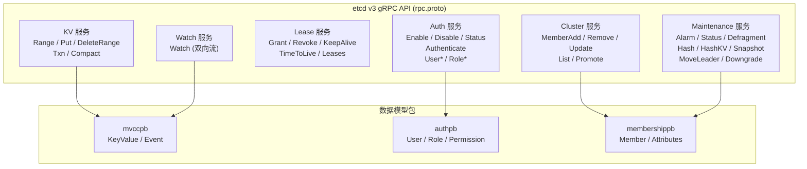

etcd 的 `api` 模块（`go.etcd.io/etcd/api/v3`）是整个分布式键值存储系统的**契约层**——它定义了客户端与服务器之间所有的通信协议、数据模型和错误语义。作为一个独立的 Go Module，`api` 不依赖 `server` 或 `client`，确保了接口定义与实现之间的严格解耦。本页将系统性地剖析该模块的目录结构、六组 gRPC 服务契约、跨包数据模型、版本标注机制以及代码生成流水线，帮助开发者在阅读上层实现之前建立清晰的 API 心智模型。

Sources: [go.mod](api/go.mod#L1-L15)

## 模块目录结构与职责划分

`api` 模块采用**按领域拆包**的组织策略，每个子包对应一个独立的 Proto 源文件及其生成的 Go 代码。这种设计使得各领域的消息类型可以独立演进，同时通过 `rpc.proto` 的 `import` 语句在服务层聚合。

```
api/                              # go.etcd.io/etcd/api/v3
├── etcdserverpb/                 # gRPC 服务定义 + 请求/响应消息
│   ├── rpc.proto                 # 核心 API: KV / Watch / Lease / Cluster / Maintenance / Auth
│   ├── rpc.pb.go                 # rpc.proto 的消息类型生成代码
│   ├── rpc_grpc.pb.go            # gRPC Client/Server 接口 + 注册函数
│   ├── gw/rpc.pb.gw.go           # gRPC-Gateway (RESTful JSON 代理)
│   ├── raft_internal.proto       # Raft 内部请求 (InternalRaftRequest)
│   ├── raft_internal.pb.go       # 生成代码
│   ├── raft_internal_stringer.go # 自定义日志格式化（脱敏 value/password）
│   └── etcdserver.proto          # 元数据消息 (proto2 格式)
├── mvccpb/                       # MVCC 数据模型
│   ├── kv.proto                  # KeyValue + Event 消息
│   └── kv.pb.go
├── authpb/                       # 认证数据模型
│   ├── auth.proto                # User / Role / Permission 消息
│   ├── auth.pb.go
│   └── deprecated.go             # 向后兼容别名 (v3.8 移除)
├── membershippb/                 # 集群成员管理模型
│   ├── membership.proto          # Member / RaftAttributes / ClusterVersionSet 等
│   └── membership.pb.go
├── versionpb/                    # 版本标注 Proto 扩展
│   ├── version.proto             # etcd_version_msg / etcd_version_field 等自定义选项
│   └── version.pb.go
├── v3rpc/rpctypes/               # 错误类型 + gRPC 元数据常量
│   ├── error.go                  # 服务端/客户端错误码映射 (约 60 种错误)
│   ├── md.go                     # gRPC metadata 键名定义
│   └── metadatafields.go         # Token 字段名常量
└── version/                      # 版本号常量与解析
    └── version.go                # Version / APIVersion / AllVersions 等
```

模块间的依赖关系清晰地反映在 Proto 文件的 `import` 链中：`rpc.proto` 是聚合根，它导入 `mvccpb/kv.proto`（数据模型）、`authpb/auth.proto`（权限模型）、`versionpb/version.proto`（版本标注）；`raft_internal.proto` 在 `rpc.proto` 基础上追加导入了 `membershippb/membership.proto`。这种分层确保底层消息包（如 `mvccpb`、`authpb`）可以独立使用，而无需了解上层的服务定义。

Sources: [rpc.proto](api/etcdserverpb/rpc.proto#L1-L11), [raft_internal.proto](api/etcdserverpb/raft_internal.proto#L1-L8), [kv.proto](api/mvccpb/kv.proto#L1-L5), [auth.proto](api/authpb/auth.proto#L1-L5), [membership.proto](api/membershippb/membership.proto#L1-L7), [version.proto](api/versionpb/version.proto#L1-L7), [version.go](api/version/version.go#L26-L51)

## 六大 gRPC 服务全景

`rpc.proto` 定义了 etcd v3 API 的六个 gRPC 服务，每个服务通过 `google.api.http` 注解同时暴露 RESTful JSON 端点（由 gRPC-Gateway 实现）。下面先用一张架构图展示服务的整体布局，然后逐一展开关键设计。



### 服务概览与 RPC 方法分类

| 服务 | 方法数 | 通信模式 | 核心职责 |
|------|--------|----------|----------|
| **KV** | 5 | 全部 Unary | 键值 CRUD + 事务 + 压缩 |
| **Watch** | 1 | Bidi Streaming | 事件订阅与流式推送 |
| **Lease** | 5 | 3 Unary + 1 Bidi Stream | 租约生命周期管理 |
| **Cluster** | 5 | 全部 Unary | 成员增删改查 + Learner 提升 |
| **Maintenance** | 8 | 7 Unary + 1 Server Stream | 运维：告警、碎片整理、快照、降级 |
| **Auth** | 16 | 全部 Unary | 认证与 RBAC 权限管理 |

Sources: [rpc.proto](api/etcdserverpb/rpc.proto#L33-L407)

### KV 服务：键值操作与事务引擎

KV 服务是 etcd 最核心的 API 入口，提供五种操作。**Range** 支持前缀查询、范围查询和精确查找，通过 `key` + `range_end` 定义区间语义：`range_end` 为空表示精确匹配，`range_end` 为 `\0` 表示所有大于等于 `key` 的键，`range_end` 为 `key+1` 表示前缀匹配。Range 还支持排序（按 KEY / VERSION / CREATE / MOD / VALUE）、分页（`limit`）和修订版过滤（`min_mod_revision` / `max_mod_revision` 等）。**Put** 和 **DeleteRange** 是修改操作，均支持 `prev_kv` 标志返回变更前的键值对。**Txn** 实现了条件事务，其设计灵感来自 Google Spanner 的 MultiOp 原语——由 `compare`（条件谓词列表）、`success`（条件为真时的操作列表）和 `failure`（条件为假时的操作列表）三部分组成，支持嵌套事务。**Compact** 用于压缩事件历史，回收存储空间。

```
message TxnRequest {
  repeated Compare compare = 1;     // 条件谓词（合取）
  repeated RequestOp success = 2;   // 成功分支
  repeated RequestOp failure = 3;   // 失败分支
}
```

Compare 消息支持四种比较目标（VERSION / CREATE / MOD / VALUE / LEASE）和四种比较运算（EQUAL / GREATER / LESS / NOT_EQUAL），`range_end` 字段（v3.3 引入）允许对范围内的所有键执行同一比较。RequestOp 是一个 `oneof` 联合类型，可包含 Range / Put / DeleteRange / Txn 请求，递归支持嵌套事务。

Sources: [rpc.proto](api/etcdserverpb/rpc.proto#L33-L82), [rpc.proto (RangeRequest)](api/etcdserverpb/rpc.proto#L426-L495), [rpc.proto (TxnRequest)](api/etcdserverpb/rpc.proto#L640-L668), [rpc.proto (Compare)](api/etcdserverpb/rpc.proto#L594-L638)

### Watch 服务：双向流式事件推送

Watch 是 etcd 唯一使用双向流的服务。客户端通过输入流发送 `WatchCreateRequest`（创建观察者）、`WatchCancelRequest`（取消观察者）或 `WatchProgressRequest`（请求进度通知），服务端通过输出流推送 `WatchResponse`。一个 Watch RPC 连接可以同时管理多个观察者（通过 `watch_id` 区分），服务端以多路复用方式推送事件。创建观察者时可指定 `start_revision`（从哪个修订版开始）、`progress_notify`（定期发送空响应以指示进度）和 `filters`（过滤 PUT 或 DELETE 事件）。v3.4 引入的 `fragment` 标志允许将大型修订版拆分为多个 WatchResponse 分片传输。

Sources: [rpc.proto (Watch service)](api/etcdserverpb/rpc.proto#L84-L96), [rpc.proto (WatchCreateRequest)](api/etcdserverpb/rpc.proto#L763-L810), [rpc.proto (WatchResponse)](api/etcdserverpb/rpc.proto#L824-L859)

### Lease 服务：租约生命周期

Lease 服务管理租约的创建、撤销、续约和查询。**LeaseGrant** 创建一个指定 TTL 的租约，**LeaseRevoke** 立即撤销租约并删除所有关联键。**LeaseKeepAlive** 使用双向流进行心跳续约——客户端持续发送 `LeaseKeepAliveRequest`，服务端响应更新后的 TTL。**LeaseTimeToLive** 查询租约剩余时间和关联键列表，**LeaseLeases** 列出所有现有租约。Lease 的概念贯穿 etcd 的多个子系统：KV 的 Put 操作通过 `lease` 字段关联租约，租约过期时自动触发键的删除事件。

Sources: [rpc.proto (Lease service)](api/etcdserverpb/rpc.proto#L98-L153), [rpc.proto (LeaseGrant)](api/etcdserverpb/rpc.proto#L861-L878), [rpc.proto (LeaseKeepAlive)](api/etcdserverpb/rpc.proto#L916-L930)

### Cluster 服务：成员管理与动态重配置

Cluster 服务支持集群成员的增删改查和 Learner 提升。**MemberAdd** 支持添加普通成员或 Learner（通过 `isLearner` 字段），**MemberPromote** 将 Learner 提升为投票成员。每个响应都包含操作后的完整成员列表（`members` 字段），方便客户端同步集群视图。`MemberListRequest` 的 `linearizable` 标志（v3.5 引入）控制是否需要线性一致性读取。

Sources: [rpc.proto (Cluster service)](api/etcdserverpb/rpc.proto#L155-L195), [rpc.proto (MemberAddRequest)](api/etcdserverpb/rpc.proto#L987-L994)

### Maintenance 服务：运维操作集

Maintenance 是方法最多的服务（8 个），涵盖运维相关的所有操作。**Alarm** 管理集群告警（NOSPACE / CORRUPT），**Status** 返回节点状态信息（版本、DB 大小、Leader ID、Raft 索引等），**Defragment** 触发后端数据库碎片整理。**Hash** 和 **HashKV** 用于数据一致性校验——前者哈希整个后端，后者只哈希 MVCC 键空间直到指定修订版。**Snapshot** 以服务端流的方式传输整个后端数据库快照。**MoveLeader** 请求当前 Leader 将领导权转移给指定节点。**Downgrade**（v3.5 引入）支持集群版本降级的验证、启用和取消。

Sources: [rpc.proto (Maintenance service)](api/etcdserverpb/rpc.proto#L197-L269)

### Auth 服务：认证与 RBAC

Auth 服务提供 16 个方法，实现了完整的 RBAC（基于角色的访问控制）系统。核心流程为：通过 `AuthEnable` 启用认证 → `Authenticate` 获取 Token → 后续请求携带 Token 进行身份验证。用户管理（UserAdd / UserGet / UserList / UserDelete / UserChangePassword）和角色管理（RoleAdd / RoleGet / RoleList / RoleDelete）各自独立，通过 `UserGrantRole` / `UserRevokeRole` 建立用户-角色关联，通过 `RoleGrantPermission` / `RoleRevokePermission` 为角色授予或撤销键范围权限。

Sources: [rpc.proto (Auth service)](api/etcdserverpb/rpc.proto#L271-L407)

## 数据模型层：mvccpb、authpb 与 membershippb

三大数据模型包分别定义了各自领域的核心消息类型，被服务层消息引用而非内联。

### mvccpb：键值与事件

`KeyValue` 是 etcd 最基础的数据单元，包含六个字段：`key`（字节）、`create_revision`（创建修订版）、`mod_revision`（最后修改修订版）、`version`（版本号，删除后归零）、`value`（字节）和 `lease`（关联的租约 ID）。`Event` 包装 KeyValue 变更事件，包含事件类型（PUT / DELETE）、当前键值对和变更前的键值对（`prev_kv`）。

Sources: [kv.proto](api/mvccpb/kv.proto#L1-L44)

### authpb：用户、角色与权限

`User` 包含用户名、密码、角色列表和选项（如 `no_password`）。`Role` 包含角色名和权限列表。`Permission` 定义了单个权限实体，包含权限类型（READ / WRITE / READWRITE）和键范围（`key` + `range_end`）。

Sources: [auth.proto](api/authpb/auth.proto#L1-L37)

### membershippb：集群成员拓扑

`Member` 消息包含成员 ID、`RaftAttributes`（peer URLs 和 learner 标志）和 `Attributes`（名称和 client URLs）。`ClusterVersionSetRequest`、`ClusterMemberAttrSetRequest` 和 `DowngradeInfoSetRequest` 是集群元数据变更请求，通过 Raft 日志传播以实现集群范围的一致性更新。

Sources: [membership.proto](api/membershippb/membership.proto#L1-L52)

## Raft 内部请求：InternalRaftRequest

`raft_internal.proto` 定义了 `InternalRaftRequest`——这是一个 `oneof` 联合类型，封装了所有需要通过 Raft 共识协议传播的请求。它将 `rpc.proto` 中的请求类型（Range、Put、DeleteRange、Txn、Compaction、LeaseGrant、LeaseRevoke、Alarm、各种 Auth 操作）以及 `membershippb` 中的集群管理请求统一为一个消息，字段编号采用分段策略：常规操作 3-11，认证操作 1000-1200，成员管理操作 1300，测试操作 9900。

与面向客户端的 `rpc.proto` 不同，`InternalRaftRequest` 携带 `RequestHeader`（包含请求 ID、用户名和 auth revision），并且包含 `InternalAuthenticateRequest`（比公开的 `AuthenticateRequest` 多了 `simple_token` 字段，由 API 层生成、不应暴露给客户端）。`raft_internal_stringer.go` 为 `InternalRaftRequest` 提供了自定义的日志格式化实现——对 Put 的 value 字段替换为 `value_size`，对密码字段进行脱敏，避免在 Raft 日志中泄露敏感数据。

Sources: [raft_internal.proto](api/etcdserverpb/raft_internal.proto#L1-L86), [raft_internal_stringer.go](api/etcdserverpb/raft_internal_stringer.go#L26-L73)

## 统一响应头：ResponseHeader

几乎所有 RPC 响应都包含一个 `ResponseHeader`，提供四个关键元数据字段：`cluster_id`（集群 ID）、`member_id`（响应节点 ID）、`revision`（请求被应用时的键值存储修订版）和 `raft_term`（请求被应用时的 Raft 任期）。这个设计使得客户端无需额外请求即可获取集群状态信息，是实现线性一致性读和 Watch 进度跟踪的基础。

```
message ResponseHeader {
  uint64 cluster_id = 1;
  uint64 member_id  = 2;
  int64  revision   = 3;
  uint64 raft_term  = 4;
}
```

Sources: [rpc.proto (ResponseHeader)](api/etcdserverpb/rpc.proto#L409-L424)

## 版本标注机制：versionpb

etcd 在 Proto 层面引入了四个自定义选项来追踪 API 的演进历史：`etcd_version_msg`（消息级别）、`etcd_version_field`（字段级别）、`etcd_version_enum`（枚举级别）和 `etcd_version_enum_value`（枚举值级别）。这些标注通过扩展 `google.protobuf.MessageOptions`、`FieldOptions`、`EnumOptions` 和 `EnumValueOptions` 实现。

```
// 示例：标注消息和字段
message RangeRequest {
  option (versionpb.etcd_version_msg) = "3.0";
  ...
  int64 min_mod_revision = 10 [(versionpb.etcd_version_field)="3.1"];
  ...
}
```

这一机制的核心价值在于**WAL 兼容性**——通过读取标注信息，etcd 可以确定解析某条 WAL 记录所需的最低版本。`tools/proto-annotations` 工具会提取所有标注并与 `scripts/etcd_version_annotations.txt` 基准文件进行对比验证，CI 流水线通过 `verify_proto_annotations.sh` 确保新增的 Proto 定义都正确标注了版本信息。

Sources: [version.proto](api/versionpb/version.proto#L1-L27), [root.go](tools/proto-annotations/cmd/root.go#L24-L59), [etcd_version.go](tools/proto-annotations/cmd/etcd_version.go#L43-L96), [verify_proto_annotations.sh](scripts/verify_proto_annotations.sh#L1-L34)

## gRPC 错误体系：rpctypes

`v3rpc/rpctypes` 包定义了 etcd 完整的 gRPC 错误码映射，分为服务端和客户端两套。服务端使用 `status.Error()` 创建标准 gRPC 错误（如 `ErrGRPCEmptyKey = status.Error(codes.InvalidArgument, "etcdserver: key is not provided")`），客户端通过 `Error()` 函数将 gRPC status 错误转换为 `EtcdError` 结构体（包含 `Code()` 和 `Error()` 方法）。

下表按 gRPC 状态码分类列出了主要错误：

| gRPC Code | 错误示例 | 语义 |
|-----------|----------|------|
| `InvalidArgument` | `ErrGRPCEmptyKey`, `ErrGRPCAuthFailed` | 请求参数不合法 |
| `OutOfRange` | `ErrGRPCCompacted`, `ErrGRPCFutureRev` | 请求的修订版已被压缩或来自未来 |
| `NotFound` | `ErrGRPCLeaseNotFound`, `ErrGRPCMemberNotFound` | 资源不存在 |
| `FailedPrecondition` | `ErrGRPCUserAlreadyExist`, `ErrGRPCNoLeader` | 操作的前置条件不满足 |
| `PermissionDenied` | `ErrGRPCPermissionDenied` | 权限不足 |
| `Unauthenticated` | `ErrGRPCInvalidAuthToken` | 认证失败 |
| `ResourceExhausted` | `ErrGRPCNoSpace`, `ErrGRPCRequestTooManyRequests` | 资源耗尽 |
| `Unavailable` | `ErrGRPCNoLeader`, `ErrGRPCStopped`, `ErrGRPCTimeout` | 服务不可用 |
| `DataLoss` | `ErrGRPCCorrupt` | 数据损坏 |
| `Canceled` | `ErrGRPCWatchCanceled` | 操作被取消 |

`md.go` 定义了 gRPC 元数据键名常量（`MetadataRequireLeaderKey = "hasleader"` 和 `MetadataClientAPIVersionKey = "client-api-version"`），用于在 gRPC 调用的 metadata 中传递 Leader 亲和性和 API 版本信息。`metadatafields.go` 定义了 Token 在 gRPC 和 Swagger 上下文中的字段名映射。

Sources: [error.go](api/v3rpc/rpctypes/error.go#L22-L280), [md.go](api/v3rpc/rpctypes/md.go#L17-L22), [metadatafields.go](api/v3rpc/rpctypes/metadatafields.go#L17-L24)

## 代码生成流水线

Proto 到 Go 代码的转换由 `scripts/genproto.sh` 编排，使用以下工具链：

| 工具 | 用途 |
|------|------|
| `protoc-gen-gofast` (gogo/protobuf) | 生成高性能 `.pb.go` 消息代码 |
| `protoc-gen-go-grpc` | 生成 `_grpc.pb.go` 客户端/服务端接口 |
| `protoc-gen-grpc-gateway` | 生成 `gw/rpc.pb.gw.go` RESTful 代理 |
| `protoc-gen-openapiv2` | 生成 Swagger/OpenAPI JSON 规范 |

生成的 `rpc_grpc.pb.go` 为每个服务提供四种构件：**Client 接口**（如 `KVClient`）+ 具体实现（如 `kVClient`），**Server 接口**（如 `KVServer`）+ `Unimplemented` 嵌入基类，**注册函数**（如 `RegisterKVServer`），以及 **ServiceDesc** 描述符。值得注意的是，Watch 服务使用泛型双向流接口 `grpc.BidiStreamingServer[WatchRequest, WatchResponse]`，而 Lease 的 `LeaseKeepAlive` 使用 `grpc.BidiStreamingClient`。

gRPC-Gateway 生成的代码放在 `etcdserverpb/gw/` 子包中（包名为 `gw`），通过后处理脚本将包名和导入路径从原始 `etcdserverpb` 重写为正确的模块路径。这一隔离策略确保客户端库不会意外引入 Gateway 依赖。

Sources: [genproto.sh](scripts/genproto.sh#L1-L189), [rpc_grpc.pb.go](api/etcdserverpb/rpc_grpc.pb.go#L1-L53), [rpc_grpc.pb.go (Watch)](api/etcdserverpb/rpc_grpc.pb.go#L304-L399)

## API 版本演进与兼容性策略

etcd 的 API 演进遵循严格的向后兼容原则。新增字段总是通过 `versionpb.etcd_version_field` 标注引入版本，Proto3 的默认值语义确保旧客户端不会因为新字段而崩溃。废弃的类型通过 `deprecated.go` 文件提供别名（如 `mvccpb.PUT` 是 `Event_PUT` 的别名，计划在 v3.8 移除）。`etcdserver.proto` 使用 proto2 语法（唯一使用 proto2 的文件），其 `Metadata` 消息的 `optional` 字段提供了显式的 presence 语义。

`api/version/version.go` 维护了从 V3.0 到 V4.0 的所有版本常量，当前开发版本为 `3.7.0-alpha.0`。这些版本常量不仅用于运行时版本比较，还与 Proto 标注系统联动——`tools/proto-annotations` 工具验证所有标注的版本号都是合法的 `major.minor` 格式（不允许 patch、预发布或元数据后缀）。

Sources: [deprecated.go (authpb)](api/authpb/deprecated.go#L17-L27), [deprecated.go (mvccpb)](api/mvccpb/deprecated.go#L17-L24), [etcdserver.proto](api/etcdserverpb/etcdserver.proto#L1-L10), [version.go](api/version/version.go#L26-L51)

## 从 API 契约到实现

理解 `api` 模块的契约定义后，自然的问题是如何将这份契约与实际的服务端实现和客户端使用对接。etcd 的 **EtcdServer** 通过实现 `KVServer`、`WatchServer` 等接口来履行 gRPC 契约，而 [EtcdServer 核心实现：提案提交、Apply 循环与线性一致性读](8-etcdserver-he-xin-shi-xian-ti-an-ti-jiao-apply-xun-huan-yu-xian-xing-zhi-xing-du) 详细解析了从 RPC 入口到 Raft 提案的完整路径。客户端侧，[Go 客户端库（client/v3）：连接管理、重试与负载均衡](16-go-ke-hu-duan-ku-client-v3-lian-jie-guan-li-zhong-shi-yu-fu-zai-jun-heng) 展示了如何基于生成的 `KVClient` 接口构建具有自动重试和端点切换能力的生产级客户端。如果关注事件推送机制的具体实现，[Watch 机制：事件推送、缓存层（cache 模块）与一致性保证](17-watch-ji-zhi-shi-jian-tui-song-huan-cun-ceng-cache-mo-kuai-yu-zhi-xing-bao-zheng) 将深入 `WatchServer` 接口的流式实现细节。