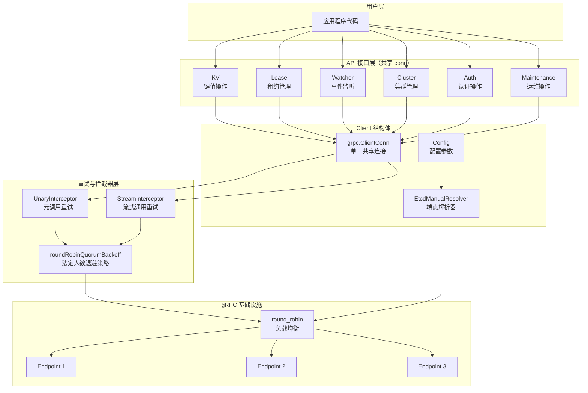
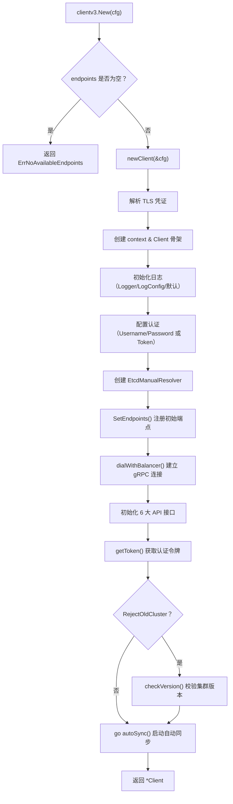
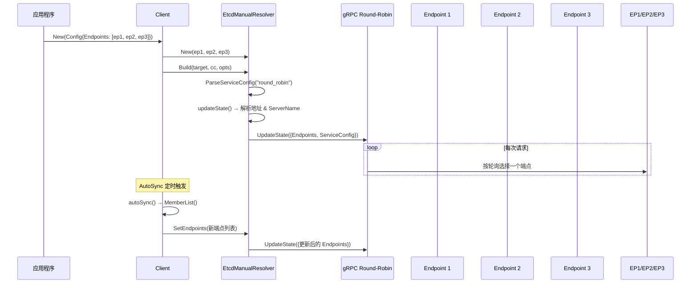
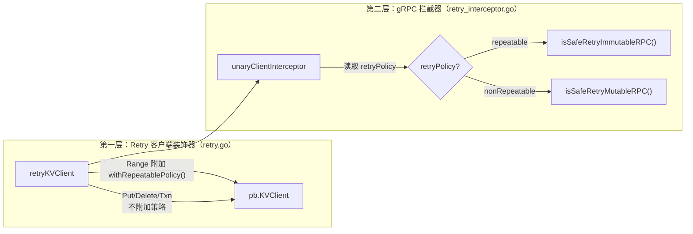
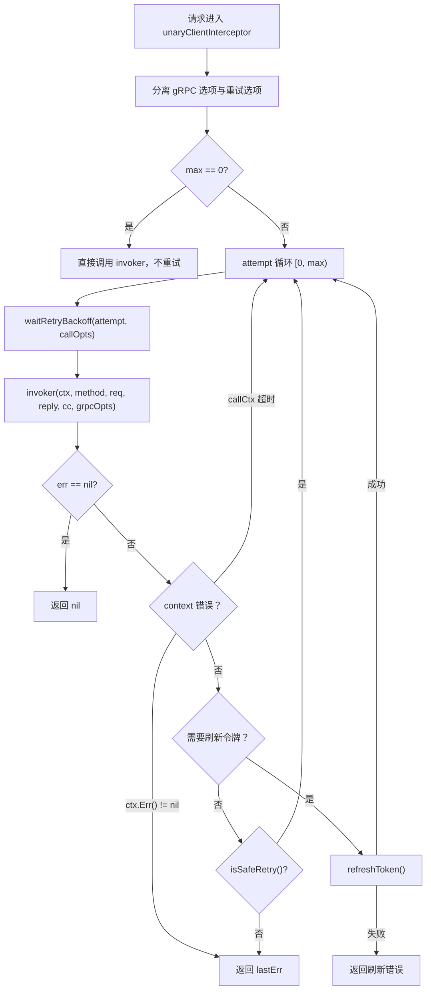
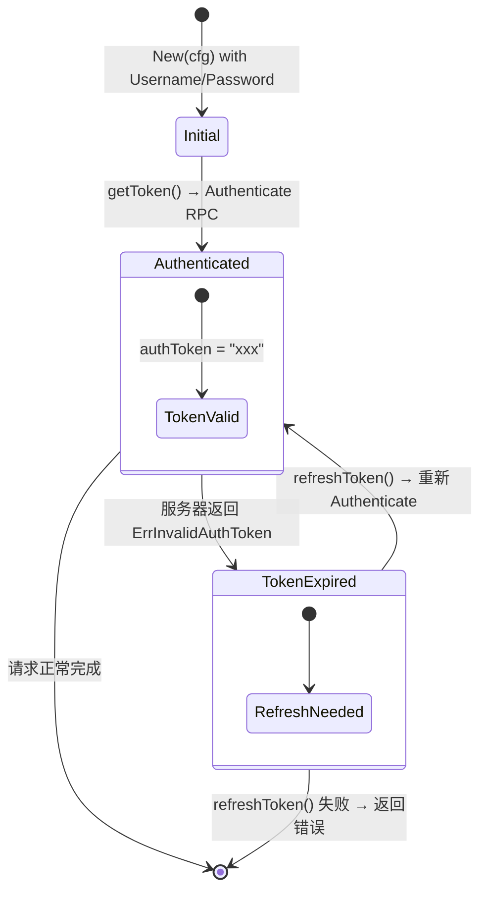

etcd 的 Go 客户端库（`client/v3`）是应用程序与 etcd 集群交互的核心入口。它封装了 gRPC 连接建立、端点发现与切换、请求重试与退避、认证令牌管理等分布式系统中最复杂的基础设施问题。本文将深入剖析该客户端的内部架构——从一个 `clientv3.New()` 调用出发，追踪到 gRPC 拦截器层的每一次重试决策，再到 round-robin 负载均衡器如何将请求均匀分布到集群各节点。

Sources: [client.go](client/v3/client.go#L51-L84), [config.go](client/v3/config.go#L28-L106)

## 客户端整体架构

etcd v3 客户端在架构上采用**单连接多服务**的设计：所有 API 接口（KV、Lease、Watch、Cluster、Auth、Maintenance）共享同一个 `grpc.ClientConn`。这种设计减少了连接开销，同时通过自定义 Resolver 和 gRPC 内置的 round-robin 负载均衡策略实现多端点间的请求分发。



**Client** 结构体是整个客户端库的核心，它内嵌了六个 API 接口，持有唯一的 gRPC 连接、自定义的端点解析器，以及认证相关的令牌凭据。值得注意的是，endpoints 列表通过读写互斥锁（`epMu`）保护，支持在运行时动态更新。

Sources: [client.go](client/v3/client.go#L52-L84), [doc.go](client/v3/doc.go#L15-L105)

## 客户端创建流程

客户端的创建入口是 `clientv3.New(cfg Config)`，它委托给内部的 `newClient` 函数完成全部初始化工作。整个创建流程可以分解为以下关键阶段：



**初始化顺序的设计意图**值得深入理解：先建立连接，再获取令牌——这确保了认证请求本身能通过已建立的连接到达服务器。`dialWithBalancer()` 使用 `grpc.NewClient()`（非阻塞式拨号），然后如果配置了 `DialTimeout`，通过 gRPC 健康检查协议等待连接就绪。这种"先创建后验证"的模式避免了阻塞式拨号已被 gRPC 官方废弃的问题。

Sources: [client.go](client/v3/client.go#L87-L93), [client.go](client/v3/client.go#L408-L533)

## 连接配置详解

`Config` 结构体是客户端行为的完整声明式描述。以下表格按功能域分组列出所有配置项及其语义：

| 配置项 | 类型 | 默认值 | 说明 |
|--------|------|--------|------|
| **连接管理** | | | |
| `Endpoints` | `[]string` | 必填 | etcd 集群的客户端 URL 列表 |
| `AutoSyncInterval` | `time.Duration` | `0`（禁用） | 自动同步端点列表的间隔；调用 `MemberList` 获取最新成员 |
| `DialTimeout` | `time.Duration` | `0`（无限制） | 建立连接的超时时间 |
| `DialKeepAliveTime` | `time.Duration` | `0`（禁用） | 客户端 Ping 服务器以检测连接存活的时间间隔 |
| `DialKeepAliveTimeout` | `time.Duration` | `0` | 等待 Keepalive 探测响应的超时时间 |
| `PermitWithoutStream` | `bool` | `false` | 是否允许在无活跃 RPC 时发送 Keepalive Ping |
| **消息大小** | | | |
| `MaxCallSendMsgSize` | `int` | `2 MiB` | 客户端请求发送大小上限 |
| `MaxCallRecvMsgSize` | `int` | `math.MaxInt32` | 客户端响应接收大小上限 |
| **安全** | | | |
| `TLS` | `*tls.Config` | `nil` | TLS 安全凭证 |
| `Username` / `Password` | `string` | `""` | 基于用户名密码的认证 |
| `Token` | `string` | `""` | JWT 令牌认证（与用户名密码互斥） |
| **重试** | | | |
| `MaxUnaryRetries` | `uint` | `100` | 一元 RPC 最大重试次数 |
| `BackoffWaitBetween` | `time.Duration` | `25ms` | 重试之间的基础等待时间 |
| `BackoffJitterFraction` | `float64` | `0.10` | 退避抖动因子（10% 意味着 ±10% 随机偏移） |

**配置最佳实践**：生产环境中应始终设置 `DialTimeout`（推荐 5s）和 `DialKeepAliveTime`（推荐 30s），以防止连接悬挂导致的请求阻塞。`AutoSyncInterval` 在动态集群中尤为重要——它让客户端能感知到新增或移除的成员节点。

Sources: [config.go](client/v3/config.go#L28-L106), [options.go](client/v3/options.go#L24-L57)

## 端点解析与负载均衡

etcd 客户端采用自定义的 **EtcdManualResolver** 作为 gRPC 的名称解析器，而非依赖 DNS 或其他标准解析机制。这个设计决策的核心原因是：etcd 集群的成员信息需要通过集群自身 API（`MemberList`）获取，而非外部服务发现。



**EtcdManualResolver** 在 `Build` 阶段通过 `ParseServiceConfig` 显式注入 `"round_robin"` 负载均衡策略。它的 `SetEndpoints` 方法允许运行时动态更新端点列表——`Client.Sync()` 和 `Client.autoSync()` 正是利用这一机制，定期从集群获取最新成员信息并更新解析器状态。

**端点地址翻译**由 `endpoint.Interpret` 函数完成，它处理了 etcd 特有的 URL 模式：`http://` / `https://` 映射为标准 TCP 地址，`unix://` / `unixs://` 映射为 Unix 域套接字。同时根据 scheme 决定 TLS 凭证需求——`https` 强制要求证书，`http` 丢弃证书，无 scheme 或 `unix` 为可选。

Sources: [resolver.go](client/v3/internal/resolver/resolver.go#L25-L77), [endpoint.go](client/v3/internal/endpoint/endpoint.go#L90-L134)

## 拨号与连接建立

etcd 客户端的拨号过程分为两个层次：**Dial 阶段**和**就绪验证阶段**。

```
dialSetupOpts() ──→ 组装 gRPC DialOption
    ├── keepalive 参数
    ├── TLS 凭证（或 insecure）
    ├── 重试拦截器（Unary + Stream）
    │   ├── 最大重试次数（默认 100）
    │   └── quorumBackoff 退避策略
    └── 认证凭据 bundle
        │
        ▼
grpc.NewClient(target, opts...)
        │
        ▼ (若配置了 DialTimeout)
waitForConnection(ctx, conn)
    └── 健康检查：HealthClient.Check()
        ├── 成功 → 返回 nil
        ├── Unimplemented/FailedPrecondition → 视为就绪
        └── 其他错误 + ctx 超时 → 返回错误
```

`waitForConnection` 的设计非常精妙：它使用 gRPC 标准健康检查协议探测连接状态，但对 `Unimplemented` 和 `FailedPrecondition` 采取了宽容策略。原因是 etcd 服务端可能未暴露健康检查端点，或者 Leader 尚未完成配置变更——这两种情况下连接仍然可用。这种"宁可信任连接"的策略在生产环境中显著减少了误报。

Sources: [client.go](client/v3/client.go#L228-L343), [client.go](client/v3/client.go#L345-L375)

## 自动同步与端点发现

`autoSync` 是客户端启动的一个后台 goroutine，按配置的间隔定期调用 `Sync` 方法：

```go
// Sync 从 etcd 集群成员列表获取最新端点
func (c *Client) Sync(ctx context.Context) error {
    mresp, err := c.MemberList(ctx)
    // 过滤掉未命名成员和 Learner 节点
    for _, m := range mresp.Members {
        if len(m.Name) != 0 && !m.IsLearner {
            eps = append(eps, m.ClientURLs...)
        }
    }
    c.SetEndpoints(eps...)  // 触发 Resolver 更新
}
```

**关键细节**：`Sync` 方法过滤掉了 `Name` 为空的成员（说明该成员尚未完成初始化）和 `IsLearner` 为 true 的成员（学习者节点不参与共识投票，不应接收客户端请求）。同步失败时仅打印日志，不会中断客户端的正常使用——这是一种优雅降级策略。

Sources: [client.go](client/v3/client.go#L187-L226)

## 重试机制：分层设计

etcd 客户端的重试机制是整个库中最精巧的部分，它需要在一个核心矛盾中取得平衡：**可用性 vs. 写操作幂等性**。重试分为两层实现：



### 重试策略分类

etcd 客户端将所有 RPC 操作分为两类：

| 策略 | 含义 | 适用操作 | 安全重试条件 |
|------|------|----------|-------------|
| **repeatable**（可重复） | 只读操作，天然幂等 | `Range`, `MemberList`, `Status`, `LeaseTimeToLive` 等 | `codes.Unavailable` 且非明确服务器错误 |
| **nonRepeatable**（不可重复） | 写操作，可能非幂等 | `Put`, `DeleteRange`, `Txn`, `MemberAdd` 等 | 仅在"无可用地址"或"无可用连接"时重试 |

**写操作的安全重试条件**极其严格——仅在错误描述为 `"there is no address available"` 或 `"there is no connection available"` 时才允许重试。这两个描述意味着请求根本没有被发送到服务器，因此重试不会违反"至多写入一次"的语义保证。一旦连接已建立并成功发送了请求（即使服务器随后崩溃），就不再重试——这是保证分布式系统正确性的关键决策。

Sources: [retry.go](client/v3/retry.go#L29-L94), [retry_interceptor.go](client/v3/retry_interceptor.go#L329-L354)

### 重试拦截器执行流程



**退避策略**采用 `roundRobinQuorumBackoff`——这不是简单的线性退避。其核心逻辑是：在遍历完**法定人数**（quorum）个端点后，才执行一次退避等待。对于 3 节点集群，quorum = 2，意味着连续尝试 2 个端点后才退避。这个设计确保了在 Leader 不可用时，客户端能快速尝试所有 Follower，而不是在每次失败后都等待。

退避时间通过 `jitterUp` 函数添加随机抖动：`waitBetween = 25ms × (1 ± 0.10)`，产生 [22.5ms, 27.5ms] 范围内的随机等待。抖动有效防止了多客户端同时重试导致的"惊群效应"。

Sources: [retry_interceptor.go](client/v3/retry_interceptor.go#L37-L102), [client.go](client/v3/client.go#L535-L549), [utils.go](client/v3/utils.go#L22-L31)

### 流式 RPC 的重试

流式 RPC 的重试（`streamClientInterceptor`）仅支持**服务端流**（Server Stream），不支持客户端流和双向流。原因在于：重试需要缓冲已发送的消息以便重新发送，而客户端流的消息是逐条发送的，缓冲全部消息在实践中不可行。

`serverStreamingRetryingStream` 维护了一个 `bufferedSends` 缓冲区记录所有已发送的消息。当 `RecvMsg` 失败且之前没有成功接收过（`receivedGood == false`）时，它会调用 `reestablishStreamAndResendBuffer` 重建流、重发缓冲消息、然后重新尝试接收。如果之前已经成功接收过至少一条消息（`receivedGood == true`），则不再重试——因为部分结果已经到达客户端，重试可能导致重复。

Sources: [retry_interceptor.go](client/v3/retry_interceptor.go#L104-L148), [retry_interceptor.go](client/v3/retry_interceptor.go#L185-L310)

## 认证令牌管理

etcd 客户端支持两种认证方式：**用户名/密码**（通过 `Authenticate` RPC 获取令牌）和**预配置 JWT Token**。两者共享同一个 `PerRPCCredentialsBundle` 机制，通过 gRPC 元数据将令牌附加到每个请求。



**令牌刷新机制**集成在重试拦截器中。当请求返回 `ErrInvalidAuthToken`、`ErrAuthOldRevision` 或 `ErrUserEmpty` 时，拦截器会自动调用 `refreshToken` 重新获取令牌并继续重试，对上层调用者完全透明。注意：如果用户通过 `Token` 字段直接提供了 JWT，则不会触发自动刷新——这种情况下令牌的生命周期由用户自行管理。

Sources: [credentials.go](client/v3/credentials/credentials.go#L29-L83), [client.go](client/v3/client.go#L286-L308), [retry_interceptor.go](client/v3/retry_interceptor.go#L150-L183)

## API 接口构造

Client 内嵌的六个 API 接口遵循统一的构造模式：**Retry 装饰器 + 底层 gRPC 客户端**。以 KV 为例：

```go
// kv.go
func NewKV(c *Client) KV {
    api := &kv{remote: RetryKVClient(c)}  // 用 Retry 装饰器包装
    api.callOpts = c.callOpts
    return api
}

// retry.go
func RetryKVClient(c *Client) pb.KVClient {
    return &retryKVClient{
        kc: pb.NewKVClient(c.conn),  // 原始 gRPC stub
    }
}
```

`retryKVClient` 的每个方法决定是否附加 `withRepeatablePolicy()`：

| 方法 | 重试策略 | 原因 |
|------|---------|------|
| `Range` | **repeatable** | 只读操作，幂等 |
| `Put` | nonRepeatable（默认） | 写操作 |
| `DeleteRange` | nonRepeatable（默认） | 写操作 |
| `Txn` | nonRepeatable（默认） | 可能包含写操作 |
| `Compact` | nonRepeatable（默认） | 状态变更操作 |

这种**装饰器模式**使得重试逻辑与业务逻辑完全解耦——上层接口只关心"调用成功或失败"，而重试策略由中间层透明处理。

Sources: [kv.go](client/v3/kv.go#L96-L115), [retry.go](client/v3/retry.go#L96-L125)

## 请求顺序性保证

在 round-robin 负载均衡下，客户端可能连续向不同的 etcd 成员发送可序列化读请求。如果某次请求命中了一个分区或滞后的副本，它可能返回一个比前一次响应更旧的修订版本——这违反了单调读一致性。

`ordering` 包通过 **revision 单调性检查** 解决这个问题：

```go
// ordering/kv.go - 简化逻辑
func (kv *kvOrdering) Get(ctx context.Context, key string, ...) (*GetResponse, error) {
    prevRev := kv.getPrevRev()  // 上一次成功的 revision
    for {
        resp := kv.KV.Do(ctx, op)           // 执行实际请求
        if resp.Header.Revision >= prevRev { // 单调性检查
            kv.setPrevRev(resp.Header.Revision)
            return resp
        }
        // revision 回退 → 触发 orderViolationFunc
        err = kv.orderViolationFunc(op, resp, prevRev)
    }
}
```

用户通过 `OrderViolationFunc` 回调自定义处理策略——通常的做法是切换到另一个端点并重试请求。使用方式如下：

```go
cli, _ := clientv3.New(clientv3.Config{Endpoints: []string{"localhost:2379"}})
vf := func(op clientv3.Op, resp clientv3.OpResponse, prevRev int64) error {
    return fmt.Errorf("ordering violation: expected rev >= %v", prevRev)
}
cli.KV = ordering.NewKV(cli.KV, vf)
```

Sources: [kv.go](client/v3/ordering/kv.go#L27-L76), [doc.go](client/v3/ordering/doc.go#L15-L41)

## 连接生命周期管理

客户端的关闭（`Close`）遵循严格的清理顺序：

```go
func (c *Client) Close() error {
    c.cancel()            // 1. 取消 context → 通知所有 goroutine 退出
    c.Watcher.Close()     // 2. 关闭 Watcher（停止所有 watch 流）
    c.Lease.Close()       // 3. 关闭 Lease（停止 keepalive 循环）
    if c.conn != nil {
        return c.conn.Close()  // 4. 最后关闭 gRPC 连接
    }
}
```

**顺序至关重要**：先停止应用层的 watcher 和 lease keepalive goroutine，再关闭底层连接。如果先关闭连接，应用层的 goroutine 会收到意外的连接错误，而不是优雅的关闭信号。

`Client` 实例是**并发安全**的——官方文档明确建议复用客户端实例，而不是按需创建。内部状态通过 `epMu` 读写锁（端点列表）、`atomic.Pointer[zap.Logger]`（日志器）和 gRPC 自身的连接管理来保证线程安全。

Sources: [client.go](client/v3/client.go#L147-L160), [doc.go](client/v3/doc.go#L57-L58)

## 默认参数与调优参考

| 参数 | 默认值 | 生产建议 | 说明 |
|------|--------|---------|------|
| `DialTimeout` | 无限制 | `5s` | 避免首次连接长时间阻塞 |
| `DialKeepAliveTime` | 禁用 | `30s` | 检测死连接，防止防火墙静默丢弃 |
| `DialKeepAliveTimeout` | 无 | `10s` | Keepalive 探测超时 |
| `MaxUnaryRetries` | `100` | `100`（或更低） | 高重试次数适合临时网络抖动 |
| `BackoffWaitBetween` | `25ms` | `25ms` | 低延迟退避，配合 quorum 策略 |
| `AutoSyncInterval` | 禁用 | `60s` | 动态集群必开，静态集群可不开 |
| `MaxCallSendMsgSize` | `2 MiB` | `2 MiB` | 需匹配服务端 `--max-request-bytes` |
| `MaxCallRecvMsgSize` | `2 GiB` | `2 GiB` | Range 响应可能非常大 |
| `PermitWithoutStream` | `false` | `true` | 允许空闲连接保活 |

Sources: [options.go](client/v3/options.go#L24-L66)

## 总结

etcd 的 `client/v3` 客户端库通过三个相互配合的机制为上层应用提供了"简单而可靠"的 API 体验：

1. **EtcdManualResolver + round_robin**：将用户提供的端点列表转化为 gRPC 可理解的目标地址，并实现请求在多个集群成员间的均匀分布。
2. **双策略重试拦截器**：对读操作采用宽松的 `repeatable` 策略，对写操作采用极严格的 `nonRepeatable` 策略，在可用性与写入安全性之间取得精确平衡。
3. **quorum-aware 退避**：仅在遍历完法定人数个端点后才执行退避等待，确保 Leader 故障时客户端能快速尝试 Follower。

理解这些内部机制后，当遇到"客户端请求偶尔超时"或"写操作返回不一致结果"等问题时，你能准确判断是配置不当（如缺少 Keepalive）、网络分区（导致 round-robin 命中不可用节点），还是应用层需要额外的顺序性保护（使用 `ordering` 包）。

**下一步建议**：深入了解 Watch 机制如何利用流式 RPC 重试实现长连接事件推送，请阅读 [Watch 机制：事件推送、缓存层（cache 模块）与一致性保证](17-watch-ji-zhi-shi-jian-tui-song-huan-cun-ceng-cache-mo-kuai-yu-zhi-xing-bao-zheng)。若对 API 层的 gRPC 契约定义感兴趣，请参考 [gRPC API 定义与 Protocol Buffers 契约（api 模块）](15-grpc-api-ding-yi-yu-protocol-buffers-qi-yue-api-mo-kuai)。