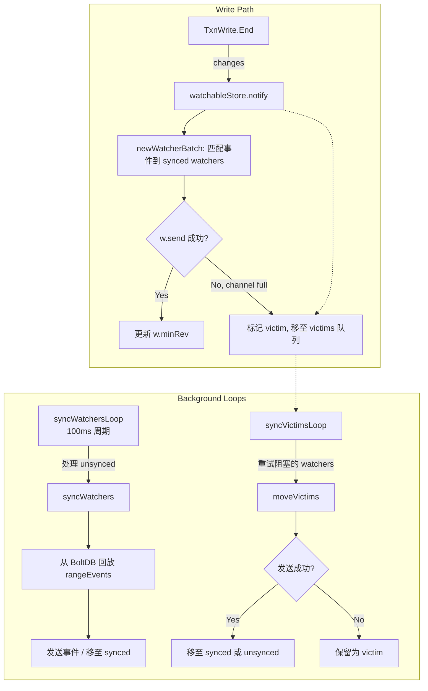
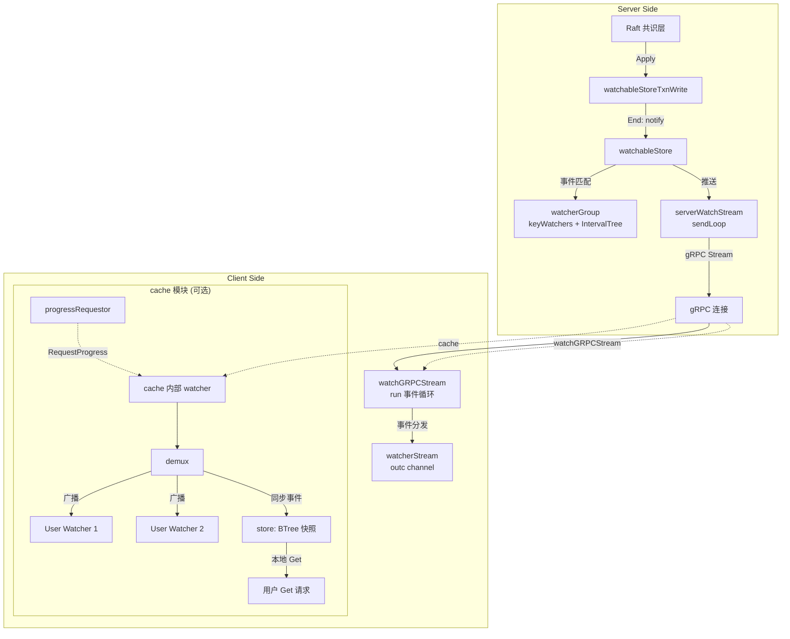

etcd 的 Watch 是分布式键值存储中最核心的增量通知原语。客户端通过一次 gRPC 双向流调用注册对任意键或键范围的监视，随后服务端在每次事务提交后将变更事件（Put / Delete）实时推送到流上。Watch 保证了 **revision 全序性**——所有观察者在同一个 key 上看到的事件序列完全一致且不遗漏，即使在网络分区、Leader 切换和客户端重连等故障场景下也能通过 revision 对齐恢复。本文将从 gRPC 协议契约出发，逐层穿透**服务端 MVCC watchableStore** → **客户端 v3 watcher** → **实验性 cache 模块**，揭示事件的生产、分发、传输与本地缓存的全链路设计。

Sources: [rpc.proto](api/etcdserverpb/rpc.proto#L84-L96), [watcher.go](server/storage/mvcc/watcher.go#L40-L80)

## 协议层：gRPC Watch API 的双向流契约

Watch 服务被定义为一个 **双向流（bidirectional streaming）** RPC——客户端通过输入流发送 `WatchRequest`，服务端通过输出流返回 `WatchResponse`。一条 Watch 流可以同时承载多个 watcher 的生命周期管理。

```
service Watch {
  rpc Watch(stream WatchRequest) returns (stream WatchResponse);
}
```

`WatchRequest` 是一个 `oneof` 联合体，包含三种操作：**创建**（`WatchCreateRequest`）、**取消**（`WatchCancelRequest`）和**进度请求**（`WatchProgressRequest`，v3.4 引入）。创建请求中 `start_revision` 指定从哪个 revision 开始回放历史事件，若为 0 则仅观察未来事件；`progress_notify` 允许客户端请求服务端在没有新事件时也周期性发送空响应以标明当前 revision，这对于断线重连时判断对齐点至关重要。

`WatchResponse` 携带 `watch_id` 用于在同一个流上复路分解到具体的 watcher，`created` / `canceled` 标记生命周期状态，`compact_revision` 在 watcher 请求的起始 revision 已被压缩时告知客户端。事件的载体是 `repeated mvccpb.Event`，每个事件包含类型（PUT / DELETE）和完整的 `KeyValue` 结构。

| 字段 | 类型 | 作用 |
|------|------|------|
| `key` / `range_end` | `bytes` | 监视的键或 `[key, range_end)` 范围 |
| `start_revision` | `int64` | 从指定 revision 开始回放，0 表示从"现在"开始 |
| `progress_notify` | `bool` | 启用周期性进度通知 |
| `filters` | `enum` | 服务端过滤：`NOPUT` / `NODELETE` |
| `prev_kv` | `bool` | 在事件中附带变更前的键值对 |
| `fragment` | `bool` | 大响应分片传输 |

Sources: [rpc.proto](api/etcdserverpb/rpc.proto#L753-L859), [rpc_grpc.pb.go](api/etcdserverpb/rpc_grpc.pb.go#L1)

## 服务端核心：watchableStore 与事件分发

### 架构总览

watchableStore 是 MVCC 存储层的核心扩展，它在底层 `store`（负责 BoltDB 读写与 Revision 管理）之上增加了 watcher 注册、事件匹配与推送能力。其内部维护两组 watcher 集合——**synced**（已同步，实时接收新事件）和 **unsynced**（待同步，需要从历史中回放），并通过两个后台 goroutine 定期处理。



Sources: [watchable_store.go](server/storage/mvcc/watchable_store.go#L55-L75), [watchable_store_txn.go](server/storage/mvcc/watchable_store_txn.go#L22-L47)

### 写路径的事件触发

每当一个写事务（`watchableStoreTxnWrite`）提交时，`End()` 方法会将 `Changes()` 收集到的所有键值变更转换为 `mvccpb.Event` 数组，然后调用 `s.notify(rev, evs)`。notify 方法是事件分发的入口——它通过 `newWatcherBatch` 在 synced watcherGroup 中查找所有匹配当前事件的 watcher，将事件打包为 `WatchResponse` 后尝试写入 watcher 的 channel。如果 channel 已满（消费者处理慢），该 watcher 被标记为 **victim**（受害者），从 synced 组移出并加入 victims 队列等待异步重试。

关键设计点在于 `notify` 方法要求传入的事件必须属于**同一个 revision**（`eb.revs != 1` 时直接 Panic），这保证了单次事务内的原子性语义——一个 revision 的所有变更要么全部到达同一个 WatchResponse，要么都不到达。

Sources: [watchable_store.go](server/storage/mvcc/watchable_store.go#L465-L491), [watchable_store_txn.go](server/storage/mvcc/watchable_store_txn.go#L22-L47)

### watcherGroup：区间树匹配

watcherGroup 是事件路由的核心数据结构，它将 watcher 按其监视范围组织为两类索引：`keyWatchers`（精确键匹配的 `watcherSetByKey` 哈希表）和 `ranges`（基于区间树的 `IntervalTree`，用于范围监视）。当事件到来时，`watcherSetByKey(key)` 方法同时查询哈希表和区间树的 `Stab` 操作，合并结果得到所有应该接收该事件的 watcher 集合。

这种双索引设计使得精确键匹配的时间复杂度为 O(1)，范围匹配为 O(log n + m)，其中 n 是区间树节点数、m 是匹配的区间数。默认每批次处理的上限为 `maxWatchersPerSync = 512` 个 watcher，防止单次同步占用过多 CPU 时间。

Sources: [watcher_group.go](server/storage/mvcc/watcher_group.go#L144-L181), [watcher_group.go](server/storage/mvcc/watcher_group.go#L268-L291)

### 同步循环：unsynced → synced 的晋升

服务端运行两个关键的后台 goroutine：

**syncWatchersLoop**（100ms 周期）负责将 unsynced watcherGroup 中的慢 watcher 推进。它从 unsynced 组中选取最多 512 个 watcher，计算它们的最小 revision（`minRev`），然后通过 `rangeEvents` 从 BoltDB 的 `key` bucket 中读取 `[minRev, currentRev+1)` 范围内的所有 revision 记录，反序列化为事件后分发给各 watcher。如果 watcher 请求的起始 revision 已被 compact，则发送 `CompactRevision` 响应并取消该 watcher。同步完成后，跟得上进度的 watcher 晋升到 synced 组。

**syncVictimsLoop** 持续处理因 channel 满而阻塞的 victim watcher。它从 victims 队列中取出待发送的事件，尝试重新写入 watcher channel。成功的 watcher 根据 `minRev` 与 `currentRev` 的比较，被分配到 synced 或 unsynced 组。

Sources: [watchable_store.go](server/storage/mvcc/watchable_store.go#L222-L338), [watchable_store.go](server/storage/mvcc/watchable_store.go#L340-L413)

### gRPC Watch Server 桥接

`watchServer` 是 gRPC 层到 MVCC 层的桥梁。每个客户端连接会创建一个 `serverWatchStream`，它内部持有一个 MVCC 层的 `watchStream`（通过 `watchable.NewWatchStream()` 创建），以及一个 `ctrlStream` 用于发送 Created / Canceled 等控制响应。

serverWatchStream 的 `recvLoop` 从 gRPC 流读取客户端请求并调用 `watchStream.Watch()` 在 MVCC 层注册 watcher；`sendLoop` 从 `watchStream.Chan()` 读取事件响应，按需补充 `PrevKV`（通过额外的 Range 查询获取变更前的值），处理大响应的分片（fragmentation），然后通过 gRPC 流发送给客户端。sendLoop 还会定期发送 progress notification（默认 10 分钟间隔 + 随机抖动），确保已请求 `progress_notify` 的 watcher 能收到空事件心跳。

Sources: [watch.go](server/etcdserver/api/v3rpc/watch.go#L43-L87), [watch.go](server/etcdserver/api/v3rpc/watch.go#L162-L234), [watch.go](server/etcdserver/api/v3rpc/watch.go#L409-L573)

## 客户端实现：v3 watcher 与自动恢复

### watchGRPCStream 架构

客户端的 `watcher` 结构管理着一组 `watchGRPCStream`（按 context 分组），每个 gRPC stream 对应一个到 etcd 服务端的双向流连接。核心的 `run()` 方法是一个事件循环，处理五种消息源：

1. **reqc**：来自用户 `Watch()` 调用的创建/进度请求
2. **respc**：来自 gRPC Recv 的服务端响应
3. **errc**：gRPC 连接错误，触发重连
4. **ctx.Done**：上层 context 取消
5. **closingc**：子 watcher 关闭通知

每个 `watchRequest` 被包装为一个 `watcherStream` 对象，加入 `resuming` 队列。当 gRPC 流建立后，队首的 watcher 请求被发送到服务端；收到 Created 响应后，该 watcher 被移入 `substreams` 映射表，其 `outc` channel 开始向用户层推送事件。

Sources: [watch.go](client/v3/watch.go#L143-L192), [watch.go](client/v3/watch.go#L504-L699)

### 自动恢复与 Revision 对齐

当 gRPC 流断开时，`run()` 通过 `errc` 收到错误信号。如果错误是可恢复的（非 `ErrNoLeader`），客户端会调用 `newWatchClient()` 重新建立流连接，并将所有活跃的 substream 重新加入 resuming 队列，以**原始的 `startRevision`** 重新发送创建请求。这意味着：

- **如果 revision 未被 compact**：服务端从 `startRevision` 开始回放所有历史事件，客户端不丢失任何变更
- **如果 revision 已被 compact**：服务端返回 `CompactRevision`，客户端收到后关闭对应的 WatchChan 并报告 `ErrCompacted`，由上层应用决定如何处理

这种基于 revision 的幂等恢复机制是 etcd Watch 一致性保证的核心——只要事件的 revision 区间未被压缩，watcher 就能无损恢复。

Sources: [watch.go](client/v3/watch.go#L655-L670), [watch.go](client/v3/watch.go#L297-L386)

## cache 模块：客户端侧的本地缓存层

### 设计定位与架构

cache 模块是 etcd 新引入的**实验性客户端侧缓存库**。它的核心思想是：将一个针对特定 key prefix 的远端 Watch 扇出（fan-out）为多个本地 watcher，使得同一进程内的多个组件可以共享同一条 Watch 流，同时获得本地读取能力（Get 操作直接从内存返回，无需网络往返）。这与 Kubernetes API Server 的 `Cacher` 设计理念一脉相承。

```mermaid
flowchart LR
    subgraph "Upstream etcd"
        ETCD[(etcd cluster)]
    end

    subgraph "cache.Cache (客户端进程内)"
        direction TB
        WL[getWatchLoop goroutine] -->|1. Get 全量快照| GET[store.Restore]
        WL -->|2. Watch(prefix)| WS[clientv3.Watcher]
        WS -->|WatchResponse| DEMUX[demux<br/>事件分路器]
        DEMUX -->|广播| SW1[store Watcher<br/>→ store.Apply]
        DEMUX -->|广播| UW1[User Watcher 1]
        DEMUX -->|广播| UW2[User Watcher 2]
        DEMUX -->|广播| UW3[User Watcher N]
        
        ST[store<br/>BTree 快照存储] -->|Get 查询| USER_GET[用户 Get 请求]
        RB[ringBuffer<br/>事件历史] -->|重放 lagging watchers| DEMUX
        
        PR[progressRequestor] -->|RequestProgress| WS
    end

    ETCD -.->|gRPC| WS
```

Sources: [cache.go](cache/cache.go#L39-L56), [cache.go](cache/cache.go#L71-L107)

### Cache 的生命周期

`New()` 构造函数创建 Cache 实例并启动两个后台 goroutine：**getWatchLoop** 和 **progressRequestor**。

**初始化阶段**（`getWatch` → `get` → `watch`）：首先对 prefix 执行一次全量 `Get`，将所有键值对加载到 `store.Restore()` 中构建初始 BTree 快照。然后以 `Get` 响应的 `revision + 1` 为起始 revision 开启一条 `Watch(prefix, WithPrefix(), WithProgressNotify(), WithCreatedNotify())` 流。当收到第一个 Created 响应时，调用 `demux.Init(rev)` 初始化事件分路器，并通过 `ready.Set()` 标记缓存就绪。

**运行阶段**：每个 WatchResponse 到达后同时进入两条路径：一是 `demux.Broadcast(resp)` 将事件分发给所有活跃的本地 watcher；二是 `store.Apply(resp)` 将事件应用到 BTree 快照以维护一致的读取视图。两条路径共享同一个 revision 序列，通过 `validateRevisions()` 严格校验——任何 **stale event**（revision < latestRev）或 **duplicate revision** 都会触发错误并重建 Watch。

**错误恢复**：如果 Watch 流因任何原因中断，`getWatchLoop` 以指数退避（初始 50ms，上限 2s）重新执行全量 Get + Watch 的初始化流程。恢复时，`demux.Purge()` 清空所有 watcher 并重置历史，`store.Restore()` 重建快照，确保不出现 revision 间隙。

Sources: [cache.go](cache/cache.go#L308-L366), [cache.go](cache/cache.go#L384-L419)

### store：BTree 快照与历史窗口

store 是缓存的数据核心，维护一个基于 BTree（度数为 32）的 KV 索引和一个 `ringBuffer` 驱动的历史快照窗口。每次 `Apply` 处理一批事件时，对同一 revision 内的所有事件原子地更新 BTree（PUT 执行 `ReplaceOrInsert`，DELETE 执行 `Delete`），然后克隆当前 BTree 作为该 revision 的不可变快照追加到 ringBuffer 中。

ringBuffer 的容量由 `HistoryWindowSize`（默认 2048）控制。当窗口满时，最旧的快照被丢弃。`Get` 操作接受目标 revision 参数，通过 ringBuffer 的 `DescendLessOrEqual` 二分查找定位到最近的历史快照执行范围查询。如果目标 revision 已被淘汰，返回 `ErrCompacted`。

store 使用 `sync.RWMutex` 保护并发读写，并通过 `sync.Cond`（基于 `RLocker`）实现 revision 等待——当 `waitTillRevision` 被调用时，等待者在持有读锁的条件下调用 `Cond.Wait()`，允许其他读者并发访问而不阻塞。

| 配置参数 | 默认值 | 作用 |
|----------|--------|------|
| `HistoryWindowSize` | 2048 | ringBuffer 中保留的历史快照数 |
| `BTreeDegree` | 32 | BTree 的分支因子 |
| `PerWatcherBufferSize` | 10 | 每个 watcher 的响应 channel 缓冲 |
| `ResyncInterval` | 50ms | 滞后 watcher 重同步间隔 |
| `WaitTimeout` | 3s | 一致性 Get 等待 revision 的超时 |

Sources: [store.go](cache/store.go#L33-L51), [store.go](cache/store.go#L119-L170), [config.go](cache/config.go#L19-L58)

### demux：事件分路器与滞后恢复

demux（多路分解器）负责将上游 Watch 流的每条响应扇出到所有活跃的本地 watcher。它维护两组 watcher 映射：`activeWatchers`（活跃的，nextRev 跟踪每个 watcher 期望的下一个 revision）和 `laggingWatchers`（滞后的，因 channel 满或注册时 revision 较低而无法实时跟进）。

**事件广播**（`broadcastEventsLocked`）：遍历所有 active watcher，对每个 watcher 跳过 revision 小于其 `nextRev` 的事件，只发送 `events[sendStart:]` 子集。如果 `enqueueResponse` 因 channel 满返回 false，该 watcher 被降级到 laggingWatchers。

**滞后恢复**（`resyncLaggingWatchers`）：每 50ms（`ResyncInterval`）执行一次，遍历所有 lagging watcher，从 demux 自身的 ringBuffer（存储原始事件批次而非快照）中按 revision 升序重放事件。如果重放后 watcher 赶上了进度（`nextRev > maxRev`），发送一条 progress notification 并将其移回 activeWatchers；如果重放过程中 channel 再次满，保持在 lagging 状态等待下次重试。如果 watcher 需要的 revision 已低于 ringBuffer 的最小 revision（`minRev`），则发送 `Compact` 响应取消该 watcher。

这种 active / lagging 双态设计确保了：快速消费者直接收到实时推送，慢速消费者通过后台重试机制最终追上进度，两者互不干扰。

Sources: [demux.go](cache/demux.go#L27-L60), [demux.go](cache/demux.go#L145-L287), [demux.go](cache/demux.go#L318-L358)

### progressRequestor：条件性进度请求

`conditionalProgressRequestor` 是一个精巧的按需进度请求器。它维护一个 `waiting` 计数器，仅当有活跃的等待者时才周期性发送 `RequestProgress` RPC。当一致性 `Get` 需要等待某个 revision 到达时，调用 `add()` 增加计数，requestor 的 `run()` 循环被 `sync.Cond` 唤醒后开始以 100ms 间隔发送进度请求，推动远端 Watch 流返回 progress notification，从而触发 store 的 revision 更新和 `revCond.Broadcast()`。当等待者完成时调用 `remove()` 减少计数，计数归零后 requestor 再次进入休眠。

Sources: [progress_requestor.go](cache/progress_requestor.go#L38-L56), [progress_requestor.go](cache/progress_requestor.go#L58-L101)

### watcher 与 predicate 过滤

cache 模块的 `watcher` 是对用户级 watch 的轻量封装。每个 watcher 持有一个 `KeyPredicate` 函数，在 `enqueueResponse` 时对非 progress notification 的事件执行过滤——只有 predicate 返回 true 的事件才入队。predicate 由 `KeyPredForRange` 根据请求的 key / rangeEnd 参数生成，支持精确键（`ExactKey`）、从某键开始（`FromKey`）和范围（`Range`）三种模式。这种设计使得 cache 可以用一条覆盖整个 prefix 的 Watch 流同时服务多个不同子范围的本地 watcher，在 demux 层完成事件过滤。

Sources: [watcher.go](cache/watcher.go#L25-L60), [predicate.go](cache/predicate.go#L29-L52)

### 一致性 Get 语义

cache 的 `Get` 方法提供了两种一致性级别：

- **Serializable Get**（`op.IsSerializable()`）：直接从 store 读取，可能返回略旧的数据
- **Linearizable Get**（默认）：先通过 `serverRevision()` 查询远端 etcd 的当前 revision，然后调用 `waitTillRevision()` 等待本地 store 追赶到该 revision，确保读取到的数据至少与发起请求时远端的最新状态一致

这种设计使得 cache 在保证读取一致性的同时，避免了每次 Get 都走网络的开销。代价是 Linearizable Get 需要等待本地 cache 追上远端进度，可能产生 `WaitTimeout`（默认 3s）超时。

Sources: [cache.go](cache/cache.go#L188-L227), [cache.go](cache/cache.go#L264-L300)

## 一致性保证：从 Revision 到客户端的完整链路

etcd Watch 的端到端一致性建立在 **revision 全序**这一基础之上。以下是关键的一致性不变量及其实现机制：

**1. Revision 单调递增**：每个写事务在 MVCC store 中分配唯一的 revision（`main` 递增），同一事务内的多个键变更共享同一个 revision。Watch 事件按 revision 严格递增推送，客户端永远不会看到乱序的 revision。

**2. 同一 Revision 的原子性**：`watchableStoreTxnWrite.End()` 在持有 `watchableStore.mu` 锁的情况下调用 `notify` 和底层 `TxnWrite.End()`，确保同一 revision 的所有变更作为一整个 `WatchResponse` 发送，不会被其他 revision 的事件插入。

**3. 可靠恢复**：客户端断线重连后以原 `startRevision` 重建 Watch，服务端从 BoltDB 回放 `[startRevision, currentRev]` 范围内的所有事件。只要 revision 未被 compact，事件不会丢失。compact 后服务端返回 `CompactRevision`，客户端明确得知数据已被裁剪。

**4. 无重复通知**：`validateRevisions()` 在 store 层和 demux 层都执行严格检查——stale event（revision < latestRev）和 duplicate revision（revision == latestRev）都会触发错误，导致 Watch 重建。这保证了同一个 revision 的事件不会被发送两次。

**5. Progress Notification 的正确性**：progress notification 携带的 revision 代表 Watch 流的当前进度。客户端可以通过比较最近收到的事件 revision 与 progress notification 的 revision 来判断是否存在未处理的事件间隙。cache 模块利用这一机制实现一致性 Get 的 revision 等待。

Sources: [watchable_store_txn.go](server/storage/mvcc/watchable_store_txn.go#L22-L47), [store.go](cache/store.go#L178-L199), [demux.go](cache/demux.go#L145-L158)

## 模块间的协作关系



整条链路可以概括为：**Raft 提交 → TxnWrite.End → notify → watcherGroup 匹配 → gRPC 推送 → 客户端 run 循环分发 → 用户 channel / cache 扇出**。cache 模块作为可选的客户端侧加速层，在不修改服务端协议的前提下，通过复用同一条 Watch 流和本地 BTree 快照，为同一进程内的多个消费者提供零网络开销的 Watch 和 Get 语义。

Sources: [watchable_store.go](server/storage/mvcc/watchable_store.go#L83-L89), [watch.go](client/v3/watch.go#L275-L295), [cache.go](cache/cache.go#L63-L69)

## 延伸阅读

- Watch 事件的底层存储依赖于 [MVCC 存储模型：Revision、KeyIndex 与事务视图](11-mvcc-cun-chu-mo-xing-revision-keyindex-yu-shi-wu-shi-tu) 中的 revision 编号与 key bucket 组织
- Watch 流的断线恢复机制依赖于 [Raft 共识算法集成：raftNode 适配层与消息流转](9-raft-gong-shi-suan-fa-ji-cheng-raftnode-gua-pei-ceng-yu-xiao-xi-liu-zhuan) 中的 Leader 选举和日志复制保证
- cache 模块的一致性 Get 等待机制与 [EtcdServer 核心实现：提案提交、Apply 循环与线性一致性读](8-etcdserver-he-xin-shi-xian-ti-an-ti-jiao-apply-xun-huan-yu-xian-xing-zhi-xing-du) 中描述的 ReadIndex 机制相呼应
- Compaction 对 Watch 的影响详见 [Compaction 与 Schema 版本迁移](14-compaction-yu-schema-ban-ben-qian-yi)
- 客户端的连接管理和重试策略参见 [Go 客户端库（client/v3）：连接管理、重试与负载均衡](16-go-ke-hu-duan-ku-client-v3-lian-jie-guan-li-zhong-shi-yu-fu-zai-jun-heng)