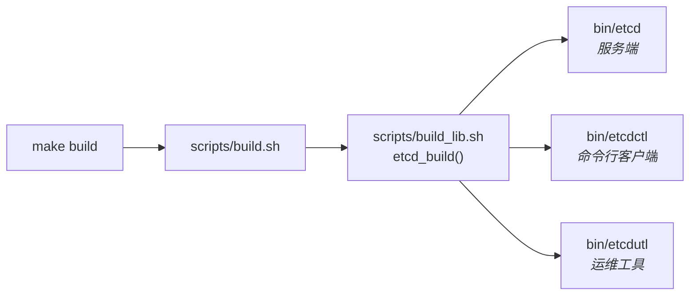
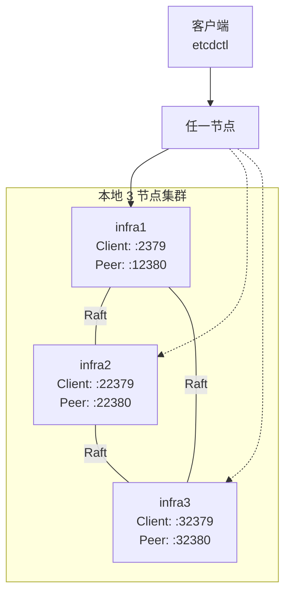

本文是一份面向初学者的实战指南，带你从零开始完成三件事：**从源码构建 etcd 二进制文件**、**启动单节点实例并验证**、**搭建本地多成员集群**。整个流程遵循 etcd 官方仓库提供的构建脚本和 Procfile 配置，每一步都有真实代码佐证，确保可复现。

Sources: [README.md](README.md#L61-L101), [Documentation/contributor-guide/local_cluster.md](Documentation/contributor-guide/local_cluster.md#L1-L10)

---

## 前置条件

在动手之前，请确保你的开发环境满足以下要求：

| 依赖项 | 最低版本 | 验证命令 | 说明 |
|--------|---------|---------|------|
| **Go** | 1.26.2 | `go version` | 由 `.go-version` 文件指定，使用 Go Workspace 管理多模块 |
| **Git** | 任意 | `git --version` | 用于克隆仓库和构建时注入 Git SHA |
| **goreman** | 最新 | `go install github.com/mattn/goreman@latest` | 多节点集群进程管理器 |

> **关于 Go 版本**：etcd 项目在根目录的 `.go-version` 中锁定了工具链版本为 `go1.26.2`，同时 `go.mod` 中声明了 `go 1.26` 和 `toolchain go1.26.2`。如果你的本地 Go 版本不完全匹配，Go 的工具链自动下载机制会处理好兼容性。

Sources: [.go-version](.go-version#L1-L2), [go.mod](go.mod#L1-L6)

---

## 第一步：从源码构建 etcd

### 理解构建体系

etcd 的构建体系采用 **Makefile → Shell 脚本 → Go 编译** 的三层结构。入口是根目录的 `Makefile`，它调用 `scripts/build.sh`，而 `build.sh` 进一步加载 `scripts/build_lib.sh` 完成实际的 Go 编译。整个构建过程产出三个核心二进制文件：



每个二进制分别编译自不同的模块目录：`etcd` 来自 `server/` 模块（入口为 `server/main.go`），`etcdctl` 来自 `etcdctl/` 模块，`etcdutl` 来自 `etcdutl/` 模块。构建脚本会在编译时通过 `-ldflags` 注入当前 Git SHA，方便后续版本追踪。

Sources: [Makefile](Makefile#L7-L9), [scripts/build.sh](scripts/build.sh#L16-L27), [scripts/build_lib.sh](scripts/build_lib.sh#L37-L88), [server/main.go](server/main.go#L24-L32)

### 执行构建

在仓库根目录下运行：

```bash
make build
```

或者直接调用构建脚本：

```bash
./scripts/build.sh
```

构建成功后，你将在 `bin/` 目录下看到三个二进制文件。验证构建结果：

```bash
$ ls -la bin/
etcd
etcdctl
etcdutl

$ ./bin/etcd --version
```

> **交叉编译**：如果需要为其他平台构建，可以使用 `make build-linux-amd64` 这样的目标，Makefile 支持通过 `GOOS`/`GOARCH` 环境变量进行跨平台编译。支持的平台包括 `linux-amd64`、`linux-arm64`、`darwin-amd64`、`darwin-arm64`、`windows-amd64` 等。

Sources: [Makefile](Makefile#L25-L35), [scripts/build_lib.sh](scripts/build_lib.sh#L20-L36)

### Docker 容器化构建（可选）

etcd 提供了两种容器化方案：

- **开发容器（DevContainer）**：`.devcontainer/devcontainer.json` 配置了基于 `mcr.microsoft.com/devcontainers/go:1.26-bookworm` 的开发环境，支持 Docker-in-Docker、GitHub CLI 和 kubectl，容器创建后自动执行 `make build`。端口 2379 和 2380 默认转发到宿主机。
- **生产镜像**：`Dockerfile` 使用 `gcr.io/distroless/static-debian12` 作为基础镜像，仅包含 `etcd`、`etcdctl`、`etcdutl` 三个二进制，暴露 2379（客户端）和 2380（节点间）端口。

Sources: [.devcontainer/devcontainer.json](.devcontainer/devcontainer.json#L1-L22), [Dockerfile](Dockerfile#L1-L15)

---

## 第二步：启动单节点 etcd

### 默认配置启动

构建完成后，最简单的启动方式是直接运行二进制：

```bash
./bin/etcd
```

这会以**全部默认值**启动一个单成员 etcd 实例。默认配置的核心参数如下：

| 参数 | 默认值 | 说明 |
|------|-------|------|
| `name` | `default` | 成员名称 |
| `data-dir` | `default.etcd` | 数据存储目录（若未指定则自动使用 `<name>.etcd`） |
| `listen-client-urls` | `http://localhost:2379` | 客户端请求监听地址 |
| `listen-peer-urls` | `http://localhost:2380` | 节点间通信监听地址 |
| `advertise-client-urls` | `http://localhost:2379` | 对外广播的客户端地址 |
| `initial-advertise-peer-urls` | `http://localhost:2380` | 对外广播的节点间地址 |
| `initial-cluster-state` | `new` | 集群初始状态（新建） |

启动后，etcd 将在 `localhost:2379` 监听客户端请求，在 `localhost:2380` 监听节点间（peer）通信。如果 `data-dir` 目录不存在，etcd 会自动创建并初始化为新的单节点集群。

Sources: [server/embed/config.go](server/embed/config.go#L61-L129), [README.md](README.md#L71-L88), [server/etcdmain/etcd.go](server/etcdmain/etcd.go#L92-L98)

### 使用配置文件启动（推荐）

etcd 支持通过 YAML 配置文件启动，仓库提供了完整的配置模板 `etcd.conf.yml.sample`。使用方法：

```bash
./bin/etcd --config-file etcd.conf.yml
```

配置文件中的字段与命令行参数一一对应。以下是配置文件中最值得关注的核心字段：

```yaml
# 成员标识
name: 'default'
data-dir:                        # 数据目录，为空时自动使用 <name>.etcd

# 网络配置
listen-client-urls: http://localhost:2379    # 客户端请求
listen-peer-urls: http://localhost:2380      # 节点间通信
advertise-client-urls: http://localhost:2379
initial-advertise-peer-urls: http://localhost:2380

# 集群引导
initial-cluster-token: 'etcd-cluster'       # 集群令牌，防止误加入其他集群
initial-cluster-state: 'new'                # new=新建集群，existing=加入已有集群

# 性能调优
snapshot-count: 10000                        # 触发快照的事务数
heartbeat-interval: 100                      # 心跳间隔（毫秒）
election-timeout: 1000                       # 选举超时（毫秒）

# 日志
logger: zap
log-outputs: [stderr]
log-level: debug
```

Sources: [etcd.conf.yml.sample](etcd.conf.yml.sample#L1-L158)

### 快速验证

启动 etcd 后，使用 `etcdctl` 进行基本的数据读写验证：

```bash
# 写入数据
$ ./bin/etcdctl put foo bar
OK

# 读取数据
$ ./bin/etcdctl get foo
bar

# 检查集群健康状态
$ ./bin/etcdctl endpoint health
127.0.0.1:2379 is healthy: successfully committed proposal: took = 2.345ms
```

如果看到 `OK` 和正确的返回值，恭喜你——单节点 etcd 已经成功运行。

Sources: [README.md](README.md#L90-L96), [Documentation/contributor-guide/local_cluster.md](Documentation/contributor-guide/local_cluster.md#L21-L39)

---

## 第三步：搭建本地多成员集群

单节点适合开发和测试，但 etcd 的真正威力在于**分布式共识**。通过 `goreman` 和仓库自带的 `Procfile`，你可以一键启动一个 3 节点的本地集群。

### 架构概览

本地集群的拓扑结构如下：三个 etcd 成员（`infra1`、`infra2`、`infra3`）各自绑定不同的端口，通过 Raft 协议组成一个一致性集群。客户端可以连接任意一个成员进行读写操作。



### 启动步骤

**1. 安装 goreman**

```bash
go install github.com/mattn/goreman@latest
```

确保 `$GOPATH/bin`（或 `$HOME/go/bin`）在 `$PATH` 中。

**2. 启动集群**

在仓库根目录执行：

```bash
goreman -f Procfile start
```

`Procfile` 定义了三个 etcd 进程，以下是每个成员的关键配置参数：

| 成员 | 名称 | 客户端端口 | Peer 端口 | 广播 Peer 端口 |
|------|------|----------|----------|--------------|
| etcd1 | `infra1` | 2379 | 12380 | 12380 |
| etcd2 | `infra2` | 22379 | 22380 | 22380 |
| etcd3 | `infra3` | 32379 | 32380 | 32380 |

三个成员共享同一个 `initial-cluster-token: etcd-cluster-1`，并通过 `--initial-cluster` 参数相互发现：

```
--initial-cluster 'infra1=http://127.0.0.1:12380,infra2=http://127.0.0.1:22380,infra3=http://127.0.0.1:32380'
```

每个成员的 `--initial-cluster-state` 均为 `new`，表示这是一个全新集群。

Sources: [Procfile](Procfile#L1-L27), [Documentation/contributor-guide/local_cluster.md](Documentation/contributor-guide/local_cluster.md#L42-L61)

### 验证集群状态

集群启动后，使用 `etcdctl` 查看成员列表：

```bash
$ ./bin/etcdctl --write-out=table --endpoints=localhost:2379 member list
+------------------+---------+--------+------------------------+------------------------+
|        ID        | STATUS  |  NAME  |       PEER ADDRS       |      CLIENT ADDRS      |
+------------------+---------+--------+------------------------+------------------------+
| 8211f1d0f64f3269 | started | infra1 | http://127.0.0.1:2380  | http://127.0.0.1:2379  |
| 91bc3c398fb3c146 | started | infra2 | http://127.0.0.1:22380 | http://127.0.0.1:22379 |
| fd422379fda50e48 | started | infra3 | http://127.0.0.1:32380 | http://127.0.0.1:32379 |
+------------------+---------+--------+------------------------+------------------------+
```

执行基本的数据读写测试：

```bash
# 写入（连接任一节点）
$ ./bin/etcdctl put greeting "hello etcd cluster"
OK

# 从不同节点读取，验证数据一致性
$ ./bin/etcdctl --endpoints=localhost:2379 get greeting
hello etcd cluster

$ ./bin/etcdctl --endpoints=localhost:22379 get greeting
hello etcd cluster

$ ./bin/etcdctl --endpoints=localhost:32379 get greeting
hello etcd cluster
```

Sources: [Documentation/contributor-guide/local_cluster.md](Documentation/contributor-guide/local_cluster.md#L65-L90)

### 体验故障容错

多节点集群的最大优势是**容错能力**。我们可以通过停止单个成员来验证这一点：

```bash
# 1. 停止 infra2（etcd2）
$ goreman run stop etcd2

# 2. 写入新数据（连接存活的节点）
$ ./bin/etcdctl put fault-tolerance "still working"
OK

# 3. 从存活节点读取
$ ./bin/etcdctl get fault-tolerance
still working

# 4. 尝试从已停止的节点读取（预期失败）
$ ./bin/etcdctl --endpoints=localhost:22379 get fault-tolerance
Error: grpc: timed out trying to connect

# 5. 重启 infra2
$ goreman run restart etcd2

# 6. 从重启后的节点读取（通过 Raft 日志追赶，数据已恢复）
$ ./bin/etcdctl --endpoints=localhost:22379 get fault-tolerance
still working
```

这个过程展示了 etcd 的核心价值：即使集群中三分之一的节点不可用（3 节点中丢失 1 个），集群仍然可以正常处理写入请求；当故障节点恢复后，它会自动通过 Raft 协议追赶缺失的数据。

Sources: [Documentation/contributor-guide/local_cluster.md](Documentation/contributor-guide/local_cluster.md#L93-L148)

---

## 进阶：添加 Learner 节点

`Procfile` 中还包含了一个注释掉的 **Learner 节点** 配置。Learner（学习者）是 Raft 协议中的非投票成员，它参与日志复制但不参与选举投票，非常适合用于新节点加入集群时的预同步。

添加步骤：

```bash
# 1. 向集群添加 learner 节点
$ ./bin/etcdctl member add infra4 --peer-urls="http://127.0.0.1:42380" --learner=true

# 2. 取消 Procfile 中 etcd4 的注释，启动 learner
$ goreman run start etcd4

# 3. learner 数据同步完成后，提升为投票成员
$ ./bin/etcdctl member promote <member-id>
```

Sources: [Procfile](Procfile#L9-L26)

---

## 端口速查表

以下是本文涉及的所有端口，供快速参考：

| 端口 | 用途 | 协议 | 使用场景 |
|------|------|------|---------|
| **2379** | 客户端请求（infra1） | HTTP/gRPC | etcdctl 连接 |
| **22379** | 客户端请求（infra2） | HTTP/gRPC | etcdctl 连接 |
| **32379** | 客户端请求（infra3） | HTTP/gRPC | etcdctl 连接 |
| **12380** | 节点间通信（infra1） | HTTP | Raft 消息传输 |
| **22380** | 节点间通信（infra2） | HTTP | Raft 消息传输 |
| **32380** | 节点间通信（infra3） | HTTP | Raft 消息传输 |

Sources: [Procfile](Procfile#L1-L7), [server/embed/config.go](server/embed/config.go#L87-L88)

---

## 常见问题排查

| 问题 | 可能原因 | 解决方案 |
|------|---------|---------|
| `make build` 失败，提示 `must be run from` | 不在正确的模块目录下 | 确保在仓库根目录执行，`go list` 应输出 `go.etcd.io/etcd/v3` |
| 启动时报 `advertise-client-urls is required` | 手动设置了 `--listen-client-urls` 但未设置广播地址 | 同时指定 `--advertise-client-urls` |
| `goreman: command not found` | goreman 未安装或不在 PATH 中 | `go install github.com/mattn/goreman@latest` 并检查 `$GOPATH/bin` |
| 集群启动失败，日志出现 `bootstrap` 错误 | 数据目录中存在旧数据 | 删除 `*.etcd` 数据目录后重新启动 |
| 连接超时 `grpc: timed out trying to connect` | 目标节点未运行 | 确认节点进程状态：`goreman run status` |

Sources: [server/etcdmain/etcd.go](server/etcdmain/etcd.go#L64-L70), [scripts/test_lib.sh](scripts/test_lib.sh#L20-L25)

---

## 下一步

完成本地构建和集群搭建后，你已经具备了探索 etcd 内部机制的基础环境。以下是推荐的阅读路径：

- **理解工程结构**：[多模块工程结构与 Go Workspace 详解](3-duo-mo-kuai-gong-cheng-jie-gou-yu-go-workspace-xiang-jie) — 深入了解 etcd 的多模块设计和 Go Workspace 机制
- **掌握命令行工具**：[命令行工具 etcdctl 与 etcdutl 使用指南](5-ming-ling-xing-gong-ju-etcdctl-yu-etcdutl-shi-yong-zhi-nan) — 学习完整的客户端和运维工具操作
- **搭建开发环境**：[开发环境搭建与贡献流程](4-kai-fa-huan-jing-da-jian-yu-gong-xian-liu-cheng) — 准备好开始为 etcd 贡献代码