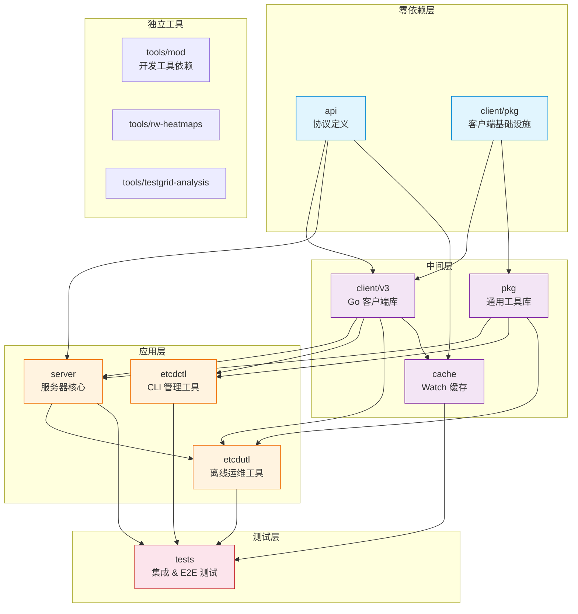
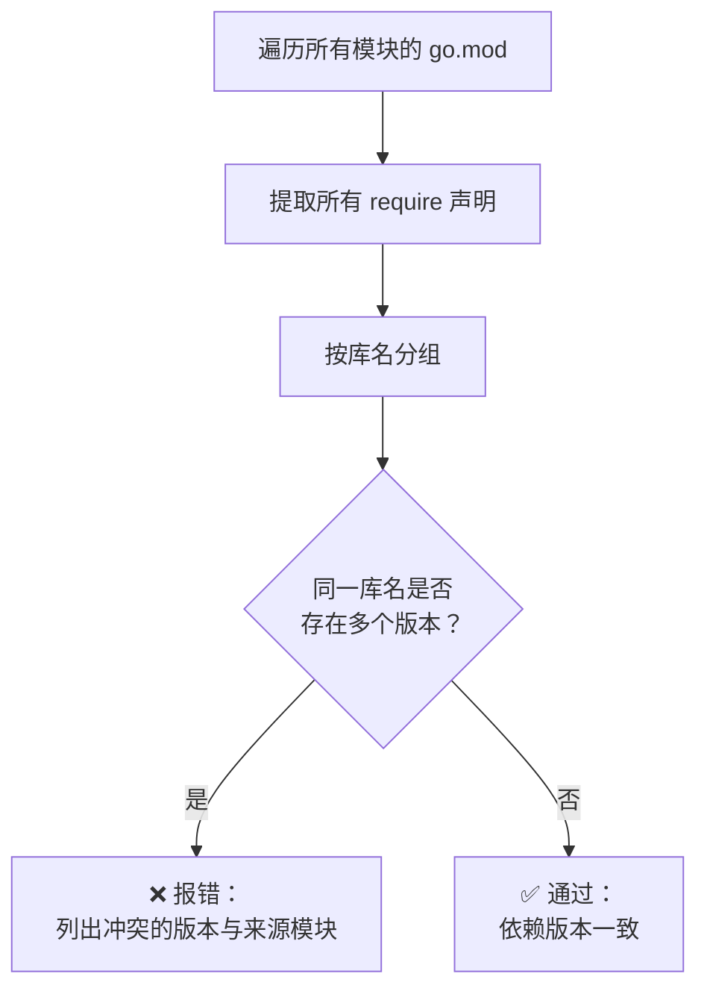

当你第一次打开 etcd 的源码仓库，可能会疑惑：为什么根目录下有一个 `go.mod`，而 `api/`、`server/`、`client/v3/` 等子目录里也各自有一个 `go.mod`？为什么还有一个叫 `go.work` 的文件？这些文件之间是什么关系？本文将从第一性原理出发，为你拆解 etcd 的**多模块工程结构**和 **Go Workspace** 机制，帮助你建立清晰的模块化认知框架。

Sources: [go.work](go.work#L1-L22), [go.mod](go.mod#L1-L17)

## 为什么需要多模块？

在 Go 语言的早期，一个仓库就是一个模块——一个 `go.mod` 搞定一切。但对于像 etcd 这样被广泛依赖的基础设施项目，单模块模式带来了一个核心问题：**版本耦合**。假设 etcd 的服务器端代码（`server`）依赖了 gRPC 某个新特性，但客户端库（`client/v3`）的用户并不需要这个依赖——在单模块世界里，客户端库被迫接受所有服务器端的依赖，体积膨胀、编译变慢。

etcd 自 v3.5 起采用**多模块（multi-module）**架构，将仓库拆分为多个独立发布、独立版本化的 Go 模块。每个模块有自己的 `go.mod`，声明自己的依赖，发布自己的版本标签。这样做的好处是：外部用户只需引入他们真正需要的模块，而不会被无关依赖污染。但多模块也带来了一个工程挑战——**本地开发时，模块间如何引用未发布的本地代码？** 这正是 Go Workspace 要解决的问题。

Sources: [Documentation/contributor-guide/modules.md](Documentation/contributor-guide/modules.md#L1-L39)

## 模块全景：12 个模块的定位与职责

etcd 仓库包含 12 个 Go 模块，每个模块在 `go.work` 文件中被注册。下表按依赖层次从底到顶排列，帮助你理解每个模块的定位。

| 模块路径 | 模块名称 | 核心定位 | 典型消费者 |
|---|---|---|---|
| `api` | `go.etcd.io/etcd/api/v3` | gRPC/Protobuf 协议定义，客户端与服务端的通信契约 | server、client/v3、etcdctl、etcdutl、tests |
| `client/pkg` | `go.etcd.io/etcd/client/pkg/v3` | 客户端基础设施：文件工具、日志、TLS、传输层 | client/v3、pkg、server |
| `pkg` | `go.etcd.io/etcd/pkg/v3` | 通用工具库：标志位解析、调度器、等待队列等 | server、etcdctl、etcdutl |
| `cache` | `go.etcd.io/etcd/cache/v3` | Watch 缓存层：环形缓冲区、事件去复用 | tests |
| `client/v3` | `go.etcd.io/etcd/client/v3` | 官方 Go 客户端库：连接管理、重试、KV/Watch/Lease 操作 | server、etcdctl、etcdutl、tests |
| `server` | `go.etcd.io/etcd/server/v3` | 服务器核心：Raft 应用、存储引擎、认证体系 | etcdutl、tests |
| `etcdctl` | `go.etcd.io/etcd/etcdctl/v3` | 命令行管理工具 | tests |
| `etcdutl` | `go.etcd.io/etcd/etcdutl/v3` | 离线运维工具：快照恢复、数据迁移 | tests |
| `tests` | `go.etcd.io/etcd/tests/v3` | 集成测试与端到端测试（依赖所有模块） | 仅内部使用 |
| `tools/mod` | `go.etcd.io/etcd/tools/v3` | 开发工具依赖聚合器（lint、proto-gen 等） | 仅开发时使用 |
| `tools/rw-heatmaps` | `go.etcd.io/etcd/tools/rw-heatmaps/v3` | 读写性能热力图生成工具 | 独立工具 |
| `tools/testgrid-analysis` | `go.etcd.io/etcd/tools/testgrid-analysis/v3` | TestGrid 测试结果分析工具 | 独立工具 |
| **根模块 `.`** | `go.etcd.io/etcd/v3` | 聚合模块：拉取所有子模块，生成物料清单（BOM） | 发布产物 |

Sources: [go.work](go.work#L7-L21), [scripts/test_lib.sh](scripts/test_lib.sh#L100-L115)

## 依赖层次图：谁依赖谁？

理解模块间的依赖关系是掌握整个工程结构的钥匙。下图展示了 etcd 模块之间的核心依赖链。**箭头方向表示"被依赖"**——即箭头指向的模块是被其他模块引用的基础模块。



**关键洞察**：依赖图呈现清晰的分层结构。`api` 和 `client/pkg` 位于最底层，几乎不依赖任何其他 etcd 模块；`server` 位于应用层核心，向上被 `etcdutl` 和 `tests` 依赖；`tests` 是最终的消费者，依赖仓库中几乎所有模块。这种分层确保了底层模块的稳定性——修改 `server` 不会影响 `api` 的接口契约。

Sources: [api/go.mod](api/go.mod#L1-L28), [client/pkg/go.mod](client/pkg/go.mod#L1-L22), [server/go.mod](server/go.mod#L7-L47), [tests/go.mod](tests/go.mod#L7-L54)

## Go Workspace：统一多模块开发的粘合剂

### 问题背景

在多模块仓库中，当你同时修改 `api` 模块的 Protobuf 定义和 `server` 模块中使用该定义的代码时，你需要一种方式让 `server` 的 `go.mod` 中的 `require go.etcd.io/etcd/api/v3` 指向**本地的 `api` 目录**，而不是远程的已发布版本。传统做法是在每个 `go.mod` 中使用 `replace` 指令：

```
# server/go.mod 中的 replace 指令
replace go.etcd.io/etcd/api/v3 => ../api
```

这种方案可行，但有两个痛点：第一，`replace` 指令不能被带入发布版本（否则下游用户会指向一个不存在的本地路径），必须在发布前手动清理；第二，12 个模块的 `replace` 组合维护成本高。Go 1.18 引入的 **Workspace（`go.work`）** 优雅地解决了这个问题。

### `go.work` 文件解析

`go.work` 是 etcd 仓库的工作区配置文件，声明了哪些目录参与本地开发。它的结构极其简洁：

```go
// This is a generated file. Do not edit directly.

go 1.26

toolchain go1.26.2

use (
    .
    ./api
    ./cache
    ./client/pkg
    ./client/v3
    ./etcdctl
    ./etcdutl
    ./pkg
    ./server
    ./tests
    ./tools/mod
    ./tools/rw-heatmaps
    ./tools/testgrid-analysis
)
```

**`use` 块**列出了仓库中所有包含 `go.mod` 的目录。当 Go 工具链检测到 `go.work` 文件存在时，会自动将这些目录中的模块视为本地模块——即使 `go.mod` 中的 `require` 写着远程版本号，Go 编译器也会使用本地代码。这意味着你可以在本地同时修改多个模块，无需手动管理 `replace` 指令。

**注意文件头部的注释**："This is a generated file. Do not edit directly."——这个文件是由脚本自动生成的，你不应该手动编辑它。

Sources: [go.work](go.work#L1-L22)

### Workspace 与 replace 的共存关系

一个常见的困惑是：既然 `go.work` 已经解决了本地引用问题，为什么子模块的 `go.mod` 里还有 `replace` 指令？例如 `server/go.mod` 中：

```
replace (
    go.etcd.io/etcd/api/v3 => ../api
    go.etcd.io/etcd/client/pkg/v3 => ../client/pkg
    go.etcd.io/etcd/client/v3 => ../client/v3
    go.etcd.io/etcd/pkg/v3 => ../pkg
)
```

答案是**双重保障**。当开发者不在仓库根目录下工作（比如单独 clone 了 `server` 目录），或者在没有 `go.work` 的环境中构建时，`replace` 指令仍然生效。同时，这些 `replace` 指令在发布时会被自动移除，不会影响下游消费者。两种机制互补，构成了一个健壮的本地开发方案。

下表对比了两种机制的特性：

| 特性 | `go.work`（Workspace） | `replace`（go.mod 指令） |
|---|---|---|
| 作用范围 | 整个工作区（所有 `use` 块中的模块） | 单个 `go.mod` 文件内 |
| 是否需手动维护 | 否，脚本自动生成 | 是，需在各模块 `go.mod` 中声明 |
| 发布时处理 | 不参与发布（`go.work` 不随模块发布） | 发布脚本自动移除 |
| 适用场景 | 本地跨模块开发 | 兜底保障，无 Workspace 时仍可编译 |
| 版本兼容 | Go 1.18+ | 所有 Go 版本 |

Sources: [server/go.mod](server/go.mod#L78-L83), [client/v3/go.mod](client/v3/go.mod#L47-L50), [go.work](go.work#L7-L21)

### Workspace 生成脚本

`go.work` 由 `scripts/update_go_workspace.sh` 脚本自动生成，你不应手动编辑。其核心逻辑只有四步：


脚本通过 `git ls-files` 找到仓库中所有 `go.mod` 文件，对每个文件所在目录执行 `go work edit -use`，将其加入工作区。然后从根模块的 `go.mod` 和 `.go-version` 文件读取版本号进行同步。最后执行 `go mod download` 生成 `go.work.sum`。

你可以通过以下命令重新生成工作区文件：

```bash
make update-go-workspace
```

或者在 CI 中通过 `make verify-go-workspace` 验证工作区是否与代码同步。

Sources: [scripts/update_go_workspace.sh](scripts/update_go_workspace.sh#L38-L59), [Makefile](Makefile#L239-L241)

## 依赖边界守卫：gomodguard

多模块架构的一个核心风险是**依赖方向违规**——比如底层模块意外引入了上层模块的依赖，形成循环引用或不当耦合。etcd 使用 `.gomodguard.yaml` 文件来声明每个模块的**禁止依赖清单**。

每个模块的禁止规则反映了它在依赖图中的定位。以 `api` 模块为例，它位于依赖链的最底层，因此禁止依赖仓库中的任何其他模块：

```yaml
# api/.gomodguard.yaml
blocked:
  modules:
    - go.etcd.io/etcd:
        reason: "Forbidden dependency"
    - go.etcd.io/etcd/api/v3:
        reason: "Forbidden dependency"
    - go.etcd.io/etcd/pkg/v3:
        reason: "Forbidden dependency"
    - go.etcd.io/etcd/server/v3:
        reason: "Forbidden dependency"
    - go.etcd.io/etcd/tests/v3:
        reason: "Forbidden dependency"
    - go.etcd.io/etcd/v3:
        reason: "Forbidden dependency"
```

各模块的禁止规则汇总如下：

| 模块 | 禁止依赖 | 设计意图 |
|---|---|---|
| `api` | **所有**其他 etcd 模块 | 协议定义必须完全独立，零耦合 |
| `client/pkg` | （无 gomodguard 配置） | 基础设施层，已足够精简 |
| `pkg` | api、server、tests、根模块 | 通用工具不应依赖业务逻辑 |
| `client/v3` | pkg、server、tests、根模块 | 客户端库保持轻量，不引入服务器实现 |
| `server` | tests、根模块 | 服务器可使用 api、client 等，但不应依赖测试 |
| `etcdctl` | tests、根模块 | CLI 工具不应引入测试代码 |
| `etcdutl` | tests、根模块 | 同上 |

这些规则通过 `make verify-gomodguard` 在 CI 中强制执行。如果你在 `api` 模块中不小心引入了对 `server` 的依赖，CI 会立即报错并阻止合并。

Sources: [api/.gomodguard.yaml](api/.gomodguard.yaml#L1-L16), [client/v3/.gomodguard.yaml](client/v3/.gomodguard.yaml#L1-L14), [server/.gomodguard.yaml](server/.gomodguard.yaml#L1-L10), [scripts/test.sh](scripts/test.sh#L491-L495)

## 根模块的聚合角色

仓库根目录下的 `go.mod`（模块名 `go.etcd.io/etcd/v3`）扮演着一个特殊的**聚合角色**。它不包含主要业务代码（只有一个小小的 `dummy.go` 文件），而是通过 `require` 和 `replace` 指令将所有子模块拉到一起。这个设计的直接目的是支持**物料清单（BOM）生成**——项目需要声明所有子模块的依赖关系用于安全审计。

`dummy.go` 文件的存在就是为了防止 `go mod tidy` 清理掉根模块中不需要直接 import 的子模块依赖：

```go
package main_test

// MainTest package makes sure these packages stay as dependencies of the root
// module (e.g. for sake of 'bom' generation).
import (
    _ "go.etcd.io/etcd/etcdctl/v3/ctlv3/command" // keep
    _ "go.etcd.io/etcd/etcdutl/v3/etcdutl"       // keep
    _ "go.etcd.io/etcd/tests/v3/integration"      // keep
)
```

这段空白导入（blank import）利用 Go 编译器的规则——`_ "package"` 会将包加入依赖但不实际使用——确保根模块的 `go.mod` 保留了对 `etcdctl`、`etcdutl`、`tests` 的直接依赖，从而使 BOM 脚本能够扫描到所有子模块的传递依赖。

Sources: [go.mod](go.mod#L1-L41), [dummy.go](dummy.go#L15-L24)

## 日常开发中的多模块操作

### 跨模块代码修改的典型流程

当你的修改涉及多个模块时（例如在 `api` 中新增了一个 Protobuf 字段，需要在 `server` 中使用），Go Workspace 让整个过程变得流畅：

1. 在 `api` 模块中修改 `.proto` 文件并重新生成 Go 代码
2. 在 `server` 模块中直接引用新的类型——不需要修改任何版本号
3. Go 工具链通过 `go.work` 自动将 `server` 中的 `go.etcd.io/etcd/api/v3` 解析为本地 `api/` 目录的代码
4. 运行测试验证所有模块

### 常用的多模块管理命令

| 命令 | 用途 | 说明 |
|---|---|---|
| `make fix-mod-tidy` | 对所有模块执行 `go mod tidy` | 遍历工作区中每个模块，清理无用依赖 |
| `make update-go-workspace` | 重新生成 `go.work` | 在新增/删除模块后执行 |
| `make verify-dep` | 检查依赖版本一致性 | 确保同一第三方库在所有模块中版本统一 |
| `make verify-go-workspace` | 验证工作区同步状态 | 确保 `go.work.sum` 与实际依赖一致 |
| `make verify-gomodguard` | 验证依赖边界规则 | 确保没有模块违反 gomodguard 约束 |
| `make fix` | 一键修复所有可自动修复的问题 | 包含 mod-tidy、bom、lint、workspace 等 |

其中 `make fix` 是最常用的"万能修复"命令，它会依次执行 `fix-mod-tidy`、`fix-bom`、`fix-lint`、`sync-toolchain-directive`、`update-go-workspace`、`fix-shell-ws`，覆盖了日常开发中最常见的代码风格和模块管理问题。

Sources: [Makefile](Makefile#L99-L106), [scripts/fix/mod-tidy.sh](scripts/fix/mod-tidy.sh#L17-L24), [scripts/test.sh](scripts/test.sh#L517-L536)

## 工具模块与主模块的区分

`go.work` 中的 12 个模块可以分为两类：**核心发布模块**和**开发工具模块**。`tools/mod`、`tools/rw-heatmaps`、`tools/testgrid-analysis` 属于后者，它们不参与 etcd 的功能交付，只在开发和测试过程中使用。

这种区分在 BOM（物料清单）生成中尤为重要。`tests/robustness/Makefile` 被包含在根 Makefile 中，但 `tools/` 下的模块在 BOM 生成时会被过滤掉——函数 `load_workspace_relative_modules_for_bom` 显式排除了以 `./tools` 开头的路径：

```bash
function load_workspace_relative_modules_for_bom() {
  local -n relative_modules_for_bom=$1
  local modules=()
  load_workspace_relative_modules modules
  for module in "${modules[@]}"; do
    if [[ ! "${module}" =~ ^./tools ]]; then
      relative_modules_for_bom+=("${module}")
    fi
  done
}
```

这意味着 `tools/mod` 中引入的 linter、proto 生成器等工具依赖不会出现在 etcd 的安全审计清单中，保持了 BOM 的精确性。

Sources: [scripts/test_lib.sh](scripts/test_lib.sh#L125-L136), [tests/go.mod](tests/go.mod#L7-L16)

## 版本统一原则

etcd 的多模块架构遵循一条严格的版本管理原则：**所有 etcd 自有模块必须使用统一的版本号**。例如，当 `client/v3` 的 `go.mod` 中声明 `go.etcd.io/etcd/api/v3 v3.6.0-alpha.0` 时，`server`、`etcdctl` 等所有引用 `api` 的模块也必须使用相同的 `v3.6.0-alpha.0`。

这条原则不仅限于 etcd 自有模块，还延伸到第三方依赖——**所有模块中同一第三方库的版本必须一致**。例如 `google.golang.org/grpc` 在所有模块中都是 `v1.80.0`。CI 通过 `make verify-dep` 强制检查这一点：脚本遍历所有工作区模块的依赖，按库名分组后检查是否存在版本不一致。



版本更新通过脚本统一操作：

```bash
DRY_RUN=false TARGET_VERSION="v3.5.10" ./scripts/release_mod.sh update_versions
```

这会批量更新所有模块中 etcd 自有模块的版本号，确保一致性。

Sources: [scripts/test.sh](scripts/test.sh#L517-L536), [Documentation/contributor-guide/modules.md](Documentation/contributor-guide/modules.md#L42-L56)

## 从模块结构到代码导航

理解了多模块的拓扑之后，你可以更有目的地在代码中导航。当你想理解某个功能的实现链路时，先定位它所属的模块，再根据依赖关系判断上下游。例如：

- 想看 **gRPC 接口定义**？去 `api/` 模块的 `.proto` 和 `.pb.go` 文件
- 想看 **客户端如何发送请求**？去 `client/v3/` 模块
- 想看 **服务端如何处理请求**？去 `server/` 模块的 `etcdserver/` 目录
- 想看 **存储引擎如何工作**？去 `server/` 模块的 `storage/` 目录
- 想看 **如何运行集成测试**？去 `tests/` 模块

下一步，建议你阅读 [整体架构：从嵌入层到存储层的分层设计](6-zheng-ti-jia-gou-cong-qian-ru-ceng-dao-cun-chu-ceng-de-fen-ceng-she-ji) 来深入理解 `server` 模块内部的分层设计，或者回到 [开发环境搭建与贡献流程](4-kai-fa-huan-jing-da-jian-yu-gong-xian-liu-cheng) 了解如何搭建本地开发环境并提交你的第一个贡献。