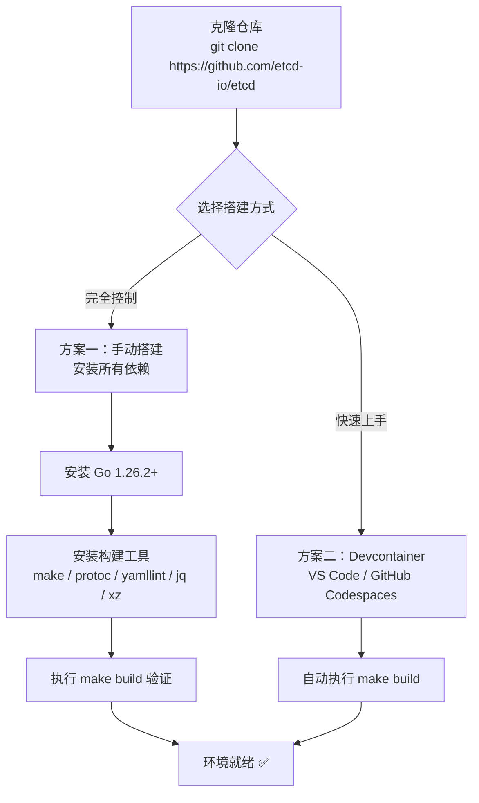
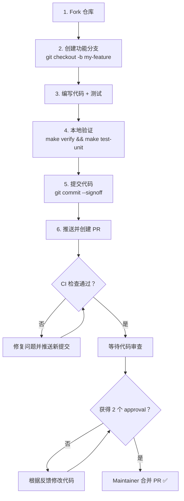
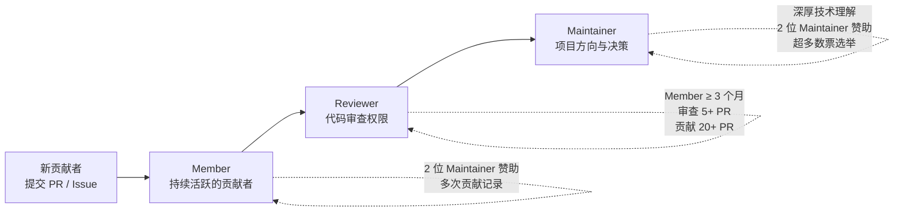

本文是 etcd 项目的**开发环境搭建与贡献流程**完整指南，面向首次接触 etcd 代码库的开发者。内容涵盖环境准备（手动安装与 Devcontainer 两种路径）、构建与测试命令体系、代码质量检查、Git 提交规范、Pull Request 流程以及社区角色晋升机制。阅读完本文后，你将能够从零开始搭建完整的开发环境，并顺利完成第一个贡献。

Sources: [CONTRIBUTING.md](CONTRIBUTING.md#L1-L14)

## 前置条件：了解 etcd 的学习资源

在动手修改代码之前，建议先通过以下资源建立对项目的整体认知：

- **Git 基础**：etcd 使用 Git 进行版本控制，需熟悉基本的分支、提交与合并操作。
- **etcd 官方学习资源**：[etcd learning resources](https://etcd.io/docs/v3.5/learning/) 提供概念讲解与使用教程。
- **社区成员制度**：etcd 社区定义了 Member → Reviewer → Maintainer 的角色晋升路径，了解这些角色有助于理解项目的治理结构。
- **视频资源**：[etcd deep dive](https://www.youtube.com/watch?v=D2pm6ufIt98&t=927s) 和 [etcd code walkthrough](https://www.youtube.com/watch?v=H3XaSF6wF7w) 分别从架构和代码两个维度进行了深入讲解。

Sources: [CONTRIBUTING.md](CONTRIBUTING.md#L19-L28), [community-membership.md](Documentation/contributor-guide/community-membership.md#L1-L10)

## 开发环境搭建

etcd 项目提供两条环境搭建路径。下图展示了从零开始的完整决策流程：



### 方案一：手动搭建本地环境

这是 etcd 项目**最成熟的开发方式**，向下兼容旧版本开发，也是目前 CI 系统使用的标准路径。etcd 项目仅官方支持 `linux-amd64` 架构，其他环境的 Bug 报告通常不会被处理。

**第一步：克隆仓库**

```bash
git clone https://github.com/etcd-io/etcd.git
cd etcd
```

**第二步：安装 Go 语言环境**

etcd 当前要求 Go 版本为 **1.26.2**，该信息记录在项目根目录的 [`.go-version`](.go-version#L1) 文件和 [`go.mod`](go.mod#L3) 文件中。请按照 [Go 官方安装指南](https://go.dev/doc/install) 进行安装。

**第三步：安装构建工具链**

| 工具 | 用途 | 安装方式（Debian 系） |
|------|------|----------------------|
| `make` | 驱动构建与测试流程 | `sudo apt-get install build-essential` |
| `protoc` v3.20.3 | Protocol Buffers 编译器 | [下载页面](https://github.com/protocolbuffers/protobuf/releases/tag/v3.20.3) |
| `yamllint` | YAML 文件格式检查 | `sudo apt-get install yamllint` |
| `jq` | JSON 处理（BOM 生成等） | `sudo apt-get install jq` |
| `xz` | 压缩解压工具 | `sudo apt-get install xz-utils` |

**第四步：验证安装**

```bash
make build
```

成功后会在 `./bin/` 目录下生成三个核心二进制文件：`etcd`（服务端）、`etcdctl`（客户端命令行工具）和 `etcdutl`（运维工具）。如果需要自定义构建标志，可通过环境变量 `GO_BUILD_FLAGS` 传递：

```bash
GO_BUILD_FLAGS="-buildmode=pie" make build
```

Sources: [CONTRIBUTING.md](CONTRIBUTING.md#L89-L114)

### 方案二：Devcontainer 自动化环境

对于 etcd 3.6 及更高版本，项目提供了基于 Devcontainer 规范的一键环境搭建方案，支持两种使用方式：

- **本地 VS Code + Docker**：在本地安装 [Visual Studio Code](https://code.visualstudio.com) 和 Docker 后，打开仓库即可自动构建开发容器。
- **GitHub Codespaces**：直接在浏览器中创建云端开发环境，无需本地安装任何工具。

Devcontainer 配置文件 [`devcontainer.json`](.devcontainer/devcontainer.json#L1-L22) 定义了完整的开发环境：

```json
{
  "name": "Go",
  "image": "mcr.microsoft.com/devcontainers/go:1.26-bookworm",
  "features": {
    "ghcr.io/devcontainers/features/docker-in-docker:2": {},
    "ghcr.io/devcontainers/features/github-cli:1": {},
    "ghcr.io/devcontainers/features/kubectl-helm-minikube:1": {}
  },
  "forwardPorts": [2379, 2380],
  "postCreateCommand": "make build"
}
```

容器创建后自动执行 `make build`，并转发 etcd 的默认客户端端口（2379）和对等通信端口（2380），开箱即用。

Sources: [devcontainer.json](.devcontainer/devcontainer.json#L1-L22), [CONTRIBUTING.md](CONTRIBUTING.md#L116-L129)

## 构建体系详解

etcd 使用 Makefile 驱动整个构建流程，核心命令通过 `scripts/` 目录下的 Shell 脚本实现。理解构建体系有助于你在开发过程中快速定位问题。

### 核心构建命令

| 命令 | 作用 | 输出位置 |
|------|------|---------|
| `make build` | 构建核心二进制文件 | `./bin/etcd`, `./bin/etcdctl`, `./bin/etcdutl` |
| `make tools` | 构建辅助工具 | `./bin/benchmark`, `./bin/etcd-dump-db` 等 |
| `make build-all` | 交叉编译所有平台 | 按平台命名 |
| `make clean` | 清理构建产物 | — |

构建脚本 [`build_lib.sh`](scripts/build_lib.sh#L37-L88) 的工作机制值得了解：它分别进入 `server`、`etcdutl`、`etcdctl` 三个模块目录，执行 `go build` 并通过 `-ldflags` 注入 Git SHA 版本信息，最终将二进制文件输出到 `./bin/` 目录。构建过程默认禁用 CGO（`CGO_ENABLED=0`），以生成适合容器运行的静态链接二进制。

Sources: [Makefile](Makefile#L1-L41), [build_lib.sh](scripts/build_lib.sh#L37-L88)

### 多模块构建的架构

etcd 是一个 **Go Workspace 多模块项目**。[`go.work`](go.work#L1-L22) 文件定义了 12 个模块的 workspace：

```
go 1.26

use (
    .                          # 根模块 go.etcd.io/etcd/v3
    ./api                      # API 定义与 Protobuf 契约
    ./cache                    # Watch 缓存层
    ./client/pkg               # 客户端公共包
    ./client/v3                # v3 客户端库
    ./etcdctl                  # etcdctl 命令行工具
    ./etcdutl                  # etcdutl 运维工具
    ./pkg                      # 公共工具包
    ./server                   # 服务端核心
    ./tests                    # 测试套件
    ./tools/mod                # 工具依赖管理
    ./tools/rw-heatmaps        # 读写热力图工具
    ./tools/testgrid-analysis  # TestGrid 分析工具
)
```

测试框架的 [`module_dirs()`](scripts/test_lib.sh#L87-L89) 函数枚举了所有需要参与构建和测试的模块目录，确保 `make test` 等命令能够遍历每个模块执行对应操作。

Sources: [go.work](go.work#L1-L22), [test_lib.sh](scripts/test_lib.sh#L87-L89)

## 测试命令体系

etcd 维护了一个**三层测试金字塔**：单元测试 → 集成测试 → 端到端测试。所有测试通过 [`scripts/test.sh`](scripts/test.sh#L1-L50) 脚本统一驱动，使用 `PASSES` 环境变量选择测试类型。

### 测试命令一览

| 命令 | 测试类型 | 默认超时 | 说明 |
|------|---------|---------|------|
| `make test-unit` | 单元测试 | 3 分钟 | 快速验证单个函数/模块的正确性 |
| `make test-integration` | 集成测试 | 15 分钟 | 验证模块间交互（含 tests/common） |
| `make test-e2e` | 端到端测试 | 30 分钟 | 启动真实进程，验证完整链路 |
| `make test-robustness` | 健壮性测试 | 30 分钟 | 故障注入与一致性验证 |
| `make test` | 全部测试 | — | 依次执行 unit + integration + e2e |

**运行指定包或测试用例**的常用模式：

```bash
# 仅测试 server/etcdserver 包的单元测试
PASSES=unit PKG=./server/etcdserver TIMEOUT=5m ./scripts/test.sh

# 仅运行名称匹配 TestNew 的测试用例
PASSES=unit PKG=./server/etcdserver TESTCASE="\bTestNew\b" TIMEOUT=1m ./scripts/test.sh

# 仅运行集成测试中的某个用例
PASSES=integration PKG=./tests/integration TESTCASE="\bTestV2NoRetryEOF\b" TIMEOUT=1m ./scripts/test.sh
```

测试框架自动检测 CPU 架构：在 `amd64` 和 `arm64` 上默认启用 **Race Detector**（竞态检测器），帮助你发现并发问题。对于端到端测试，由于测试的是预构建的二进制文件，`--race`、`--cover` 等标志不会生效。

Sources: [Makefile](Makefile#L42-L84), [test.sh](scripts/test.sh#L1-L50), [test.sh](scripts/test.sh#L126-L183)

## 代码质量检查与自动修复

在提交代码之前，必须确保通过所有静态分析检查。etcd 的质量检查涵盖了从代码风格到依赖管理的多个维度。

### 检查与修复命令对照表

| 检查命令 | 修复命令 | 检查内容 |
|---------|---------|---------|
| `make verify` | `make fix` | **全量检查 / 全量修复** |
| `make verify-lint` | `make fix-lint` | golangci-lint 静态分析 |
| `make verify-bom` | `make fix-bom` | 许可证物料清单一致性 |
| `make verify-dep` | — | 依赖完整性验证 |
| `make verify-mod-tidy` | `make fix-mod-tidy` | go.mod 整洁性 |
| `make verify-yamllint` | `make fix-yamllint` | YAML 文件格式 |
| `make verify-shellcheck` | — | Shell 脚本质量 |
| `make verify-genproto` | — | Protobuf 生成代码一致性 |
| `make verify-proto-annotations` | — | Proto 注解一致性 |
| `make verify-go-versions` | — | Go 版本一致性 |
| `make verify-go-workspace` | `make update-go-workspace` | go.work 文件一致性 |
| `make verify-gomodguard` | — | 模块依赖规则 |

**最佳实践**：在每次提交前运行 `make verify`，如果发现可自动修复的问题，运行 `make fix`。修复脚本（如 [`fix/bom.sh`](scripts/fix/bom.sh#L1-L54) 和 [`fix/mod-tidy.sh`](scripts/fix/mod-tidy.sh#L1-L25)）会自动更新对应文件。

Sources: [Makefile](Makefile#L97-L176), [CONTRIBUTING.md](CONTRIBUTING.md#L133-L151)

## 寻找适合你的 Issue

etcd 项目所有工作都通过 [GitHub Issue Tracker](https://github.com/etcd-io/etcd/issues) 追踪，使用标签（Label）系统进行分类：

| 标签 | 适用人群 | 说明 |
|------|---------|------|
| `good first issue` | 新手贡献者 | 难度较低，适合作为第一个贡献 |
| `help wanted` | 有一定经验的贡献者 | 社区需要帮助的任务 |
| `priority/important` | 高级贡献者 | 当前最重要的工作项 |
| `type/flake` | 任何贡献者 | 不稳定的测试用例，需要修复 |

### 修复不稳定测试（Flaky Tests）

不稳定测试是开源项目中常见的贡献切入点。etcd 使用 Kubernetes Prow 基础设施运行 CI，测试结果可以在 [TestGrid](https://testgrid.k8s.io/sig-etcd) 上查看。修复流程如下：

```bash
# 1. 安装 stress 工具
go install golang.org/x/tools/cmd/stress@latest

# 2. 编译目标测试
cd server/etcdserver/api/v3compactor
go test -v -c -count=1

# 3. 并发运行以复现不稳定行为
stress -p=8 ./v3compactor.test -test.run "^TestPeriodicSkipRevNotChange$"
```

如果确认测试存在不稳定问题，请在 GitHub 上提交带有 `type/flake` 标签的 Issue。

Sources: [CONTRIBUTING.md](CONTRIBUTING.md#L29-L76)

## Git 提交规范

etcd 遵循一套严格的提交消息约定，确保历史记录的可读性和可搜索性。

### 提交消息格式

```
<包名>: <简要描述做了什么>

<可选：解释为什么需要这个变更>

Signed-off-by: 名字 姓氏 <email@example.com>
```

**示例**：

```
etcdserver: add grpc interceptor to log info on incoming requests

To improve debuggability of etcd v3. Added a grpc interceptor to log
info on incoming requests to etcd server. The log output includes
remote client info, request content (with value field redacted), request
handling latency, response size, etc. Uses zap logger if available,
otherwise uses capnslog.

Signed-off-by: FirstName LastName <github@github.com>
```

**关键规则**：

1. **首行**：以包名（如 `etcdserver`、`etcdctl`）开头，后接冒号和空格，描述"做了什么"。
2. **正文**（可选）：解释"为什么"要做这个变更。
3. **签名行**：必须包含 `Signed-off-by`，这是 **DCO（Developer Certificate of Origin）** 的法律要求。使用 `git commit --signoff` 可以自动生成此行。

DCO 的核心含义是：你声明自己有权以项目的开源许可证提交这些代码。完整的法律文本记录在 [DCO](DCO#L1-L37) 文件中。

Sources: [CONTRIBUTING.md](CONTRIBUTING.md#L152-L172), [DCO](DCO#L12-L36)

## Pull Request 完整流程

下图展示了从创建分支到合并的完整 PR 生命周期：



### 创建 PR 的核心要点

**关联 Issue**：每个 PR 必须关联一个 Issue。如果尚无对应 Issue，请先创建一个。

**PR 规模**：多个小 PR 优于一个大 PR。**建议单个 PR 不超过 500 行代码**。

**Draft PR**：如果工作尚未完成，请将 PR 转为 Draft 状态（点击 PR 页面中的 "Convert to draft" 链接）。

**PR 模板**：项目提供了 [PR 模板](.github/PULL_REQUEST_TEMPLATE.md#L1-L7)，其中特别要求：如果使用了 AI 工具，必须予以披露。

### CI 检查与 ok-to-test

PR 提交后会自动触发 CI 检查（基于 Kubernetes Prow 和 GitHub Actions）。如果 PR 来自仓库外部贡献者，可能会被标记为 `needs-ok-to-test`，此时需要 etcd-io 组织成员在 PR 上评论 `/ok-to-test` 来触发测试。

如果无关测试因不稳定性而失败，请提交一个 `type/flake` Issue 并请求 Maintainer 重新运行测试。

### 审查与批准

PR 需要 **1-2 位 Maintainer 批准**才能合并，具体取决于变更的复杂度。审查政策定义在 [PR 管理文档](Documentation/contributor-guide/triage_prs.md#L36-L62) 中：

- **默认规则**：至少两位 Approver 的 `/lgtm` 或 GitHub Review Approval。
- **低风险变更例外**（CI 工作流、文档、注释等），一位 Approval 通常即可。
- **Maintainer 自身的变更**：即使是微小改动，也需要另一位 Maintainer、Reviewer 或子模块 Owner 的批准。

Sources: [CONTRIBUTING.md](CONTRIBUTING.md#L174-L197), [PULL_REQUEST_TEMPLATE.md](.github/PULL_REQUEST_TEMPLATE.md#L1-L7), [triage_prs.md](Documentation/contributor-guide/triage_prs.md#L36-L62)

## 本地集群快速验证

完成构建后，你可以使用项目自带的 `Procfile` 快速启动一个本地多节点集群进行手动验证。

### 单节点集群

```bash
./bin/etcd
# 默认监听 localhost:2379 处理客户端请求
```

### 多节点集群

```bash
# 安装 goreman 进程管理器
go install github.com/mattn/goreman@latest

# 使用项目 Procfile 启动三节点集群
goreman -f Procfile start
# 节点分别监听：localhost:2379, localhost:22379, localhost:32379
```

集群启动后，可以通过 `etcdctl` 进行交互测试：

```bash
# 写入数据
./bin/etcdctl put foo bar

# 读取数据
./bin/etcdctl get foo

# 查看成员列表
./bin/etcdctl --write-out=table --endpoints=localhost:2379 member list
```

Sources: [Procfile](Procfile#L1-L27), [local_cluster.md](Documentation/contributor-guide/local_cluster.md#L1-L61)

## Issue 模板与问题报告

etcd 提供三种标准化的 Issue 模板，确保问题报告的质量和完整性：

| 模板 | 标签 | 适用场景 |
|------|------|---------|
| **Bug Report** | `type/bug` | 报告运行时错误或异常行为 |
| **Feature Request** | `type/feature` | 提出新功能建议 |
| **Flaking Test** | `type/flake`, `area/testing` | 报告不稳定的测试用例 |

Bug 报告模板要求提供：问题现象、期望行为、复现步骤、etcd 版本信息、配置详情、调试信息和相关日志。**不启用空白 Issue**（`blank_issues_enabled: false`），提问请转至 [GitHub Discussions](https://github.com/etcd-io/etcd/discussions)。

Sources: [bug-report.yml](.github/ISSUE_TEMPLATE/bug-report.yml#L1-L103), [feature-request.yml](.github/ISSUE_TEMPLATE/feature-request.yml#L1-L20), [test-flake.yml](.github/ISSUE_TEMPLATE/test-flake.yml#L1-L36), [config.yml](.github/ISSUE_TEMPLATE/config.yml#L1-L7)

## 社区角色与晋升路径

etcd 社区遵循三层角色体系，每个角色都有明确的准入条件和职责：



| 角色 | 定义方式 | 核心要求 | 核心权限 |
|------|---------|---------|---------|
| **Member** | etcd GitHub 组织成员 | 2 位 Maintainer/Reviewer 赞助 + 多次贡献 | Issue/PR 指派权、Triage 权限 |
| **Reviewer** | [OWNERS] 文件 reviewer 条目 | Member ≥ 3 个月 + 审查 5+ PR + 贡献 20+ PR | LGTM 计入合并门槛 |
| **Maintainer** | [OWNERS] 文件 approver 条目 | 深厚技术理解 + 2 位 Maintainer 赞助 + 超多数选举 | 技术决策权、发布管理权 |

项目的顶层 [OWNERS](OWNERS#L1-L20) 文件列出了当前活跃的 Maintainer（通过 `sig-etcd-chairs` 和 `sig-etcd-tech-leads` 别名组定义）和已退休的 Emeritus Maintainer。具体的别名映射记录在 [OWNERS_ALIASES](OWNERS_ALIASES#L1-L10) 文件中。

Sources: [community-membership.md](Documentation/contributor-guide/community-membership.md#L1-L178), [OWNERS](OWNERS#L1-L20), [OWNERS_ALIASES](OWNERS_ALIASES#L1-L10)

## 完整的开发工作流速查表

以下表格汇总了日常开发中最常用的命令，供快速查阅：

| 阶段 | 命令 | 说明 |
|------|------|------|
| **构建** | `make build` | 编译 etcd + etcdctl + etcdutl |
| **构建工具** | `make tools` | 编译 benchmark、etcd-dump-db 等辅助工具 |
| **清理** | `make clean` | 清除所有构建产物 |
| **单元测试** | `make test-unit` | 快速反馈，3 分钟超时 |
| **集成测试** | `make test-integration` | 模块间交互验证，15 分钟超时 |
| **端到端测试** | `make test-e2e` | 需先 `make build`，30 分钟超时 |
| **全量检查** | `make verify` | 运行所有静态分析 |
| **全量修复** | `make fix` | 自动修复可修复的问题 |
| **提交** | `git commit --signoff` | 带 DCO 签名的提交 |
| **本地集群** | `goreman -f Procfile start` | 启动三节点本地集群 |

## 下一步阅读

完成开发环境搭建后，建议按照以下顺序继续学习：

1. **[命令行工具 etcdctl 与 etcdutl 使用指南](5-ming-ling-xing-gong-ju-etcdctl-yu-etcdutl-shi-yong-zhi-nan)**：掌握构建产物的具体使用方法，理解客户端与服务端的交互模式。
2. **[整体架构：从嵌入层到存储层的分层设计](6-zheng-ti-jia-gou-cong-qian-ru-ceng-dao-cun-chu-ceng-de-fen-ceng-she-ji)**：在动手修改代码之前，建立对 etcd 分层架构的全局认知。
3. **[测试体系概览：单元测试、集成测试与端到端测试](24-ce-shi-ti-xi-gai-lan-dan-yuan-ce-shi-ji-cheng-ce-shi-yu-duan-dao-duan-ce-shi)**：深入了解测试框架的设计理念与编写规范，确保你的贡献符合项目的质量标准。