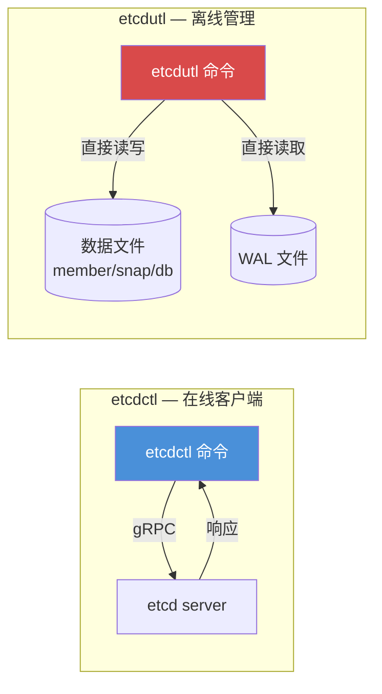
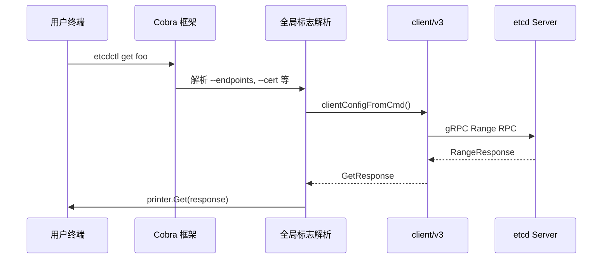

etcd 项目提供了两个定位截然不同的命令行工具：**etcdctl** 是通过网络 gRPC 接口与运行中的 etcd 集群交互的客户端工具，而 **etcdutl** 则是直接操作 etcd 数据文件的离线管理工具。理解二者的边界是高效运维 etcd 的第一步——当你需要读写键值、管理租约或操作集群成员时使用 `etcdctl`；当你需要在 etcd 停机状态下恢复快照、整理碎片或检查数据完整性时则使用 `etcdutl`。

Sources: [main.go](etcdctl/main.go#L15-L24), [main.go](etcdutl/main.go#L15-L26)

## 工具定位与架构对比

两个工具都基于 **Cobra** 命令行框架构建，共享类似的输出格式体系（simple / json / table / fields / protobuf），但它们的操作对象完全不同。etcdctl 依赖 `client/v3` 客户端库通过 gRPC 连接远程服务器，其全局标志包含端点地址、TLS 证书、认证凭据、拨号超时等网络参数；etcdutl 则直接打开本地 BoltDB 文件，其全局标志仅需 `--timeout`（文件锁等待时间）和 `--write-out`（输出格式）。



| 维度 | etcdctl | etcdutl |
|------|---------|---------|
| **定位** | etcd v3 API 的命令行客户端 | etcd 的离线管理工具 |
| **操作对象** | 运行中的 etcd 集群（通过网络） | 本地 etcd 数据文件（离线） |
| **前置条件** | etcd 服务正常运行 | etcd 服务已停止 |
| **核心依赖** | `client/v3` gRPC 客户端库 | `server/storage` 后端直接操作 |
| **网络需求** | 必须能访问 etcd 端点 | 无需网络 |
| **默认端点** | `127.0.0.1:2379` | 不适用 |
| **输出格式** | simple, json, table, fields, protobuf | simple, json, table, fields, protobuf |
| **典型场景** | 日常 CRUD、集群管理、认证配置 | 快照恢复、离线碎片整理、数据迁移 |

Sources: [ctl.go](etcdctl/ctlv3/ctl.go#L30-L38), [ctl.go](etcdutl/ctl.go#L26-L39)

## etcdctl：在线客户端详解

etcdctl 将所有命令组织为五大命令组：**Key-value**（键值操作）、**Cluster maintenance**（集群维护）、**Concurrency**（并发原语）、**Authentication**（认证管理）和 **Utility**（实用工具）。这种分组在帮助输出中清晰可见，便于快速定位所需命令。

Sources: [ctl.go](etcdctl/ctlv3/ctl.go#L79-L113), [groups.go](etcdctl/ctlv3/command/groups.go#L19-L25)

### 全局标志与环境变量

etcdctl 的所有全局标志都支持环境变量配置，规则是将标志名加上 `ETCDCTL_` 前缀、转大写、并将连字符替换为下划线。例如 `--dial-timeout` 对应 `ETCDCTL_DIAL_TIMEOUT`，`--cacert` 对应 `ETCDCTL_CACERT`。

| 标志 | 默认值 | 说明 |
|------|--------|------|
| `--endpoints` | `127.0.0.1:2379` | gRPC 端点列表（逗号分隔） |
| `--dial-timeout` | `2s` | 拨号超时 |
| `--command-timeout` | `5s` | 命令执行超时（不含拨号时间） |
| `--keepalive-time` | `2s` | gRPC keepalive 时间 |
| `--keepalive-timeout` | `6s` | gRPC keepalive 超时 |
| `--write-out` / `-w` | `simple` | 输出格式（simple/json/table/fields/protobuf） |
| `--hex` | `false` | 以十六进制显示字节串 |
| `--debug` | `false` | 启用客户端调试日志 |
| `--cacert` | 空 | CA 证书路径 |
| `--cert` | 空 | 客户端 TLS 证书路径 |
| `--key` | 空 | 客户端 TLS 私钥路径 |
| `--user` | 空 | 用户名[:密码] 认证 |
| `--password` | 空 | 密码（单独指定时配合 --user 使用） |
| `--insecure-transport` | `true` | 禁用 TLS 传输安全 |
| `--insecure-skip-tls-verify` | `false` | 跳过服务端证书验证 |
| `--discovery-srv` / `-d` | 空 | 用于 DNS SRV 发现的域名 |

Sources: [ctl.go](etcdctl/ctlv3/ctl.go#L49-L77), [global.go](etcdctl/ctlv3/command/global.go#L41-L64)

### 键值操作命令

键值命令是 etcdctl 最核心的功能集，涵盖 `get`、`put`、`del`、`txn`、`compaction` 和 `watch` 六个命令。它们直接映射到 etcd v3 gRPC API 的 Range、Put、DeleteRange、Txn、Compact 和 Watch RPC。

#### get — 读取键值

`get` 命令支持丰富的过滤选项，包括前缀匹配（`--prefix`）、范围查询（`[key, range_end)`）、按 revision 查询、排序、限制数量等。它还支持两种一致性级别：`--consistency=l`（Linearizable，默认，强一致）和 `--consistency=s`（Serializable，低延迟但可能返回旧数据）。

```bash
# 读取单个键
etcdctl get foo

# 按前缀读取，按键降序排列
etcdctl get --prefix --order=DESCEND --sort-by=KEY /config/

# 读取所有键（从空键开始）
etcdctl get --from-key ''

# 仅获取键名（不返回值）
etcdctl get --prefix --keys-only /app/

# 获取键数量
etcdctl get --prefix --count-only /app/ -w fields

# 在指定 revision 上读取（时间旅行查询）
etcdctl get --rev=1000 foo
```

| 常用选项 | 说明 |
|----------|------|
| `--prefix` | 前缀匹配 |
| `--from-key` | 获取 >= 指定键的所有键 |
| `--rev` | 指定读取的 revision |
| `--limit` | 限制返回数量 |
| `--keys-only` | 仅返回键 |
| `--sort-by` | 排序字段（CREATE/KEY/MODIFY/VALUE/VERSION） |
| `--order` | 排序方向（ASCEND/DESCEND） |
| `--consistency` | 一致性级别（l=线性, s=可串行化） |

Sources: [get_command.go](etcdctl/ctlv3/command/get_command.go#L44-L79)

#### put — 写入键值

`put` 命令将值绑定到指定键。当键已存在时覆盖其值。值可以从命令行参数或标准输入提供，支持绑定租约、返回旧值等操作。

```bash
# 基本写入
etcdctl put foo bar

# 绑定租约（lease ID 为十六进制）
etcdctl put foo bar --lease=1234abcd

# 返回被覆盖前的旧值
etcdctl put foo new_value --prev-kv

# 通过管道写入文件内容
cat config.yaml | etcdctl put /app/config

# 仅更新租约绑定，保留当前值
etcdctl put foo --ignore-lease --lease=5678efab
```

| 选项 | 说明 |
|------|------|
| `--lease` | 绑定租约 ID（十六进制） |
| `--prev-kv` | 返回修改前的键值 |
| `--ignore-value` | 保留当前值不变（仅更新元数据） |
| `--ignore-lease` | 保留当前租约不变 |

Sources: [put_command.go](etcdctl/ctlv3/command/put_command.go#L36-L67)

#### del — 删除键值

`del` 支持单键删除、前缀删除、范围删除，并可选返回被删除的键值。

```bash
# 删除单个键
etcdctl del foo

# 按前缀删除
etcdctl del --prefix zoo

# 删除从 key1 到 key3 之间的键（不含 key3）
etcdctl del key1 key3 --range

# 返回被删除的键值
etcdctl del foo --prev-kv
```

Sources: [del_command.go](etcdctl/ctlv3/command/del_command.go#L36-L49)

#### txn — 事务

`txn` 命令实现了 etcd 的事务语义：一组条件判断 + 成功时的操作列表 + 失败时的操作列表，整体原子执行。支持交互模式（`-i`）和非交互模式（从标准输入读取）。

```bash
# 交互模式
etcdctl txn -i
# compares:
mod("key1") > "0"

# success requests (get, put, del):
put key1 "overwrote-key1"

# failure requests (get, put, del):
put key1 "created-key1"
put key2 "some extra key"
```

事务中的条件表达式支持 `create()`、`mod()`、`value()`、`version()` 和 `lease()` 五种比较目标，搭配 `<`、`=`、`>` 三种比较运算符。

Sources: [txn_command.go](etcdctl/ctlv3/command/txn_command.go#L35-L67)

#### compaction — 压缩历史

`compaction` 丢弃指定 revision 之前的所有事件历史，释放存储空间。配合 `--physical` 可等待物理删除完成。

```bash
# 压缩到 revision 1234
etcdctl compaction 1234

# 等待物理删除完成
etcdctl compaction --physical 1234
```

Sources: [compaction_command.go](etcdctl/ctlv3/command/compaction_command.go#L30-L39)

#### watch — 监听变更

`watch` 实时监听键或前缀的变更事件，支持交互模式、从指定 revision 开始监听，以及触发外部命令。

```bash
# 监听单个键
etcdctl watch foo

# 监听前缀
etcdctl watch --prefix /config/

# 从 revision 10 开始回放
etcdctl watch --rev=10 foo

# 交互模式（可同时监听多个键）
etcdctl watch -i

# 监听变更并触发脚本
etcdctl watch foo -- /bin/sh -c 'echo $ETCD_WATCH_KEY changed'
```

Sources: [watch_command.go](etcdctl/ctlv3/command/watch_command.go#L48-L63)

### 租约管理命令

`lease` 命令组包含五个子命令，用于管理 etcd 的租约（TTL）机制。租约可以绑定到键上，当租约过期时所有关联的键将自动被删除。

| 子命令 | 说明 | 示例 |
|--------|------|------|
| `grant <ttl>` | 创建租约（TTL 单位：秒） | `etcdctl lease grant 300` |
| `revoke <leaseID>` | 撤销租约 | `etcdctl lease revoke 694d7a9b` |
| `timetolive <leaseID>` | 查看租约剩余时间 | `etcdctl lease timetolive 694d7a9b --keys` |
| `list` | 列出所有活跃租约 | `etcdctl lease list` |
| `keep-alive <leaseID>` | 续约（持续） | `etcdctl lease keep-alive 694d7a9b` |

`keep-alive --once` 可仅续约一次后立即退出，适用于脚本场景。

Sources: [lease_command.go](etcdctl/ctlv3/command/lease_command.go#L29-L44)

### 集群维护命令

#### member — 成员管理

`member` 命令组支持集群的动态成员变更，包括添加、移除、更新和提升成员。

```bash
# 列出所有成员
etcdctl member list

# 添加新成员（以 learner 身份）
etcdctl member add newNode --peer-urls=http://127.0.0.1:2380 --learner

# 提升 learner 为投票成员
etcdctl member promote <memberID>

# 移除成员
etcdctl member remove <memberID>

# 更新成员的 peer URL
etcdctl member update <memberID> --peer-urls=http://127.0.0.1:2380
```

Sources: [member_command.go](etcdctl/ctlv3/command/member_command.go#L36-L51)

#### endpoint — 端点诊断

`endpoint` 提供三个子命令用于诊断端点状态：`health`（健康检查）、`status`（详细状态）、`hashkv`（KV 哈希校验）。添加 `--cluster` 标志可自动发现并检查所有集群成员。

```bash
# 健康检查
etcdctl endpoint health

# 查看所有成员状态（含数据库大小、Raft term/index 等）
etcdctl endpoint status --cluster -w table

# KV 哈希校验（用于数据一致性检查）
etcdctl endpoint hashkv --rev=1000
```

Sources: [ep_command.go](etcdctl/ctlv3/command/ep_command.go#L40-L54)

#### snapshot — 快照保存

etcdctl 中的 `snapshot save` 命令通过 gRPC 从运行中的 etcd 获取后端快照并保存到文件。这是在线备份的核心命令。

```bash
# 保存快照
etcdctl snapshot save /backup/etcd-snapshot.db

# 使用 TLS
etcdctl --endpoints=https://127.0.0.1:2379 \
  --cacert=/etc/etcd/ca.crt \
  --cert=/etc/etcd/etcd.crt \
  --key=/etc/etcd/etcd.key \
  snapshot save /backup/etcd-snapshot.db
```

注意：`snapshot save` 在 etcdctl 中，而 `snapshot restore` 和 `snapshot status` 在 etcdutl 中——这是一个常见的易混点。

Sources: [snapshot_command.go](etcdctl/ctlv3/command/snapshot_command.go#L49-L68)

#### 其他集群维护命令

| 命令 | 说明 |
|------|------|
| `defrag` | 对运行中的 etcd 成员执行在线碎片整理 |
| `alarm list` / `alarm disarm` | 列出/解除集群告警 |
| `move-leader <memberID>` | 将 leader 转移到指定成员 |
| `downgrade validate/enable/cancel` | 管理集群版本降级 |

`defrag` 在 etcdctl 中是在线操作（通过 gRPC），在 etcdutl 中是离线操作（直接操作文件）——这是两个工具功能重叠但操作方式不同的典型例子。

Sources: [defrag_command.go](etcdctl/ctlv3/command/defrag_command.go#L28-L37), [alarm_command.go](etcdctl/ctlv3/command/alarm_command.go#L27-L39), [move_leader_command.go](etcdctl/ctlv3/command/move_leader_command.go#L28-L36), [downgrade_command.go](etcdctl/ctlv3/command/downgrade_command.go#L27-L40)

### 并发原语命令

etcdctl 提供了两个基于 `client/v3/concurrency` 包的分布式协调原语：

| 命令 | 说明 | 示例 |
|------|------|------|
| `lock <lockname>` | 获取命名互斥锁 | `etcdctl lock mylock` |
| `elect <election> [proposal]` | 参与 leader 选举 | `etcdctl elect my-election "candidate-A"` |

`lock` 支持在获取锁后执行命令，锁的 key 和 revision 通过环境变量 `ETCD_LOCK_KEY` 和 `ETCD_LOCK_REV` 传递给子进程。`elect` 使用 `--listen` / `-l` 切换到观察者模式。

```bash
# 获取锁并执行命令
etcdctl lock mylock /bin/sh -c 'echo holding lock at $ETCD_LOCK_KEY'

# 参与选举（竞选）
etcdctl elect my-election "I am the leader"

# 观察选举结果
etcdctl elect my-election -l
```

Sources: [lock_command.go](etcdctl/ctlv3/command/lock_command.go#L36-L45), [elect_command.go](etcdctl/ctlv3/command/elect_command.go#L34-L43)

### 认证管理命令

认证命令组包含三个子命令组：`auth`（启禁用认证）、`user`（用户管理）和 `role`（角色管理），实现了完整的 RBAC 体系。

```bash
# 启用认证（会自动创建 root 角色并授予 root 用户）
etcdctl user add root
etcdctl auth enable

# 用户管理
etcdctl user add myuser                          # 交互式输入密码
etcdctl user add myuser:password123              # 直接指定密码
etcdctl user add cnuser --no-password            # 仅 CN 认证用户
etcdctl user passwd myuser                       # 修改密码
etcdctl user grant-role myuser myrole            # 授予角色
etcdctl user get myuser --detail                 # 查看用户详情及权限
etcdctl user list

# 角色管理
etcdctl role add myrole
etcdctl role grant-permission myrole readwrite /app/ --prefix
etcdctl role get myrole
etcdctl role list

# 查看认证状态
etcdctl auth status
```

Sources: [auth_command.go](etcdctl/ctlv3/command/auth_command.go#L28-L41), [user_command.go](etcdctl/ctlv3/command/user_command.go#L32-L49), [role_command.go](etcdctl/ctlv3/command/role_command.go#L33-L49)

### 实用工具命令

| 命令 | 说明 |
|------|------|
| `version` | 打印 etcdctl 和 API 版本 |
| `check perf` | 性能压测（支持 s/m/l/xl 负载级别） |
| `check datascale` | 数据规模测试 |
| `completion` | 生成 shell 自动补全脚本 |
| `make-mirror` | 将一个集群的数据镜像到另一个 |
| `diagnosis` | 诊断命令 |

Sources: [version_command.go](etcdctl/ctlv3/command/version_command.go#L26-L33), [check.go](etcdctl/ctlv3/command/check.go#L108-L120)

## etcdutl：离线管理工具详解

etcdutl 的设计理念是"不依赖运行中的 etcd 服务，直接操作本地数据文件"。它于 etcd v3.5 版本从 etcdctl 中拆分出来，目的是将需要网络连接的操作和纯本地文件操作清晰地分开。

Sources: [ctl.go](etcdutl/ctl.go#L26-L35)

### snapshot — 快照管理

etcdutl 的 `snapshot` 命令是快照恢复和状态检查的核心入口，包含两个子命令：

#### snapshot status — 快照状态检查

```bash
# 简洁格式
etcdutl snapshot status snapshot.db
# cf1550fb, 3, 3, 25 kB

# JSON 格式
etcdutl -w json snapshot status snapshot.db
# {"hash":3474280699,"revision":3,"totalKey":3,"totalSize":24576}

# 表格格式
etcdutl -w table snapshot status snapshot.db
# +----------+----------+------------+------------+
# |   HASH   | REVISION | TOTAL KEYS | TOTAL SIZE |
# +----------+----------+------------+------------+
# | cf1550fb |        3 |          3 | 25 kB      |
# +----------+----------+------------+------------+
```

#### snapshot restore — 快照恢复

快照恢复是 etcd 灾难恢复的核心流程。它从一个快照文件创建全新的 etcd 数据目录，包含完整的 BoltDB 数据库和 WAL 目录。

```bash
# 单节点恢复
etcdutl snapshot restore snapshot.db \
  --data-dir default.etcd \
  --name default \
  --initial-cluster default=http://127.0.0.1:2380 \
  --initial-cluster-token etcd-cluster

# 三节点集群恢复
etcdutl snapshot restore snapshot.db \
  --name sshot1 \
  --initial-cluster-token etcd-cluster-1 \
  --initial-advertise-peer-urls http://127.0.0.1:12380 \
  --initial-cluster 'sshot1=http://127.0.0.1:12380,sshot2=http://127.0.0.1:22380,sshot3=http://127.0.0.1:32380'

etcdutl snapshot restore snapshot.db \
  --name sshot2 \
  --initial-cluster-token etcd-cluster-1 \
  --initial-advertise-peer-urls http://127.0.0.1:22380 \
  --initial-cluster 'sshot1=http://127.0.0.1:12380,sshot2=http://127.0.0.1:22380,sshot3=http://127.0.0.1:32380'

# 依次恢复每个节点后启动集群
```

| 恢复选项 | 说明 |
|----------|------|
| `--data-dir` | 输出数据目录（默认 `<name>.etcd`） |
| `--wal-dir` | WAL 目录（默认使用 data-dir） |
| `--name` | 成员名称 |
| `--initial-cluster` | 初始集群配置 |
| `--initial-cluster-token` | 集群 token |
| `--initial-advertise-peer-urls` | 对外通告的 peer URL |
| `--skip-hash-check` | 跳过完整性校验（从数据目录复制时使用） |
| `--bump-revision` | 恢复后将最新 revision 增加指定值 |
| `--mark-compacted` | 标记最新 revision 为压缩点（配合 `--bump-revision` 使用） |

Sources: [snapshot_command.go](etcdutl/etcdutl/snapshot_command.go#L48-L90)

### defrag — 离线碎片整理

与 etcdctl 的在线 `defrag` 不同，etcdutl 的 `defrag` 在 etcd 停止运行时直接操作数据目录，更适合维护窗口期使用。

```bash
# 整理指定数据目录
etcdutl defrag --data-dir default.etcd
```

该命令直接打开 BoltDB 后端文件，调用 `backend.Defrag()` 释放空闲空间给文件系统。

Sources: [defrag_command.go](etcdutl/etcdutl/defrag_command.go#L30-L57)

### migrate — 数据迁移

`migrate` 命令用于将 etcd 数据目录的存储 schema 版本迁移到目标版本，这是版本升级或降级流程中的关键步骤。它支持从 3.5 版本开始迁移，最低目标版本为 3.5。

```bash
# 迁移到 3.6 版本
etcdutl migrate --data-dir default.etcd --target-version 3.6

# 强制迁移（不推荐，仅在正常迁移失败时使用）
etcdutl migrate --data-dir default.etcd --target-version 3.6 --force
```

迁移流程会自动检测当前 schema 版本，如果已经是目标版本则直接返回。强制模式（`--force`）会跳过错误直接设置版本标记。

Sources: [migrate_command.go](etcdutl/etcdutl/migrate_command.go#L34-L73)

### hashkv — KV 哈希校验

`hashkv` 计算指定数据文件的 KV 历史哈希值，用于离线数据一致性验证。

```bash
# 检查最新 revision 的哈希
etcdutl hashkv default.etcd/member/snap/db

# 检查指定 revision 的哈希
etcdutl hashkv --rev=1000 default.etcd/member/snap/db
```

该命令直接打开 BoltDB 文件，使用 `mvcc.NewHashStorage` 计算哈希，无需 etcd 服务运行。

Sources: [hashkv_command.go](etcdutl/etcdutl/hashkv_command.go#L29-L48)

### bucket 操作命令

etcdutl 提供了三个直接操作 BoltDB bucket 的底层命令，是高级调试和数据恢复的重要工具：

| 命令 | 说明 |
|------|------|
| `list-bucket <path>` | 列出所有 bucket 名称 |
| `iterate-bucket <path> <bucket>` | 遍历 bucket 中的键值对 |
| `hash <path>` | 计算数据库文件哈希 |

```bash
# 列出所有 bucket
etcdutl list-bucket default.etcd/member/snap/db
# alarm
# auth
# authRoles
# authUsers
# cluster
# key
# lease
# members
# members_removed
# meta

# 遍历 key bucket（解码 Protocol Buffer）
etcdutl iterate-bucket --decode default.etcd/member/snap/db key

# 限制遍历数量
etcdutl iterate-bucket --limit=10 default.etcd/member/snap/db key
```

`iterate-bucket --decode` 支持对 key、lease、auth、authRoles、authUsers、meta 六个 bucket 的 Protocol Buffer 数据进行可读解码。例如对于 `key` bucket，它会显示 revision 信息和键值对的完整元数据（key、value、create revision、mod revision、version）。

Sources: [bucket_command.go](etcdutl/etcdutl/bucket_command.go#L42-L76)

## 输出格式与打印机体系

两个工具共享相同的输出格式设计——基于 `printer` 接口的五种实现。etcdctl 的 printer 接口定义了覆盖所有响应类型的方法集合，而 etcdutl 的 printer 则针对离线操作的场景进行了裁剪。

| 格式 | 标志值 | 说明 | 适用场景 |
|------|--------|------|----------|
| **simple** | `simple`（默认） | 人类可读的简洁输出 | 日常交互 |
| **json** | `json` | JSON 编码 | 脚本处理 |
| **table** | `table` | 对齐表格 | 批量数据查看 |
| **fields** | `fields` | 字段级详情 | 调试分析 |
| **protobuf** | `protobuf` | Protocol Buffer 编码 | 二进制协议调试 |

```bash
# 以 JSON 格式获取键值
etcdctl -w json get foo

# 以表格查看成员列表
etcdctl -w table member list

# 以表格查看快照状态
etcdutl -w table snapshot status snapshot.db
```

Sources: [printer.go](etcdctl/ctlv3/command/printer.go#L30-L92)

## 实战场景速查

以下表格汇总了最常见的运维场景及对应的工具和命令：

| 场景 | 工具 | 命令 |
|------|------|------|
| 读写键值 | etcdctl | `put` / `get` / `del` |
| 监听配置变更 | etcdctl | `watch --prefix` |
| 创建/续约租约 | etcdctl | `lease grant` / `lease keep-alive` |
| 添加/移除集群成员 | etcdctl | `member add` / `member remove` |
| 检查集群健康 | etcdctl | `endpoint health --cluster` |
| 查看集群详细状态 | etcdctl | `endpoint status -w table` |
| 在线备份快照 | etcdctl | `snapshot save` |
| 从快照恢复数据 | etcdutl | `snapshot restore` |
| 检查快照信息 | etcdutl | `snapshot status` |
| 在线碎片整理 | etcdctl | `defrag` |
| 离线碎片整理 | etcdutl | `defrag --data-dir` |
| 数据一致性校验 | etcdutl | `hashkv` |
| 存储版本迁移 | etcdutl | `migrate` |
| 底层数据探索 | etcdutl | `list-bucket` / `iterate-bucket` |
| 启用 RBAC 认证 | etcdctl | `user add` + `role add` + `auth enable` |
| 分布式互斥锁 | etcdctl | `lock` |
| Leader 选举 | etcdctl | `elect` |
| 版本降级 | etcdctl | `downgrade validate` + `downgrade enable` |
| 原子事务操作 | etcdctl | `txn` |

## 命令执行流程

了解命令从输入到执行的内部流程，有助于排查问题。以 etcdctl 为例，其核心链路是：命令行输入 → Cobra 解析 → 从全局标志构造客户端配置 → 创建 gRPC 客户端 → 调用对应 RPC → printer 格式化输出。



对于 etcdutl，流程则更加简洁：命令行输入 → Cobra 解析 → 直接打开 BoltDB 文件 → 操作后端 → 格式化输出。不涉及网络连接。

Sources: [global.go](etcdctl/ctlv3/command/global.go#L94-L142)

## 退出码参考

两个工具共享 `pkg/cobrautl` 中定义的统一退出码体系：

| 退出码 | 常量 | 含义 |
|--------|------|------|
| 0 | `ExitSuccess` | 成功 |
| 1 | `ExitError` | 一般错误 |
| 2 | `ExitBadConnection` | 连接失败 |
| 3 | `ExitBadArgs` | 参数错误 |
| 4 | `ExitBadFeature` | 不支持的功能 |
| 5 | `ExitInvalidInput` | 无效输入 |
| 6 | `ExitInterrupted` | 被中断 |

Sources: [error.go](pkg/cobrautl/error.go)

## 推荐阅读路径

掌握了 etcdctl 和 etcdutl 的基本使用后，你可以继续深入了解以下主题：

- 如果想理解这些命令背后的 gRPC 协议定义，请阅读 [gRPC API 定义与 Protocol Buffers 契约（api 模块）](15-grpc-api-ding-yi-yu-protocol-buffers-qi-yue-api-mo-kuai)
- 如果想了解 etcdctl 使用的客户端库的连接管理和重试机制，请阅读 [Go 客户端库（client/v3）：连接管理、重试与负载均衡](16-go-ke-hu-duan-ku-client-v3-lian-jie-guan-li-zhong-shi-yu-fu-zai-jun-heng)
- 如果想深入理解快照恢复和碎片整理操作所涉及的后端存储，请阅读 [Backend 抽象与 BoltDB 集成](13-backend-chou-xiang-yu-boltdb-ji-cheng)
- 如果想理解 watch 命令背后的完整事件推送机制，请阅读 [Watch 机制：事件推送、缓存层（cache 模块）与一致性保证](17-watch-ji-zhi-shi-jian-tui-song-huan-cun-ceng-cache-mo-kuai-yu-zhi-xing-bao-zheng)
- 如果想了解存储版本迁移的完整机制，请阅读 [Compaction 与 Schema 版本迁移](14-compaction-yu-schema-ban-ben-qian-yi)