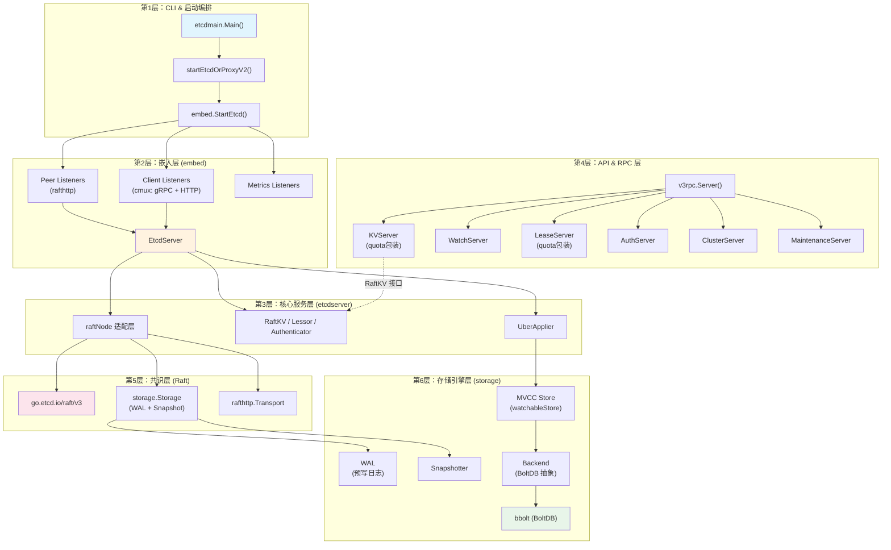
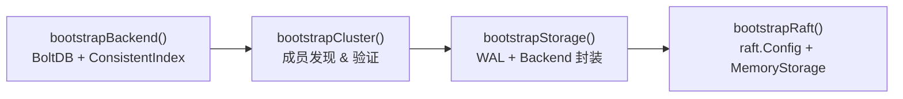
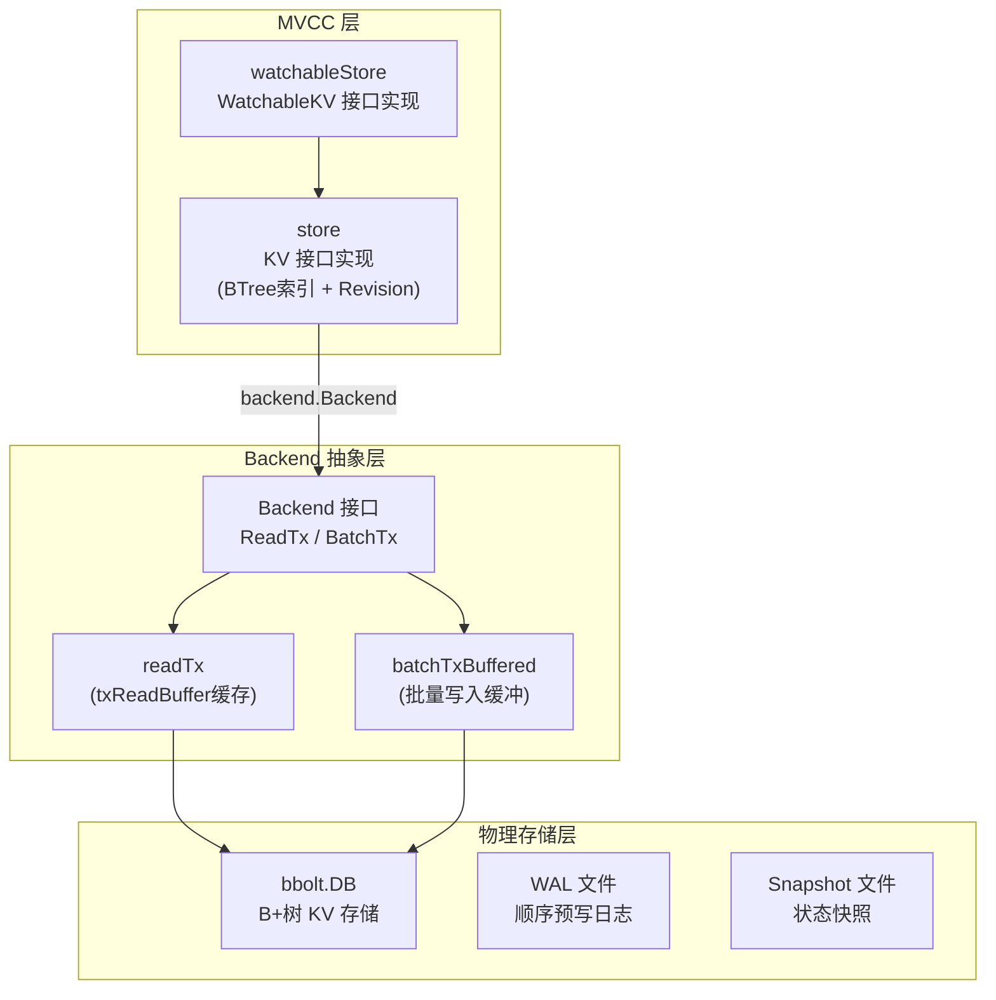
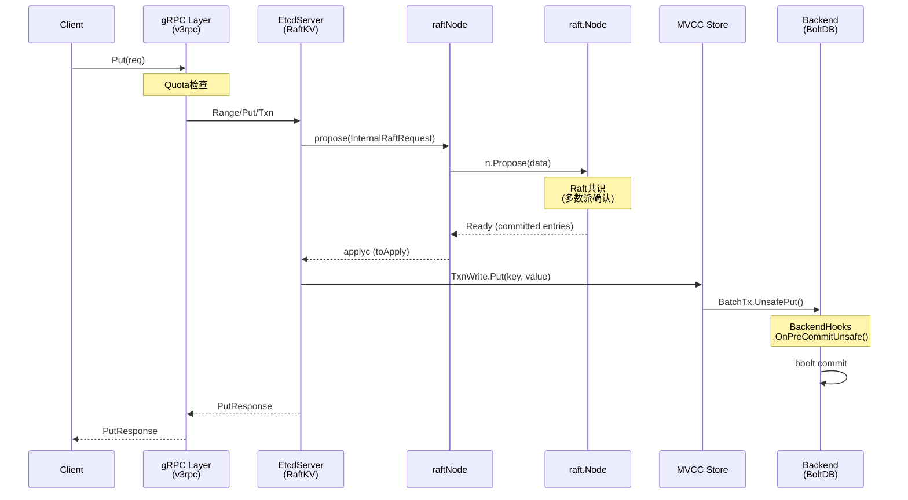

etcd 的代码库并非一个单体应用，而是一组职责明确、层次分明的模块通过接口连接而成的协作系统。理解这种分层结构，是深入掌握 etcd 内部工作原理的基石。本文将从宏观视角出发，自顶向下剖析 etcd 的六层架构——从命令行入口到磁盘上的 BoltDB 文件——揭示每一层的核心职责、关键类型以及层间连接点。

Sources: [server/embed/etcd.go](server/embed/etcd.go#L69-L99), [server/etcdserver/server.go](server/etcdserver/server.go#L206-L290)

## 分层总览：一张全景图

下面的 Mermaid 图呈现了 etcd 从用户请求到持久化存储的完整数据路径。阅读此图时请注意：**每一层只依赖其直接下层的接口**，而不跨层耦合，这正是 etcd 能够被嵌入到其他 Go 项目（如 Kubernetes API Server）的关键设计。



Sources: [server/etcdmain/main.go](server/etcdmain/main.go#L25-L41), [server/etcdmain/etcd.go](server/etcdmain/etcd.go#L179-L191), [server/embed/etcd.go](server/embed/etcd.go#L107-L301), [server/etcdserver/api/v3rpc/grpc.go](server/etcdserver/api/v3rpc/grpc.go#L44-L94)

## 第1层：CLI 与启动编排

**etcdmain** 包是整个进程的入口点，负责命令行参数解析和启动模式选择。`Main()` 函数通过简单的 `switch` 语句区分三种运行模式：**标准 etcd 服务器**、**gateway 代理** 和 **gRPC proxy**。对于标准服务器模式，控制权交给 `startEtcdOrProxyV2()`，该函数完成配置解析、数据目录检测，最终调用 `embed.StartEtcd()` 启动核心服务。

Sources: [server/etcdmain/main.go](server/etcdmain/main.go#L25-L41), [server/etcdmain/etcd.go](server/etcdmain/etcd.go#L43-L177)

这一层的关键设计决策在于：**CLI 层与核心服务器逻辑完全解耦**。`startEtcd()` 函数仅调用 `embed.StartEtcd(cfg)` 并等待 `ReadyNotify()` 信号，不参与任何业务逻辑。这意味着任何 Go 程序都可以通过 `embed` 包直接嵌入 etcd 服务器，而无需经过命令行路径。

Sources: [server/etcdmain/etcd.go](server/etcdmain/etcd.go#L179-L191)

## 第2层：嵌入层 (embed)

`embed` 包是 etcd 的**集成枢纽**，它将网络层、服务层和配置层编织在一起。核心类型 `Etcd` 持有三个关键组件：

| 字段 | 类型 | 职责 |
|------|------|------|
| `Server` | `*etcdserver.EtcdServer` | 核心业务服务器 |
| `Peers` | `[]*peerListener` | 集群间通信监听器 |
| `Clients` | `[]net.Listener` | 客户端请求监听器 |
| `sctxs` | `map[string]*serveCtx` | 客户端服务上下文（含 gRPC/HTTP 服务器） |

Sources: [server/embed/etcd.go](server/embed/etcd.go#L69-L99)

`StartEtcd()` 的执行流程可以概括为五个阶段：**配置验证** → **监听器创建** → **EtcdServer 构建** → **服务启动** → **流量服务**。其中最关键的步骤是通过 `etcdserver.NewServer(srvcfg)` 创建 `EtcdServer` 实例，随后调用 `Server.Start()` 启动 Raft 协议循环。

Sources: [server/embed/etcd.go](server/embed/etcd.go#L110-L301)

嵌入层的另一项重要职责是**流量多路复用**。通过 `cmux` 库，etcd 在同一个 TCP 端口上同时提供 gRPC（HTTP/2）和 HTTP/1.1 服务。`serve()` 方法利用 cmux 的 `Match(cmux.HTTP1())` 和 `Match(cmux.HTTP2())` 将不同协议的流量分发到对应的处理服务器。

Sources: [server/embed/serve.go](server/embed/serve.go#L118-L225)

## 第3层：核心服务层 (EtcdServer)

**EtcdServer** 是整个 etcd 的心脏，它实现了 `Server`、`ServerV2`、`ServerV3`、`RaftKV`、`Lessor`、`Authenticator` 六大接口。其结构体包含了几乎所有子系统的引用：

```go
type EtcdServer struct {
    r            raftNode                 // Raft 适配层
    kv           mvcc.WatchableKV         // MVCC 键值存储
    lessor       lease.Lessor             // 租约管理器
    be           backend.Backend          // 持久化后端
    authStore    auth.AuthStore           // 认证存储
    cluster      *membership.RaftCluster  // 集群成员信息
    uberApply    apply.UberApplier        // Apply 分发器
    consistIndex cindex.ConsistentIndexer // 一致性索引
    // ... 更多字段
}
```

Sources: [server/etcdserver/server.go](server/etcdserver/server.go#L206-L290)

`NewServer()` 的构造过程是一个**自底向上的依赖注入链**：首先通过 `bootstrap()` 函数构建底层存储（Backend + WAL）、集群信息和 Raft 节点；然后按顺序初始化子系统——Lessor 先于 MVCC Store 恢复（因为 KV 恢复时需要将 key 重新关联到正确的租约），Auth Store 最后创建。

Sources: [server/etcdserver/server.go](server/etcdserver/server.go#L294-L389), [server/etcdserver/bootstrap.go](server/etcdserver/bootstrap.go#L52-L129)

Bootstrap 过程本身就体现了分层思想。`bootstrappedServer` 结构体清晰地展示了四个初始化阶段：



Sources: [server/etcdserver/bootstrap.go](server/etcdserver/bootstrap.go#L150-L207)

## 第4层：API 与 RPC 层

gRPC 服务层位于 `server/etcdserver/api/v3rpc/` 目录下。`v3rpc.Server()` 函数是 gRPC 服务器的工厂方法，它创建 `grpc.Server` 实例并注册六大核心服务：

| 注册的服务 | 实现类型 | 包装方式 |
|-----------|---------|---------|
| KVServer | `kvServer` | `NewQuotaKVServer()` — 配额保护 |
| WatchServer | `watchServer` | 直接注册 |
| LeaseServer | `leaseServer` | `NewQuotaLeaseServer()` — 配额保护 |
| ClusterServer | `clusterServer` | 直接注册 |
| AuthServer | `authServer` | 直接注册 |
| MaintenanceServer | `maintenanceServer` | 直接注册 |

Sources: [server/etcdserver/api/v3rpc/grpc.go](server/etcdserver/api/v3rpc/grpc.go#L44-L94)

这一层的设计遵循**接口隔离原则**。例如，`kvServer` 持有 `etcdserver.RaftKV` 接口而非 `EtcdServer` 具体类型，这使得 KV 服务的测试可以独立于完整的 EtcdServer 进行。`RaftKV` 接口仅暴露五个方法：`Range`、`Put`、`DeleteRange`、`Txn` 和 `Compact`。

Sources: [server/etcdserver/v3_server.go](server/etcdserver/v3_server.go#L59-L65), [server/etcdserver/api/v3rpc/key.go](server/etcdserver/api/v3rpc/key.go#L27-L42)

值得注意的是，KV 和 Lease 服务被 **Quota 包装器** 额外封装。`Quota` 接口提供了 `Available()`、`Cost()` 和 `Remaining()` 三个方法，在请求到达 EtcdServer 之前先检查后端存储空间是否充裕（默认 2GB 配额），从而防止磁盘空间耗尽导致集群不可用。

Sources: [server/storage/quota.go](server/storage/quota.go#L39-L46), [server/storage/quota.go](server/storage/quota.go#L126-L134)

## 第5层：共识层 (Raft)

etcd 的共识层由两个部分组成：外部库 `go.etcd.io/raft/v3`（纯粹的 Raft 算法实现）和内部适配层 `raftNode`。

`raftNode` 是连接 EtcdServer 和底层 Raft 库的桥梁。其配置结构体 `raftNodeConfig` 持有三个关键依赖：

| 字段 | 职责 |
|------|------|
| `raft.Node` | Raft 状态机接口（提案提交、投票等） |
| `raftStorage` | `*raft.MemoryStorage` — Raft 日志的内存缓存 |
| `storage` | `serverstorage.Storage` — WAL + Snapshot 持久化 |
| `transport` | `rafthttp.Transporter` — 集群间网络通信 |

Sources: [server/etcdserver/raft.go](server/etcdserver/raft.go#L80-L120)

`raftNode` 通过 channel 驱动的模型工作：`applyc` channel 将已提交的 Raft 日志条目发送给 EtcdServer 的 Apply 循环；`readStateC` channel 传递线性一致性读所需的 ReadState 信息。这种设计使得 Raft 协议处理和业务逻辑 Apply 可以在不同的 goroutine 中并行执行。

Sources: [server/etcdserver/raft.go](server/etcdserver/raft.go#L65-L104)

`serverstorage.Storage` 接口是对 WAL 和 Snapshotter 的统一封装。其 `Save()` 方法将 Raft 的 HardState 和日志条目持久化到 WAL 文件，`SaveSnap()` 则先保存快照文件，再写入 WAL 快照记录——这个顺序确保了 WAL 快照条目总能找到对应的快照文件。

Sources: [server/storage/storage.go](server/storage/storage.go#L30-L57), [server/storage/storage.go](server/storage/storage.go#L59-L78)

## 第6层：存储引擎层

存储引擎层是 etcd 分层架构中最复杂也最精妙的部分，它由三个子层组成：



Sources: [server/storage/mvcc/kv.go](server/storage/mvcc/kv.go#L113-L148), [server/storage/backend/backend.go](server/storage/backend/backend.go#L49-L75), [server/storage/mvcc/kvstore.go](server/storage/mvcc/kvstore.go#L52-L81)

### Backend 接口与 BoltDB

**Backend** 接口是存储引擎的核心抽象，它将 BoltDB 的复杂性封装在三个事务模型之后：

- **`ReadTx`**：只读事务，基于 `txReadBuffer` 缓存最近写入的数据，减少对 BoltDB 的读锁竞争
- **`BatchTx`**：批量写入事务，以时间间隔（默认 100ms）或数量阈值（默认 10000 次操作）触发提交
- **`ConcurrentReadTx`**：无阻塞的并发读事务，通过 `txReadBufferCache` 跳过不必要的 buffer 复制

Sources: [server/storage/backend/backend.go](server/storage/backend/backend.go#L49-L75), [server/storage/backend/backend.go](server/storage/backend/backend.go#L92-L131)

Backend 还引入了 **Hooks 机制**（`BackendHooks`），允许在每次事务提交前执行回调。etcd 利用这个机制在写事务提交前自动保存 `ConsistentIndex`（用于确保 Apply 的幂等性）和 `ConfState`（Raft 配置状态），实现了存储层与一致性协议的松耦合集成。

Sources: [server/storage/hooks.go](server/storage/hooks.go#L28-L60)

### MVCC 存储模型

**MVCC**（多版本并发控制）层通过 `WatchableKV` 接口暴露给 EtcdServer。`watchableStore` 嵌入 `store` 并扩展了 Watch 功能，其核心结构包含：

- **`kvindex`**：基于 BTree 的内存索引，将 key 映射到 Revision 链
- **`currentRev` / `compactMainRev`**：当前修订版本号和压缩边界
- **`b`**：底层 Backend 引用

Sources: [server/storage/mvcc/kvstore.go](server/storage/mvcc/kvstore.go#L52-L81)

每个写操作（Put/Delete）都会递增 `currentRev`，新版本的数据以 `(revision, key)` 为 BoltDB 中的存储键。读操作可以在任意历史 Revision 上进行快照读取，只要该 Revision 尚未被 Compaction 清除。

Sources: [server/storage/mvcc/kv.go](server/storage/mvcc/kv.go#L39-L57)

### WAL 与数据目录布局

etcd 的数据目录遵循固定的层次结构：

```
<data-dir>/
└── member/
    ├── snap/
    │   ├── db              ← BoltDB 数据文件
    │   ├── *.snap          ← Raft 快照文件
    │   └── *.snap.db       ← 快照对应的 BoltDB 副本
    └── wal/
        ├── 0000000000000000-0000000000000000.wal
        ├── 0000000000000001-00000000000XXXXX.wal
        └── ...             ← 顺序 WAL 段文件（每段 64MB）
```

Sources: [server/storage/datadir/datadir.go](server/storage/datadir.go#L19-L49), [server/storage/wal/wal.go](server/storage/wal/wal.go#L67-L95)

WAL 文件以 64MB 为单位分段，每个段包含编码后的 Raft 日志条目。`WAL` 类型通过 `encoder` 写入记录、通过 `decoder` 读取记录，并使用文件锁（`LockedFile`）确保同一时间只有一个进程访问 WAL 目录。

Sources: [server/storage/wal/wal.go](server/storage/wal/wal.go#L38-L55), [server/storage/wal/wal.go](server/storage/wal/wal.go#L72-L95)

## 层间协作：一个 Put 请求的完整旅程

理解分层架构的最佳方式是追踪一个 Put 请求从客户端到磁盘的全过程：



Sources: [server/etcdserver/api/v3rpc/key.go](server/etcdserver/api/v3rpc/key.go#L58-L72), [server/etcdserver/v3_server.go](server/etcdserver/v3_server.go#L104-L120), [server/storage/mvcc/kvstore.go](server/storage/mvcc/kvstore.go#L52-L81)

## Schema 层：存储结构的版本化管理

在 Backend 和 MVCC 之间，还有一个容易被忽视但至关重要的 **Schema 层**。`server/storage/schema/` 目录定义了所有 BoltDB Bucket 的结构和数据访问方法，包括：

- `membership.go` — 集群成员信息
- `auth.go` / `auth_users.go` / `auth_roles.go` — 认证数据
- `lease.go` — 租约持久化
- `cindex.go` — 一致性索引
- `version.go` — Schema 版本检测
- `migration.go` — Schema 版本迁移

Schema 层通过 `UnsafeDetectSchemaVersion()` 检测当前存储的 Schema 版本，并与二进制版本进行比较。当检测到版本不匹配时，`Migrate()` 函数会按需执行迁移计划，确保 etcd 可以安全地进行版本升级和降级。

Sources: [server/storage/schema/schema.go](server/storage/schema/schema.go#L29-L79)

## 子系统与辅助模块

在分层主线之外，etcd 还有若干横跨多层的子系统：

| 子系统 | 位置 | 持久化依赖 | 说明 |
|--------|------|-----------|------|
| **Auth** | `server/auth/` | Schema 层的 AuthBackend | 用户/角色/权限管理，支持 Simple Token 和 JWT |
| **Lease** | `server/lease/` | Schema 层的 LeaseBackend | TTL 管理与自动过期，使用堆排序优化 |
| **Membership** | `server/etcdserver/api/membership/` | Schema 层的 MembershipBackend | 集群成员管理，支持动态添加/移除/提升 |
| **Compactor** | `server/etcdserver/api/v3compactor/` | MVCC Store | 支持 Periodic 和 Revision 两种压缩模式 |
| **Alarm** | `server/etcdserver/api/v3alarm/` | Schema 层 | 集群告警管理（如 NOSPACE、CORRUPT） |

Sources: [server/auth/store.go](server/auth/store.go#L1-L80), [server/lease/lessor.go](server/lease/lessor.go#L36-L80)

这些子系统的共同特点是：**状态通过 Raft 共识提交，数据通过 Backend 持久化**。它们不直接操作 BoltDB，而是通过 Schema 层的函数访问对应 Bucket，保持了存储访问的一致性和可审计性。

## 延伸阅读

理解了整体分层架构后，建议按以下顺序深入各个层次：

1. [服务器启动链路：从 main.go 到 embed.StartEtcd](7-fu-wu-qi-qi-dong-lian-lu-cong-main-go-dao-embed-startetcd) — 深入第1、2层的启动细节
2. [EtcdServer 核心实现：提案提交、Apply 循环与线性一致性读](8-etcdserver-he-xin-shi-xian-ti-an-ti-jiao-apply-xun-huan-yu-xian-xing-zhi-xing-du) — 深入第3层的核心运行机制
3. [Raft 共识算法集成：raftNode 适配层与消息流转](9-raft-gong-shi-suan-fa-ji-cheng-raftnode-gua-pei-ceng-yu-xiao-xi-liu-zhuan) — 深入第5层的协议细节
4. [MVCC 存储模型：Revision、KeyIndex 与事务视图](11-mvcc-cun-chu-mo-xing-revision-keyindex-yu-shi-wu-shi-tu) — 深入第6层的存储逻辑