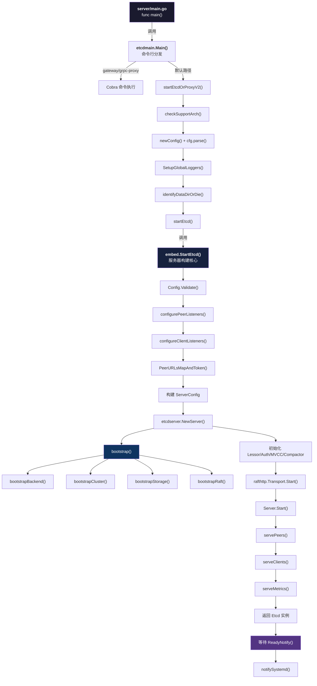
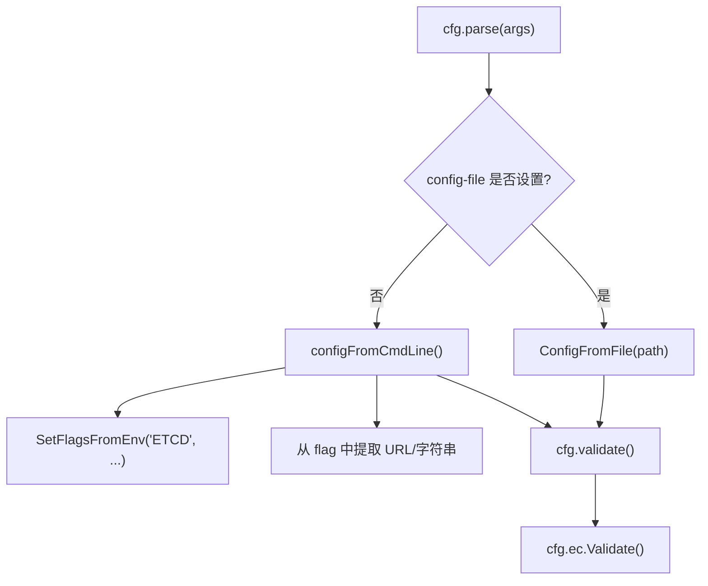
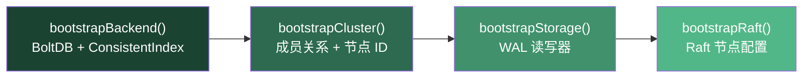

etcd 服务器的启动并非一条简单的函数调用线，而是一条经过**三个包层级**的精心编排流水线：从 `main` 包的入口壳层，经过 `etcdmain` 包的命令行调度层，最终沉入 `embed` 包的服务器构建核心。理解这条链路是掌握 etcd 运行时行为的第一步——因为每一步的配置决策、错误处理和资源初始化都会直接影响后续的 Raft 共识、存储引擎和网络通信。本文将逐层展开这条启动路径，揭示每个阶段的职责边界与关键逻辑。

Sources: [main.go](server/main.go#L30-L31), [main.go](server/etcdmain/main.go#L25-L41)

## 全局视角：启动流程总览

在深入每个阶段之前，先建立整条链路的宏观认知。下图展示了从进程入口到服务器就绪的完整调用链路：



这条链路可以清晰地划分为**五个阶段**：入口分发与架构检查、配置构建与校验、服务器引导（bootstrap）、组件初始化与启动、网络服务就绪。以下逐一剖析。

Sources: [main.go](server/etcdmain/etcd.go#L43-L191), [etcd.go](server/embed/etcd.go#L110-L301)

## 第一阶段：入口壳与命令分发

### main.go —— 极简入口

`server/main.go` 是整个 etcd 二进制文件的入口点，但它几乎是空壳。其设计意图在注释中明确表述：**确保 etcd 仍然可以通过 `go get` 安装**。真正的业务逻辑全部委托给 `etcdmain` 包：

```go
func main() {
    etcdmain.Main(os.Args)
}
```

这种"壳层 + 实现分离"的模式是 Go 语言中常见的项目结构惯例——`main` 包只负责导入和调用，所有逻辑放在具名包中以便测试和复用。

Sources: [main.go](server/main.go#L30-L31)

### etcdmain.Main() —— 三路分发

`etcdmain.Main()` 是第一个有实际调度逻辑的函数，它执行两个动作：

1. **架构兼容性检查** `checkSupportArch()`：仅允许 `amd64`、`arm64`、`ppc64le`、`s390x` 四种架构运行，除非设置了 `ETCD_UNSUPPORTED_ARCH` 环境变量。
2. **命令路由**：根据 `args[1]` 将请求分发到三条路径：

| 子命令 | 目标函数 | 说明 |
|--------|---------|------|
| `gateway` | `rootCmd.Execute()` | TCP 网关代理模式 |
| `grpc-proxy` | `rootCmd.Execute()` | gRPC 代理模式 |
| 其他（默认） | `startEtcdOrProxyV2()` | 完整 etcd 服务器模式 |

绝大多数场景走的是默认路径——启动完整的 etcd 服务器节点。

Sources: [main.go](server/etcdmain/main.go#L25-L41), [etcd.go](server/etcdmain/etcd.go#L232-L253)

## 第二阶段：配置构建与校验

### startEtcdOrProxyV2() —— 配置编排中心

`startEtcdOrProxyV2()` 是整个启动链路中**最长的编排函数**，它负责将用户输入（命令行参数或配置文件）转化为可运行的服务器。其核心步骤如下：

**Step 1: 禁用 gRPC 追踪**。在函数入口处，`grpc.EnableTracing = false` 关闭了 gRPC 的内置追踪以减少性能开销（后续按需在 debug 模式下重新启用）。

**Step 2: 创建并解析配置**。`newConfig()` 创建一个带有完整默认值的 `embed.Config`，然后 `cfg.parse(args)` 根据输入源（配置文件或命令行标志）进行覆盖和校验。配置解析的关键决策树如下：



**Step 3: 初始化全局日志器**。`SetupGlobalLoggers()` 将配置好的 Zap 日志器注入到 gRPC 和全局 Zap 替换器中，使所有子系统使用统一的日志配置。

**Step 4: 数据目录检测**。`identifyDataDirOrDie()` 检查数据目录的状态，返回三种类型之一：`dirEmpty`（首次启动）、`dirMember`（已有成员数据）、`dirProxy`（已废弃的 v2 代理）。对于 `dirProxy`，服务器直接 Panic，因为 v2 HTTP 代理已在 3.6 中被移除。

**Step 5: 启动或报错**。根据检测结果，最终调用 `startEtcd()` 进入下一阶段。

Sources: [etcd.go](server/etcdmain/etcd.go#L43-L177), [config.go](server/etcdmain/config.go#L85-L189)

### embed.Config —— 配置的统一模型

`embed.Config` 是 etcd 配置的**统一数据模型**，无论配置来源是 YAML 文件还是命令行标志，最终都汇聚到此结构体。`NewConfig()` 提供的默认值代表了 etcd 的推荐运行参数：

| 配置项 | 默认值 | 含义 |
|--------|--------|------|
| `Name` | `"default"` | 成员名称 |
| `ListenPeerUrls` | `http://localhost:2380` | Peer 通信监听地址 |
| `ListenClientUrls` | `http://localhost:2379` | 客户端请求监听地址 |
| `TickMs` | `100` | 心跳间隔（毫秒） |
| `ElectionMs` | `1000` | 选举超时（毫秒） |
| `SnapshotCount` | `10000` | 触发快照的已提交事务数 |
| `PreVote` | `true` | 启用 Raft Pre-Vote |
| `AuthToken` | `"simple"` | 认证 Token 类型 |
| `ClusterState` | `"new"` | 集群初始状态 |
| `AutoCompactionMode` | `"periodic"` | 自动压缩模式 |

`Config.Validate()` 方法执行超过 20 项校验规则，包括：URL 格式校验、引导标志互斥检测（`initial-cluster`、`discovery-srv`、`discovery-endpoints` 三选一）、心跳与选举超时的 5:1 比例约束、TLS 版本范围校验等。任何一项失败都会阻止服务器启动。

Sources: [config.go](server/embed/config.go#L497-L593), [config.go](server/embed/config.go#L935-L1067)

## 第三阶段：embed.StartEtcd() —— 服务器构建核心

`embed.StartEtcd()` 是整条链路中**最关键的函数**，它负责从配置创建完整的 etcd 服务器实例。该函数返回的 `*Etcd` 结构体封装了服务器运行时所有资源：

```go
type Etcd struct {
    Peers   []*peerListener       // Peer 监听器
    Clients []net.Listener        // 客户端监听器
    sctxs   map[string]*serveCtx  // 客户端服务上下文
    Server  *etcdserver.EtcdServer // 核心服务器实例
    cfg     Config                 // 配置快照
    stopc   chan struct{}          // 停止信号
    errc    chan error             // 错误收集通道
}
```

`StartEtcd()` 的执行过程可以分解为以下子步骤：

Sources: [etcd.go](server/embed/etcd.go#L70-L99), [etcd.go](server/embed/etcd.go#L110-L301)

### 3.1 配置校验与监听器创建

函数首先再次调用 `inCfg.Validate()` 进行防御性校验。随后依次创建两类网络监听器：

- **`configurePeerListeners()`**：遍历 `ListenPeerUrls`，为每个 URL 创建 TCP 监听器。在此过程中完成 TLS 证书的自动生成（如果启用了 `PeerAutoTLS`）、密码套件配置和 TLS 版本范围设置。每个监听器被封装为 `peerListener` 结构体，预留了 `serve` 和 `close` 两个回调函数位。

- **`configureClientListeners()`**：类似地为客户端 URL 创建监听器，但额外处理了 HTTP/gRPC 分离模式（通过 `--listen-client-http-urls` 单独指定纯 HTTP 端点）。每个监听地址映射到一个 `serveCtx`，后者管理着该地址上的 gRPC 服务器和 HTTP 服务器。

Sources: [etcd.go](server/embed/etcd.go#L131-L156), [etcd.go](server/embed/etcd.go#L531-L591), [etcd.go](server/embed/etcd.go#L645-L700)

### 3.2 集群引导信息解析

对于**首次启动**的成员（通过 `isMemberInitialized()` 检测 WAL 目录是否存在来判断），需要从配置中解析集群引导信息：

```go
if !isMemberInitialized(cfg) {
    urlsmap, token, err = cfg.PeerURLsMapAndToken("etcd")
}
```

`isMemberInitialized()` 的判断逻辑极其简单——检查 WAL 目录是否存在文件。如果存在，说明该成员曾经加入过集群，无需再解析初始集群配置。`PeerURLsMapAndToken()` 则支持三种引导模式：

| 引导模式 | 配置来源 | 典型场景 |
|---------|---------|---------|
| 静态引导 | `--initial-cluster` 标志 | 已知拓扑的小规模集群 |
| DNS SRV 发现 | `--discovery-srv` 标志 | 基于 DNS 的自动发现 |
| Discovery Service | `--discovery-token` + `--discovery-endpoints` | 动态引导大规模集群 |

Sources: [util.go](server/embed/util.go#L23-L29), [config.go](server/embed/config.go#L1070-L1100)

### 3.3 配置转换：embed.Config → config.ServerConfig

`embed.Config` 是面向用户的配置模型，而 `config.ServerConfig` 是面向服务器的内部配置模型。`StartEtcd()` 负责执行这一转换——将近 40 个配置字段逐一映射，同时进行必要的派生计算（如 `parseCompactionRetention` 将字符串形式的保留策略转换为 `time.Duration`，`parseBackendFreelistType` 将字符串转换为 BoltDB 的枚举类型）。

Sources: [etcd.go](server/embed/etcd.go#L182-L238), [config.go](server/config/config.go#L42-L170)

## 第四阶段：etcdserver.NewServer() —— Bootstrap 引导

`etcdserver.NewServer()` 是服务器实例的**工厂函数**，它执行整个启动过程中最重的初始化工作。其核心是调用 `bootstrap()` 函数，后者按严格顺序完成四个子系统的引导：



### bootstrapBackend() —— 存储后端初始化

创建或恢复 BoltDB 后端数据库，初始化 `ConsistentIndex`（一致性索引器，用于确保 Apply 操作的幂等性）。如果数据库已存在，则从中恢复快照数据。

### bootstrapCluster() —— 集群成员关系构建

根据是否存在 WAL 分为两条路径：**有 WAL** 时从已有数据恢复集群成员关系和节点 ID；**无 WAL** 时从配置信息（`InitialPeerURLsMap`）或 Discovery Service 获取初始成员列表，并分配或生成节点 ID。

### bootstrapStorage() —— WAL 存储初始化

有 WAL 时从快照恢复 WAL 读取器；无 WAL 时创建新的 WAL 写入器，并写入初始配置条目（包含集群成员信息）。

### bootstrapRaft() —— Raft 节点配置

创建 `raft.MemoryStorage` 和 `raft.Config`，配置心跳间隔、选举超时等 Raft 参数，为后续的 `raftNode` 运行做好准备。

Sources: [bootstrap.go](server/etcdserver/bootstrap.go#L52-L129), [server.go](server/etcdserver/server.go#L294-L439)

### 组件装配

`bootstrap()` 返回的 `bootstrappedServer` 包含了所有已初始化的子系统句柄。`NewServer()` 随后将这些句柄装配到 `EtcdServer` 结构体中，并继续初始化以下关键组件：

| 组件 | 初始化函数 | 职责 |
|------|-----------|------|
| **Lessor** | `lease.NewLessor()` | 租约管理，TTL 跟踪与过期回收 |
| **Token Provider** | `auth.NewTokenProvider()` | 认证令牌生成与校验 |
| **MVCC Store** | `mvcc.New()` | 多版本并发控制的键值存储 |
| **Auth Store** | `auth.NewAuthStore()` | 用户/角色/权限管理 |
| **Compactor** | `v3compactor.New()` | 自动压缩策略执行 |
| **Transport** | `rafthttp.NewTransport()` | Peer 间的 Raft 消息传输 |

特别注意初始化顺序：**Lessor 必须在 MVCC Store 之前恢复**，因为 MVCC 恢复时需要将键重新附加到其所属的租约上。如果顺序反了，键会被附加到错误的（尚未恢复的）租约上。

Sources: [server.go](server/etcdserver/server.go#L312-L439)

## 第五阶段：Server.Start() 与网络服务就绪

### EtcdServer.Start() —— 启动核心循环

`EtcdServer.Start()` 调用内部 `start()` 方法，后者完成以下关键动作：

1. **初始化同步原语**：`wait.Wait`（用于提案完成通知）、`wait.TimeList`（用于 Apply 索引等待）、以及 `stopping` / `stop` / `done` 等生命周期通道。
2. **创建 Read 子系统**：`read.NewRead()` 初始化线性一致性读处理器。
3. **启动主事件循环**：`go s.run()` 在独立 goroutine 中启动服务器的核心事件循环。

`run()` 方法是一个 `for-select` 循环，处理三类事件：Raft Apply 通知（来自 `s.r.apply()` 通道）、过期租约回收（来自 `s.lessor.ExpiredLeasesC()` 通道）、以及错误/停止信号。

Sources: [server.go](server/etcdserver/server.go#L528-L594), [server.go](server/etcdserver/server.go#L754-L852)

### 网络服务绑定

回到 `StartEtcd()` 中，服务器启动后依次绑定三类网络服务：

**servePeers()**：为每个 Peer 监听器创建 `cmux` 多路复用器，绑定 `etcdhttp.NewPeerHandler()` 作为 HTTP 处理器。Peer HTTP 处理器处理 Raft 消息传播、快照传输和成员状态查询。

**serveClients()**：为每个客户端监听地址创建 gRPC 服务器和 HTTP 服务器（通过 `cmux` 在同一端口上复用），注册包括 KV、Watch、Lease、Auth、Maintenance、Cluster 在内的全部 gRPC 服务。如果启用了 `EnableGRPCGateway`，还会注册 gRPC-Gateway 以支持 HTTP/JSON 到 gRPC 的协议转换。

**serveMetrics()**：在独立的 metrics 端口上暴露 Prometheus 指标和健康检查端点。

至此，`StartEtcd()` 返回完全初始化的 `*Etcd` 实例。但此时服务器**尚未加入集群**——调用方需要等待 `ReadyNotify()` 通道信号：

```go
select {
case <-e.Server.ReadyNotify(): // 服务器成功加入集群
case <-e.Server.StopNotify():  // 服务器被中止
}
```

Sources: [etcd.go](server/embed/etcd.go#L280-L300), [etcd.go](server/embed/etcd.go#L594-L643), [etcd.go](server/embed/etcd.go#L760-L806), [serve.go](server/embed/serve.go#L118-L200)

### serveCtx.serve() —— 客户端服务的延迟启动

值得注意的是，`serveClients()` 内部调用的 `sctx.serve()` 方法会**先阻塞等待 `ReadyNotify()` 信号**，然后才实际创建 gRPC/HTTP 服务器并开始接受连接。这意味着客户端端口虽然在 `StartEtcd()` 返回时就已绑定，但直到集群就绪后才会真正响应请求——这是一种优雅的保护机制，避免在集群未就绪时接受客户端请求。

Sources: [serve.go](server/embed/serve.go#L118-L136)

## 启动链路中的错误处理与回滚

`StartEtcd()` 采用了一种精心设计的错误回滚模式：通过 `defer` + `serving` 标志位实现。如果函数在任何步骤失败（`serving == false`），defer 块会关闭所有已创建的 serveCtx 并调用 `e.Close()` 执行完整清理。类似地，`NewServer()` 也使用 defer 在出错时关闭已打开的后端存储。

这种"创建-检查-defer 回滚"的模式贯穿整个启动链路，确保即使启动中途失败，也不会泄漏文件描述符、数据库连接或 goroutine。

Sources: [etcd.go](server/embed/etcd.go#L117-L129), [server.go](server/etcdserver/server.go#L302-L306)

## 关键设计决策总结

| 设计决策 | 实现位置 | 动因 |
|---------|---------|------|
| **入口壳分离** | `server/main.go` 仅 3 行 | 保证 `go get` 可安装性 |
| **三级配置模型** | CLI Flags → embed.Config → ServerConfig | 分离用户接口与内部接口 |
| **防御性双重校验** | `etcdmain` 和 `embed` 各调一次 `Validate()` | 嵌入式使用场景下保护 `StartEtcd()` |
| **延迟客户端服务** | `serve()` 等待 `ReadyNotify()` | 防止未就绪时接受请求 |
| **有序组件装配** | Lessor → MVCC → Auth → Compactor | 保证恢复时键-租约关系的正确性 |
| **cmux 端口复用** | Peer 和 Client 监听器 | 在同一端口上同时支持 HTTP 和 gRPC |

Sources: [main.go](server/main.go#L30-L31), [etcd.go](server/embed/etcd.go#L110-L129), [server.go](server/etcdserver/server.go#L339-L368), [serve.go](server/embed/serve.go#L132-L136)

## 下一步阅读

启动链路的终点是 `EtcdServer` 开始运行——但这只是故事的开端。要理解服务器运行后的核心行为，建议继续阅读：

- [EtcdServer 核心实现：提案提交、Apply 循环与线性一致性读](8-etcdserver-he-xin-shi-xian-ti-an-ti-jiao-apply-xun-huan-yu-xian-xing-zhi-xing-du)：深入了解 `run()` 循环中的事件处理机制
- [Raft 共识算法集成：raftNode 适配层与消息流转](9-raft-gong-shi-suan-fa-ji-cheng-raftnode-gua-pei-ceng-yu-xiao-xi-liu-zhuan)：理解 `bootstrapRaft()` 创建的 Raft 节点如何驱动共识
- [WAL（预写日志）：持久化与崩溃恢复](12-wal-yu-xie-ri-zhi-chi-jiu-hua-yu-beng-kui-hui-fu)：理解 `bootstrapStorage()` 中 WAL 恢复的完整逻辑