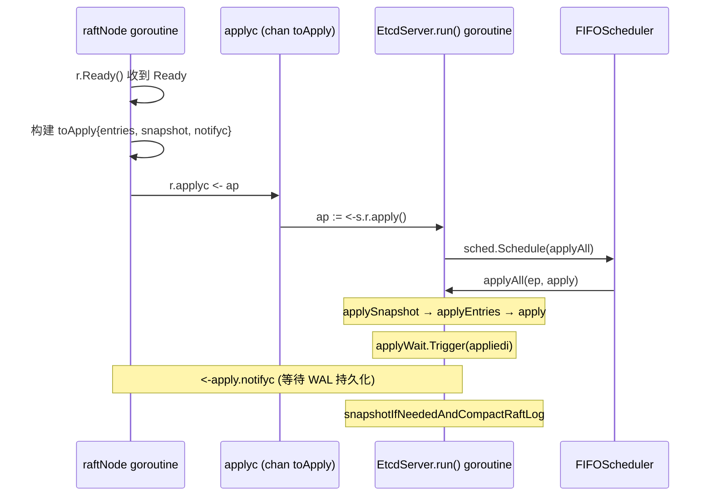
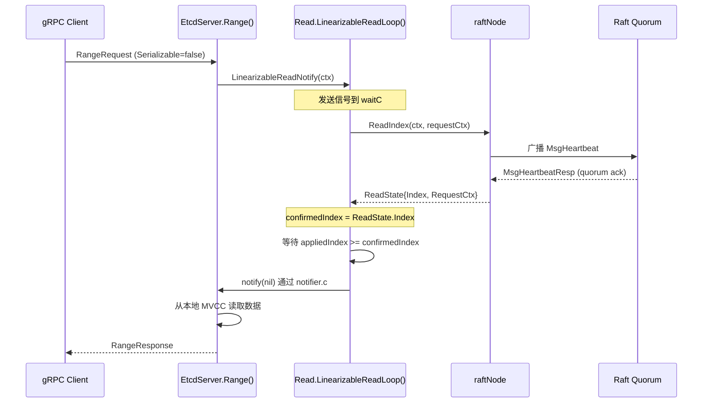

EtcdServer 是 etcd 整个分布式系统的**状态机中枢**——它桥接了上层 gRPC API 与底层 Raft 共识引擎，承担三大核心职责：将客户端请求封装为 Raft 提案并提交、驱动已提交日志条目的 Apply 循环以更新状态机、以及通过 ReadIndex 协议提供线性一致性读保证。本文从源码出发，逐层剖析这三个关键路径的数据流、并发模型与设计权衡。

Sources: [server.go](server/etcdserver/server.go#L206-L290), [v3_server.go](server/etcdserver/v3_server.go#L918-L993), [raft.go](server/etcdserver/raft.go#L65-L155)

## EtcdServer 结构体全景

**EtcdServer** 是 etcd 生产环境的核心实现，其字段设计精炼地映射了分布式键值存储所需的所有子系统。结构体通过 `atomic` 类型维护了四个高频访问的索引状态（`appliedIndex`、`committedIndex`、`term`、`lead`），确保多协程下的无锁读取性能。

| 字段分组 | 关键字段 | 职责 |
|---------|---------|------|
| **索引追踪** | `appliedIndex`, `committedIndex` (atomic) | 追踪状态机应用进度与 Raft 提交进度 |
| **Raft 桥接** | `r raftNode`, `consistIndex` | 与 Raft 库交互，维护一致索引 |
| **等待机制** | `w wait.Wait`, `applyWait wait.WaitTime` | 提案完成通知、Apply 进度通知 |
| **存储层** | `kv`, `be`, `lessor`, `authStore` | MVCC 存储、BoltDB 后端、租约、认证 |
| **Apply 引擎** | `uberApply apply.UberApplier` | 分层 Apply 管道 |
| **线性读** | `read *read.Read` | ReadIndex 协议实现 |
| **生命周期** | `stop`, `stopping`, `done` | 优雅关闭三阶段通道 |

`EtcdServer` 的创建通过 `NewServer` 函数完成，该函数调用 `bootstrap` 进行存储恢复和集群初始化，随后按严格顺序恢复 Lessor → MVCC KV → AuthStore → AlarmStore，保证依赖关系的正确性（例如 MVCC 恢复时需要将键重新附加到已恢复的 Lease 上）。

Sources: [server.go](server/etcdserver/server.go#L206-L290), [server.go](server/etcdserver/server.go#L294-L389)

## 提案提交：从 gRPC 请求到 Raft 共识

### 写请求路径概览

所有**写操作**（Put、DeleteRange、Txn 写模式、LeaseGrant、LeaseRevoke、Auth 操作等）均遵循同一条路径：**gRPC 方法 → `raftRequest` → `processInternalRaftRequestOnce` → Raft `Propose` → 等待 Apply 结果**。下面以 `Put` 为例展开整条链路：

```
Put() → raftRequest(ctx, InternalRaftRequest{Put: r})
      → processInternalRaftRequestOnce(ctx, r)
         ├─ 流量控制检查 (exceedsRequestLimit)
         ├─ 分配请求 ID，填充认证信息
         ├─ 序列化为 protobuf 字节流
         ├─ 注册等待通道: ch = s.w.Register(id)
         ├─ 提交 Raft 提案: s.r.Propose(cctx, data)
         └─ 阻塞等待: select { case <-ch | <-cctx.Done() | <-s.done }
```

Sources: [v3_server.go](server/etcdserver/v3_server.go#L155-L168), [v3_server.go](server/etcdserver/v3_server.go#L872-L993)

### processInternalRaftRequestOnce 详解

这是提案提交的**核心函数**，每个步骤都承载了关键的工程考量：

**第一步：流量控制**。函数比较 `appliedIndex` 与 `committedIndex` 的差值——当差距超过 `maxGapBetweenApplyAndCommitIndex`（5000）时拒绝新提案。这一机制防止 Apply 滞后导致的内存膨胀，是 etcd 在高负载下的背压策略。对于 `LeaseRevoke` 这类优先级请求，阈值放宽到两倍（10000），确保租约能及时释放。

Sources: [v3_server.go](server/etcdserver/v3_server.go#L918-L924), [v3_server.go](server/etcdserver/v3_server.go#L44-L57), [util.go](server/etcdserver/util.go#L45-L58)

**第二步：请求序列化与注册**。请求被序列化为 `[]byte` 并通过 `s.w.Register(id)` 注册一个带缓冲的通道。`wait.Wait` 的实现采用了 **分片锁**（64 个分片，每个分片一把 `sync.RWMutex`）以降低并发争用——请求 ID 对 64 取模后定位到具体分片，这在大并发场景下显著优于全局锁方案。

Sources: [v3_server.go](server/etcdserver/v3_server.go#L953-L966), [wait.go](pkg/wait/wait.go#L43-L94)

**第三步：提交提案与等待**。调用 `s.r.Propose(cctx, data)` 将数据提交给 Raft 节点，随后进入三路 select：Apply 完成后通过 `ch` 收到 `apply.Result`、上下文超时、或服务器停止。超时时主动调用 `s.w.Trigger(id, nil)` 清理等待映射，避免内存泄漏。

Sources: [v3_server.go](server/etcdserver/v3_server.go#L968-L993)

### 读请求的双路径分流

与写请求不同，**读请求**在 `Range` 和只读 `Txn` 中存在两条路径：

- **线性一致性读**（`Serializable == false`）：先调用 `s.read.LinearizableReadNotify(ctx)` 走 ReadIndex 协议确认领导权，然后直接从本地 MVCC 存储读取
- **可串行化读**（`Serializable == true`）：跳过 ReadIndex，直接读取本地状态（可能读到过期数据，但性能更优）

Sources: [v3_server.go](server/etcdserver/v3_server.go#L104-L153), [v3_server.go](server/etcdserver/v3_server.go#L185-L232)

## Apply 循环：从已提交到已应用

Apply 循环是 EtcdServer 的**心脏**——它将 Raft 层已提交的日志条目转化为状态机的实际变更。整个循环横跨两个 goroutine（raftNode 事件循环 + EtcdServer 主循环），通过 `applyc` 通道解耦。

### 架构总览



Sources: [raft.go](server/etcdserver/raft.go#L173-L339), [server.go](server/etcdserver/server.go#L754-L852), [server.go](server/etcdserver/server.go#L968-L989)

### raftNode 事件循环：Ready 处理

`raftNode.start()` 启动一个独立的 goroutine，持续消费 Raft 库产出的 `Ready` 批次。每个 Ready 包含已提交条目、快照、硬状态、待发送消息等。核心处理流程如下：

1. **领导状态变更检测**：通过 `SoftState` 判断是否产生了新 Leader，触发 `updateLeadership` 回调
2. **ReadState 传递**：将 `rd.ReadStates` 中最后一个推入 `readStateC` 通道，供线性读使用
3. **构建 toApply 并投递**：将已提交条目和快照打包为 `toApply` 结构体，推入 `applyc`
4. **Leader 并行优化**：Leader 在 Apply goroutine 处理条目的同时并行执行 WAL 写入和消息发送（Raft 论文 10.2.1 优化）
5. **Follower 同步保证**：Follower 必须等待 WAL 持久化完成后才通过 `notifyc` 通知 Apply goroutine，并在配置变更时额外等待所有条目 Apply 完成

Sources: [raft.go](server/etcdserver/raft.go#L173-L339)

### EtcdServer.run() 主循环

`run()` 方法是 EtcdServer 的主事件循环，通过 FIFO 调度器（`schedule.NewFIFOScheduler`）顺序调度 Apply 任务，保证条目按序执行：

```go
for {
    select {
    case ap := <-s.r.apply():
        f := schedule.NewJob("server_applyAll", func(context.Context) { s.applyAll(&ep, &ap) })
        sched.Schedule(f)
    case leases := <-expiredLeaseC:
        s.revokeExpiredLeases(leases)
    case err := <-s.errorc:
        return
    case <-s.stop:
        return
    }
}
```

`etcdProgress`（`ep`）结构体追踪 Apply 进度，包含 `appliedi`（已应用索引）、`diskSnapshotIndex`、`memorySnapshotIndex` 等关键状态。

Sources: [server.go](server/etcdserver/server.go#L754-L852), [server.go](server/etcdserver/server.go#L736-L742)

### applyAll：Apply 的三阶段流水线

`applyAll` 是每次 Ready 批次处理的**入口函数**，执行以下步骤：

1. **`applySnapshot`**：如果存在快照，等待 WAL 持久化后打开新的 BoltDB 后端，依次恢复 Lessor → MVCC → AuthStore → AlarmStore → Cluster 配置，并重建 UberApplier
2. **`applyEntries`**：遍历已提交条目，调用 `s.apply(ents, ...)` 逐条处理
3. **一致性校验**：`backend.VerifyBackendConsistency` 验证存储一致性
4. **通知等待者**：`s.applyWait.Trigger(ep.appliedi)` 唤醒所有等待特定索引的协程（包括线性读和 `waitAppliedIndex`）
5. **等待 WAL 完成**：`<-apply.notifyc` 确保 Raft 日志已持久化
6. **快照与压缩**：如果达到快照阈值，触发快照并压缩 Raft 日志

Sources: [server.go](server/etcdserver/server.go#L968-L989)

### apply：逐条应用日志条目

`apply` 方法是条目级别的分发器。对于每个条目，它首先通过 `consistIndex` 判断是否需要执行 V3 Apply（幂等性保护：仅当 `e.Index > consistentIndex` 时才 Apply 到 V3 后端），然后按类型分发：

- **EntryNormal**：反序列化为 `InternalRaftRequest`，通过 `apply.Apply()` 调用 UberApplier 管道
- **EntryConfChange**：反序列化为 `ConfChange`，执行集群成员变更

Apply 完成后通过 `s.w.Trigger(id, ar)` 唤醒在 `processInternalRaftRequestOnce` 中阻塞等待的 gRPC 请求协程。

Sources: [server.go](server/etcdserver/server.go#L1889-L1939), [server.go](server/etcdserver/server.go#L1942-L2000)

### Applier 分层架构：装饰器模式

etcd 的 Apply 引擎采用了**装饰器链**（Decorator Chain）模式，通过层层包装实现横切关注点的分离。调用链为：

```
UberApplier.Apply()
  → CorruptApplier.Apply()      # 处理 CORRUPT 告警
    → CappedApplier.Apply()     # 处理 NOSPACE 告警
      → AuthApplier.Apply()     # RBAC 权限检查
        → QuotaApplier.Apply()  # 存储配额检查
          → BackendApplier.Apply()  # 实际执行（Put/DeleteRange/Txn...）
```

| 层级 | 类型 | 核心逻辑 |
|------|------|---------|
| **CorruptApplier** | `corrupt.go` | 当存在 `CORRUPT` 告警时，拒绝所有写操作 |
| **CappedApplier** | `capped.go` | 当存在 `NOSPACE` 告警时，拒绝 Put/LeaseGrant 和含写操作的 Txn |
| **AuthApplier** | `auth.go` | 检查请求中的用户权限，RBAC 鉴权 |
| **QuotaApplier** | `quota.go` | 检查后端数据库大小是否超过配额 |
| **BackendApplier** | `backend.go` | 最终执行器，调用 `txn.Put/DeleteRange/Txn` 等实际操作 |

`UberApplier.dispatch()` 负责将 `InternalRaftRequest` 的联合体字段分发到具体方法（如 `Put` → `applyV3.Put(r.Put)`），每层在调用前后可插入自己的逻辑。这种设计使得告警处理、权限检查、配额控制等横切关注点与核心执行逻辑完全解耦。

Sources: [uber_applier.go](server/etcdserver/apply/uber_applier.go#L30-L89), [backend.go](server/etcdserver/apply/backend.go#L36-L48), [capped.go](server/etcdserver/apply/capped.go#L24-L46)

## 线性一致性读：ReadIndex 协议实现

线性一致性读保证客户端读到的数据**至少与发起读请求时的 Leader 最新提交一样新**。etcd 通过 ReadIndex 协议实现这一语义，核心代码位于 `server/etcdserver/read/` 包。

### ReadIndex 流程



Sources: [read.go](server/etcdserver/read/read.go#L74-L146), [v3_server.go](server/etcdserver/v3_server.go#L136-L142)

### LinearizableReadLoop：单协程驱动的读确认

`LinearizableReadLoop` 在 `Start()` 时作为一个独立 goroutine 启动，采用**批量处理**设计——一个循环迭代可以一次性解锁所有挂起的读请求：

1. **等待触发**：阻塞在 `waitC` 上，直到有新的读请求到来
2. **发送 ReadIndex**：调用 `r.raft.ReadIndex()`，携带唯一请求 ID（`uint64` 大端编码）
3. **等待 ReadState**：从 `r.raft.ReadState()` 通道读取响应，匹配请求 ID
4. **等待 Apply 追上**：如果 `appliedIndex < confirmedIndex`，调用 `s.ApplyWait(confirmedIndex)` 阻塞等待
5. **通知所有等待者**：`nr.notify(nil)` 关闭 notifier 通道，一次性唤醒所有在此轮次中挂起的读请求

关键的**容错机制**包括：Leader 变更时立即返回 `ErrLeaderChanged`（通过 `leaderChangedNotifier`）、超时重试（`readIndexRetryTime = 500ms`）、以及在新 Term 首次提交时重发 ReadIndex（通过 `firstCommitInTermNotifier`）。

Sources: [read.go](server/etcdserver/read/read.go#L96-L146), [read.go](server/etcdserver/read/read.go#L148-L230)

### notifier 批量通知机制

`notifier` 是一个轻量的同步原语，由一个 `chan struct{}` 和一个 `error` 字段组成。`LinearizableReadLoop` 每轮迭代创建新的 notifier，并通过读写锁（`mux`）原子替换当前 notifier。所有同时到达的读请求共享同一个 notifier，当 ReadIndex 确认完成后一次性全部解锁——这就是 etcd 线性一致性读能实现**批量处理**的核心机制。

Sources: [read.go](server/etcdserver/read/read.go#L74-L94), [util.go](server/etcdserver/read/util.go#L17-L31)

### 读写路径对比

| 维度 | 写路径 | 线性一致性读路径 |
|------|--------|-----------------|
| **入口** | `raftRequest` | `LinearizableReadNotify` + 本地 MVCC |
| **共识** | 完整 Raft 提案（日志复制） | ReadIndex（心跳确认） |
| **阻塞点** | `s.w.Register(id)` 等待 Apply | `notifier.c` 等待 ReadIndex + Apply 追赶 |
| **状态机** | 通过 Applier 链写入 BoltDB | 直接从内存索引读取 |
| **延迟** | 通常 1-2 次 RTT（Leader → Quorum → Apply） | 通常 1 次 RTT（心跳确认） |

Sources: [v3_server.go](server/etcdserver/v3_server.go#L872-L993), [v3_server.go](server/etcdserver/v3_server.go#L136-L153)

## 关键设计模式与并发模型

### FIFO 调度器保证顺序性

`schedule.NewFIFOScheduler` 确保 Apply 任务严格按 Ready 到达的顺序执行。当 raftNode 通过 `applyc` 投递一个 `toApply` 批次时，`run()` 将其包装为 Job 提交给调度器。如果前一个批次尚未完成，新的 Job 会排队等待——这保证了索引的单调递增和状态机的一致性。

Sources: [server.go](server/etcdserver/server.go#L763-L841)

### notifyc 通道：Raft 层与 Apply 层的同步点

`toApply.notifyc` 是一个容量为 1 的缓冲通道，充当 Raft 层磁盘写入与 Apply 层之间的同步屏障。对于 Follower，Raft 层在 WAL 持久化完成后发送 `notifyc <- struct{}{}`；Apply 层在 `applyAll` 末尾通过 `<-apply.notifyc` 等待。这一机制确保快照创建时不会出现 appliedIndex 大于 raftStorage lastIndex 的不一致情况。

Sources: [server.go](server/etcdserver/server.go#L976-L979), [raft.go](server/etcdserver/raft.go#L218-L226)

### Leader 变更通知体系

`leaderChanged` 是一个 `notify.Notifier`，在 `raftReadyHandler.updateLeadership` 中被触发。多个子系统依赖此通知：线性读循环丢弃旧 Leader 的未完成读请求、Lessor 在非 Leader 节点降级、Compactor 在非 Leader 节点暂停。这种发布-订阅模式避免了轮询检查 Leader 状态的开销。

Sources: [server.go](server/etcdserver/server.go#L768-L789), [server.go](server/etcdserver/server.go#L572)

### 优雅关闭三阶段

`stop` → `stopping` → `done` 构成三阶段关闭通道：`Stop()` 先尝试转移领导权，再通过 `stop` 通知 `run()` 退出；`run()` 的 defer 关闭 `stopping` 阻止新协程注册，等待现有协程完成（`wg.Wait()`），最后关闭 `done` 通知外部调用者。

Sources: [server.go](server/etcdserver/server.go#L1325-L1350), [server.go](server/etcdserver/server.go#L813-L830)

## 总结

EtcdServer 的三大核心路径形成了一个精密协作的整体：**提案提交**通过 `wait.Wait` 的分片锁和 ID 注册实现高效的请求-响应映射；**Apply 循环**通过 FIFO 调度器和 `notifyc` 同步屏障保证状态机的严格顺序更新；**线性一致性读**通过 ReadIndex 协议的批量通知机制在不牺牲一致性的前提下最大化吞吐。理解这三个路径的交互是深入 etcd 内部机制的基础。

**建议下一步阅读**：[Raft 共识算法集成：raftNode 适配层与消息流转](9-raft-gong-shi-suan-fa-ji-cheng-raftnode-gua-pei-ceng-yu-xiao-xi-liu-zhuan) 将深入 raftNode 如何与底层 Raft 库交互；[MVCC 存储模型：Revision、KeyIndex 与事务视图](11-mvcc-cun-chu-mo-xing-revision-keyindex-yu-shi-wu-shi-tu) 将揭示 Apply 操作最终写入的存储引擎细节。