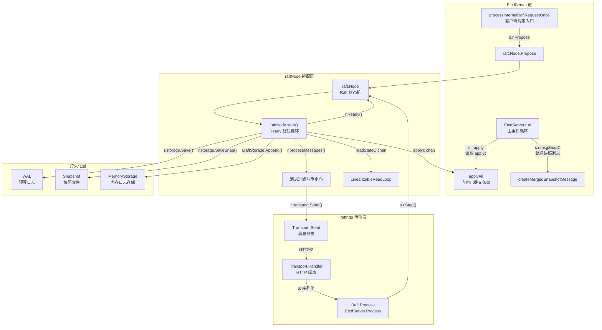
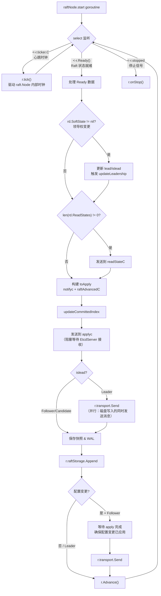
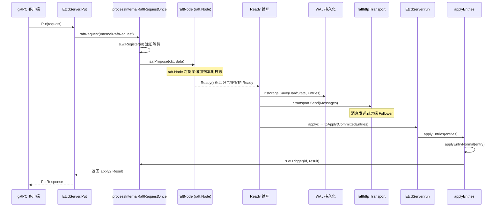
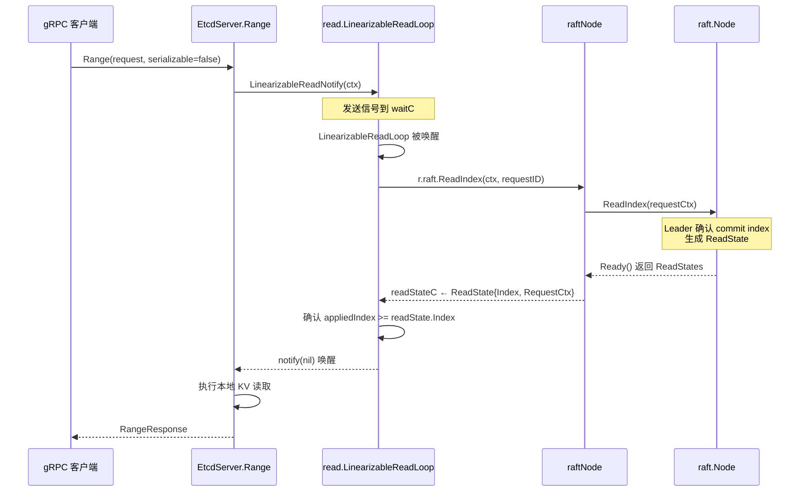

etcd 的分布式一致性核心建立在 [go.etcd.io/raft/v3](go.mod#L35) 库之上——一个独立的、经过形式化验证的 Raft 共识算法实现。然而，raft 库本身只提供了一个纯粹的**状态机接口**（`raft.Node`），它并不关心消息如何通过网络传输、日志如何持久化到磁盘、已提交的条目如何应用到业务存储引擎。将这些底层基础设施与 raft 状态机粘合在一起的，正是 `raftNode` 适配层。理解这一适配层的设计，是掌握 etcd 从"收到客户端写请求"到"集群多数节点确认写入"这条端到端链路的关键。

本文将围绕 `raftNode` 的结构定义、Ready 处理循环、消息发送/接收的 rafthttp 传输层、提案生命周期以及线性一致性读机制展开，帮助你建立对 etcd Raft 集成的完整心智模型。

Sources: [raft.go](server/etcdserver/raft.go#L1-L32), [go.mod](go.mod#L35)

## 架构总览：从 raft 库到 EtcdServer 的分层桥接

在深入代码细节之前，先建立整体架构认知。下图展示了 `raftNode` 在 etcd 分层架构中的位置——它向上对接 `EtcdServer` 的主循环（`run` 方法），向下封装 `raft.Node` 接口与 `rafthttp.Transport` 传输层，形成一个清晰的适配边界。



这个架构的核心设计原则是**关注点分离**：`raft.Node` 只做纯算法层面的状态转移，`raftNode` 负责 Ready 数据的就绪调度与持久化协调，`EtcdServer` 负责业务语义的应用与状态维护。三层通过 channel 进行异步通信，形成一个高效的事件驱动管道。

Sources: [raft.go](server/etcdserver/raft.go#L80-L104), [server.go](server/etcdserver/server.go#L754-L852), [transport.go](server/etcdserver/api/rafthttp/transport.go#L91-L131)

## raftNode 核心结构：字段与 Channel 语义

`raftNode` 结构体是整个适配层的核心载体。它的字段设计直接反映了它与 raft 库、EtcdServer、传输层之间的数据流关系。

```go
type raftNode struct {
    lg *zap.Logger
    tickMu *sync.RWMutex
    latestTickTs time.Time
    raftNodeConfig
    msgSnapC   chan raftpb.Message   // 快照消息通道
    applyc     chan toApply           // 已提交条目通道
    readStateC chan raft.ReadState    // 线性一致读状态通道
    ticker     *time.Ticker
    td         *contention.TimeoutDetector
    stopped    chan struct{}
    done       chan struct{}
}
```

每个 channel 都有明确的单向语义和生产者-消费者关系：

| Channel | 生产者 | 消费者 | 容量 | 用途 |
|---------|--------|--------|------|------|
| `applyc` | `raftNode.start`（Ready 循环） | `EtcdServer.run` | 无缓冲 | 传递已提交的条目与快照给上层 Apply |
| `readStateC` | `raftNode.start`（Ready 循环） | `read.LinearizableReadLoop` | 1 | 传递 Raft ReadIndex 的确认结果 |
| `msgSnapC` | `raftNode.processMessages` | `EtcdServer.applyAll` | 16（`maxInFlightMsgSnap`） | 将 MsgSnap 重定向到主循环做快照合并 |

值得注意的是，`applyc` 是**无缓冲通道**——这意味着 `raftNode.start` 中的 Ready 处理循环会阻塞等待 `EtcdServer.run` 取走 `toApply` 数据。这是一种背压机制：如果 Apply 层处理慢了，Raft 层会自然地减速，避免无限堆积未应用的条目。

`raftNodeConfig` 嵌入结构则持有 raft 库的 `raft.Node` 接口实例、`raft.MemoryStorage`（内存中的日志存储）、`serverstorage.Storage`（WAL + 快照持久化接口）以及 `rafthttp.Transporter`（网络传输接口），它们共同构成了 raftNode 的运行环境。

Sources: [raft.go](server/etcdserver/raft.go#L80-L155), [server.go](server/etcdserver/server.go#L96-L98)

## Ready 处理循环：Raft 协议引擎的节拍器

`raftNode.start(rh *raftReadyHandler)` 方法启动了一个独立 goroutine，它是整个 Raft 集成的**心跳**。这个循环通过 `select` 监听三个事件源，驱动 raft 状态机持续前进。



这个循环的每个阶段都遵循 Raft 论文中的关键约束。下面分阶段解析核心逻辑。

### SoftState 处理：领导权变更感知

当 `rd.SoftState` 非空时，意味着 Raft 集群的**软状态**发生了变化——包括当前 Leader 的身份、当前节点角色（Leader / Follower / Candidate）。`raftNode` 通过 `raftReadyHandler` 回调将这些变更通知给 `EtcdServer`，触发一系列级联操作：更新 `lead` 原子变量、记录 `leaderChanges` 指标、通知 `leaderChanged` Notifier（唤醒挂起的线性一致性读请求），以及在降级为 Follower 时暂停 compactor 并 demote lessor。

Sources: [raft.go](server/etcdserver/raft.go#L184-L206), [server.go](server/etcdserver/server.go#L765-L802)

### Leader 并行优化：磁盘写入与消息发送

Ready 循环中一个重要的性能优化是 **Leader 节点的并行发送**。当节点是 Leader 时，`r.transport.Send(r.processMessages(rd.Messages))` 在保存 WAL 之前就执行了（见 Raft 论文 10.2.1 节）。这意味着 Leader 可以在将日志写入本地磁盘的同时，并行地将日志条目复制到 Follower，Follower 再各自写入磁盘。这种流水线设计显著降低了端到端延迟。

然而，Follower/Candidate 节点必须遵循更严格的顺序：先完成快照保存和 WAL 持久化，然后通知 Apply 循环（通过 `notifyc`），最后才发送响应消息。特别地，如果待发送的已提交条目中包含配置变更（`EntryConfChange`），Follower 必须阻塞等待 EtcdServer 的 Apply 循环完成这些配置变更的应用，否则可能导致"已移除成员的投票仍被计算"等一致性问题。

Sources: [raft.go](server/etcdserver/raft.go#L235-L326)

### Advance 的语义

每次 Ready 处理完成后必须调用 `r.Advance()`。这个调用通知 raft 库："上一批 Ready 数据已经全部处理完毕，可以安全地准备下一批了"。在 `Advance` 之后，如果存在配置变更，还会通过 `raftAdvancedC` 通知 EtcdServer 的 Apply 层。这确保了 Raft 层与 Apply 层在配置变更场景下的严格同步。

Sources: [raft.go](server/etcdserver/raft.go#L328-L334)

## 消息处理与过滤：processMessages

`raftNode.processMessages` 是一个关键的消息预处理函数，它在将 Raft 消息交给传输层发送之前执行过滤和重定向操作。它从消息列表末尾向前遍历，执行三类处理：

| 处理逻辑 | 条件 | 行为 |
|----------|------|------|
| 已移除成员过滤 | `r.isIDRemoved(ms[i].To)` | 将 `To` 设为 0，传输层会跳过 |
| MsgAppResp 去重 | `ms[i].Type == MsgAppResp` | 仅保留最后一条，防止重复的 Append 响应 |
| 快照消息重定向 | `ms[i].Type == MsgSnap` | 发送到 `msgSnapC`，`To` 设为 0（不通过网络发送） |
| 心跳超时检测 | `ms[i].Type == MsgHeartbeat` | 使用 `TimeoutDetector` 检测心跳是否超时 |

**快照消息重定向**的设计尤其值得注意：Raft 库产生的 `MsgSnap` 仅包含 v2 store 的快照数据，不包含 v3 KV 引擎的数据。因此 raftNode 将这些消息重定向到 `msgSnapC`，由 `EtcdServer.applyAll` 在主循环中合并 v2 和 v3 快照后，再通过 `sendMergedSnap` 发送。这种设计避免了在 Raft 循环中执行耗时的快照合并操作。

Sources: [raft.go](server/etcdserver/raft.go#L355-L399)

## rafthttp 传输层：节点间消息的网络桥梁

`rafthttp` 包是 etcd 中 Raft 节点间通信的网络实现，它定义了 `Transporter` 接口和 `Raft` 接口，将 HTTP 协议与 Raft 消息编解码桥接起来。

### 双向通信模型

```mermaid
graph LR
    subgraph "本地节点"
        A["raftNode.start<br/>Ready 循环"] -->|"r.transport.Send()"| B["Transport.Send"]
        B --> C["peer.send"]
        C --> D["streamWriter / pipeline"]
        
        E["Transport.Handler<br/>HTTP 路由"] --> F["pipelineHandler / streamHandler"]
        F --> G["Raft.Process<br/>（= EtcdServer.Process）"]
        G -->|"s.r.Step()"| H["raft.Node.Step"]
    end

    subgraph "远端节点"
        D -.->|"HTTP POST<br/>/raft"| E
        H -.->|"Ready.Messages"| A_REMOTE["远端 raftNode"]
    end

    style A fill:#e1f5fe
    style H fill:#f3e5f5
    style D fill:#fff3e0
    style E fill:#e8f5e9
```



**发送方向**：`raftNode` 的 Ready 循环调用 `r.transport.Send(msgs)` → Transport 遍历消息列表，根据目标 ID 查找对应的 `peer` 或 `remote` → `peer.send(m)` 根据消息类型选择发送通道。

**接收方向**：远端节点的 HTTP 请求到达本地 `Transport.Handler()` 注册的 HTTP 端点 → `pipelineHandler` 或 `streamHandler` 解码消息 → 调用 `Raft.Process(ctx, m)` → 最终通过 `EtcdServer.Process` 调用 `s.r.Step(ctx, m)` 将消息注入本地 raft 状态机。

Sources: [transport.go](server/etcdserver/api/rafthttp/transport.go#L35-L209), [http.go](server/etcdserver/api/rafthttp/http.go#L37-L58)

### 三种发送通道

每个 `peer` 维护三种消息发送机制，按优先级选择：

| 通道类型 | 实现组件 | 适用消息类型 | 特点 |
|----------|----------|-------------|------|
| **MsgAppV2 Stream** | `streamWriter` + `streamReader` | `MsgApp`（日志追加） | 长连接，二进制编码优化，仅 Leader 使用 |
| **Message Stream** | `streamWriter` + `streamReader` | 非 MsgApp 的常规消息 | 长连接，HTTP streaming |
| **Pipeline** | `pipeline`（4 个 HTTP 连接） | 所有消息的降级路径 + `MsgSnap` | 短连接，每次请求独立，缓冲区 64 条 |

`peer.pick(m)` 方法的逻辑清晰展示了选择策略：如果是 `MsgSnap`，直接走 pipeline（因为快照可能很大，不适合 stream）；如果是 `MsgApp` 且 `msgAppV2Writer` 可用，走优化流；否则如果通用 writer 可用就走通用流；最终降级到 pipeline。

Sources: [peer.go](server/etcdserver/api/rafthttp/peer.go#L63-L128), [peer.go](server/etcdserver/api/rafthttp/peer.go#L335-L354)

### 接收端消息分发

`startPeer` 函数为每个 peer 启动两个独立的 goroutine 来分发收到的消息。一个从 `recvc` channel 读取常规 Raft 消息，另一个从 `propc` channel 读取 proposal 消息。两者最终都调用 `r.Process(ctx, mm)`，但分开处理的原因是：`r.Process` 在处理 proposal 时可能会阻塞（例如集群没有 Leader 时），如果放在同一个 goroutine 中，会阻塞其他 Raft 消息的处理。

Sources: [peer.go](server/etcdserver/api/rafthttp/peer.go#L131-L205)

## 提案生命周期：从客户端请求到 Apply 完成

理解一条写请求从到达 EtcdServer 到最终被应用的完整路径，是掌握 Raft 集成的核心。以 `Put` 请求为例：



关键步骤拆解：

1. **提案注册**：`processInternalRaftRequestOnce` 先调用 `s.w.Register(id)` 在 `wait.Wait` 中注册一个以请求 ID 为 key 的等待通道，然后序列化请求并通过 `s.r.Propose(cctx, data)` 提交给 raft 库。

2. **Raft 日志追加**：`raft.Node.Propose` 将提案作为一个 `EntryNormal` 条目追加到本地 Raft 日志中。此时提案尚未提交——它需要被复制到多数节点。

3. **Ready 就绪**：下一次 `r.Ready()` 调用会返回包含新提案的 `Ready` 数据，其中 `Entries` 是追加到日志的新条目，`CommittedEntries` 是已被集群多数确认的条目（可能包含本次或之前的提案），`Messages` 是需要发送到其他节点的消息。

4. **并行持久化与复制**（Leader 路径）：Leader 先调用 `r.transport.Send` 发送消息到 Follower，同时调用 `r.storage.Save` 将日志写入 WAL。Follower 的响应会通过 `EtcdServer.Process` → `s.r.Step` 回到 raft 状态机，推进 commit index。

5. **Apply 执行**：`EtcdServer.run` 从 `applyc` 收到 `toApply`，通过 FIFO 调度器调用 `applyAll`，最终在 `applyEntryNormal` 中执行具体的 KV 写入操作。

6. **结果唤醒**：Apply 完成后，`s.w.Trigger(id, ar)` 唤醒步骤 1 中注册的等待通道，`processInternalRaftRequestOnce` 从 `<-ch` 收到结果并返回给调用方。

Sources: [v3_server.go](server/etcdserver/v3_server.go#L918-L993), [raft.go](server/etcdserver/raft.go#L218-L233), [server.go](server/etcdserver/server.go#L837-L852), [server.go](server/etcdserver/server.go#L968-L989)

## 线性一致性读：ReadIndex 与 readStateC

etcd 的线性一致性读不需要将读请求作为提案提交到 Raft 日志，而是通过 `ReadIndex` 机制实现。这依赖于 `readStateC` channel 的桥接作用。



核心流程：当 `LinearizableReadLoop` 被唤醒后，它调用 `r.raft.ReadIndex` 向 raft 状态机注册一个读请求。Leader 在收到 ReadIndex 请求后，会等待当前 commit index 得到多数节点确认（通过一轮心跳），然后将确认的 index 封装在 `ReadState` 中返回。`raftNode.start` 的 Ready 循环在检测到 `rd.ReadStates` 非空时，将其发送到 `readStateC`。`LinearizableReadLoop` 从该 channel 收到 `ReadState` 后，等待本地 applied index 追上 readState.index，然后通过 notifier 唤醒所有等待中的读请求。

这种设计的优势在于：读请求不占用 Raft 日志空间，不触发额外的网络复制，仅通过一轮心跳的开销即可保证线性一致性。

Sources: [read.go](server/etcdserver/read/read.go#L36-L146), [raft.go](server/etcdserver/raft.go#L208-L216)

## raftReadyHandler：适配层的回调桥梁

`raftReadyHandler` 是 `raftNode` 与 `EtcdServer` 之间的回调接口，它将"Raft 状态变更"与"EtcdServer 业务响应"解耦：

```go
type raftReadyHandler struct {
    getLead              func() (lead uint64)
    updateLead           func(lead uint64)
    updateLeadership     func(newLeader bool)
    updateCommittedIndex func(uint64)
}
```

在 `EtcdServer.run` 中构建 `raftReadyHandler` 实例时，每个回调函数都绑定了 EtcdServer 的具体方法。例如 `updateLeadership` 在节点变为 Leader 时记录选举时间戳并恢复 compactor，在降为 Follower 时 demote lessor 并暂停 compactor。`updateCommittedIndex` 则使用 CAS 语义更新 `committedIndex` 原子变量，确保它只增不减。

这种回调模式避免了 `raftNode` 直接依赖 `EtcdServer` 的具体类型，使两者之间保持了清晰的接口边界。测试中甚至可以传入 `nil` 来创建不含回调的 raftNode。

Sources: [server.go](server/etcdserver/server.go#L744-L802), [raft.go](server/etcdserver/raft.go#L173)

## raftNode 的创建与 Raft 启动

`raftNode` 的创建路径经过 `bootstrap` 阶段的多步构建：

1. **`bootstrapRaft`** 根据是否有 WAL 和是否新建集群，选择不同的初始化路径。
2. **`raftConfig`** 构造 `raft.Config` 结构，设置关键参数：
   - `ElectionTick`：选举超时的 tick 数（默认 10 × TickMs）
   - `HeartbeatTick`：心跳间隔的 tick 数（固定为 1）
   - `MaxSizePerMsg`：单条消息最大 1MB
   - `MaxInflightMsgs`：最大在途消息数 512（4096/8）
   - `CheckQuorum`：开启 quorum 检查
   - `PreVote`：可配置的 PreVote 机制
3. **`bootstrappedRaft.newRaftNode`** 根据是否有 peers 决定调用 `raft.StartNode`（新集群）还是 `raft.RestartNode`（已有 WAL），然后将 `raft.Node` 实例注入 `raftNodeConfig`，创建最终的 `raftNode`。

| 启动场景 | 调用方式 | peers 参数 |
|----------|----------|-----------|
| 新建集群（`--new-cluster`） | `raft.StartNode(config, peers)` | 包含所有初始成员 |
| 加入已有集群 | `raft.StartNode(config, peers)` | 仅包含自己 |
| 从 WAL 恢复 | `raft.RestartNode(config)` | 空（从快照和日志恢复） |

Sources: [bootstrap.go](server/etcdserver/bootstrap.go#L489-L573), [raft.go](server/etcdserver/raft.go#L34-L41)

## 优雅停止：raftNode 的生命周期管理

`raftNode.stop()` 通过向 `stopped` channel 发送信号来触发停止。由于 `stopped` 是无缓冲 channel，如果已经停止过，则会走 `<-r.done` 分支直接返回，避免重复停止。`onStop` 方法依次执行：停止 `raft.Node`、停止 ticker、停止 Transport、关闭 Storage（WAL），最后关闭 `done` channel 通知调用方停止已完成。

`EtcdServer` 的停止顺序严格遵循依赖关系：先关闭 `stopping` channel 取消所有 GoAttach goroutine → 等待 wg 确认所有 goroutine 退出 → 最后调用 `s.r.stop()` 关闭 Raft 层（确保 WAL 在所有使用者退出后才关闭）。

Sources: [raft.go](server/etcdserver/raft.go#L401-L425), [server.go](server/etcdserver/server.go#L813-L830)

## 与 raftexample 的对照：简化版 Raft 集成

etcd 仓库中的 `contrib/raftexample` 提供了一个极简的 Raft 集成示例，非常适合作为理解 etcd 自身集成的对照参考。它的 `serveChannels` 方法展示了相同的核心模式：`<-ticker.C` 驱动 tick → `<-rc.node.Ready()` 处理 Ready 数据 → 持久化到 WAL → 发送消息 → 应用已提交条目 → `rc.node.Advance()`。两者的关键差异如下：

| 对比维度 | raftexample | etcd EtcdServer |
|----------|-------------|-----------------|
| Ready 循环位置 | 单个 goroutine 中同步执行 | `raftNode.start` 独立 goroutine |
| Apply 执行 | Ready 循环内同步调用 `publishEntries` | 通过 `applyc` 异步交给 `EtcdServer.run` 的 FIFO 调度器 |
| 消息预处理 | 仅更新快照的 ConfState | 完整的过滤、去重、快照重定向、心跳检测 |
| 传输层 | 直接使用 `rafthttp.Transport` | 相同，但配合更复杂的 peer 管理 |
| 线性一致读 | 不支持 | 通过 `ReadIndex` + `readStateC` 完整支持 |

Sources: [raft.go](contrib/raftexample/raft.go#L406-L485), [raft.go](contrib/raftexample/raft.go#L490-L497)

## 关键设计总结

回顾全文，`raftNode` 适配层的设计体现了几个核心工程决策：

- **无缓冲 applyc 作为背压机制**：Raft 层不会产生超过 Apply 层处理能力的数据，从架构层面避免了内存溢出风险。
- **Leader 并行发送**：遵循 Raft 论文 10.2.1 的优化建议，Leader 的日志复制与本地磁盘写入并行执行，降低写入延迟。
- **消息过滤前置**：`processMessages` 在消息进入传输层之前就完成了去重、重定向和过滤，减少了不必要的网络开销。
- **回调解耦**：`raftReadyHandler` 将 Raft 状态变更与 EtcdServer 业务逻辑解耦，使 raftNode 保持纯粹的适配层职责。
- **三种通道互补**：pipeline 作为可靠降级路径，stream 提供高性能长连接，三者按消息类型和连接状态自动选择。

理解这些设计后，你已经具备了追踪 Raft 消息流转、诊断提案延迟问题、分析 Leader 切换行为的能力。建议接下来阅读 [集群成员管理与动态重配置](10-ji-qun-cheng-yuan-guan-li-yu-dong-tai-zhong-pei-zhi) 了解配置变更（`ConfChange`）如何通过这个适配层传播，以及 [WAL（预写日志）：持久化与崩溃恢复](12-wal-yu-xie-ri-zhi-chi-jiu-hua-yu-beng-kui-hui-fu) 深入理解 `r.storage.Save` 背后的 WAL 实现细节。