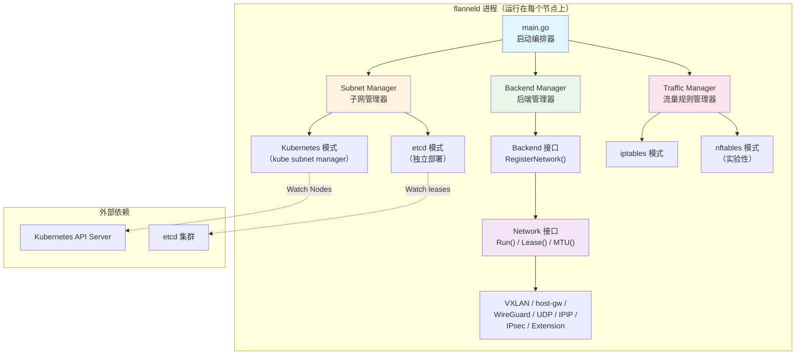

Flannel 是一个为 Kubernetes 设计的**三层网络编排工具**——它专注于解决集群中跨主机 Pod 通信这一最基础也是最关键的网络问题。与 Calico、Cilium 等功能全面的网络方案不同，Flannel 始终遵循一个清晰的设计哲学：**只做主机间的网络连通，不碰容器到主机的网桥配置，也不涉及网络策略**。这种克制使它成为 Kubernetes 生态中最轻量、最易上手的 CNI 实现之一，也是 K3s 等轻量发行版的默认网络方案。整个项目以**单二进制代理**（`flanneld`）的形式运行在每个节点上，通过子网租约机制为每台主机分配独立网段，再借助可插拔的后端机制（如 VXLAN、host-gw、WireGuard 等）封装或路由跨主机流量。理解 Flannel 的核心价值，本质上就是理解这四个关键词：**子网分配、租约管理、后端封装、流量规则**。

Sources: [README.md](README.md#L1-L23)

## Flannel 解决的核心问题

Kubernetes 的网络模型有一个基本假设：**每个 Pod 都拥有一个集群内唯一且可路由的 IP 地址**。这意味着 Pod-A 在 Node-1 上可以直接用 IP 访问 Pod-B 在 Node-2 上的服务，无需 NAT 端口映射。这个模型极大地简化了服务间通信——应用代码不需要关心端口冲突或地址转换。然而，现实中的物理网络并不知道这些 Pod IP 的存在，它们只认识节点自身的 IP。Flannel 的使命就是在节点之间构建一张**覆盖整个集群 Pod 网段的虚拟三层网络**，让跨节点的 Pod-to-Pod 通信变得透明。

Flannel 并不控制容器如何接入主机网络（这部分由 CNI 插件如 bridge、portmap 负责），它只负责**让一个节点上的流量正确抵达另一个节点**。具体来说，当 Pod-A（10.244.1.5）向 Pod-B（10.244.2.3）发包时，Flannel 确保数据包能从 Node-1 的网络栈出发，经过某种封装或路由机制，最终到达 Node-2 并被正确递交给目标 Pod。网络策略（NetworkPolicy）不在 Flannel 的职责范围内——如果需要网络策略，可以配合 Calico 等项目使用。

Sources: [README.md](README.md#L16-L23), [pkg/backend/common.go](pkg/backend/common.go#L26-L48)

## 整体架构概览

Flannel 的架构可以用"**一个入口、两个管理器、三层抽象**"来概括。一个入口指的是 [main.go](main.go) 中定义的 `main()` 函数，它是整个 `flanneld` 进程的启动编排器。两个管理器分别是**子网管理器**（Subnet Manager）和**后端管理器**（Backend Manager），前者负责子网分配和租约维护，后者负责创建具体的网络封装机制。三层抽象指的是 `subnet.Manager → backend.Backend → backend.Network` 这组接口层级，它们将配置获取、网络创建、数据面运行三个关注点完全解耦。

下面的架构图展示了 `flanneld` 启动后的核心组件及其协作关系：



启动流程遵循一条清晰的管线：① 解析命令行参数 → ② 创建子网管理器（kube 或 etcd） → ③ 获取网络配置 → ④ 探测网络接口 → ⑤ 创建后端并注册网络 → ⑥ 初始化流量规则 → ⑦ 写入子网文件 → ⑧ 运行后端网络循环 → ⑨ 完成租约生命周期。每一步都依赖于前一步的成功，任何环节失败都会触发优雅关闭。

Sources: [main.go](main.go#L214-L508), [pkg/backend/manager.go](pkg/backend/manager.go#L26-L93)

## 四大核心子系统

Flannel 的代码库围绕四个核心子系统组织，每个子系统都有明确的接口边界和职责划分。

**子网管理系统**（`pkg/subnet/`）是 Flannel 的"大脑"。它定义了 `subnet.Manager` 接口，提供获取网络配置、获取/续约租约、监听租约变更等核心能力。这个接口有两个实现：`kube` 子包通过 Kubernetes API 监听 Node 对象来实现声明式子网管理（推荐模式），`etcd` 子包则直接读写 etcd 来维护租约数据。租约的有效期为 24 小时，默认在到期前 60 分钟自动续约。子网配置结构体 `Config` 包含了 IPv4/IPv6 网络范围、子网长度、后端类型等关键字段，并内置了完整的参数校验逻辑。

Sources: [pkg/subnet/subnet.go](pkg/subnet/subnet.go#L106-L118), [pkg/subnet/config.go](pkg/subnet/config.go#L26-L40)

**后端系统**（`pkg/backend/`）是 Flannel 的"手脚"。每个后端通过 `init()` 函数调用 `backend.Register()` 将自身注册到一个全局的 `constructors` 映射表中。当 `main()` 调用 `bm.GetBackend(config.BackendType)` 时，后端管理器从映射表中查找对应的构造函数并实例化后端。每个后端都必须实现 `Backend` 接口（核心方法 `RegisterNetwork`），返回一个实现 `Network` 接口的对象（核心方法 `Run`、`Lease`、`MTU`）。这种**注册-查找-构造**的模式让新增后端变得极为简单——只需编写实现并添加一行 `_ "import"` 即可。

Sources: [pkg/backend/manager.go](pkg/backend/manager.go#L26-L93), [pkg/backend/common.go](pkg/backend/common.go#L39-L50), [main.go](main.go#L47-L58)

**流量管理系统**（`pkg/trafficmngr/`）负责主机级别的 iptables/nftables 规则管理。它提供了两个核心能力：设置 MASQUERADE 规则（当 `--ip-masq` 开启时，为离开 Flannel 网络的流量做源地址转换）和维护 FORWARD 链规则（确保跨主机流量不被 Docker 的默认 DROP 策略阻断）。该系统同样采用接口抽象，支持 iptables 和实验性的 nftables 两种后端实现，在 `main.go` 中通过 `newTrafficManager()` 函数根据配置选择。

Sources: [pkg/trafficmngr/trafficmngr.go](pkg/trafficmngr/trafficmngr.go#L38-L60), [main.go](main.go#L655-L661)

**租约与事件系统**（`pkg/lease/`）是连接子网管理和后端运行的桥梁。`Lease` 结构体记录了本节点获得的子网信息（IPv4/IPv6）、公网 IP、后端类型及后端专属数据。`LeaseWatcher` 负责监听集群中其他节点的租约变更事件（添加/移除），并将这些事件传递给后端的 `Run()` 方法，触发路由表或转发数据库（FDB）的更新。这个事件驱动机制确保了当新节点加入或旧节点离开时，全网路由能自动收敛。

Sources: [pkg/lease/lease.go](pkg/lease/lease.go#L27-L74)

## 后端方案对比

Flannel 提供了多种后端方案，每种在封装方式、性能特征和适用场景上各有侧重。下表汇总了所有后端的关键特性：

| 后端类型 | 封装方式 | 加密支持 | 性能 | 适用场景 | 状态 |
|:---------|:---------|:---------|:-----|:---------|:-----|
| **vxlan** | 内核态 VXLAN（UDP 封装） | ❌ | 中等 | **推荐默认选择**，兼容性最好 | 稳定 |
| **host-gw** | 无封装，纯路由 | ❌ | **最高** | 二层可达的数据中心，不能用于云环境 | 稳定 |
| **wireguard** | 内核态 WireGuard 隧道 | ✅（自动） | 中高 | 需要加密传输的场景 | 稳定 |
| **udp** | 用户态 UDP 封装 | ❌ | 低 | 仅用于调试或极旧内核 | 稳定 |
| **ipip** | 内核态 IPIP 封装 | ❌ | 中等 | 仅支持 IPv4 单播 | 实验 |
| **ipsec** | StrongSwan IKEv2 + IPSec | ✅（密钥轮换） | 中等 | 需要标准 IPSec 的场景 | 实验 |
| **alloc** | 无转发 | ❌ | N/A | 仅分配子网不做转发 | 实验 |
| **tencent-vpc** | 腾讯云 VPC 路由表 | ❌ | 高 | 腾讯云专用 | 实验 |
| **extension** | 自定义外部进程 | 取决于实现 | 取决于实现 | 原型开发新后端 | 实验 |

Sources: [Documentation/backends.md](Documentation/backends.md#L1-L144)

## 项目结构地图

理解 Flannel 的代码组织有助于快速定位感兴趣的模块。以下是对关键目录的职能说明：

```
flannel/
├── main.go                  # 入口文件：参数解析、组件编排、信号处理
├── pkg/
│   ├── backend/             # 后端系统：可插拔的网络封装实现
│   │   ├── manager.go       #   后端管理器（注册、查找、构造）
│   │   ├── common.go        #   Backend / Network 接口定义
│   │   ├── vxlan/           #   VXLAN 后端（Linux + Windows）
│   │   ├── hostgw/          #   host-gw 后端（纯路由）
│   │   ├── wireguard/       #   WireGuard 后端（加密隧道）
│   │   ├── udp/             #   UDP 后端（调试用）
│   │   ├── ipip/            #   IPIP 后端
│   │   ├── ipsec/           #   IPsec 后端
│   │   ├── extension/       #   自定义后端扩展点
│   │   ├── tencentvpc/      #   腾讯云 VPC 后端
│   │   └── alloc/           #   仅分配子网的后端
│   ├── subnet/              # 子网管理系统
│   │   ├── subnet.go        #   Manager 接口 + WatchLeases 事件循环
│   │   ├── config.go        #   Config 结构体与参数校验
│   │   ├── kube/            #   Kubernetes 子网管理器实现
│   │   └── etcd/            #   etcd 子网管理器实现
│   ├── lease/               # 租约与事件系统
│   │   └── lease.go         #   Lease / LeaseWatcher / Event 定义
│   ├── trafficmngr/         # 流量规则管理
│   │   ├── trafficmngr.go   #   TrafficManager 接口
│   │   ├── iptables/        #   iptables 实现
│   │   └── nftables/        #   nftables 实现（实验性）
│   ├── ip/                  # IP 地址工具库
│   ├── ipmatch/             # 网络接口探测与选择
│   └── routing/             # 路由管理（Windows）
├── Documentation/           # 官方文档
├── chart/                   # Helm Chart 部署模板
├── dist/                    # 部署脚本与测试工具
└── e2e/                     # 端到端测试框架
```

Sources: [main.go](main.go#L1-L59), [pkg/backend/common.go](pkg/backend/common.go#L1-L51), [pkg/subnet/config.go](pkg/subnet/config.go#L26-L40)

## 技术栈与依赖关系

Flannel 使用 Go 语言编写，当前要求 Go 1.25+。从依赖关系可以清晰看出其技术选型方向：**Kubernetes 客户端库**（`k8s.io/client-go`、`k8s.io/api`）用于与 API Server 交互；**netlink 库**（`github.com/vishvananda/netlink`）用于操控 Linux 内核的网络设备、路由和邻居表；**WireGuard 控制库**（`golang.zx2c4.com/wireguard/wgctrl`）用于编程式管理 WireGuard 隧道；**etcd 客户端**（`go.etcd.io/etcd/client/v3`）用于传统模式下的数据存储；**iptables/nftables 库**（`github.com/coreos/go-iptables`、`sigs.k8s.io/knftables`）用于管理主机级流量规则。项目采用 Apache 2.0 开源许可证。

Sources: [go.mod](go.mod#L1-L38), [LICENSE](LICENSE#L1-L6)

## 阅读导航

本文档作为 Flannel 项目的起点概览，接下来建议按以下顺序深入阅读：

1. **动手实践** → [快速上手：在 Kubernetes 集群中部署 Flannel](2-kuai-su-shang-shou-zai-kubernetes-ji-qun-zhong-bu-shu-flannel) — 用一条命令将 Flannel 部署到集群中
2. **开发准备** → [构建与开发环境配置](3-gou-jian-yu-kai-fa-huan-jing-pei-zhi) — 从源码编译和搭建开发环境
3. **定制部署** → [使用 Helm Chart 自定义部署](4-shi-yong-helm-chart-zi-ding-yi-bu-shu) — 通过 Helm 参数化配置 Flannel
4. **架构深入** → [整体架构：从 main.go 到各子系统的启动流程](5-zheng-ti-jia-gou-cong-main-go-dao-ge-zi-xi-tong-de-qi-dong-liu-cheng) — 逐行追踪 `flanneld` 的启动管线