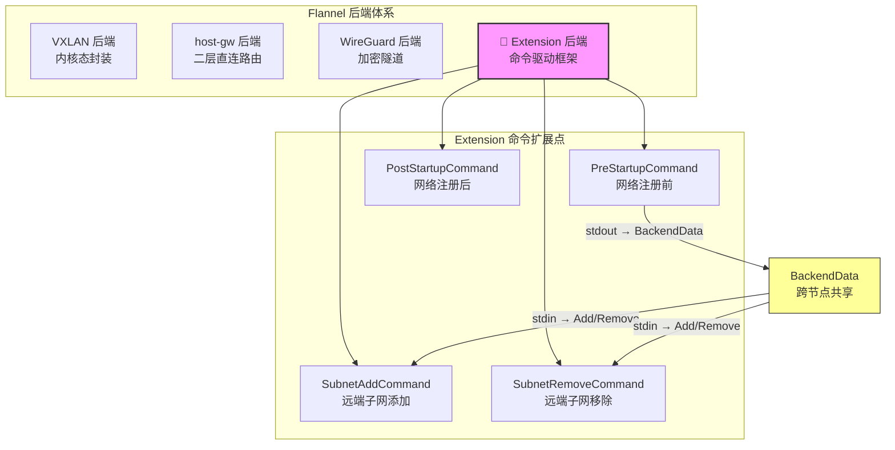

Extension 后端是 Flannel 内置后端体系中设计理念最为独特的一个成员——它**不以任何特定的网络封装技术为目标**，而是提供一个命令驱动的框架，让开发者能够通过配置 Shell 命令来模拟或原型化任意后端的行为。从架构定位上看，Extension 是一个**胶水层**：它将 Flannel 的子网生命周期（注册、发现、变更）转化为可配置的外部命令调用点，从而在不编写 Go 代码的前提下实现自定义数据平面。需要强调的是，该后端**明确不推荐用于生产环境**，其设计目标是原型验证与快速迭代。下文将从生命周期模型、命令执行引擎、数据传递管道以及实战示例四个维度进行深入剖析。

Sources: [extension.md](Documentation/extension.md#L1-L6), [extension.go](pkg/backend/extension/extension.go#L15-L36)

## 架构定位与设计动机

Flannel 的内置后端（VXLAN、host-gw、WireGuard 等）各自封装了特定的网络技术，实现逻辑深埋于 Go 代码中。当开发者需要实验一种新的封装方式或路由策略时，传统的路径是：编写完整的 Go 后端 → 注册到构造函数表 → 编译测试。Extension 后端通过**将网络操作外部化为 Shell 命令**，将这一周期从"天级"缩短到"分钟级"。



Extension 后端的核心设计思想是**四个命令钩子**（Hook），它们分别对应网络生命周期的四个关键节点。其中最精巧的设计是 `PreStartupCommand` 的输出通过 `BackendData` 机制在节点间传播，然后作为 `stdin` 传入其他节点的 `SubnetAddCommand` 和 `SubnetRemoveCommand`——这构成了一个跨节点的数据管道，使得像 VXLAN MAC 地址、WireGuard 公钥这类需要全网共享的信息可以通过纯 Shell 脚本传递。

Sources: [extension.go](pkg/backend/extension/extension.go#L38-L56), [extension.md](Documentation/extension.md#L8-L34)

## 生命周期与四个命令钩子

Extension 后端的实现分为两个核心结构体：`ExtensionBackend` 负责后端注册与网络实例化，`network` 负责子网事件监听与命令调度。四个命令钩子在生命周期中的触发时序如下：

```mermaid
sequenceDiagram
    participant SM as subnet.Manager
    participant BE as ExtensionBackend
    participant CMD as Shell 命令
    participant NET as network (事件循环)

    Note over BE: RegisterNetwork() 被调用
    
    rect rgb(230, 245, 255)
    Note over BE,CMD: 阶段一：Pre-Startup
    BE->>CMD: 执行 PreStartupCommand
    CMD-->>BE: stdout → JSON 序列化为 BackendData
    end

    BE->>SM: AcquireLease(LeaseAttrs{BackendData})
    SM-->>BE: 返回 Lease（含本节点子网）

    rect rgb(230, 255, 230)
    Note over BE,CMD: 阶段二：Post-Startup
    BE->>CMD: 执行 PostStartupCommand
    Note right of CMD: 环境变量: NETWORK, SUBNET,<br/>IPV6SUBNET, PUBLIC_IP, PUBLIC_IPV6
    end

    BE-->>NET: 返回 network 实例
    
    rect rgb(255, 240, 230)
    Note over NET,CMD: 阶段三：运行时事件循环
    loop WatchLeases 事件流
        SM-->>NET: EventAdded / EventRemoved
        NET->>CMD: SubnetAddCommand 或 SubnetRemoveCommand
        Note right of CMD: 环境变量: SUBNET, PUBLIC_IP<br/>stdin: 远端 BackendData
    end
```

下表详细描述了四个命令钩子的触发时机、数据输入输出以及在 Flannel 架构中的角色：

| 命令钩子 | 触发时机 | 输入 | 输出用途 | 典型场景 |
|---|---|---|---|---|
| **PreStartupCommand** | `RegisterNetwork` 中，租约获取前 | 无特殊输入 | stdout → `json.Marshal` → `BackendData` | 创建隧道设备、生成密钥对、获取 MAC 地址 |
| **PostStartupCommand** | `RegisterNetwork` 中，租约获取后 | 环境变量: `NETWORK`, `SUBNET`, `IPV6SUBNET`, `PUBLIC_IP`, `PUBLIC_IPV6` | stdout 仅记录日志 | 配置 IP 地址、启动接口 |
| **SubnetAddCommand** | 收到 `EventAdded` 事件 | 环境变量: `SUBNET`, `PUBLIC_IP`；stdin: 远端 `BackendData` | stdout 仅记录日志 | 添加路由、FDB 表项、WireGuard peer |
| **SubnetRemoveCommand** | 收到 `EventRemoved` 事件 | 环境变量: `SUBNET`, `PUBLIC_IP`；stdin: 远端 `BackendData` | stdout 仅记录日志 | 删除路由、清理 FDB、移除 peer |

Sources: [extension.go](pkg/backend/extension/extension.go#L58-L143), [extension_network.go](pkg/backend/extension/extension_network.go#L30-L69)

## 命令执行引擎：runCmd 的实现细节

Extension 后端所有 Shell 命令的执行最终都汇聚到 `runCmd` 函数。这个函数的实现体现了若干关键的设计决策：

**直接执行模式而非 Shell 调用模式**。命令字符串首先通过 `strings.Fields()` 按空白拆分为命令名和参数列表，然后使用 `exec.Command` 直接执行。这意味着命令并非通过 `/bin/sh -c` 运行，而是作为独立进程启动，Shell 内建命令（如 `export`、`read`）和管道操作符（`|`、`&&`）在这种模式下不会被解释。然而，`runCmd` 通过 `expandVars` 函数对 `$VAR` / `${VAR}` 引用进行手动展开，利用 `os.Expand` 在执行前将环境变量注入到参数中，从而在无需 Shell 的情况下实现了变量替换。

**环境变量注入采用合并策略**。`buildEnvMap` 函数将 `os.Environ()` 与自定义环境变量合并为 `map[string]string`，自定义变量覆盖系统同名变量。展开后的参数列表传入 `exec.Command`，同时原始环境变量列表（`os.Environ()` + 自定义变量）通过 `cmd.Env` 设置，确保子进程同时拥有系统环境和 Flannel 注入的变量。

**stdin 管道机制**。`runCmd` 通过 `cmd.StdinPipe()` 创建管道，将 `stdin` 参数写入后立即关闭。对于 `SubnetAddCommand` 和 `SubnetRemoveCommand`，`stdin` 的内容正是远端节点 `PreStartupCommand` 的输出经过 JSON 序列化/反序列化后的字符串。

```go
// runCmd 核心流程（简化）
func runCmd(env []string, stdin string, name string, arg ...string) (string, error) {
    envMap := buildEnvMap(env)                    // 合并系统环境与自定义变量
    expanded := expandVars(envMap, append([]string{name}, arg...))  // 展开 $VAR
    cmd := exec.Command(expanded[0], expanded[1:]...)
    cmd.Env = append(os.Environ(), env...)
    // 写入 stdin 并捕获 combined output
    output, err := cmd.CombinedOutput()
    return strings.TrimSpace(string(output)), err
}
```

值得注意的是，`strings.Fields()` 的拆分行为对复杂命令构成了限制——包含空格的参数（如 IP 地址中嵌套的表达式）会被错误地截断。这是 Extension 后端在实际使用中需要注意的边界条件。

Sources: [extension.go](pkg/backend/extension/extension.go#L145-L201)

## BackendData 跨节点数据管道

Extension 后端最精巧的架构特性是其跨节点数据传播机制。这个管道的核心在于 `LeaseAttrs.BackendData` 字段——一个 `json.RawMessage`，由子网管理器（etcd 或 Kubernetes）负责在所有节点间同步。

**写入端**发生在 `RegisterNetwork` 中：`PreStartupCommand` 的 stdout 输出被 `json.Marshal` 包装为 JSON 字符串后存入 `LeaseAttrs.BackendData`，随 `AcquireLease` 调用注册到子网管理器。例如，在 VXLAN 模拟场景中，`PreStartupCommand` 通过 `cat /sys/class/net/flannel-vxlan/address` 输出 VTEP 的 MAC 地址，该地址随后作为 BackendData 广播给所有节点。

**读取端**发生在 `handleSubnetEvents` 中：收到 `EventAdded` 或 `EventRemoved` 时，从事件的 `Lease.Attrs.BackendData` 中 `json.Unmarshal` 出字符串，将其作为 `stdin` 传入 `SubnetAddCommand` 或 `SubnetRemoveCommand`。在 Shell 脚本中，通过 `read VTEP` 即可获取远端节点的 MAC 地址。

```mermaid
flowchart LR
    subgraph "节点 A"
        A_PRE["PreStartupCommand<br/>cat /sys/class/net/.../address"]
        A_OUT["stdout: 'aa:bb:cc:dd:ee:ff'"]
        A_PRE --> A_OUT
    end

    subgraph "子网管理器 (etcd/K8s)"
        LEASE["LeaseAttrs.BackendData<br/>JSON: '\"aa:bb:cc:dd:ee:ff\"'"]
    end

    subgraph "节点 B"
        B_UNMARSHAL["json.Unmarshal<br/>→ 'aa:bb:cc:dd:ee:ff'"]
        B_STDIN["stdin 管道"]
        B_CMD["SubnetAddCommand<br/>read VTEP"]
        B_UNMARSHAL --> B_STDIN --> B_CMD
    end

    A_OUT --> |"json.Marshal"| LEASE
    LEASE --> |"WatchLeases 事件"| B_UNMARSHAL
```

**BackendType 过滤机制**也值得关注。`handleSubnetEvents` 中对每个事件都检查 `evt.Lease.Attrs.BackendType != "extension"`，如果远端节点使用的是其他后端类型（如 VXLAN），该事件会被静默忽略。这意味着 Extension 后端集群中的所有节点必须统一使用 `"extension"` 类型，不支持混合后端部署。

Sources: [extension.go](pkg/backend/extension/extension.go#L81-L102), [extension_network.go](pkg/backend/extension/extension_network.go#L71-L104)

## 实战示例解析

仓库的 `dist/` 目录中提供了三个开箱即用的 Extension 配置示例，分别模拟了 host-gw、VXLAN 和 WireGuard 三种内置后端的核心行为。这些示例是理解 Extension 能力边界的最佳教材。

### 示例一：host-gw 模拟（最简模型）

```json
{
  "Network": "10.50.0.0/16",
  "Backend": {
    "Type": "extension",
    "SubnetAddCommand": "ip route add \"$SUBNET\" via \"$PUBLIC_IP\"",
    "SubnetRemoveCommand": "ip route del \"$SUBNET\" via \"$PUBLIC_IP\""
  }
}
```

这是最简洁的 Extension 配置——仅使用 `SubnetAddCommand` 和 `SubnetRemoveCommand`，无需 PreStartup 或 PostStartup。每次远端子网变更时，直接通过 `ip route` 命令增删静态路由，本质上就是 host-gw 后端的 Shell 等价实现。它清晰地展示了 Extension 的最小工作集：仅两个命令即可实现一个可用的后端。

Sources: [extension-hostgw](dist/extension-hostgw#L1-L9)

### 示例二：VXLAN 模拟（复杂管道模型）

```json
{
  "Network": "10.50.0.0/16",
  "Backend": {
    "Type": "extension",
    "PreStartupCommand": "export VNI=1; export IF_NAME=flannel-vxlan; ip link del \"$IF_NAME\" 2>/dev/null; ip link add \"$IF_NAME\" type vxlan id \"$VNI\" dstport 8472 nolearning && ip link set mtu 1450 dev \"$IF_NAME\" && cat \"/sys/class/net/${IF_NAME}/address\"",
    "PostStartupCommand": "export IF_NAME=flannel-vxlan; export SUBNET_IP=$(echo \"$SUBNET\" | cut -d'/' -f 1); ip addr add \"${SUBNET_IP}/32\" dev \"$IF_NAME\" && ip link set \"$IF_NAME\" up",
    "SubnetAddCommand": "export SUBNET_IP=$(echo \"$SUBNET\" | cut -d'/' -f 1); export IF_NAME=flannel-vxlan; read VTEP; ip route add \"$SUBNET\" nexthop via \"$SUBNET_IP\" dev \"$IF_NAME\" onlink && ip neigh replace \"$SUBNET_IP\" dev \"$IF_NAME\" lladdr \"$VTEP\" && bridge fdb add \"$VTEP\" dev \"$IF_NAME\" dst \"$PUBLIC_IP\""
  }
}
```

VXLAN 模拟完整展示了四个命令钩子的协作方式。`PreStartupCommand` 创建 VXLAN 设备并输出其 MAC 地址；该地址通过 BackendData 传播到所有节点；远端节点的 `SubnetAddCommand` 通过 `read VTEP` 从 stdin 获取该 MAC 地址，然后配置三层路由、ARP 表项和 FDB 转发条目。然而，这里暴露了 `strings.Fields()` 的局限性——VXLAN 配置示例中的 `SubnetAddCommand` 包含复杂的 Shell 语法（变量替换、`read` 内建命令），但实际上 `runCmd` 使用 `exec.Command` 直接执行而非 Shell，这意味着这些示例在当前实现中可能无法按预期工作。

Sources: [extension-vxlan](dist/extension-vxlan#L1-L11)

### 示例三：WireGuard 模拟（密钥交换模型）

WireGuard 示例展示了公钥交换场景：`PreStartupCommand` 生成密钥对并输出公钥；`SubnetAddCommand` 通过 `read PUBLICKEY` 从 stdin 读取远端公钥，然后配置 WireGuard peer。该文件顶部标注了 `// This is deprecated and should not be used. Please use the wireguard backend instead!`，表明 Extension 曾被用作 WireGuard 后端的早期原型，后来才发展为独立的 Go 实现。这恰好印证了 Extension 作为原型开发工具的定位。

Sources: [extension-wireguard](dist/extension-wireguard#L1-L13)

## 代码实现中的关键约束与差异

对源代码的精细审查揭示了若干与官方文档描述不一致的实现细节，这些差异对于实际使用至关重要。

**PostStartupCommand 与 SubnetAddCommand 的环境变量差异**。在 `RegisterNetwork` 中，`PostStartupCommand` 接收五个环境变量：`NETWORK`、`SUBNET`、`IPV6SUBNET`、`PUBLIC_IP`、`PUBLIC_IPV6`。但在 `handleSubnetEvents` 中，`SubnetAddCommand` 和 `SubnetRemoveCommand` 仅接收两个环境变量：`SUBNET` 和 `PUBLIC_IP`。官方文档声称 Subnet 命令也能获取 `IPV6SUBNET` 和 `PUBLIC_IPV6`，但当前代码实现中并未传入这两个变量。

| 命令钩子 | 代码实际注入的环境变量 | 文档声明的环境变量 |
|---|---|---|
| PreStartupCommand | 无 | 无 |
| PostStartupCommand | `NETWORK`, `SUBNET`, `IPV6SUBNET`, `PUBLIC_IP`, `PUBLIC_IPV6` | `SUBNET` |
| SubnetAddCommand | `SUBNET`, `PUBLIC_IP` | `SUBNET`, `IPV6SUBNET`, `PUBLIC_IP`, `PUBLIC_IPV6` |
| SubnetRemoveCommand | `SUBNET`, `PUBLIC_IP` | `SUBNET`, `IPV6SUBNET`, `PUBLIC_IP`, `PUBLIC_IPV6` |

**ShutdownCommand 未实现**。`dist/` 目录中的 VXLAN 和 WireGuard 示例配置包含 `ShutdownCommand` 字段（如 `ip link del flannel-vxlan`），但 `RegisterNetwork` 中的配置解析结构体仅声明了四个字段（`PreStartupCommand`、`PostStartupCommand`、`SubnetAddCommand`、`SubnetRemoveCommand`），`ShutdownCommand` 被静默忽略。这意味着 Flannel 进程退出时，Extension 后端创建的网络设备不会被自动清理。

**错误处理策略：继续运行而非终止**。与 `RegisterNetwork` 中命令失败直接返回错误不同，`handleSubnetEvents` 中命令执行失败仅记录错误日志（`log.Errorf`），不会中断事件循环。这是一种容忍部分失败的策略——某个远端子网的路由添加失败不会影响后续子网事件的处理，但也意味着错误可能被忽视。

**BackendType 硬编码过滤**。事件处理中对 `BackendType != "extension"` 的严格检查意味着 Extension 后端无法与其他后端类型共存于同一集群。如果一个集群中部分节点使用 VXLAN 后端、部分使用 Extension 后端模拟 host-gw，Extension 节点会忽略所有来自 VXLAN 节点的子网事件。

Sources: [extension.go](pkg/backend/extension/extension.go#L66-L79), [extension.go](pkg/backend/extension/extension.go#L124-L137), [extension_network.go](pkg/backend/extension/extension_network.go#L77-L79), [extension_network.go](pkg/backend/extension/extension_network.go#L93-L103)

## 架构优势与局限总结

Extension 后端的价值在于其**零编译成本的快速验证能力**。开发者可以在数分钟内通过 Shell 脚本组合 `ip`、`bridge`、`wg` 等工具验证网络方案可行性，无需理解 Flannel 内部的 Go 接口体系。`PreStartupCommand` → BackendData → stdin 的数据管道设计尤为精巧，为需要跨节点共享状态的场景（密钥交换、MAC 地址传播）提供了优雅的解决方案。

然而，其局限性同样明显：`strings.Fields()` 的命令拆分对复杂 Shell 语法支持不足；`exec.Command` 直接执行模式无法使用 Shell 内建命令和管道；缺少内置重试机制和优雅关闭支持；环境变量传递与文档描述存在差距。这些都是该后端不被推荐用于生产环境的原因，也是开发者在原型验证成功后需要将逻辑迁移为原生 Go 后端的动因。

| 维度 | 优势 | 局限 |
|---|---|---|
| 开发效率 | 零编译，修改即生效 | 复杂 Shell 语法受限 |
| 数据传播 | BackendData 管道支持跨节点共享 | 仅支持字符串，无结构化数据 |
| 错误处理 | 运行时错误不中断事件循环 | 命令失败仅日志记录，无自动重试 |
| 生命周期 | 覆盖启动、运行两个阶段 | 缺少关闭阶段的 ShutdownCommand |
| 类型过滤 | 确保后端一致性 | 不支持混合后端集群 |

如果需要理解 Extension 后端如何通过 `init()` 函数注册到 Flannel 的后端工厂中，以及 `New` 构造函数如何与 `BackendCtor` 类型签名对应，请参阅 [后端注册机制：init() 与构造函数映射模式](11-hou-duan-zhu-ce-ji-zhi-init-yu-gou-zao-han-shu-ying-she-mo-shi)。对于 Extension 配置中各参数的完整参考，请参阅 [网络配置详解：JSON 配置、命令行参数与环境变量](17-wang-luo-pei-zhi-xiang-jie-json-pei-zhi-ming-ling-xing-can-shu-yu-huan-jing-bian-liang)。