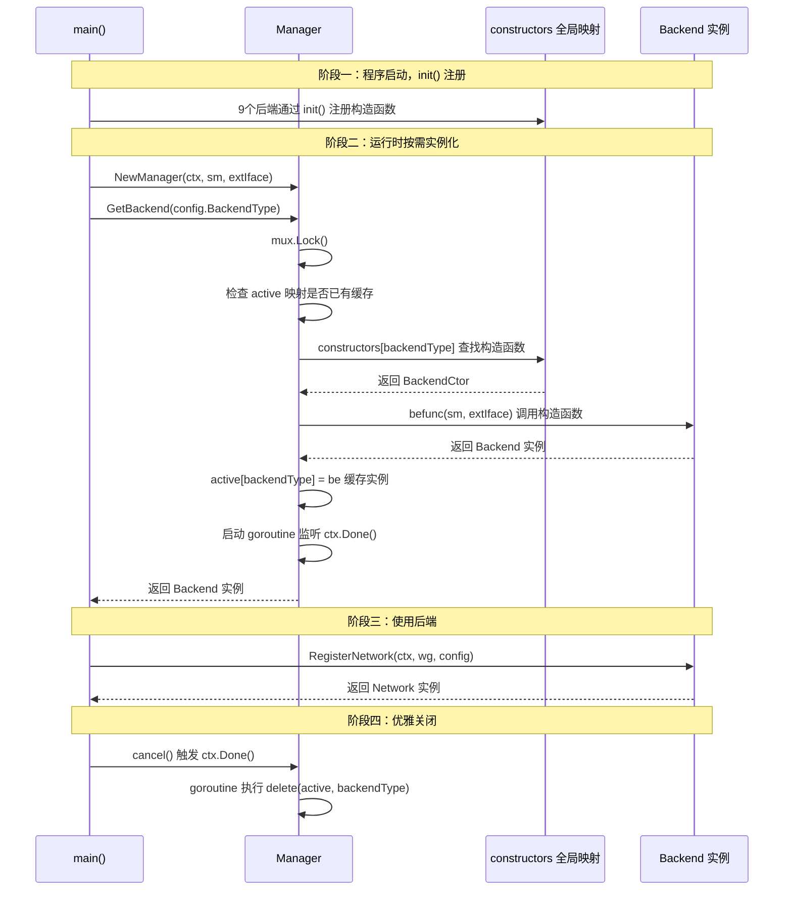
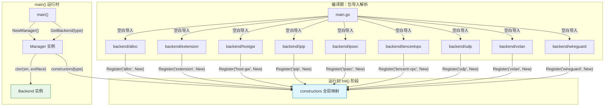

Flannel 的后端子系统采用了一种经典的 Go 语言插件注册模式——**通过 `init()` 函数在包初始化阶段将构造函数注册到全局映射表，再由 Manager 在运行时按需实例化**。这种设计将后端类型的声明与使用完全解耦：新增一个后端只需编写独立的包并在 `main.go` 中添加一行空白导入，无需修改任何既有代码的分支逻辑。本文将深入剖析该模式的类型定义、注册流程、延迟实例化策略、平台条件编译支持以及并发安全保障。

Sources: [manager.go](pkg/backend/manager.go#L1-L94), [common.go](pkg/backend/common.go#L1-L51)

## 核心类型体系：三层抽象的契约设计

后端注册机制建立在三个核心类型的分层抽象之上。最底层是 `BackendCtor`——一个函数类型签名，定义了所有后端构造函数必须遵循的统一契约。中间层是 `Backend` 接口，每个构造函数返回的实例必须实现该接口，目前仅包含一个方法 `RegisterNetwork`。最顶层是 `Network` 接口，由 `RegisterNetwork` 返回，代表一个已就绪的网络平面。

```go
// 构造函数签名 —— 所有后端的统一工厂方法契约
type BackendCtor func(sm subnet.Manager, ei *ExternalInterface) (Backend, error)

// Backend 接口 —— 后端实例的行为契约
type Backend interface {
    RegisterNetwork(ctx context.Context, wg *sync.WaitGroup, config *subnet.Config) (Network, error)
}

// Network 接口 —— 运行时网络平面的行为契约
type Network interface {
    Lease() *lease.Lease
    MTU() int
    Run(ctx context.Context)
}
```

`ExternalInterface` 结构体是构造函数的第二个参数，它封装了宿主机的网络接口静态信息（接口对象、名称、IPv4/IPv6 地址、外部地址），这些信息在后端初始化时一次性注入，后续不再变化。这种**构造时注入、运行时只读**的设计避免了并发访问共享状态的复杂性。

Sources: [common.go](pkg/backend/common.go#L26-L51)

## 全局注册表与 Register 函数

整个注册机制的枢纽是一个包级全局变量 `constructors`，类型为 `map[string]BackendCtor`。`Register` 函数直接将名称-构造函数对写入该映射表：

```go
var constructors = make(map[string]BackendCtor)

func Register(name string, ctor BackendCtor) {
    constructors[name] = ctor
}
```

这四行代码体现了极简主义的设计哲学：没有互斥锁保护（因为所有 `Register` 调用都发生在 `init()` 阶段，属于 Go 运行时的顺序初始化，天然串行），没有重复注册检测（后注册的同名后端会静默覆盖前者），没有返回值。**`init()` 阶段的顺序性保证**是整个模式安全性的基石——Go 规范保证同一包内的多个 `init()` 按声明顺序执行，跨包的 `init()` 按导入依赖的拓扑排序执行，因此所有注册操作在 `main()` 函数执行前必然已完成。

Sources: [manager.go](pkg/backend/manager.go#L26-L93)

## init() 注册：各后端的自我声明

每个后端包通过各自的 `init()` 函数调用 `backend.Register()`，将自身注册到全局映射表中。以下是所有已注册后端的完整对照：

| 后端名称 | 注册字符串 | 注册位置 | 构造函数特征 |
|:---|:---|:---|:---|
| **VXLAN** | `"vxlan"` | `vxlan/vxlan.go` | 标准 `New()` 工厂方法 |
| **host-gw** | `"host-gw"` | `hostgw/hostgw.go` | 构造时校验 NAT 环境不兼容 |
| **WireGuard** | `"wireguard"` | `wireguard/wireguard.go` | 标准 `New()` 工厂方法 |
| **UDP** | `"udp"` | `udp/udp.go` / `udp/udp_amd64.go` | 架构条件编译，非 amd64 返回错误 |
| **alloc** | `"alloc"` | `alloc/alloc.go` | 纯分配器，不创建实际网络设备 |
| **IPIP** | `"ipip"` | `ipip/ipip.go` | 使用常量 `backendType` 注册 |
| **IPsec** | `"ipsec"` | `ipsec/ipsec.go` | 标准 `New()` 工厂方法 |
| **Extension** | `"extension"` | `extension/extension.go` | 标准 `New()` 工厂方法 |
| **Tencent VPC** | `"tencent-vpc"` | `tencentvpc/tencentvpc.go` | 腾讯云专用后端 |

每个 `init()` 函数的模式完全一致，以 VXLAN 为例：

```go
func init() {
    backend.Register("vxlan", New)
}

func New(sm subnet.Manager, extIface *backend.ExternalInterface) (backend.Backend, error) {
    backend := &VXLANBackend{
        subnetMgr: sm,
        extIface:  extIface,
    }
    // ... 初始化逻辑
    return backend, nil
}
```

**这种统一的注册模式使得后端的开发者手册极为简洁**：创建一个新包，实现 `Backend` 接口，在 `init()` 中调用 `Register`，然后在 `main.go` 添加空白导入——四步即可接入 Flannel 的后端框架。

Sources: [vxlan.go](pkg/backend/vxlan/vxlan.go#L70-L85), [hostgw.go](pkg/backend/hostgw/hostgw.go#L32-L48), [wireguard.go](pkg/backend/wireguard/wireguard.go#L42-L58), [udp.go](pkg/backend/udp/udp.go#L26-L32), [alloc.go](pkg/backend/alloc/alloc.go#L28-L43), [ipip.go](pkg/backend/ipip/ipip.go#L40-L55), [ipsec.go](pkg/backend/ipsec/ipsec.go#L54-L71), [extension.go](pkg/backend/extension/extension.go#L34-L52), [tencentvpc.go](pkg/backend/tencentvpc/tencentvpc.go#L38-L53)

## 空白导入：触发 init() 链的入口

`main.go` 通过 Go 语言的**空白导入**（blank import）机制触发所有后端包的 `init()` 函数执行。空白导入 `_ "pkg/path"` 的唯一效果是使编译器将该包及其依赖链纳入编译，从而执行其 `init()` 函数——包的导出符号不会被使用：

```go
// Backends need to be imported for their init() to get executed and them to register
_ "github.com/flannel-io/flannel/pkg/backend/alloc"
_ "github.com/flannel-io/flannel/pkg/backend/extension"
_ "github.com/flannel-io/flannel/pkg/backend/hostgw"
_ "github.com/flannel-io/flannel/pkg/backend/ipip"
_ "github.com/flannel-io/flannel/pkg/backend/ipsec"
_ "github.com/flannel-io/flannel/pkg/backend/tencentvpc"
_ "github.com/flannel-io/flannel/pkg/backend/udp"
_ "github.com/flannel-io/flannel/pkg/backend/vxlan"
_ "github.com/flannel-io/flannel/pkg/backend/wireguard"
```

注释 `"Backends need to be imported for their init() to get executed and them to register"` 明确声明了这些导入的意图。这是 Go 生态中 `database/sql` 驱动注册、`image` 格式注册等场景下广泛使用的惯用模式，开发者对此有高度的认知共识。

Sources: [main.go](main.go#L47-L58)

## 延迟实例化与生命周期管理

后端的实例化并非在 `init()` 阶段发生，而是由 `Manager` 在运行时**按需延迟创建**。`Manager` 的 `GetBackend` 方法实现了完整的生命周期管理：



`GetBackend` 的实现包含三个关键设计决策。**第一，大小写不敏感查找**：通过 `strings.ToLower(backendType)` 标准化键名，使用户配置 `"VXLAN"` 或 `"vxlan"` 均可匹配。**第二，实例缓存与单例语义**：`active` 映射确保同一后端类型只被创建一次，后续调用直接返回已缓存的实例。**第三，上下文驱动的自动清理**：创建后端时启动一个 goroutine 监听 `ctx.Done()`，当全局上下文被取消时自动从 `active` 映射中删除该后端实例。

Sources: [manager.go](pkg/backend/manager.go#L50-L89), [main.go](main.go#L370-L385)

## 并发安全：互斥锁保护的实例化路径

`Manager` 使用 `sync.Mutex` 保护 `GetBackend` 的整个执行路径——从检查 `active` 缓存到写入新创建的实例。这保证了在高并发场景下（虽然 Flannel 实际上不会并发调用 `GetBackend`），不会出现同一后端类型被重复创建的情况：

```go
func (bm *manager) GetBackend(backendType string) (Backend, error) {
    bm.mux.Lock()
    defer bm.mux.Unlock()
    // ... 检查缓存 → 查找构造函数 → 创建实例 → 缓存实例
}
```

值得注意的是，代码中存在一条 TODO 注释：`// TODO(eyakubovich): this obviosly introduces a race. GetBackend() could get called while we are here.` 这指的是清理 goroutine 在 `ctx.Done()` 后执行 `delete(bm.active, betype)` 时，理论上可能与新的 `GetBackend` 调用产生竞争。但在当前架构下，`GetBackend` 仅在启动时被调用一次，且所有后端的 `Run` 方法只在关闭时退出，因此该竞态在实际运行中不会触发。

Sources: [manager.go](pkg/backend/manager.go#L50-L89)

## 平台条件编译：以 UDP 后端为例

UDP 后端的注册展示了一个高级变体——**通过 Go 的构建标签（build tags）在不同平台注册不同的构造函数**。在通用文件 `udp.go` 中，`New` 函数直接返回错误：

```go
// udp.go - 无构建标签，所有平台均编译
func init() {
    backend.Register("udp", New)
}

func New(sm subnet.Manager, extIface *backend.ExternalInterface) (backend.Backend, error) {
    return nil, fmt.Errorf("UDP backend is not supported on this architecture")
}
```

而在 Linux amd64 专属文件 `udp_amd64.go`（带有 `//go:build !windows` 标签）中，存在另一个 `init()` 注册同一个 `"udp"` 名称，覆盖通用版本的注册：

```go
// udp_amd64.go - 构建标签: !windows
func init() {
    backend.Register("udp", New) // 此 New 是本文件中定义的真实实现
}

func New(sm subnet.Manager, extIface *backend.ExternalInterface) (backend.Backend, error) {
    be := UdpBackend{sm: sm, extIface: extIface}
    return &be, nil // 返回真实的后端实例
}
```

这种**同名覆盖注册**模式利用了 Go 编译时构建标签的互斥选择机制：在非 Windows 平台上，`udp_amd64.go` 被编译，其 `init()` 后执行，覆盖 `udp.go` 中的注册；在 Windows 上，只有 `udp.go` 被编译，`New` 返回错误信息。这使得平台兼容性检查下沉到注册阶段而非运行时。

Sources: [udp.go](pkg/backend/udp/udp.go#L26-L32), [udp_amd64.go](pkg/backend/udp/udp_amd64.go#L31-L50), [udp_windows.go](pkg/backend/udp/udp_windows.go#L1-L16)

## 完整注册时序：从编译到运行



整个生命周期可以概括为三个阶段。**编译期**：`main.go` 的空白导入将所有后端包拉入编译图。**初始化期**：Go 运行时按拓扑序执行所有 `init()` 函数，每个后端将自身的构造函数注册到全局 `constructors` 映射。**运行期**：`main()` 创建 `Manager`，通过 `GetBackend` 从映射中查找构造函数并实例化，再将得到的 `Backend` 通过 `RegisterNetwork` 转化为可运行的 `Network`。

Sources: [main.go](main.go#L47-L58), [manager.go](pkg/backend/manager.go#L41-L89)

## 设计权衡分析

| 维度 | 优势 | 潜在风险 |
|:---|:---|:---|
| **可扩展性** | 新后端零侵入接入，仅需空白导入 | 所有后端被静态编译进二进制，无法动态加载 |
| **编译时安全** | 构造函数签名在注册时被类型检查 | 注册名称字符串无编译时校验，拼写错误仅在运行时暴露 |
| **初始化顺序** | Go 规范保证 `init()` 在 `main()` 前完成 | 跨包 `init()` 顺序依赖导入拓扑，隐式耦合不易追踪 |
| **并发模型** | 互斥锁保护实例化路径 | 清理 goroutine 与 `GetBackend` 间存在理论竞态（已标注 TODO） |
| **平台适配** | 构建标签实现优雅的平台分支 | 同名覆盖注册依赖隐式的文件编译顺序，增加理解成本 |

**这一模式的核心价值在于将「后端是什么」与「后端怎么用」彻底分离。** 全局映射表 `constructors` 充当了两者之间的间接层，使得 `Manager` 完全不感知具体后端类型的存在，仅通过字符串键进行路由。这是经典的**服务定位器模式**（Service Locator Pattern）在 Go 语言中的极简实现。

Sources: [manager.go](pkg/backend/manager.go#L26-L93), [common.go](pkg/backend/common.go#L39-L50)

## 与整体架构的衔接

后端注册机制是 Flannel 启动流水线中的关键一环。了解本机制后，建议按以下路径继续深入：

- [整体架构：从 main.go 到各子系统的启动流程](5-zheng-ti-jia-gou-cong-main-go-dao-ge-zi-xi-tong-de-qi-dong-liu-cheng) — 理解后端注册在整个启动链中的位置
- [VXLAN 后端：内核态封装与直连路由](6-vxlan-hou-duan-nei-he-tai-feng-zhuang-yu-zhi-lian-lu-you) — 深入分析注册后 `RegisterNetwork` 的具体实现
- [Extension 后端：自定义后端的原型开发机制](10-extension-hou-duan-zi-ding-yi-hou-duan-de-yuan-xing-kai-fa-ji-zhi) — 基于本注册模式实现自定义后端的实践指南