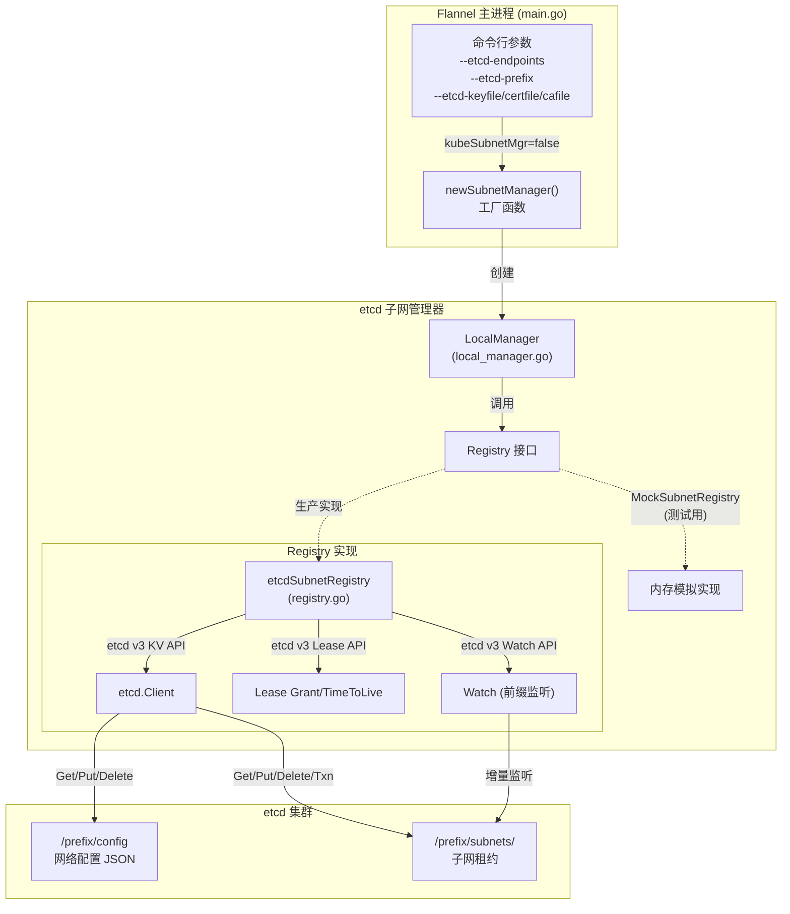
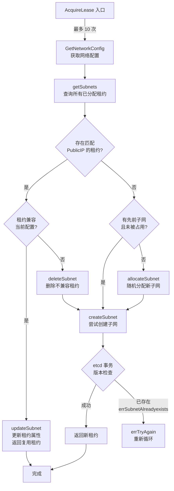

在 Flannel 的双引擎子网管理架构中，etcd 子网管理器代表了**独立于 Kubernetes 的部署范式**。当 `--kube-subnet-mgr` 标志未被设置（默认为 `false`）时，Flannel 通过 etcd v3 API 完成子网配置的存储、租约的获取与续约、以及集群范围内子网变更的实时监听。这一模式特别适用于非 Kubernetes 环境——例如裸机集群、CoreOS 容器平台或需要独立于容器编排系统进行网络管理的场景。整个 etcd 子网管理器由两层核心抽象构成：负责 etcd 协议交互的 **Registry 层**与承载业务逻辑的 **LocalManager 层**，二者协同构成了一个基于分布式一致性存储的、高可用的子网分配系统。

Sources: [main.go](main.go#L72-L101), [registry.go](pkg/subnet/etcd/registry.go#L15-L36)

## 架构总览：双层抽象与数据流

etcd 子网管理器的核心设计遵循**仓储模式**：`LocalManager` 作为业务编排者，通过 `Registry` 接口与 etcd 交互，从而将存储细节与子网管理逻辑彻底解耦。这一设计使得单元测试无需真实的 etcd 集群——`MockSubnetRegistry` 直接实现了同一接口，验证子网分配的竞争条件与重试逻辑。



上图的**关键设计决策**在于 `Registry` 接口只暴露七个方法——从 `getNetworkConfig` 到 `watchSubnets`——每一个都精确映射到一个 etcd 操作。这种最小化的接口边界不仅降低了实现复杂度，更使得 `MockSubnetRegistry` 可以用内存中的 `sync.Mutex` + slice 来模拟 etcd 的事务语义，从而让 `TestAcquireLease` 等测试在没有真实 etcd 的情况下验证并发分配的正确性。

Sources: [registry.go](pkg/subnet/etcd/registry.go#L45-L55), [local_manager.go](pkg/subnet/etcd/local_manager.go#L43-L48), [mock_subnet.go](pkg/subnet/etcd/mock_subnet.go#L22-L28)

## etcd 数据模型：键空间布局与子网编码

etcd 模式下的 Flannel 在 etcd 中维护两层键空间，所有键都位于用户通过 `--etcd-prefix` 指定的前缀之下（默认为 `/coreos.com/network`）：

| 键路径 | 内容 | 说明 |
|--------|------|------|
| `<prefix>/config` | 网络配置 JSON | 全局唯一的网络定义，包含 `Network`、`SubnetLen`、`Backend` 等 |
| `<prefix>/subnets/<IPv4>-<prefix>` | 租约属性 JSON | 单个节点的子网租约，绑定到 etcd Lease 实现自动过期 |
| `<prefix>/subnets/<IPv4>-<prefix>&<IPv6>-<prefix>` | 租约属性 JSON（双栈） | 双栈模式下的复合键，通过 `&` 连接 IPv4 和 IPv6 子网 |

子网键的编码方式由 `MakeSubnetKey` 函数定义。以 IPv4 地址 `10.1.5.0/24` 为例，键名为 `10.1.5.0-24`；在双栈模式下，若同时包含 `2001:cafe:42::1/64` 的 IPv6 子网，键名变为 `10.1.5.0-24&2001-cafe-42--1-64`。这种编码方式确保了键名中不含 `/` 字符（CIDR 的 `/` 被 `-` 替代），从而不会与 etcd 键路径分隔符冲突。

Sources: [subnet.go](pkg/subnet/subnet.go#L33-L69), [registry.go](pkg/subnet/etcd/registry.go#L154-L166)

## 启动与初始化：从命令行到 etcd 连接

当 `--kube-subnet-mgr` 未设置时，`main.go` 中的 `newSubnetManager` 函数成为 etcd 管理器的入口。初始化流程分为三步：**配置组装**、**先前子网恢复**、**Registry 构建**。

首先，命令行参数被组装为 `EtcdConfig` 结构体，包含 etcd 集群端点列表、TLS 证书路径、认证凭据和键前缀：

```go
cfg := &etcd.EtcdConfig{
    Endpoints: strings.Split(opts.etcdEndpoints, ","),
    Keyfile:   opts.etcdKeyfile,
    Certfile:  opts.etcdCertfile,
    CAFile:    opts.etcdCAFile,
    Prefix:    opts.etcdPrefix,
    Username:  opts.etcdUsername,
    Password:  opts.etcdPassword,
}
```

随后，启动函数从本地子网文件（默认 `/run/flannel/subnet.env`）中读取上一次分配的 IPv4 和 IPv6 子网——这是**跨重启租约恢复机制**的关键数据来源。最后，`NewLocalManager` 创建 Registry 并将三者组装为 `LocalManager` 实例。

Sources: [main.go](main.go#L187-L212), [registry.go](pkg/subnet/etcd/registry.go#L57-L65), [local_manager.go](pkg/subnet/etcd/local_manager.go#L65-L80)

### TLS 连接与安全模型

`newEtcdClient` 函数实现了完整的 TLS 安全链路。当 `Keyfile` 和 `Certfile` 均未提供时，系统会输出警告并以明文 HTTP 连接 etcd——这在开发环境中可接受，但在生产环境中应始终启用 TLS。连接生命周期通过 context 管理：一个后台 goroutine 在 context 取消时自动关闭 etcd 客户端，避免连接泄漏。

TLS 配置的最低版本要求为 TLS 1.2（`tls.VersionTLS12`），证书通过 etcd 官方库 `tlsutil.NewCert` 加载，CA 证书通过 `tlsutil.NewCertPool` 构建信任链。

Sources: [registry.go](pkg/subnet/etcd/registry.go#L78-L132)

## 子网分配算法：竞争检测与随机选择

`AcquireLease` 是 etcd 管理器最复杂的方法之一。它的设计必须处理一个**分布式系统的经典问题**：多个 Flannel 节点可能同时请求子网分配，而 etcd 本身不提供原子性的"检查并分配"操作。解决方案是一个最多 10 次重试的乐观并发循环（`raceRetries = 10`），每次迭代执行 `tryAcquireLease`：



`tryAcquireLease` 的三层优先级逻辑构成了 Flannel 子网分配的**核心策略**：

1. **PublicIP 匹配优先**：如果 etcd 中已存在一个与当前节点 PublicIP 相同的租约，并且该租约的子网仍然兼容当前网络配置，则直接复用。这确保了节点重启后尽可能获得相同的子网。

2. **先前子网恢复**：如果本地子网文件中记录了上一次分配的子网（`previousSubnet`），且该子网未被其他节点占用，则优先使用它。这是**跨重启稳定性**的第二道防线。

3. **随机分配**：在前两者均不适用时，`allocateSubnet` 函数扫描配置范围内的所有可用子网，收集最多 100 个空闲地址，然后从中随机选取一个。随机种子在包初始化时由 `time.Now().UnixNano()` 生成，确保各节点的选择分布均匀。

Sources: [local_manager.go](pkg/subnet/etcd/local_manager.go#L107-L274), [rand.go](pkg/subnet/etcd/rand.go#L22-L31)

### etcd 事务保障原子性

`createSubnet` 方法的原子性通过 etcd v3 的事务（Txn）API 实现。具体来说，它使用 `etcd.Compare(etcd.Version(key), "=", 0)` 作为事务条件——即只有当目标键**从未被创建过**（版本号为 0）时，才执行 `Put` 操作。如果条件不满足，说明另一个节点在当前节点的"查询-分配"窗口期内抢占了同一子网，此时已授予的 Lease 会被主动撤销（`Revoke`），并返回 `errSubnetAlreadyexists`，由上层循环重试。

```go
cond := etcd.Compare(etcd.Version(key), "=", 0)
tresp, err := esr.cli.Txn(ctx).If(cond).Then(req).Commit()
```

这种**乐观并发控制**模式在低竞争场景下效率极高——大多数情况下一次事务即可成功；即使发生冲突，10 次重试也足以在合理范围内保证分配成功。

Sources: [registry.go](pkg/subnet/etcd/registry.go#L220-L253)

## 租约生命周期：TTL 与自动续约

etcd 模式下的子网租约生命周期严格依赖 **etcd Lease** 机制。每个子网键都绑定一个 TTL 为 24 小时的 etcd Lease（`subnetTTL = 24 * time.Hour`），这意味着如果 Flannel 停止运行且未能在 24 小时内恢复，子网将被 etcd 自动回收——其他节点随后可以重新分配该子网。

`CompleteLease` 方法启动了两个并发的生命周期管理协程：

- **租约监听协程**：调用 `WatchLease` 监听自身子网在 etcd 中的变更事件。如果收到 `EventRemoved` 事件（租约被外部删除或过期），Flannel 将立即关闭，因为该节点的子网已不再有效。
- **定时续约协程**：计算距离到期时间减去续约余量（`subnetLeaseRenewMargin`，默认 60 分钟）后的时间间隔，在此时间到达后调用 `RenewLease`。如果续约失败，会以 1 分钟的间隔重试，直到成功或收到撤销事件。

续约操作的实现非常直接——它通过 `etcd.Lease.Grant` 创建一个新的 24 小时 Lease，然后用 `Put` 操作将子网键重新写入并绑定到新 Lease 上。

Sources: [local_manager.go](pkg/subnet/etcd/local_manager.go#L32-L35), [local_manager.go](pkg/subnet/etcd/local_manager.go#L276-L284), [local_manager.go](pkg/subnet/etcd/local_manager.go#L362-L407), [registry.go](pkg/subnet/etcd/registry.go#L255-L279)

## 子网监听机制：Watch API 与弹性恢复

`WatchLeases` 是 etcd 管理器实现**集群范围子网感知**的核心机制。它采用"快照 + 增量监听"的两阶段策略：

**阶段一——快照重置**：`leasesWatchReset` 调用 `getSubnets` 获取当前所有租约的完整快照，连同 etcd 的当前 revision 一起作为初始状态发送给监听者。这使得新加入的节点能够立即知晓整个集群的子网拓扑。

**阶段二——增量监听**：基于快照的 revision + 1，调用 etcd 的 `Watch` API 对 `<prefix>/subnets` 前缀进行长连接监听。每当有子网被创建、更新或删除时，etcd 推送相应的事件。

### 指数退避与历史窗口恢复

etcd 的 Watch API 有一个重要限制：etcd 不会无限期保留变更历史。当 etcd 执行压缩（compaction）操作后，旧于压缩点的 revision 将不可再被 Watch。`watchSubnets` 方法通过**指数退避重连机制**处理这种情况：

| 异常类型 | 处理策略 | 退避范围 |
|----------|----------|----------|
| Watch 通道错误/关闭 | 断开后重连，指数退避 | 100ms → 5s |
| `ErrGRPCCompacted`（历史被压缩） | 调用 `leasesWatchReset` 获取新快照 | 无退避 |
| 成功接收事件 | 重置退避计时器 | — |

当检测到 `ErrGRPCCompacted` 时，管理器不会简单重试 Watch，而是执行一次完整的快照重置，从当前状态重新构建子网拓扑。这确保了即使在 etcd 压缩后，Flannel 也不会丢失任何子网信息。

Sources: [registry.go](pkg/subnet/etcd/registry.go#L287-L370), [local_manager.go](pkg/subnet/etcd/local_manager.go#L339-L360)

## 命令行参数与配置参考

以下是 etcd 子网管理器相关的所有命令行参数，也可通过环境变量设置（前缀 `FLANNELD_`，如 `FLANNELD_ETCD_ENDPOINTS`）：

| 参数 | 默认值 | 说明 |
|------|--------|------|
| `--etcd-endpoints` | `http://127.0.0.1:4001,http://127.0.0.1:2379` | etcd 集群端点，逗号分隔 |
| `--etcd-prefix` | `/coreos.com/network` | etcd 键前缀，支持多网络隔离 |
| `--etcd-keyfile` | _(空)_ | TLS 客户端私钥文件路径 |
| `--etcd-certfile` | _(空)_ | TLS 客户端证书文件路径 |
| `--etcd-cafile` | _(空)_ | TLS CA 证书文件路径 |
| `--etcd-username` | _(空)_ | etcd BasicAuth 用户名 |
| `--etcd-password` | _(空)_ | etcd BasicAuth 密码 |
| `--subnet-lease-renew-margin` | `60` | 租约续约提前量（分钟），范围 1–1439 |
| `--kube-subnet-mgr` | `false` | **设为 `true` 将切换到 Kubernetes 管理器** |
| `--subnet-file` | `/run/flannel/subnet.env` | 本地子网文件路径 |

Sources: [main.go](main.go#L110-L124), [configuration.md](Documentation/configuration.md#L67-L89)

### etcd 网络配置 JSON 格式

etcd 模式下的网络配置通过 `etcdctl` 写入 `<prefix>/config` 键。`CheckNetworkConfig` 函数会在启动时执行严格的合法性校验：

```json
{
  "Network": "10.0.0.0/8",
  "SubnetLen": 20,
  "SubnetMin": "10.10.0.0",
  "SubnetMax": "10.99.0.0",
  "Backend": {
    "Type": "vxlan"
  }
}
```

关键校验规则包括：`SubnetLen` 必须在 `/30` 以内（需要至少为隧道和网桥各留一个地址）；`Network` 最小为 `/28`（确保至少四个子网）；当 `Network` 小于等于 `/22` 时 `SubnetLen` 自动设为 24；`SubnetMin` 默认跳过第一个子网（避免与网络地址冲突）。这些校验逻辑**仅在 etcd 模式下执行**——Kubernetes 管理器不调用 `CheckNetworkConfig`。

Sources: [config.go](pkg/subnet/config.go#L76-L198), [configuration.md](Documentation/configuration.md#L50-L65)

## 实践指南：etcd 部署的配置与操作

### 写入网络配置

使用 `etcdctl` 将网络配置写入 etcd：

```bash
export ETCDCTL_API=3
etcdctl put /coreos.com/network/config '{
  "Network": "10.5.0.0/16",
  "Backend": {"Type": "vxlan"}
}'
```

### 查看已分配子网

```bash
# 列出所有子网键
etcdctl get /coreos.com/network/subnets --prefix --keys-only

# 查看特定子网的完整信息
etcdctl get /coreos.com/network/subnets/10.5.52.0-24
# 输出: {"PublicIP":"192.168.64.3","PublicIPv6":null,"BackendType":"vxlan","BackendData":{...}}

# 查看子网租约的剩余 TTL
etcdctl lease list
etcdctl lease timetolive --keys <lease-id>
```

### 将租约转换为永久保留

通过移除 etcd Lease TTL 可以将一个租约从"临时"转为"永久保留"：

```bash
etcdctl put /coreos.com/network/subnets/10.5.1.0-24 "$(etcdctl get /coreos.com/network/subnets/10.5.1.0-24 | tail -1)"
```

保留的子网不会因节点故障而自动回收，适用于需要固定子网映射的场景。

Sources: [reservations.md](Documentation/reservations.md#L1-L52), [running.md](Documentation/running.md#L1-L48)

### 多网络部署

Flannel 支持在同一主机上运行多个守护进程实例，分别管理不同的网络。通过 `--subnet-file` 和 `--etcd-prefix` 实现命名空间隔离：

```bash
# VXLAN 网络
flanneld -subnet-file /vxlan.env -etcd-prefix=/vxlan/network

# host-gw 网络（另一个实例）
flanneld -subnet-file /hostgw.env -etcd-prefix=/hostgw/network
```

每个实例独立管理自己的子网租约和 etcd 键空间，互不干扰。端到端测试中的 `test_multi` 函数正是验证这一场景。

Sources: [running.md](Documentation/running.md#L13-L20), [functional-test.sh](dist/functional-test.sh#L170-L194)

## etcd 管理器 vs Kubernetes 管理器：架构对比

理解 etcd 管理器在整个 Flannel 子网管理架构中的定位，有助于在实际部署中做出正确选择：

| 维度 | etcd 子网管理器 | Kubernetes 子网管理器 |
|------|-----------------|----------------------|
| 配置存储 | etcd `<prefix>/config` 键 | ConfigMap `net-conf.json` |
| 子网存储 | etcd `<prefix>/subnets/` 前缀 | Node 注解 (`flannel.alpha.coreos.com`) |
| 分配方式 | 随机选择 + etcd 事务 | 控制器分配 `podCIDR` |
| 租约 TTL | 24 小时 etcd Lease | 跟随 Node 对象生命周期 |
| 网络配置校验 | `CheckNetworkConfig` 严格校验 | 无独立校验（依赖 kube-apiserver） |
| 部署依赖 | 独立 etcd 集群 | Kubernetes API Server |
| PublicIP 恢复 | 返回空字符串（不支持注解存储） | 从 Node 注解读取 |

一个关键的架构差异在于 `GetStoredMacAddresses` 和 `GetStoredPublicIP`：etcd 管理器对这两个方法始终返回空字符串，因为它没有额外的元数据存储机制；而 Kubernetes 管理器则从 Node 的注解中恢复这些值。

Sources: [local_manager.go](pkg/subnet/etcd/local_manager.go#L82-L88), [subnet.go](pkg/subnet/subnet.go#L106-L118)

## 测试体系：从 Mock 到集成

etcd 子网管理器拥有三层测试体系：

- **纯单元测试**（`subnet_test.go`）：使用 `MockSubnetRegistry` 和 `NewMockManager` 在无 etcd 依赖的环境下验证子网分配逻辑、配置变更恢复、以及先前子网重用策略。这是最高效的测试层。

- **Registry 集成测试**（`registry_test.go`）：使用 etcd 官方的 `integration` 测试框架启动单节点 etcd 集群，验证真实的 CRUD 操作和 Watch 事件传播。

- **端到端功能测试**（`dist/functional-test.sh`）：通过 Docker 容器启动完整的 etcd + 多节点 Flannel 环境，使用 `etcdctl` 写入配置并验证各后端（VXLAN、host-gw、IPIP、IPsec、WireGuard）的跨节点连通性。

Sources: [subnet_test.go](pkg/subnet/etcd/subnet_test.go#L88-L139), [registry_test.go](pkg/subnet/etcd/registry_test.go#L100-L200), [functional-test.sh](dist/functional-test.sh#L24-L80)

---

### 延伸阅读

- 了解 Kubernetes 模式下的子网管理：[Kubernetes 子网管理器：基于 API 的声明式管理](13-kubernetes-zi-wang-guan-li-qi-ji-yu-api-de-sheng-ming-shi-guan-li)
- 深入租约的获取、续约与事件监听细节：[子网租约生命周期：获取、续约与事件监听](14-zi-wang-zu-yue-sheng-ming-zhou-qi-huo-qu-xu-yue-yu-shi-jian-jian-ting)
- 掌握完整的网络配置参数：[网络配置详解：JSON 配置、命令行参数与环境变量](17-wang-luo-pei-zhi-xiang-jie-json-pei-zhi-ming-ling-xing-can-shu-yu-huan-jing-bian-liang)
- etcd 模式下的故障处理：[故障排查指南：日志、连通性与性能诊断](25-gu-zhang-pai-cha-zhi-nan-ri-zhi-lian-tong-xing-yu-xing-neng-zhen-duan)