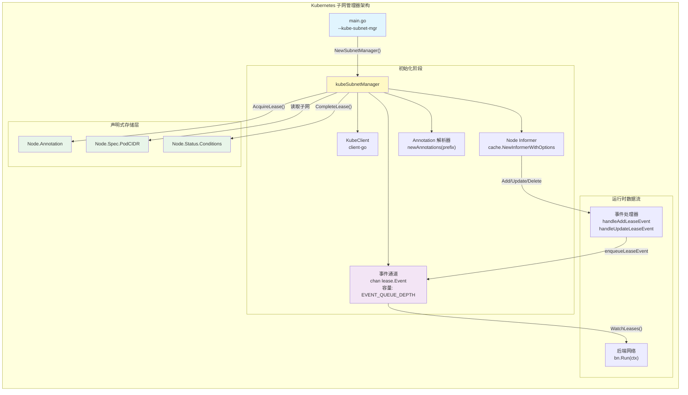
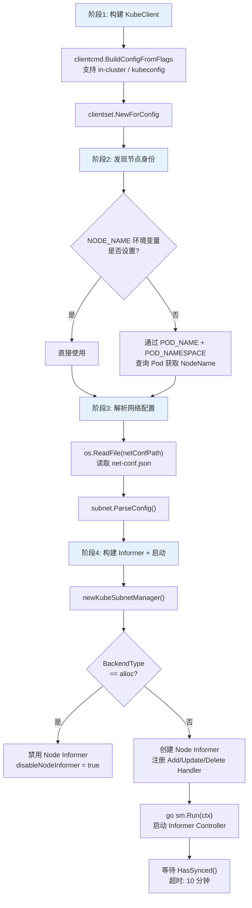
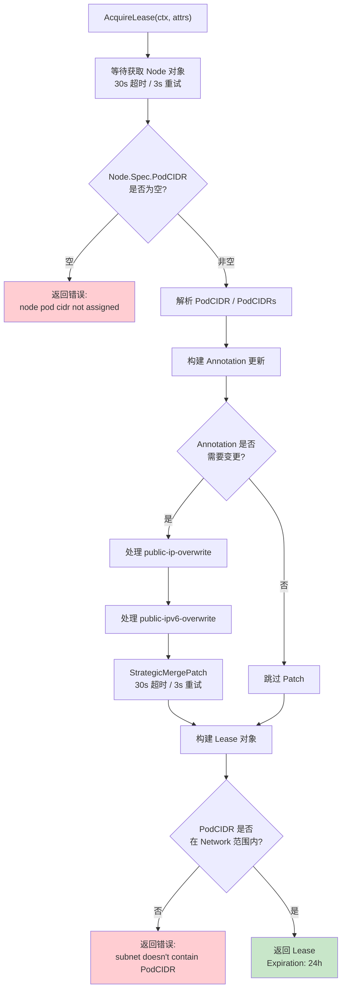

Flannel 的 Kubernetes 子网管理器（`kubeSubnetManager`）将子网管理的核心职责从外部键值存储（etcd）迁移到 Kubernetes 自身的声明式 API 之上。它通过 **Node Informer 监听集群节点变化**、**Node Annotation 存储租约数据**、**PodCIDR 作为子网分配来源**，构建了一套与 Kubernetes 深度集成的子网管理方案——无需额外部署 etcd 集群，无需自维护子网池，Kubernetes 控制平面本身就是"真相的来源"。

## 整体架构：从 etcd 独立模式到 Kubernetes 原生模式

在深入实现细节之前，理解两种子网管理器的根本差异至关重要。etcd 模式通过自维护的子网池动态分配地址，而 Kubernetes 模式完全依赖集群控制平面的 `Node.Spec.PodCIDR` 字段——子网由 kube-controller-manager 统一分配，Flannel 只是**读取并使用**。



Sources: [kube.go](pkg/subnet/kube/kube.go#L63-L79), [main.go](main.go#L187-L194)

## Manager 接口：两种后端的统一抽象

`subnet.Manager` 接口定义了子网管理器必须实现的所有方法。Kubernetes 模式和 etcd 模式共享这一接口，但实现策略存在本质差异：

| 方法 | Kubernetes 模式实现 | etcd 模式实现 |
|------|---------------------|---------------|
| `GetNetworkConfig()` | 直接返回本地解析的 Config | 从 etcd 键读取 |
| `AcquireLease()` | 从 Node.PodCIDR 读取，写入 Annotation | 从子网池动态分配 |
| `RenewLease()` | **未实现**（返回 `ErrUnimplemented`） | 通过 etcd TTL 续约 |
| `WatchLeases()` | 转发 Informer 事件 | 监听 etcd Watch |
| `WatchLease()` | **未实现** | 监听单个子网键 |
| `CompleteLease()` | 设置 NodeNetworkUnavailable=False | 无特殊操作 |
| `HandleSubnetFile()` | 写入文件 + 缓存路径信息 | 写入文件 |
| `GetStoredPublicIP()` | 从 Node Annotation 读取 | N/A |
| `GetStoredMacAddresses()` | 从 Node Annotation 解析 MAC | N/A |

Kubernetes 模式中 `RenewLease` 和 `WatchLease` 返回 `ErrUnimplemented`，这并非设计疏漏——在 Kubernetes 模式下，**子网的生命周期与 Node 对象绑定**，不存在传统意义上的"租约过期"。只要 Node 存在且 PodCIDR 有效，子网就有效。

Sources: [subnet.go](pkg/subnet/subnet.go#L106-L118), [kube.go](pkg/subnet/kube/kube.go#L618-L625)

## 初始化流程：从命令行参数到就绪状态

`NewSubnetManager` 是 Kubernetes 子网管理器的工厂函数，其初始化流程可拆解为四个关键阶段：



节点身份发现机制有两套回退路径：优先使用 `NODE_NAME` 环境变量（适用于 DaemonSet 中通过 Downward API 注入），如果未设置则通过 `POD_NAME` 和 `POD_NAMESPACE` 查询 Pod 对象获取其所在节点名称。在 `kube-flannel.yml` 的 DaemonSet 配置中，这两个环境变量通过 `fieldRef` 从 Pod 元数据注入。

Sources: [kube.go](pkg/subnet/kube/kube.go#L81-L167), [kube-flannel.yml](Documentation/kube-flannel.yml#L176-L185)

## Node Informer：事件驱动的变更感知

Node Informer 是 Kubernetes 子网管理器的核心感知组件。它通过 client-go 的 `cache.NewInformerWithOptions` 构建，监听所有 Node 对象的增删改事件，并以 5 分钟的 `resyncPeriod` 进行周期性全量同步。

### 事件处理链路

Informer 注册了三类事件处理函数，每类处理函数遵循相同的核心逻辑——**仅处理被 Flannel 管理的节点**（通过 `kube-subnet-manager: "true"` Annotation 过滤）：

| 事件类型 | 处理函数 | 触发条件 |
|----------|----------|----------|
| Add | `handleAddLeaseEvent` | 新节点加入集群且已被 Flannel 管理 |
| Update | `handleUpdateLeaseEvent` | BackendData / BackendType / PublicIP 发生变化 |
| Delete | `handleAddLeaseEvent`（EventRemoved） | 节点被删除，包括 `DeletedFinalStateUnknown` 场景 |

`handleUpdateLeaseEvent` 内含一层**变更检测优化**：只有当 BackendData、BackendType 或 PublicIP（含 IPv6 对应字段）真正变化时，才将事件推入 events 通道。这避免了 Informer resync 导致的无意义事件风暴。

Sources: [kube.go](pkg/subnet/kube/kube.go#L202-L244), [kube.go](pkg/subnet/kube/kube.go#L296-L341)

### 背压控制：Semaphore + 指数退避

当事件通道（默认容量 5000）缓冲区满时，`enqueueLeaseEvent` 不会丢弃事件，而是启动异步重试：

1. 首先尝试非阻塞写入 `ksm.events`
2. 若缓冲区满，通过 `semaphore.Weighted`（权重 100）限流获取信号量
3. 启动 goroutine，以指数退避策略（100ms 起步，5s 上限）持续重试写入

这一设计确保了在大型集群中，即使事件产生速率短暂超过消费速率，事件也不会丢失，同时通过信号量限制了并发重试 goroutine 的数量。

Sources: [kube.go](pkg/subnet/kube/kube.go#L250-L294)

### alloc 后端：Informer 禁用模式

当 BackendType 为 `"alloc"` 时，`disableNodeInformer` 被设为 `true`，整个 Node Informer 不会创建也不会启动。这是因为 alloc 后端设计为与云控制器管理器（cloud-controller-manager）协作，路由由外部组件负责，Flannel 无需监听其他节点的变化。

Sources: [kube.go](pkg/subnet/kube/kube.go#L197-L200)

## Annotation 体系：声明式状态存储

Kubernetes 子网管理器将所有租约元数据存储在 Node 对象的 Annotation 中，前缀默认为 `flannel.alpha.coreos.com`（可通过 `--kube-annotation-prefix` 自定义）。这种设计使得 Flannel 的状态成为 Node 对象的一部分，天然具备集群级的持久化和一致性保证。

### Annotation 字段映射

| Annotation 键 | 用途 | 数据格式 |
|---------------|------|----------|
| `{prefix}/kube-subnet-manager` | 标识节点是否被 Flannel 管理 | `"true"` |
| `{prefix}/backend-type` | 后端类型名称 | `"vxlan"` / `"host-gw"` / `"wireguard"` 等 |
| `{prefix}/backend-data` | IPv4 后端数据 | JSON（如 `{"VNI":1,"VtepMAC":"12:c6:65:89:b4:e3"}`） |
| `{prefix}/backend-v6-data` | IPv6 后端数据 | JSON |
| `{prefix}/public-ip` | 节点 IPv4 公网地址 | `"10.0.0.1"` |
| `{prefix}/public-ipv6` | 节点 IPv6 公网地址 | `"fd00::1"` |
| `{prefix}/node-public-ip` | 节点公网 IP（供重启恢复） | `"1.2.3.4"` |
| `{prefix}/node-public-ipv6` | 节点 IPv6 公网 IP（供重启恢复） | `"fd00::1"` |
| `{prefix}/public-ip-overwrite` | 强制覆盖公网 IPv4 | IP 字符串 |
| `{prefix}/public-ipv6-overwrite` | 强制覆盖公网 IPv6 | IP 字符串 |

### 前缀验证规则

`newAnnotations` 函数对前缀有严格的格式验证：

- **必须以 FQDN 开头**：如 `flannel.alpha.coreos.com`，纯主机名 `org` 会被拒绝
- **至多包含一个斜杠**：`org.com/prefix` 合法，`org.com/a/b` 不合法
- **仅允许小写字母、数字、下划线、连字符和点**：`org.COM` 或 `PREFIX` 会被拒绝
- **尾部自动补全**：若无尾部连接符，自动添加 `-` 或 `/`

Sources: [annotations.go](pkg/subnet/kube/annotations.go#L23-L76), [annotations_test.go](pkg/subnet/kube/annotations_test.go#L19-L96)

## AcquireLease：子网获取的核心流程

`AcquireLease` 是 Kubernetes 子网管理器中逻辑最复杂的方法。它完成两件事：**将后端属性写入 Node Annotation**（声明式注册），以及**从 Node.PodCIDR 构建租约对象**（读取子网分配结果）。



### PodCIDR 解析策略

方法支持三种 PodCIDR 配置场景：

| 场景 | 条件 | 行为 |
|------|------|------|
| 单栈 IPv4 | `len(PodCIDRs) == 0` | 从 `Spec.PodCIDR` 解析 IPv4 |
| 双栈 | `len(PodCIDRs) < 3` | 遍历 `Spec.PodCIDRs`，按 IP 长度分类为 IPv4/IPv6 |
| 非法 | `len(PodCIDRs) >= 3` | 返回错误 |

### Public IP 覆盖机制

`public-ip-overwrite` 和 `public-ipv6-overwrite` 注解提供了运维级别的 IP 强制覆盖能力。当这些注解存在时，`AcquireLease` 会忽略后端自动检测的 PublicIP，直接使用覆盖值写入 `public-ip` 注解。这在节点的默认出口 IP 不适合隧道通信（如多网卡环境）时尤为有用。

Sources: [kube.go](pkg/subnet/kube/kube.go#L350-L518)

## nodeToLease：Node 对象到 Lease 的转换

`nodeToLease` 是 Informer 事件处理链路中的关键桥梁函数，将 Kubernetes Node 对象转换为 Flannel 内部的 `lease.Lease` 结构。它独立于 `AcquireLease` 的写入路径，专门服务于读取路径：

```go
// 简化的转换逻辑
l.Attrs.PublicIP     ← Annotation["public-ip"]
l.Attrs.BackendData  ← Annotation["backend-data"]
l.Subnet             ← Node.Spec.PodCIDR（IPv4 部分）
l.Attrs.PublicIPv6   ← Annotation["public-ipv6"]
l.Attrs.BackendV6Data← Annotation["backend-v6-data"]
l.IPv6Subnet         ← Node.Spec.PodCIDRs（IPv6 部分）
l.Attrs.BackendType  ← Annotation["backend-type"]
```

该函数分别处理 IPv4 和 IPv6 两个维度，且通过 `enableIPv4` / `enableIPv6` 标志位控制哪些维度需要填充。PodCIDR 的解析策略与 `AcquireLease` 一致。

Sources: [kube.go](pkg/subnet/kube/kube.go#L542-L616)

## CompleteLease：网络就绪信号

`CompleteLease` 在后端网络启动完成后调用，执行两项收尾工作：

1. **启动 ClusterCIDR Controller**（若已创建）：监听 Kubernetes `ClusterCIDR` 资源，支持动态更新子网文件
2. **设置 NodeNetworkUnavailable 条件**：通过 `PatchStatus` 将 `NodeNetworkUnavailable` 条件设为 `False`，原因为 `FlannelIsUp`，向集群声明该节点的网络已就绪

`NodeNetworkUnavailable` 条件的设置可通过 `--set-node-network-unavailable=false` 禁用。

Sources: [kube.go](pkg/subnet/kube/kube.go#L633-L669)

## 状态恢复：重启场景下的数据读取

Flannel Pod 重启时，需要从 Node Annotation 中恢复之前的网络配置状态，以避免重新生成 VNI 和 MAC 地址导致网络中断。两个恢复方法提供了这一能力：

### GetStoredMacAddresses

从 `backend-data` 和 `backend-v6-data` 注解中解析 MAC 地址。解析逻辑基于简单的字符串分割——假设 JSON 格式为 `{"VNI":1,"VtepMAC":"12:c6:65:89:b4:e3"}`，提取冒号后面的 MAC 地址字符串。

### GetStoredPublicIP

从 `node-public-ip` 和 `node-public-ipv6` 注解直接读取节点公网 IP 地址，用于覆盖命令行参数中的 `--public-ip` / `--public-ipv6`。

Sources: [kube.go](pkg/subnet/kube/kube.go#L692-L744)

## Kubernetes vs etcd 模式对比

| 维度 | Kubernetes 模式 | etcd 模式 |
|------|-----------------|-----------|
| **外部依赖** | 无（Kubernetes API 即存储） | 需独立部署 etcd 集群 |
| **子网分配** | 由 kube-controller-manager 通过 Node.PodCIDR 分配 | 自维护子网池，动态分配 |
| **状态存储** | Node Annotation | etcd 键值对 |
| **事件监听** | Node Informer（client-go cache） | etcd Watch |
| **租约续约** | 不需要（Node 存在即有效） | 基于 TTL 定期续约 |
| **网络开销** | 与 Kubernetes API Server 通信 | 与 etcd 集群通信 |
| **运维复杂度** | 低（DaemonSet 一键部署） | 中（需维护 etcd 集群健康） |
| **适用场景** | 标准 Kubernetes 集群 | 非 Kubernetes 环境或需要更精细控制 |

Sources: [subnet.go](pkg/subnet/subnet.go#L106-L118), [kube.go](pkg/subnet/kube/kube.go#L63-L79)

## RBAC 权限要求

Kubernetes 子网管理器依赖以下 RBAC 权限，这些权限在 `kube-flannel.yml` 的 ClusterRole 中声明：

| 资源 | 操作 | 用途 |
|------|------|------|
| `pods` | `get` | 通过 Pod 名称发现所在 Node |
| `nodes` | `get`, `list`, `watch` | 读取 PodCIDR、监听节点变化 |
| `nodes/status` | `patch` | 设置 NodeNetworkUnavailable 条件 |

Sources: [kube-flannel.yml](Documentation/kube-flannel.yml#L14-L36)

## 关键环境变量

| 环境变量 | 默认值 | 用途 |
|----------|--------|------|
| `NODE_NAME` | 无 | 直接指定节点名称，跳过 Pod 查询 |
| `POD_NAME` | 无 | 通过 Pod 对象发现节点名称 |
| `POD_NAMESPACE` | 无 | Pod 所在命名空间 |
| `EVENT_QUEUE_DEPTH` | `5000` | 事件通道缓冲区大小 |
| `CONT_WHEN_CACHE_NOT_READY` | `false` | Informer 同步超时后是否继续启动 |

Sources: [kube.go](pkg/subnet/kube/kube.go#L100-L116), [kube.go](pkg/subnet/kube/kube.go#L184-L195), [main.go](main.go#L243-L244)

## 下一步阅读

理解 Kubernetes 子网管理器的声明式模型后，建议继续探索租约事件的完整生命周期：

- [子网租约生命周期：获取、续约与事件监听](14-zi-wang-zu-yue-sheng-ming-zhou-qi-huo-qu-xu-yue-yu-shi-jian-jian-ting) —— 了解 `WatchLeases` 如何将 Informer 事件传递给后端网络，以及 `LeaseWatcher` 的差异计算逻辑
- [后端注册机制：init() 与构造函数映射模式](11-hou-duan-zhu-ce-ji-zhi-init-yu-gou-zao-han-shu-ying-she-mo-shi) —— 理解 `AcquireLease` 返回的 Lease 如何被后端网络消费
- [网络配置详解：JSON 配置、命令行参数与环境变量](17-wang-luo-pei-zhi-xiang-jie-json-pei-zhi-ming-ling-xing-can-shu-yu-huan-jing-bian-liang) —— 深入了解 `net-conf.json` 的完整配置项