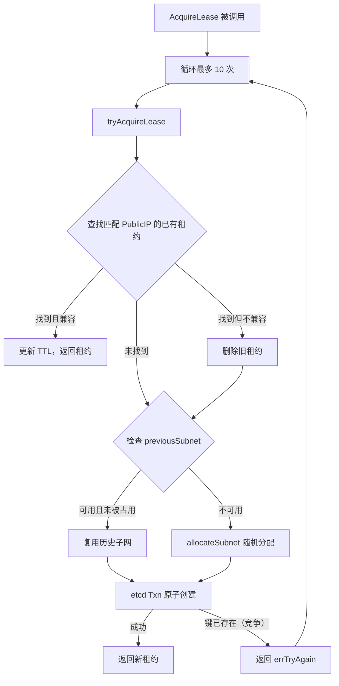
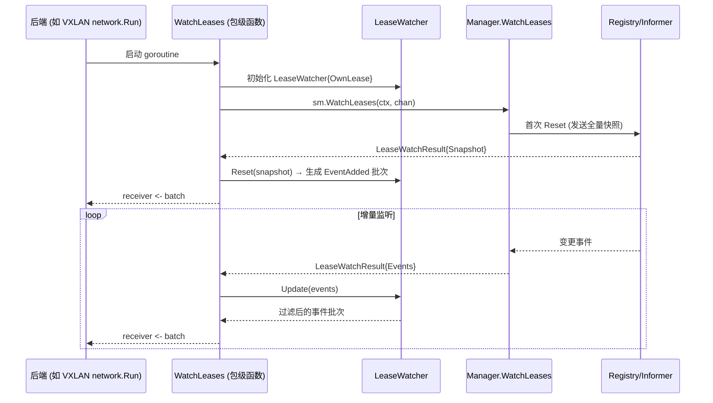
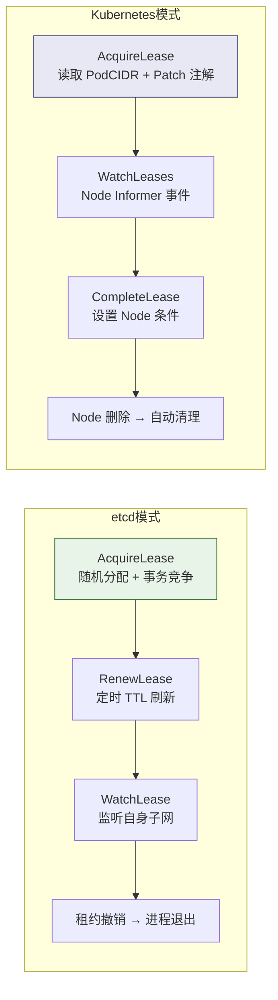

在 Flannel 的分布式网络架构中，**子网租约（Subnet Lease）** 是连接控制平面与数据平面的核心契约。每个节点通过租约获得一段独占的 IP 子网，后端（VXLAN、host-gw 等）依据租约信息构建转发规则。本文从数据模型出发，深入剖析租约从获取、续约到事件监听的完整生命周期，并对比 etcd 与 Kubernetes 两种子网管理器在此过程中的根本差异。

## 数据模型：租约的核心结构

租约系统的类型体系定义在 `pkg/lease/lease.go` 中，由三个核心结构体构成完整的语义模型。

**`Lease`** 是租约的顶层实体，封装了节点所持有的全部子网信息。`EnableIPv4` 和 `EnableIPv6` 标识协议栈启用状态，`Subnet`（`IP4Net`）和 `IPv6Subnet`（`IP6Net`）分别存储 IPv4/IPv6 子网地址与前缀长度。`Attrs` 字段携带后端特定的元数据（如 VXLAN 的 VNI 和 VTEP MAC 地址），`Expiration` 记录租约过期时间。`Asof` 字段仅在 etcd 模式下使用，存储 etcd revision 以支持增量 watch。

**`LeaseAttrs`** 描述租约的附加属性，包含节点的公网 IPv4/IPv6 地址（`PublicIP`/`PublicIPv6`）、后端类型标识（`BackendType`）以及后端数据负载（`BackendData`/`BackendV6Data`，以 `json.RawMessage` 形式存储）。

**`Event`** 和 `EventType` 构成事件通知模型。`EventAdded`（值为 0）和 `EventRemoved`（值为 1）两种事件类型，分别对应子网的分配与释放。`LeaseWatchResult` 将事件流与快照统一抽象——当 `Events` 非空时表示增量事件，当 `Events` 为空时表示需要通过 `Snapshot` 进行全量重建。

Sources: [lease.go](pkg/lease/lease.go#L27-L74)

## Manager 接口：生命周期操作的统一契约

`subnet.Manager` 接口定义了租约生命周期的五项核心操作，etcd 和 Kubernetes 两种管理器分别给出截然不同的实现策略。

```go
type Manager interface {
    GetNetworkConfig(ctx context.Context) (*Config, error)
    HandleSubnetFile(path string, config *Config, ipMasq bool, ...) error
    AcquireLease(ctx context.Context, attrs *lease.LeaseAttrs) (*lease.Lease, error)
    RenewLease(ctx context.Context, lease *lease.Lease) error
    WatchLease(ctx context.Context, sn ip.IP4Net, sn6 ip.IP6Net, receiver chan []lease.LeaseWatchResult) error
    WatchLeases(ctx context.Context, receiver chan []lease.LeaseWatchResult) error
    CompleteLease(ctx context.Context, lease *lease.Lease, wg *sync.WaitGroup) error
    // ...
}
```

| 方法 | etcd 实现 | Kubernetes 实现 |
|------|----------|----------------|
| `AcquireLease` | 从 etcd 竞争分配随机子网 | 读取 Node 的 `PodCIDR`，Patch 注解 |
| `RenewLease` | 通过 etcd Lease Grant 刷新 TTL | **未实现**（返回 `ErrUnimplemented`） |
| `WatchLeases` | etcd Watch API 增量监听 | Kubernetes Node Informer 事件驱动 |
| `WatchLease` | etcd Watch 单个子网键 | **未实现** |
| `CompleteLease` | 启动定时续约 + 单租约监听 | 设置 `NodeNetworkUnavailable=False` |

Sources: [subnet.go](pkg/subnet/subnet.go#L106-L118)

## 租约获取：AcquireLease 的双重策略

### etcd 模式：竞争式随机分配

etcd 管理器的 `AcquireLease` 采用三层回退策略尝试获取子网。外层循环最多执行 `raceRetries`（10 次）重试，每次调用 `tryAcquireLease`，该方法按以下优先级决策：

**第一优先级：按公网 IP 复用。** 遍历 etcd 中所有已存在的租约，查找 `Attrs.PublicIP` 与当前节点匹配的租约。找到后检查子网是否与当前配置兼容（`isSubnetConfigCompat`），兼容则直接更新 TTL 并返回，不兼容则删除旧租约继续尝试。

**第二优先级：按历史子网复用。** 如果 `previousSubnet`（从本地 subnet 文件恢复）非空且未被其他节点占用，且与当前配置兼容，则复用该子网。

**第三优先级：随机分配。** 调用 `allocateSubnet` 在 `SubnetMin` 到 `SubnetMax` 范围内扫描所有未被占用的子网地址，收集最多 100 个候选地址后随机选择一个。IPv6 子网同理。分配完成后通过 etcd 事务（`Txn.If(Version(key)==0).Then(Put)`）原子性地创建子网键，配合 etcd Lease Grant 设置 24 小时 TTL。若事务失败（键已存在，即并发竞争），返回 `errTryAgain` 触发外层重试。



Sources: [local_manager.go](pkg/subnet/etcd/local_manager.go#L107-L223)

### Kubernetes 模式：声明式注解 Patch

Kubernetes 管理器的 `AcquireLease` 逻辑完全不同——子网由 Kubernetes 控制面通过 `Node.Spec.PodCIDR` 分配，Flannel 无需自行选择。核心流程为：

1. 通过 Node Informer 缓存或直接 API 调用获取当前 Node 对象（带 30 秒超时轮询）
2. 校验 `PodCIDR` 非空（否则返回错误）
3. 解析 `PodCIDR` 或 `PodCIDRs`（双栈场景）得到 IPv4/IPv6 CIDR
4. 校验解析后的 CIDR 是否包含在 Flannel 网络配置的大网段内
5. 构建 Node 注解（`backend-data`、`backend-type`、`public-ip` 等），通过 StrategicMergePatch 原子更新 Node 对象
6. 返回包含 `PodCIDR` 信息的 `Lease` 对象，过期时间硬编码为 `time.Now().Add(24 * time.Hour)`

注解键通过 `annotations` 结构体管理，以可配置前缀（默认 `flannel.alpha.coreos.com/`）构建，包含 `backend-data`、`backend-v6-data`、`backend-type`、`public-ip`、`public-ipv6`、`kube-subnet-manager` 等键。

Sources: [kube.go](pkg/subnet/kube/kube.go#L350-L518), [annotations.go](pkg/subnet/kube/annotations.go#L23-L76)

## 租约续约：时间驱动的 TTL 刷新

### etcd 模式：renewMargin 机制

etcd 模式下，租约的续约发生在 `CompleteLease` 中。该方法启动两个并发路径：

**路径一：定时续约。** 计算 `dur = time.Until(myLease.Expiration) - renewMargin`，其中 `renewMargin` 由命令行参数 `--subnet-lease-renew-margin` 指定（默认 60 分钟，有效范围 1–1439 分钟）。当计时器触发时调用 `RenewLease`，该方法通过 `registry.updateSubnet` 向 etcd 发起新的 Lease Grant（TTL = 24h），然后用新 Lease ID 重新写入子网键值，返回新的过期时间。续约失败时退避到 1 分钟后重试。

**路径二：单租约监听。** 在独立 goroutine 中调用 `WatchLease` 监听自身子网键的变化。当收到 `EventAdded` 事件时更新本地 `Expiration` 并重置续约计时器；当收到 `EventRemoved` 事件时，意味着租约被外部撤销，`CompleteLease` 返回 `errInterrupted`，触发 `main.go` 中的 `cancel()` 调用，导致整个进程优雅关闭。

```
租约时间线:
|-- TTL 24h --------------------------------------|
|        |-- renewMargin (默认60min) --|
|        ^                              ^
|   续约触发点                       过期时间点
```

Sources: [local_manager.go](pkg/subnet/etcd/local_manager.go#L276-L284), [local_manager.go](pkg/subnet/etcd/local_manager.go#L362-L407)

### Kubernetes 模式：无需显式续约

Kubernetes 管理器的 `RenewLease` 直接返回 `ErrUnimplemented`。这是因为 Kubernetes 模式下，子网的生命周期与 Node 对象绑定——只要 Node 存在，其 `PodCIDR` 分配就持续有效。Flannel 在 `AcquireLease` 时写入的注解也无需刷新，后端数据的变更通过 `handleUpdateLeaseEvent` 的增量检测机制自动传播。

Sources: [kube.go](pkg/subnet/kube/kube.go#L618-L621)

## 事件监听：从全量快照到增量更新

### LeaseWatcher：事件过滤与状态维护

`LeaseWatcher` 是事件监听的核心引擎，负责维护"其他节点租约"的本地视图，并将原始 watch 事件转换为对后端有意义的通知。它通过 `OwnLease` 字段标识自身租约，`sameSubnet` 函数在 IPv4-only、IPv6-only 和双栈三种场景下精确过滤——任何与 `OwnLease` 子网相同的事件都被静默丢弃，确保后端只处理远程节点的变化。

**`Reset` 方法**处理快照重建场景（etcd watch 窗口过期、初始同步）。它将新快照与当前 `Leases` 列表做差集对比：快照中有但本地没有的 → 生成 `EventAdded`；本地有但快照中没有的 → 生成 `EventRemoved`；最后用快照覆盖本地列表。

**`Update` 方法**处理增量事件。对于 `EventAdded`，先在 `Leases` 中查找同子网的条目——找到则覆盖更新（后端数据变化），未找到则追加。对于 `EventRemoved`，从列表中移除匹配条目。

Sources: [lease.go](pkg/lease/lease.go#L108-L188)

### WatchLeases：通用监听框架

`subnet.WatchLeases`（非接口方法，定义在 `subnet` 包级别）是后端调用事件监听的入口。它创建 `LeaseWatcher` 实例，在独立 goroutine 中调用 `sm.WatchLeases` 将底层事件注入 `leaseWatchChan`，主循环读取 watch result 并根据 `Events` 是否为空选择 `Update` 或 `Reset` 路径：

```go
for _, wr := range watchResults {
    if len(wr.Events) > 0 {
        batch = lw.Update(wr.Events)   // 增量路径
    } else {
        batch = lw.Reset(wr.Snapshot)  // 全量路径
    }
    if len(batch) > 0 {
        receiver <- batch
    }
}
```



Sources: [subnet.go](pkg/subnet/subnet.go#L124-L159)

### etcd 的 Watch 实现

etcd 管理器的 `WatchLeases` 方法分两个阶段工作：

**阶段一：全量重置。** 调用 `registry.leasesWatchReset`，该方法通过 `getSubnets` 获取当前所有子网租约及其对应的 etcd revision，构建包含完整 `Snapshot` 的 `LeaseWatchResult` 发送到 receiver channel。

**阶段二：增量监听。** 从重置返回的 revision+1 开始，调用 `registry.watchSubnets` 建立 etcd Watch 长连接。底层实现使用指数退避（初始 100ms，最大 5s）处理连接中断和重连。对于每个 etcd 事件，通过 `parseSubnetWatchResponse` 解析为 Flannel Event——删除事件映射为 `EventRemoved`，其他事件（Put）映射为 `EventAdded`。当 etcd 历史窗口被压缩（`ErrGRPCCompacted`）导致 revision 过小时，自动触发 `leasesWatchReset` 回退到全量快照模式。

Sources: [local_manager.go](pkg/subnet/etcd/local_manager.go#L339-L360), [registry.go](pkg/subnet/etcd/registry.go#L287-L370)

### Kubernetes 的 Watch 实现

Kubernetes 管理器的 `WatchLeases` 采用完全不同的实现——它不依赖任何外部 watch API，而是从一个带缓冲的 `events` channel 中读取事件。事件的生产者是 Node Informer 的三个回调函数：

- **AddFunc**：新 Node 加入集群时，检查 `kube-subnet-manager` 注解为 `true` 后，通过 `nodeToLease` 转换为 Lease，生成 `EventAdded` 事件
- **UpdateFunc**：Node 更新时，仅当 `backend-data`、`backend-type`、`public-ip`（IPv4）或 `backend-v6-data`、`public-ipv6`（IPv6）注解发生变化时才生成 `EventAdded` 事件，避免无意义的通知
- **DeleteFunc**：Node 删除时（包括 `DeletedFinalStateUnknown` 场景），生成 `EventRemoved` 事件

事件入队通过 `enqueueLeaseEvent` 实现，使用两层策略：首先尝试非阻塞写入 `events` channel（容量由 `EVENT_QUEUE_DEPTH` 环境变量控制，默认 5000）；若 channel 满则获取信号量（最大 100 个并发），启动异步 goroutine 以指数退避（100ms → 5s）重试入队。

Sources: [kube.go](pkg/subnet/kube/kube.go#L202-L248), [kube.go](pkg/subnet/kube/kube.go#L250-L341), [kube.go](pkg/subnet/kube/kube.go#L521-L534)

## CompleteLease：租约生命周期的最终阶段

`CompleteLease` 在 `main.go` 中被调用，位于后端 `Run()` 启动之后，是租约生命周期的守护阶段。

### etcd 模式

etcd 的 `CompleteLease` 启动一个阻塞循环，通过 `select` 多路复用处理两个事件源：`time.After(dur)` 触发定时续约，`evts` channel 接收自身租约的变化通知。当租约被撤销（`EventRemoved`）时返回 `errInterrupted`，`main.go` 检测到此错误后调用 `cancel()` 触发全局关闭流程——所有 goroutine 依次退出，进程以 `os.Exit(0)` 终止。

Sources: [local_manager.go](pkg/subnet/etcd/local_manager.go#L362-L407), [main.go](main.go#L494-L507)

### Kubernetes 模式

Kubernetes 的 `CompleteLease` 职责更为简洁：若存在 `clusterCIDRController`，先启动并等待其同步完成；然后将 Node 的 `NodeNetworkUnavailable` 条件设置为 `False`（原因：`FlannelIsUp`，消息：`Flannel is running on this node`），通过 `PatchStatus` API 更新 Node 状态。这标志着节点网络已就绪，Kubernetes 调度器可以开始在该节点上调度 Pod。

Sources: [kube.go](pkg/subnet/kube/kube.go#L633-L669)

## 两种管理器的架构对比

| 维度 | etcd 管理器 | Kubernetes 管理器 |
|------|-----------|------------------|
| 子网分配 | 随机选择 + 竞争事务 | 由控制面分配 PodCIDR |
| 持久化 | etcd KV + Lease TTL | Node 注解 |
| 续约机制 | 定时 TTL 刷新 (24h TTL, 60min margin) | 无需续约 (跟随 Node 生命周期) |
| 事件来源 | etcd Watch API | Kubernetes Informer |
| 脑裂保护 | 事务 + TTL 自动过期 | API Server 一致性保证 |
| 单租约监听 | 支持 (watch 单个键) | 不支持 |
| 节点就绪标记 | 无 | 设置 NodeNetworkUnavailable=False |
| 事件缓冲 | etcd 自有机制 | 可配置 channel (默认 5000) + 信号量异步重试 |



Sources: [local_manager.go](pkg/subnet/etcd/local_manager.go#L32-L35), [kube.go](pkg/subnet/kube/kube.go#L50-L79)

## 从 main.go 看完整生命周期

在进程启动流程中，租约生命周期与后端生命周期交织进行：

1. **子网管理器创建**：`newSubnetManager` 根据 `--kube-subnet-mgr` 标志选择 etcd 或 Kubernetes 管理器
2. **网络配置获取**：`getConfig` 轮询管理器直到网络配置可用
3. **后端注册与租约获取**：`be.RegisterNetwork` 内部调用 `sm.AcquireLease`，将后端属性（VXLAN 的 VNI/MAC、host-gw 的公网 IP 等）写入 `LeaseAttrs`，获得分配的子网
4. **后端运行与事件监听**：`bn.Run(ctx)` 在独立 goroutine 中启动，内部调用 `subnet.WatchLeases` 监听其他节点的租约变化并动态更新转发规则
5. **租约守护**：`sm.CompleteLease` 在主 goroutine 中阻塞，负责续约（etcd）或节点就绪标记（Kubernetes），直到上下文取消或租约被撤销

Sources: [main.go](main.go#L369-L507)

## 下一步阅读

- 租约的底层存储机制和注解格式详见 [etcd 子网管理器：独立部署模式](12-etcd-zi-wang-guan-li-qi-du-li-bu-shu-mo-shi) 和 [Kubernetes 子网管理器：基于 API 的声明式管理](13-kubernetes-zi-wang-guan-li-qi-ji-yu-api-de-sheng-ming-shi-guan-li)
- 租约事件如何驱动后端路由更新，参见各后端文档（如 [VXLAN 后端：内核态封装与直连路由](6-vxlan-hou-duan-nei-he-tai-feng-zhuang-yu-zhi-lian-lu-you)）
- 进程启动的完整流程参见 [整体架构：从 main.go 到各子系统的启动流程](5-zheng-ti-jia-gou-cong-main-go-dao-ge-zi-xi-tong-de-qi-dong-liu-cheng)