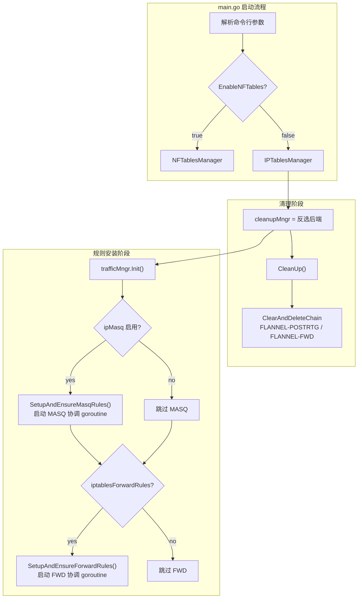
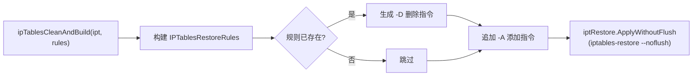
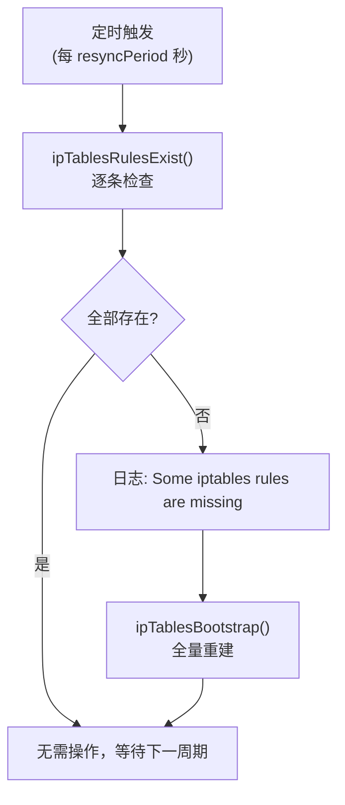
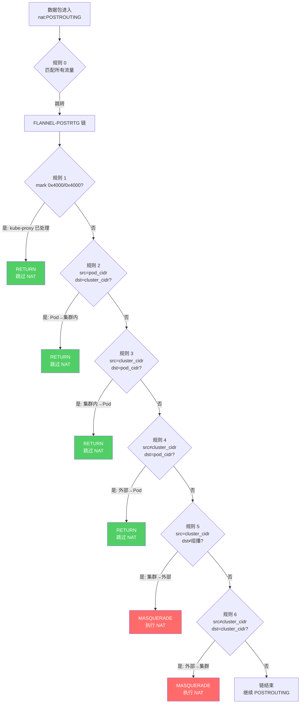

Flannel 在 Linux 节点上通过 iptables 实现两类核心流量管理功能：**NAT 地址伪装**（MASQUERADE）确保 Pod 流量能正确穿越外部网络，**FORWARD 转发放行**（FORWARD）确保 Docker 1.13+ 版本中默认 DROP 策略不会阻断跨节点 Pod 通信。这两个功能由 `IPTablesManager` 结构体统一管理，采用自定义链（Custom Chain）隔离 Flannel 规则、`iptables-restore` 实现原子化规则应用、周期性协调（reconciliation）保证规则持续生效——构成了一套健壮且自愈的内核规则管理机制。本文将深入解析这两类规则的生成逻辑、应用策略与生命周期管理。

Sources: [iptables.go](pkg/trafficmngr/iptables/iptables.go#L44-L47), [trafficmngr.go](pkg/trafficmngr/trafficmngr.go#L38-L60)

## 整体架构：TrafficManager 接口与 IPTablesManager 实现

Flannel 的流量管理抽象为 `TrafficManager` 接口，定义了四个核心方法：`Init`、`CleanUp`、`SetupAndEnsureMasqRules` 和 `SetupAndEnsureForwardRules`。该接口目前有两个实现——`IPTablesManager`（iptables 模式）和 `NFTablesManager`（nftables 实验模式），通过 `main.go` 中的 `newTrafficManager` 工厂函数根据配置参数 `EnableNFTables` 进行选择。值得注意的是，Flannel 启动时会实例化两个 TrafficManager：一个用于清理当前不使用的后端规则（即"反选"清理），另一个用于安装实际需要的规则，以此确保集群从 iptables 切换到 nftables（或反之）时不会残留过期规则。

Sources: [main.go](main.go#L655-L661), [trafficmngr.go](pkg/trafficmngr/trafficmngr.go#L38-L60)



**`IPTablesManager`** 是非 Windows 平台的具体实现，其内部维护两个规则切片 `ipv4Rules` 和 `ipv6Rules`，分别跟踪已安装的 IPv4/IPv6 规则。该结构体依赖两个关键的外部抽象：`IPTables` 接口封装了 `iptables` 命令行工具的单条规则操作（查询、添加、删除），`IPTablesRestore` 接口封装了 `iptables-restore` 的批量原子操作。这种双层抽象的设计使得生产代码可以使用真实的 iptables 二进制文件，而测试代码可以注入 Mock 实现。

Sources: [iptables.go](pkg/trafficmngr/iptables/iptables.go#L31-L47), [iptables.go](pkg/trafficmngr/iptables/iptables.go#L49-L56)

### 命令行参数与配置入口

| 参数 | 类型 | 默认值 | 说明 |
|------|------|--------|------|
| `--ip-masq` | bool | `false` | 为发往 Overlay 网络外部的流量启用 NAT 伪装 |
| `--ip-masq-fully-random-disable` | bool | `false` | 禁用 MASQUERADE 的 `--random-fully` 模式 |
| `--iptables-resync` | int | `5` | iptables 规则同步间隔（秒） |
| `--iptables-forward-rules` | bool | `true` | 在 iptables FORWARD 链中添加默认 ACCEPT 规则 |

Sources: [main.go](main.go#L87-L97), [main.go](main.go#L125-L135)

## MASQUERADE 规则体系：NAT 地址伪装

### 为什么需要 MASQUERADE

当 Pod 发出流量到集群网络外部的目标（如公网 IP、外部服务）时，源 IP 是 Pod 的虚拟 IP（如 `10.244.1.5`）。外部网络无法路由回这些 IP，因此需要在数据包离开节点前将源地址改写为节点的物理 IP——这就是 **MASQUERADE**（动态 SNAT）的作用。然而，并非所有 Pod 流量都需要 NAT：集群内 Pod-to-Pod 通信必须保持原始 IP，以保证网络策略和服务发现的正确工作。Flannel 通过精心设计的规则链，精确区分哪些流量需要伪装、哪些需要跳过。

Sources: [iptables.go](pkg/trafficmngr/iptables/iptables.go#L135-L169)

### 自定义链 FLANNEL-POSTRTG 的设计

Flannel 没有将所有 NAT 规则直接塞入 `POSTROUTING` 标准链，而是创建了自定义链 **`FLANNEL-POSTRTG`**（注册在 `nat` 表中），通过一条跳转规则将匹配到的流量引导到此链中处理。这种设计带来三个关键优势：**规则隔离**——Flannel 的规则不会与 kube-proxy、Calico 等其他组件的规则混杂；**原子更新**——可以整体清空并重建自定义链，不影响标准链中其他规则；**清理安全**——`CleanUp` 阶段只需 `ClearAndDeleteChain` 即可彻底移除所有 Flannel NAT 规则。

Sources: [iptables.go](pkg/trafficmngr/iptables/iptables.go#L112-L113), [iptables.go](pkg/trafficmngr/iptables/iptables.go#L58-L90)

### IPv4 MASQUERADE 规则详解

以下以 IPv4 为例，逐条解析 `masqRules` 函数生成的 7 条规则。假设集群 CIDR 为 `10.244.0.0/16`，当前节点 Pod 子网为 `10.244.1.0/24`。

| 序号 | 链 | 规则语义 | 目的 |
|------|------|----------|------|
| 0 | `POSTROUTING` | `-j FLANNEL-POSTRTG` | 将所有流量引导至 Flannel 自定义链 |
| 1 | `FLANNEL-POSTRTG` | `-m mark --mark 0x4000/0x4000 -j RETURN` | 跳过 kube-proxy 已标记的流量，避免双重 NAT |
| 2 | `FLANNEL-POSTRTG` | `-s 10.244.1.0/24 -d 10.244.0.0/16 -j RETURN` | Pod→集群内流量不 NAT |
| 3 | `FLANNEL-POSTRTG` | `-s 10.244.0.0/16 -d 10.244.1.0/24 -j RETURN` | 集群内→本节点 Pod 流量不 NAT |
| 4 | `FLANNEL-POSTRTG` | `! -s 10.244.0.0/16 -d 10.244.1.0/24 -j RETURN` | 外部→本节点 Pod 流量不 NAT |
| 5 | `FLANNEL-POSTRTG` | `-s 10.244.0.0/16 ! -d 224.0.0.0/4 -j MASQUERADE [--random-fully]` | 集群→外部流量执行 NAT（排除组播） |
| 6 | `FLANNEL-POSTRTG` | `! -s 10.244.0.0/16 -d 10.244.0.0/16 -j MASQUERADE [--random-fully]` | 主机→集群流量执行 NAT |

**规则 0（流量入口）**：在 `nat` 表的 `POSTROUTING` 链最前面追加跳转规则，确保 Flannel 的 NAT 逻辑优先于其他组件执行。

**规则 1（kube-proxy 标记保护）**：kube-proxy 使用 `0x4000/0x4000` 标记已经做过 NAT 的流量。这条规则确保已被 kube-proxy 处理的数据包不会再次被 Flannel 伪装，避免某些内核版本上的**双重 NAT 缺陷**。常量 `KubeProxyMark` 定义在 `trafficmngr.go` 中。

**规则 2-4（RETURN 跳过规则）**：这三条规则构成了"不需要 NAT"的判定矩阵。规则 2 处理本节点 Pod 发往任意集群 IP 的流量；规则 3 处理集群内任意来源发往本节点 Pod 的流量；规则 4 处理来自集群外部的流量到达本节点 Pod 的场景——这条规则特别重要，它防止了当外部节点通过 NodePort 或负载均衡器将流量转发到 Pod 时，响应包被错误地 NAT。

**规则 5-6（MASQUERADE 执行）**：规则 5 匹配从集群 CIDR 发出、目的地非组播地址（`224.0.0.0/4`）的流量，执行 MASQUERADE。排除组播是因为组播流量通常不应被 NAT 改写。规则 6 处理来自集群外部、目标是集群内部的流量（如节点上运行的进程访问 Pod），同样执行 MASQUERADE。当 iptables 版本支持 `--random-fully`（完全随机端口映射）且未通过 `--ip-masq-fully-random-disable` 禁用时，这两条规则会附加 `--random-fully` 选项以提升端口随机性、减少冲突。

Sources: [iptables.go](pkg/trafficmngr/iptables/iptables.go#L135-L169), [trafficmngr.go](pkg/trafficmngr/trafficmngr.go#L36-L36)

### IPv6 MASQUERADE 规则差异

`masqIP6Rules` 函数生成的 IPv6 规则在结构和逻辑上与 IPv4 完全对称，仅有两处语义差异：组播排除地址从 `224.0.0.0/4` 替换为 IPv6 组播前缀 `ff00::/8`；使用的 iptables 二进制从 `iptables` 切换为 `ip6tables`（通过 `iptables.NewWithProtocol(iptables.ProtocolIPv6)` 实例化）。这种双栈对称设计确保了 Flannel 在 IPv4/IPv6 双栈环境下的行为一致性。

Sources: [iptables.go](pkg/trafficmngr/iptables/iptables.go#L171-L208)

### 规则变更时的回收策略

当网络配置或子网租约发生变化时（例如节点重新分配了不同的 Pod CIDR），Flannel 需要回收旧规则再安装新规则。`SetupAndEnsureMasqRules` 函数在检测到 `flannelIPv4Net != prevNetwork` 或 `currentlease.Subnet != prevSubnet` 时，会构造一个基于**旧参数**的临时 `lease` 对象，调用 `deleteIP4Tables` 删除与旧配置匹配的所有规则，然后才创建新链并启动新的协调 goroutine。这种"先删旧、后建新"的策略确保了配置变更期间不会出现规则冲突或残留。

Sources: [iptables.go](pkg/trafficmngr/iptables/iptables.go#L92-L133)

## FORWARD 规则体系：跨节点转发放行

### 为什么需要 FORWARD 规则

从 Docker 1.13 开始，Docker 守护进程启动时会将 `iptables` 的 `FORWARD` 链默认策略设置为 **DROP**。这一变更对 Flannel 构成了直接威胁：跨节点的 Pod 流量到达目标节点后，需要经过 `FORWARD` 链才能从物理接口转发到 Flannel 虚拟接口（或反向），默认 DROP 策略会静默丢弃所有此类流量。Flannel 通过在 `filter` 表中创建自定义链 **`FLANNEL-FWD`** 并放行所有进出 Flannel 网络范围的流量来解决此问题。

Sources: [main.go](main.go#L432-L440), [iptables.go](pkg/trafficmngr/iptables/iptables.go#L210-L231)

### FORWARD 规则结构

`forwardRules` 函数生成的规则非常精简，共 3 条：

| 序号 | 表 | 链 | 规则语义 | 目的 |
|------|------|------|----------|------|
| 0 | `filter` | `FORWARD` | `-j FLANNEL-FWD` | 将 FORWARD 流量引导至 Flannel 自定义链 |
| 1 | `filter` | `FLANNEL-FWD` | `-s <flannelNetwork> -j ACCEPT` | 放行从 Flannel 网络发出的流量 |
| 2 | `filter` | `FLANNEL-FWD` | `-d <flannelNetwork> -j ACCEPT` | 放行发往 Flannel 网络的流量 |

`<flannelNetwork>` 是整个集群的 Flannel 网络范围（如 `10.244.0.0/16`），而非单个节点的 Pod 子网。规则 1 允许 Pod 发出的跨节点流量通过 FORWARD 链，规则 2 允许从其他节点到达本节点 Pod 的流量通过。由于这两条规则只匹配源或目的地址属于 Flannel 网络的数据包，不会影响节点的其他非 Flannel 转发流量。

FORWARD 规则同样支持 IPv4/IPv6 双栈：如果 `flannelIPv6Network` 非空，则会创建独立的 `ip6tables` 规则链。

Sources: [iptables.go](pkg/trafficmngr/iptables/iptables.go#L223-L231)

## iptables-restore：原子化规则应用引擎

### 为什么使用 iptables-restore 而非逐条 iptables

传统的 `iptables -A` / `iptables -D` 方式存在两个严重问题：**非原子性**——在逐条安装过程中，如果中途失败会导致规则集处于不一致状态；**竞态条件**——多个进程/线程并发操作 iptables 时可能互相覆盖。`iptables-restore` 通过标准输入一次性提交所有规则变更，在一个原子事务中完成所有操作。Flannel 使用 `--noflush` 模式，这意味着它不会清空现有规则，而是以**增量补丁**的方式精确添加或删除特定规则。

Sources: [iptables_restore.go](pkg/trafficmngr/iptables/iptables_restore.go#L40-L43)

### IPTablesRestore 实现细节

`ipTablesRestore` 内部结构体封装了三个关键字段：`path`（`iptables-restore` 二进制路径）、`proto`（IPv4 或 IPv6 协议族）、`hasWait`（是否支持 `--wait` 选项）。其中 `hasWait` 通过检测 `iptables` 版本 ≥ 1.6.2 来确定，`--wait` 选项使 `iptables-restore` 在获取 xtables 锁失败时自动重试而非直接报错，这对于 Flannel 与 kube-proxy 等组件并发操作 iptables 的场景至关重要。

并发安全通过 `sync.Mutex` 互斥锁保证——`ApplyWithoutFlush` 方法在执行前先获取锁，确保两个 goroutine 的 `iptables-restore` 调用不会互相干扰。

Sources: [iptables_restore.go](pkg/trafficmngr/iptables/iptables_restore.go#L46-L54), [iptables_restore.go](pkg/trafficmngr/iptables/iptables_restore.go#L89-L100), [iptables_restore.go](pkg/trafficmngr/iptables/iptables_restore.go#L152-L177)

### Payload 构建流程

`buildIPTablesRestorePayload` 函数将 `IPTablesRestoreRules`（`map[string][]IPTablesRestoreRuleSpec`）转换为 `iptables-restore` 标准输入格式的文本。其格式规则如下：

```
*nat
-A POSTROUTING -m comment --comment "flanneld masq" -j FLANNEL-POSTRTG
-A FLANNEL-POSTRTG -m mark --mark 0x4000/0x4000 -m comment --comment "flanneld masq" -j RETURN
COMMIT
```

每个表以 `*表名` 开头，规则以空格分隔的 token 列表表示，`--comment` 后面的值会被自动加上双引号，最后以 `COMMIT` 提交事务。这种格式确保了规则在一个批次中被内核一次性处理。

Sources: [iptables_restore.go](pkg/trafficmngr/iptables/iptables_restore.go#L124-L150)

### Bootstrap 流程：Clean → Build → Apply

`ipTablesBootstrap` 函数是规则初始化的核心编排器，它的工作分为三步：



1. **`ipTablesCleanAndBuild`** 遍历所有规则，对每条规则先检查其目标链是否存在（不存在则 `ClearChain` 创建），再检查规则本身是否存在。如果规则已存在，则先生成一条 `-D`（删除）指令，随后始终追加一条 `-A`（添加）指令。这种"先删后加"的策略确保了规则的**精确排序**——不会因为已有规则位置不对而跳过匹配。

2. **`ApplyWithoutFlush`** 将生成的 payload 通过 `iptables-restore --noflush [--wait]` 原子化执行。

3. 对于自定义链（`FLANNEL-FWD`、`FLANNEL-POSTRTG`），如果链不存在，会先调用 `ClearChain` 创建空链，然后才往其中添加规则。

Sources: [iptables.go](pkg/trafficmngr/iptables/iptables.go#L296-L361)

## 周期性协调机制：规则自愈保障

### setupAndEnsureIP4Tables / setupAndEnsureIP6Tables

Flannel 在启动时为 IPv4 和 IPv6 各启动一个**后台 goroutine**，负责持续监控 iptables 规则的完整性。流程如下：

1. **Bootstrap**：首次调用 `ipTablesBootstrap` 安装所有规则
2. **规则缓存**：将规则追加到 `iptm.ipv4Rules` / `iptm.ipv6Rules` 切片中
3. **定时循环**：每 `resyncPeriod` 秒（默认 5 秒）执行一次 `ensureIPTables`

Sources: [iptables.go](pkg/trafficmngr/iptables/iptables.go#L363-L432)

### ensureIPTables 检查与修复逻辑

`ensureIPTables` 的策略非常务实：**先全量检查，存在缺失则全量重建**。具体流程为：

1. 调用 `ipTablesRulesExist` 逐条检查所有规则是否存在
2. 对于涉及 `FLANNEL-FWD` 或 `FLANNEL-POSTRTG` 自定义链的规则，先检查链本身是否存在
3. 如果全部规则都存在，直接返回（无操作）
4. 如果有任何规则缺失，调用 `ipTablesBootstrap` 执行"先删后加"的全量重建

这种"检查→重建"模式比"逐条补齐"更可靠，因为它避免了规则顺序错乱的问题——iptables 规则的匹配顺序至关重要，`FLANNEL-POSTRTG` 中的 RETURN 规则必须出现在 MASQUERADE 规则之前，否则所有流量都会被错误地 NAT。

Sources: [iptables.go](pkg/trafficmngr/iptables/iptables.go#L479-L497), [iptables.go](pkg/trafficmngr/iptables/iptables.go#L263-L293)



## 规则清理与拆除

### CleanUp：启动时的反向清理

Flannel 启动时会创建一个**反选的** TrafficManager 实例：如果当前使用 iptables，则创建一个 nftables 管理器来清理 nftables 残留；反之亦然。`IPTablesManager.CleanUp` 的操作非常直接：分别对 IPv4 和 IPv6 的 `iptables`/`ip6tables` 调用 `ClearAndDeleteChain("nat", "FLANNEL-POSTRTG")` 和 `ClearAndDeleteChain("nat", "FLANNEL-FWD")`——先清空链中所有规则，再删除链本身。如果链不存在或操作失败，仅记录 V(2) 级别日志，不阻断启动流程。

Sources: [iptables.go](pkg/trafficmngr/iptables/iptables.go#L58-L90), [main.go](main.go#L387-L396)

### teardownIPTables：运行时的规则删除

当网络配置发生变更时，`teardownIPTables` 负责精确删除旧规则。其逻辑与 Bootstrap 的删除阶段类似：遍历规则列表，检查每条规则是否存在，对存在的规则生成 `-D` 指令，最后通过 `iptables-restore --noflush` 批量执行。关键的区别是 **teardown 只删不建**——它不生成 `-A` 指令，仅产生 `-D` 操作。`ApplyWithoutFlush` 的 `--noflush` 模式确保了只做差异操作，不会影响其他规则。

Sources: [iptables.go](pkg/trafficmngr/iptables/iptables.go#L499-L542)

## MASQUERADE 规则匹配流程图

以下流程图展示了 IPv4 MASQUERADE 规则链的完整匹配逻辑，帮助理解流量如何经过 `FLANNEL-POSTRTG` 自定义链：



Sources: [iptables.go](pkg/trafficmngr/iptables/iptables.go#L135-L169)

## 平台兼容性与 Windows 特殊处理

iptables 是 Linux 内核特有的功能，因此 `iptables_windows.go` 提供了 Windows 平台的桩实现（Stub）。在该实现中，`IPTablesManager` 是空结构体，所有方法（`Init`、`CleanUp`、`SetupAndEnsureForwardRules`、`SetupAndEnsureMasqRules`）均为空操作——`CleanUp` 返回 `nil`，`SetupAndEnsureMasqRules` 仅输出一条 `ErrUnimplemented` 警告日志后返回 `nil`。Go 的构建标签 `//go:build !windows` 和 `//go:build windows` 确保编译器在对应平台自动选择正确的实现文件。

Sources: [iptables_windows.go](pkg/trafficmngr/iptables/iptables_windows.go#L27-L56)

## 与其他组件的交互关系

Flannel 的 iptables 规则需要与 Kubernetes 生态中的其他组件共存协作。以下表格总结了关键的交互场景：

| 交互组件 | 潜在冲突 | Flannel 的应对策略 |
|----------|----------|-------------------|
| **kube-proxy** | 双重 NAT（kube-proxy 已标记流量被再次 MASQUERADE） | 规则 1 检测 `0x4000/0x4000` 标记并 RETURN |
| **Docker daemon** | Docker 1.13+ 设置 FORWARD 默认策略为 DROP | `FLANNEL-FWD` 链放行 Flannel 网络流量 |
| **Calico / Cilium** | 多个 CNI 同时操作 iptables | 自定义链隔离，`--noflush` 增量操作 |
| **iptables-restore 并发** | Flannel 自身多个 goroutine 并发调用 | `ipTablesRestore` 内置 `sync.Mutex` 互斥锁 |
| **nftables 切换** | 从 iptables 切换到 nftables 后残留旧规则 | 启动时反选 TrafficManager 执行 CleanUp |

Sources: [iptables.go](pkg/trafficmngr/iptables/iptables.go#L146-L148), [main.go](main.go#L387-L396), [iptables_restore.go](pkg/trafficmngr/iptables/iptables_restore.go#L50-L53)

## 关键设计模式总结

Flannel 的 iptables 管理模块体现了几个值得学习的基础设施设计模式：

**自定义链隔离模式**——通过 `FLANNEL-POSTRTG` 和 `FLANNEL-FWD` 将 Flannel 规则封装在独立的命名空间中，与系统其他规则完全解耦。清理时一条 `ClearAndDeleteChain` 即可彻底移除。

**声明式协调模式**——不是"一次设置永久有效"，而是"定期声明期望状态并修正偏差"。`ensureIPTables` 每 5 秒检查一次，发现缺失则全量重建。这种自愈机制可以应对外部程序意外修改 iptables 规则的情况。

**原子事务模式**——使用 `iptables-restore` 而非逐条 `iptables` 命令，确保规则变更的原子性。配合互斥锁避免并发冲突。

**优雅降级模式**——`--random-fully` 支持通过运行时检测 iptables 版本来决定是否启用，而非硬性要求最低版本。Windows 平台通过空实现避免编译失败。

Sources: [iptables.go](pkg/trafficmngr/iptables/iptables.go#L44-L56), [iptables.go](pkg/trafficmngr/iptables/iptables.go#L479-L497), [iptables_restore.go](pkg/trafficmngr/iptables/iptables_restore.go#L89-L99), [iptables.go](pkg/trafficmngr/iptables/iptables.go#L157-L161)

---

**下一步阅读建议**：如需了解 nftables 实验模式如何实现相同的 TrafficManager 接口，请参阅 [nftables 模式（实验性）：下一代规则引擎](16-nftables-mo-shi-shi-yan-xing-xia-dai-gui-ze-yin-qing)；如需理解整体启动流程中 iptables 管理器的初始化位置，请参阅 [整体架构：从 main.go 到各子系统的启动流程](5-zheng-ti-jia-gou-cong-main-go-dao-ge-zi-xi-tong-de-qi-dong-liu-cheng)。