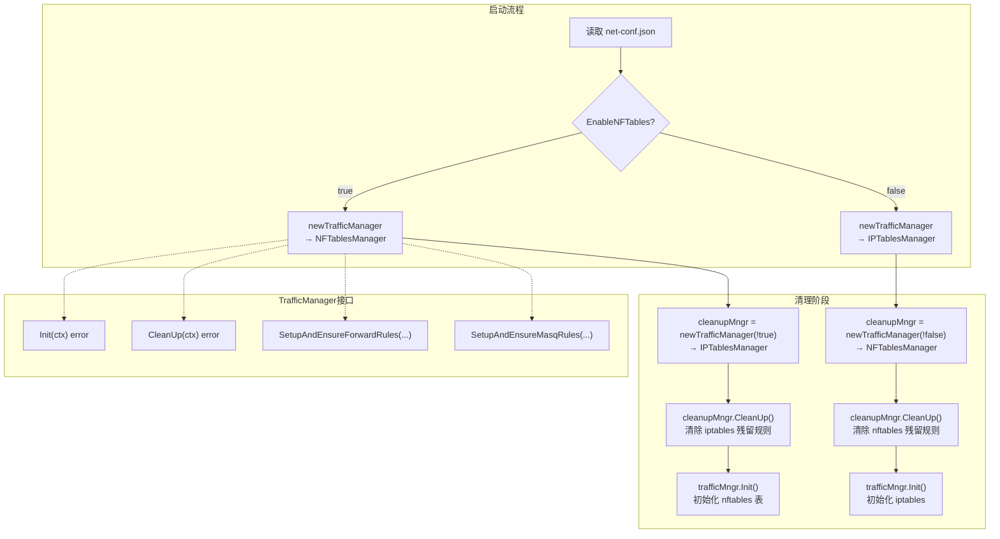
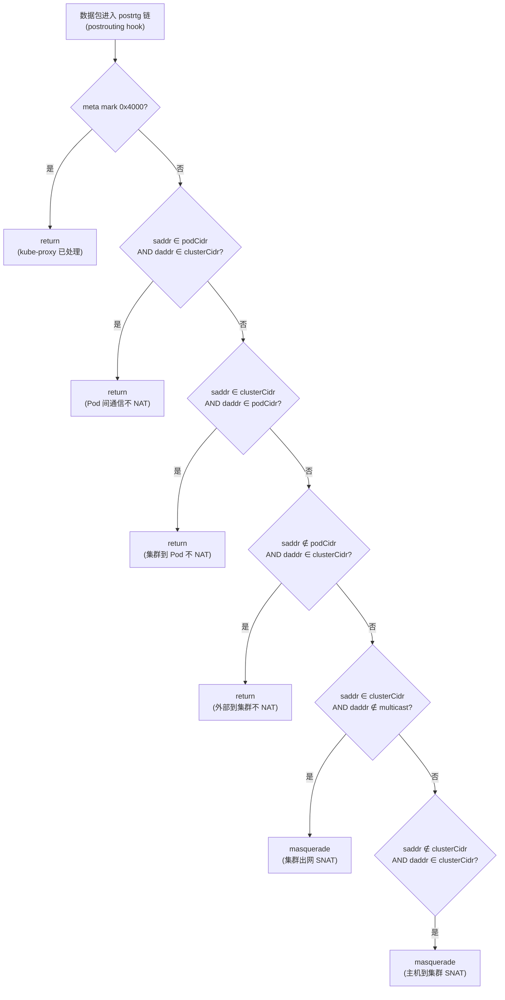

Flannel 的 nftables 模式是对传统 iptables 流量管理机制的现代化替代方案。它基于 Linux 内核的 **nftables** 子系统，通过 `sigs.k8s.io/knftables` 库（与 kube-proxy 共享的底层库）实现了声明式的、事务性的规则管理。当前该模式被标记为**实验性（EXPERIMENTAL）**，默认关闭，但其架构设计已经充分考虑了与 iptables 模式的完全对等性和运行时互斥切换能力。本文将深入剖析 nftables 模式的架构设计、规则语义、与 iptables 模式的关键差异，以及启用与配置方法。

Sources: [trafficmngr.go](pkg/trafficmngr/trafficmngr.go#L38-L60), [nftables.go](pkg/trafficmngr/nftables/nftables.go#L1-L55), [configuration.md](Documentation/configuration.md#L22-L23)

## 架构总览：TrafficManager 接口的双实现

nftables 模式的核心设计遵循**策略模式（Strategy Pattern）**——`TrafficManager` 接口定义了流量管理的四个核心操作（初始化、清理、FORWARD 规则、MASQUERADE 规则），iptables 和 nftables 各自提供独立实现。在运行时，Flannel 根据 JSON 配置中的 `EnableNFTables` 布尔值决定实例化哪一个实现，并且两种模式**互斥共存**：启动时会主动清理另一种模式的残留规则，确保切换干净。



`newTrafficManager` 工厂函数是决策的核心枢纽——它接收一个布尔值，决定返回 `NFTablesManager` 还是 `IPTablesManager` 实例。在 `main.go` 中，该函数被调用两次：第一次以**反向参数**创建清理管理器，用于清除另一种模式的残留状态；第二次以**正向参数**创建实际使用的流量管理器。

Sources: [main.go](main.go#L655-L661), [main.go](main.go#L387-L406), [trafficmngr.go](pkg/trafficmngr/trafficmngr.go#L38-L60)

## NFTablesManager 结构与初始化

`NFTablesManager` 的结构极其精简——仅持有两个 `knftables.Interface` 实例，分别对应 IPv4 和 IPv6 协议族：

| 字段 | 类型 | 用途 |
|------|------|------|
| `nftv4` | `knftables.Interface` | 管理 `flannel-ipv4` nftables 表 |
| `nftv6` | `knftables.Interface` | 管理 `flannel-ipv6` nftables 表 |

初始化过程 `Init()` 调用内部的 `initTable()` 函数两次，分别为 IPv4 和 IPv6 创建**专用 nftables 表**。与 iptables 模式使用共享的 `filter`/`nat` 标准内核表不同，nftables 模式创建了完全独立的命名空间——`flannel-ipv4` 和 `flannel-ipv6`。这一设计从根本上消除了与其他 Kubernetes 组件（如 kube-proxy、kube-router）的规则冲突风险。

`initTable()` 的工作流程采用**事务模型**：通过 `nft.NewTransaction()` 创建事务对象，向其中添加 `Table` 操作，然后通过 `nft.Run(ctx, tx)` 一次性提交。如果内核不支持 nftables（例如缺少相关模块），`knftables.New()` 会立即返回错误，阻止 Flannel 在不兼容的环境中启动。

Sources: [nftables.go](pkg/trafficmngr/nftables/nftables.go#L37-L73)

## FORWARD 规则：转发链的声明式管理

`SetupAndEnsureForwardRules` 负责确保 Flannel 网络的流量能够被正确转发。在 nftables 模式下，它创建了一个类型为 `filter`、挂载在 `Forward` 钩子上的链，优先级为标准 `FilterPriority`。规则的语义简洁而精确：

```
# IPv4 FORWARD 链（挂载于 flannel-ipv4 表）
chain forward {
    type filter hook forward priority filter;
    ip saddr <flannelNetwork> accept    # 允许来自 Flannel 网络的流量
    ip daddr <flannelNetwork> accept    # 允许发往 Flannel 网络的流量
}
```

代码中的一个重要注释揭示了一个设计决策：**永远不要在 forward 链上设置默认 `drop` 策略**，因为这会中断节点连通性。nftables 的默认 `accept` 策略在这里是最安全的选择——Flannel 仅添加允许规则，不改变任何其他流量的行为。

与 iptables 模式的一个关键差异是：**nftables 模式不启动周期性重同步的 goroutine**。iptables 模式需要定期轮询来确保规则持久存在（因为其他组件可能修改共享的 iptables 规则），而 nftables 的专用表设计消除了这一需求——规则存储在 Flannel 私有的表中，不受外部干扰。

Sources: [nftables.go](pkg/trafficmngr/nftables/nftables.go#L77-L147), [iptables.go](pkg/trafficmngr/iptables/iptables.go#L210-L231)

## MASQUERADE 规则：NAT 的精确语义

`SetupAndEnsureMasqRules` 是流量伪装（SNAT）的核心逻辑，创建了一个类型为 `nat`、挂载在 `Postrouting` 钩子上的 `postrtg` 链，优先级为 `SNATPriority`。六条规则的语义链形成了一个完整的 NAT 决策树：



| 规则序号 | nftables 语法 | iptables 等价 | 语义 |
|----------|--------------|--------------|------|
| 1 | `meta mark 0x4000 return` | `-m mark --mark 0x4000/0x4000 -j RETURN` | 跳过 kube-proxy 已标记的流量，避免双重 NAT |
| 2 | `ip saddr <podCidr> ip daddr <clusterCidr> return` | `-s podCidr -d clusterCidr -j RETURN` | Pod 到集群网络的流量不 NAT |
| 3 | `ip saddr <clusterCidr> ip daddr <podCidr> return` | `-s clusterCidr -d podCidr -j RETURN` | 集群到 Pod 的流量不 NAT |
| 4 | `ip saddr != <podCidr> ip daddr <clusterCidr> return` | `! -s clusterCidr -d podCidr -j RETURN` | 外部到 Pod 的流量不 NAT（避免 NodeIP 拥有的 Pod 被伪装） |
| 5 | `ip saddr <clusterCidr> ip daddr != 224.0.0.0/4 masquerade` | `-s clusterCidr ! -d 224.0.0.0/4 -j MASQUERADE` | 集群出网流量执行 SNAT（排除多播） |
| 6 | `ip saddr != <clusterCidr> ip daddr <clusterCidr> masquerade` | `! -s clusterCidr -d clusterCidr -j MASQUERADE` | 主机到集群的流量执行 SNAT |

Sources: [nftables.go](pkg/trafficmngr/nftables/nftables.go#L149-L275), [nftables.go](pkg/trafficmngr/nftables/nftables.go#L207-L276)

## fully-random 检测机制

MASQUERADE 规则的一个关键特性是 **fully-random** 模式——它控制 SNAT 端口分配是否完全随机化。这对避免端口冲突和某些安全场景至关重要。`utils.go` 中的 `checkRandomfully()` 方法通过**试运行（dry-run）**来检测内核是否支持此特性：

它创建一个临时的 `masqueradeTest` 链，添加一条包含 `masquerade fully-random` 的规则，然后调用 `nft.Check(ctx, tx)` 而非 `nft.Run(ctx, tx)`——`Check` 仅验证规则的语法和内核兼容性，不会实际安装规则。如果内核不支持 `fully-random` 选项，`Check` 返回错误，方法回退到普通的 `masquerade` 动作。这一检测与 iptables 模式中通过 `ipt.HasRandomFully()` 检测 iptables 二进制版本的能力形成了对称设计。

Sources: [utils.go](pkg/trafficmngr/nftables/utils.go#L31-L58), [nftables.go](pkg/trafficmngr/nftables/nftables.go#L213-L216)

## iptables 与 nftables 模式的架构对比

两种模式虽然实现了相同的接口、执行相同的语义逻辑，但在底层机制上存在根本差异：

| 维度 | iptables 模式 | nftables 模式 |
|------|-------------|--------------|
| **库依赖** | `github.com/coreos/go-iptables` | `sigs.k8s.io/knftables` v0.0.18 |
| **表归属** | 共享 `filter`/`nat` 标准表 | 专用 `flannel-ipv4`/`flannel-ipv6` 表 |
| **链命名** | `FLANNEL-POSTRTG`/`FLANNEL-FWD`（需跳转规则） | `postrtg`/`forward`（直接挂载 hook） |
| **操作模型** | 逐条规则追加/删除 | 事务性批量操作（Flush + Add） |
| **规则持久化** | 周期性 goroutine 重同步（默认每 5 秒） | 一次性安装，无需轮询 |
| **规则冲突风险** | 高（与其他组件共享表） | 极低（专用命名空间） |
| **br_netfilter 依赖** | 需要检查 `/proc/sys/net/bridge/bridge-nf-call-iptables` | 不需要 |
| **规则回收** | 需对比 prevNetwork/prevSubnet 决定是否清理旧规则 | 每次启动 Flush 整个链，无需回收逻辑 |
| **Windows 支持** | 空操作 stub | 空操作 stub |
| **成熟度** | 稳定，默认启用 | **实验性，需显式启用** |

nftables 模式的最大架构优势在于**专用表的隔离性**。iptables 模式必须在共享的 `nat` 和 `filter` 表中操作，这意味着 Flannel 的规则可能被 kube-proxy 等组件的规则修改所影响，因此需要周期性的重同步机制来确保规则持续存在。而 nftables 的专用表从根本上消除了这一竞态条件——`Flush` + `Add` 的事务模式确保了每次操作都是原子性的、确定性的。

Sources: [iptables.go](pkg/trafficmngr/iptables/iptables.go#L44-L90), [nftables.go](pkg/trafficmngr/nftables/nftables.go#L30-L35), [main.go](main.go#L285-L299)

## 启用与配置

### 通过 net-conf.json 启用

在 Flannel 的 `net-conf.json` 配置中，将 `EnableNFTables` 设为 `true` 即可激活 nftables 模式：

```json
{
  "Network": "10.244.0.0/16",
  "EnableNFTables": true,
  "Backend": {
    "Type": "vxlan"
  }
}
```

### 通过 Helm Chart 启用

使用 Helm 部署时，在 `values.yaml` 中设置 `flannel.enableNFTables`：

```yaml
flannel:
  enableNFTables: true
  backend: "vxlan"
  args:
    - "--ip-masq"
    - "--kube-subnet-mgr"
```

Helm 模板会自动将该值转换为 `net-conf.json` 中的 `"EnableNFTables": true` 字段。

### 与 kube-proxy nftables 模式的配合

当 Flannel 运行在 nftables 模式下时，建议 kube-proxy 也使用 nftables 模式以保持一致性。配置 kubeadm 时需要启用 `NFTablesProxyMode` 特性门控：

```yaml
apiVersion: kubeadm.k8s.io/v1beta3
kind: ClusterConfiguration
kubernetesVersion: v1.29.0
controllerManager:
  extraArgs:
    feature-gates: NFTablesProxyMode=true
---
apiVersion: kubeproxy.config.k8s.io/v1alpha1
kind: KubeProxyConfiguration
mode: "nftables"
featureGates:
  NFTablesProxyMode: true
```

Flannel 的 MASQUERADE 规则中第一条 `meta mark 0x4000 return` 就是专门为 kube-proxy 设计的——它跳过被 kube-proxy 标记的流量，避免双重 NAT 问题。

Sources: [configuration.md](Documentation/configuration.md#L139-L156), [kube-flannel.yml](Documentation/kube-flannel.yml#L91-L98), [config.yaml](chart/kube-flannel/templates/config.yaml#L22-L24), [values.yaml](chart/kube-flannel/values.yaml#L28)

## CleanUp：模式切换的清理机制

`CleanUp()` 方法是模式切换安全性的保障。当 Flannel 以 nftables 模式启动时，它会先实例化一个 iptables 的 `IPTablesManager` 并调用其 `CleanUp()`，清除 `FLANNEL-POSTRTG` 和 `FLANNEL-FWD` 链；反之亦然，iptables 模式启动时会清除 `flannel-ipv4` 和 `flannel-ipv6` 表。

nftables 的清理逻辑极其简洁——直接删除整个专用表：

```go
// 删除 IPv4 表
nft, _ := knftables.New(knftables.IPv4Family, ipv4Table)
tx := nft.NewTransaction()
tx.Delete(&knftables.Table{})  // 删除整个表
nft.Run(ctx, tx)
```

这种"整表删除"策略比 iptables 的逐链清理更彻底、更安全——它确保不会遗留任何规则、链或集合。清理过程中的错误仅记录为 V(2) 级别日志（而非致命错误），因为被清理的表可能本身就不存在（首次切换时）。

Sources: [nftables.go](pkg/trafficmngr/nftables/nftables.go#L278-L302), [main.go](main.go#L387-L397)

## Windows 平台适配

nftables 包通过 Go 的构建标签（build tags）实现了平台隔离。Linux 实现文件带有 `//go:build !windows` 标签，而 `nftables_windows.go` 提供了空操作的 stub 实现——所有方法要么返回 `nil`，要么仅记录警告日志。这意味着 Windows 节点上即使配置了 `EnableNFTables: true`，也不会产生实际的 nftables 操作，`SetupAndEnsureMasqRules` 会输出 `ErrUnimplemented` 警告后静默返回。

Sources: [nftables_windows.go](pkg/trafficmngr/nftables/nftables_windows.go#L1-L51), [nftables.go](pkg/trafficmngr/nftables/nftables.go#L14-L15)

## 设计决策与演进方向

根据项目的架构决策记录（ADR），引入 nftables 的动机源于 iptables 的三个结构性缺陷：**性能**（O(n) 线性匹配）、**稳定性**（规则需定期清除重建以保持顺序，且与其他组件存在干扰）、以及**废弃风险**（nftables 已被内核和主流发行版定位为 iptables 的替代方案）。

当前实现遵循了 ADR 中的"先对等、后优化"策略——nftables 模式的规则语义与 iptables 完全对等，尚未引入 nftables 特有的优化特性（如集合查找、映射、级联等）。ADR 中规划的未来优化方向包括利用 nftables 的原生集合（set）和字典（map）数据结构来实现 O(1) 的 CIDR 匹配，以及使用连接跟踪（conntrack）的更高效规则。

Sources: [add-nftables-implementation.md](Documentation/adrs/add-nftables-implementation.md#L1-L92)

## 延伸阅读

- 了解 iptables 模式的完整规则管理机制，参见 [iptables 模式：MASQUERADE 与 FORWARD 规则管理](15-iptables-mo-shi-masquerade-yu-forward-gui-ze-guan-li)
- 理解 JSON 配置中所有可用的配置参数，参见 [网络配置详解：JSON 配置、命令行参数与环境变量](17-wang-luo-pei-zhi-xiang-jie-json-pei-zhi-ming-ling-hang-can-shu-yu-huan-jing-bian-liang)
- 查看双栈（IPv4/IPv6）模式下 nftables 如何同时管理两个协议族，参见 [双栈与纯 IPv6 模式：多协议网络支持](18-shuang-zhan-yu-chun-ipv6-mo-shi-duo-xie-yi-wang-luo-zhi-chi)