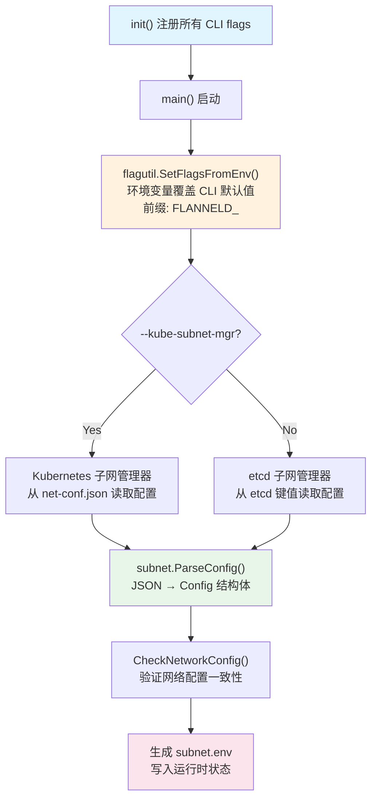
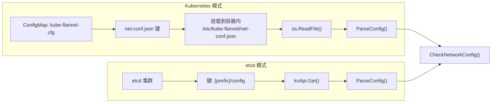

Flannel 的配置体系建立在 **三层配置通道** 之上：JSON 网络配置文件定义 overlay 网络拓扑，命令行参数控制运行时行为，环境变量则作为命令行参数的替代注入方式。理解这三者的职责边界和交互优先级，是正确部署和排查 Flannel 网络的前提。本文将从源码层面逐一拆解每一层配置的结构、加载机制与验证逻辑，帮助你建立精确的配置心智模型。

Sources: [main.go](main.go#L72-L101), [configuration.md](Documentation/configuration.md#L1-L10)

## 配置加载的全局流程

Flannel 启动时的配置加载遵循严格的顺序：命令行参数解析 → 环境变量覆盖 → JSON 配置读取 → 运行时验证。这个流程确保了每一层配置都能在正确的时机生效。



**命令行参数**在 `init()` 函数中通过 `flag.NewFlagSet` 注册到全局变量 `flannelFlags` 中，所有默认值在这一步确定。随后在 `main()` 函数中，`flagutil.SetFlagsFromEnv(flannelFlags, "FLANNELD")` 将环境变量映射到对应的 flag 上——这意味着环境变量可以覆盖命令行的默认值，但无法覆盖已显式指定的命令行参数。最后，根据 `--kube-subnet-mgr` 的选择，Flannel 从 Kubernetes ConfigMap 或 etcd 中读取 JSON 配置，经过解析和校验后完成配置加载。

Sources: [main.go](main.go#L110-L175), [main.go](main.go#L214-L272)

## JSON 网络配置：网络拓扑的定义核心

JSON 配置是 Flannel 网络拓扑的声明式定义，其职责是描述 overlay 网络的地址空间、子网划分策略和后端类型。根据所选的子网管理器，JSON 配置的来源不同：

| 管理器模式 | JSON 配置来源 | 加载路径 |
|:---|:---|:---|
| Kubernetes 模式 (`--kube-subnet-mgr`) | ConfigMap `kube-flannel-cfg` 中的 `net-conf.json` 键 | 挂载到 `/etc/kube-flannel/net-conf.json` |
| etcd 模式 | etcd 中 `{prefix}/config` 键的值 | 默认 `/coreos.com/network/config` |

### Config 结构体与字段映射

JSON 配置被反序列化为 `subnet.Config` 结构体，该结构体定义了所有网络拓扑参数：

```go
type Config struct {
    EnableIPv4     bool            // 是否启用 IPv4，默认 true
    EnableIPv6     bool            // 是否启用 IPv6，默认 false
    EnableNFTables bool            // 是否使用 nftables 替代 iptables
    Network        ip.IP4Net       // IPv4 网络地址（CIDR）
    IPv6Network    ip.IP6Net       // IPv6 网络地址（CIDR）
    SubnetMin      ip.IP4          // 子网分配起始地址
    SubnetMax      ip.IP4          // 子网分配结束地址
    IPv6SubnetMin  *ip.IP6         // IPv6 子网分配起始地址
    IPv6SubnetMax  *ip.IP6         // IPv6 子网分配结束地址
    SubnetLen      uint            // 每主机子网前缀长度
    IPv6SubnetLen  uint            // 每主机 IPv6 子网前缀长度
    BackendType    string          // 后端类型（从 Backend.Type 解析）
    Backend        json.RawMessage // 后端特定配置（原始 JSON）
}
```

其中 `Backend` 字段使用 `json.RawMessage` 延迟解析，这意味着不同后端类型（vxlan、host-gw、wireguard 等）可以携带各自独立的配置结构，而 `Config` 结构体本身无需感知后端的具体字段。`BackendType` 通过 `parseBackendType()` 函数从 `Backend` 字段中提取 `Type` 键值获得，若 `Backend` 为空则默认为 `"udp"`。

Sources: [config.go](pkg/subnet/config.go#L26-L54)

### 完整 JSON 字段参考

下表列出了所有可用的 JSON 配置字段及其默认行为：

| 字段 | 类型 | 必填 | 默认值 | 说明 |
|:---|:---|:---|:---|:---|
| `Network` | string (CIDR) | IPv4 启用时是 | 无 | 整个 Flannel 网络的 IPv4 地址范围 |
| `IPv6Network` | string (CIDR) | IPv6 启用时是 | 无 | 整个 Flannel 网络的 IPv6 地址范围 |
| `EnableIPv4` | bool | 否 | `true` | 启用 IPv4 支持 |
| `EnableIPv6` | bool | 否 | `false` | 启用 IPv6 支持 |
| `EnableNFTables` | bool | 否 | `false` | 使用 nftables 替代 iptables（实验性） |
| `SubnetLen` | int | 否 | 24（网络 ≥/22 时） | 分配给每台主机的 IPv4 子网大小 |
| `SubnetMin` | string | 否 | Network 的第二个子网 | 子网分配起始 IP |
| `SubnetMax` | string | 否 | Network 的最后一个子网 | 子网分配结束 IP |
| `IPv6SubnetLen` | int | 否 | 64（网络 ≥/62 时） | 分配给每台主机的 IPv6 子网大小 |
| `IPv6SubnetMin` | string | 否 | IPv6Network 的第二个子网 | IPv6 子网分配起始 IP |
| `IPv6SubnetMax` | string | 否 | IPv6Network 的最后一个子网 | IPv6 子网分配结束 IP |
| `Backend` | object | 否 | `{}` | 后端类型及其专属配置 |

Sources: [configuration.md](Documentation/configuration.md#L12-L46)

### SubnetLen 的自动计算逻辑

`SubnetLen` 是一个容易出错但又有智能默认值的字段。当用户未显式指定时，`CheckNetworkConfig()` 会根据 `Network` 的大小自动推导：

| Network 前缀长度 | 自动 SubnetLen | 推导逻辑 |
|:---|:---|:---|
| ≤ /22 | /24 | 网络足够大，每个主机分配标准 /24 |
| /23 ~ /28 | Network.PrefixLen + 2 | 网络偏小，按四等分策略 |
| > /28 | 报错 | 网络过小，无法容纳四个子网 |

这一逻辑的依据是：第一个子网通常不可用（与网络地址冲突），因此至少需要四个子网才能保证有两个以上的可用主机子网。IPv6 遵循完全对称的逻辑，仅阈值不同（最小 /124，默认 /64）。

Sources: [config.go](pkg/subnet/config.go#L76-L136)

### 典型配置示例

以下是标准 Kubernetes 部署中 `kube-flannel-cfg` ConfigMap 的 `net-conf.json` 默认内容，展示了最精简的配置方式：

```json
{
  "Network": "10.244.0.0/16",
  "EnableNFTables": false,
  "Backend": {
    "Type": "vxlan"
  }
}
```

一个更完整的配置示例，包含自定义子网范围和 UDP 后端：

```json
{
  "Network": "10.0.0.0/8",
  "SubnetLen": 20,
  "SubnetMin": "10.10.0.0",
  "SubnetMax": "10.99.0.0",
  "Backend": {
    "Type": "udp",
    "Port": 7890
  }
}
```

Sources: [kube-flannel.yml](Documentation/kube-flannel.yml#L91-L98), [configuration.md](Documentation/configuration.md#L54-L65)

## 命令行参数：运行时行为的控制面

命令行参数控制的是 Flannel 进程的 **运行时行为**——如何连接后端存储、选择哪个网络接口、如何管理 iptables 规则等。这些参数与 JSON 配置的职责完全分离：JSON 定义"网络长什么样"，CLI 定义"进程怎么跑"。

### CmdLineOpts 结构体

所有命令行参数被映射到 `CmdLineOpts` 结构体中，该结构体在 `init()` 函数中通过 `flannelFlags` 完成注册：

Sources: [main.go](main.go#L72-L101)

### 完整命令行参数参考

下表按功能域对所有命令行参数进行分组：

**子网管理器连接**

| 参数 | 类型 | 默认值 | 说明 |
|:---|:---|:---|:---|
| `--kube-subnet-mgr` | bool | `false` | 使用 Kubernetes API 替代 etcd 进行子网管理 |
| `--kube-api-url` | string | `""` | Kubernetes API Server 地址（Pod 内运行时无需指定） |
| `--kubeconfig-file` | string | `""` | kubeconfig 文件路径（Pod 内运行时无需指定） |
| `--kube-annotation-prefix` | string | `flannel.alpha.coreos.com` | Node 注解前缀 |
| `--etcd-endpoints` | string | `http://127.0.0.1:4001,http://127.0.0.1:2379` | etcd 端点列表（逗号分隔） |
| `--etcd-prefix` | string | `/coreos.com/network` | etcd 中的配置键前缀 |
| `--etcd-keyfile` | string | `""` | etcd SSL 密钥文件 |
| `--etcd-certfile` | string | `""` | etcd SSL 证书文件 |
| `--etcd-cafile` | string | `""` | etcd SSL CA 文件 |
| `--etcd-username` | string | `""` | etcd BasicAuth 用户名 |
| `--etcd-password` | string | `""` | etcd BasicAuth 密码 |

**网络接口选择**

| 参数 | 类型 | 默认值 | 说明 |
|:---|:---|:---|:---|
| `--iface` | string（可重复） | `""` | 指定用于主机间通信的接口（IP 或名称） |
| `--iface-regex` | string（可重复） | `""` | 通过正则表达式匹配接口 |
| `--iface-can-reach` | string | `""` | 通过可达性探测选择接口（模拟 `ip route get`） |
| `--public-ip` | string | `""` | 对外可达的 IPv4 地址 |
| `--public-ipv6` | string | `""` | 对外可达的 IPv6 地址 |

**流量管理与 iptables**

| 参数 | 类型 | 默认值 | 说明 |
|:---|:---|:---|:---|
| `--ip-masq` | bool | `false` | 为离开 overlay 网络的流量设置 MASQUERADE 规则 |
| `--ip-masq-fully-random-disable` | bool | `false` | 禁用 MASQUERADE 的 fully-random 模式 |
| `--iptables-resync` | int | `5` | iptables 规则重新同步周期（秒） |
| `--iptables-forward-rules` | bool | `true` | 在 FORWARD 链添加默认 ACCEPT 规则 |
| `--ip-blackhole-route` | bool | `false` | 为本地 podCIDR 添加黑洞路由 |

**运行时控制**

| 参数 | 类型 | 默认值 | 说明 |
|:---|:---|:---|:---|
| `--subnet-file` | string | `/run/flannel/subnet.env` | 运行时状态文件写入路径 |
| `--net-config-path` | string | `/etc/kube-flannel/net-conf.json` | 网络配置文件路径 |
| `--subnet-lease-renew-margin` | int | `60` | 子网租约续约提前量（分钟，1~1439） |
| `--healthz-ip` | string | `0.0.0.0` | 健康检查监听 IP |
| `--healthz-port` | int | `0` | 健康检查端口（0 = 禁用） |
| `--set-node-network-unavailable` | bool | `true` | 就绪后设置 NodeNetworkUnavailable 条件 |
| `--version` | bool | `false` | 打印版本号并退出 |

注意 `--iface` 和 `--iface-regex` 使用自定义的 `flagSlice` 类型实现了多值支持——可以在命令行中多次指定同一参数，Flannel 会按顺序逐一尝试匹配，返回第一个成功匹配的接口。关于网络接口选择策略的深入分析，请参阅 [网络接口选择策略：iface、iface-regex 与 iface-can-reach](19-wang-luo-jie-kou-xuan-ze-ce-lue-iface-iface-regex-yu-iface-can-reach)。

Sources: [main.go](main.go#L110-L139)

### 参数验证

Flannel 在配置加载完成后会执行参数验证。目前最关键的验证是 `--subnet-lease-renew-margin` 必须在 1 到 1439（即 23 小时 59 分钟）之间——因为子网租约的固定有效期为 24 小时，续约提前量不能超过租约时长，也不能为零或负值。

Sources: [main.go](main.go#L228-L232)

## 环境变量：命令行参数的替代通道

Flannel 通过 `github.com/coreos/pkg/flagutil` 库的 `SetFlagsFromEnv()` 函数实现了环境变量到命令行参数的自动映射。转换规则简单明确：

> **前缀 `FLANNELD_`** + **去除前导横杠** + **转大写** + **横杠转下划线**

| 命令行参数 | 对应环境变量 |
|:---|:---|
| `--etcd-endpoints` | `FLANNELD_ETCD_ENDPOINTS` |
| `--kube-subnet-mgr` | `FLANNELD_KUBE_SUBNET_MGR` |
| `--ip-masq` | `FLANNELD_IP_MASQ` |
| `--public-ip` | `FLANNELD_PUBLIC_IP` |
| `--subnet-lease-renew-margin` | `FLANNELD_SUBNET_LEASE_RENEW_MARGIN` |
| `--healthz-port` | `FLANNELD_HEALTHZ_PORT` |

这种设计使得 Flannel 在容器化环境中可以通过环境变量灵活注入配置，而不必修改启动命令。在实际的 DaemonSet YAML 中，你就能看到这种模式的应用。

**优先级规则**：命令行显式参数 > 环境变量 > 命令行默认值。也就是说，如果在命令行中已经为某个参数指定了值，环境变量不会覆盖它；但如果参数未在命令行中指定（使用默认值），环境变量可以覆盖默认值。

Sources: [main.go](main.go#L220-L223), [configuration.md](Documentation/configuration.md#L96-L98)

### Kubernetes 特有环境变量

除了通过 `FLANNELD_` 前缀映射的环境变量外，Flannel 的 Kubernetes 子网管理器还读取以下专用环境变量：

| 环境变量 | 默认值 | 说明 |
|:---|:---|:---|
| `NODE_NAME` | — | 当前节点名称（优先使用） |
| `POD_NAME` | — | 当前 Pod 名称（用于反查 Node） |
| `POD_NAMESPACE` | — | 当前 Pod 命名空间 |
| `EVENT_QUEUE_DEPTH` | `5000` | Kubernetes 事件队列深度，适应集群规模 |
| `CONT_WHEN_CACHE_NOT_READY` | `false` | 节点 Informer 缓存未同步完成时是否继续启动 |

`NODE_NAME` 和 `POD_NAME`/`POD_NAMESPACE` 用于确定当前 Flannel Pod 运行在哪台 Node 上。`EVENT_QUEUE_DEPTH` 控制事件通道的缓冲区大小，在超大规模集群中需要调大以避免事件丢失。`CONT_WHEN_CACHE_NOT_READY` 则为大集群场景提供了容错机制——当节点 Informer 同步超时时，仍允许 Flannel 继续启动。

Sources: [kube.go](pkg/subnet/kube/kube.go#L98-L116), [kube.go](pkg/subnet/kube/kube.go#L184-L194), [main.go](main.go#L243-L250), [kube-flannel.yml](Documentation/kube-flannel.yml#L176-L187)

## subnet.env：配置的运行时输出

`subnet.env` 文件是 Flannel 配置系统的最终输出产物，它将 JSON 配置中的网络拓扑和运行时状态合并为 shell 环境变量格式，供 CNI 插件和其他下游组件消费。文件路径由 `--subnet-file` 参数控制，默认写入 `/run/flannel/subnet.env`。

`WriteSubnetFile()` 函数按以下格式写入：

```bash
# 纯 IPv4 或双栈模式
FLANNEL_NETWORK=10.42.0.0/16           # 来自 JSON 配置的 Network
FLANNEL_SUBNET=10.42.0.1/24            # 分配给本机的子网（首可用 IP）
FLANNEL_IPV6_NETWORK=2001:cafe:42::/56 # 来自 JSON 配置的 IPv6Network
FLANNEL_IPV6_SUBNET=2001:cafe:42::1/64 # 分配给本机的 IPv6 子网
FLANNEL_MTU=1450                       # 由后端计算的 MTU 值
FLANNEL_IPMASQ=true                    # 来自 --ip-masq 参数
```

该文件使用原子写入策略：先写入临时文件 `.subnet.env`，再通过 `os.Rename()` 原子重命名，确保下游组件要么读到完整的旧数据，要么读到完整的新数据，永远不会读到半写状态。

Sources: [subnet.go](pkg/subnet/subnet.go#L71-L104), [main.go](main.go#L474-L479), [sample_subnet.env](dist/sample_subnet.env#L1-L4)

## 三层配置的职责边界

理解 Flannel 配置体系的关键在于明确每一层的职责边界，避免将运行时参数与拓扑定义混淆：

```mermaid
graph LR
    subgraph JSON 配置
        J1["Network / IPv6Network"]
        J2["SubnetLen / SubnetMin / SubnetMax"]
        J3["Backend.Type + 后端配置"]
        J4["EnableIPv4 / EnableIPv6"]
    end
    
    subgraph "命令行参数 / 环境变量"
        C1["子网管理器选择"]
        C2["网络接口选择"]
        C3["流量管理策略"]
        C4["健康检查与运行时控制"]
    end
    
    subgraph "运行时输出 (subnet.env)"
        O1["FLANNEL_NETWORK"]
        O2["FLANNEL_SUBNET"]
        O3["FLANNEL_MTU"]
        O4["FLANNEL_IPMASQ"]
    end
    
    JSON 配置 --> 运行时输出 (subnet.env)
    "命令行参数 / 环境变量" --> 运行时输出 (subnet.env)
    
    J1 -.-> O1
    J1 -.-> O2
    J3 -.-> O3
    C3 -.-> O4
```

**JSON 配置**回答的是"网络长什么样"——地址空间、子网划分、后端类型。**命令行参数和环境变量**回答的是"进程怎么运行"——连接哪个 API Server、用哪张网卡、是否做 MASQUERADE。**subnet.env** 则是两者交汇的产物，将拓扑定义和运行时决策合并为 CNI 插件可以直接消费的环境变量格式。

这三层之间有一个关键的交互点：`--ip-masq` 参数（命令行层）会影响 `subnet.env` 中的 `FLANNEL_IPMASQ` 值（输出层），但它不影响 JSON 配置中的任何字段。同样，`--net-config-path` 指定了 JSON 配置的文件路径，而 JSON 配置中的 `Backend.Type` 决定了命令行参数中的网络接口选择和流量管理行为如何被具体应用。

Sources: [main.go](main.go#L72-L101), [config.go](pkg/subnet/config.go#L26-L40), [subnet.go](pkg/subnet/subnet.go#L71-L104)

## 配置加载路径对比：Kubernetes 模式 vs etcd 模式

两种子网管理器模式在配置加载路径上存在显著差异：



**关键区别**：Kubernetes 模式在 `NewSubnetManager()` 构造时就完成了 JSON 配置的读取和解析，将 `*subnet.Config` 存储在 `kubeSubnetManager.subnetConf` 字段中，后续 `GetNetworkConfig()` 直接返回缓存的配置。而 etcd 模式每次调用 `GetNetworkConfig()` 都会从 etcd 实时读取，这意味着 etcd 模式理论上支持运行时热更新配置（尽管 Flannel 的主循环并不主动利用这一特性）。

另一个重要区别是 **配置校验**：etcd 模式在 `GetNetworkConfig()` 中调用 `CheckNetworkConfig()` 进行完整的网络一致性校验（包括子网范围、前缀长度、边界对齐等），而 Kubernetes 模式跳过了这一校验——因为 Kubernetes 模式下子网分配由 Node 的 `PodCIDR` 字段驱动，网络配置的合法性由集群控制器保证。

Sources: [kube.go](pkg/subnet/kube/kube.go#L118-L126), [kube.go](pkg/subnet/kube/kube.go#L343-L345), [local_manager.go](pkg/subnet/etcd/local_manager.go#L90-L105), [registry.go](pkg/subnet/etcd/registry.go#L154-L166)

## 延伸阅读

- 了解 Flannel 整体启动流程中配置的加载位置：[整体架构：从 main.go 到各子系统的启动流程](5-zheng-ti-jia-gou-cong-main-go-dao-ge-zi-xi-tong-de-qi-dong-liu-cheng)
- 深入网络接口选择的三种策略及其优先级：[网络接口选择策略：iface、iface-regex 与 iface-can-reach](19-wang-luo-jie-kou-xuan-ze-ce-lue-iface-iface-regex-yu-iface-can-reach)
- 双栈和纯 IPv6 模式下的 JSON 配置差异：[双栈与纯 IPv6 模式：多协议网络支持](18-shuang-zhan-yu-chun-ipv6-mo-shi-duo-xie-yi-wang-luo-zhi-chi)
- 配置如何驱动不同后端的行为：[后端注册机制：init() 与构造函数映射模式](11-hou-duan-zhu-ce-ji-zhi-init-yu-gou-zao-han-shu-ying-she-mo-shi)