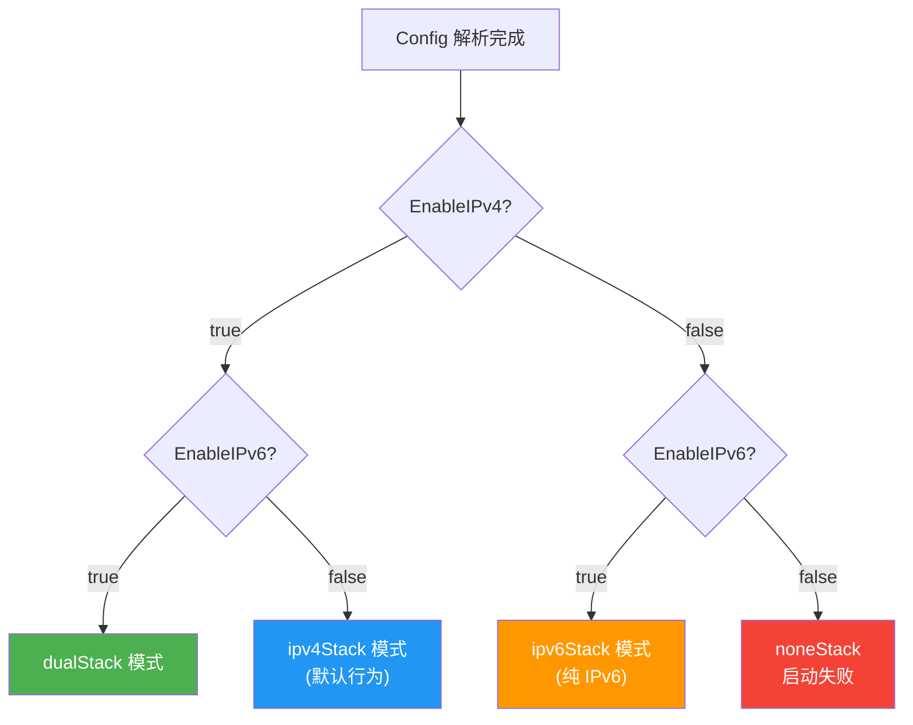
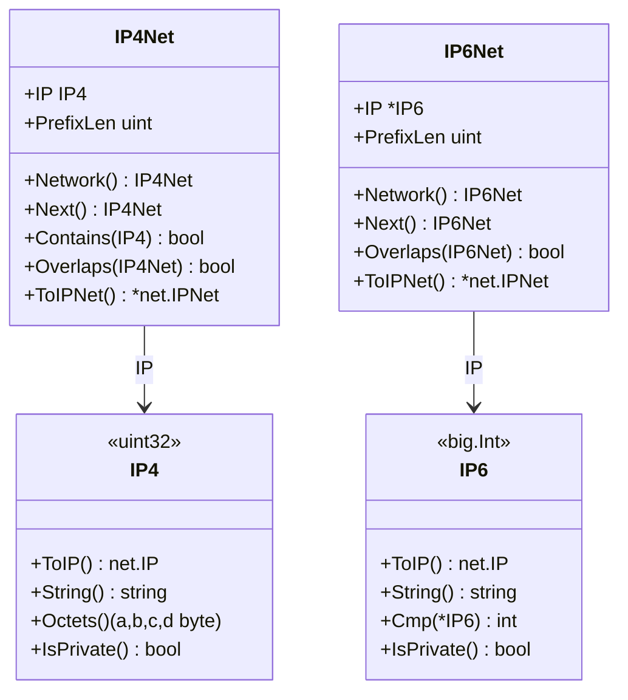
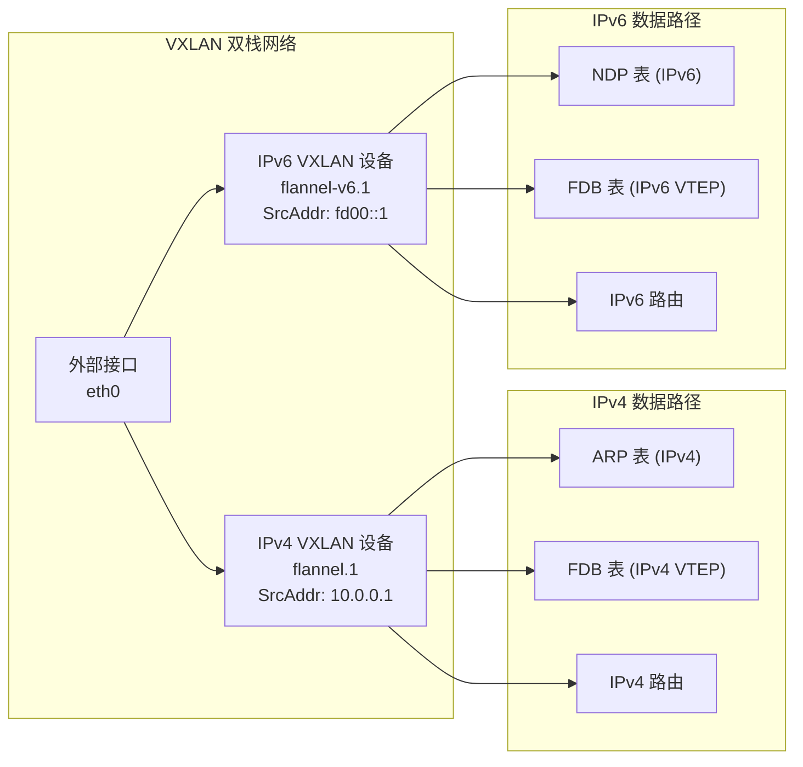
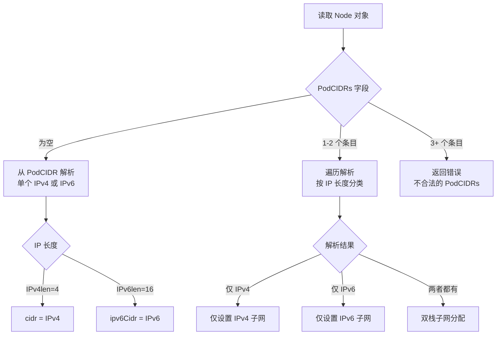
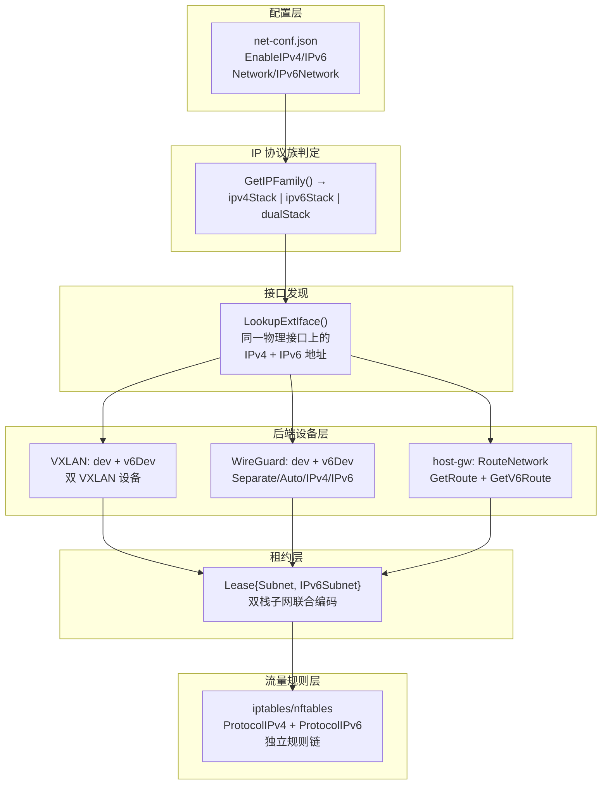

Flannel 的双栈模式允许 Pod 和 Service 同时使用 IPv4 与 IPv6 地址，而纯 IPv6 模式则适用于完全不需要 IPv4 的环境。这一能力并非简单地"在 IPv4 旁加一条 IPv6 路由"——它涉及从配置解析、IP 类型系统、后端设备管理、租约模型到流量规则引擎的**全栈改造**。本文将沿着数据流路径，逐层拆解 Flannel 如何在同一代码库中优雅地容纳三种网络族（IPv4-only、IPv6-only、dual-stack）。

Sources: [configuration.md](Documentation/configuration.md#L110-L137)

## 核心概念：三种 IP 协议族的判定模型

Flannel 的协议族选择由 `Config` 结构体中的两个布尔字段驱动：**`EnableIPv4`**（默认 `true`）和 **`EnableIPv6`**（默认 `false`）。这两个字段组合产生三种有效的运行模式：



在 `main.go` 的启动流程中，配置加载后立即通过 `ipmatch.GetIPFamily()` 将布尔组合映射为整型常量（`ipv4Stack=0`、`ipv6Stack=1`、`dualStack=2`、`noneStack=3`），这个常量将贯穿后续的接口查找、设备创建和路由管理全流程。

Sources: [match.go](pkg/ipmatch/match.go#L30-L51), [main.go](main.go#L278-L283)

## 配置体系：双栈参数的声明式定义

`Config` 结构体是双栈配置的核心载体。IPv4 与 IPv6 的参数在设计上保持了严格的对称性——每个 IPv4 字段都有对应的 IPv6 字段：

| IPv4 参数 | IPv6 参数 | 类型 | 说明 |
|-----------|-----------|------|------|
| `EnableIPv4` | `EnableIPv6` | `bool` | 协议开关，IPv4 默认 `true`，IPv6 默认 `false` |
| `Network` | `IPv6Network` | `IP4Net` / `IP6Net` | Flannel 总网络 CIDR |
| `SubnetLen` | `IPv6SubnetLen` | `uint` | 每节点子网前缀长度（默认 24 / 64） |
| `SubnetMin` | `IPv6SubnetMin` | `IP4` / `*IP6` | 子网分配起始地址 |
| `SubnetMax` | `IPv6SubnetMax` | `IP4` / `*IP6` | 子网分配结束地址 |

一个典型的双栈 `net-conf.json` 配置如下：

```json
{
  "EnableIPv4": true,
  "EnableIPv6": true,
  "Network": "10.42.0.0/16",
  "IPv6Network": "2001:cafe:42::/56",
  "Backend": {
    "Type": "vxlan"
  }
}
```

纯 IPv6 模式则需显式关闭 IPv4：

```json
{
  "EnableIPv4": false,
  "EnableIPv6": true,
  "IPv6Network": "fc00::/48",
  "Backend": {
    "Type": "vxlan"
  }
}
```

在配置校验阶段，`CheckNetworkConfig()` 对 IPv4 和 IPv6 各自独立执行参数完整性检查。IPv6 的校验逻辑与 IPv4 保持结构一致但数值不同：IPv6 子网前缀最大值为 `/126`（而非 `/30`），最小可用网络前缀为 `/124`（而非 `/28`），默认子网长度为 `/64`（而非 `/24`）。这种**对称但参数不同的设计**确保了两种协议族在各自的地址空间约束下都能正确分配子网。

Sources: [config.go](pkg/subnet/config.go#L26-L40), [config.go](pkg/subnet/config.go#L76-L198), [configuration.md](Documentation/configuration.md#L12-L45)

## IP 类型系统：IPv4 与 IPv6 的类型级隔离

Flannel 并未使用标准库的 `net.IP` 作为内部表示，而是为 IPv4 和 IPv6 分别设计了**独立的值类型**，这是双栈架构的基石。

### IPv4 类型：`IP4`（uint32）与 `IP4Net`

IPv4 地址被定义为 `type IP4 uint32`，利用 Go 的原生 32 位无符号整数直接表示地址，所有位运算（掩码、包含判断、网络计算）都可以直接使用整数运算完成，性能极高。`IP4Net` 结构体包含 `IP IP4` 和 `PrefixLen uint` 两个成员。

Sources: [ipnet.go](pkg/ip/ipnet.go#L24-L114)

### IPv6 类型：`IP6`（big.Int）与 `IP6Net`

IPv6 地址则定义为 `type IP6 big.Int`，因为 128 位地址空间无法放入任何 Go 原生整数类型。`big.Int` 提供了精确的任意精度运算，代价是需要堆分配和指针操作。`IP6Net` 同样包含 `IP *IP6`（注意这里是指针）和 `PrefixLen uint`。



两类网络类型都实现了 JSON 序列化/反序列化、字符串表示、网络掩码计算、重叠检测等对称方法。关键差异在于 **IPv6 使用 `*IP6` 指针**（因为 `big.Int` 是引用语义），而 IPv4 使用值类型——这种设计使得两个协议族的代码无法意外混用，从类型系统层面杜绝了双栈场景下的地址族混淆错误。

Sources: [ip6net.go](pkg/ip/ip6net.go#L25-L124), [ipnet.go](pkg/ip/ipnet.go#L24-L114)

## 租约模型：双栈子网的联合编码

**`Lease` 结构体**是每个节点在 Flannel 网络中的身份凭证，它同时承载 IPv4 和 IPv6 子网信息：

```go
type Lease struct {
    EnableIPv4 bool
    EnableIPv6 bool
    Subnet     ip.IP4Net    // IPv4 子网
    IPv6Subnet ip.IP6Net    // IPv6 子网
    Attrs      LeaseAttrs
    Expiration time.Time
}
```

`LeaseAttrs` 同样保持双字段对称：`PublicIP`（IPv4）/ `PublicIPv6`（IPv6 指针）、`BackendData`（IPv4 后端数据）/ `BackendV6Data`（IPv6 后端数据）。`sameSubnet()` 辅助函数根据 `EnableIPv4` 和 `EnableIPv6` 的组合，分别在 IPv4-only、IPv6-only 和 dualStack 三种情况下进行租约比较——dualStack 模式要求 IPv4 和 IPv6 子网**同时匹配**才视为同一租约。

Sources: [lease.go](pkg/lease/lease.go#L42-L60), [lease.go](pkg/lease/lease.go#L191-L210)

### 子网键的编码格式

在 etcd 存储中，子网键通过 `MakeSubnetKey()` 编码。纯 IPv4 时格式为 `10.42.1.0-24`；双栈时在 IPv4 键后追加 `&` 分隔的 IPv6 子网信息，例如 `10.42.1.0-24&fd00::1-64`。`ParseSubnetKey()` 使用正则表达式 `(\d+\.\d+.\d+.\d+)-(\d+)(?:&([a-f\d:]+)-(\d+))?$` 同时解析两种地址族的子网标识。

Sources: [subnet.go](pkg/subnet/subnet.go#L33-L69)

## 后端双栈支持矩阵

并非所有后端都支持双栈。当前版本中，**仅 VXLAN、WireGuard、host-gw（Linux）三个后端**完整支持双栈模式。在 Kubernetes 子网管理器的 `AcquireLease()` 中，如果后端类型不属于这三者，会强制将 `EnableIPv6` 设为 `false`：

```go
//TODO - only vxlan, host-gw and wireguard backends support dual stack now.
if attrs.BackendType != "vxlan" && attrs.BackendType != "host-gw" && attrs.BackendType != "wireguard" {
    lease.EnableIPv4 = true
    lease.EnableIPv6 = false
}
```

| 后端 | 双栈支持 | IPv6-only 支持 | 双栈实现策略 |
|------|---------|---------------|-------------|
| VXLAN | ✅ | ✅ | 双设备（`flannel.VNI` + `flannel-v6.VNI`） |
| WireGuard | ✅ | ✅ | 可配置模式（Separate / Auto / IPv4 / IPv6） |
| host-gw (Linux) | ✅ | ✅ | 单设备双路由（`GetRoute` + `GetV6Route`） |
| UDP | ❌ | ❌ | — |
| IPIP | ❌ | ❌ | — |
| IPsec | ❌ | ❌ | — |
| alloc | ❌ | ❌ | — |
| TencentCloud VPC | ❌ | ❌ | — |
| Extension | 部分 | 部分 | 取决于用户实现 |

Sources: [kube.go](pkg/subnet/kube/kube.go#L512-L516), [configuration.md](Documentation/configuration.md#L112)

## VXLAN 双栈：双设备并行架构

VXLAN 后端是双栈实现的典型代表，它采用**为每个协议族创建独立 VXLAN 设备**的策略。在 `network` 结构体中，`dev` 管理IPv4 封装，`v6Dev` 管理IPv6 封装：

```go
type network struct {
    backend.SimpleNetwork
    dev       *vxlanDevice    // IPv4 VXLAN 设备
    v6Dev     *vxlanDevice    // IPv6 VXLAN 设备
    subnetMgr subnet.Manager
    mtu       int
}
```

设备创建时，根据 `config.EnableIPv4` / `config.EnableIPv6` 分别构建设备属性。IPv4 设备命名为 `flannel.<VNI>`，IPv6 设备命名为 `flannel-v6.<VNI>`。两者使用相同的 VNI（Virtual Network Identifier）和端口号，但绑定不同的源地址（`vtepAddr`）——IPv4 设备绑定外部接口的 IPv4 地址，IPv6 设备绑定 IPv6 地址。



在事件处理（`handleSubnetEvents`）中，每个子网变更事件同时携带 IPv4 和 IPv6 信息。处理逻辑通过 `event.Lease.EnableIPv4` 和 `event.Lease.EnableIPv6` 分别走 IPv4 和 IPv6 的 ARP/FDB/路由操作路径。IPv6 的邻居发现操作使用独立的 `AddV6ARP` / `AddV6FDB` / `DelV6ARP` / `DelV6FDB` 方法，它们在底层通过 `netlink.NeighSet` 设置 IPv6 地址族的邻居条目。

Sources: [vxlan_network.go](pkg/backend/vxlan/vxlan_network.go#L38-L44), [vxlan.go](pkg/backend/vxlan/vxlan.go#L182-L249), [vxlan.go](pkg/backend/vxlan/vxlan.go#L252-L274), [device.go](pkg/backend/vxlan/device.go#L197-L251)

## WireGuard 双栈：多模式灵活架构

WireGuard 后端提供了最丰富的双栈配置选项，通过 **`Mode` 字段**控制设备拓扑：

| Mode 值 | 行为 | 设备创建 |
|---------|------|---------|
| `separate`（默认） | IPv4 和 IPv6 使用独立的 WireGuard 设备 | `flannel-wg`（IPv4 端口 51820）+ `flannel-wg-v6`（IPv6 端口 51821） |
| `auto` | 单设备，根据远端地址类型自动选择协议 | 单个 `flannel-wg` |
| `ipv4` | 单设备，强制使用 IPv4 端点 | 单个 `flannel-wg` |
| `ipv6` | 单设备，强制使用 IPv6 端点 | 单个 `flannel-wg` |

`separate` 模式下，IPv4 和 IPv6 的对等端（peer）管理完全独立：IPv4 peer 通过 `flannel-wg` 设备添加路由，IPv6 peer 通过 `flannel-wg-v6` 设备添加路由。`auto` 模式则使用启发式算法 `selectMode()` 决定端点协议——优先使用公网 IPv4，其次使用公网 IPv6，最后回退到 IPv4。

Sources: [wireguard.go](pkg/backend/wireguard/wireguard.go#L33-L40), [wireguard.go](pkg/backend/wireguard/wireguard.go#L141-L165), [wireguard_network.go](pkg/backend/wireguard/wireguard_network.go#L118-L129)

## host-gw 双栈：单设备双路由策略

host-gw 后端是最简洁的双栈实现。它**不创建任何隧道设备**，而是在同一个物理接口上同时维护 IPv4 和 IPv6 路由。通过 `RouteNetwork` 的 `GetRoute`（IPv4）和 `GetV6Route`（IPv6）两个闭包分别生成不同地址族的路由条目：

```go
if config.EnableIPv4 {
    n.GetRoute = func(lease *lease.Lease) *netlink.Route {
        return &netlink.Route{
            Dst:       lease.Subnet.ToIPNet(),
            Gw:        lease.Attrs.PublicIP.ToIP(),
            LinkIndex: n.LinkIndex,
        }
    }
}
if config.EnableIPv6 {
    n.GetV6Route = func(lease *lease.Lease) *netlink.Route {
        return &netlink.Route{
            Dst:       lease.IPv6Subnet.ToIPNet(),
            Gw:        lease.Attrs.PublicIPv6.ToIP(),
            LinkIndex: n.LinkIndex,
        }
    }
}
```

`RouteNetwork` 的 `handleSubnetEvents()` 根据 `EnableIPv4`/`EnableIPv6` 标志分别调用 `routeAdd()` 并指定 `netlink.FAMILY_V4` 或 `netlink.FAMILY_V6` 来操作不同地址族的路由表。

Sources: [hostgw.go](pkg/backend/hostgw/hostgw.go#L53-L103), [route_network.go](pkg/backend/route_network.go#L83-L140)

## 接口选择：双栈约束下的网卡发现

双栈模式对网络接口选择施加了**额外的约束**：IPv4 和 IPv6 必须位于**同一个物理接口**上。在 `LookupExtIface()` 中，`dualStack` 分支会：

1. 同时获取接口的 IPv4 地址（`GetInterfaceIP4Addrs`）和 IPv6 地址（`GetInterfaceIP6Addrs`）
2. 如果通过 `--public-ip` 和 `--public-ipv6` 指定，则验证两个 IP 绑定在同一接口上
3. 如果通过默认网关自动发现，则验证 IPv4 默认路由和 IPv6 默认路由指向同一接口

```go
case dualStack:
    iface, err = ip.GetDefaultGatewayInterface()
    v6Iface, err := ip.GetDefaultV6GatewayInterface()
    if iface.Name != v6Iface.Name {
        return nil, fmt.Errorf("v6 default route interface %s "+
            "must be the same with v4 default route interface %s", v6Iface.Name, iface.Name)
    }
```

`ExternalInterface` 结构体同时承载两种地址信息：`IfaceAddr` / `IfaceV6Addr`（接口实际地址）和 `ExtAddr` / `ExtV6Addr`（外部可达地址），为下游后端提供完整的双栈接口信息。

Sources: [match.go](pkg/ipmatch/match.go#L221-L266), [match.go](pkg/ipmatch/match.go#L279-L315), [common.go](pkg/backend/common.go#L26-L33)

## Kubernetes 子网管理：PodCIDR 双栈解析

在 Kubernetes 模式下，双栈子网信息来源于节点的 **`spec.podCIDRs`** 字段。`AcquireLease()` 的解析逻辑处理三种场景：



解析完成后，验证 IPv6 子网是否在配置的 `IPv6Network` 范围内（`containsCIDR`），然后构建 `Lease` 对象。注解方面，IPv6 后端数据写入 `flannel.alpha.coreos.com/backend-v6-data` 注解，公网 IPv6 地址写入 `public-ipv6` 注解，与 IPv4 注解完全独立。

Sources: [kube.go](pkg/subnet/kube/kube.go#L392-L517), [annotations.go](pkg/subnet/kube/annotations.go#L23-L73)

## 流量管理：iptables/nftables 双栈规则

`TrafficManager` 接口的所有方法都同时接受 IPv4 和 IPv6 参数。以 `SetupAndEnsureMasqRules` 为例，其签名包含 `flannelIPv4Net`、`flannelIPv6Net`、`prevIPv6Subnet`、`prevIPv6Network` 四个独立参数。在 `IPTablesManager` 的实现中，IPv6 规则使用 `iptables.NewWithProtocol(iptables.ProtocolIPv6)` 创建独立的 iptables 实例，操作 `FLANNEL-POSTRTG` 和 `FLANNEL-FWD` 链的 IPv6 副本。

系统启动时，双栈模式还需要验证 `br_netfilter` 模块的两个参数文件：IPv4 检查 `/proc/sys/net/bridge/bridge-nf-call-iptables`，IPv6 检查 `/proc/sys/net/bridge/bridge-nf-call-ip6tables`。任何一项缺失都会导致启动失败。

Sources: [trafficmngr.go](pkg/trafficmngr/trafficmngr.go#L38-L60), [main.go](main.go#L285-L299), [iptables.go](pkg/trafficmngr/iptables/iptables.go#L46-L46)

## 子网文件：双栈状态持久化

`WriteSubnetFile()` 根据 `EnableIPv4`/`EnableIPv6` 标志分别写入不同前缀的环境变量：

```bash
# 双栈模式下生成的 /run/flannel/subnet.env
FLANNEL_NETWORK=10.42.0.0/16
FLANNEL_SUBNET=10.42.0.1/24
FLANNEL_IPV6_NETWORK=2001:cafe:42::/56
FLANNEL_IPV6_SUBNET=2001:cafe:42::1/64
FLANNEL_MTU=1450
FLANNEL_IPMASQ=true
```

在 `main.go` 的 MASQUERADE 规则设置阶段，还通过 `ReadIP6CIDRFromSubnetFile()` 读取前一次的 IPv6 网络和子网信息，用于在重启时正确替换旧的 MASQUERADE 规则。函数内部使用 `ip.FromIP6Net()` 将标准库的 `net.IPNet` 转换为 Flannel 的 `IP6Net` 类型。

Sources: [subnet.go](pkg/subnet/subnet.go#L71-L104), [main.go](main.go#L413-L430), [main.go](main.go#L620-L653)

## 系统要求与注意事项

双栈和纯 IPv6 模式对运行环境有以下要求：

| 项目 | 要求 |
|------|------|
| CNI 插件 | containernetworking/plugins v1.0.1+ |
| 节点网络 | 主接口必须同时具备 IPv4 和 IPv6 地址（双栈模式） |
| 默认路由 | 必须同时存在 IPv4 和 IPv6 默认路由（双栈模式） |
| 内核版本 | VXLAN IPv6 隧道要求 ≥ 3.12 |
| 外部路由 | 使用公网 IPv6 地址时，`IPv6Network` 的路由需在 Flannel 外部配置 |
| WireGuard | 双栈需要 `wireguard` 内核模块支持 IPv6 |

值得注意的是，当使用公网 IPv6 地址时，Flannel 不会自动为 `IPv6Network` 创建外部路由——这需要在基础设施层面预先配置（如通过云平台路由表或上游路由器）。这是由 [Issue #2289](https://github.com/flannel-io/flannel/issues/2289) 跟踪的已知限制。

Sources: [configuration.md](Documentation/configuration.md#L114-L119)

## 架构总结：双栈模式的纵向数据流



这个纵向视图揭示了 Flannel 双栈设计的核心原则：**在每个架构层次上都保持 IPv4 和 IPv6 的独立路径**——从类型系统（`IP4` vs `IP6`）到设备管理（`dev` vs `v6Dev`）再到路由规则（`FAMILY_V4` vs `FAMILY_V6`），两个协议族在逻辑上完全解耦，仅在配置入口（`Config`）和租约出口（`Lease`）处联合。这种设计使得每个后端可以独立地为每个协议族实现最优的数据路径，同时保持代码的可维护性和可扩展性。

要了解后端选择的具体策略（包括 `--iface` 和 `--iface-regex` 在双栈下的行为差异），请参考 [网络接口选择策略：iface、iface-regex 与 iface-can-reach](19-wang-luo-jie-kou-xuan-ze-ce-lue-iface-iface-regex-yu-iface-can-reach)。要深入理解 VXLAN 和 WireGuard 后端的 IPv6 实现细节，请分别参阅 [VXLAN 后端：内核态封装与直连路由](6-vxlan-hou-duan-nei-he-tai-feng-zhuang-yu-zhi-lian-lu-you) 和 [WireGuard 后端：加密隧道与双栈支持](8-wireguard-hou-duan-jia-mi-sui-dao-yu-shuang-zhan-zhi-chi)。