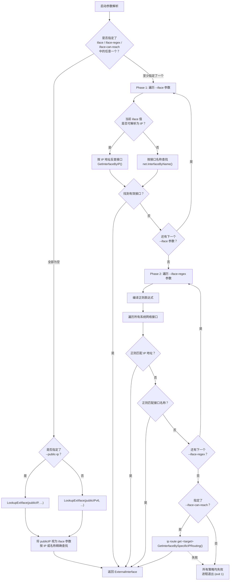

Flannel 在启动时必须确定一个物理网络接口用于节点间通信（inter-host communication）。这个决策直接影响数据平面的封装效率与连通性——选错了接口，VXLAN 封包可能被路由到错误的网卡，WireGuard 隧道可能绑定到内部管理地址。为了应对从单网卡开发机到多网卡生产集群的广泛场景，Flannel 提供了三种递进式的接口选择策略：**精确指定**（`--iface`）、**模式匹配**（`--iface-regex`）和**路由推断**（`--iface-can-reach`）。三者遵循严格的优先级链：`iface` → `iface-regex` → `iface-can-reach` → 默认网关回退。本文将深入每种策略的内部实现机制、多参数组合的行为逻辑，以及在 IPv4/IPv6 双栈环境下的特殊处理方式。如果你尚未了解 Flannel 的整体启动流程，建议先阅读 [整体架构：从 main.go 到各子系统的启动流程](5-zheng-ti-jia-gou-cong-main-go-dao-ge-zi-xi-tong-de-qi-dong-liu-cheng) 和 [网络配置详解：JSON 配置、命令行参数与环境变量](17-wang-luo-pei-zhi-xiang-jie-json-pei-zhi-ming-ling-xing-can-shu-yu-huan-jing-bian-liang)。

Sources: [main.go](main.go#L85-L120), [match.go](pkg/ipmatch/match.go#L53-L58)

## 核心数据结构：ExternalInterface

所有接口选择策略的最终产物都是一个 `ExternalInterface` 结构体。它封装了物理网卡的完整信息，作为后端（VXLAN、host-gw、WireGuard 等）初始化的输入参数被传递到后端管理器中。该结构体在 `backend/common.go` 中定义，包含接口对象本身、接口名称、IPv4/IPv6 地址，以及用于外部通信的 `ExtAddr` 和 `ExtV6Addr`。当用户未显式指定 `--public-ip` 时，`ExtAddr` 会自动回退到 `IfaceAddr`——即选中接口的首个可用 IP 地址。

Sources: [common.go](pkg/backend/common.go#L26-L33), [match.go](pkg/ipmatch/match.go#L279-L315)

## 决策流程全景图

Flannel 的接口选择并非单次判断，而是一个**级联回退链**。下面的流程图展示了 `main()` 函数中从用户参数到最终接口确定的全过程：



Sources: [main.go](main.go#L316-L367), [match.go](pkg/ipmatch/match.go#L53-L234)

## Phase 1：`--iface` 精确指定

`--iface` 是最高优先级的接口选择策略，支持两种匹配语义——**IP 地址**和**接口名称**。它的底层逻辑在 `LookupExtIface` 函数的开头部分实现：首先尝试将传入值解析为 `net.IP`，如果成功则通过 `GetInterfaceByIP()` 或 `GetInterfaceByIP6()` 在所有系统接口中搜索拥有该 IP 的网卡；如果解析失败（不是合法 IP），则按接口名称通过 `net.InterfaceByName()` 直接查找。

一个关键的设计细节是 `flagSlice` 类型——`--iface` 参数可以被**多次指定**，Flannel 会按声明顺序逐个尝试，返回第一个成功匹配的结果。例如 `--iface=eth1 --iface=192.168.1.100 --iface=ens192` 会依次检查 eth1 是否存在、192.168.1.100 是否属于某个接口、ens192 是否存在，一旦某个步骤成功就立即返回。如果所有 `--iface` 都失败了，并不会直接退出进程，而是继续进入 `--iface-regex` 阶段。

Sources: [main.go](main.go#L330-L339), [match.go](pkg/ipmatch/match.go#L72-L116), [main.go](main.go#L61-L70)

### 双栈场景下的 iface 行为

当 Flannel 运行在双栈模式（IPv4 + IPv6 同时启用）时，`--iface` 的 IP 匹配逻辑会根据地址类型分叉处理：如果传入的是 IPv4 地址，通过 `GetInterfaceByIP()` 查找；如果同时指定了 `--public-ipv6`，则会额外通过 `GetInterfaceByIP6()` 查找 IPv6 接口。双栈模式有一个**严格约束**：IPv4 和 IPv6 必须绑定在同一个物理接口上。如果 `--iface` 解析出 eth0 的 IPv4，而 `--public-ipv6` 解析出 eth1 的 IPv6，Flannel 会直接报错退出。

Sources: [match.go](pkg/ipmatch/match.go#L87-L110)

## Phase 2：`--iface-regex` 模式匹配

当所有 `--iface` 参数均未匹配时，Flannel 进入正则表达式匹配阶段。`--iface-regex` 同样支持多次指定，每个正则表达式会被编译为 Go 的 `regexp.Regexp` 对象，然后对系统中的**所有网络接口**进行两轮扫描。

第一轮扫描针对接口的 **IP 地址**：对于 IPv4 栈，调用 `GetInterfaceIP4Addrs()` 获取接口上所有有效的 IPv4 地址（过滤掉 deprecated 地址，优先选择 global unicast），然后用正则逐一匹配每个 IP 的字符串表示；对于 IPv6 栈，逻辑对称地使用 `GetInterfaceIP6Addrs()`；对于双栈模式，则要求同一个接口的 IPv4 地址和 IPv6 地址**都**能被正则匹配才算成功。第二轮扫描（仅在 IP 扫描未命中时触发）针对接口的**名称**：直接用 `regexp.MatchString()` 检查接口名是否匹配正则。如果两轮扫描都未能命中任何接口，Flannel 会生成一个详细的错误消息，列出所有可用接口的名称和 IP 地址以辅助排障。

Sources: [match.go](pkg/ipmatch/match.go#L117-L201), [match.go](pkg/ipmatch/match.go#L318-L325)

### iface-regex 匹配示例

以下表格展示了几个常见的正则表达式及其预期行为：

| 正则表达式 | 匹配目标 | 说明 |
|---|---|---|
| `192\.168\.1\.\d+` | IP 地址 | 匹配 192.168.1.0/24 网段内的接口 IP |
| `eth\d+` | 接口名称 | 匹配 eth0、eth1 等传统命名 |
| `ens\d{3}` | 接口名称 | 匹配 ens192、ens256 等可预测命名 |
| `10\.(42\|43)\.\d+\.\d+` | IP 地址 | 匹配 10.42.0.0/16 或 10.43.0.0/16 中的地址 |
| `(en\|eth)\d+` | 接口名称 | 同时匹配 ens 和 eth 前缀的接口 |

Sources: [match_test.go](pkg/ipmatch/match_test.go#L49-L77)

## Phase 3：`--iface-can-reach` 路由推断

`--iface-can-reach` 采用了一种完全不同的策略——不指定接口本身，而是指定一个**目标可达 IP**，让操作系统路由表来决定使用哪个接口。其底层实现调用 `netlink.RouteGet(targetIP)`，等价于 Linux 下的 `ip route get <target>` 命令。内核路由查找返回的路由条目中包含 `LinkIndex`（出接口索引）和 `Src`（源 IP 地址），Flannel 据此确定通信接口及其绑定的 IP。

这种策略特别适用于**复杂路由环境**：例如节点同时拥有管理网络（eth0）和数据网络（eth1），且路由表根据目标网段分流。通过指定 `--iface-can-reach=<对端节点IP>`，Flannel 能自动选择正确的出接口，无需硬编码接口名或 IP 地址。需要注意的是，此策略在 Windows 平台上不可用，会在运行时直接返回错误。

Sources: [match.go](pkg/ipmatch/match.go#L202-L209), [iface.go](pkg/ip/iface.go#L214-L230)

## 默认回退：系统默认网关接口

当三个参数都未指定时，Flannel 执行**默认回退**逻辑。这里有两种情况：

- 如果指定了 `--public-ip`，则将 publicIP 视为 `--iface` 参数进行 IP 反查
- 如果没有指定 `--public-ip` 但指定了 `--public-ipv6`，则用 publicIPv6 进行查找
- 如果两者都未指定，Flannel 直接查找**系统默认网关接口**——通过 `GetDefaultGatewayInterface()` 获取 IPv4 默认路由（`0.0.0.0/0`）对应的出接口，或通过 `GetDefaultV6GatewayInterface()` 获取 IPv6 默认路由（`::/0`）的出接口

在双栈模式下，IPv4 和 IPv6 的默认路由必须指向同一个物理接口，否则 Flannel 会报错退出，提示两个协议栈的默认路由不一致。

Sources: [main.go](main.go#L318-L327), [match.go](pkg/ipmatch/match.go#L210-L234), [iface.go](pkg/ip/iface.go#L146-L180)

## 三种策略对比与选型指南

| 维度 | `--iface` | `--iface-regex` | `--iface-can-reach` |
|---|---|---|---|
| **匹配方式** | IP 地址或接口名称精确匹配 | 正则表达式匹配 IP 地址或接口名称 | 基于路由表推断出接口 |
| **可否多次指定** | ✅ 支持（按序回退） | ✅ 支持（按序回退） | ❌ 仅支持单个目标 IP |
| **优先级** | 最高 | 次高 | 最低（在前两者未匹配时执行） |
| **跨平台** | Linux + Windows | Linux + Windows | 仅 Linux |
| **适用场景** | 接口名/IP 固定，环境可控 | 多环境统一配置，接口名有规律 | 复杂路由拓扑，不想硬编码接口信息 |
| **错误处理** | 单项失败仅打日志，继续下一项 | 单项失败仅打日志，继续下一项 | 失败仅打日志，继续到最终判定 |
| **典型用法** | `--iface=eth1` | `--iface-regex=ens\d+` | `--iface-can-reach=8.8.8.8` |

Sources: [main.go](main.go#L118-L120), [configuration.md](Documentation/configuration.md#L77-L79)

## IP 地址排序与优选机制

当接口选择确定后，Flannel 还需要从该接口的多个 IP 地址中选择一个作为通信地址。这个排序逻辑在 `compareAddrs()` 函数中实现，按照以下优先级规则：

1. **全局单播地址 > 链路本地地址**：`IsGlobalUnicast()` 的地址优先于 `IsLinkLocalUnicast()`（即 169.254.0.0/16 和 fe80::/10）
2. **永久地址 > 临时地址**：`IFA_F_PERMANENT` 标志位的地址优先于动态分配的地址
3. **非临时地址 > 临时地址**：`IFA_F_TEMPORARY` 标志位的地址排在最后

这意味着如果一个接口同时拥有 192.168.1.10（手动配置）和 192.168.1.20（DHCP 分配），Flannel 会优先选择手动配置的那个。同时，所有被标记为 `IFA_F_DEPRECATED` 的地址会在候选阶段就被完全排除。

Sources: [iface.go](pkg/ip/iface.go#L333-L359), [iface.go](pkg/ip/iface.go#L52-L78)

## 完整优先级链总结

将上述所有策略串联起来，Flannel 的接口选择遵循以下严格的优先级顺序：

```mermaid
flowchart LR
    subgraph Phase1["Phase 1: 精确匹配"]
        A1["--iface arg 1"]
        A2["--iface arg 2"]
        A3["--iface arg N"]
    end
    subgraph Phase2["Phase 2: 正则匹配"]
        B1["--iface-regex 1"]
        B2["--iface-regex 2"]
        B3["--iface-regex N"]
    end
    subgraph Phase3["Phase 3: 路由推断"]
        C1["--iface-can-reach"]
    end
    subgraph Fallback["默认回退"]
        D1["--public-ip 反查"]
        D2["默认网关接口"]
    end

    A1 --> A2 --> A3 -->|"全部失败"| B1
    B1 --> B2 --> B3 -->|"全部失败"| C1
    C1 -->|"失败或未指定"| D1
    D1 -->|"未指定"| D2
    D2 -->|"失败"| E["进程退出 (exit 1)"]

    style Phase1 fill:#e8f5e9
    style Phase2 fill:#fff3e0
    style Phase3 fill:#e3f2fd
    style Fallback fill:#fce4ec
```



**关键行为总结**：当用户显式指定了任意一个选择参数（`--iface`、`--iface-regex` 或 `--iface-can-reach`）时，Flannel 不会回退到默认网关接口。如果所有显式指定的策略都失败，进程将直接以 exit code 1 终止。只有在三个参数全部为空的情况下，才会使用 `--public-ip` 反查或默认网关接口作为最终兜底。

Sources: [main.go](main.go#L316-L367)

## 配置方式

三个接口选择参数均通过命令行参数传入，也可以通过环境变量设置（前缀 `FLANNELD_`，全大写，横杠转下划线）：

| 命令行参数 | 环境变量 | 类型 |
|---|---|---|
| `--iface=eth1` | `FLANNELD_IFACE=eth1` | 可重复字符串 |
| `--iface-regex=ens\d+` | `FLANNELD_IFACE_REGEX=ens\d+` | 可重复字符串 |
| `--iface-can-reach=8.8.8.8` | `FLANNELD_IFACE_CAN_REACH=8.8.8.8` | 单个字符串 |

在 Kubernetes 环境中，这些参数通常配置在 `kube-flannel` DaemonSet 的容器启动参数中。例如：

```yaml
containers:
- name: kube-flannel
  command:
  - /opt/bin/flanneld
  args:
  - --ip-masq
  - --kube-subnet-mgr
  - --iface=eth1
  # 或使用正则：
  # - --iface-regex=ens\d+
  # 或使用路由推断：
  # - --iface-can-reach=10.0.0.1
```

Sources: [main.go](main.go#L118-L120), [configuration.md](Documentation/configuration.md#L77-L79)

## 延伸阅读

- [双栈与纯 IPv6 模式：多协议网络支持](18-shuang-zhan-yu-chun-ipv6-mo-shi-duo-xie-yi-wang-luo-zhi-chi)——理解双栈约束如何影响接口选择
- [网络配置详解：JSON 配置、命令行参数与环境变量](17-wang-luo-pei-zhi-xiang-jie-json-pei-zhi-ming-ling-xing-can-shu-yu-huan-jing-bian-liang)——所有命令行参数的完整参考
- [VXLAN 后端：内核态封装与直连路由](6-vxlan-hou-duan-nei-he-tai-feng-zhuang-yu-zhi-lian-lu-you)——了解选中接口如何影响 VXLAN 隧道建立
- [故障排查指南：日志、连通性与性能诊断](25-gu-zhang-pai-cha-zhi-nan-ri-zhi-lian-tong-xing-yu-xing-neng-zhen-duan)——接口选择失败时的诊断方法