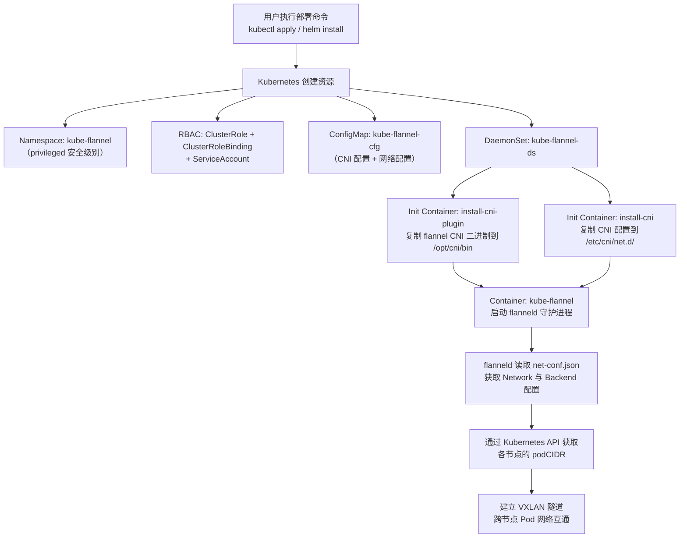
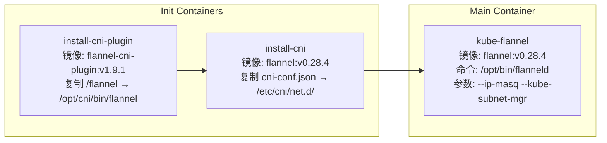
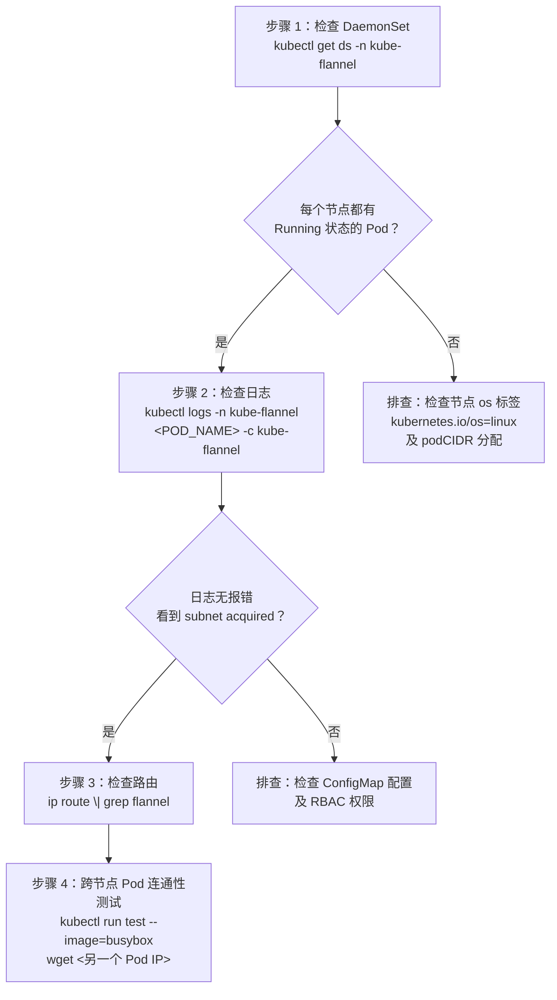

本指南面向初次接触 Flannel 的开发者，旨在帮助你在 Kubernetes 集群中以最快速度完成 Flannel 网络插件的部署与验证。内容涵盖三种主流部署方式（kubectl、Helm、Kustomize）、核心清单文件的结构解析、常用自定义配置方法以及部署后的验证与故障排查技巧。阅读完本页后，你将获得一个跨节点 Pod 互通的正常运行的 Flannel 网络。

Sources: [README.md](README.md#L25-L56), [Documentation/kubernetes.md](Documentation/kubernetes.md#L1-L17)

## 前置条件

在开始部署之前，请确保以下条件已满足：

| 条件 | 说明 | 验证命令 |
|------|------|----------|
| Kubernetes 集群 | 版本 ≥ v1.17，且控制平面已就绪 | `kubectl get nodes` |
| kubectl 命令行 | 已配置与集群的连接 | `kubectl cluster-info` |
| podCIDR 已分配 | 每个节点必须已分配 `podCIDR` | `kubectl get nodes -o jsonpath='{.items[*].spec.podCIDR}'` |
| br_netfilter 内核模块 | 从 Kubernetes 1.30 起 kubeadm 不再自动检查此模块 | `lsmod \| grep br_netfilter` |
| CNI 插件二进制 | Flannel 依赖 `portmap` 等 CNI 插件已安装于 `/opt/cni/bin` | `ls /opt/cni/bin` |

**关于 podCIDR 的关键说明**：如果使用 `kubeadm` 初始化集群，务必在 `kubeadm init` 时传入 `--pod-network-cidr=10.244.0.0/16` 参数，以确保每个节点自动获得 `podCIDR` 分配。Flannel 的 kube subnet manager 依赖节点上已存在的 `podCIDR` 来执行子网分配。

Sources: [Documentation/kubernetes.md](Documentation/kubernetes.md#L5-L6), [Documentation/troubleshooting.md](Documentation/troubleshooting.md#L93-L104), [README.md](README.md#L74)

## 部署架构总览

Flannel 在 Kubernetes 中的部署以 DaemonSet 为核心形态，确保集群中每个 Linux 节点都运行一个 `flanneld` 实例。以下流程图展示了从用户执行部署命令到 Pod 跨节点通信的完整过程：



Sources: [Documentation/kube-flannel.yml](Documentation/kube-flannel.yml#L1-L212), [Documentation/kubernetes.md](Documentation/kubernetes.md#L7-L16)

## 方式一：使用 kubectl 一键部署（推荐入门）

这是最简单直接的部署方式，仅需一条命令：

```bash
kubectl apply -f https://github.com/flannel-io/flannel/releases/latest/download/kube-flannel.yml
```

该清单文件定义了五个核心 Kubernetes 资源，它们的协作关系如下表所示：

| 资源类型 | 名称 | 核心职责 |
|----------|------|----------|
| Namespace | `kube-flannel` | 隔离运行空间，设置 `pod-security.kubernetes.io/enforce: privileged` |
| ServiceAccount | `flannel` | 为 flanneld 提供集群内 API 访问身份 |
| ClusterRole + ClusterRoleBinding | `flannel` | 授予读取 pods、nodes 及 patch nodes/status 的权限 |
| ConfigMap | `kube-flannel-cfg` | 存储 CNI 配置（`cni-conf.json`）和网络配置（`net-conf.json`） |
| DaemonSet | `kube-flannel-ds` | 在每个 Linux 节点运行 flanneld Pod（含 2 个 initContainer + 1 个主容器） |

**默认配置参数**：清单默认使用 `10.244.0.0/16` 作为 Pod 网络 CIDR，`vxlan` 作为后端封装类型。如果你的集群使用不同的 CIDR（例如使用 kubeadm 时指定了其他范围），则需要先下载清单文件并修改其中的 `Network` 字段。

Sources: [Documentation/kube-flannel.yml](Documentation/kube-flannel.yml#L1-L99), [Documentation/kubernetes.md](Documentation/kubernetes.md#L9-L14), [README.md](README.md#L37-L44)

### 自定义 podCIDR 的部署步骤

如果你的集群使用非默认的 Pod 网络 CIDR，请按以下步骤操作：

```bash
# 1. 下载清单文件
wget https://github.com/flannel-io/flannel/releases/latest/download/kube-flannel.yml

# 2. 修改 net-conf.json 中的 Network 值
# 将 "Network": "10.244.0.0/16" 改为你的 CIDR，例如 "10.50.0.0/16"
sed -i 's/10.244.0.0\/16/10.50.0.0\/16/' kube-flannel.yml

# 3. 应用修改后的清单
kubectl apply -f kube-flannel.yml
```

**关键原则**：`net-conf.json` 中的 `Network` 值必须与 `kubeadm init --pod-network-cidr` 传入的值完全一致。两者不匹配是初学者最常见的部署失败原因。

Sources: [README.md](README.md#L43-L44), [Documentation/kube-flannel.yml](Documentation/kube-flannel.yml#L91-L98)

## 方式二：使用 Helm Chart 部署

Helm 提供了更灵活的参数化配置能力，适合需要自定义多种参数的场景：

```bash
# 1. 创建命名空间并设置安全标签（Helm 不会自动创建带有安全标签的命名空间）
kubectl create ns kube-flannel
kubectl label --overwrite ns kube-flannel pod-security.kubernetes.io/enforce=privileged

# 2. 添加 Flannel Helm 仓库
helm repo add flannel https://flannel-io.github.io/flannel/

# 3. 使用默认参数安装
helm install flannel --set podCidr="10.244.0.0/16" --namespace kube-flannel flannel/flannel
```

Helm Chart 的核心配置项定义在 `values.yaml` 中，以下是关键参数说明：

| 参数路径 | 默认值 | 说明 |
|----------|--------|------|
| `podCidr` | `"10.244.0.0/16"` | IPv4 Pod 网络 CIDR，需与集群一致 |
| `podCidrv6` | `""` | IPv6 Pod 网络 CIDR（双栈模式时设置） |
| `flannel.image.repository` | `ghcr.io/flannel-io/flannel` | Flannel 主镜像仓库 |
| `flannel.image.tag` | `v0.28.4` | Flannel 镜像版本 |
| `flannel.backend` | `"vxlan"` | 后端类型：`vxlan`、`host-gw`、`wireguard`、`udp` |
| `flannel.enableNFTables` | `false` | 是否启用实验性 nftables 模式 |
| `flannel.args` | `["--ip-masq", "--kube-subnet-mgr"]` | flanneld 启动参数列表 |
| `netpol.enabled` | `false` | 是否部署 kube-network-policies 网络策略控制器 |

一个带常用自定义的 Helm 安装示例：

```bash
helm install flannel \
  --set podCidr="10.50.0.0/16" \
  --set flannel.backend="host-gw" \
  --set netpol.enabled=true \
  --namespace kube-flannel \
  flannel/flannel
```

Sources: [README.md](README.md#L47-F53), [chart/kube-flannel/values.yaml](chart/kube-flannel/values.yaml#L1-L105)

## 方式三：使用 Kustomize 部署

对于偏好声明式配置管理的团队，Flannel 提供了 Kustomize 支持文件。仓库中的 `Documentation/kustomization/kube-flannel/` 目录包含一个基础 `kustomization.yaml`，可以通过 `newTag` 字段统一控制镜像版本：

```bash
# 使用仓库自带的 kustomization 配置
kubectl kustomize ./Documentation/kustomization/kube-flannel/ | kubectl apply -f -
```

Kustomize 配置的核心内容如下：

```yaml
apiVersion: kustomize.config.k8s.io/v1beta1
kind: Kustomization
commonLabels:
  k8s-app: flannel
resources:
- kube-flannel.yml
images:
- name: ghcr.io/flannel-io/flannel
  newTag: v0.28.4
```

通过修改 `newTag` 字段即可切换到任意版本的 Flannel 镜像，无需手动编辑底层 YAML 文件。

Sources: [Documentation/kustomization/kube-flannel/kustomization.yaml](Documentation/kustomization/kube-flannel/kustomization.yaml#L1-L10), [Makefile](Makefile#L176-L178)

## 清单文件深度解析

理解清单文件的结构对于后续排障和自定义至关重要。以 `kube-flannel.yml` 中的 DaemonSet 为例，它的 Pod 启动流程包含两个初始化容器和一个主容器：



**初始化容器解析**：

- **install-cni-plugin**：将 `flannel-cni-plugin` 二进制文件复制到宿主机的 `/opt/cni/bin/flannel`。这是 kubelet 调用 CNI 接口时所需的插件。
- **install-cni**：将 ConfigMap 中的 `cni-conf.json` 复制到宿主机的 `/etc/cni/net.d/10-flannel.conflist`。kubelet 通过读取此文件得知应使用 flannel CNI 插件。

**主容器关键配置**：

| 配置项 | 值 | 用途 |
|--------|-----|------|
| `hostNetwork: true` | 使用宿主机网络 | flanneld 需要直接操作宿主机网络栈 |
| `priorityClassName` | `system-node-critical` | 确保在资源紧张时不会被驱逐 |
| `securityContext.capabilities` | `NET_ADMIN, NET_RAW` | 创建网络设备、操作路由表所需权限 |
| `--ip-masq` | 启用 IP 伪装 | 对离开 Flannel 网络的流量进行 SNAT |
| `--kube-subnet-mgr` | 使用 Kubernetes API | 通过 Kubernetes API（而非 etcd）管理子网 |
| `EVENT_QUEUE_DEPTH` | `5000` | 控制事件队列深度，适配集群规模 |

**卷挂载说明**：

| 卷名 | 宿主机路径 | 用途 |
|------|-----------|------|
| `run` | `/run/flannel` | flanneld 运行时状态文件（如 `subnet.env`） |
| `cni-plugin` | `/opt/cni/bin` | CNI 插件二进制存放目录 |
| `cni` | `/etc/cni/net.d` | CNI 配置文件存放目录 |
| `flannel-cfg` | ConfigMap | 网络配置和 CNI 配置 |
| `xtables-lock` | `/run/xtables.lock` | iptables 规则操作锁文件 |

Sources: [Documentation/kube-flannel.yml](Documentation/kube-flannel.yml#L100-L212), [Documentation/kubernetes.md](Documentation/kubernetes.md#L9-L14)

## ConfigMap 配置详解

ConfigMap `kube-flannel-cfg` 包含两份关键配置文件，它们共同决定了 Flannel 的行为：

**`net-conf.json`（网络配置）**：

```json
{
  "Network": "10.244.0.0/16",
  "EnableNFTables": false,
  "Backend": {
    "Type": "vxlan"
  }
}
```

| 字段 | 说明 | 常见取值 |
|------|------|----------|
| `Network` | IPv4 Pod 网络地址范围（CIDR 格式） | `10.244.0.0/16`（默认）、自定义值 |
| `EnableNFTables` | 是否使用 nftables 替代 iptables（实验性） | `false`（默认）、`true` |
| `Backend.Type` | 后端封装类型 | `vxlan`（推荐）、`host-gw`、`wireguard`、`udp` |

**`cni-conf.json`（CNI 配置）**：

```json
{
  "name": "cbr0",
  "cniVersion": "0.3.1",
  "plugins": [
    {
      "type": "flannel",
      "delegate": {
        "hairpinMode": true,
        "isDefaultGateway": true
      }
    },
    {
      "type": "portmap",
      "capabilities": { "portMappings": true }
    }
  ]
}
```

该配置使用 CNI 链式插件模式：`flannel` 插件负责创建网桥和 veth 设备，`portmap` 插件负责处理主机端口映射（如 `hostPort`）。`delegate` 中的 `isDefaultGateway: true` 确保 cbr0 网桥被设为 Pod 的默认网关。

Sources: [Documentation/kube-flannel.yml](Documentation/kube-flannel.yml#L61-L98), [Documentation/configuration.md](Documentation/configuration.md#L1-L46)

## 后端类型选择指南

Flannel 支持多种后端封装方式，选择合适的后端直接影响网络性能和兼容性。以下是初学者需要了解的关键对比：

| 后端类型 | 封装开销 | 性能 | 适用场景 | 默认端口 |
|----------|---------|------|----------|----------|
| **vxlan**（默认推荐） | 中等（50 字节头部） | 良好 | 通用场景，云环境和本地均可 | UDP 8472 |
| **host-gw** | 无（纯路由） | 最佳 | 物理机房、二层直连环境 | 无 |
| **wireguard** | 中等 + 加密 | 良好 | 需要加密传输的场景 | UDP 51820 |
| **udp** | 高（用户态封装） | 最差 | 仅用于调试或极老内核 | UDP 8285 |

**切换后端的方法**：修改 ConfigMap 中 `net-conf.json` 的 `Backend.Type` 字段，然后逐个节点重启 flanneld Pod。**注意**：后端类型不能在运行时动态切换，必须重启所有 flanneld 实例。

```bash
# 修改 ConfigMap 中的后端类型
kubectl edit configmap kube-flannel-cfg -n kube-flannel
# 将 "Type": "vxlan" 改为 "Type": "host-gw"

# 逐节点重启 DaemonSet（滚动更新）
kubectl rollout restart daemonset kube-flannel-ds -n kube-flannel
```

**防火墙配置提醒**：如果节点启用了防火墙，必须开放对应后端使用的 UDP 端口。VXLAN 默认使用 UDP 8472，这是云环境部署中最常见的连通性故障原因。

Sources: [Documentation/backends.md](Documentation/backends.md#L1-L27), [Documentation/troubleshooting.md](Documentation/troubleshooting.md#L83-L90)

## 部署验证

部署完成后，按以下步骤逐一验证 Flannel 是否正常运行：



**具体验证命令**：

```bash
# 1. 检查 Flannel DaemonSet 状态
kubectl get ds -n kube-flannel
# 期望输出：DESIRED = READY = 节点数量

# 2. 检查每个 Pod 的运行状态
kubectl get pods -n kube-flannel -o wide
# 期望输出：所有 Pod 状态为 Running

# 3. 查看 flanneld 启动日志（确认 subnet 已获取）
kubectl logs -n kube-flannel <POD_NAME> -c kube-flannel | head -20
# 期望输出包含：使用接口信息、外部地址、子网已获取

# 4. 检查节点路由表（在节点上执行）
ip route | grep flannel
# 期望输出：每个远程节点对应一条路由记录

# 5. 检查节点 podCIDR 分配
kubectl get nodes -o jsonpath='{.items[*].spec.podCIDR}'
# 期望输出：每个节点一个不重叠的 CIDR 段
```

Sources: [Documentation/troubleshooting.md](Documentation/troubleshooting.md#L93-L111), [Documentation/running.md](Documentation/running.md#L1-L9)

## 常见问题与快速排查

以下是初学者最常遇到的问题及其解决方案：

| 问题现象 | 可能原因 | 解决方法 |
|----------|----------|----------|
| Pod 全部 Pending | 节点缺少 `kubernetes.io/os=linux` 标签 | `kubectl label node <NODE> kubernetes.io/os=linux` |
| `node <NAME> pod cidr not assigned` | 节点未分配 podCIDR | 检查 `kubeadm init` 是否传了 `--pod-network-cidr` |
| `failed to read net conf` | ConfigMap 未正确挂载 | 检查 ConfigMap `kube-flannel-cfg` 是否存在 |
| 跨节点 Pod 不通 | 防火墙阻止 VXLAN 端口 | 开放 UDP 8472：`firewall-cmd --add-port=8472/udp` |
| 日志显示 RBAC 权限错误 | ClusterRole/ClusterRoleBinding 缺失 | 重新 apply 完整清单文件 |
| `Error registering network` | 缺少 `NET_ADMIN` 权限 | 确认 PodSecurity 标签设置为 `privileged` |
| flanneld 启动后立刻退出 | `br_netfilter` 模块未加载 | `modprobe br_netfilter` 并设置开机加载 |

**查看日志的推荐方式**：

```bash
# 获取 Flannel Pod 名称
kubectl get pods -n kube-flannel -l app=flannel

# 查看特定 Pod 的日志
kubectl logs --namespace kube-flannel <POD_ID> -c kube-flannel

# 实时跟踪日志（调试时使用）
kubectl logs --namespace kube-flannel <POD_ID> -c kube-flannel -f
```

更全面的故障排查方法请参阅 [故障排查指南：日志、连通性与性能诊断](25-gu-zhang-pai-cha-zhi-nan-ri-zhi-lian-tong-xing-yu-xing-neng-zhen-duan)。

Sources: [Documentation/troubleshooting.md](Documentation/troubleshooting.md#L1-L111), [Documentation/kubernetes.md](Documentation/kubernetes.md#L33-L37)

## 下一步学习路径

部署成功后，建议按以下路径深入学习：

1. **[使用 Helm Chart 自定义部署](4-shi-yong-helm-chart-zi-ding-yi-bu-shu)** — 掌握通过 Helm 灵活定制 Flannel 部署参数的方法
2. **[整体架构：从 main.go 到各子系统的启动流程](5-zheng-ti-jia-gou-cong-main-go-dao-ge-zi-xi-tong-de-qi-dong-liu-cheng)** — 理解 flanneld 内部的模块组成与启动时序
3. **[VXLAN 后端：内核态封装与直连路由](6-vxlan-hou-duan-nei-he-tai-feng-zhuang-yu-zhi-lian-lu-you)** — 深入了解默认后端的实现细节
4. **[网络配置详解：JSON 配置、命令行参数与环境变量](17-wang-luo-pei-zhi-xiang-jie-json-pei-zhi-ming-ling-xing-can-shu-yu-huan-jing-bian-liang)** — 全面掌握所有可配置参数
5. **[构建与开发环境配置](3-gou-jian-yu-kai-fa-huan-jing-pei-zhi)** — 从源码构建 Flannel，参与开发贡献