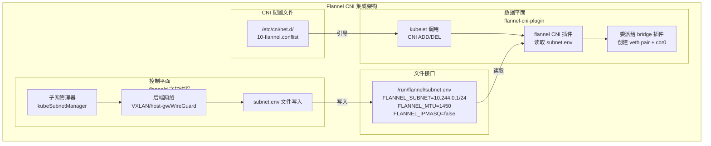
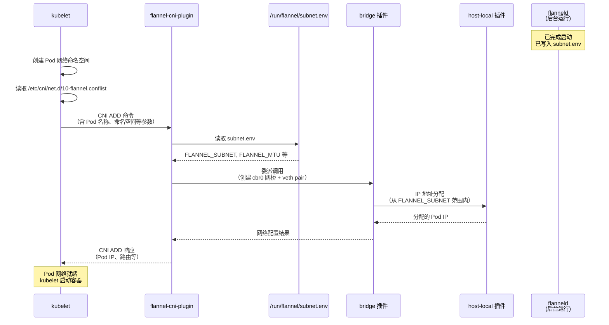

Flannel 的 CNI（Container Network Interface）集成是其实现 Kubernetes Pod 网络的核心机制。理解这一集成方式，需要先认识到 Flannel 采用了**控制平面与数据平面分离**的双组件架构：`flanneld` 守护进程作为控制平面负责子网管理和路由维护，而独立的 `flannel-cni-plugin` 二进制文件作为数据平面，被 kubelet 调用来完成每个 Pod 的网络命名空间配置。两者之间通过一个关键的文件接口——`/run/flannel/subnet.env`——进行协作。本文将深入解析这两个组件的职责边界、协作方式以及完整的部署与运行时交互流程。

Sources: [kube-flannel.yml](Documentation/kube-flannel.yml#L93-L188), [main.go](main.go#L474-L478)

## 架构总览：双组件职责划分

Flannel 的 CNI 集成并非在 `flanneld` 进程内实现 CNI 接口，而是将网络配置职责清晰地拆分为两个独立运行的组件。这种设计使得每个组件可以独立升级、独立故障隔离，符合 Unix 哲学中"做好一件事"的原则。



上图中，**左侧**的 `flanneld` 守护进程运行在 `kube-flannel` 命名空间中的每个节点上，它通过与 Kubernetes API 交互获取子网分配信息，并通过后端网络建立跨节点路由。**右侧**的 `flannel-cni-plugin` 则是由 kubelet 在创建或删除 Pod 时直接调用的短生命周期进程。两者之间的唯一数据桥梁就是 `subnet.env` 文件。

Sources: [kube-flannel.yml](Documentation/kube-flannel.yml#L93-L188), [subnet.go](pkg/subnet/subnet.go#L82-L115)

## 部署机制：Init Container 链式安装

Flannel 的 CNI 集成通过 DaemonSet 中的两个 Init Container 完成安装，这两个容器按严格顺序执行，确保 CNI 二进制和配置文件在 `flanneld` 主容器启动前就已就位。

| 阶段 | Init Container 名称 | 镜像 | 操作 | 目标路径 |
|------|---------------------|------|------|----------|
| 1 | `install-cni-plugin` | `flannel-cni-plugin:v1.9.1-flannel1` | `cp -f /flannel /opt/cni/bin/flannel` | `/opt/cni/bin/` |
| 2 | `install-cni` | `flannel:v0.28.4` | `cp -f /etc/kube-flannel/cni-conf.json /etc/cni/net.d/10-flannel.conflist` | `/etc/cni/net.d/` |

第一个 Init Container 将 `flannel-cni-plugin` 二进制文件复制到节点的 CNI 二进制目录。注意这个 CNI 插件是一个**独立的 Go 项目**（`flannel-io/flannel-cni-plugin`），并不包含在 Flannel 主仓库中，而是作为外部镜像引入。第二个 Init Container 则将 ConfigMap 中的 CNI 配置文件（`cni-conf.json`）复制到 kubelet 扫描的配置目录中。kubelet 会按字母序扫描 `/etc/cni/net.d/` 目录，选择第一个有效的 `.conflist` 或 `.conf` 文件作为默认 CNI 配置，因此文件名 `10-flannel.conflist` 中的前缀数字 `10` 确保了合理的优先级排序。

Sources: [kube-flannel.yml](Documentation/kube-flannel.yml#L127-L148)

## CNI 配置文件详解

Flannel 的 CNI 配置采用 **conflist 格式**（CNI v0.3.1），通过 `plugins` 数组定义了一个插件链，包含两个插件的委派调用：

```json
{
  "name": "cbr0",
  "cniVersion": "0.3.1",
  "plugins": [
    {
      "type": "flannel",
      "delegate": {
        "hairpinMode": true,
        "isDefaultGateway": true
      }
    },
    {
      "type": "portmap",
      "capabilities": {
        "portMappings": true
      }
    }
  ]
}
```

这个配置文件定义了一个名为 `cbr0` 的网络（对应节点上的 Linux 网桥名称），其插件链的工作流程如下：

| 插件 | 类型 | 职责 | 配置参数 |
|------|------|------|----------|
| **flannel** | `flannel` | 读取 `subnet.env`，委派给 `bridge` 和 `host-local` 插件 | `hairpinMode`：启用发夹模式；`isDefaultGateway`：将网桥设为默认网关 |
| **portmap** | `portmap` | 处理 Pod 的 hostPort 映射 | `portMappings`：启用端口映射能力 |

**flannel** 插件本身并不直接创建网络设备，它是一个"元插件"（meta-plugin），负责读取 `subnet.env` 中的子网信息，然后将这些信息传递给它内部委派的 `bridge` 插件（创建 `cbr0` 网桥和 veth pair）和 `host-local` 插件（管理 IP 地址分配）。这种委派模式使得 Flannel 的 CNI 集成能够复用 `containernetworking/plugins` 中经过充分测试的标准插件实现。

Sources: [kube-flannel.yml](Documentation/kube-flannel.yml#L83-L97), [values.yaml](chart/kube-flannel/values.yaml#L57-L74)

## subnet.env：控制平面与数据平面的文件接口

`/run/flannel/subnet.env` 是 Flannel CNI 集成中最为关键的文件接口。当 `flanneld` 完成子网租约获取和后端网络注册后，它会将当前节点的网络配置参数写入此文件：

```bash
FLANNEL_NETWORK=10.244.0.0/16          # 整个 Flannel 网络的 CIDR
FLANNEL_SUBNET=10.244.0.1/24           # 当前节点分配的子网
FLANNEL_IPV6_NETWORK=2001:cafe:42::/56 # IPv6 网络 CIDR（双栈时）
FLANNEL_IPV6_SUBNET=2001:cafe:42::1/64 # 当前节点的 IPv6 子网（双栈时）
FLANNEL_MTU=1450                        # 传输单元大小
FLANNEL_IPMASQ=false                    # 是否启用 IP 伪装
```

该文件的写入发生在 `main.go` 的主流程中，调用链为 `sm.HandleSubnetFile()` → `subnet.WriteSubnetFile()`。`WriteSubnetFile` 函数采用**原子写入**策略：先将内容写入临时文件（`.subnet.env`），然后通过 `os.Rename` 操作将其重命名为目标文件，确保 CNI 插件读取时不会看到部分写入的内容。值得注意的是，子网 IP 在写入前会执行一次自增操作（`sn.IncrementIP()`），这是因为子网的第一个地址通常保留为网关地址，Pod 应从第二个地址开始分配。

对于 Kubernetes 模式，`kubeSubnetManager` 的 `HandleSubnetFile` 方法还会将文件信息缓存在 `snFileInfo` 结构体中，以支持后续因 ClusterCIDR 资源变更而触发的文件更新。

Sources: [main.go](main.go#L474-L479), [subnet.go](pkg/subnet/subnet.go#L82-L115), [kube.go](pkg/subnet/kube/kube.go#L677-L689)

## 完整的 Pod 创建流程

当一个 Pod 被调度到节点上时，kubelet 与 Flannel CNI 组件的交互遵循以下精确的时序：



在这个流程中，kubelet 首先创建 Pod 的网络命名空间（network namespace），然后根据 `/etc/cni/net.d/` 目录中的配置文件调用 CNI 插件。`flannel-cni-plugin` 被调用后，第一步就是读取 `subnet.env` 获取当前节点的子网范围和 MTU 值，然后将这些参数传递给 `bridge` 插件来创建实际的 Linux 网络设备。`bridge` 插件会创建一个 veth pair，一端留在主机网络命名空间并连接到 `cbr0` 网桥，另一端移入 Pod 的网络命名空间作为 eth0 接口。IP 地址分配则由 `host-local` 插件在子网范围内进行本地分配（无需与 API Server 交互）。

Sources: [subnet.go](pkg/subnet/subnet.go#L82-L115), [kube-flannel.yml](Documentation/kube-flannel.yml#L83-L97)

## Node Annotation 与跨节点信息同步

在 Kubernetes 模式下，Flannel 通过 **Node Annotation** 实现跨节点的信息同步。当 `flanneld` 在某个节点上启动时，它会将后端特定的数据写入对应 Node 对象的 Annotation 中，其他节点的 `flanneld` 通过 Watch 机制感知这些变化并建立相应的路由。以下是最关键的 Annotation 键值：

| Annotation 键 | 格式前缀 | 含义 | 示例值 |
|---------------|----------|------|--------|
| `flannel.alpha.coreos.com/backend-type` | `prefix` | 使用的后端类型 | `"vxlan"` |
| `flannel.alpha.coreos.com/backend-data` | `prefix` | IPv4 后端数据（如 VTEP MAC） | `{"VNI":1,"VtepMAC":"12:c6:65:89:b4:e3"}` |
| `flannel.alpha.coreos.com/backend-v6-data` | `prefix` | IPv6 后端数据 | 同上格式 |
| `flannel.alpha.coreos.com/public-ip` | `prefix` | 节点公网 IPv4 地址 | `"192.168.1.100"` |
| `flannel.alpha.coreos.com/public-ipv6` | `prefix` | 节点公网 IPv6 地址 | `"fd00::100"` |
| `flannel.alpha.coreos.com/kube-subnet-mgr` | `prefix` | 标记节点由 Flannel 管理 | `"true"` |
| `flannel.alpha.coreos.com/node-public-ip` | `prefix` | 用户指定的节点 IP | 覆盖自动检测值 |
| `flannel.alpha.coreos.com/public-ip-overwrite` | `prefix` | 强制覆盖公网 IP | 用于 NAT 场景 |

Annotation 的写入发生在 `kubeSubnetManager.AcquireLease` 方法中。该方法首先从 Node 的 `spec.podCIDR`（或 `spec.podCIDRs`）解析出分配的子网，然后将后端数据（如 VXLAN 的 VTEP MAC 地址）和公网 IP 写入 Annotation，最后通过 StrategicMergePatch 更新 Node 对象。同时，通过 Kubernetes Informer 机制，其他节点的 `flanneld` 会收到 Node 更新事件，并在 `handleUpdateLeaseEvent` 中检查关键 Annotation 是否变化，如有变化则触发路由更新。

Sources: [kube.go](pkg/subnet/kube/kube.go#L296-L341), [kube.go](pkg/subnet/kube/kube.go#L419-L492), [kubernetes.md](Documentation/kubernetes.md#L43-L55)

## RBAC 权限要求

Flannel 的 CNI 集成要求特定的 RBAC 权限，这些权限在 `kube-flannel.yml` 中通过 ClusterRole 定义。理解这些权限的必要性有助于排查权限相关的启动故障：

| 资源 | 操作 | 用途说明 |
|------|------|----------|
| `nodes` | `get`, `list`, `watch` | 获取节点 PodCIDR、监听节点变化事件 |
| `nodes/status` | `patch` | 设置节点网络就绪状态条件 |
| `pods` | `get` | 通过 Pod 名称反查所在 Node 名称 |

其中 `nodes` 的 `watch` 权限尤为关键——它是 Informer 机制的基石。`kubeSubnetManager` 在启动时创建一个 Node Informer，通过 `cache.NewInformerWithOptions` 监听所有 Node 对象的增删改事件，并调用 `handleAddLeaseEvent` 和 `handleUpdateLeaseEvent` 进行处理。这个 Informer 还有一个同步超时机制（默认 10 分钟），如果节点缓存未在超时时间内完成同步，`flanneld` 将启动失败（除非设置了 `CONT_WHEN_CACHE_NOT_READY=true` 环境变量）。

Sources: [kube-flannel.yml](Documentation/kube-flannel.yml#L16-L32), [kube.go](pkg/subnet/kube/kube.go#L138-L164)

## Helm Chart 中的 CNI 配置

通过 Helm Chart 部署 Flannel 时，CNI 相关配置提供了灵活的自定义选项。以下表格列出了 `values.yaml` 中与 CNI 集成直接相关的参数：

| 参数路径 | 默认值 | 说明 |
|----------|--------|------|
| `flannel.cniBinDir` | `/opt/cni/bin` | CNI 二进制文件的安装目录 |
| `flannel.cniConfDir` | `/etc/cni/net.d` | CNI 配置文件的安装目录 |
| `flannel.skipCNIConfigInstallation` | `false` | 是否跳过 CNI 配置文件安装（适用于外部管理配置的场景） |
| `flannel.cniConf` | 见下方 | 完整的 CNI 配置 JSON 内容 |
| `flannel.flannel_cni.image.repository` | `ghcr.io/flannel-io/flannel-cni-plugin` | CNI 插件镜像地址 |
| `flannel.flannel_cni.image.tag` | `v1.9.1-flannel1` | CNI 插件镜像版本 |

当 `skipCNIConfigInstallation` 设置为 `true` 时，`install-cni` Init Container 不会被创建。这在 CNI 配置由外部管理系统（如 Canal 或自定义的配置分发工具）提供时非常有用。用户还可以通过 `cniConf` 字段完全自定义 CNI 配置内容，例如修改 `delegate` 参数或添加额外的插件。

Sources: [values.yaml](chart/kube-flannel/values.yaml#L14-L75), [daemonset.yaml](chart/kube-flannel/templates/daemonset.yaml#L43-L56)

## 与其他项目的集成模式

Flannel 的 CNI 集成设计使其可以灵活地与其他 Kubernetes 网络项目协作。当前已知的集成模式包括以下几种：

**Canal 模式**是 Flannel 与 Calico 的联合部署方案。在这种模式下，Flannel 负责跨节点 Pod 网络的互联互通，而 Calico 负责网络策略的执行。Canal 复用了 Flannel 的子网管理和后端封装机制，但将 CNI 配置中的网桥插件替换为 Calico 的实现，从而在 Flannel 的网络数据平面之上叠加了网络策略能力。

**kube-network-policies 模式**是 Flannel 社区推荐的原生网络策略解决方案。从 Flannel v0.25.5 开始，可以在 Helm 部署中通过 `--set netpol.enabled=true` 启用 `kube-network-policies` 控制器，它会作为同一个 Pod 中的 Sidecar 容器运行，无需修改 CNI 配置即可提供基本的网络策略支持。

**K3s/RKE2 嵌入模式**中，Flannel 被直接编译进 K3s 发行版中，作为默认的 CNI 实现。这种模式下，`flanneld` 不是作为独立的 DaemonSet 运行，而是作为 K3s agent 进程的一部分嵌入运行，但 CNI 插件的调用机制保持不变。

Sources: [integrations.md](Documentation/integrations.md), [netpol.md](Documentation/netpol.md)

## 关键配置路径与排障要点

当 CNI 集成出现问题时，以下路径和检查点是最有效的排查起点：

| 路径/检查项 | 预期内容 | 排查命令 |
|-------------|----------|----------|
| `/run/flannel/subnet.env` | 包含当前节点子网和 MTU | `cat /run/flannel/subnet.env` |
| `/etc/cni/net.d/10-flannel.conflist` | 有效的 conflist JSON | `cat /etc/cni/net.d/10-flannel.conflist` |
| `/opt/cni/bin/flannel` | CNI 插件二进制文件 | `ls -la /opt/cni/bin/flannel` |
| Node `spec.podCIDR` | 非空的 CIDR 字符串 | `kubectl get node <NODE> -o jsonpath='{.spec.podCIDR}'` |
| Node Annotation `kube-subnet-mgr` | 值为 `"true"` | `kubectl get node <NODE> -o jsonpath='{.metadata.annotations}'` |
| `br_netfilter` 模块 | 已加载 | `ls /proc/sys/net/bridge/bridge-nf-call-iptables` |

最常见的 CNI 集成故障包括：节点缺少 `podCIDR` 分配（需确保 kube-controller-manager 启用了 `--allocate-node-cidrs` 且 kubeadm 使用了 `--pod-network-cidr`）、`subnet.env` 文件为空或不存在（说明 `flanneld` 未完成启动）、以及 `br_netfilter` 内核模块未加载（导致跨命名空间的 iptables 规则失效）。Flannel 在启动时会主动检查 `bridge-nf-call-iptables` 和 `bridge-nf-call-ip6tables` 的存在性，若缺失则直接退出。

Sources: [main.go](main.go#L273-L287), [troubleshooting.md](Documentation/troubleshooting.md#L57-L112)

## 延伸阅读

Flannel 的 CNI 集成涉及多个子系统的协作。如果你想进一步了解相关机制，建议按以下顺序深入阅读：

- **[整体架构：从 main.go 到各子系统的启动流程](5-zheng-ti-jia-gou-cong-main-go-dao-ge-zi-xi-tong-de-qi-dong-liu-cheng)**：理解 `flanneld` 守护进程的完整启动序列以及 `subnet.env` 写入在其中的时序位置
- **[Kubernetes 子网管理器：基于 API 的声明式管理](13-kubernetes-zi-wang-guan-li-qi-ji-yu-api-de-sheng-ming-shi-guan-li)**：深入了解 Node Informer 和 Annotation 写入的具体实现
- **[网络配置详解：JSON 配置、命令行参数与环境变量](17-wang-luo-pei-zhi-xiang-jie-json-pei-zhi-ming-ling-xing-can-shu-yu-huan-jing-bian-liang)**：掌握 `net-conf.json` 中所有配置项对 CNI 行为的影响
- **[双栈与纯 IPv6 模式：多协议网络支持](18-shuang-zhan-yu-chun-ipv6-mo-shi-duo-xie-yi-wang-luo-zhi-chi)**：了解双栈场景下 `subnet.env` 中 IPv6 字段的处理方式
- **[故障排查指南：日志、连通性与性能诊断](25-gu-zhang-pai-cha-zhi-nan-ri-zhi-lian-tong-xing-yu-xing-neng-zhen-duan)**：掌握 CNI 集成相关问题的系统性诊断方法