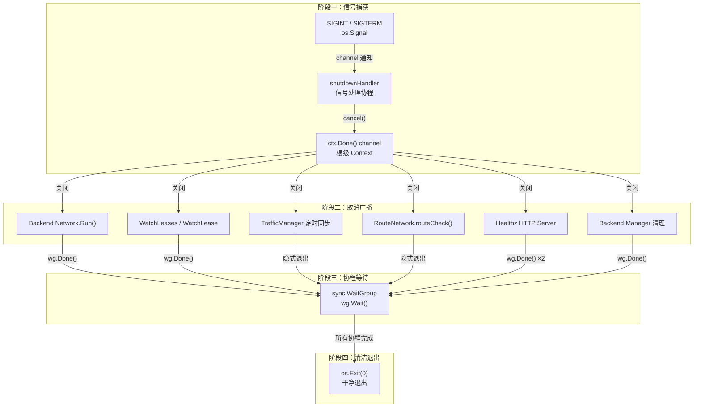
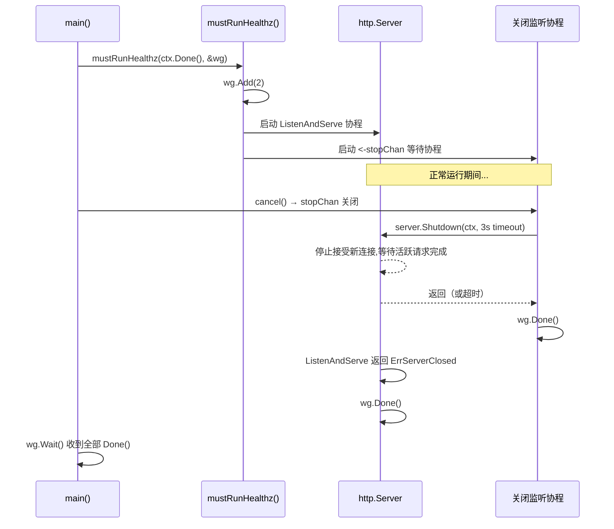
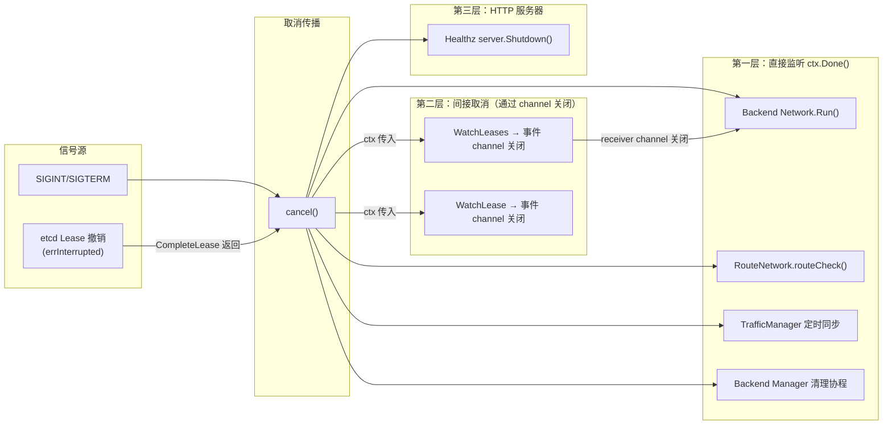
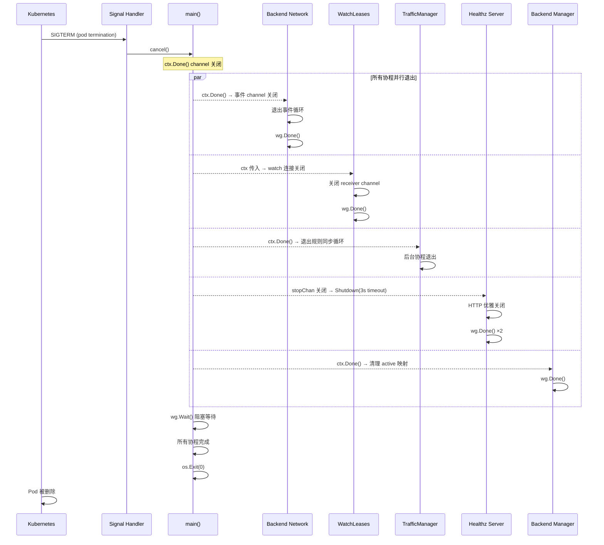

Flannel 作为 Kubernetes 集群中每个节点上运行的网络守护进程，其**存活探测能力**和**有序关闭流程**直接关系到 Pod 网络的稳定性。本文深入剖析 Flannel 的健康检查 HTTP 端点、信号驱动的优雅关闭、基于 `context.Context` 的全链路取消传播，以及 systemd 就绪通知与 Kubernetes Node 状态联动等核心机制。这些机制共同构成了一个"信号捕获 → 取消广播 → 协程等待 → 清洁退出"的四阶段关闭模型，确保 Flannel 在终止时不会留下孤立路由或损坏的 iptables 规则。

Sources: [main.go](main.go#L1-L108)

## 整体架构：四阶段生命周期模型

Flannel 的健康检查与关闭机制围绕一个**根级 `context.Context`** 构建，所有子系统（后端网络、子网监听、流量管理器、健康检查服务器）均作为独立协程运行，通过 `context.WithCancel` 产生的取消函数实现统一生命周期管理。



**核心设计原则**：Flannel 的主函数通过 `sync.WaitGroup` 精确追踪每一个通过 `wg.Add(1)` 注册的协程。关闭时，`cancel()` 只发送取消信号，**不强制终止**——每个协程需自行从 `ctx.Done()` 接收信号并优雅退出，最终由主函数在 `wg.Wait()` 处阻塞等待全部完成。这种"协作式取消"模式避免了资源泄漏。

Sources: [main.go](main.go#L234-L266), [main.go](main.go#L500-L508)

## 健康检查端点：healthz 服务器

### 端点配置与行为

Flannel 内置了一个极简的 HTTP 健康检查服务器，提供 `/healthz` 端点供外部探针使用。其行为是**纯粹的存活检查**——只要进程在运行就返回 `200 OK`，不检查子网租约状态、后端连通性或路由一致性。

| 参数 | 命令行标志 | 默认值 | 说明 |
|------|-----------|--------|------|
| 监听 IP | `--healthz-ip` | `0.0.0.0` | healthz 服务器绑定的 IP 地址 |
| 监听端口 | `--healthz-port` | `0`（禁用） | 监听端口，`0` 表示不启动 healthz |
| 端点路径 | 硬编码 | `/healthz` | 唯一的检查端点 |
| 响应内容 | 硬编码 | `flanneld is running` | HTTP 200 响应体 |

启用 healthz 的命令行示例：`--healthz-ip=0.0.0.0 --healthz-port=10254`。当 `--healthz-port` 大于 0 时，`mustRunHealthz` 函数启动两个协程：一个用于 HTTP 服务器监听，另一个用于等待关闭信号并执行优雅关闭。

Sources: [main.go](main.go#L94-L96), [main.go](main.go#L267-L269), [main.go](main.go#L546-L583)

### healthz 的启动与优雅关闭

`mustRunHealthz` 的实现揭示了 Flannel 对 HTTP 服务器生命周期的精细控制。该函数向 `WaitGroup` 注册了 **两个** 协程（`wg.Add(2)`），分别负责服务器的运行和关闭：



**关键设计细节**：关闭监听协程使用 `context.WithTimeout` 创建了一个独立于主 context 的 3 秒超时上下文，确保即使主 context 已被取消，HTTP 服务器仍能获得一个短暂的优雅关闭窗口。`http.Server.Shutdown` 会停止接受新连接但等待现有请求完成，超时后强制关闭。如果 `ListenAndServe` 因非 `http.ErrServerClosed` 错误而退出，则直接 `panic`——这表明 healthz 服务器遇到不可恢复的故障。

Sources: [main.go](main.go#L546-L583)

### 默认禁用状态

值得注意的是，**默认配置下 healthz 是禁用的**（`--healthz-port=0`）。无论是静态 Manifest [`kube-flannel.yml`](Documentation/kube-flannel.yml) 还是 [Helm Chart](chart/kube-flannel/templates/daemonset.yaml) 均未启用此端口，也未配置 Kubernetes 的 liveness/readiness Probe。这意味着在标准部署中，Flannel 的进程级存活完全依赖 Kubernetes DaemonSet 控制器的默认行为（进程退出后自动重启 Pod）。

Sources: [Documentation/kube-flannel.yml](Documentation/kube-flannel.yml#L160-L194), [chart/kube-flannel/templates/daemonset.yaml](chart/kube-flannel/templates/daemonset.yaml#L66-L101)

## 信号处理与 Context 取消传播

### shutdownHandler：信号到取消的桥梁

`shutdownHandler` 是 Flannel 关闭流程的触发器，运行在独立协程中，通过 `select` 语句等待两种退出条件：

```go
func shutdownHandler(ctx context.Context, sigs chan os.Signal, cancel context.CancelFunc) {
    select {
    case <-ctx.Done():
        log.Info("Stopping shutdownHandler...")
    case <-sigs:
        cancel()
        log.Info("shutdownHandler sent cancel signal...")
    }
    signal.Stop(sigs)
}
```

该函数监听 `SIGINT`（Ctrl+C）和 `SIGTERM`（Kubernetes 发送的终止信号）两种信号。收到信号后，调用 `cancel()` 取消根级 Context，然后调用 `signal.Stop(sigs)` 注销信号处理器，恢复操作系统的默认行为（直接终止进程）——这是为后续可能的异常情况做的安全兜底。如果 Context 先于信号被取消（例如 etcd 模式下的租约撤销），`shutdownHandler` 也会正常退出。

Sources: [main.go](main.go#L254-L265), [main.go](main.go#L510-L523)

### Context 取消的传播路径

`cancel()` 调用后，`ctx.Done()` channel 被关闭，所有监听该 channel 的协程都会收到退出信号。以下是完整的传播路径分析：



**第一层**：直接在 `for-select` 循环中检查 `ctx.Done()` 的协程。包括后端网络的 `Run()` 方法（如 `RouteNetwork.Run` 监听事件 channel，当 channel 关闭时退出）、`routeCheck` 定时路由恢复协程、iptables/nftables 规则的周期性重同步协程，以及 Backend Manager 中清理 `active` 映射的协程。

**第二层**：通过子网管理器的 `WatchLeases` / `WatchLease` 间接取消。这些方法将 `ctx` 传入 Kubernetes client-go 的 Informer 或 etcd 的 watch 机制，当 context 取消时，底层 watch 连接关闭，事件 channel 随之关闭，触发 `RouteNetwork.Run` 的事件循环退出。

**第三层**：healthz HTTP 服务器通过 `ctx.Done()`（即 `stopChan`）触发独立的带超时关闭流程。

Sources: [main.go](main.go#L234-L266), [pkg/backend/route_network.go](pkg/backend/route_network.go#L53-L81), [pkg/backend/route_network.go](pkg/backend/route_network.go#L212-L222), [pkg/trafficmngr/iptables/iptables.go](pkg/trafficmngr/iptables/iptables.go#L384-L396), [pkg/backend/manager.go](pkg/backend/manager.go#L73-L86)

## 后端网络的关闭行为

### SimpleNetwork：最简单的退出模式

`SimpleNetwork.Run()` 的实现是 Go 语言中"等待 Context 取消"的经典范式：

```go
func (*SimpleNetwork) Run(ctx context.Context) {
    <-ctx.Done()
}
```

该后端（alloc 等）在启动后直接阻塞在 `ctx.Done()` 上，不执行任何路由维护工作。当 context 取消时，`Run()` 立即返回，通过 `wg.Done()` 通知主函数。

Sources: [pkg/backend/simple_network.go](pkg/backend/simple_network.go#L36-L38)

### RouteNetwork：事件驱动的多协程退出

`RouteNetwork`（被 host-gw、IPIP 等 Route-based 后端使用）的 `Run()` 方法内部管理一个子 `WaitGroup`，启动了两个子协程：

1. **`subnet.WatchLeases` 协程**：通过子网管理器监听集群范围内的子网事件。当 `ctx` 取消时，底层 watch 连接关闭，事件 channel 随之关闭。
2. **`routeCheck` 协程**：每 10 秒检查一次路由表中是否存在预期路由，丢失时自动恢复。通过 `ctx.Done()` 退出循环。

`Run()` 的主循环从事件 channel 读取数据。当该 channel 因 context 取消而关闭时，`ok` 变为 `false`，`Run()` 通过 `defer wg.Wait()` 等待两个子协程完成后返回。这种**嵌套 WaitGroup** 模式确保了子协程不会在父协程退出后泄漏。

Sources: [pkg/backend/route_network.go](pkg/backend/route_network.go#L53-L81), [pkg/backend/route_network.go](pkg/backend/route_network.go#L212-L222)

## 子网租约撤销与关闭触发

在 **etcd 子网管理器** 模式下，存在一种特殊的关闭触发路径：**租约撤销**。`CompleteLease` 方法在主协程中阻塞运行，同时监听两个事件源：

- **定时续约**：在租约到期前 `renewMargin` 分钟（默认 60 分钟），主动调用 `RenewLease` 续约。续约失败时以 1 分钟间隔重试。
- **租约事件**：通过 `WatchLease` 监听自身子网的租约事件。如果收到 `EventRemoved`（租约被外部删除），`CompleteLease` 返回 `errInterrupted`。

```go
case e, ok := <-evts:
    if !ok {
        log.Infof("Stopped monitoring lease")
        return errCanceled
    }
    switch e.Type {
    case lease.EventAdded:
        myLease.Expiration = e.Lease.Expiration
    case lease.EventRemoved:
        log.Error("Lease has been revoked. Shutting down daemon.")
        return errInterrupted
    }
```

主函数检测到 `errInterrupted` 后调用 `cancel()`，触发全局优雅关闭。这是 Flannel 唯一一个**非信号驱动**的关闭路径，反映了一种"被动驱逐"的设计哲学：当 etcd 中的租约被删除时，Flannel 守护进程主动退出，等待 Kubernetes 重新调度。

在 **Kubernetes 子网管理器** 模式下，`CompleteLease` 的行为完全不同——它仅执行一次性的 `NodeNetworkUnavailable` 条件设置（详见下节），不涉及租约续约循环。

Sources: [pkg/subnet/etcd/local_manager.go](pkg/subnet/etcd/local_manager.go#L362-L407), [main.go](main.go#L494-L501)

## Kubernetes Node 状态联动

### NodeNetworkUnavailable 条件设置

在 Kubernetes 模式下，`CompleteLease` 的核心职责是将节点的 `NodeNetworkUnavailable` 条件设置为 `False`。这是 Kubernetes 节点生命周期中的重要状态转换——新建节点的 `NodeNetworkUnavailable` 默认为 `True`，表示节点网络尚未就绪。

```go
condition := v1.NodeCondition{
    Type:               v1.NodeNetworkUnavailable,
    Status:             v1.ConditionFalse,
    Reason:             "FlannelIsUp",
    Message:            "Flannel is running on this node",
    LastTransitionTime: metav1.Now(),
    LastHeartbeatTime:  metav1.Now(),
}
```

Flannel 通过 PatchStatus API 将此条件写入 Node 对象，使用 `--set-node-network-unavailable` 标志控制（默认 `true`）。如果集群中有多个 CNI 插件，可通过设置为 `false` 来避免冲突。此操作在 Flannel 成功获取子网租约、注册后端网络并写入子网文件之后执行，确保只有在网络完全就绪时才报告节点可用。

Sources: [pkg/subnet/kube/kube.go](pkg/subnet/kube/kube.go#L631-L669), [main.go](main.go#L100)

### systemd 就绪通知

Flannel 在完成所有初始化步骤（子网获取、后端注册、流量管理器初始化、子网文件写入、后端网络启动）后，调用 `daemon.SdNotify(false, "READY=1")` 向 systemd 发送就绪通知：

```go
_, err = daemon.SdNotify(false, "READY=1")
```

这使得在 systemd 管理下运行的 Flannel 能够正确集成到服务启动顺序中，`READY=1` 之后的 `Type=notify` systemd 服务才会被认为启动完成。注意 `SdNotify` 的第一个参数 `false` 表示不检查是否真正运行在 systemd 环境中——在非 systemd 环境（如 Kubernetes Pod）中，此调用会静默失败。

Sources: [main.go](main.go#L489-L492)

## 流量管理器的生命周期与清理

### 启动时的旧规则清理

Flannel 在启动时会清理上一次运行遗留的 iptables/nftables 规则，无论它们是由哪个后端创建的。这是一个关键的**幂等性保障**机制——如果 Flannel 以不同后端类型重启（例如从 VXLAN 切换到 host-gw），旧后端的规则不会干扰新后端的运行。

在 iptables 模式下，`CleanUp` 清除 `FLANNEL-POSTRTG` 和 `FLANNEL-FWD` 两个自定义链（IPv4 和 IPv6 各一组）。在 nftables 模式下，直接删除整个 flannel 相关的 table。清理使用 `ClearAndDeleteChain`（iptables）或事务性 `Delete`（nftables），即使规则不存在也不会报错。

Sources: [main.go](main.go#L387-L397), [pkg/trafficmngr/iptables/iptables.go](pkg/trafficmngr/iptables/iptables.go#L58-L90), [pkg/trafficmngr/nftables/nftables.go](pkg/trafficmngr/nftables/nftables.go#L279-L302)

### 规则的周期性维护

iptables 规则通过 `SetupAndEnsureMasqRules` 和 `SetupAndEnsureForwardRules` 两个方法实现"设置并持续保障"模式。这两个方法各自启动后台协程，在 `for-select` 循环中每 `resyncPeriod`（默认 5 秒）重新应用规则：

```go
for {
    select {
    case <-ctx.Done():
        return
    case <-time.After(time.Duration(resyncPeriod) * time.Second):
        if err := ensureIPTables(ipt, iptRestore, rules); err != nil {
            log.Errorf("Failed to ensure iptables rules: %v", err)
        }
    }
}
```

这种设计应对了 iptables 规则可能被其他组件（如 Docker、kube-proxy）意外覆盖的场景。`ctx.Done()` 触发退出时，这些协程不会主动清理规则——清理留待下次启动时由 `CleanUp` 完成。这是一个有意的权衡：关闭时不删规则意味着短暂重启期间 Pod 流量不受影响。

Sources: [pkg/trafficmngr/iptables/iptables.go](pkg/trafficmngr/iptables/iptables.go#L384-L396)

## 路由自动恢复机制

`RouteNetwork` 内建的 `routeCheck` 协程提供了**持续的路由健康检查**，与优雅关闭机制共享同一套 context 取消机制：

```go
func (n *RouteNetwork) routeCheck(ctx context.Context) {
    for {
        select {
        case <-ctx.Done():
            return
        case <-time.After(routeCheckRetries * time.Second):
            n.checkSubnetExistInV4Routes()
            n.checkSubnetExistInV6Routes()
        }
    }
}
```

每隔 `routeCheckRetries`（10 秒），该协程遍历所有已知路由，检查它们是否仍存在于内核路由表中。丢失的路由会被自动重新添加。这是 Flannel 运行时自愈能力的重要组成部分——即使外部因素（如网络配置变更）删除了路由，Flannel 也能在 10 秒内恢复。当 context 取消时，该协程在下一个 10 秒周期内退出。

Sources: [pkg/backend/route_network.go](pkg/backend/route_network.go#L212-L222), [pkg/backend/route_network.go](pkg/backend/route_network.go#L232-L261)

## 完整关闭时序分析

以下时序图展示了 Kubernetes 环境下（`SIGTERM` 触发）的完整关闭流程：



Sources: [main.go](main.go#L481-L508)

## 配置参数汇总

| 参数 | 标志 | 默认值 | 关联机制 |
|------|------|--------|---------|
| healthz 监听 IP | `--healthz-ip` | `0.0.0.0` | 健康检查端点绑定地址 |
| healthz 监听端口 | `--healthz-port` | `0`（禁用） | 健康检查端点端口，0 禁用 |
| 子网续约提前量 | `--subnet-lease-renew-margin` | `60`（分钟） | etcd 模式下提前续约的时间窗口 |
| iptables 重同步间隔 | `--iptables-resync` | `5`（秒） | 流量管理器规则重同步周期 |
| 设置 NodeNetworkUnavailable | `--set-node-network-unavailable` | `true` | K8s 模式下是否更新 Node 状态 |
| 路由检查间隔 | 硬编码常量 | `10`（秒） | `routeCheckRetries` 路由自动恢复周期 |
| healthz 关闭超时 | 硬编码常量 | `3`（秒） | HTTP 服务器优雅关闭超时 |

Sources: [main.go](main.go#L110-L138), [pkg/backend/route_network.go](pkg/backend/route_network.go#L33-L35)

## 设计权衡与演进方向

**健康检查的局限性**：当前 `/healthz` 端点仅检测进程存活，不反映网络功能的实际健康状态。一个更完善的实现应检查子网租约有效性、后端设备存在性和路由完整性。这也解释了为什么默认部署未启用 healthz——一个总是返回 OK 的端点对 Kubernetes 的 livenessProbe 几乎没有实际价值。

**关闭时不清理 iptables 规则**：这是一个有意的设计决策。关闭阶段删除规则意味着短暂重启期间 Pod 流量中断；而保留规则意味着旧规则可能在后端类型变更时产生冲突（通过启动时 `CleanUp` 解决）。当前策略倾向于"零中断"而非"零遗留"。

**无主动资源回收**：Flannel 在关闭时不主动删除 VXLAN 设备、WireGuard 接口或主机路由。这些资源在 Pod 重新调度后被新 Flannel 实例接管，或在节点重启后自动清除。这种"粗粒度生命周期管理"简化了关闭逻辑，但要求节点级别的状态最终一致性。

如需了解 Flannel 各后端如何实现 `Run()` 方法的具体差异，请参阅 [VXLAN 后端：内核态封装与直连路由](6-vxlan-hou-duan-nei-he-tai-feng-zhuang-yu-zhi-lian-lu-you) 和 [host-gw 后端：基于二层直连的高性能路由](7-host-gw-hou-duan-ji-yu-er-ceng-zhi-lian-de-gao-xing-neng-lu-you)。关于子网租约的续约机制细节，请参阅 [子网租约生命周期：获取、续约与事件监听](14-zi-wang-zu-yue-sheng-ming-zhou-qi-huo-qu-xu-yue-yu-shi-jian-jian-ting)。流量管理器规则的生命周期管理在 [iptables 模式：MASQUERADE 与 FORWARD 规则管理](15-iptables-mo-shi-masquerade-yu-forward-gui-ze-guan-li) 中有更详细的解析。